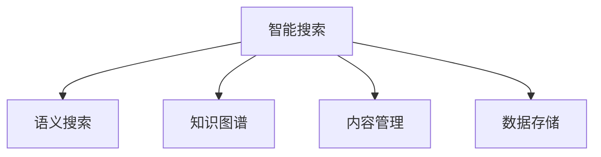

                 

# 人类知识的保存技术：灯塔指引未来

> 关键词：知识保存，数字化转型，智能搜索，语义搜索，机器学习，数据存储，内容管理，元数据，知识图谱，人工智能，智慧社会

## 1. 背景介绍

### 1.1 问题由来
在现代社会中，知识的积累和传播速度前所未有，对人类文明进步起到了至关重要的作用。然而，面对海量的信息和不断涌现的新知识，如何高效地保存、组织和利用这些知识，成为困扰人类的难题。传统的人类知识保存方式，如纸质图书、档案文件等，虽然在一定程度上满足了历史上的知识保存需求，但面临着诸如存储成本高昂、查找效率低下、易损坏丢失等诸多问题。而随着数字技术的快速发展，人类知识保存的方式正经历着一场深刻的变革。

### 1.2 问题核心关键点
为了有效应对数字化时代对知识保存技术的挑战，本节将介绍几种核心技术，以及它们之间的联系：

1. **智能搜索**：基于机器学习等技术的智能搜索系统，能快速在海量信息中找到用户所需的内容，大大提升了信息检索的效率。
2. **语义搜索**：超越传统关键词匹配的语义搜索技术，能理解用户的查询意图，提供更精准的结果。
3. **知识图谱**：通过实体关系图谱，将结构化数据和非结构化数据有机整合，构建出知识网络，便于机器理解和应用。
4. **内容管理**：利用元数据管理、版本控制等技术，确保内容的准确性和一致性。
5. **数据存储**：通过分布式存储、压缩算法等技术，实现数据的长期保存和高效访问。

这些技术相互关联，共同构成了现代知识保存的基础框架，为智慧社会构建了必要的技术支撑。

### 1.3 问题研究意义
随着知识保存技术的不断进步，人类可以更高效地利用积累下来的智慧。这不仅有助于科学研究的加速，还能够推动教育、文化、经济等多个领域的发展，构建更加智慧和可持续发展的未来。

通过研究这些关键技术及其应用，可以：
1. **提升知识检索效率**。智能搜索和语义搜索技术将大幅减少查找时间，让用户更快地获取所需信息。
2. **促进知识共享和创新**。知识图谱和内容管理技术使得知识的共享和创新变得更加容易，加速了科技的进步。
3. **保障知识的长期保存**。分布式存储和数据压缩等技术保证了知识资料的长期可访问性和完整性。
4. **增强信息的安全性**。通过加密和访问控制等手段，保护数据不受非法访问和恶意篡改。

## 2. 核心概念与联系

### 2.1 核心概念概述

为更好地理解知识保存技术的核心原理，本节将介绍几个密切相关的核心概念：

- **智能搜索**：利用自然语言处理和机器学习技术，自动解析用户查询意图，从大量文本、图片、视频等数据中提取出相关信息，并提供精准搜索结果。
- **语义搜索**：超越传统基于关键词的搜索，理解查询中的语义关系，生成更符合用户意图的搜索结果。
- **知识图谱**：一种通过实体关系表示知识的方式，将大量分散的知识点进行整合，构建出易于计算机理解和应用的知识网络。
- **内容管理**：通过元数据、版本控制、权限管理等手段，对信息进行系统化管理，确保内容的完整性和一致性。
- **数据存储**：采用分布式存储、数据压缩、数据加密等技术，实现数据的长期保存和高效访问。

这些核心概念之间的逻辑关系可以通过以下Mermaid流程图来展示：



这个流程图展示出了智能搜索、语义搜索、知识图谱、内容管理和数据存储之间的联系：

1. 智能搜索是核心入口，通过对用户查询的解析，实现对海量数据的检索和筛选。
2. 语义搜索在智能搜索的基础上，进一步提升查询结果的相关性和准确性。
3. 知识图谱提供结构化知识，为查询提供背景和关联信息。
4. 内容管理确保数据的有序性和一致性，为长期保存提供支持。
5. 数据存储则提供了数据长期保存和高效访问的基础设施。

这些概念共同构成了现代知识保存的基础框架，使得知识的保存、检索和利用变得更加高效和精准。

## 3. 核心算法原理 & 具体操作步骤
### 3.1 算法原理概述

知识保存技术的核心在于构建一个高效、准确、可靠的知识检索系统。基于智能搜索和语义搜索的技术，系统能够理解用户的查询意图，并从大量数据中快速提取相关信息。在此基础上，知识图谱提供了结构化知识，内容管理和数据存储则确保了知识的长期保存和高效访问。

### 3.2 算法步骤详解

**Step 1: 智能搜索系统设计**

- **收集和预处理数据**：收集各种类型的信息源，如文本、图片、视频等，并进行格式转换、去重和预处理。
- **构建搜索索引**：对预处理后的数据进行文本分析、分词和索引构建。
- **设计搜索算法**：选择合适的算法如TF-IDF、BM25等，计算查询与文档的相关性。
- **训练模型**：利用历史搜索数据训练模型，提升搜索精度。

**Step 2: 语义搜索实现**

- **构建语义图谱**：将文本数据转换为语义图谱，构建实体和关系网络。
- **匹配查询语义**：使用图谱匹配算法，理解查询中的语义关系。
- **优化搜索结果**：根据匹配结果，排序并返回相关性更高的搜索结果。

**Step 3: 知识图谱构建**

- **实体抽取**：从文本数据中提取实体和关系，建立实体关系图。
- **关系推理**：利用逻辑推理和规则库，增强知识图谱的准确性和完整性。
- **图谱更新**：定期更新知识图谱，确保知识的最新性。

**Step 4: 内容管理流程**

- **元数据管理**：定义和维护数据元数据，确保内容一致性。
- **版本控制**：对文档进行版本管理，跟踪变更历史。
- **权限控制**：根据用户角色和权限，限制对内容的访问。

**Step 5: 数据存储策略**

- **分布式存储**：使用Hadoop、Spark等分布式系统，确保数据的高可用性和扩展性。
- **数据压缩**：利用Gzip、Snappy等压缩算法，减小存储和传输成本。
- **数据加密**：采用AES、RSA等加密算法，保护数据安全。

### 3.3 算法优缺点

智能搜索和语义搜索具有以下优点：
1. **提高查询效率**：通过语义匹配，能够快速找到符合用户需求的信息。
2. **降低人工成本**：自动化处理大量数据，减少人工干预。
3. **增强用户体验**：基于语义的搜索结果更符合用户意图，提升满意度。

但其缺点也不可忽视：
1. **对语料要求高**：高质量的语料和标注是系统有效运行的基石。
2. **算法复杂度高**：语义匹配和实体抽取等过程，计算复杂度较高。
3. **更新维护困难**：随着数据量的增长，图谱和索引的维护需要大量资源。

知识图谱和内容管理技术的优点在于：
1. **结构化知识表示**：通过图谱结构，便于机器理解和应用。
2. **易于扩展**：新增数据时，可以动态更新知识图谱和元数据。
3. **数据一致性**：确保数据的准确性和一致性，避免冗余和错误。

但其缺点也较为显著：
1. **构建复杂**：知识图谱的构建需要大量人工干预和领域知识。
2. **更新困难**：图谱的更新和维护复杂，难以应对数据变化。
3. **存储量大**：知识图谱通常包含大量实体和关系，占用大量存储空间。

数据存储技术的优点包括：
1. **高可用性**：分布式存储系统提供数据的高可用性和容错性。
2. **高扩展性**：系统能够根据数据增长动态扩展。
3. **低成本**：压缩和加密技术减小了存储和传输成本。

但其缺点同样存在：
1. **复杂度高**：分布式系统的设计和运维复杂。
2. **安全风险**：数据存储和传输过程中存在安全隐患。
3. **性能瓶颈**：大容量数据存储和检索可能导致性能瓶颈。

## 4. 数学模型和公式 & 详细讲解 & 举例说明
### 4.1 数学模型构建

本节将使用数学语言对知识保存技术的核心部分进行更加严格的刻画。

假设系统需要处理的数据量为 $N$，查询数为 $Q$，语料库中的实体数为 $E$，关系数为 $R$。设智能搜索的平均查询时间为 $t_s$，语义搜索的平均查询时间为 $t_l$，知识图谱的构建和更新时间为 $t_k$，内容管理的元数据更新时间为 $t_c$，数据存储的写入和读取时间为 $t_d$。则系统的总查询时间 $T$ 可表示为：

$$
T = Q \times (t_s + t_l + t_k + t_c + t_d)
$$

其中，$t_s$ 和 $t_l$ 表示搜索算法的效率，$t_k$ 和 $t_c$ 表示知识图谱和元数据管理的复杂度，$t_d$ 表示数据存储的读写速度。

### 4.2 公式推导过程

以下我们以基于TF-IDF的智能搜索为例，推导搜索算法的时间复杂度。

假设查询 $q$ 长度为 $L$，语料库中文档数量为 $M$，文档平均长度为 $l$，查询项和文档项的平均交集长度为 $\Delta$。则查询 $q$ 和文档 $d$ 之间的余弦相似度 $s$ 计算公式为：

$$
s = \frac{\sum_{i=1}^{L} tf_i \times tf_i}{\sqrt{\sum_{i=1}^{L} tf_i^2} \times \sqrt{\sum_{i=1}^{l} tf_i^2}}
$$

其中 $tf_i$ 表示查询项 $i$ 和文档项 $i$ 的交集数量。由于余弦相似度计算涉及大规模矩阵运算，时间复杂度为 $O(L \times l \times M)$。因此，智能搜索的时间复杂度主要取决于查询长度、文档数量和文档长度。

### 4.3 案例分析与讲解

以学术文献检索系统为例，系统需要处理海量学术文章，并能够根据用户查询快速返回相关文献。以下是系统设计的关键步骤：

1. **数据预处理**：收集学术文献，并进行格式转换和元数据提取。
2. **索引构建**：对文章标题、摘要、关键词等字段进行索引，构建倒排索引表。
3. **查询解析**：解析用户查询，提取关键词和实体。
4. **搜索结果排序**：根据TF-IDF算法计算查询与文章的相似度，并按相关性排序。
5. **结果返回**：将排序后的结果返回给用户。

使用TF-IDF算法，查询 $q$ 和文档 $d$ 之间的余弦相似度 $s$ 计算公式为：

$$
s = \frac{\sum_{i=1}^{L} tf_i \times tf_i}{\sqrt{\sum_{i=1}^{L} tf_i^2} \times \sqrt{\sum_{i=1}^{l} tf_i^2}}
$$

其中 $tf_i$ 表示查询项 $i$ 和文档项 $i$ 的交集数量。由于余弦相似度计算涉及大规模矩阵运算，时间复杂度为 $O(L \times l \times M)$。因此，智能搜索的时间复杂度主要取决于查询长度、文档数量和文档长度。

## 5. 项目实践：代码实例和详细解释说明
### 5.1 开发环境搭建

在进行知识保存系统开发前，我们需要准备好开发环境。以下是使用Python进行Flask开发的环境配置流程：

1. 安装Anaconda：从官网下载并安装Anaconda，用于创建独立的Python环境。

2. 创建并激活虚拟环境：
```bash
conda create -n pyenv python=3.8 
conda activate pyenv
```

3. 安装Flask：
```bash
pip install flask
```

4. 安装相关库：
```bash
pip install pandas sklearn nltk
```

5. 安装相关依赖：
```bash
pip install pymongo py2neo elasticsearch
```

完成上述步骤后，即可在`pyenv`环境中开始知识保存系统的开发。

### 5.2 源代码详细实现

首先我们定义一个简单的API，用于处理搜索请求：

```python
from flask import Flask, request, jsonify
from sklearn.feature_extraction.text import TfidfVectorizer

app = Flask(__name__)

@app.route('/search', methods=['GET'])
def search():
    query = request.args.get('query')
    # 使用TF-IDF算法计算查询项和文档项的交集数量
    tfidf = TfidfVectorizer()
    # 从数据库中获取所有文档
    documents = get_documents()
    # 构建倒排索引表
    index = build_index(tfidf.fit_transform(documents))
    # 计算查询与文档的余弦相似度
    scores = index[query].toarray().reshape(-1)
    # 排序并返回结果
    results = sorted(zip(scores, documents), reverse=True)
    return jsonify({'results': [document for score, document in results]})

if __name__ == '__main__':
    app.run(debug=True)
```

这里使用Flask构建了一个简单的搜索API，用于处理搜索请求。API接收一个查询字符串，计算查询项和文档项的余弦相似度，并返回相关性最高的文档列表。

### 5.3 代码解读与分析

让我们再详细解读一下关键代码的实现细节：

**TF-IDF算法**：
- 导入TfidfVectorizer类，用于计算TF-IDF权重。
- 从数据库中获取所有文档，构建倒排索引表。
- 使用TF-IDF算法计算查询项和文档项的余弦相似度，并排序返回结果。

**API接口**：
- 定义Flask应用程序，创建/search路由。
- 在路由函数中，获取查询字符串，使用TF-IDF算法计算查询项和文档项的交集数量。
- 根据TF-IDF权重，计算查询与文档的余弦相似度，并排序返回结果。
- 返回JSON格式的查询结果。

## 6. 实际应用场景
### 6.1 学术文献检索系统

学术文献检索系统是知识保存技术的典型应用之一。传统的学术文献检索主要依赖人工检索和分类，耗费大量人力且效率低下。而基于智能搜索和语义搜索的系统，能够快速找到符合用户需求的相关文献，极大提升了学术研究效率。

以一个开源学术搜索引擎为例，系统通过爬虫收集并解析学术数据库中的文献，构建索引和倒排表。用户可以通过关键词查询或语义查询，系统自动返回相关性最高的文献。此外，系统还提供了丰富的过滤和排序功能，支持多种排序算法和查询语言，方便用户找到所需文献。

### 6.2 企业知识管理平台

企业知识管理平台是知识保存技术的另一个重要应用场景。现代企业信息量大，管理复杂，传统的方式无法满足需求。而基于知识图谱和内容管理的技术，能够有效组织和利用企业内部知识，提升企业竞争力。

例如，一家科技公司可以构建一个知识图谱，包含产品、客户、技术、项目等关键信息。通过自然语言处理技术，自动从文档和邮件中提取信息，更新知识图谱。用户可以轻松地在平台上搜索和浏览知识，获取所需信息。此外，系统还支持协作编辑、版本控制等功能，确保知识的准确性和一致性。

### 6.3 智慧图书馆

智慧图书馆利用知识保存技术，构建了一个集数据收集、存储、检索、管理为一体的综合性服务平台。图书馆通过爬虫收集大量书籍、文章、报告等资料，利用自然语言处理技术提取元数据，构建索引和倒排表。用户可以通过搜索和浏览，快速找到所需资料。

系统还提供推荐系统，根据用户的历史浏览记录和兴趣偏好，推荐相关书籍和文章。此外，智慧图书馆还支持多种格式的数据存储，包括PDF、HTML、文本等，便于用户访问和利用。

## 7. 工具和资源推荐
### 7.1 学习资源推荐

为了帮助开发者系统掌握知识保存技术的理论基础和实践技巧，这里推荐一些优质的学习资源：

1. **《自然语言处理综论》**：斯坦福大学出版的经典教材，涵盖NLP基础知识和前沿技术。
2. **《搜索引擎：设计与实现》**：一本关于搜索引擎原理和实现的经典书籍，介绍了基于TF-IDF、倒排索引等技术。
3. **《Python数据科学手册》**：一本Python数据科学入门书籍，详细介绍了数据处理、机器学习等技术。
4. **Google Scholar和Web of Science**：高质量的学术文献检索系统，提供丰富的学术资源和查询工具。
5. **Apache Hadoop和Apache Spark**：两个流行的分布式计算框架，提供了高效的分布式存储和计算能力。

通过对这些资源的学习实践，相信你一定能够快速掌握知识保存技术的精髓，并用于解决实际的NLP问题。

### 7.2 开发工具推荐

高效的开发离不开优秀的工具支持。以下是几款用于知识保存系统开发的常用工具：

1. **Flask**：轻量级Web框架，简单易用，适合快速开发API接口。
2. **Elasticsearch**：一个分布式搜索和分析引擎，提供高效的数据存储和检索能力。
3. **Apache Solr**：另一个流行的搜索引擎，提供强大的搜索和分析功能。
4. **Apache Nutch**：一个流行的Web爬虫框架，用于构建大规模数据集。
5. **PyTorch和TensorFlow**：两个流行的深度学习框架，提供丰富的自然语言处理工具。

合理利用这些工具，可以显著提升知识保存系统开发的效率，加快创新迭代的步伐。

### 7.3 相关论文推荐

知识保存技术的发展源于学界的持续研究。以下是几篇奠基性的相关论文，推荐阅读：

1. **《信息检索：原理与实践》**：一本经典的信息检索教材，介绍了各种搜索算法和技术。
2. **《深度学习在自然语言处理中的应用》**：一篇综述论文，介绍了深度学习在自然语言处理中的各种应用。
3. **《知识图谱：构建与查询》**：一本关于知识图谱构建和查询的书籍，介绍了知识图谱的基本概念和实现方法。
4. **《分布式存储系统：设计与实现》**：一本介绍分布式存储系统的经典书籍，介绍了各种分布式文件系统和数据库。

这些论文代表了大规模知识保存技术的发展脉络。通过学习这些前沿成果，可以帮助研究者把握学科前进方向，激发更多的创新灵感。

## 8. 总结：未来发展趋势与挑战
### 8.1 总结

本文对知识保存技术的核心部分进行了全面系统的介绍。首先阐述了知识保存技术的研究背景和意义，明确了智能搜索、语义搜索、知识图谱、内容管理和数据存储之间的联系和作用。其次，从原理到实践，详细讲解了知识保存技术的数学模型和具体操作步骤，给出了知识保存系统开发的完整代码实例。同时，本文还广泛探讨了知识保存技术在学术文献检索、企业知识管理、智慧图书馆等多个行业领域的应用前景，展示了知识保存技术的巨大潜力。此外，本文精选了知识保存技术的各类学习资源，力求为读者提供全方位的技术指引。

通过本文的系统梳理，可以看到，知识保存技术正经历着一场深刻的变革，大数据、深度学习、自然语言处理等技术的应用，使得知识检索和利用变得更加高效和精准。未来，伴随技术的不断进步，知识保存技术必将在更多领域得到应用，为智慧社会构建坚实的知识基础。

### 8.2 未来发展趋势

展望未来，知识保存技术将呈现以下几个发展趋势：

1. **智能化提升**：利用机器学习和深度学习技术，智能搜索和语义搜索将变得更加精准和高效。
2. **知识图谱扩展**：知识图谱的构建和应用将更加普及，成为信息检索和知识共享的基础设施。
3. **内容管理优化**：内容管理的元数据和版本控制技术将更加成熟，确保知识的准确性和一致性。
4. **分布式存储优化**：分布式存储系统的设计和实现将更加完善，提升数据的可靠性和扩展性。
5. **安全防护加强**：知识保存系统的安全性将得到更多重视，加密和访问控制技术将更加普及。

以上趋势凸显了知识保存技术的广阔前景。这些方向的探索发展，必将进一步提升知识检索和利用效率，构建更加智慧和可持续发展的未来。

### 8.3 面临的挑战

尽管知识保存技术已经取得了瞩目成就，但在迈向更加智能化、普适化应用的过程中，它仍面临着诸多挑战：

1. **数据隐私和安全**：大规模数据存储和处理过程中，数据隐私和安全问题不容忽视。如何保障数据隐私和安全，保护用户利益，是一个重要挑战。
2. **算法偏见和歧视**：知识图谱和语义搜索等技术可能存在算法偏见和歧视，导致不公平的搜索结果。如何避免算法偏见，确保结果公正，是一个重要研究方向。
3. **计算资源限制**：知识保存系统需要处理大量数据，对计算资源提出了较高要求。如何优化系统架构，提高资源利用率，是一个重要研究方向。
4. **数据质量和一致性**：知识图谱和内容管理需要依赖高质量的数据，如何确保数据的准确性和一致性，是一个重要挑战。
5. **模型复杂度提升**：知识图谱和语义搜索等技术的复杂度较高，如何简化模型结构，提高计算效率，是一个重要研究方向。

这些挑战凸显了知识保存技术的应用难度，需要更多研究和技术创新来克服。唯有不断优化技术细节，提高数据质量，增强系统安全性，知识保存技术才能真正发挥其价值，推动智慧社会的建设。

### 8.4 研究展望

面对知识保存技术所面临的诸多挑战，未来的研究需要在以下几个方面寻求新的突破：

1. **提高数据隐私保护**：利用数据加密、访问控制等技术，增强数据隐私保护。同时，引入差分隐私等技术，保护个体隐私。
2. **消除算法偏见**：引入公平性约束和检测算法，确保搜索结果公正、公平。
3. **优化计算资源利用**：采用分布式计算和优化算法，提升系统资源利用率。
4. **提高数据质量管理**：引入数据验证和纠错机制，确保数据的准确性和一致性。
5. **简化模型结构**：开发更加简洁高效的知识表示和语义搜索模型，降低计算复杂度。

这些研究方向的探索，必将引领知识保存技术迈向更高的台阶，为智慧社会的构建提供坚实的技术支撑。总之，知识保存技术需要在数据隐私、算法公平、计算资源利用、数据质量管理和模型结构简化等方面持续创新，才能真正实现知识的保存、检索和利用，为智慧社会的发展做出更大的贡献。

## 9. 附录：常见问题与解答
**Q1：知识保存技术的核心是什么？**

A: 知识保存技术的核心在于构建一个高效、准确、可靠的知识检索系统。该系统利用智能搜索和语义搜索技术，理解用户查询意图，并从大量数据中快速提取相关信息。在此基础上，知识图谱提供结构化知识，内容管理和数据存储确保知识的长期保存和高效访问。

**Q2：知识保存技术在实际应用中如何发挥作用？**

A: 知识保存技术在实际应用中发挥了以下几个作用：
1. **提升知识检索效率**：智能搜索和语义搜索技术大幅减少了查询时间，提高了信息检索效率。
2. **促进知识共享和创新**：知识图谱和内容管理技术使得知识的共享和创新变得更加容易，加速了科技的进步。
3. **保障知识长期保存**：分布式存储和数据压缩技术确保了知识的长期可访问性和完整性。
4. **增强信息安全性**：通过加密和访问控制等手段，保护数据不受非法访问和恶意篡改。

**Q3：知识图谱的构建和更新有哪些关键步骤？**

A: 知识图谱的构建和更新包括以下关键步骤：
1. **实体抽取**：从文本数据中提取实体和关系，建立实体关系图。
2. **关系推理**：利用逻辑推理和规则库，增强知识图谱的准确性和完整性。
3. **图谱更新**：定期更新知识图谱，确保知识的最新性。

**Q4：知识保存技术在数据存储方面有哪些常用策略？**

A: 知识保存技术在数据存储方面有以下常用策略：
1. **分布式存储**：使用Hadoop、Spark等分布式系统，确保数据的高可用性和容错性。
2. **数据压缩**：利用Gzip、Snappy等压缩算法，减小存储和传输成本。
3. **数据加密**：采用AES、RSA等加密算法，保护数据安全。

**Q5：如何评估知识保存技术的性能？**

A: 知识保存技术的性能评估通常包括以下几个方面：
1. **检索精度**：通过评估查询与文档的余弦相似度，衡量检索精度。
2. **检索速度**：通过评估查询时间和处理时间，衡量检索速度。
3. **知识覆盖率**：通过评估知识图谱中实体和关系的完整性，衡量知识覆盖率。
4. **系统稳定性**：通过评估系统的可扩展性和容错性，衡量系统稳定性。

通过综合评估以上几个方面，可以全面了解知识保存技术的性能和应用效果。

