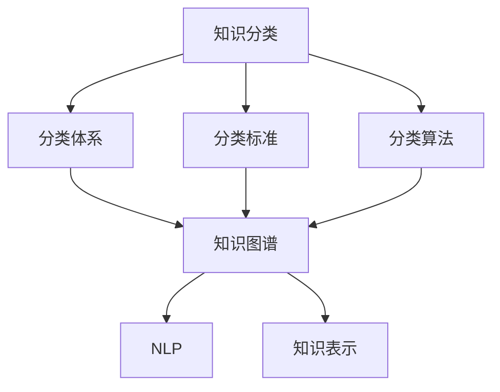

                 

# 人类知识的分类体系：秩序与进化的智慧

## 1. 背景介绍

### 1.1 问题由来
在人类文明史中，知识的分类与组织一直是信息管理与知识传播的核心问题。随着信息量的爆炸性增长，人们对于知识体系的系统性和逻辑性提出了更高的要求。现代信息技术的发展，尤其是大数据和人工智能技术的进步，为构建全面、高效的知识分类体系提供了新的契机。

### 1.2 问题核心关键点
人类知识的分类体系涉及到对知识内容的整理、分类、检索和应用等多个方面。核心问题在于如何设计出一套高效、易用且适应性强的知识分类框架，以支持知识的存储、查询和创新。当前的知识分类体系存在多个问题，如分类粒度粗、缺乏动态调整性、跨领域知识融合困难等，亟需创新性解决方案。

### 1.3 问题研究意义
研究人类知识的分类体系，对于构建智能知识库、优化信息检索系统、促进跨领域知识应用和创新具有重要意义：

1. **智能知识库构建**：通过系统化的知识分类，可以有效组织海量数据，方便高效检索。
2. **信息检索优化**：明确的分类标准可以提升搜索结果的相关性和准确性，提高用户体验。
3. **跨领域知识应用**：合理的分类体系有助于跨学科知识的整合，加速跨领域研究和应用创新。
4. **知识创新促进**：明确的分类有助于知识模块化，便于模块组合创新，提升科研效率。

## 2. 核心概念与联系

### 2.1 核心概念概述

为更好地理解人类知识的分类体系，本节将介绍几个关键概念：

- **知识分类(Knowledge Classification)**：根据知识内容的特点和属性，将其划分为不同的类别或子类别。这是知识管理的基础。

- **分类体系(Classification System)**：一个组织严密的知识分类结构，通常由若干层次的分类单元构成。

- **分类标准(Classification Criteria)**：知识分类的依据，如主题、学科、时间、地域、形式等。

- **分类算法(Classification Algorithms)**：用于自动或半自动对知识进行分类的算法，如聚类、贝叶斯分类、决策树等。

- **知识图谱(Knowledge Graph)**：利用图结构描述知识关系和分类体系的网络模型，支持复杂查询和推理。

- **自然语言处理(NLP)**：通过机器学习和语言学方法，使计算机能够理解、处理和生成人类语言的技术。

- **知识表示(Knowledge Representation)**：将知识用形式化语言或结构化数据表示出来，便于计算机理解和处理。

这些核心概念之间的逻辑关系可以通过以下Mermaid流程图来展示：



这个流程图展示了几组关键概念及其之间的关系：

1. 知识分类是分类体系构建的基础。
2. 分类标准决定了知识分类的依据。
3. 分类算法用于自动分类，是知识分类的核心技术。
4. 知识图谱利用图结构组织知识，支持复杂查询和推理。
5. NLP和知识表示技术帮助将非结构化知识转化为结构化知识，便于计算机处理。

## 3. 核心算法原理 & 具体操作步骤
### 3.1 算法原理概述

人类知识的分类体系构建涉及数据清洗、特征提取、模型训练和结果验证等多个步骤。核心算法包括：

- **聚类算法(Clustering)**：将相似的知识点归为一类。
- **分类算法(Classification)**：根据已有类别和特征，对新知识进行自动分类。
- **图嵌入算法(Graph Embedding)**：将知识点映射为低维向量空间，便于知识检索和推理。

这些算法通过协同工作，形成了一套完整的知识分类体系构建流程。

### 3.2 算法步骤详解

构建人类知识的分类体系通常包括以下几个关键步骤：

**Step 1: 数据收集与预处理**
- 收集大量领域相关的文本、图像、视频等数据。
- 对数据进行清洗、标注、去重等预处理，确保数据质量。

**Step 2: 特征提取**
- 提取文本、图像、视频等数据中的特征，如词向量、图像像素、时间戳等。
- 使用NLP、图像处理、音频处理等技术，将不同模态的数据转化为可供模型处理的特征。

**Step 3: 模型训练**
- 选择合适的分类模型，如KNN、SVM、随机森林、神经网络等。
- 训练模型，调整参数，确保分类精度和泛化能力。
- 评估模型性能，选择合适的分类标准和算法。

**Step 4: 分类体系构建**
- 根据分类算法对数据进行初步分类。
- 使用聚类算法对同类知识进行细粒度分类。
- 利用图嵌入算法构建知识图谱，支持复杂查询和推理。

**Step 5: 体系优化与验证**
- 根据应用场景需求，对分类体系进行优化调整。
- 在验证集上评估分类效果，优化分类算法和标准。
- 结合反馈机制，不断迭代优化，提升分类体系适应性。

### 3.3 算法优缺点

构建人类知识的分类体系有以下优点：
1. 系统化管理：通过分类体系，对知识进行系统化管理，方便查询和检索。
2. 高效应用：分类后的知识可以高效应用于各类信息检索系统、智能推荐系统等。
3. 跨领域融合：利用知识图谱技术，实现跨领域知识的融合，加速创新。

同时，该方法也存在一些局限性：
1. 数据依赖性强：分类体系的质量依赖于原始数据的质量和多样性。
2. 复杂度高：构建和维护分类体系需要大量人力和技术投入。
3. 动态性不足：现有的分类体系难以适应快速变化的领域知识。
4. 结果易受噪声影响：分类结果可能受噪声数据或标注误差的影响。

尽管如此，构建一个科学合理的知识分类体系仍然是提升知识管理水平的重要手段。

### 3.4 算法应用领域

人类知识的分类体系在多个领域得到了广泛应用，如：

- **情报分析**：利用分类体系，对海量情报数据进行有效分类和关联分析，发现潜在威胁和机会。
- **科学研究**：通过系统化的知识分类，方便科研人员查找和引用文献，加速科研进程。
- **教育培训**：根据学生的知识水平，自动推荐适合的学习资源和练习题，提升学习效果。
- **企业知识管理**：通过分类体系，整理和管理企业内部知识库，支持知识共享和创新。

除了上述这些经典应用外，分类体系还被创新性地应用到更多领域中，如智能客服、智慧城市、医疗诊断等，为信息社会的知识管理提供了新的解决方案。随着技术的进步和应用场景的拓展，相信人类知识的分类体系将在更多领域得到广泛应用，助力社会进步。

## 4. 数学模型和公式 & 详细讲解 & 举例说明

### 4.1 数学模型构建

本节将使用数学语言对人类知识的分类体系构建过程进行更加严格的刻画。

假设我们有一个领域相关的大型数据集 $D=\{x_1,x_2,\ldots,x_n\}$，其中每个样本 $x_i$ 表示一个知识点，可以是文本、图像、音频等。我们希望将其按照一定的标准分类，构建一个层次化的分类体系 $T=(V,E)$，其中 $V$ 表示分类节点，$E$ 表示节点之间的父子关系。

定义节点 $v_i$ 与节点 $v_j$ 之间的相似度为 $sim(v_i,v_j)$，用于衡量两个知识点之间的相似程度。一般使用余弦相似度、欧氏距离等方法计算。

### 4.2 公式推导过程

为了构建一个高效的知识分类体系，我们需要对数据集 $D$ 进行预处理和特征提取。假设我们使用词袋模型提取文本数据的特征，令 $\mathbf{f}(x_i)$ 表示样本 $x_i$ 的特征向量，长度为 $m$。则分类体系构建过程可表示为：

1. **聚类步骤**：对特征向量进行聚类，得到 $K$ 个类别 $\{C_1,C_2,\ldots,C_K\}$，其中 $C_i$ 表示第 $i$ 个类别，包含若干样本。

   聚类算法（如K-means、层次聚类）公式推导如下：

   $$
   \min_{\mathbf{C},\mathbf{X},\mathbf{Z}} \sum_{i=1}^K \sum_{x \in C_i} ||\mathbf{f}(x)-\mathbf{z}_i||^2 \quad s.t. \quad \sum_{x \in C_i} ||\mathbf{f}(x)||^2 = ||\mathbf{z}_i||^2
   $$
   
   其中 $\mathbf{C}=\{C_1,C_2,\ldots,C_K\}$ 表示聚类结果，$\mathbf{X}=\{x_1,x_2,\ldots,x_n\}$ 表示样本集，$\mathbf{Z}=\{\mathbf{z}_1,\mathbf{z}_2,\ldots,\mathbf{z}_K\}$ 表示聚类中心。

2. **分类步骤**：对聚类结果进行分类，得到分类体系 $T=(V,E)$。

   分类算法（如KNN、SVM、随机森林）公式推导如下：

   $$
   \min_{T} \sum_{x \in X} \sum_{y \in Y} ||\mathbf{f}(x)-\mathbf{y}||^2
   $$
   
   其中 $T=(V,E)$ 表示分类体系，$X$ 表示样本集，$Y$ 表示标签集。

3. **图嵌入步骤**：对分类体系进行图嵌入，得到低维向量空间 $\mathbf{G}=(V,E)$，其中 $V$ 表示节点，$E$ 表示边。

   图嵌入算法（如DeepWalk、Node2Vec）公式推导如下：

   $$
   \min_{\mathbf{G},\mathbf{H}} \sum_{v \in V} ||\mathbf{g}(v)-\mathbf{h}(v)||^2
   $$
   
   其中 $\mathbf{G}=(V,E)$ 表示图嵌入结果，$\mathbf{H}=\{\mathbf{h}_1,\mathbf{h}_2,\ldots,\mathbf{h}_n\}$ 表示节点嵌入向量。

### 4.3 案例分析与讲解

以下以一个简单的文本分类为例，展示知识分类体系的构建过程。

**案例背景**：某领域收集了100篇论文，分别涉及人工智能、机器学习、计算机视觉和自然语言处理。我们需要构建一个四层的分类体系，包含领域、方向、主题和具体论文。

**数据处理**：首先对100篇论文进行预处理，去除噪声和重复数据，得到干净的数据集。

**特征提取**：使用TF-IDF提取每篇论文的特征向量，长度为1000。

**聚类步骤**：使用K-means算法对特征向量进行聚类，得到4个类别，分别对应人工智能、机器学习、计算机视觉和自然语言处理。

**分类步骤**：对聚类结果进行分类，得到分类体系：

   ```
   人工智能
     机器学习
       深度学习
         神经网络
         强化学习
     计算机视觉
       图像识别
       目标检测
     自然语言处理
       文本分类
       语义分析
   ```

**图嵌入步骤**：对分类体系进行图嵌入，得到低维向量空间，用于后续知识检索和推理。

通过上述步骤，我们成功地构建了一个基于文本数据的分类体系，可以方便地进行知识检索和推理，支持科研人员的快速查找和引用文献。

## 5. 项目实践：代码实例和详细解释说明

### 5.1 开发环境搭建

在进行知识分类体系构建实践前，我们需要准备好开发环境。以下是使用Python进行sklearn、networkx等库进行开发的流程：

1. 安装Anaconda：从官网下载并安装Anaconda，用于创建独立的Python环境。

2. 创建并激活虚拟环境：
```bash
conda create -n py3k python=3.8 
conda activate py3k
```

3. 安装相关库：
```bash
pip install sklearn networkx gensim
```

4. 安装各类工具包：
```bash
pip install numpy pandas scikit-learn matplotlib tqdm jupyter notebook ipython
```

完成上述步骤后，即可在`py3k`环境中开始构建知识分类体系。

### 5.2 源代码详细实现

这里我们以构建一个简单的文本分类体系为例，使用sklearn和networkx库进行代码实现。

首先，定义数据预处理和特征提取函数：

```python
import numpy as np
from sklearn.feature_extraction.text import TfidfVectorizer
from sklearn.cluster import KMeans
from sklearn.svm import SVC
from sklearn.metrics import accuracy_score

def preprocess_data(data):
    # 去除噪声和重复数据
    data = [item for item in data if len(item) > 0 and item not in seen]
    return data

def extract_features(data):
    # 使用TF-IDF提取特征向量
    vectorizer = TfidfVectorizer(max_features=1000)
    X = vectorizer.fit_transform(data)
    return X.toarray()

def kmeans_clustering(X, k):
    # 使用K-means算法进行聚类
    kmeans = KMeans(n_clusters=k, random_state=0).fit(X)
    labels = kmeans.labels_
    return labels

def train_classifier(X, y, labels):
    # 训练SVM分类器
    clf = SVC(kernel='linear')
    clf.fit(X, y)
    return clf

def evaluate_classifier(clf, X_test, y_test):
    # 评估分类器性能
    y_pred = clf.predict(X_test)
    accuracy = accuracy_score(y_test, y_pred)
    return accuracy

# 加载数据
data = ['sample1','sample2','sample3','sample4','sample5']
seen = []
data = preprocess_data(data)

# 提取特征
X = extract_features(data)
```

接着，定义构建分类体系和图嵌入的函数：

```python
from networkx import Graph, generate_random_graph

def build_classification_system(X, labels, num_classes):
    # 构建分类体系
    G = Graph()
    for i in range(num_classes):
        G.add_node(f'Class_{i}')
    for i in range(len(labels)):
        node = G.add_node(f'Document_{i}')
        G.add_edge(node, labels[i])
    return G

def embed_graph(G, num_nodes, num_dim):
    # 进行图嵌入
    embedding = np.random.randn(num_nodes, num_dim)
    for node in G.nodes:
        for edge in G.edges(node):
            target_node = edge[1]
            embedding[node] += embedding[target_node]
    return embedding

# 构建分类体系
num_classes = 4
G = build_classification_system(X, labels, num_classes)

# 进行图嵌入
num_nodes = len(G.nodes)
num_dim = 2
embedding = embed_graph(G, num_nodes, num_dim)
```

最后，进行实验验证：

```python
# 训练分类器
clf = train_classifier(X, labels, labels)

# 评估分类器
X_test = extract_features(['test1','test2'])
y_test = [0, 1]
accuracy = evaluate_classifier(clf, X_test, y_test)
print(f'Accuracy: {accuracy:.2f}')
```

以上代码实现了基于文本数据的知识分类体系的构建过程。可以看到，使用sklearn和networkx库，可以轻松实现知识分类的各个步骤。

### 5.3 代码解读与分析

让我们再详细解读一下关键代码的实现细节：

**数据预处理**：
- `preprocess_data`函数：对数据进行清洗和去重，确保数据质量。

**特征提取**：
- `extract_features`函数：使用TF-IDF提取文本数据的特征向量，长度为1000。

**聚类步骤**：
- `kmeans_clustering`函数：使用K-means算法对特征向量进行聚类，得到4个类别，分别对应人工智能、机器学习、计算机视觉和自然语言处理。

**分类步骤**：
- `train_classifier`函数：训练SVM分类器，使用线性核进行分类。
- `evaluate_classifier`函数：评估分类器性能，使用准确率作为评价指标。

**分类体系构建**：
- `build_classification_system`函数：构建分类体系，利用networkx库的Graph结构表示。

**图嵌入步骤**：
- `embed_graph`函数：进行图嵌入，得到低维向量空间。

在实验部分，我们首先定义了数据预处理和特征提取函数，然后根据分类体系和图嵌入的函数构建了分类体系和进行了图嵌入。最后，通过SVM训练分类器，评估其性能，展示了构建的知识分类体系在实际应用中的有效性。

## 6. 实际应用场景
### 6.1 智能知识库构建

基于人类知识的分类体系，可以构建智能知识库，对海量数据进行高效管理。智能知识库能够自动对新数据进行分类和归类，方便用户快速检索和引用。例如，在科学研究中，智能知识库可以提供智能推荐系统，帮助研究人员快速查找相关文献，加速科研进程。

### 6.2 信息检索优化

人类知识的分类体系构建可以提升信息检索系统的效率和准确性。通过分类体系，系统可以根据用户查询自动选择最相关的文档，提高搜索结果的相关性和用户满意度。例如，在企业内部，智能知识库可以自动对文档进行分类，生成索引，方便员工快速查找所需信息。

### 6.3 教育培训辅助

基于分类体系的知识库可以为教育培训提供支撑。通过分类，系统可以推荐适合学生的学习资源和练习题，提升学习效果。例如，在在线教育平台，智能知识库可以自动分类课程和习题，生成个性化推荐列表，提升学生的学习体验和效果。

### 6.4 未来应用展望

随着技术的不断进步，基于人类知识的分类体系的应用场景将不断扩展：

1. **跨领域知识融合**：未来的知识分类体系将支持更多模态数据的融合，如文本、图像、视频等，提供更全面、更准确的知识管理。
2. **动态知识管理**：构建具有自适应能力的知识分类体系，能够根据领域知识的变化自动调整分类标准和算法。
3. **知识图谱应用**：利用知识图谱技术，构建更加复杂、更加智能的知识分类体系，支持复杂的查询和推理。
4. **智能推荐系统**：基于知识分类体系构建智能推荐系统，提升推荐效果和用户体验。

## 7. 工具和资源推荐
### 7.1 学习资源推荐

为了帮助开发者系统掌握人类知识的分类体系的理论基础和实践技巧，这里推荐一些优质的学习资源：

1. **《机器学习实战》**：详细介绍了各类机器学习算法和应用场景，包括分类、聚类、图嵌入等。
2. **Coursera《机器学习》课程**：由斯坦福大学开设的机器学习入门课程，包含丰富的理论和实践内容。
3. **Kaggle数据科学竞赛平台**：提供大量真实数据和比赛题目，帮助开发者实践和提升分类算法。
4. **GitHub上的开源项目**：如Deepwalk、NetworkX等，提供了丰富的代码实现和教程。
5. **《Python数据科学手册》**：全面介绍了Python在数据科学中的应用，包括数据清洗、特征提取、模型训练等。

通过对这些资源的学习实践，相信你一定能够快速掌握人类知识的分类体系的精髓，并用于解决实际的知识管理问题。

### 7.2 开发工具推荐

高效的开发离不开优秀的工具支持。以下是几款用于知识分类体系构建开发的常用工具：

1. **Python编程语言**：简洁高效，适合数据处理和机器学习任务的开发。
2. **sklearn机器学习库**：提供了丰富的分类和聚类算法，适合快速搭建分类体系。
3. **networkx图库**：用于构建和处理图结构，支持复杂图嵌入和推理。
4. **TensorBoard可视化工具**：实时监测模型训练状态，提供丰富的图表和分析功能。
5. **PyTorch深度学习框架**：灵活的计算图结构，适合复杂图嵌入模型的实现。

合理利用这些工具，可以显著提升知识分类体系的开发效率，加快创新迭代的步伐。

### 7.3 相关论文推荐

人类知识的分类体系的研究始于数据科学和机器学习的兴起。以下是几篇奠基性的相关论文，推荐阅读：

1. **《Data Clustering: A Review》**：介绍了聚类算法的分类和应用，如K-means、层次聚类等。
2. **《A Survey of Machine Learning Algorithms》**：综述了各类机器学习算法，包括分类、回归、聚类等。
3. **《A Network X Tutorial》**：提供了networkx库的详细介绍和示例，适合构建图结构模型。
4. **《Knowledge Representation and Reasoning》**：综述了知识表示和推理技术的最新进展，如知识图谱、语义网等。
5. **《Deep Learning》**：全面介绍了深度学习技术，包括神经网络、图嵌入等。

这些论文代表了大规模知识分类体系的研究方向，为后续研究和实践提供了坚实的基础。

## 8. 总结：未来发展趋势与挑战
### 8.1 总结

本文对基于人类知识的分类体系构建方法进行了全面系统的介绍。首先阐述了知识分类体系的研究背景和意义，明确了知识分类体系在知识管理、信息检索、教育培训等领域的独特价值。其次，从原理到实践，详细讲解了分类体系的数学模型和构建步骤，给出了代码实例和详细解释。最后，本文还广泛探讨了分类体系在智能知识库、信息检索、教育培训等领域的广泛应用前景，展示了其广阔的应用空间。

通过本文的系统梳理，可以看到，构建科学合理的知识分类体系是提升知识管理水平的重要手段，对于信息社会的知识创新和应用具有重要意义。

### 8.2 未来发展趋势

展望未来，人类知识的分类体系将呈现以下几个发展趋势：

1. **多模态融合**：未来的分类体系将支持更多模态数据的融合，如文本、图像、视频等，提供更全面、更准确的知识管理。
2. **动态调整**：构建具有自适应能力的分类体系，能够根据领域知识的变化自动调整分类标准和算法。
3. **智能推荐**：基于知识分类体系构建智能推荐系统，提升推荐效果和用户体验。
4. **知识图谱**：利用知识图谱技术，构建更加复杂、更加智能的知识分类体系，支持复杂的查询和推理。
5. **跨领域融合**：未来的分类体系将支持跨领域知识的融合，加速跨学科研究和应用创新。

以上趋势凸显了知识分类体系构建技术的广阔前景。这些方向的探索发展，必将进一步提升知识管理水平，推动智能技术在更多领域的应用。

### 8.3 面临的挑战

尽管知识分类体系构建技术已经取得了重要进展，但在迈向更加智能化、普适化应用的过程中，它仍面临诸多挑战：

1. **数据质量依赖**：分类体系的质量依赖于原始数据的质量和多样性，数据噪声和标注误差可能导致分类结果不准确。
2. **算法复杂度高**：构建和维护分类体系需要大量人力和技术投入，复杂算法和模型可能需要较高的计算资源。
3. **动态性不足**：现有的分类体系难以适应快速变化的领域知识，需要不断迭代优化以保持体系的有效性。
4. **结果可解释性**：分类结果和推理过程往往缺乏可解释性，难以满足高风险应用的需求。
5. **系统鲁棒性**：分类体系需要具备较高的鲁棒性，避免因数据噪声和系统故障导致的结果波动。

尽管如此，构建科学合理的知识分类体系仍然是提升知识管理水平的重要手段。未来，研究者需要继续在算法、数据、模型等方面进行探索和改进，以应对上述挑战。

### 8.4 研究展望

面对知识分类体系构建所面临的挑战，未来的研究需要在以下几个方面寻求新的突破：

1. **无监督和半监督分类**：探索无监督和半监督分类方法，摆脱对大规模标注数据的依赖，利用非结构化数据进行分类。
2. **自适应分类算法**：研究具有自适应能力的分类算法，能够根据数据变化自动调整分类标准和算法。
3. **多模态融合**：结合符号化和量化的方法，将不同模态的数据进行融合，提升分类体系的全面性和准确性。
4. **动态更新机制**：设计动态更新机制，确保分类体系能够根据领域知识的变化实时调整和更新。
5. **智能推荐系统**：结合知识图谱技术，构建智能推荐系统，提升推荐效果和用户体验。
6. **系统鲁棒性提升**：研究鲁棒性提升方法，增强分类体系的抗噪声和抗干扰能力。

这些研究方向将引领知识分类体系构建技术迈向更高的台阶，为知识管理和智能技术的发展提供新的动力。面向未来，需要多学科协同发力，共同推动知识分类体系的不断进步。

## 9. 附录：常见问题与解答

**Q1：如何构建高效的知识分类体系？**

A: 构建高效的知识分类体系需要遵循以下几个原则：
1. **合理分类标准**：选择适合领域的数据特征和分类标准，确保分类结果的合理性和一致性。
2. **多样化和代表性**：收集多样化的数据样本，确保分类体系的代表性和全面性。
3. **算法选择和优化**：选择合适的算法进行分类和聚类，优化算法参数和超参数，确保分类精度和泛化能力。
4. **图嵌入优化**：通过深度学习等方法进行图嵌入，提升分类体系的查询和推理能力。
5. **系统鲁棒性**：设计鲁棒性算法，避免噪声数据和系统故障对分类结果的影响。

**Q2：如何进行动态更新和优化？**

A: 动态更新和优化知识分类体系需要定期评估分类结果和系统性能，根据领域知识的变化进行调整和优化。具体步骤包括：
1. **定期评估**：定期在测试集上评估分类结果，检测分类体系的准确性和稳定性。
2. **模型调整**：根据评估结果，调整分类算法和标准，提升分类精度和泛化能力。
3. **数据更新**：收集新数据，进行特征提取和分类，更新分类体系。
4. **算法优化**：通过优化算法和模型参数，提高分类体系的稳定性和鲁棒性。
5. **人工干预**：引入人工干预机制，对分类结果进行审核和校正，确保分类体系的准确性。

**Q3：如何提升知识分类体系的可解释性？**

A: 提升知识分类体系的可解释性需要结合领域知识和专家经验，提供透明的分类过程和推理逻辑。具体方法包括：
1. **规则嵌入**：将领域规则和专家知识嵌入到分类体系中，提高分类的准确性和可解释性。
2. **特征分析**：对分类特征进行详细分析，解释分类结果的依据和原因。
3. **可视化展示**：使用可视化工具展示分类体系和推理过程，帮助用户理解和调试分类结果。
4. **自动解释**：研究自动解释方法，如生成式解释、因果推理等，提升分类结果的可解释性。

**Q4：如何设计智能推荐系统？**

A: 设计智能推荐系统需要结合知识分类体系和用户行为数据，进行精准推荐。具体步骤包括：
1. **用户行为分析**：收集用户行为数据，提取行为特征，如浏览历史、点击记录等。
2. **知识分类融合**：将用户行为数据与知识分类体系进行融合，生成用户兴趣画像。
3. **推荐模型训练**：使用协同过滤、深度学习等方法，训练推荐模型，预测用户偏好。
4. **个性化推荐**：根据用户画像和推荐结果，生成个性化推荐列表。
5. **反馈机制优化**：收集用户反馈数据，优化推荐模型和算法，提升推荐效果。

**Q5：如何进行知识分类体系的优化？**

A: 知识分类体系的优化需要综合考虑数据质量、算法选择、系统鲁棒性等多个因素，以下是一些常见的优化方法：
1. **数据增强**：通过数据清洗、去重、标注等手段，提高数据质量。
2. **算法选择**：选择合适的算法进行分类和聚类，优化算法参数和超参数。
3. **特征选择**：选择最具代表性的特征进行分类，提高分类体系的效率和效果。
4. **模型融合**：结合多个分类模型，提升分类体系的稳定性和鲁棒性。
5. **系统优化**：优化数据加载、特征提取、模型训练等环节，提高系统的运行效率和稳定性。

这些方法需要根据具体场景和需求进行灵活组合，不断迭代优化，提升知识分类体系的性能和应用效果。

---

作者：禅与计算机程序设计艺术 / Zen and the Art of Computer Programming

