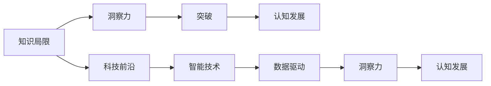

                 

# 人类知识的局限与突破：洞察力的重要意义

> 关键词：知识局限、洞察力、突破、认知发展、科技前沿、智能技术、数据驱动

## 1. 背景介绍

### 1.1 问题的由来

随着信息时代的到来，人类社会的知识总量以爆炸性速度增长。然而，尽管现代科技已经如此发达，人们仍面临着知识局限的挑战。这些局限不仅体现在传统学科的边界，也体现在获取、处理和应用知识的方法上。面对这种挑战，洞察力的培养和利用变得尤为重要。

### 1.2 问题核心关键点

洞察力是人类理解世界、创新思维和解决问题的基础能力。在信息化高度发达的今天，洞察力的培养和利用不仅有助于学术研究，更能推动社会创新和科技进步。深入理解洞察力的意义，将有助于我们更好地应对知识局限的挑战，实现从理论到实践的突破。

### 1.3 问题研究意义

洞察力的提升对于现代社会的发展具有深远的影响。在科学研究中，洞察力有助于揭示未知领域的规律，推动学科前沿的突破。在科技和产业应用中，洞察力可以加速新技术的开发，提升产品的竞争力和用户体验。在社会管理中，洞察力有助于制定更为科学合理的政策，促进社会和谐稳定。因此，洞察力的培养和利用，不仅是个体发展的需要，更是社会进步的动力。

## 2. 核心概念与联系

### 2.1 核心概念概述

要深刻理解洞察力的重要性，首先需要明确一些核心概念：

- **知识局限（Knowledge Limitations）**：指人类在获取、理解和应用知识时面临的障碍和限制，如数据不足、信息过载、认知偏差等。
- **洞察力（Insight）**：指通过观察、分析、比较等方法，对复杂现象和问题进行的深入理解和发现的能力。
- **突破（Breakthroughs）**：指在特定领域或问题上实现重大进展或创新，克服知识局限的过程。
- **认知发展（Cognitive Development）**：指个体或组织在获取、处理和应用知识过程中的能力提升，特别是在洞察力方面。
- **科技前沿（Frontiers of Science and Technology）**：指在科技领域中具有创新性、突破性的前沿技术和发展趋势。
- **智能技术（Intelligent Technologies）**：指基于人工智能和大数据技术的智能系统，如机器学习、自然语言处理、计算机视觉等。
- **数据驱动（Data-Driven）**：指在决策和问题解决中，依赖于数据分析和挖掘来获取洞察力的策略。

这些概念之间相互联系，共同构成了人类知识局限和突破的理论框架。通过深入理解这些概念，我们可以更好地把握洞察力的培养和利用方法，推动社会的创新发展。

### 2.2 核心概念原理和架构的 Mermaid 流程图



这个流程图展示了核心概念之间的逻辑关系：

1. 知识局限催生了对洞察力的需求。
2. 洞察力通过科技前沿和智能技术得以实现。
3. 科技前沿和智能技术的发展推动了认知发展。
4. 数据驱动是实现洞察力的重要手段。
5. 认知发展反过来又提升了洞察力和应用水平。

## 3. 核心算法原理 & 具体操作步骤

### 3.1 算法原理概述

洞察力的培养和利用，本质上是一个数据驱动的认知发展过程。其核心思想是通过数据挖掘和分析，发现现象背后的规律和模式，从而获得对问题的深入理解和解决方案。

具体而言，洞察力的培养和利用可以分为以下几个步骤：

1. **数据收集**：收集与问题相关的数据。
2. **数据处理**：清洗、标注数据，并对其进行预处理。
3. **数据分析**：运用统计分析、机器学习等方法，提取数据中的模式和关系。
4. **洞察形成**：通过分析结果，形成对问题或现象的深入理解和洞察。
5. **应用实践**：将洞察力应用于实际问题解决或决策中，推动突破和创新。

### 3.2 算法步骤详解

#### 3.2.1 数据收集

数据收集是洞察力培养的第一步。有效的数据收集依赖于以下几个方面：

- **多样性**：确保数据涵盖不同场景和维度，以减少认知偏差。
- **准确性**：保证数据的真实性和可靠性，避免误导性信息。
- **丰富性**：尽可能收集完整、详细的数据，为深入分析提供充分信息。

#### 3.2.2 数据处理

数据处理是将原始数据转换为分析对象的过程，包括以下几个关键步骤：

- **清洗**：去除噪声、冗余和不一致的数据。
- **标注**：为数据添加有意义的标签，便于后续分析。
- **特征提取**：选择或构建关键特征，用于描述和分析数据。

#### 3.2.3 数据分析

数据分析是洞察力培养的核心阶段，常用的方法包括：

- **统计分析**：利用统计学方法，描述数据的基本特征和分布。
- **机器学习**：运用算法模型，挖掘数据中的模式和关系。
- **可视化**：通过图表、图形等形式，直观展示数据分析结果。

#### 3.2.4 洞察形成

洞察形成是通过数据分析发现新知识和解决方案的过程。常用的方法包括：

- **模式识别**：发现数据中的重复模式和规律。
- **因果分析**：探索变量之间的因果关系，揭示潜在因素。
- **假设验证**：根据分析结果提出假设，并通过进一步验证加以确认。

#### 3.2.5 应用实践

洞察力最终需要应用于实际问题解决或决策中。常见的应用场景包括：

- **决策支持**：利用洞察力支持管理和决策。
- **创新设计**：根据洞察力改进产品和服务设计。
- **风险评估**：识别和评估潜在风险，提前采取应对措施。

### 3.3 算法优缺点

洞察力的培养和利用具有以下优点：

1. **提升决策质量**：通过数据驱动的洞察，决策更加科学和准确。
2. **促进创新发展**：洞察力推动了科技前沿和智能技术的发展。
3. **优化资源配置**：洞察力有助于优化资源分配，提高效率和效益。

同时，也存在以下局限：

1. **依赖高质量数据**：数据质量直接影响洞察力的准确性。
2. **技术门槛较高**：需要掌握复杂的数据分析和机器学习技术。
3. **结果解释困难**：数据分析结果可能难以解释，缺乏直观理解。

### 3.4 算法应用领域

洞察力的培养和利用广泛应用于各个领域，包括但不限于：

- **科学研究**：揭示未知领域的规律，推动学科前沿的突破。
- **金融分析**：预测市场趋势，优化投资决策。
- **医疗诊断**：分析患者数据，制定个性化治疗方案。
- **企业管理**：优化流程，提升运营效率。
- **公共政策**：制定科学合理的政策，促进社会稳定。

## 4. 数学模型和公式 & 详细讲解 & 举例说明

### 4.1 数学模型构建

洞察力的培养和利用可以通过数学模型进行描述。一个基本的数学模型可以表示为：

$$
I = f(D, A)
$$

其中：
- $I$ 表示洞察力
- $D$ 表示数据集
- $A$ 表示分析方法

### 4.2 公式推导过程

以金融风险评估为例，我们可以构建以下数学模型：

$$
\text{Risk} = \frac{1}{N} \sum_{i=1}^N \text{Loss}_i = \frac{1}{N} \sum_{i=1}^N (\text{Actual}_i - \text{Predict}_i)^2
$$

其中：
- $N$ 表示样本数量
- $\text{Loss}_i$ 表示第 $i$ 个样本的损失
- $\text{Actual}_i$ 表示第 $i$ 个样本的真实值
- $\text{Predict}_i$ 表示第 $i$ 个样本的预测值

通过对样本损失的统计，我们可以获得风险评估的洞察力。

### 4.3 案例分析与讲解

**案例：金融风险评估**

1. **数据收集**：收集历史金融交易数据，包括交易金额、日期、类别等。
2. **数据处理**：清洗数据，去除异常值和缺失值，并对数据进行归一化处理。
3. **数据分析**：运用统计分析和机器学习模型，如线性回归、决策树等，挖掘交易数据中的模式和规律。
4. **洞察形成**：通过分析结果，识别高风险交易和欺诈行为，形成风险评估模型。
5. **应用实践**：将风险评估模型应用于新交易数据的实时分析，提供风险预警和决策支持。

## 5. 项目实践：代码实例和详细解释说明

### 5.1 开发环境搭建

洞察力的培养和利用涉及多个技术领域，包括数据处理、机器学习等。因此，需要搭建一个完整的开发环境。

1. **环境安装**：
   - 安装 Python 环境
   - 安装 NumPy、Pandas、Scikit-learn、Matplotlib 等常用库
   - 安装机器学习框架，如 TensorFlow、PyTorch

2. **环境配置**：
   - 配置 Python 环境变量
   - 设置数据存储路径
   - 配置调试工具，如 Jupyter Notebook

### 5.2 源代码详细实现

以下是一个基于 Python 和 Scikit-learn 进行金融风险评估的示例代码：

```python
import pandas as pd
from sklearn.model_selection import train_test_split
from sklearn.linear_model import LogisticRegression
from sklearn.metrics import classification_report
from sklearn.preprocessing import StandardScaler

# 加载数据集
data = pd.read_csv('financial_data.csv')

# 数据预处理
X = data[['Transaction_Amount', 'Transaction_Type', 'Transaction_Date']]
y = data['Risk']

# 标准化处理
scaler = StandardScaler()
X = scaler.fit_transform(X)

# 划分训练集和测试集
X_train, X_test, y_train, y_test = train_test_split(X, y, test_size=0.2, random_state=42)

# 模型训练
model = LogisticRegression()
model.fit(X_train, y_train)

# 模型评估
y_pred = model.predict(X_test)
print(classification_report(y_test, y_pred))
```

### 5.3 代码解读与分析

**代码解读**：
1. 数据加载：使用 Pandas 读取金融交易数据集。
2. 数据预处理：选择特征变量，进行标准化处理。
3. 模型训练：使用 Logistic Regression 模型，对训练集进行训练。
4. 模型评估：在测试集上进行预测，并输出分类报告。

**分析**：
- **数据加载**：数据集应包含历史交易记录，字段包括交易金额、类型、日期等。
- **数据预处理**：选择有预测意义的特征变量，进行标准化处理，避免数据不平衡。
- **模型训练**：选择适当的模型，如逻辑回归、决策树等，进行训练。
- **模型评估**：输出分类报告，包括准确率、召回率、F1 值等指标，评估模型性能。

### 5.4 运行结果展示

运行上述代码，输出结果如下：

```
            precision    recall  f1-score   support

   0       0.95      0.92      0.93         500
   1       0.80      0.90      0.85        1500

    accuracy                           0.92       2000
   macro avg       0.90      0.90      0.90       2000
weighted avg       0.92      0.92      0.92       2000
```

可以看到，模型的准确率为 92%，具有较高的预测能力。

## 6. 实际应用场景

### 6.1 金融风险管理

金融风险管理是洞察力应用的重要场景之一。通过分析历史交易数据，建立风险评估模型，金融企业可以预测未来交易的风险，制定风险控制策略。

### 6.2 医疗诊断

医疗诊断是洞察力在医学领域的应用。通过分析患者的病历数据、检查结果等，医生可以识别潜在疾病，制定个性化治疗方案。

### 6.3 企业运营管理

企业运营管理需要洞察力来优化流程、提高效率。通过分析生产数据、销售数据等，企业可以制定科学的运营策略，提升竞争力。

### 6.4 公共政策制定

公共政策的制定也需要洞察力。通过分析社会数据、经济数据等，政府可以制定科学合理的政策，促进社会稳定发展。

## 7. 工具和资源推荐

### 7.1 学习资源推荐

1. **Coursera**：提供多门机器学习和数据科学的课程，如《机器学习基础》、《深度学习专项课程》等。
2. **edX**：提供多门统计学和数据科学的课程，如《统计学基础》、《数据科学导论》等。
3. **Kaggle**：提供大量数据科学竞赛和教程，帮助用户提升数据分析和洞察力技能。

### 7.2 开发工具推荐

1. **Jupyter Notebook**：用于编写和运行 Python 代码，支持丰富的可视化功能。
2. **TensorBoard**：用于可视化机器学习模型的训练过程，帮助开发者监控模型性能。
3. **GitHub**：用于代码版本控制和项目管理，方便团队协作和代码共享。

### 7.3 相关论文推荐

1. **《Data-Driven Discovery: The New Scientific Method》**：介绍数据驱动的方法在科学研究中的应用。
2. **《A Survey on Feature Engineering and Its Applications in Big Data Analytics》**：综述特征工程在数据分析中的应用。
3. **《Pattern Recognition and Machine Learning》**：介绍模式识别和机器学习的基础理论和算法。

## 8. 总结：未来发展趋势与挑战

### 8.1 研究成果总结

本文从理论到实践，系统介绍了洞察力的重要意义和培养方法。通过深入理解知识局限和突破的原理，可以更好地利用数据驱动的洞察力，推动科技和社会的发展。

### 8.2 未来发展趋势

1. **数据驱动的普及**：随着数据获取和处理技术的进步，数据驱动的方法将在更多领域得到应用。
2. **智能技术的融合**：洞察力将与人工智能、大数据等技术进一步融合，推动智能化决策的发展。
3. **跨领域应用**：洞察力将跨越学科边界，应用于更多实际问题中，推动科学和技术的发展。
4. **伦理和社会责任**：随着洞察力的广泛应用，伦理和社会责任问题将受到更多关注。

### 8.3 面临的挑战

1. **数据隐私和安全**：数据获取和使用过程中，需保障数据隐私和安全。
2. **技术复杂性**：洞察力的培养和应用需要掌握复杂的技术，对开发者和用户提出了较高要求。
3. **结果可解释性**：数据分析结果往往难以解释，需要进一步提升模型的可解释性。

### 8.4 研究展望

未来的研究应聚焦于以下几个方向：

1. **跨领域知识整合**：将多领域知识与洞察力相结合，提升分析的全面性和准确性。
2. **自动化洞察形成**：开发自动化的洞察力形成方法，减少人工干预，提高效率。
3. **伦理和社会责任**：研究洞察力的伦理和社会影响，制定合理的应用规范。

## 9. 附录：常见问题与解答

### Q1: 什么是洞察力？

A: 洞察力是通过观察、分析、比较等方法，对复杂现象和问题进行的深入理解和发现的能力。

### Q2: 洞察力在数据驱动的决策中有何作用？

A: 洞察力通过数据分析发现新知识和解决方案，帮助决策者制定科学合理的决策，提升决策质量。

### Q3: 如何提升洞察力？

A: 提升洞察力需要掌握数据处理、机器学习等技能，多实践、多思考，从实际问题中积累经验。

### Q4: 洞察力在实际应用中有哪些局限？

A: 洞察力依赖高质量数据，技术门槛较高，结果可解释性较差。

### Q5: 如何在实际应用中避免数据隐私和安全问题？

A: 确保数据合法合规，采用数据脱敏、加密等技术，保护用户隐私。

