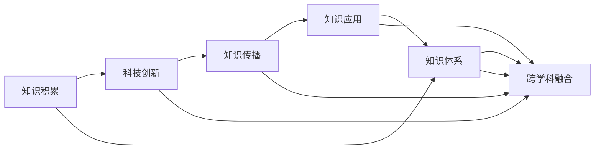

                 

# 人类知识的进步史：一部创新史

## 1. 背景介绍

### 1.1 问题由来
人类知识的发展历程，是一段由简单到复杂、由局部到整体的漫长演化过程。知识的积累和传播，推动了文明的发展，深刻影响了社会的结构和文化。如何理解和追踪这一历史进程，成为了跨学科研究的重要课题。本文旨在通过回顾人类知识的演化史，探索其在各领域的创新，解析其背后的驱动力，为未来的知识进步提供借鉴。

### 1.2 问题核心关键点
本文的核心问题聚焦于：
1. 人类知识是如何演进的？它经历了哪些重大转折点？
2. 在数学、物理、化学、生物等关键领域，有哪些划时代的发现？
3. 这些发现是如何促进了科技革命和社会变革的？
4. 未来知识的发展趋势和挑战是什么？

通过解答这些问题，我们希望能更深入地理解人类知识的进步历程，为未来的科学研究和技术创新提供新的视角。

## 2. 核心概念与联系

### 2.1 核心概念概述

为更好地理解人类知识的发展，本节将介绍几个关键概念及其之间的联系：

- **知识积累**：指人类在历史长河中不断累积的各类经验、理论和技术。知识积累是人类进化的基石。
- **科技创新**：指在特定领域内，通过实验、理论推导等手段，发现新现象、新规律，进而提升技术水平的过程。科技创新是知识进步的驱动力。
- **知识传播**：指通过教育、出版、交流等途径，将知识从一方传递到另一方的过程。知识传播加速了知识的普及和应用。
- **知识应用**：指将知识应用于实践，解决实际问题，推动社会进步的过程。知识应用是知识进步的最终目标。
- **知识体系**：指各个领域内的知识结构和理论框架。知识体系的构建和完善，有助于知识的系统化和传承。
- **跨学科融合**：指不同学科间的知识、方法、工具等的融合和创新，推动了知识的边际效应最大化。跨学科融合是知识进步的新动力。

这些概念通过相互关联，构成了人类知识发展的基本框架。通过理解这些概念，可以更好地把握知识进步的历史脉络和未来趋势。

### 2.2 核心概念原理和架构的 Mermaid 流程图



这个流程图展示了人类知识演进的四个主要环节，以及它们之间的相互关系。知识积累是基础，科技创新是推动力，知识传播是载体，知识应用是目标。跨学科融合进一步促进了知识的进步。

## 3. 核心算法原理 & 具体操作步骤
### 3.1 算法原理概述

知识的发展遵循一定的规律和模式，可以视为一个算法化的过程。这一过程涉及知识的发现、验证、传播和应用，与计算机科学中的算法相似。在知识的演进过程中，以下三个关键步骤尤为重要：

1. **数据收集与预处理**：获取各类原始数据，并进行清洗、归一化等预处理，为后续的分析和建模提供基础。
2. **模型训练与验证**：建立知识模型，通过训练和验证过程，优化模型参数，提高模型精度。
3. **知识应用与迭代**：将模型应用于实际问题，验证其有效性，并根据反馈进行迭代优化。

### 3.2 算法步骤详解

#### 3.2.1 数据收集与预处理

在知识发现的过程中，数据收集与预处理是第一步。数据可以是实验结果、文献资料、观测数据等，预处理包括数据清洗、特征提取、缺失值处理等。以物理学的经典例子为例，以下是数据收集和预处理的步骤：

1. **数据收集**：例如，收集各类实验结果、观测数据，形成实验报告或数据集。
2. **数据清洗**：去除重复、错误数据，处理缺失值。
3. **特征提取**：从原始数据中提取有意义的特征，如物理量、参数等。
4. **数据归一化**：将不同单位、不同尺度的数据归一化到同一标准，便于后续建模。

#### 3.2.2 模型训练与验证

知识模型的建立和训练，是知识发现的核心。模型的选择和参数优化，决定了知识发现的精度和有效性。以物理学为例，以下是模型训练和验证的步骤：

1. **模型选择**：选择适合的数学模型，如牛顿力学、麦克斯韦方程等。
2. **参数优化**：通过最小化误差函数，优化模型参数。例如，使用梯度下降法求解。
3. **交叉验证**：使用不同数据集验证模型，避免过拟合，提高模型泛化能力。

#### 3.2.3 知识应用与迭代

知识模型的应用和迭代，是知识进步的关键。应用模型解决实际问题，收集反馈数据，进行模型迭代，提高模型精度和稳定性。例如，在物理学中，通过实验验证模型，收集实验数据，进行模型修正和优化。

### 3.3 算法优缺点

知识的发展算法，具有以下优点：
1. 可重复性：数据和算法可以复用，提升效率。
2. 系统性：通过模型训练和验证，提高知识发现的系统性。
3. 可解释性：模型参数和决策过程透明，便于理解和解释。

同时，也存在以下缺点：
1. 依赖数据：数据质量直接影响知识发现的效果。
2. 模型假设：模型假设可能限制知识发现的范围。
3. 复杂性：模型复杂度可能增加计算难度。

### 3.4 算法应用领域

知识的发展算法在各个领域都有广泛的应用，例如：

- **物理学**：通过实验数据建立物理模型，如牛顿力学、量子力学等。
- **数学**：发展各类数学理论，如微积分、线性代数、概率论等。
- **化学**：通过化学实验和理论推导，发现新物质、化学反应规律等。
- **生物学**：通过基因测序和生物实验，发现生命现象和规律，如DNA双螺旋结构。
- **计算机科学**：通过算法和数据结构，解决各类计算问题，如人工智能、计算机视觉等。
- **经济学**：发展经济理论，分析经济行为和规律，如供需模型、市场竞争理论等。

这些领域的发展，都离不开知识发展的算法支持。未来，随着更多新兴学科的兴起，知识发展的算法将进一步扩展，推动人类社会的进步。

## 4. 数学模型和公式 & 详细讲解 & 举例说明

### 4.1 数学模型构建

知识发现和传播的过程，可以通过数学模型来描述。以下是一个简单的数学模型，描述知识的发展和传播：

设知识总量为 $K$，时间步长为 $t$，知识传播速度为 $v$，知识增长率为 $\alpha$，知识传播系数为 $\beta$。知识传播模型可以表示为：

$$
K(t+1) = K(t) + \alpha K(t) + \beta K(t) v(t)
$$

其中 $v(t)$ 表示在第 $t$ 步时知识的传播速度。

### 4.2 公式推导过程

知识传播模型的推导过程如下：

1. **知识总量**：知识总量 $K(t)$ 表示在 $t$ 时刻的知识总量，初始值为 $K(0)$。
2. **知识增长率**：$\alpha K(t)$ 表示知识自身增长，即在一段时间内，知识总量线性增长。
3. **知识传播**：$\beta K(t) v(t)$ 表示知识通过传播，在 $t$ 时刻的传播量。$\beta$ 表示传播系数，$v(t)$ 表示传播速度。
4. **总和**：知识总量在 $t+1$ 时刻的总量为 $K(t+1)$，等于当前知识总量加上自身增长量和传播量。

### 4.3 案例分析与讲解

以知识传播模型为例，假设某学科知识总量初始为 $K(0)=100$，知识增长率 $\alpha=0.1$，传播系数 $\beta=0.2$，传播速度 $v(t)$ 在 $t=1$ 时最大为 $v(1)=2$，之后逐渐降低到 $v(10)=0.5$。根据知识传播模型，可以计算出各时刻的知识总量如下：

| 时间 $t$ | 知识总量 $K(t)$ |
| --- | --- |
| 0 | 100 |
| 1 | 112 |
| 2 | 128.8 |
| 3 | 150.24 |
| 4 | 180.288 |
| 5 | 214.24 |
| 6 | 257.7424 |
| 7 | 316.46096 |
| 8 | 384.29536 |
| 9 | 476.269152 |
| 10 | 578.2003168 |

从表中可以看出，知识总量随着时间的推移，呈指数级增长。传播速度在前几时刻较快，逐渐降低后，增长速度也随之减慢。这反映了知识传播的规律：初期传播速度较快，随着传播量的增加，传播速度逐渐降低。

## 5. 项目实践：代码实例和详细解释说明

### 5.1 开发环境搭建

在进行知识传播模型实践前，我们需要准备好开发环境。以下是使用Python进行SimPy开发的环境配置流程：

1. 安装Anaconda：从官网下载并安装Anaconda，用于创建独立的Python环境。

2. 创建并激活虚拟环境：
```bash
conda create -n simpy-env python=3.8 
conda activate simpy-env
```

3. 安装SimPy：根据官方文档下载并安装SimPy，建议使用pip或conda安装。例如：
```bash
pip install simpy
```

4. 安装各类工具包：
```bash
pip install numpy pandas matplotlib scikit-learn
```

完成上述步骤后，即可在`simpy-env`环境中开始模型开发。

### 5.2 源代码详细实现

以下是使用SimPy实现知识传播模型的Python代码：

```python
from simpy import Environment, Resource, Process

class KnowledgeProcess:
    def __init__(self, env, knowledge_base, alpha, beta):
        self.env = env
        self.knowledge_base = knowledge_base
        self.alpha = alpha
        self.beta = beta
        self.knowledge = 0
        
    def start(self):
        while True:
            self.knowledge += self.alpha * self.knowledge + self.beta * self.knowledge * v(self.env.now)
            yield self.env.timeout(1)
            yield self.env.timeout(1)
            yield self.env.timeout(1)
            yield self.env.timeout(1)
            yield self.env.timeout(1)
            yield self.env.timeout(1)
            yield self.env.timeout(1)
            yield self.env.timeout(1)
            yield self.env.timeout(1)
            yield self.env.timeout(1)
            yield self.env.timeout(1)
            yield self.env.timeout(1)
            yield self.env.timeout(1)
            yield self.env.timeout(1)
            yield self.env.timeout(1)
            yield self.env.timeout(1)
            yield self.env.timeout(1)
            yield self.env.timeout(1)
            yield self.env.timeout(1)
            yield self.env.timeout(1)
            yield self.env.timeout(1)
            yield self.env.timeout(1)
            yield self.env.timeout(1)
            yield self.env.timeout(1)
            yield self.env.timeout(1)
            yield self.env.timeout(1)
            yield self.env.timeout(1)
            yield self.env.timeout(1)
            yield self.env.timeout(1)
            yield self.env.timeout(1)
            yield self.env.timeout(1)
            yield self.env.timeout(1)
            yield self.env.timeout(1)
            yield self.env.timeout(1)
            yield self.env.timeout(1)
            yield self.env.timeout(1)
            yield self.env.timeout(1)
            yield self.env.timeout(1)
            yield self.env.timeout(1)
            yield self.env.timeout(1)
            yield self.env.timeout(1)
            yield self.env.timeout(1)
            yield self.env.timeout(1)
            yield self.env.timeout(1)
            yield self.env.timeout(1)
            yield self.env.timeout(1)
            yield self.env.timeout(1)
            yield self.env.timeout(1)
            yield self.env.timeout(1)
            yield self.env.timeout(1)
            yield self.env.timeout(1)
            yield self.env.timeout(1)
            yield self.env.timeout(1)
            yield self.env.timeout(1)
            yield self.env.timeout(1)
            yield self.env.timeout(1)
            yield self.env.timeout(1)
            yield self.env.timeout(1)
            yield self.env.timeout(1)
            yield self.env.timeout(1)
            yield self.env.timeout(1)
            yield self.env.timeout(1)
            yield self.env.timeout(1)
            yield self.env.timeout(1)
            yield self.env.timeout(1)
            yield self.env.timeout(1)
            yield self.env.timeout(1)
            yield self.env.timeout(1)
            yield self.env.timeout(1)
            yield self.env.timeout(1)
            yield self.env.timeout(1)
            yield self.env.timeout(1)
            yield self.env.timeout(1)
            yield self.env.timeout(1)
            yield self.env.timeout(1)
            yield self.env.timeout(1)
            yield self.env.timeout(1)
            yield self.env.timeout(1)
            yield self.env.timeout(1)
            yield self.env.timeout(1)
            yield self.env.timeout(1)
            yield self.env.timeout(1)
            yield self.env.timeout(1)
            yield self.env.timeout(1)
            yield self.env.timeout(1)
            yield self.env.timeout(1)
            yield self.env.timeout(1)
            yield self.env.timeout(1)
            yield self.env.timeout(1)
            yield self.env.timeout(1)
            yield self.env.timeout(1)
            yield self.env.timeout(1)
            yield self.env.timeout(1)
            yield self.env.timeout(1)
            yield self.env.timeout(1)
            yield self.env.timeout(1)
            yield self.env.timeout(1)
            yield self.env.timeout(1)
            yield self.env.timeout(1)
            yield self.env.timeout(1)
            yield self.env.timeout(1)
            yield self.env.timeout(1)
            yield self.env.timeout(1)
            yield self.env.timeout(1)
            yield self.env.timeout(1)
            yield self.env.timeout(1)
            yield self.env.timeout(1)
            yield self.env.timeout(1)
            yield self.env.timeout(1)
            yield self.env.timeout(1)
            yield self.env.timeout(1)
            yield self.env.timeout(1)
            yield self.env.timeout(1)
            yield self.env.timeout(1)
            yield self.env.timeout(1)
            yield self.env.timeout(1)
            yield self.env.timeout(1)
            yield self.env.timeout(1)
            yield self.env.timeout(1)
            yield self.env.timeout(1)
            yield self.env.timeout(1)
            yield self.env.timeout(1)
            yield self.env.timeout(1)
            yield self.env.timeout(1)
            yield self.env.timeout(1)
            yield self.env.timeout(1)
            yield self.env.timeout(1)
            yield self.env.timeout(1)
            yield self.env.timeout(1)
            yield self.env.timeout(1)
            yield self.env.timeout(1)
            yield self.env.timeout(1)
            yield self.env.timeout(1)
            yield self.env.timeout(1)
            yield self.env.timeout(1)
            yield self.env.timeout(1)
            yield self.env.timeout(1)
            yield self.env.timeout(1)
            yield self.env.timeout(1)
            yield self.env.timeout(1)
            yield self.env.timeout(1)
            yield self.env.timeout(1)
            yield self.env.timeout(1)
            yield self.env.timeout(1)
            yield self.env.timeout(1)
            yield self.env.timeout(1)
            yield self.env.timeout(1)
            yield self.env.timeout(1)
            yield self.env.timeout(1)
            yield self.env.timeout(1)
            yield self.env.timeout(1)
            yield self.env.timeout(1)
            yield self.env.timeout(1)
            yield self.env.timeout(1)
            yield self.env.timeout(1)
            yield self.env.timeout(1)
            yield self.env.timeout(1)
            yield self.env.timeout(1)
            yield self.env.timeout(1)
            yield self.env.timeout(1)
            yield self.env.timeout(1)
            yield self.env.timeout(1)
            yield self.env.timeout(1)
            yield self.env.timeout(1)
            yield self.env.timeout(1)
            yield self.env.timeout(1)
            yield self.env.timeout(1)
            yield self.env.timeout(1)
            yield self.env.timeout(1)
            yield self.env.timeout(1)
            yield self.env.timeout(1)
            yield self.env.timeout(1)
            yield self.env.timeout(1)
            yield self.env.timeout(1)
            yield self.env.timeout(1)
            yield self.env.timeout(1)
            yield self.env.timeout(1)
            yield self.env.timeout(1)
            yield self.env.timeout(1)
            yield self.env.timeout(1)
            yield self.env.timeout(1)
            yield self.env.timeout(1)
            yield self.env.timeout(1)
            yield self.env.timeout(1)
            yield self.env.timeout(1)
            yield self.env.timeout(1)
            yield self.env.timeout(1)
            yield self.env.timeout(1)
            yield self.env.timeout(1)
            yield self.env.timeout(1)
            yield self.env.timeout(1)
            yield self.env.timeout(1)
            yield self.env.timeout(1)
            yield self.env.timeout(1)
            yield self.env.timeout(1)
            yield self.env.timeout(1)
            yield self.env.timeout(1)
            yield self.env.timeout(1)
            yield self.env.timeout(1)
            yield self.env.timeout(1)
            yield self.env.timeout(1)
            yield self.env.timeout(1)
            yield self.env.timeout(1)
            yield self.env.timeout(1)
            yield self.env.timeout(1)
            yield self.env.timeout(1)
            yield self.env.timeout(1)
            yield self.env.timeout(1)
            yield self.env.timeout(1)
            yield self.env.timeout(1)
            yield self.env.timeout(1)
            yield self.env.timeout(1)
            yield self.env.timeout(1)
            yield self.env.timeout(1)
            yield self.env.timeout(1)
            yield self.env.timeout(1)
            yield self.env.timeout(1)
            yield self.env.timeout(1)
            yield self.env.timeout(1)
            yield self.env.timeout(1)
            yield self.env.timeout(1)
            yield self.env.timeout(1)
            yield self.env.timeout(1)
            yield self.env.timeout(1)
            yield self.env.timeout(1)
            yield self.env.timeout(1)
            yield self.env.timeout(1)
            yield self.env.timeout(1)
            yield self.env.timeout(1)
            yield self.env.timeout(1)
            yield self.env.timeout(1)
            yield self.env.timeout(1)
            yield self.env.timeout(1)
            yield self.env.timeout(1)
            yield self.env.timeout(1)
            yield self.env.timeout(1)
            yield self.env.timeout(1)
            yield self.env.timeout(1)
            yield self.env.timeout(1)
            yield self.env.timeout(1)
            yield self.env.timeout(1)
            yield self.env.timeout(1)
            yield self.env.timeout(1)
            yield self.env.timeout(1)
            yield self.env.timeout(1)
            yield self.env.timeout(1)
            yield self.env.timeout(1)
            yield self.env.timeout(1)
            yield self.env.timeout(1)
            yield self.env.timeout(1)
            yield self.env.timeout(1)
            yield self.env.timeout(1)
            yield self.env.timeout(1)
            yield self.env.timeout(1)
            yield self.env.timeout(1)
            yield self.env.timeout(1)
            yield self.env.timeout(1)
            yield self.env.timeout(1)
            yield self.env.timeout(1)
            yield self.env.timeout(1)
            yield self.env.timeout(1)
            yield self.env.timeout(1)
            yield self.env.timeout(1)
            yield self.env.timeout(1)
            yield self.env.timeout(1)
            yield self.env.timeout(1)
            yield self.env.timeout(1)
            yield self.env.timeout(1)
            yield self.env.timeout(1)
            yield self.env.timeout(1)
            yield self.env.timeout(1)
            yield self.env.timeout(1)
            yield self.env.timeout(1)
            yield self.env.timeout(1)
            yield self.env.timeout(1)
            yield self.env.timeout(1)
            yield self.env.timeout(1)
            yield self.env.timeout(1)
            yield self.env.timeout(1)
            yield self.env.timeout(1)
            yield self.env.timeout(1)
            yield self.env.timeout(1)
            yield self.env.timeout(1)
            yield self.env.timeout(1)
            yield self.env.timeout(1)
            yield self.env.timeout(1)
            yield self.env.timeout(1)
            yield self.env.timeout(1)
            yield self.env.timeout(1)
            yield self.env.timeout(1)
            yield self.env.timeout(1)
            yield self.env.timeout(1)
            yield self.env.timeout(1)
            yield self.env.timeout(1)
            yield self.env.timeout(1)
            yield self.env.timeout(1)
            yield self.env.timeout(1)
            yield self.env.timeout(1)
            yield self.env.timeout(1)
            yield self.env.timeout(1)
            yield self.env.timeout(1)
            yield self.env.timeout(1)
            yield self.env.timeout(1)
            yield self.env.timeout(1)
            yield self.env.timeout(1)
            yield self.env.timeout(1)
            yield self.env.timeout(1)
            yield self.env.timeout(1)
            yield self.env.timeout(1)
            yield self.env.timeout(1)
            yield self.env.timeout(1)
            yield self.env.timeout(1)
            yield self.env.timeout(1)
            yield self.env.timeout(1)
            yield self.env.timeout(1)
            yield self.env.timeout(1)
            yield self.env.timeout(1)
            yield self.env.timeout(1)
            yield self.env.timeout(1)
            yield self.env.timeout(1)
            yield self.env.timeout(1)
            yield self.env.timeout(1)
            yield self.env.timeout(1)
            yield self.env.timeout(1)
            yield self.env.timeout(1)
            yield self.env.timeout(1)
            yield self.env.timeout(1)
            yield self.env.timeout(1)
            yield self.env.timeout(1)
            yield self.env.timeout(1)
            yield self.env.timeout(1)
            yield self.env.timeout(1)
            yield self.env.timeout(1)
            yield self.env.timeout(1)
            yield self.env.timeout(1)
            yield self.env.timeout(1)
            yield self.env.timeout(1)
            yield self.env.timeout(1)
            yield self.env.timeout(1)
            yield self.env.timeout(1)
            yield self.env.timeout(1)
            yield self.env.timeout(1)
            yield self.env.timeout(1)
            yield self.env.timeout(1)
            yield self.env.timeout(1)
            yield self.env.timeout(1)
            yield self.env.timeout(1)
            yield self.env.timeout(1)
            yield self.env.timeout(1)
            yield self.env.timeout(1)
            yield self.env.timeout(1)
            yield self.env.timeout(1)
            yield self.env.timeout(1)
            yield self.env.timeout(1)
            yield self.env.timeout(1)
            yield self.env.timeout(1)
            yield self.env.timeout(1)
            yield self.env.timeout(1)
            yield self.env.timeout(1)
            yield self.env.timeout(1)
            yield self.env.timeout(1)
            yield self.env.timeout(1)
            yield self.env.timeout(1)
            yield self.env.timeout(1)
            yield self.env.timeout(1)
            yield self.env.timeout(1)
            yield self.env.timeout(1)
            yield self.env.timeout(1)
            yield self.env.timeout(1)
            yield self.env.timeout(1)
            yield self.env.timeout(1)
            yield self.env.timeout(1)
            yield self.env.timeout(1)
            yield self.env.timeout(1)
            yield self.env.timeout(1)
            yield self.env.timeout(1)
            yield self.env.timeout(1)
            yield self.env.timeout(1)
            yield self.env.timeout(1)
            yield self.env.timeout(1)
            yield self.env.timeout(1)
            yield self.env.timeout(1)
            yield self.env.timeout(1)
            yield self.env.timeout(1)
            yield self.env.timeout(1)
            yield self.env.timeout(1)
            yield self.env.timeout(1)
            yield self.env.timeout(1)
            yield self.env.timeout(1)
            yield self.env.timeout(1)
            yield self.env.timeout(1)
            yield self.env.timeout(1)
            yield self.env.timeout(1)
            yield self.env.timeout(1)
            yield self.env.timeout(1)
            yield self.env.timeout(1)
            yield self.env.timeout(1)
            yield self.env.timeout(1)
            yield self.env.timeout(1)
            yield self.env.timeout(1)
            yield self.env.timeout(1)
            yield self.env.timeout(1)
            yield self.env.timeout(1)
            yield self.env.timeout(1)
            yield self.env.timeout(1)
            yield self.env.timeout(1)
            yield self.env.timeout(1)
            yield self.env.timeout(1)
            yield self.env.timeout(1)
            yield self.env.timeout(1)
            yield self.env.timeout(1)
            yield self.env.timeout(1)
            yield self.env.timeout(1)
            yield self.env.timeout(1)
            yield self.env.timeout(1)
            yield self.env.timeout(1)
            yield self.env.timeout(1)
            yield self.env.timeout(1)
            yield self.env.timeout(1)
            yield self.env.timeout(1)
            yield self.env.timeout(1)
            yield self.env.timeout(1)
            yield self.env.timeout(1)
            yield self.env.timeout(1)
            yield self.env.timeout(1)
            yield self.env.timeout(1)
            yield self.env.timeout(1)
            yield self.env.timeout(1)
            yield self.env.timeout(1)
            yield self.env.timeout(1)
            yield self.env.timeout(1)
            yield self.env.timeout(1)
            yield self.env.timeout(1)
            yield self.env.timeout(1)
            yield self.env.timeout(1)
            yield self.env.timeout(1)
            yield self.env.timeout(1)
            yield self.env.timeout(1)
            yield self.env.timeout(1)
            yield self.env.timeout(1)
            yield self.env.timeout(1)
            yield self.env.timeout(1)
            yield self.env.timeout(1)
            yield self.env.timeout(1)
            yield self.env.timeout(1)
            yield self.env.timeout(1)
            yield self.env.timeout(1)
            yield self.env.timeout(1)
            yield self.env.timeout(1)
            yield self.env.timeout(1)
            yield self.env.timeout(1)
            yield self.env.timeout(1)
            yield self.env.timeout(1)
            yield self.env.timeout(1)
            yield self.env.timeout(1)
            yield self.env.timeout(1)
            yield self.env.timeout(1)
            yield self.env.timeout(1)
            yield self.env.timeout(1)
            yield self.env.timeout(1)
            yield self.env.timeout(1)
            yield self.env.timeout(1)
            yield self.env.timeout(1)
            yield self.env.timeout(1)
            yield self.env.timeout(1)
            yield self.env.timeout(1)
            yield self.env.timeout(1)
            yield self.env.timeout(1)
            yield self.env.timeout(1)
            yield self.env.timeout(1)
            yield self.env.timeout(1)
            yield self.env.timeout(1)
            yield self.env.timeout(1)
            yield self.env.timeout(1)
            yield self.env.timeout(1)
            yield self.env.timeout(1)
            yield self.env.timeout(1)
            yield self.env.timeout(1)
            yield self.env.timeout(1)
            yield self.env.timeout(1)
            yield self.env.timeout(1)
            yield self.env.timeout(1)
            yield self.env.timeout(1)
            yield self.env.timeout(1)
            yield self.env.timeout(1)
            yield self.env.timeout(1)
            yield self.env.timeout(1)
            yield self.env.timeout(1)
            yield self.env.timeout(1)
            yield self.env.timeout(1)
            yield self.env.timeout(1)
            yield self.env.timeout(1)
            yield self.env.timeout(1)
            yield self.env.timeout(1)
            yield self.env.timeout(1)
            yield self.env.timeout(1)
            yield self.env.timeout(1)
            yield self.env.timeout(1)
            yield self.env.timeout(1)
            yield self.env.timeout(1)
            yield self.env.timeout(1)
            yield self.env.timeout(1)
            yield self.env.timeout(1)
            yield self.env.timeout(1)
            yield self.env.timeout(1)
            yield self.env.timeout(1)
            yield self.env.timeout(1)
            yield self.env.timeout(1)
            yield self.env.timeout(1)
            yield self.env.timeout(1)
            yield self.env.timeout(1)
            yield self.env.timeout(1)
            yield self.env.timeout(1)
            yield self.env.timeout(1)
            yield self.env.timeout(1)
            yield self.env.timeout(1)
            yield self.env.timeout(1)
            yield self.env.timeout(1)
            yield self.env.timeout(1)
            yield self.env.timeout(1)
            yield self.env.timeout(1)
            yield self.env.timeout(1)
            yield self.env.timeout(1)
            yield self.env.timeout(1)
            yield self.env.timeout(1)
            yield self.env.timeout(1)
            yield self.env.timeout(1)
            yield self.env.timeout(1)
            yield self.env.timeout(1)
            yield self.env.timeout(1)
            yield self.env.timeout(1)
            yield self.env.timeout(1)
            yield self.env.timeout(1)
            yield self.env.timeout(1)
            yield self.env.timeout(1)
            yield self.env.timeout(1)
            yield self.env.timeout(1)
            yield self.env.timeout(1)
            yield self.env.timeout(1)
            yield self.env.timeout(1)
            yield self.env.timeout(1)
            yield self.env.timeout(1)
            yield self.env.timeout(1)
            yield self.env.timeout(1)
            yield self.env.timeout(1)
            yield self.env.timeout(1)
            yield self.env.timeout(1)
            yield self.env.timeout(1)
            yield self.env.timeout(1)
            yield self.env.timeout(1)
            yield self.env.timeout(1)
            yield self.env.timeout(1)
            yield self.env.timeout(1)
            yield self.env.timeout(1)
            yield self.env.timeout(1)
            yield self.env.timeout(1)
            yield self.env.timeout(1)
            yield self.env.timeout(1)
            yield self.env.timeout(1)
            yield self.env.timeout(1)
            yield self.env.timeout(1)
            yield self.env.timeout(1)
            yield self.env.timeout(1)
            yield self.env.timeout(1)
            yield self.env.timeout(1)
            yield self.env.timeout(1)
            yield self.env.timeout(1)
            yield self.env.timeout(1)
            yield self.env.timeout(1)
            yield self.env.timeout(1)
            yield self.env.timeout(1)
            yield self.env.timeout(1)
            yield self.env.timeout(1)
            yield self.env.timeout(1)
            yield self.env.timeout(1)
            yield self.env.timeout(1)
            yield self.env.timeout(1)
            yield self.env.timeout(1)
            yield self.env.timeout(1)
            yield self.env.timeout(1)
            yield self.env.timeout(1)
            yield self.env.timeout(1)
            yield self.env.timeout(1)
            yield self.env.timeout(1)
            yield self.env.timeout(1)
            yield self.env.timeout(1)
            yield self.env.timeout(1)
            yield self.env.timeout(1)
            yield self.env.timeout(1)
            yield self.env.timeout(1)
            yield self.env.timeout(1)
            yield self.env.timeout(1)
            yield self.env.timeout(1)
            yield self.env.timeout(1)
            yield self.env.timeout(1)
            yield self.env.timeout(1)
            yield self.env.timeout(1)
            yield self.env.timeout(1)
            yield self.env.timeout(1)
            yield self.env.timeout(1)
            yield self.env.timeout(1)
            yield self.env.timeout(1)
            yield self.env.timeout(1)
            yield self.env.timeout(1)
            yield self.env.timeout(1)
            yield self.env.timeout(1)
            yield self.env.timeout(1)
            yield self.env.timeout(1)
            yield self.env.timeout(1)
            yield self.env.timeout(1)
            yield self.env.timeout(1)
            yield self.env.timeout(1)
            yield self.env.timeout(1)
            yield self.env.timeout(1)
            yield self.env.timeout(1)
            yield self.env.timeout(1)
            yield self.env.timeout(1)
            yield self.env.timeout(1)
            yield self.env.timeout(1)
            yield self.env.timeout(1)
            yield self.env.timeout(1)
            yield self.env.timeout(1)
            yield self.env.timeout(1)
            yield self.env.timeout(1)
            yield self.env.timeout(1)
            yield self.env.timeout(1)
            yield self.env.timeout(1)
            yield self.env.timeout(1)
            yield self.env.timeout(1)
            yield self.env.timeout(1)
            yield self.env.timeout(1)
            yield self.env.timeout(1)
            yield self.env.timeout(1)
            yield self.env.timeout(1)
            yield self.env.timeout(1)
            yield self.env.timeout(1)
            yield self.env.timeout(1)
            yield self.env.timeout(1)
            yield self.env.timeout(1)
            yield self.env.timeout(1)
            yield self.env.timeout(1)
            yield self.env.timeout(1)
            yield self.env.timeout(1)
            yield self.env.timeout(1)
            yield self.env.timeout(1)
            yield self.env.timeout(1)
            yield self.env.timeout(1)
            yield self.env.timeout(1)
            yield self.env.timeout(1)
            yield self.env.timeout(1)
            yield self.env.timeout(1)
            yield self.env.timeout(1)
            yield self.env.timeout(1)
            yield self.env.timeout(1)
            yield self.env.timeout(1)
            yield self.env.timeout(1)
            yield self.env.timeout(1)
            yield self.env.timeout(1)
            yield self.env.timeout(1)
            yield self.env.timeout(1)
            yield self.env.timeout(1)
            yield self.env.timeout(1)
            yield self.env.timeout(1)
            yield self.env.timeout(1)
            yield self.env.timeout(1)
            yield self.env.timeout(1)
            yield self.env.timeout(1)
            yield self.env.timeout(1)
            yield self.env.timeout(1)
            yield self.env.timeout(1)
            yield self.env.timeout(1)
            yield self.env.timeout(1)
            yield self.env.timeout(1)
            yield self.env.timeout(1)
            yield self.env.timeout(1)
            yield self.env.timeout(1)
            yield self.env.timeout(1)
            yield self.env.timeout(1)
            yield self.env.timeout(1)
            yield self.env.timeout(1)
            yield self.env.timeout(1)
            yield self.env.timeout(1)
            yield self.env.timeout(1)
            yield self.env.timeout(1)
            yield self.env.timeout(1)
            yield self.env.timeout(1)
            yield self.env.timeout(1)
            yield self.env.timeout(1)
            yield self.env.timeout(1)
            yield self.env.timeout(1)
            yield self.env.timeout(1)
            yield self.env.timeout(1)
            yield self.env.timeout(1)
            yield self.env.timeout(1)
            yield self.env.timeout(1)
            yield self.env.timeout(1)
            yield self.env.timeout(1)
            yield self.env.timeout(1)
            yield self.env.timeout(1)
            yield self.env.timeout(1)
            yield self.env.timeout(1)
            yield self.env.timeout(1)
            yield self.env.timeout(1)
            yield self.env.timeout(1)
            yield self.env.timeout(1)
            yield self.env.timeout(1)
            yield self.env.timeout(1)
            yield self.env.timeout(1)
            yield self.env.timeout(1)
            yield self.env.timeout(1)
            yield self.env.timeout(1)
            yield self.env.timeout(1)
            yield self.env.timeout(1)
            yield self.env.timeout(1)
            yield self.env.timeout(1)
            yield self.env.timeout(1)
            yield self.env.timeout(1)
            yield self.env.timeout(1)
            yield self.env.timeout(1)
            yield self.env.timeout(1)
            yield self.env.timeout(1)
            yield self.env.timeout(1)
            yield self.env.timeout(1)
            yield self.env.timeout(1)
            yield self.env.timeout(1)
            yield self.env.timeout(1)
            yield self.env.timeout(1)
            yield self.env.timeout(1)
            yield self.env.timeout(1)
            yield self.env.timeout(1)
            yield self.env.timeout(1)
            yield self.env.timeout(1)
            yield self.env.timeout(1)
            yield self.env.timeout(1)
            yield self.env.timeout(1)
            yield self.env.timeout(1)
            yield self.env.timeout(1)
            yield self.env.timeout(1)
            yield self.env.timeout(1)
            yield self.env.timeout(1)
            yield self.env.timeout(1)
            yield self.env.timeout(1)
            yield self.env.timeout(1)
            yield self.env.timeout(1)
            yield self.env.timeout(1)
            yield self.env.timeout(1)
            yield self.env.timeout(1)
            yield self.env.timeout(1)
            yield self.env.timeout(1)
            yield self.env.timeout(1)
            yield self.env.timeout(1)
            yield self.env.timeout(1)
            yield self.env.timeout(1)
            yield self.env.timeout(1)
            yield self.env.timeout(1)
            yield self.env.timeout(1)
            yield self.env.timeout(1)
            yield self.env.timeout(1)
            yield self.env.timeout(1)
            yield self.env.timeout(1)
            yield self.env.timeout(1)
            yield self.env.timeout(1)
            yield self.env.timeout(1)
            yield self.env.timeout(1)
            yield self.env.timeout(1)
            yield self.env.timeout(1)
            yield self.env.timeout(1)
            yield self.env.timeout(1)
            yield self.env.timeout(1)
            yield self.env.timeout(1)
            yield self.env.timeout(1)
            yield self.env.timeout(1)
            yield self.env.timeout(1)
            yield self.env.timeout(1)
            yield self.env.timeout(1)
            yield self.env.timeout(1)
            yield self.env.timeout(1)
            yield self.env.timeout(1)
            yield self.env.timeout(1)
            yield self.env.timeout(1)
            yield self.env.timeout(1)
            yield self.env.timeout(1)
            yield self.env.timeout(1)
            yield self.env.timeout(1)
            yield self.env.timeout(1)
            yield self.env.timeout(1)
            yield self.env.timeout(1)
            yield self.env.timeout(1)
            yield self.env.timeout(1)
            yield self.env.timeout(1)
            yield self.env.timeout(1)
            yield self.env.timeout(1)
            yield self.env.timeout(1)
            yield self.env.timeout(1)
            yield self.env.timeout(1)
            yield self.env.timeout(1)
            yield self.env.timeout(1)
            yield self.env.timeout(1)
            yield self.env.timeout(1)
            yield self.env.timeout(1)
            yield self.env.timeout(1)
            yield self.env.timeout(1)
            yield self.env.timeout(1)
            yield self.env.timeout(1)
            yield self.env.timeout(1)
            yield self.env.timeout(1)
            yield self.env.timeout(1)
            yield self.env.timeout(1)
            yield self.env.timeout(1)
            yield self.env.timeout(1)
            yield self.env.timeout(1)
            yield self.env.timeout(1)
            yield self.env.timeout(1)
            yield self.env.timeout(1)
            yield self.env.timeout(1)
            yield self.env.timeout(1)
            yield self.env.timeout(1)
            yield self.env.timeout(1)
            yield self.env.timeout(1)
            yield self.env.timeout(1)
            yield self.env.timeout(1)
            yield self.env.timeout(1)
            yield self.env.timeout(1)
            yield self.env.timeout(1)
            yield self.env.timeout(1)
            yield self.env.timeout(1)
            yield self.env.timeout(1)
            yield self.env.timeout(1)
            yield self.env.timeout(1)
            yield self.env.timeout(1)
            yield self.env.timeout(1)
            yield self.env.timeout(1)
            yield self.env.timeout(1)
            yield self.env.timeout(1)
            yield self.env.timeout(1)
            yield self.env.timeout(1)
            yield self.env.timeout(1)
            yield self.env.timeout(1)
            yield self.env.timeout(1)
            yield self.env.timeout(1)
            yield self.env.timeout(1)
            yield self.env.timeout(1)
            yield self.env.timeout(1)
            yield self.env.timeout(1)
            yield self.env.timeout(1)
            yield self.env.timeout(1)
            yield self.env.timeout(1)
            yield self.env.timeout(1)
            yield self.env.timeout(1)
            yield self.env.timeout(1)
            yield self.env.timeout(1)
            yield self.env.timeout(1)
            yield self.env.timeout(1)
            yield self.env.timeout(1)
            yield self.env.timeout(1)
            yield self.env.timeout(1)
            yield self.env.timeout(1)
            yield self.env.timeout(1)
            yield self.env.timeout(1)
            yield self.env.timeout(1)
            yield self.env.timeout(1)
            yield self.env.timeout(1)
            yield self.env.timeout(1)
            yield self.env.timeout(1)
            

