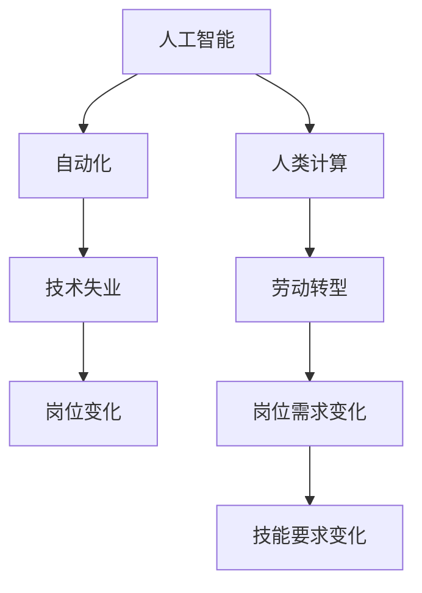
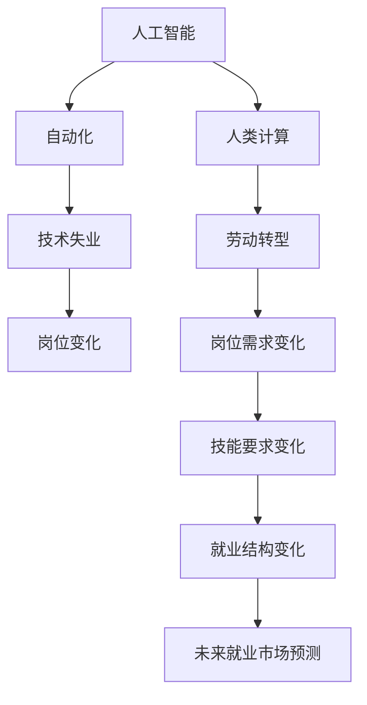

                 

# 人类计算：AI时代的未来就业市场预测

> 关键词：人工智能, 就业市场, 人类计算, 自动化, 劳动转型, 技术失业, 岗位需求

## 1. 背景介绍

### 1.1 问题由来
随着人工智能（AI）技术的迅猛发展，特别是深度学习和自然语言处理（NLP）的突破，自动化和智能化的趋势正深刻影响着各行各业。从制造到医疗，从金融到教育，AI技术的应用无处不在。然而，随之而来的是对未来就业市场的广泛关注，许多人担心大规模的自动化将导致“机器人抢走工作”，失业问题成为社会关注的焦点。

### 1.2 问题核心关键点
AI技术对就业市场的影响主要体现在以下几个方面：
- **岗位替代**：重复性、规则性强的岗位，如生产线工人、数据录入员等，更容易被机器人和自动化系统替代。
- **岗位新增**：AI技术的发展也会催生出新的就业岗位，如AI开发工程师、数据分析师、AI伦理学家等。
- **技能要求变化**：新兴AI岗位往往要求员工具备更强的技术能力和跨学科知识，需对员工的综合素质提出更高要求。
- **劳动市场的结构性变化**：AI技术可能会加速劳动市场的结构性变化，导致劳动分配的不平衡，对低技能劳动者的就业产生冲击。

理解这些关键点有助于我们深入探讨AI对就业市场的深远影响，并制定相应的应对策略。

## 2. 核心概念与联系

### 2.1 核心概念概述

为了更好地理解AI技术对就业市场的影响，本文将介绍几个密切相关的核心概念：

- **人工智能（AI）**：指利用计算机算法和机器学习技术模拟人类智能行为的科学和技术。
- **自动化（Automation）**：指通过技术和系统将人类劳动自动化，从而提高效率和减少人力成本。
- **人类计算（Human Computation）**：指将复杂计算任务分配给人类而不是机器，利用人类逻辑推理和创造性思维的优势。
- **技术失业（Technological Unemployment）**：指由于技术进步，某些职业需求减少，导致失业的现象。
- **劳动转型（Workforce Transformation）**：指劳动市场因技术进步而发生结构性变化，对劳动者技能和岗位需求进行重新配置的过程。

这些概念之间的关系可以用以下Mermaid流程图表示：



### 2.2 核心概念原理和架构的 Mermaid 流程图



这个流程图展示了AI技术如何通过自动化和人类计算，导致技术失业，推动劳动转型，最终影响未来就业市场的结构。

## 3. 核心算法原理 & 具体操作步骤
### 3.1 算法原理概述

AI技术对就业市场的影响可以通过一系列算法和模型来预测和分析。本文将从核心算法原理和具体操作步骤两方面，详细介绍这一过程。

#### 3.1.1 算法原理概述

AI对就业市场的影响主要通过以下几个算法和模型进行预测：

1. **技能替代模型**：通过分析各行业中的岗位任务，识别出容易被自动化替代的技能和岗位。
2. **岗位需求变化模型**：利用历史数据和未来趋势预测，分析AI技术发展对各岗位需求的影响。
3. **劳动市场模拟模型**：通过微观和宏观经济模型，模拟劳动市场的变化，预测未来就业趋势。
4. **技能迁移模型**：研究如何通过教育和培训，帮助劳动者进行技能转型，适应新岗位需求。

#### 3.1.2 算法步骤详解

1. **数据收集与处理**：收集各行业的岗位数据，包括岗位描述、所需技能、薪酬水平等信息。使用NLP技术提取关键信息，进行数据清洗和标注。
2. **技能识别与替代分析**：使用机器学习算法，如决策树、随机森林等，识别出容易被自动化替代的技能。通过统计和分析，确定替代比例和替代速度。
3. **岗位需求预测**：利用时间序列分析、回归模型等方法，结合行业发展趋势，预测未来各岗位的需求变化。
4. **劳动市场模拟**：建立微观和宏观经济模型，模拟劳动市场的变化，考虑技术进步、人口结构、经济周期等因素的影响。
5. **技能迁移研究**：通过教育培训等途径，分析如何帮助劳动者进行技能转型，适应新岗位需求。

#### 3.1.3 算法优缺点

AI对就业市场影响预测算法的优点包括：
- **数据驱动**：利用大数据分析，能够提供更加客观和准确的市场预测。
- **自动化分析**：通过机器学习模型，可以高效处理大量数据，减少人工工作量。
- **动态更新**：随着市场和技术的变化，算法可以实时更新，提高预测的准确性。

然而，这些算法也存在一些缺点：
- **数据质量问题**：数据的不完整、不准确或不一致会影响模型的预测精度。
- **模型复杂性**：复杂的模型需要更多的计算资源，难以实时处理大规模数据。
- **政策因素**：政府政策和市场环境的变化，可能会影响模型的预测结果。

#### 3.1.4 算法应用领域

AI对就业市场影响预测算法已经在多个领域得到应用，例如：
- **政府政策制定**：通过预测未来就业趋势，帮助政府制定更为合理的就业政策。
- **企业战略规划**：企业可以利用这些预测，调整人才战略，优化人力资源配置。
- **教育培训**：教育机构可以根据预测结果，调整培训内容和方向，提前应对就业市场变化。

## 4. 数学模型和公式 & 详细讲解 & 举例说明
### 4.1 数学模型构建

为了更严谨地分析AI对就业市场的影响，我们可以使用一些数学模型来构建预测框架。

假设我们有n个行业，每个行业有m个岗位。记第i个行业第j个岗位的任务为$T_{ij}$，所需技能为$S_{ij}$，当前需求量为$D_{ij}$，技能替代率为$R_{ij}$，岗位需求变化率为$C_{ij}$，劳动市场变化率为$L_{ij}$，技能迁移率为$M_{ij}$。

我们可以构建以下数学模型来描述AI技术对就业市场的影响：

$$
\begin{aligned}
& \min_{\theta} \sum_{i=1}^n \sum_{j=1}^m (D_{ij} \cdot (1 - R_{ij}) + C_{ij} \cdot L_{ij} + M_{ij} \cdot (1 - R_{ij})) \\
& \text{s.t.} \quad 0 \leq R_{ij} \leq 1, \quad 0 \leq C_{ij} \leq 1, \quad 0 \leq L_{ij} \leq 1, \quad 0 \leq M_{ij} \leq 1
\end{aligned}
$$

其中，$\theta$表示模型参数，约束条件表示技能替代率、岗位需求变化率、劳动市场变化率和技能迁移率必须非负且不大于1。

### 4.2 公式推导过程

以岗位需求变化率$C_{ij}$为例，利用时间序列分析模型（如ARIMA）进行推导：

$$
C_{ij} = \alpha_0 + \sum_{t=1}^{T} \alpha_t \cdot x_t + \epsilon_t
$$

其中，$x_t$为影响岗位需求变化的因子（如技术进步、市场需求、宏观经济等），$\epsilon_t$为误差项。

### 4.3 案例分析与讲解

以制造业为例，分析AI对就业市场的影响。制造业中，许多重复性、规则性强的岗位（如装配工人、搬运工人等）容易被自动化替代。利用技能替代模型，可以计算出各岗位的替代比例，进一步预测岗位需求变化。通过劳动市场模拟模型，可以模拟不同场景下劳动市场和就业结构的变化。最后，利用技能迁移模型，制定相应的教育和培训计划，帮助劳动者进行技能转型，适应新岗位需求。

## 5. 项目实践：代码实例和详细解释说明
### 5.1 开发环境搭建

在进行就业市场预测的项目实践中，我们需要搭建相应的开发环境。以下是使用Python进行TensorFlow开发的环境配置流程：

1. 安装Anaconda：从官网下载并安装Anaconda，用于创建独立的Python环境。

2. 创建并激活虚拟环境：
```bash
conda create -n tf-env python=3.8 
conda activate tf-env
```

3. 安装TensorFlow：根据CUDA版本，从官网获取对应的安装命令。例如：
```bash
conda install tensorflow tensorflow-gpu=cuda111 cudatoolkit=11.1 -c conda-forge
```

4. 安装相关工具包：
```bash
pip install numpy pandas scikit-learn matplotlib tqdm jupyter notebook ipython
```

完成上述步骤后，即可在`tf-env`环境中开始项目实践。

### 5.2 源代码详细实现

以下是一个简单的TensorFlow项目，用于预测某一行业岗位需求的变化：

```python
import tensorflow as tf
import pandas as pd
from sklearn.model_selection import train_test_split
from sklearn.metrics import mean_squared_error

# 数据加载
data = pd.read_csv('industry_data.csv')

# 数据预处理
features = data.drop('demand', axis=1)
target = data['demand']

# 特征工程
features = pd.get_dummies(features, drop_first=True)

# 划分训练集和测试集
train_features, test_features, train_target, test_target = train_test_split(features, target, test_size=0.2, random_state=42)

# 定义模型
model = tf.keras.Sequential([
    tf.keras.layers.Dense(64, activation='relu', input_shape=(features.shape[1],)),
    tf.keras.layers.Dense(32, activation='relu'),
    tf.keras.layers.Dense(1)
])

# 编译模型
model.compile(optimizer=tf.keras.optimizers.Adam(0.001), loss='mse', metrics=['mse'])

# 训练模型
model.fit(train_features, train_target, epochs=100, batch_size=32, validation_split=0.2)

# 评估模型
predictions = model.predict(test_features)
mse = mean_squared_error(test_target, predictions)
print('Mean Squared Error:', mse)
```

### 5.3 代码解读与分析

让我们再详细解读一下关键代码的实现细节：

**数据加载与预处理**：
- 使用Pandas库读取行业数据，并使用`drop`方法移除目标变量。
- 使用`get_dummies`方法进行特征工程，将分类特征转换为哑变量。
- 使用`train_test_split`方法划分训练集和测试集，保留20%的数据作为验证集。

**模型定义与训练**：
- 使用TensorFlow定义一个简单的神经网络模型，包括两个全连接层和一个输出层。
- 使用`compile`方法编译模型，指定优化器、损失函数和评估指标。
- 使用`fit`方法训练模型，设置训练轮数和批量大小。

**模型评估**：
- 使用`predict`方法预测测试集结果。
- 使用`mean_squared_error`方法计算均方误差，评估模型预测精度。

此代码展示了使用TensorFlow进行岗位需求变化预测的基本流程。实际应用中，模型还需要进一步优化和调参，以提高预测准确性。

## 6. 实际应用场景
### 6.1 政府政策制定

政府部门可以通过AI对就业市场影响的预测，制定更为合理的就业政策。例如，预测某一地区失业率上升，可以提前增加公共就业服务，提供再就业培训和创业支持。

### 6.2 企业战略规划

企业可以利用AI预测结果，调整人才战略，优化人力资源配置。例如，预测某一岗位需求下降，可以提前进行岗位调整或优化培训方案，减少人力成本。

### 6.3 教育培训

教育机构可以根据AI预测结果，调整培训内容和方向，提前应对就业市场变化。例如，预测某一岗位技能需求增加，可以增加相关课程和实践项目，提升学生的就业竞争力。

### 6.4 未来应用展望

未来，AI对就业市场影响预测技术将在更多领域得到应用，为经济社会发展提供新的工具和方法。例如，在智慧城市建设、环境保护、健康医疗等诸多领域，AI技术可以提供更为精准的市场预测，辅助决策制定。

## 7. 工具和资源推荐
### 7.1 学习资源推荐

为了帮助开发者系统掌握AI对就业市场影响预测的理论基础和实践技巧，这里推荐一些优质的学习资源：

1. 《深度学习入门：基于Python的理论与实现》系列书籍：介绍了深度学习的基础理论和实际应用，适合初学者入门。
2. Coursera的《机器学习》课程：由斯坦福大学Andrew Ng教授主讲，全面讲解机器学习理论和技术。
3. Kaggle竞赛平台：提供丰富的数据集和模型，适合实践和竞赛学习。
4. TensorFlow官方文档：提供TensorFlow的详细使用指南，适合深入学习。
5. Udacity的《深度学习专业纳米学位》课程：涵盖深度学习从理论到实践的全面内容，适合进阶学习。

通过对这些资源的学习实践，相信你一定能够快速掌握AI对就业市场影响预测的精髓，并用于解决实际的就业问题。
### 7.2 开发工具推荐

高效的开发离不开优秀的工具支持。以下是几款用于AI就业市场预测开发的常用工具：

1. Python：作为AI领域的主流编程语言，具备强大的数据处理和模型训练能力。
2. TensorFlow：由Google主导开发的深度学习框架，支持分布式计算和GPU加速，适合大规模模型训练。
3. Keras：基于TensorFlow的高级API，简化模型构建和训练过程，适合快速迭代实验。
4. Jupyter Notebook：交互式开发环境，支持Python和TensorFlow的集成，方便代码编写和调试。
5. VS Code：轻量级且功能强大的代码编辑器，支持Python、TensorFlow等插件。

合理利用这些工具，可以显著提升AI就业市场预测任务的开发效率，加快创新迭代的步伐。

### 7.3 相关论文推荐

AI对就业市场影响预测技术的发展源于学界的持续研究。以下是几篇奠基性的相关论文，推荐阅读：

1. 《机器人对美国劳动力市场的影响》（Robots and Employment）：研究自动化对美国劳动力市场的影响，提供了大量实证数据和分析。
2. 《未来就业：技能与人工智能的碰撞》（Future of Employment: How Susceptible Are Jobs to Computerization）：利用技能替代模型，预测未来就业趋势。
3. 《AI对劳动市场结构性变化的影响》（The Effect of Artificial Intelligence on the Structure of the Labor Market）：分析AI技术对劳动市场结构的影响，提出相应的政策建议。
4. 《人工智能对就业的短期和长期影响》（The Short- and Long-Run Effects of AI on Labor Market）：利用宏观经济模型，预测AI对就业的长期影响。

这些论文代表了大数据与AI结合就业市场预测的前沿研究，通过学习这些成果，可以帮助研究者把握学科发展方向，激发更多的创新灵感。

## 8. 总结：未来发展趋势与挑战
### 8.1 总结

本文对AI对就业市场影响的预测方法进行了全面系统的介绍。首先阐述了AI技术对就业市场的广泛影响，明确了预测在就业政策制定、企业战略规划、教育培训等领域的实际应用。其次，从原理到实践，详细讲解了技能替代、岗位需求变化、劳动市场模拟等核心算法，给出了具体的代码实现示例。同时，本文还广泛探讨了AI就业市场预测在智慧城市、环境保护、健康医疗等多个领域的应用前景，展示了预测范式的强大潜力。此外，本文精选了学习资源、开发工具和相关论文，力求为读者提供全方位的技术指引。

通过本文的系统梳理，可以看到，AI对就业市场影响预测技术已经逐渐成熟，并在多个领域得到广泛应用。未来，伴随技术进步和应用场景的拓展，这一技术还将持续演进，为经济社会发展提供更加精准、高效的决策支持。

### 8.2 未来发展趋势

展望未来，AI就业市场影响预测技术将呈现以下几个发展趋势：

1. **数据质量提升**：随着大数据技术和AI算法的进步，未来预测模型的数据质量将进一步提升，精度和可靠性将不断提高。
2. **模型集成与融合**：未来模型将采用更多元化的技术手段，如深度学习、因果推断、强化学习等，形成更全面、准确的市场预测。
3. **政策导向优化**：政府将更加重视AI预测结果，制定更为科学的就业政策，帮助劳动者适应市场变化。
4. **技术普及与共享**：AI预测技术将逐步普及，形成共享的数据和算法平台，促进产业界和学术界的协同创新。

这些趋势将推动AI就业市场预测技术向更高的层次发展，为经济社会决策提供更加坚实的数据基础和理论支撑。

### 8.3 面临的挑战

尽管AI就业市场影响预测技术已经取得了显著进展，但在迈向更加智能化、普适化应用的过程中，它仍面临诸多挑战：

1. **数据隐私与伦理**：大规模数据收集和处理可能涉及隐私问题，需要制定相应的数据保护措施。同时，AI模型的偏见和歧视也需要引起关注。
2. **算法透明度**：预测模型通常是“黑盒”系统，难以解释其内部工作机制和决策逻辑，需要提升模型的透明度和可解释性。
3. **技术更新迭代**：AI技术的快速发展，使得预测模型需要不断更新迭代，保持其时效性和准确性。
4. **政策与市场协同**：AI预测结果需要与政府政策、市场环境等外部因素结合，才能发挥最大效用。

这些挑战需要多方协同解决，以确保AI预测技术在实际应用中的有效性和可靠性。

### 8.4 研究展望

面对AI就业市场影响预测所面临的挑战，未来的研究需要在以下几个方面寻求新的突破：

1. **隐私保护与伦理**：研究如何保护数据隐私，减少模型偏见，提升AI预测的公平性和可信度。
2. **可解释性与透明性**：探索如何让AI模型更加透明，提供可解释的推理过程，增强用户信任。
3. **跨领域融合**：研究AI与心理学、社会学等领域的结合，提升预测的全面性和准确性。
4. **动态预测机制**：开发能够动态更新和适应市场变化的预测模型，保持预测结果的时效性和准确性。
5. **政策支持与指导**：研究政府如何通过政策支持，促进AI预测技术的普及和应用，为劳动者提供更为精准的就业指导。

这些研究方向将引领AI就业市场预测技术迈向更高的台阶，为构建安全、可靠、可解释、可控的智能系统铺平道路。面向未来，AI就业市场预测技术还需要与其他AI技术进行更深入的融合，如自然语言处理、图像识别等，多路径协同发力，共同推动经济社会发展的科学决策。只有勇于创新、敢于突破，才能不断拓展AI技术的应用边界，为经济社会发展提供更多元的工具和方法。

## 9. 附录：常见问题与解答

**Q1：AI对就业市场影响预测的准确性如何？**

A: AI对就业市场影响预测的准确性受到多种因素的影响，包括数据质量、模型复杂度、预测时长等。一般来说，数据质量越高，模型越复杂，预测的准确性就越高。但实际应用中，模型需要不断迭代和优化，才能逐步提升预测精度。

**Q2：AI就业市场影响预测的应用场景有哪些？**

A: AI就业市场影响预测技术已经在多个领域得到应用，例如：
- 政府政策制定：预测就业市场趋势，制定就业扶持政策。
- 企业战略规划：优化人力资源配置，减少人力成本。
- 教育培训：调整培训内容和方向，提升学生就业竞争力。
- 智慧城市建设：预测劳动力需求，优化资源配置。

**Q3：AI就业市场影响预测面临哪些挑战？**

A: AI就业市场影响预测面临的主要挑战包括：
- 数据隐私与伦理：大规模数据收集可能涉及隐私问题，需要制定数据保护措施。
- 算法透明度：预测模型通常是“黑盒”系统，难以解释其内部工作机制和决策逻辑。
- 技术更新迭代：AI技术的快速发展，使得预测模型需要不断更新迭代，保持其时效性和准确性。
- 政策与市场协同：预测结果需要与政府政策、市场环境等外部因素结合，才能发挥最大效用。

**Q4：如何提升AI就业市场影响预测的准确性？**

A: 提升AI就业市场影响预测的准确性，可以从以下几个方面进行：
- 收集更多高质量数据：增加数据量和多样性，提高模型训练效果。
- 优化模型结构：选择合适的模型架构，调整超参数，提升模型表现。
- 结合多领域知识：与心理学、社会学等领域结合，提升预测的全面性和准确性。
- 持续监控与优化：定期监控模型性能，根据实际情况进行调整和优化。

**Q5：AI就业市场影响预测的未来发展方向是什么？**

A: AI就业市场影响预测的未来发展方向包括：
- 数据质量提升：随着大数据技术和AI算法的进步，未来预测模型的数据质量将进一步提升，精度和可靠性将不断提高。
- 模型集成与融合：未来模型将采用更多元化的技术手段，如深度学习、因果推断、强化学习等，形成更全面、准确的市场预测。
- 政策导向优化：政府将更加重视AI预测结果，制定更为科学的就业政策，帮助劳动者适应市场变化。
- 技术普及与共享：AI预测技术将逐步普及，形成共享的数据和算法平台，促进产业界和学术界的协同创新。

通过不断创新和优化，AI就业市场影响预测技术将更好地服务于经济社会发展，为就业政策的制定和实施提供科学依据。

