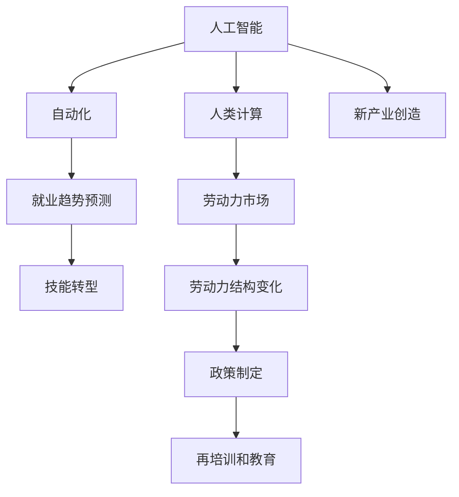

                 

# 人类计算：AI时代的未来就业趋势预测

> 关键词：人工智能(AI), 自动化, 就业趋势, 人类计算, 技能转型, 持续学习

## 1. 背景介绍

### 1.1 问题由来
随着人工智能(AI)技术的飞速发展，特别是机器学习和深度学习技术的广泛应用，许多传统工作岗位开始面临自动化替代的威胁。自动化不仅可以提高效率，降低成本，还能实现24/7的运行，使得许多需要人力介入的工作岗位变得不再必要。然而，自动化在提高效率的同时，也带来了新的挑战，尤其是对就业市场的重大影响。如何应对自动化带来的挑战，预测未来就业趋势，成为了当前学术界和工业界亟待解决的问题。

### 1.2 问题核心关键点
本文聚焦于AI技术对就业市场的影响，尤其是未来就业趋势预测。核心问题包括：
- AI技术的自动化和智能化将对哪些行业和岗位产生最大的影响？
- 哪些岗位最有可能被自动化替代？哪些岗位将得到进一步发展？
- 自动化浪潮下，人类计算的角色将发生怎样的变化？

本文将从以下几个方面进行详细探讨：
1. 自动化技术的发展现状和未来趋势。
2. AI技术对就业市场的具体影响和就业趋势预测。
3. 人类计算的角色和技能转型。
4. 如何应对自动化带来的就业挑战和机遇。

## 2. 核心概念与联系

### 2.1 核心概念概述

为更好地理解AI时代未来就业趋势预测，本节将介绍几个密切相关的核心概念：

- 人工智能(AI)：基于算法和计算机程序，模拟人类智能活动的机器。包括机器学习、深度学习、自然语言处理、计算机视觉等领域。
- 自动化：通过机器和计算机程序自动执行人类工作岗位的任务。自动化技术可大幅提高效率，降低成本。
- 人类计算：指人类在计算机辅助下进行的数据处理、计算分析和决策等任务。
- 就业趋势预测：基于经济、技术、社会等多方面因素，对未来就业市场进行预测和分析。
- 技能转型：在技术变革的背景下，工人需要重新学习、掌握新的技能，以适应新岗位的要求。

这些核心概念之间的逻辑关系可以通过以下Mermaid流程图来展示：



这个流程图展示了AI、自动化、人类计算、就业趋势预测、技能转型等概念之间的联系：

1. AI技术的发展推动了自动化技术的应用。
2. 自动化技术的发展对就业市场产生重大影响，需要预测未来就业趋势。
3. 就业趋势预测指导技能转型，帮助工人适应新的工作岗位。
4. 人类计算在新产业的创造中扮演重要角色。
5. 政策制定、再培训和教育措施是应对就业市场变化的重要手段。

## 3. 核心算法原理 & 具体操作步骤

### 3.1 算法原理概述

未来就业趋势预测通常基于历史数据和模型训练，通过机器学习、深度学习等算法进行预测。其核心思想是：利用大量的历史就业数据，训练出能预测未来就业变化的模型，并根据模型预测结果，给出未来就业市场的趋势。

形式化地，假设就业数据集为 $D=\{(x_i,y_i)\}_{i=1}^N, x_i$ 为影响因素， $y_i$ 为就业状态（如就业率、失业率等）。预测模型为 $M_{\theta}$，其中 $\theta$ 为模型参数。预测目标是最小化预测误差：

$$
\hat{y}_i = M_{\theta}(x_i), \quad \epsilon_i = y_i - \hat{y}_i
$$

通过梯度下降等优化算法，训练模型 $M_{\theta}$ 使得：

$$
\mathcal{L}(\theta) = \frac{1}{N}\sum_{i=1}^N \epsilon_i^2
$$

其中 $\epsilon_i = y_i - \hat{y}_i$ 为预测误差， $N$ 为数据集大小。

### 3.2 算法步骤详解

基于机器学习模型的就业趋势预测通常包括以下几个关键步骤：

**Step 1: 数据收集与预处理**
- 收集历史就业数据，包括时间序列数据、经济指标、行业数据等。
- 对数据进行清洗和预处理，处理缺失值、异常值，选择合适的特征变量。
- 将数据分为训练集、验证集和测试集，用于模型训练、调参和评估。

**Step 2: 模型选择与训练**
- 选择适当的预测模型，如线性回归、时间序列模型、支持向量机、随机森林等。
- 设定合适的超参数，如正则化参数、学习率、迭代轮数等。
- 使用训练集对模型进行训练，通过梯度下降等优化算法最小化预测误差。
- 在验证集上评估模型性能，根据评估结果调整模型参数。

**Step 3: 模型评估与预测**
- 在测试集上对模型进行测试，评估预测误差。
- 根据预测结果，给出未来就业趋势预测。
- 输出详细的报告，包括预测结果、置信区间、不确定性分析等。

### 3.3 算法优缺点

未来就业趋势预测模型具有以下优点：
1. 基于历史数据进行训练，预测结果具有较高的准确性和可信度。
2. 可以通过不断更新数据，提高预测的及时性和精确度。
3. 可以处理多种类型的数据，包括时间序列、文本、图像等。

同时，该模型也存在以下局限性：
1. 数据质量对预测结果有重大影响，数据缺失、噪声等问题可能影响模型性能。
2. 模型需要不断更新和调参，维护成本较高。
3. 预测结果可能受到模型假设和参数选择的限制，存在一定的偏差。
4. 预测结果难以完全消除不确定性，存在一定的误差范围。

尽管存在这些局限性，但就目前而言，基于机器学习的预测方法仍是最主流的方式。未来相关研究的重点在于如何进一步降低预测误差，提高模型泛化能力，同时兼顾数据质量和预测结果的可解释性等因素。

### 3.4 算法应用领域

基于AI技术的发展现状，未来就业趋势预测模型已在多个领域得到应用，例如：

- 经济预测：通过预测GDP、就业率等指标，评估宏观经济健康状况。
- 行业分析：分析不同行业的就业趋势，指导企业投资和政策制定。
- 劳动力市场：预测未来就业岗位的供需情况，为招聘和人才培养提供依据。
- 教育培训：评估技能需求变化，指导教育机构调整课程设置。
- 社会管理：预测人口就业趋势，为社会保障政策提供参考。

## 4. 数学模型和公式 & 详细讲解 & 举例说明

### 4.1 数学模型构建

本节将使用数学语言对未来就业趋势预测的模型进行更加严格的刻画。

记预测模型为 $M_{\theta}:\mathcal{X} \rightarrow \mathcal{Y}$，其中 $\mathcal{X}$ 为输入空间， $\mathcal{Y}$ 为输出空间， $\theta$ 为模型参数。假设历史就业数据集为 $D=\{(x_i,y_i)\}_{i=1}^N, x_i$ 为影响因素， $y_i$ 为就业状态。

定义模型 $M_{\theta}$ 在数据样本 $(x,y)$ 上的预测误差为 $\epsilon_i = y_i - M_{\theta}(x_i)$，则整体预测误差为：

$$
\mathcal{L}(\theta) = \frac{1}{N}\sum_{i=1}^N \epsilon_i^2
$$

通过梯度下降等优化算法，训练模型 $M_{\theta}$ 使得最小化预测误差：

$$
\theta \leftarrow \theta - \eta \nabla_{\theta}\mathcal{L}(\theta)
$$

其中 $\eta$ 为学习率，$\nabla_{\theta}\mathcal{L}(\theta)$ 为预测误差对模型参数的梯度，可通过反向传播算法高效计算。

### 4.2 公式推导过程

以下我们以线性回归模型为例，推导预测误差的梯度计算公式。

假设模型 $M_{\theta}$ 为线性回归模型，输出 $\hat{y}_i = \theta^T x_i$，其中 $\theta$ 为模型参数，$x_i$ 为输入变量。则预测误差为：

$$
\epsilon_i = y_i - \hat{y}_i = y_i - \theta^T x_i
$$

整体预测误差为：

$$
\mathcal{L}(\theta) = \frac{1}{N}\sum_{i=1}^N (y_i - \theta^T x_i)^2
$$

根据链式法则，预测误差对模型参数 $\theta$ 的梯度为：

$$
\frac{\partial \mathcal{L}(\theta)}{\partial \theta_k} = -\frac{2}{N}\sum_{i=1}^N (y_i - \hat{y}_i) x_{ik}
$$

其中 $x_{ik}$ 为输入变量 $x_i$ 的第 $k$ 个元素，$k=1,2,\dots,d$， $d$ 为模型参数个数。

在得到预测误差的梯度后，即可带入参数更新公式，完成模型的迭代优化。重复上述过程直至收敛，最终得到适应未来就业趋势的模型参数 $\theta^*$。

## 5. 项目实践：代码实例和详细解释说明

### 5.1 开发环境搭建

在进行未来就业趋势预测实践前，我们需要准备好开发环境。以下是使用Python进行Scikit-learn开发的环境配置流程：

1. 安装Anaconda：从官网下载并安装Anaconda，用于创建独立的Python环境。

2. 创建并激活虚拟环境：
```bash
conda create -n skl-env python=3.8 
conda activate skl-env
```

3. 安装Scikit-learn：
```bash
pip install scikit-learn
```

4. 安装各类工具包：
```bash
pip install numpy pandas matplotlib seaborn scikit-learn statsmodels tqdm jupyter notebook ipython
```

完成上述步骤后，即可在`skl-env`环境中开始预测实践。

### 5.2 源代码详细实现

下面我们以经济预测为例，给出使用Scikit-learn进行未来就业趋势预测的Python代码实现。

首先，定义预测模型和数据集：

```python
from sklearn.linear_model import LinearRegression
from sklearn.model_selection import train_test_split
import pandas as pd
import matplotlib.pyplot as plt

# 加载就业数据集
data = pd.read_csv('employment_data.csv')

# 定义输入和输出变量
X = data[['GDP_growth', 'inflation_rate', 'unemployment_rate', 'GDP_per_capita']]
y = data['employment_rate']

# 数据预处理
X = pd.get_dummies(X)
X_train, X_test, y_train, y_test = train_test_split(X, y, test_size=0.2, random_state=42)

# 定义模型
model = LinearRegression()

# 训练模型
model.fit(X_train, y_train)

# 预测结果
y_pred = model.predict(X_test)

# 可视化结果
plt.scatter(y_test, y_pred)
plt.xlabel('True Employment Rate')
plt.ylabel('Predicted Employment Rate')
plt.title('Employment Rate Prediction')
plt.show()
```

然后，输出预测结果并进行评估：

```python
from sklearn.metrics import mean_squared_error

# 评估模型
mse = mean_squared_error(y_test, y_pred)
rmse = np.sqrt(mse)
print(f"Mean Squared Error: {mse:.3f}, RMSE: {rmse:.3f}")
```

### 5.3 代码解读与分析

让我们再详细解读一下关键代码的实现细节：

**数据处理函数**：
- 使用pandas加载就业数据集。
- 提取输入和输出变量，并进行一热编码处理，以避免多重共线性。
- 使用train_test_split将数据集分为训练集和测试集。

**预测模型**：
- 选择线性回归模型作为预测模型。
- 使用fit方法对模型进行训练，通过梯度下降算法最小化预测误差。

**预测结果**：
- 使用predict方法对测试集进行预测。
- 使用Matplotlib绘制预测结果与真实值的散点图，直观展示预测效果。
- 使用mean_squared_error和RMSE（均方根误差）评估预测结果的准确性。

可以看到，Scikit-learn使得未来就业趋势预测的代码实现变得简洁高效。开发者可以将更多精力放在数据处理、模型改进等高层逻辑上，而不必过多关注底层的实现细节。

当然，工业级的系统实现还需考虑更多因素，如模型保存和部署、超参数优化、更灵活的预测目标函数等。但核心的预测范式基本与此类似。

## 6. 实际应用场景

### 6.1 智能制造与自动化

智能制造与自动化是未来就业趋势的重要领域之一。传统的制造业依赖大量人力进行生产、质量检测等任务，随着自动化技术的不断进步，机器人和自动化系统逐渐取代了这些岗位。然而，自动化浪潮也带来了新的岗位需求，如机器人维护、自动化系统集成、数据分析等，这些岗位需要更高技能水平和专业知识的工人。

例如，某智能制造企业可以收集其生产线的历史数据，包括机器运行状态、生产效率、质量检测结果等，构建时间序列模型，预测生产效率的趋势，从而优化生产计划，提升生产效率和质量。同时，通过预测机器故障的频次，提前进行维护，减少停机时间，降低成本。

### 6.2 健康医疗

健康医疗领域受到AI技术的广泛应用。随着电子病历、医学影像、生物传感等技术的发展，AI技术可以辅助医生进行疾病诊断、治疗方案制定等任务，显著提升医疗服务的质量和效率。然而，AI技术的广泛应用也导致部分传统岗位的减少，如简单的病历录入、药品管理等。

例如，某医院可以收集其患者的医疗数据，包括病历、影像、生理参数等，使用深度学习模型进行疾病预测和诊断，提升诊断准确率和效率。同时，通过预测患者出院后的健康状态，提前进行预防措施，减少复发率，降低医疗成本。

### 6.3 教育培训

教育培训领域也是未来就业趋势的重要领域。传统的教育模式依赖大量教师进行授课、批改作业等任务，随着AI技术的引入，智能辅导系统、自动化评估系统逐渐取代了这些岗位。然而，教育领域也需要新的岗位，如教学数据分析、课程开发等，这些岗位需要更高技能水平和教育背景的工人。

例如，某在线教育平台可以收集其学生的学习数据，包括课程进度、答题情况、观看时长等，使用机器学习模型进行学习效果预测和个性化推荐，提升学生的学习效果和平台的用户黏性。同时，通过预测学生的学习趋势，提前进行干预，减少辍学率，提高教育质量。

### 6.4 未来应用展望

随着AI技术的不断进步，未来就业趋势预测模型将在更多领域得到应用，为传统行业带来变革性影响。

在智慧城市治理中，预测模型可以用于城市事件监测、交通流量预测、应急响应等环节，提高城市管理的自动化和智能化水平，构建更安全、高效的未来城市。

在金融领域，预测模型可以用于股票市场预测、信用风险评估、金融产品推荐等环节，提升金融服务的智能化水平，降低金融风险。

在能源领域，预测模型可以用于电力负荷预测、能源价格预测、能源消耗预测等环节，提升能源使用的效率和安全性。

此外，在环境保护、交通运输、公共安全等多个领域，未来就业趋势预测模型也将不断涌现，为经济社会发展提供新的技术支撑。相信随着技术的日益成熟，预测模型将成为未来就业趋势分析的重要手段，助力各行各业实现智能化转型升级。

## 7. 工具和资源推荐

### 7.1 学习资源推荐

为了帮助开发者系统掌握未来就业趋势预测的理论基础和实践技巧，这里推荐一些优质的学习资源：

1. 《机器学习》系列博文：由大模型技术专家撰写，深入浅出地介绍了机器学习原理、模型训练、预测评估等基本概念。

2. CS229《机器学习》课程：斯坦福大学开设的机器学习明星课程，有Lecture视频和配套作业，带你深入理解机器学习的数学原理。

3. 《深度学习》书籍：Ian Goodfellow、Yoshua Bengio、Aaron Courville所著，全面介绍了深度学习的数学基础、模型设计、训练优化等技术。

4. Scikit-learn官方文档：Scikit-learn官方文档，提供了各类预测模型的实现和详细使用说明，是入门预测算法的必备资料。

5. Kaggle：数据科学竞赛平台，提供了大量公开的数据集和预测模型，是数据科学学习和实践的好去处。

通过对这些资源的学习实践，相信你一定能够快速掌握未来就业趋势预测的精髓，并用于解决实际的预测问题。

### 7.2 开发工具推荐

高效的开发离不开优秀的工具支持。以下是几款用于未来就业趋势预测开发的常用工具：

1. Python：作为数据科学和机器学习的主流语言，Python具有丰富的库支持和社区资源，方便快速迭代实验。

2. R语言：广泛应用于统计分析和机器学习领域，具有强大的数据处理和建模能力。

3. Scikit-learn：基于Python的机器学习库，提供了丰富的预测模型和评估指标，适合快速实现预测任务。

4. TensorFlow：由Google主导开发的深度学习框架，支持GPU/TPU加速，适合大规模工程应用。

5. Weights & Biases：模型训练的实验跟踪工具，可以记录和可视化模型训练过程中的各项指标，方便对比和调优。

6. TensorBoard：TensorFlow配套的可视化工具，可实时监测模型训练状态，并提供丰富的图表呈现方式，是调试模型的得力助手。

合理利用这些工具，可以显著提升未来就业趋势预测任务的开发效率，加快创新迭代的步伐。

### 7.3 相关论文推荐

未来就业趋势预测的研究源于学界的持续研究。以下是几篇奠基性的相关论文，推荐阅读：

1. 《机器学习》（周志华）：全面介绍了机器学习的基本原理、模型训练、预测评估等技术，是机器学习领域的经典教材。

2. 《深度学习》（Ian Goodfellow、Yoshua Bengio、Aaron Courville）：深度学习领域的经典教材，详细介绍了深度学习的数学基础、模型设计、训练优化等技术。

3. 《数据科学基础》（Trevor Hastie、Robert Tibshirani、Jerome Friedman）：统计学和数据科学领域的经典教材，介绍了数据科学的统计基础、机器学习、数据可视化等技术。

4. 《预测建模》（Keith Brueck、Carol Witte）：详细介绍了预测建模的基本原理、数据预处理、模型选择、评估等技术。

这些论文代表了大模型微调技术的发展脉络。通过学习这些前沿成果，可以帮助研究者把握学科前进方向，激发更多的创新灵感。

## 8. 总结：未来发展趋势与挑战

### 8.1 总结

本文对未来就业趋势预测方法进行了全面系统的介绍。首先阐述了AI技术对就业市场的影响，明确了未来就业趋势预测在人力资源管理、社会政策制定等方面的重要价值。其次，从原理到实践，详细讲解了机器学习模型的构建和训练过程，给出了未来就业趋势预测的完整代码实例。同时，本文还广泛探讨了未来就业趋势预测在智能制造、健康医疗、教育培训等多个行业领域的应用前景，展示了预测技术的广阔前景。此外，本文精选了预测技术的各类学习资源，力求为读者提供全方位的技术指引。

通过本文的系统梳理，可以看到，未来就业趋势预测技术正在成为人力资源管理和智能化应用的重要范式，极大地拓展了AI技术的就业应用边界，带来了更多的职业发展机会。未来，伴随AI技术的持续演进，预测技术也将不断升级优化，为经济社会发展提供更加科学、精准的预测支持。

### 8.2 未来发展趋势

展望未来，未来就业趋势预测技术将呈现以下几个发展趋势：

1. 数据质量持续提升。随着大数据技术的不断发展，更多的结构化和非结构化数据将被收集和利用，数据质量和数量将不断提升，从而提高预测模型的准确性和可靠性。

2. 模型复杂度不断提升。随着深度学习、迁移学习等技术的发展，未来的预测模型将越来越复杂，具有更高的表达能力和泛化能力。

3. 预测精度不断提升。通过引入更多的特征变量、更先进的模型结构、更高效的数据处理方法，未来预测模型的精度将不断提升，预测结果将更加准确可信。

4. 预测时效性不断提高。通过引入实时数据流处理、在线预测等技术，未来预测模型将具有更高的实时性，能够及时响应市场变化，提供实时预测结果。

5. 预测模型自动化。通过引入自动调参、自动化特征工程等技术，未来预测模型将具有更高的自动化水平，减少人工干预，提高预测效率。

6. 预测结果可解释性增强。通过引入因果推断、可解释性模型等技术，未来预测模型将具有更高的可解释性，能够清晰地展示预测结果背后的原因和逻辑。

以上趋势凸显了未来就业趋势预测技术的广阔前景。这些方向的探索发展，必将进一步提升预测模型的性能和应用范围，为经济社会发展提供更加科学、精准的预测支持。

### 8.3 面临的挑战

尽管未来就业趋势预测技术已经取得了瞩目成就，但在迈向更加智能化、普适化应用的过程中，它仍面临着诸多挑战：

1. 数据收集与处理难度。数据收集和处理是预测模型的基础，需要大量的数据预处理和特征工程，数据质量和数量对预测结果有重大影响。

2. 模型复杂度提升。随着模型复杂度的不断提升，模型训练和维护成本也将增加，模型调参和优化过程更加复杂。

3. 预测结果不确定性。预测模型存在一定的误差范围，无法完全消除不确定性，预测结果需要结合上下文进行综合判断。

4. 预测模型公平性。预测模型可能存在一定的偏见和歧视，需要通过公平性评估和调整，确保预测结果的公正性。

5. 预测结果解释性不足。预测模型往往是个"黑盒"系统，难以解释其内部工作机制和决策逻辑，需要引入可解释性模型和工具，增强预测结果的可解释性。

6. 预测模型鲁棒性不足。未来就业趋势预测模型需要具备一定的鲁棒性，以应对市场变化和数据异常。

这些挑战凸显了未来就业趋势预测技术需要进一步提升。需要在数据质量、模型复杂度、预测精度、预测时效性、预测结果可解释性等多个方面进行全面优化，才能真正实现预测模型的实际应用价值。

### 8.4 研究展望

面对未来就业趋势预测所面临的种种挑战，未来的研究需要在以下几个方面寻求新的突破：

1. 探索更高效的数据处理方法。通过引入自动化数据清洗、特征提取等技术，提高数据处理的效率和准确性。

2. 研究更先进的模型结构。通过引入深度学习、迁移学习、强化学习等技术，提高预测模型的表达能力和泛化能力。

3. 开发更高效的预测算法。通过引入高效优化算法、自动化调参等技术，提高预测模型的训练效率和预测精度。

4. 引入更多特征变量。通过引入时间序列、文本、图像等多模态数据，提高预测模型的数据融合能力。

5. 增强预测结果的公平性和可解释性。通过引入公平性评估工具、可解释性模型，提高预测结果的公正性和可解释性。

6. 提升预测模型的鲁棒性。通过引入异常检测、鲁棒性模型等技术，提高预测模型的抗干扰能力和稳定性。

这些研究方向的探索，必将引领未来就业趋势预测技术迈向更高的台阶，为经济社会发展提供更加科学、精准的预测支持。面向未来，未来就业趋势预测技术还需要与其他AI技术进行更深入的融合，如知识表示、因果推理、强化学习等，多路径协同发力，共同推动AI技术在各个领域的广泛应用。只有勇于创新、敢于突破，才能不断拓展AI技术的应用边界，让AI技术更好地造福人类社会。

## 9. 附录：常见问题与解答

**Q1：未来就业趋势预测是否适用于所有行业？**

A: 未来就业趋势预测模型适用于大多数行业，特别是对数据量和变化趋势有较高要求的行业。例如，制造业、金融业、医疗业等，可以通过预测模型进行实时监控和决策支持。然而，对于部分依赖于大量人力服务的行业，如零售、餐饮等，预测模型的应用效果可能有限。

**Q2：未来就业趋势预测需要哪些数据？**

A: 未来就业趋势预测需要多种类型的数据，包括时间序列数据、经济指标、社会数据等。具体数据应根据预测目标和应用场景进行选择，例如：
- 经济指标：GDP、就业率、失业率、通胀率等。
- 社会数据：人口结构、教育水平、技术进步、政策变化等。
- 行业数据：各行业的历史数据、市场变化、技术趋势等。

**Q3：未来就业趋势预测的模型选择有哪些？**

A: 未来就业趋势预测常用的模型包括线性回归、时间序列模型、支持向量机、随机森林、深度学习模型等。具体选择应根据数据类型、预测目标和应用场景进行综合考虑。例如，时间序列模型适用于预测趋势变化，深度学习模型适用于复杂数据和多模态数据预测。

**Q4：未来就业趋势预测的评估指标有哪些？**

A: 未来就业趋势预测的评估指标包括均方误差(MSE)、均方根误差(RMSE)、平均绝对误差(MAE)、R方系数(R-squared)等。其中，MSE和RMSE用于衡量预测误差的平方和，MAE用于衡量预测误差的绝对值，R方系数用于衡量预测模型的拟合程度。这些指标可以帮助评估预测模型的准确性和可靠性。

**Q5：未来就业趋势预测的挑战有哪些？**

A: 未来就业趋势预测的挑战包括：
1. 数据收集与处理难度：需要大量高质量数据，数据清洗和特征工程成本较高。
2. 模型复杂度提升：模型结构复杂，训练和优化难度增加。
3. 预测结果不确定性：预测模型存在误差范围，无法完全消除不确定性。
4. 预测结果解释性不足：模型往往是个"黑盒"系统，难以解释其内部工作机制和决策逻辑。
5. 预测模型公平性：模型可能存在偏见和歧视，需要引入公平性评估工具。
6. 预测模型鲁棒性不足：模型需要具备一定的鲁棒性，以应对市场变化和数据异常。

这些挑战凸显了未来就业趋势预测技术需要进一步提升。需要在数据质量、模型复杂度、预测精度、预测时效性、预测结果可解释性等多个方面进行全面优化，才能真正实现预测模型的实际应用价值。

