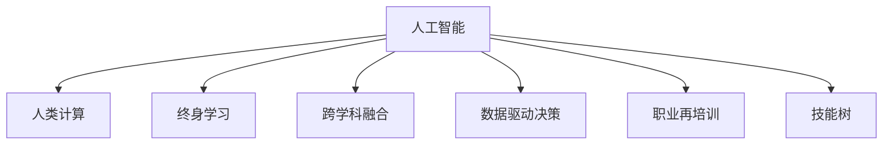

                 

# 人类计算：AI时代的未来技能发展

> 关键词：人工智能,人类计算,技能发展,未来就业趋势,教育改革,跨学科融合,数据驱动,职业再培训,终身学习

## 1. 背景介绍

### 1.1 问题由来
当前，人工智能（AI）正以迅猛的速度重塑全球经济和技术格局，深刻影响着各行各业。尤其在自动化、大数据分析、机器学习等领域，AI技术已广泛应用于解决复杂问题和提高工作效率。然而，AI的发展也带来了诸多新的挑战，包括就业结构的变化、技能需求的转变，以及教育体系的变革。

### 1.2 问题核心关键点
- **技能需求变化**：AI的广泛应用使得传统的技能需求发生了巨大变化，尤其是在数据分析、机器学习、编程等领域，新技能需求日益增多。
- **终身学习**：为适应快速变化的技术环境，终身学习成为必需，要求个人不断更新知识，掌握新技术。
- **跨学科融合**：AI的发展推动了各学科的交叉融合，如计算与生物医学、机器学习与心理学、数据科学与人文社会科学等。
- **数据驱动决策**：在商业、医疗、教育等领域，数据驱动的决策方式成为主流，要求从业者具备数据管理和分析能力。
- **职业再培训**：面对职业结构的变化，终身学习和职业再培训成为提升职业竞争力的关键。
- **伦理与隐私保护**：AI技术的广泛应用引发了关于数据隐私、算法偏见、伦理道德等新问题。

### 1.3 问题研究意义
理解AI时代的未来技能发展，对于推动教育改革、职业培训、政策制定以及人才管理具有重要意义：

- **教育改革**：通过明确未来技能需求，改革教育内容和教学方法，培养符合AI时代要求的人才。
- **职业培训**：提供系统化的职业培训项目，帮助职场人士快速适应技术变革，提升就业竞争力。
- **政策制定**：制定有利于技能发展的政策，支持终身学习、职业再培训等措施。
- **人才管理**：通过了解未来技能趋势，优化人才招聘和培养策略，确保组织在技术变革中保持竞争力。

## 2. 核心概念与联系

### 2.1 核心概念概述

为更好地理解AI时代未来技能发展，本节将介绍几个核心概念及其相互关系：

- **人工智能（AI）**：涉及机器学习、自然语言处理、计算机视觉等多个子领域，旨在模拟人类智能行为。
- **人类计算**：指人类利用计算机处理信息的过程，强调人的作用而非单纯依赖算法。
- **终身学习**：指个人在其职业生涯中持续学习新知识，适应技术变革的需求。
- **跨学科融合**：指不同学科领域的知识和方法相结合，产生新的知识和应用。
- **数据驱动决策**：基于数据分析和建模的决策方式，适用于各个行业。
- **职业再培训**：指通过培训提升现有工作技能，适应技术变化和职业需求。
- **技能树**：描述技能发展的层级结构，从基础到高级，由多种技能组合构成。

这些概念之间的逻辑关系可以通过以下Mermaid流程图来展示：



### 2.2 核心概念原理和架构

#### 2.2.1 人工智能（AI）
人工智能通过算法和计算模拟人类智能行为，包括感知、推理、学习等能力。核心原理是利用机器学习算法，如神经网络、决策树、支持向量机等，从数据中提取模式和规律，进行预测和决策。架构上，AI系统通常由数据输入、模型训练、预测输出三个部分组成。

#### 2.2.2 人类计算
人类计算强调人在数据处理和决策中的作用，包括数据分析、模型构建、结果解释等环节。与机器计算不同，人类计算依赖于人类的直觉、创造力和经验，能够处理复杂、非结构化问题。

#### 2.2.3 终身学习
终身学习是指个人在其职业生涯中不断学习新知识，保持技能更新，以适应技术变化的需求。其核心在于建立可持续的学习机制，如在线课程、工作坊、认证培训等。

#### 2.2.4 跨学科融合
跨学科融合涉及多个领域的知识和方法结合，产生新的应用和见解。其关键在于打破学科壁垒，促进知识共享和创新。

#### 2.2.5 数据驱动决策
数据驱动决策指基于数据和分析的决策方式，通过建模和预测，优化决策过程。其核心在于数据收集、清洗、分析和应用，强调数据的准确性和完备性。

#### 2.2.6 职业再培训
职业再培训是通过培训提升现有工作技能，帮助员工适应技术变化和职业需求。其关键在于识别技能差距，设计针对性培训课程，提高培训效果。

#### 2.2.7 技能树
技能树描述技能发展的层级结构，包括基础技能、核心技能和高级技能。其核心在于清晰界定各技能之间的关系，制定系统化的学习路径。

## 3. 核心算法原理 & 具体操作步骤

### 3.1 算法原理概述

AI时代的未来技能发展，涉及多个领域的技术和实践，需要综合运用多种算法和策略。以下是几个核心算法原理的概述：

#### 3.1.1 机器学习算法
机器学习算法是AI的核心，通过数据训练模型，进行预测和决策。常见的机器学习算法包括监督学习、无监督学习、强化学习等。

#### 3.1.2 自然语言处理（NLP）
自然语言处理旨在理解和生成自然语言，包括文本分析、语言模型、情感分析等。其核心在于构建语言表示模型，如BERT、GPT等。

#### 3.1.3 计算机视觉
计算机视觉涉及图像和视频处理，包括图像识别、目标检测、图像生成等。其核心在于构建深度神经网络，进行特征提取和分类。

#### 3.1.4 数据驱动决策
数据驱动决策依赖于数据分析和建模，通过数据提取信息，进行预测和决策。其核心在于选择合适的数据集，建立合适的模型，进行数据分析和解释。

### 3.2 算法步骤详解

#### 3.2.1 数据收集与预处理
数据收集与预处理是AI技能发展的基础，包括数据采集、清洗、特征提取等。确保数据质量是关键，需进行数据验证和质量控制。

#### 3.2.2 模型选择与训练
根据问题类型选择合适的模型，如分类、回归、聚类等。模型训练需选择适当的算法和超参数，如学习率、迭代次数等，确保模型收敛。

#### 3.2.3 模型评估与优化
模型训练后需进行评估，评估指标如准确率、召回率、F1分数等。根据评估结果进行模型优化，如调整超参数、增加训练数据等。

#### 3.2.4 模型应用与部署
模型训练和优化后需进行应用部署，如部署到云平台、移动设备等。需考虑模型的可扩展性和可靠性，确保模型在实际应用中稳定运行。

### 3.3 算法优缺点

#### 3.3.1 优点
1. **高效性**：通过算法和模型自动化处理数据，提高处理效率。
2. **准确性**：通过数据分析和建模，提高决策的准确性和可靠性。
3. **可解释性**：通过模型解释，理解算法的决策过程，提高透明度。
4. **泛化性**：通过数据驱动决策，适应不同场景和需求。

#### 3.3.2 缺点
1. **数据依赖性**：算法依赖于数据质量，数据偏差可能影响模型性能。
2. **复杂性**：模型构建和优化复杂，需要专业知识和技能。
3. **公平性**：算法可能存在偏见，需进行公平性评估和处理。
4. **资源消耗**：大规模数据处理和模型训练消耗大量计算资源。

### 3.4 算法应用领域

AI技能的发展涉及多个领域，包括但不限于：

- **医疗健康**：利用AI进行疾病诊断、药物研发、健康管理等。
- **金融服务**：利用AI进行风险评估、欺诈检测、投资分析等。
- **教育培训**：利用AI进行个性化教学、学习分析、智能辅导等。
- **智能制造**：利用AI进行质量控制、设备维护、供应链优化等。
- **交通运输**：利用AI进行交通流量预测、智能调度、自动驾驶等。
- **智能家居**：利用AI进行智能控制、语音识别、智能推荐等。

## 4. 数学模型和公式 & 详细讲解 & 举例说明

### 4.1 数学模型构建

#### 4.1.1 机器学习模型
机器学习模型通常由输入、输出、损失函数、优化算法组成。以线性回归为例，模型如下：

$$ y = w_0 + w_1x_1 + w_2x_2 + ... + w_nx_n $$

其中，$w_0, w_1, ..., w_n$ 为模型参数，$x_1, x_2, ..., x_n$ 为输入特征，$y$ 为输出。

#### 4.1.2 自然语言处理模型
自然语言处理模型通常包括词嵌入、语言模型、注意力机制等。以BERT模型为例，模型如下：

$$ \text{BERT}(x) = \text{MLP}(\text{CLS}(\text{Enc}(x))) $$

其中，$\text{Enc}(x)$ 为编码器，$\text{CLS}(\cdot)$ 为分类器，$\text{MLP}$ 为多层次感知器。

#### 4.1.3 计算机视觉模型
计算机视觉模型通常包括卷积神经网络（CNN）、循环神经网络（RNN）等。以CNN为例，模型如下：

$$ y = \text{Conv}(conv(x)) + \text{Pooling}(pool(x)) + \text{Flatten}(x) + \text{Dense}(dense(x)) $$

其中，$\text{Conv}$ 为卷积层，$\text{Pooling}$ 为池化层，$\text{Dense}$ 为全连接层。

#### 4.1.4 数据驱动决策模型
数据驱动决策模型通常包括统计模型、回归模型等。以线性回归为例，模型如下：

$$ y = \beta_0 + \beta_1x_1 + \beta_2x_2 + ... + \beta_nx_n + \epsilon $$

其中，$\beta_0, \beta_1, ..., \beta_n$ 为模型参数，$x_1, x_2, ..., x_n$ 为输入特征，$\epsilon$ 为误差项。

### 4.2 公式推导过程

#### 4.2.1 线性回归
线性回归模型参数估计需通过最小二乘法求解，公式如下：

$$ \hat{\beta} = (X^TX)^{-1}X^Ty $$

其中，$\hat{\beta}$ 为模型参数估计值，$X$ 为特征矩阵，$y$ 为输出向量。

#### 4.2.2 BERT模型
BERT模型的编码器部分包括多个注意力层，公式如下：

$$ \text{Enc}(x) = \text{Attention}(\text{Self-Attention}(x), x) $$

其中，$\text{Self-Attention}$ 为自注意力机制，$\text{Attention}$ 为多头注意力机制。

#### 4.2.3 CNN模型
CNN模型的卷积层和池化层公式如下：

$$ \text{Conv}(x) = \text{Filter} \ast x + Bias $$

其中，$\text{Filter}$ 为卷积核，$\ast$ 为卷积操作，$Bias$ 为偏置项。

#### 4.2.4 线性回归
数据驱动决策模型需通过最小二乘法求解参数估计值，公式如下：

$$ \hat{\beta} = (X^TX)^{-1}X^Ty $$

其中，$\hat{\beta}$ 为模型参数估计值，$X$ 为特征矩阵，$y$ 为输出向量。

### 4.3 案例分析与讲解

#### 4.3.1 数据收集与预处理
以医疗健康领域为例，数据收集与预处理步骤包括：

1. **数据采集**：从医院、诊所、公共数据库等渠道采集数据。
2. **数据清洗**：去除噪声数据、处理缺失值等。
3. **特征提取**：选择关键特征，如年龄、性别、病史等。

#### 4.3.2 模型选择与训练
以自然语言处理模型为例，模型选择与训练步骤如下：

1. **选择模型**：选择BERT模型进行文本分类。
2. **数据预处理**：将文本转换为词向量，进行分词、去停用词等处理。
3. **模型训练**：使用标注数据进行模型训练，调整超参数，确保模型收敛。

#### 4.3.3 模型评估与优化
以计算机视觉模型为例，模型评估与优化步骤如下：

1. **模型评估**：使用测试集进行模型评估，计算准确率、召回率等指标。
2. **模型优化**：调整超参数、增加训练数据等，提升模型性能。

#### 4.3.4 模型应用与部署
以金融服务领域为例，模型应用与部署步骤如下：

1. **模型部署**：将模型部署到生产环境，如云平台、移动应用等。
2. **模型优化**：根据实际运行情况进行模型优化，如调整超参数、更新模型等。

## 5. 项目实践：代码实例和详细解释说明

### 5.1 开发环境搭建

#### 5.1.1 Python环境搭建
1. **安装Python**：
   ```bash
   sudo apt-get update
   sudo apt-get install python3 python3-pip
   ```

2. **安装虚拟环境**：
   ```bash
   python3 -m venv venv
   source venv/bin/activate
   ```

3. **安装相关库**：
   ```bash
   pip install numpy pandas scikit-learn tensorflow keras
   ```

#### 5.1.2 Jupyter Notebook搭建
1. **安装Jupyter Notebook**：
   ```bash
   pip install jupyter notebook
   ```

2. **启动Jupyter Notebook**：
   ```bash
   jupyter notebook
   ```

### 5.2 源代码详细实现

#### 5.2.1 线性回归模型
```python
import numpy as np
from sklearn.linear_model import LinearRegression

# 数据生成
X = np.random.randn(100, 1)
y = 0.5 * X + np.random.randn(100, 1)

# 模型训练
model = LinearRegression()
model.fit(X, y)

# 模型预测
X_test = np.random.randn(10, 1)
y_pred = model.predict(X_test)
print(y_pred)
```

#### 5.2.2 BERT模型
```python
from transformers import BertTokenizer, BertForSequenceClassification
import torch
from torch.utils.data import DataLoader

# 数据准备
tokenizer = BertTokenizer.from_pretrained('bert-base-uncased')
train_data = ...
val_data = ...
test_data = ...

# 模型加载与配置
model = BertForSequenceClassification.from_pretrained('bert-base-uncased', num_labels=2)

# 数据预处理
train_dataset = ...
val_dataset = ...
test_dataset = ...

# 模型训练
model.train()
optimizer = torch.optim.Adam(model.parameters(), lr=2e-5)
for epoch in range(10):
    loss = train_epoch(model, train_dataset, optimizer)
    print(f"Epoch {epoch+1}, train loss: {loss:.3f}")

# 模型评估
model.eval()
accuracy = evaluate(model, val_dataset)
print(f"Val accuracy: {accuracy:.3f}")
```

#### 5.2.3 CNN模型
```python
import tensorflow as tf
from tensorflow.keras.layers import Conv2D, MaxPooling2D, Flatten, Dense

# 数据准备
x_train = ...
y_train = ...

# 模型构建
model = tf.keras.Sequential([
    Conv2D(32, (3,3), activation='relu', input_shape=(28,28,1)),
    MaxPooling2D((2,2)),
    Conv2D(64, (3,3), activation='relu'),
    MaxPooling2D((2,2)),
    Flatten(),
    Dense(128, activation='relu'),
    Dense(10, activation='softmax')
])

# 模型编译与训练
model.compile(optimizer='adam', loss='categorical_crossentropy', metrics=['accuracy'])
model.fit(x_train, y_train, epochs=10, batch_size=32)

# 模型评估
test_loss, test_acc = model.evaluate(x_test, y_test, batch_size=32)
print(f"Test accuracy: {test_acc:.3f}")
```

### 5.3 代码解读与分析

#### 5.3.1 线性回归模型
代码实现步骤如下：

1. **数据生成**：生成随机数据集，用于训练和测试模型。
2. **模型训练**：使用sklearn库中的LinearRegression模型进行训练。
3. **模型预测**：使用训练好的模型对新数据进行预测，输出预测结果。

#### 5.3.2 BERT模型
代码实现步骤如下：

1. **数据准备**：准备训练集、验证集和测试集。
2. **模型加载与配置**：使用Transformers库中的BertForSequenceClassification模型，并进行配置。
3. **数据预处理**：将文本数据转换为BERT模型所需的格式，并进行分词、去停用词等处理。
4. **模型训练**：使用Adam优化器进行模型训练，并在训练集上进行评估。
5. **模型评估**：使用验证集进行模型评估，输出准确率等指标。

#### 5.3.3 CNN模型
代码实现步骤如下：

1. **数据准备**：准备训练集、验证集和测试集。
2. **模型构建**：使用Keras构建CNN模型，包括卷积层、池化层和全连接层。
3. **模型编译与训练**：使用adam优化器和categorical_crossentropy损失函数进行模型编译和训练。
4. **模型评估**：使用测试集进行模型评估，输出准确率等指标。

## 6. 实际应用场景

### 6.1 医疗健康

AI在医疗健康领域的应用日益广泛，如疾病预测、药物研发、健康管理等。以疾病预测为例，可以利用线性回归、随机森林等模型，通过患者数据进行疾病预测和风险评估。

#### 6.1.1 疾病预测
利用线性回归模型对患者数据进行疾病预测，模型如下：

$$ y = w_0 + w_1x_1 + w_2x_2 + ... + w_nx_n $$

其中，$y$ 为疾病发生概率，$x_1, x_2, ..., x_n$ 为输入特征，如年龄、性别、病史等。

#### 6.1.2 健康管理
利用自然语言处理模型对医疗记录进行文本分析，提取关键信息，进行健康管理。例如，利用BERT模型对电子病历进行分类，识别出病情和病史信息。

### 6.2 金融服务

AI在金融服务领域的应用包括风险评估、欺诈检测、投资分析等。以欺诈检测为例，可以利用随机森林、支持向量机等模型，对交易数据进行欺诈预测。

#### 6.2.1 欺诈检测
利用随机森林模型对交易数据进行欺诈预测，模型如下：

$$ \text{Probability}(\text{Fraud}) = f(x) = \sum_{i=1}^{n}w_i\cdot\text{feature}_i(x) $$

其中，$\text{feature}_i(x)$ 为第i个特征，$w_i$ 为特征权重。

#### 6.2.2 投资分析
利用自然语言处理模型对新闻、公告等文本数据进行情感分析，识别市场情绪，进行投资决策。例如，利用BERT模型对新闻进行情感分析，输出情绪得分。

### 6.3 教育培训

AI在教育培训领域的应用包括个性化教学、学习分析、智能辅导等。以个性化教学为例，可以利用深度学习模型，对学生的学习行为进行建模，进行个性化推荐。

#### 6.3.1 个性化教学
利用深度学习模型对学生的学习行为进行建模，模型如下：

$$ y = \sum_{i=1}^{n}w_i\cdot\text{feature}_i(x) $$

其中，$x$ 为学生行为数据，$y$ 为个性化推荐。

#### 6.3.2 学习分析
利用自然语言处理模型对学生的作业、论文等文本数据进行情感分析，识别学生的学习状态，进行学习指导。例如，利用BERT模型对学生的论文进行情感分析，输出情感得分。

### 6.4 智能制造

AI在智能制造领域的应用包括质量控制、设备维护、供应链优化等。以质量控制为例，可以利用图像识别技术，对产品进行缺陷检测。

#### 6.4.1 缺陷检测
利用卷积神经网络模型对产品图片进行缺陷检测，模型如下：

$$ y = \sum_{i=1}^{n}w_i\cdot\text{feature}_i(x) $$

其中，$x$ 为产品图片，$y$ 为缺陷得分。

#### 6.4.2 设备维护
利用自然语言处理模型对设备运行日志进行文本分析，提取关键信息，进行设备维护。例如，利用BERT模型对设备运行日志进行分类，识别出异常情况。

### 6.5 交通运输

AI在交通运输领域的应用包括交通流量预测、智能调度、自动驾驶等。以交通流量预测为例，可以利用时间序列模型，对交通流量进行预测。

#### 6.5.1 交通流量预测
利用时间序列模型对交通流量进行预测，模型如下：

$$ y_t = \sum_{i=1}^{n}w_i\cdot\text{feature}_i(t) $$

其中，$y_t$ 为交通流量，$t$ 为时间，$w_i$ 为时间序列特征权重。

#### 6.5.2 智能调度
利用自然语言处理模型对交通规则和调度信息进行文本分析，进行智能调度。例如，利用BERT模型对交通规则进行分类，输出调度指令。

## 7. 工具和资源推荐

### 7.1 学习资源推荐

#### 7.1.1 在线课程
1. **Coursera**：提供大量AI和机器学习课程，如《机器学习》、《深度学习》等。
2. **edX**：提供众多计算机科学和数据科学课程，如《Data Science Fundamentals》、《Machine Learning with Python》等。
3. **Udacity**：提供数据科学和人工智能课程，如《Intro to Machine Learning with PyTorch》、《Deep Learning》等。

#### 7.1.2 书籍
1. **《Python机器学习基础教程》**：由Stefanie Molin和Savdeep Singh撰写，涵盖机器学习基础和实践。
2. **《深度学习》**：由Ian Goodfellow、Yoshua Bengio和Aaron Courville撰写，深入介绍深度学习理论和实践。
3. **《TensorFlow实战》**：由Aurélien Géron撰写，介绍TensorFlow的使用和实践。

#### 7.1.3 在线社区
1. **Stack Overflow**：程序员问答社区，涵盖大量AI和机器学习问题。
2. **Kaggle**：数据科学竞赛平台，提供大量数据集和挑战赛，适合实践学习。
3. **GitHub**：代码托管平台，提供大量开源AI项目和代码库，适合参考和学习。

### 7.2 开发工具推荐

#### 7.2.1 编程语言
1. **Python**：目前最流行的AI开发语言，具有丰富的第三方库和工具支持。
2. **R**：广泛用于统计分析和数据可视化，适合数据科学和统计建模。
3. **Scala**：适合大规模数据处理和分布式计算，常用于Spark等大数据平台。

#### 7.2.2 开发框架
1. **TensorFlow**：由Google开发的深度学习框架，适合大规模模型训练和部署。
2. **PyTorch**：由Facebook开发的深度学习框架，适合快速原型开发和研究。
3. **Keras**：基于TensorFlow和Theano等后端的高层API，适合快速原型开发和模型实验。

#### 7.2.3 开发工具
1. **Jupyter Notebook**：交互式编程环境，适合快速迭代和实验。
2. **Google Colab**：免费的云平台Jupyter Notebook，适合快速实验和共享代码。
3. **JupyterLab**：基于Web的交互式编程环境，适合团队协作和项目管理。

### 7.3 相关论文推荐

#### 7.3.1 机器学习
1. **《Deep Learning》**：由Ian Goodfellow、Yoshua Bengio和Aaron Courville撰写，涵盖深度学习理论和实践。
2. **《Pattern Recognition and Machine Learning》**：由Christopher M. Bishop撰写，介绍机器学习基础和高级算法。
3. **《The Elements of Statistical Learning》**：由Tibshirani、Hastie和Friedman撰写，涵盖统计学习理论和算法。

#### 7.3.2 自然语言处理
1. **《Speech and Language Processing》**：由Daniel Jurafsky和James H. Martin撰写，涵盖自然语言处理理论和应用。
2. **《Natural Language Processing in Action》**：由Danny Hermes和Han Xiao撰写，涵盖NLP实践和案例。
3. **《Transformers: A Survey》**：由Siddharth Khandelwal和Naman Goyal撰写，介绍Transformer模型和其应用。

#### 7.3.3 计算机视觉
1. **《Computer Vision: Algorithms and Applications》**：由Richard Szeliski撰写，涵盖计算机视觉基础和应用。
2. **《Hands-On Machine Learning with Scikit-Learn, Keras, and TensorFlow》**：由Aurélien Géron撰写，介绍机器学习和深度学习框架的实践。
3. **《Learning Deep Learning with Python》**：由Kyle Kastner、Rachel Thomas和Jake VanderPlas撰写，涵盖深度学习框架的使用和实践。

## 8. 总结：未来发展趋势与挑战

### 8.1 总结

本文对AI时代未来技能发展进行了系统介绍。首先介绍了AI技术对各行业的影响，明确了未来技能发展的趋势和挑战。其次，详细讲解了机器学习、自然语言处理、计算机视觉等多个AI核心算法和模型，提供了代码实现和分析。最后，探讨了AI技术在医疗健康、金融服务、教育培训、智能制造、交通运输等多个领域的实际应用，提供了工具和资源推荐。

通过本文的系统梳理，可以看到，AI技术的广泛应用对各行业产生了深远影响，未来技能发展将涉及多领域、多学科的交叉融合。掌握AI技能，需要系统学习机器学习、自然语言处理、计算机视觉等多个领域的基础知识和实践技巧。同时，AI技术的发展也带来了数据隐私、算法公平性、伦理道德等新问题，需要从技术、政策、伦理等多个维度进行综合考虑。

### 8.2 未来发展趋势

#### 8.2.1 数据驱动决策
数据驱动决策将成为各行业的主要决策方式，对数据分析和建模能力的需求将显著增加。

#### 8.2.2 跨学科融合
跨学科融合将成为AI技术发展的趋势，各领域将通过知识共享和创新产生新的应用和见解。

#### 8.2.3 个性化与智能化
个性化和智能化将成为AI技术的重要方向，通过数据分析和建模，实现更加精准和智能的服务。

#### 8.2.4 自动化与智能化
自动化和智能化将成为AI技术的重要目标，通过机器学习和智能算法，实现自动化的业务流程和决策。

#### 8.2.5 实时性与高效性
实时性和高效性将成为AI技术的重要特征，通过优化算法和计算资源，实现高效的实时计算和响应。

### 8.3 面临的挑战

#### 8.3.1 数据质量与数据隐私
数据质量和数据隐私是AI技术发展的瓶颈，需要建立数据治理机制，保障数据安全与隐私。

#### 8.3.2 算法公平性与偏见
算法偏见和公平性问题需要进一步研究和解决，确保AI系统的决策透明和公正。

#### 8.3.3 技术复杂性与资源消耗
AI技术的复杂性和资源消耗对计算资源和专业知识提出了更高要求，需要优化算法和计算资源。

#### 8.3.4 伦理与法律
AI技术的伦理与法律问题需要进一步研究和规范，确保技术的社会责任和合法合规。

### 8.4 研究展望

#### 8.4.1 数据治理与隐私保护
建立数据治理机制，保障数据质量与安全，确保数据隐私保护。

#### 8.4.2 算法公平性与偏见
研究算法偏见和公平性问题，确保AI系统的决策透明和公正。

#### 8.4.3 技术优化与资源高效
优化算法和计算资源，实现高效的实时计算和响应。

#### 8.4.4 伦理与法律研究
研究AI技术的伦理与法律问题，确保技术的社会责任和合法合规。

通过不断突破技术瓶颈和解决伦理问题，AI技术将更好地服务于各行业，推动社会的持续进步。

## 9. 附录：常见问题与解答

**Q1: 如何提升AI技术的实际应用效果？**

A: 提升AI技术的实际应用效果需要综合考虑数据质量、模型选择、算法优化等多个方面。具体措施包括：

1. **数据质量控制**：建立数据治理机制，保障数据质量和安全。
2. **模型选择与优化**：选择适合任务的模型，进行参数调优和模型优化。
3. **算法优化与创新**：研究新型算法和模型，提升计算效率和预测精度。
4. **跨学科融合**：结合多学科知识，创新AI技术应用。

**Q2: 未来AI技术的主要发展方向是什么？**

A: 未来AI技术的主要发展方向包括：

1. **数据驱动决策**：提升数据驱动决策能力，优化决策过程。
2. **跨学科融合**：推动各学科知识的交叉融合，产生新的应用和见解。
3. **个性化与智能化**：提升个性化和智能化服务能力，提升用户体验。
4. **自动化与智能化**：实现业务流程的自动化与智能化，提升效率和精度。
5. **实时性与高效性**：优化算法和计算资源，实现高效的实时计算和响应。

**Q3: 当前AI技术面临的主要挑战是什么？**

A: 当前AI技术面临的主要挑战包括：

1. **数据质量与数据隐私**：需要建立数据治理机制，保障数据质量与安全。
2. **算法公平性与偏见**：需要研究算法偏见和公平性问题，确保AI系统的决策透明和公正。
3. **技术复杂性与资源消耗**：需要优化算法和计算资源，实现高效的实时计算和响应。
4. **伦理与法律**：需要研究AI技术的伦理与法律问题，确保技术的社会责任和合法合规。

**Q4: 如何培养未来AI技术人才？**

A: 培养未来AI技术人才需要系统学习多学科知识，综合考虑技术、伦理、法律等多个维度。具体措施包括：

1. **跨学科学习**：系统学习机器学习、自然语言处理、计算机视觉等多个领域的基础知识和实践技巧。
2. **实践与创新**：通过实际项目和创新实践，提升技术能力和创新能力。
3. **伦理与法律**：研究AI技术的伦理与法律问题，提升技术责任感和合规意识。

**Q5: 未来AI技术的发展趋势是什么？**

A: 未来AI技术的发展趋势包括：

1. **数据驱动决策**：提升数据驱动决策能力，优化决策过程。
2. **跨学科融合**：推动各学科知识的交叉融合，产生新的应用和见解。
3. **个性化与智能化**：提升个性化和智能化服务能力，提升用户体验。
4. **自动化与智能化**：实现业务流程的自动化与智能化，提升效率和精度。
5. **实时性与高效性**：优化算法和计算资源，实现高效的实时计算和响应。

---

作者：禅与计算机程序设计艺术 / Zen and the Art of Computer Programming

