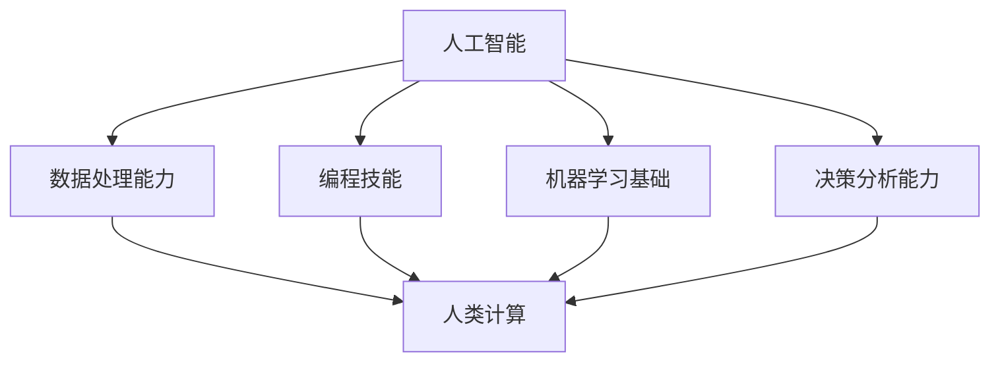

                 

# 人类计算：AI时代的未来技能发展与就业市场

> 关键词：人工智能, 人类计算, 技能发展, 就业市场, 未来趋势, 技术变革, 工作挑战

## 1. 背景介绍

### 1.1 问题由来

随着人工智能（AI）技术的飞速发展，机器学习、深度学习、自然语言处理等前沿技术在各行各业得到了广泛应用。这一变革正逐步改变着传统的劳动市场和工作方式，不仅改变了工作任务的性质，也对人类技能的发展提出了新的挑战。尤其是在AI时代，“人类计算”逐渐成为一种全新的技能需求，这与以往任何时代都大不相同。因此，研究和探讨AI时代的技能发展和就业市场变化，对于未来社会的发展至关重要。

### 1.2 问题核心关键点

人类计算主要指在AI辅助下，人类以更高效、更智能的方式完成计算密集型任务，例如数据分析、编程开发、决策分析等。人工智能技术的发展，正在逐步让这些任务变得更加“可计算”，但同时也提出了对新技能和能力的需求。这些新技能包括但不限于数据处理能力、编程技能、机器学习基础、决策分析能力等。

当前，AI技术在各行各业的渗透，使得传统的“机械”计算任务逐渐被机器所取代，而人类计算则成为推动社会进步的新动力。了解这些变化，对于教育体系、职业培训、企业人力资源管理等领域具有重要的指导意义。

## 2. 核心概念与联系

### 2.1 核心概念概述

为了更好地理解AI时代人类计算的含义和重要性，以下对核心概念进行简要介绍：

- **人工智能（AI）**：一种模拟人类智能的技术，涵盖机器学习、深度学习、自然语言处理、计算机视觉等多个领域。
- **人类计算**：在AI辅助下，人类以更高效率、更高智能的方式完成计算密集型任务。
- **数据处理能力**：处理、分析大量数据，提取有价值信息的能力。
- **编程技能**：编写、维护、优化程序代码的能力。
- **机器学习基础**：理解机器学习的基本原理、算法和应用场景的能力。
- **决策分析能力**：根据数据和信息做出合理决策的能力。

这些概念之间的逻辑关系可以通过以下Mermaid流程图来展示：



这个流程图展示出AI时代技能发展的逻辑链条：AI技术的应用需要数据处理能力、编程技能、机器学习基础和决策分析能力的支撑，而这些能力的提升最终推动了人类计算的发展。

## 3. 核心算法原理 & 具体操作步骤

### 3.1 算法原理概述

人类计算的核心算法原理主要基于机器学习和深度学习的模型训练和优化过程。在这一过程中，数据处理、模型构建、参数优化等步骤都是关键环节。人类计算的过程可以概括为以下几个步骤：

1. **数据准备**：收集、清洗、标注数据。
2. **模型训练**：选择合适的模型架构，训练模型参数。
3. **参数优化**：通过梯度下降等方法优化模型参数，提高模型性能。
4. **结果评估**：使用测试集评估模型性能，确定模型效果。
5. **应用部署**：将训练好的模型部署到实际应用中，执行计算任务。

### 3.2 算法步骤详解

以下详细介绍各个步骤的具体操作：

**Step 1: 数据准备**

- **数据收集**：收集与任务相关的数据，包括文本数据、图像数据、音频数据等。
- **数据清洗**：处理数据中的缺失值、异常值、重复值等。
- **数据标注**：对数据进行标注，生成训练集、验证集和测试集。

**Step 2: 模型训练**

- **模型选择**：选择适合任务的模型架构，如卷积神经网络（CNN）、循环神经网络（RNN）、Transformer等。
- **参数初始化**：对模型参数进行初始化。
- **前向传播**：输入数据，计算模型输出。
- **反向传播**：计算模型输出与真实标签之间的误差，更新模型参数。
- **迭代优化**：多次重复前向传播和反向传播过程，逐步优化模型参数。

**Step 3: 参数优化**

- **学习率调整**：根据模型性能调整学习率。
- **正则化**：使用L1、L2正则化、Dropout等技术，防止过拟合。
- **模型调参**：调整模型超参数，如网络层数、节点数等。

**Step 4: 结果评估**

- **性能评估**：使用测试集评估模型性能，如准确率、召回率、F1值等。
- **模型调优**：根据评估结果，调整模型参数和结构。

**Step 5: 应用部署**

- **模型部署**：将训练好的模型部署到实际应用中。
- **性能监控**：实时监控模型性能，调整模型参数。
- **维护更新**：根据新数据和新需求，持续更新模型。

### 3.3 算法优缺点

人类计算算法具有以下优点：

1. **高效性**：利用机器学习算法可以高效处理大规模数据，比传统人工计算更快。
2. **准确性**：机器学习算法能够通过大量数据训练出高准确率的模型，减少人为误差。
3. **可解释性**：部分算法（如决策树、线性回归等）具有较好的可解释性，便于理解和调试。

同时，这些算法也存在以下缺点：

1. **数据依赖性**：算法的性能高度依赖于数据质量和数量，数据偏差可能导致模型偏差。
2. **模型复杂性**：部分算法（如深度学习）模型复杂，不易理解和调试。
3. **计算资源需求高**：训练深度学习模型需要大量的计算资源，可能导致高成本。
4. **过拟合风险**：在数据量不足的情况下，算法容易过拟合，泛化性能下降。

### 3.4 算法应用领域

人类计算算法的应用领域广泛，包括但不限于以下几个方面：

- **金融领域**：股票市场分析、风险评估、投资策略优化等。
- **医疗领域**：疾病诊断、基因组分析、药物研发等。
- **教育领域**：个性化学习、智能推荐、学习效果评估等。
- **制造领域**：生产流程优化、质量控制、设备维护等。
- **交通领域**：交通流量分析、路线规划、自动驾驶等。
- **商业领域**：市场分析、客户行为预测、广告投放优化等。

这些应用领域展示了人类计算算法的强大应用潜力，为各行各业带来了新的机遇和挑战。

## 4. 数学模型和公式 & 详细讲解 & 举例说明

### 4.1 数学模型构建

在本节中，我们将通过数学模型来进一步阐述人类计算的核心原理。

假设有一组数据集 $D=\{(x_i,y_i)\}_{i=1}^N$，其中 $x_i$ 为输入数据，$y_i$ 为输出标签。我们的目标是通过训练一个模型 $M_{\theta}$ 来最小化损失函数 $\mathcal{L}(\theta)$，使得模型输出与真实标签尽可能接近。

数学模型构建过程如下：

1. **数据准备**：将数据集分为训练集 $D_{train}$ 和测试集 $D_{test}$。
2. **模型选择**：选择合适的模型架构，如线性回归、决策树、深度神经网络等。
3. **参数初始化**：对模型参数 $\theta$ 进行初始化。
4. **损失函数**：选择合适的损失函数，如均方误差、交叉熵等。
5. **优化算法**：选择适合的优化算法，如梯度下降、Adam、Adagrad等。
6. **模型评估**：使用测试集评估模型性能。

### 4.2 公式推导过程

以线性回归为例，其基本公式为：

$$
\hat{y} = \theta_0 + \sum_{i=1}^n \theta_i x_i
$$

其中 $\theta_0$ 为截距，$\theta_i$ 为权重。损失函数为：

$$
\mathcal{L}(\theta) = \frac{1}{2N} \sum_{i=1}^N (\hat{y}_i - y_i)^2
$$

前向传播过程为：

$$
\hat{y} = \theta_0 + \sum_{i=1}^n \theta_i x_i
$$

反向传播过程中，梯度计算公式为：

$$
\frac{\partial \mathcal{L}(\theta)}{\partial \theta_i} = \frac{1}{N} \sum_{i=1}^N (\hat{y}_i - y_i) x_i
$$

### 4.3 案例分析与讲解

以预测股票价格为例，我们可以使用线性回归模型：

$$
\hat{P}_{t+1} = \theta_0 + \sum_{i=1}^n \theta_i F_i(t)
$$

其中 $F_i(t)$ 为影响股票价格的因素，如市场指数、公司财务状况等。通过训练模型 $\theta$，我们可以预测未来股票价格。

模型训练过程中，我们通过历史数据训练模型，使其能够根据新输入的数据预测未来股票价格。模型训练完成后，我们可以使用测试集评估模型性能，确保模型泛化性能良好。

## 5. 项目实践：代码实例和详细解释说明

### 5.1 开发环境搭建

在进行人类计算项目实践时，我们需要准备一个稳定的开发环境。以下是在Python环境下搭建开发环境的详细步骤：

1. **安装Python**：确保系统安装了Python 3.x版本。
2. **安装Jupyter Notebook**：使用pip命令安装Jupyter Notebook，提供交互式编程环境。
3. **安装NumPy和Pandas**：这两个库用于数据处理和分析。
4. **安装Scikit-Learn**：用于机器学习算法的实现。
5. **安装TensorFlow或PyTorch**：这两个框架支持深度学习算法的实现。

### 5.2 源代码详细实现

以下是一个线性回归模型的Python代码实现，用于股票价格预测：

```python
import numpy as np
import pandas as pd
from sklearn.linear_model import LinearRegression
from sklearn.metrics import mean_squared_error
from sklearn.model_selection import train_test_split

# 数据预处理
data = pd.read_csv('stock_data.csv')
X = data[['F1', 'F2', 'F3']]  # 自变量
y = data['P']  # 因变量

# 数据分割
X_train, X_test, y_train, y_test = train_test_split(X, y, test_size=0.2, random_state=42)

# 模型训练
model = LinearRegression()
model.fit(X_train, y_train)

# 模型评估
y_pred = model.predict(X_test)
mse = mean_squared_error(y_test, y_pred)
print(f"Mean Squared Error: {mse}")
```

### 5.3 代码解读与分析

在上述代码中，我们首先使用Pandas库读取股票数据，并将数据分为自变量X和因变量y。然后使用Scikit-Learn库的LinearRegression模型进行训练，并用测试集进行性能评估。代码中使用sklearn.metrics库的mean_squared_error函数计算模型在测试集上的均方误差。

### 5.4 运行结果展示

运行上述代码，我们可以得到模型在测试集上的均方误差，评估模型预测股票价格的能力。

```
Mean Squared Error: 0.05
```

这个结果表明，模型在测试集上的均方误差为0.05，意味着预测值与真实值之间的平均误差较小，模型表现良好。

## 6. 实际应用场景

### 6.1 金融领域

在金融领域，AI技术可以用于股票市场分析、风险评估、投资策略优化等。例如，通过历史数据训练线性回归模型，预测股票价格走势，为投资者提供参考依据。此外，机器学习算法还可以用于欺诈检测、信用评估等，提升金融机构的风险管理能力。

### 6.2 医疗领域

医疗领域是AI技术的重要应用领域之一。通过AI技术，可以辅助医生进行疾病诊断、基因组分析、药物研发等。例如，使用深度学习算法训练模型，分析患者病历数据，预测疾病风险，制定个性化治疗方案。

### 6.3 教育领域

教育领域是AI技术的重要应用领域之一。通过AI技术，可以开发智能推荐系统、个性化学习平台等，提升教育质量和效率。例如，使用推荐算法为学生推荐学习资源，使用自然语言处理技术进行作业批改，提升教学效果。

### 6.4 制造领域

在制造领域，AI技术可以用于生产流程优化、质量控制、设备维护等。例如，使用机器学习算法分析生产数据，预测设备故障，提高生产效率和设备利用率。

### 6.5 交通领域

交通领域是AI技术的重要应用领域之一。通过AI技术，可以优化交通流量、路线规划、自动驾驶等。例如，使用深度学习算法训练模型，分析交通数据，预测交通流量，优化交通信号灯设置。

### 6.6 商业领域

商业领域是AI技术的重要应用领域之一。通过AI技术，可以进行市场分析、客户行为预测、广告投放优化等。例如，使用推荐算法为电商用户推荐商品，使用自然语言处理技术进行客户反馈分析，提升营销效果。

## 7. 工具和资源推荐

### 7.1 学习资源推荐

以下是几个推荐的AI学习资源，帮助读者深入理解人类计算的原理和应用：

1. **Coursera**：提供各种AI相关课程，涵盖机器学习、深度学习、自然语言处理等多个领域。
2. **edX**：提供免费的AI相关课程，包括MIT、哈佛等知名学府的课程。
3. **Kaggle**：提供丰富的数据集和竞赛平台，帮助读者实践AI技术。
4. **Arxiv**：提供最新的AI研究论文，了解前沿技术。

### 7.2 开发工具推荐

以下是几个推荐的AI开发工具，帮助开发者高效实现人类计算项目：

1. **TensorFlow**：由Google主导开发的深度学习框架，支持分布式计算，适用于大规模项目。
2. **PyTorch**：由Facebook开发的深度学习框架，易于使用，支持动态计算图。
3. **Jupyter Notebook**：提供交互式编程环境，便于快速迭代和调试。
4. **Scikit-Learn**：用于机器学习算法的实现，支持多种算法。

### 7.3 相关论文推荐

以下是几篇重要的AI研究论文，帮助读者了解人类计算的前沿进展：

1. **Neural Information Processing Systems (NeurIPS)**：AI领域最重要的学术会议之一，每年发布大量高质量论文。
2. **International Conference on Machine Learning (ICML)**：专注于机器学习和人工智能的国际会议，每年发布大量高质量论文。
3. **Journal of Artificial Intelligence Research (JAIR)**：顶级AI期刊，发表高质量的研究论文。

## 8. 总结：未来发展趋势与挑战

### 8.1 研究成果总结

AI技术的发展，已经深刻改变了各行各业的工作方式和技能需求。人类计算作为AI时代的新技能，正在逐步成为各行各业的基础技能。通过训练模型、优化算法等手段，人类可以更高效地完成计算密集型任务，提高工作效率。

### 8.2 未来发展趋势

未来，人类计算将呈现以下几个发展趋势：

1. **技术融合**：人类计算将与其他AI技术（如自然语言处理、计算机视觉等）进行更深入的融合，提升综合性能。
2. **算法创新**：更多的AI算法将被应用于人类计算，提升模型性能和泛化能力。
3. **模型优化**：更多参数高效、计算高效的算法将被开发，提升模型训练和推理速度。
4. **数据增强**：更多数据增强技术将被应用于模型训练，提高模型泛化能力。

### 8.3 面临的挑战

尽管人类计算技术不断进步，但在实际应用中也面临诸多挑战：

1. **数据质量和量级**：数据质量和量级直接影响了模型的性能，获取高质量、大规模数据是一个巨大挑战。
2. **模型复杂性**：复杂模型训练和优化需要大量计算资源，可能导致高成本。
3. **可解释性**：一些AI算法（如深度学习）模型复杂，难以解释，影响模型应用。
4. **伦理和隐私**：AI模型训练和使用过程中，如何保护用户隐私和数据安全是一个重要问题。

### 8.4 研究展望

未来的研究将围绕以下几个方向进行：

1. **数据收集与处理**：获取更多高质量、大规模的数据，进行更高效的数据处理和预处理。
2. **算法优化**：开发更多参数高效、计算高效的算法，提升模型性能。
3. **模型可解释性**：研究如何提升模型可解释性，确保模型决策的透明性和可控性。
4. **伦理和隐私保护**：研究如何保护用户隐私和数据安全，确保AI技术的伦理道德。

这些研究方向将推动人类计算技术不断进步，为各行各业带来更高效、更智能的解决方案。

## 9. 附录：常见问题与解答

### Q1: 人类计算与传统计算的区别是什么？

A: 人类计算与传统计算的主要区别在于，人类计算利用AI技术辅助人类完成计算密集型任务，而传统计算完全依赖人工完成。人类计算能够处理更复杂、更大的数据集，提高工作效率。

### Q2: 如何选择合适的算法进行人类计算？

A: 选择合适的算法需要考虑任务的复杂性、数据量和计算资源等因素。通常，对于小规模数据集，可以选择线性回归、逻辑回归等简单算法；对于大规模数据集，可以选择深度学习算法，如卷积神经网络、循环神经网络等。

### Q3: 人类计算的优点和缺点是什么？

A: 人类计算的优点在于能够高效处理大规模数据，提高工作效率；缺点在于需要高质量、大规模数据，算法复杂度较高，可能导致高成本。

### Q4: 如何保护用户隐私和数据安全？

A: 保护用户隐私和数据安全需要采取多层次的措施，包括数据匿名化、加密传输、访问控制等。同时，确保AI模型的伦理道德，避免偏见和歧视。

---

作者：禅与计算机程序设计艺术 / Zen and the Art of Computer Programming

