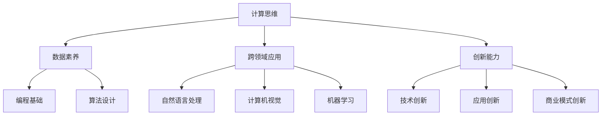

                 

# 人类计算：AI时代的未来技能培训需求

> 关键词：AI技能培训,计算思维,创新能力,数据素养,跨领域应用

## 1. 背景介绍

随着人工智能技术的飞速发展，各行各业正在经历一场深刻的变革。人工智能（AI）不仅在自动化、智能化方面实现了重大突破，还正在从根本上改变人类的工作方式、生活方式乃至思维方式。如何在这一背景下，为未来的技术人才提供合适的技能培训，已成为教育机构和培训组织的重大挑战。本文将从AI时代的技能培训需求出发，探讨培养新型AI人才的必要性和方法。

### 1.1 人工智能技术的迅猛发展

在过去的几年中，人工智能技术取得了令人瞩目的进展。从深度学习、强化学习到生成对抗网络（GAN）、自监督学习等，AI领域不断涌现出新的研究方法和应用场景。这些技术的突破，使得AI在图像识别、语音识别、自然语言处理、自动驾驶、智能推荐等多个领域实现了重大突破。人工智能技术的应用范围不断扩大，覆盖了医疗、金融、教育、制造等各个行业，对人类社会的影响日益深远。

### 1.2 AI时代对技能培训的需求

AI技术的快速发展，对未来技术人才的技能培训提出了新的要求。在AI时代，除了传统的编程、算法、数据结构等计算机核心技能外，还需要掌握更多跨领域应用和创新能力。这不仅要求未来的技术人才具备扎实的理论基础，更需要具备实践动手能力、数据分析能力、跨学科应用能力、创新思维能力等多方面的综合素质。因此，如何培养符合AI时代需求的新型技术人才，成为了当前教育和培训领域的重大课题。

## 2. 核心概念与联系

### 2.1 核心概念概述

在AI时代，技能培训的核心概念包括：

- **计算思维**：指利用计算机科学的概念和技术，分析和解决问题的一种思维方式。包括算法设计、数据结构、编程基础、计算复杂性等关键内容。
- **数据素养**：指利用数据进行决策和分析的能力，包括数据采集、清洗、分析和可视化等。数据素养是AI时代不可或缺的技能。
- **跨领域应用**：指将AI技术应用于多个领域的技能。如自然语言处理应用于智能客服、智能推荐系统等。
- **创新能力**：指在现有技术基础上，提出新的方法、新的应用场景的能力。包括技术创新、应用创新、商业模式创新等。

这些核心概念通过以下Mermaid流程图（注意：流程图中不要有括号、逗号等特殊字符）来展示：



### 2.2 核心概念原理和架构

计算思维的原理是利用计算机科学的思维方式解决问题。其核心在于抽象和分解，将复杂问题分解为多个子问题，通过算法设计解决每个子问题，最终将子问题的解决方案组合起来，形成整体的解决方案。计算思维的架构包括算法设计、数据结构、程序设计和系统设计等关键环节。

数据素养的核心是数据驱动的决策能力。其原理在于数据采集、数据清洗、数据存储、数据分析和数据可视化等过程。数据素养的关键在于理解和应用统计学、数据挖掘、机器学习等数据分析技术，从中提取有价值的信息，支持决策和优化。

跨领域应用的核心是将AI技术应用于多个领域的技能。其原理在于理解各领域的特点和需求，将AI技术进行适当的抽象和封装，形成通用的技术解决方案。跨领域应用的关键在于跨学科知识的整合和应用。

创新能力是利用现有技术提出新的应用场景和方法的能力。其原理在于对现有技术的深入理解和应用，结合领域知识，提出新颖的解决方案。创新能力的关键在于技术积累、领域知识、创新思维和团队协作等综合素质。

## 3. 核心算法原理 & 具体操作步骤

### 3.1 算法原理概述

在AI时代，技能培训的核心算法原理包括：

- **算法设计**：指利用计算机科学的知识，设计和实现解决问题的方法。
- **数据清洗**：指对原始数据进行预处理，去除噪声和异常值，形成可用于分析和决策的数据集。
- **机器学习**：指利用数据进行训练，构建模型并进行预测和决策的能力。
- **自然语言处理**：指利用计算机科学和语言学的知识，实现文本信息的处理和理解。

这些算法原理在技能培训中具有重要应用。算法设计是计算思维的核心内容，数据清洗和机器学习是数据素养的关键技能，自然语言处理则是跨领域应用的重要组成部分。

### 3.2 算法步骤详解

在AI时代，技能培训的具体操作步骤包括：

1. **算法设计和实现**：
   - **步骤1**：选择合适的算法，根据问题特点进行设计和实现。
   - **步骤2**：编写算法代码，并进行测试和调试。
   - **步骤3**：优化算法性能，提高计算效率。

2. **数据清洗和处理**：
   - **步骤1**：采集原始数据。
   - **步骤2**：对数据进行预处理，包括去重、去噪、填补缺失值等。
   - **步骤3**：将处理后的数据存储到数据库中，进行分析和建模。

3. **机器学习和模型训练**：
   - **步骤1**：选择合适的机器学习算法，构建模型。
   - **步骤2**：利用训练数据进行模型训练，调整模型参数。
   - **步骤3**：在测试数据上评估模型性能，并进行优化。

4. **自然语言处理和应用**：
   - **步骤1**：对文本数据进行分词、标注等预处理。
   - **步骤2**：利用语言模型、句法分析等技术进行文本理解和生成。
   - **步骤3**：将自然语言处理技术应用于多个领域，如智能客服、智能推荐等。

### 3.3 算法优缺点

技能培训的算法优点包括：

- **效率高**：算法设计可以快速解决复杂问题，提高效率。
- **适应性强**：算法可以根据不同领域的特点进行定制和优化，具有较强的适应性。
- **可扩展性**：算法可以应用于多个领域，具有较强的可扩展性。

技能培训的算法缺点包括：

- **复杂度高**：算法设计和实现过程较为复杂，需要较高的技术水平。
- **数据依赖性**：算法依赖于高质量的数据集，对数据采集和处理的要求较高。
- **模型解释性差**：一些复杂的算法模型，如深度学习模型，其决策过程难以解释和调试。

### 3.4 算法应用领域

技能培训的算法在多个领域具有广泛的应用，包括：

- **医疗领域**：利用自然语言处理技术，处理和分析医疗文本，辅助诊断和治疗。
- **金融领域**：利用机器学习技术，进行风险评估、信用评分、智能投顾等。
- **教育领域**：利用算法设计，开发个性化推荐系统，提高教育效果。
- **制造领域**：利用机器视觉和深度学习技术，进行产品检测、质量控制等。

这些应用展示了算法的强大潜力和广阔前景。

## 4. 数学模型和公式 & 详细讲解 & 举例说明

### 4.1 数学模型构建

在AI时代，技能培训的数学模型包括：

- **线性回归模型**：用于预测连续型数据，表示形式为 $y=ax+b$。
- **逻辑回归模型**：用于预测二分类数据，表示形式为 $P(y=1|x)=\frac{1}{1+e^{-z}}$。
- **决策树模型**：用于分类和回归问题，通过划分数据集形成决策树。
- **支持向量机模型**：用于分类问题，通过最大化分类边界。

这些数学模型在技能培训中具有重要应用。

### 4.2 公式推导过程

以逻辑回归模型为例，其公式推导过程如下：

- **数据准备**：假设训练数据集为 $(x_i,y_i)$，$i=1,2,\ldots,N$。
- **目标函数**：利用损失函数（如交叉熵）表示模型与真实标签的差异。
- **模型训练**：通过梯度下降算法最小化目标函数，更新模型参数 $w$ 和 $b$。
- **模型评估**：在测试数据集上评估模型性能，计算准确率、召回率、F1分数等指标。

### 4.3 案例分析与讲解

以医疗领域的应用为例，利用自然语言处理技术处理和分析电子病历文本。具体步骤如下：

1. **文本采集**：从医院系统中采集电子病历文本数据。
2. **文本清洗**：对文本进行去重、去噪、分词等预处理。
3. **实体识别**：利用命名实体识别技术，提取文本中的实体信息（如疾病、药品等）。
4. **关系抽取**：利用关系抽取技术，提取实体之间的关系（如因果关系、相互作用等）。
5. **数据分析**：利用统计学和机器学习技术，分析实体信息及其关系，生成预测模型。
6. **模型评估**：在测试数据集上评估模型性能，优化模型参数。

## 5. 项目实践：代码实例和详细解释说明

### 5.1 开发环境搭建

在AI时代，技能培训的开发环境搭建包括：

- **环境准备**：安装Python、Jupyter Notebook、Git等开发工具。
- **数据集准备**：准备数据集，并进行预处理和清洗。
- **工具安装**：安装必要的Python库，如Numpy、Pandas、Scikit-learn等。

### 5.2 源代码详细实现

以自然语言处理为例，展示代码实现过程：

```python
# 导入必要的库
import numpy as np
import pandas as pd
from sklearn.model_selection import train_test_split
from sklearn.feature_extraction.text import CountVectorizer
from sklearn.linear_model import LogisticRegression

# 加载数据集
data = pd.read_csv('data.csv')

# 文本清洗
data['text'] = data['text'].apply(lambda x: x.lower())
data['text'] = data['text'].apply(lambda x: re.sub('[^a-zA-Z]', ' ', x))

# 特征提取
vectorizer = CountVectorizer()
X = vectorizer.fit_transform(data['text'])
y = data['label']

# 划分训练集和测试集
X_train, X_test, y_train, y_test = train_test_split(X, y, test_size=0.2)

# 模型训练
model = LogisticRegression()
model.fit(X_train, y_train)

# 模型评估
y_pred = model.predict(X_test)
print(classification_report(y_test, y_pred))
```

### 5.3 代码解读与分析

代码实现过程如下：

1. **数据准备**：加载原始数据集，并进行预处理和清洗。
2. **特征提取**：利用CountVectorizer将文本转换为向量表示。
3. **模型训练**：选择LogisticRegression模型，在训练集上进行训练。
4. **模型评估**：在测试集上评估模型性能，输出分类报告。

## 6. 实际应用场景

### 6.1 医疗领域

在医疗领域，自然语言处理技术可以处理和分析大量的医疗文本数据，辅助医生进行诊断和治疗。具体应用包括：

- **医学文献分析**：利用自然语言处理技术，分析医学文献中的信息，提取关键内容，生成医学知识图谱。
- **电子病历分析**：利用自然语言处理技术，处理和分析电子病历文本，辅助医生进行诊断和治疗。
- **医学问答系统**：利用自然语言处理技术，构建医学问答系统，回答医生和患者的问题。

### 6.2 金融领域

在金融领域，机器学习技术可以用于风险评估、信用评分、智能投顾等应用。具体应用包括：

- **信用评分系统**：利用机器学习技术，对用户的信用行为进行评分，评估其信用风险。
- **智能投顾系统**：利用机器学习技术，根据用户偏好和市场情况，推荐股票和基金。
- **金融市场预测**：利用机器学习技术，预测金融市场的走势和波动情况。

### 6.3 教育领域

在教育领域，个性化推荐系统可以提高教育效果。具体应用包括：

- **个性化推荐系统**：利用机器学习技术，根据学生的学习行为和偏好，推荐合适的学习资源和课程。
- **智能辅导系统**：利用自然语言处理技术，回答学生的问题，提供智能辅导。
- **学习数据分析**：利用机器学习技术，分析学生的学习数据，生成学习报告，帮助教师改进教学。

### 6.4 未来应用展望

未来，随着AI技术的不断进步，技能培训的应用将更加广泛和深入。可以预见，以下领域将成为AI技能培训的主要方向：

- **跨领域应用**：将AI技术应用于多个领域，如智能客服、智能推荐、智能安防等。
- **人机协作**：利用AI技术，辅助人类完成复杂的任务，提升工作效率和质量。
- **创新能力培养**：通过AI技术，培养学生的创新思维和跨学科应用能力。

## 7. 工具和资源推荐

### 7.1 学习资源推荐

在AI时代，技能培训的学习资源包括：

- **在线课程**：如Coursera、Udacity、edX等平台提供的AI相关课程。
- **书籍**：如《深度学习》、《机器学习实战》、《自然语言处理综论》等经典书籍。
- **公开资源**：如GitHub、arXiv等平台提供的大量开源代码和论文资源。

### 7.2 开发工具推荐

在AI时代，技能培训的开发工具包括：

- **Jupyter Notebook**：用于编写和运行Python代码，支持数据可视化和交互式编程。
- **Git**：用于版本控制和协作开发，方便团队共享代码和数据。
- **GitHub**：用于代码托管和版本控制，支持开源协作。

### 7.3 相关论文推荐

在AI时代，技能培训的相关论文包括：

- **《深度学习》（Goodfellow等，2016）**：全面介绍深度学习的基本概念和算法。
- **《机器学习实战》（Peter Harrington，2012）**：详细讲解机器学习的实际应用。
- **《自然语言处理综论》（Daniel Jurafsky和James H. Martin，2021）**：系统介绍自然语言处理的基础知识和应用技术。

## 8. 总结：未来发展趋势与挑战

### 8.1 研究成果总结

在AI时代，技能培训的研究成果主要集中在以下几个方面：

- **算法设计**：研究新的算法设计和优化方法，提高计算效率和模型精度。
- **数据清洗和处理**：研究高质量数据集的采集和处理方法，提高数据素养。
- **模型训练和评估**：研究新的模型训练和评估方法，提高模型的泛化能力和解释性。
- **跨领域应用**：研究AI技术在不同领域的应用，提升跨学科应用能力。

### 8.2 未来发展趋势

未来，技能培训的发展趋势包括：

- **技术融合**：AI技术与其他技术（如物联网、区块链等）的融合，形成更广泛的应用场景。
- **数据驱动**：利用大数据技术，挖掘更多的数据价值，驱动技术创新。
- **跨学科应用**：AI技术在不同学科领域的交叉应用，提升跨学科应用能力。

### 8.3 面临的挑战

技能培训在AI时代面临的挑战包括：

- **数据质量问题**：高质量数据集的获取和处理是一个难题，数据偏差和噪声会影响模型的性能。
- **技术复杂性**：AI技术的复杂性和多样性增加了技能培训的难度。
- **伦理和法律问题**：AI技术的应用可能带来伦理和法律问题，需要谨慎处理。

### 8.4 研究展望

未来，技能培训的研究方向包括：

- **数据智能**：研究高效的数据采集、清洗和处理技术，提升数据素养。
- **模型优化**：研究高效的算法设计和优化方法，提高模型的精度和泛化能力。
- **跨学科应用**：研究AI技术在不同学科领域的交叉应用，提升跨学科应用能力。

## 9. 附录：常见问题与解答

**Q1：什么是计算思维？**

A: 计算思维是指利用计算机科学的概念和技术，分析和解决问题的一种思维方式。包括算法设计、数据结构、编程基础、计算复杂性等关键内容。

**Q2：如何提高数据素养？**

A: 提高数据素养需要掌握数据采集、数据清洗、数据存储、数据分析和数据可视化等技术。可以从以下几个方面入手：
- 学习统计学和数据挖掘技术。
- 利用数据可视化工具，如图表和仪表盘，展示和分析数据。
- 应用机器学习技术，进行数据建模和预测。

**Q3：什么是跨领域应用？**

A: 跨领域应用是将AI技术应用于多个领域的能力。需要理解各领域的特点和需求，将AI技术进行适当的抽象和封装，形成通用的技术解决方案。

**Q4：如何培养创新能力？**

A: 培养创新能力需要具备扎实的理论基础、丰富的实践经验、开放的心态和团队合作精神。可以从以下几个方面入手：
- 多学科学习，拓宽知识面。
- 参与实践项目，积累经验。
- 开放心态，敢于创新。

---

作者：禅与计算机程序设计艺术 / Zen and the Art of Computer Programming

