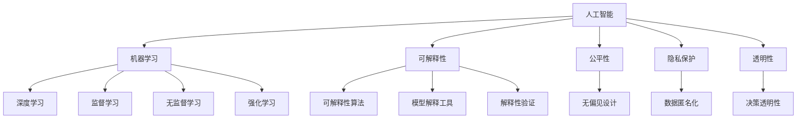

                 

# 人类计算：AI时代的道德边界

## 1. 背景介绍

### 1.1 问题由来
随着人工智能（AI）技术的迅猛发展，人类计算（Human-Computer Interaction, HCI）领域迎来了新的挑战与机遇。AI的渗透已经深刻影响到各行各业，从医疗、教育到娱乐、金融，从个人生活到社会治理。然而，AI技术的广泛应用也引发了一系列伦理道德问题，尤其是AI系统的决策透明性、可解释性、责任归属等问题，对人类社会带来了深远的影响。如何在享受AI带来的便利的同时，确保技术的安全性、公正性、隐私保护，成为了社会各界共同关注的焦点。

### 1.2 问题核心关键点
AI时代的伦理道德问题主要集中在以下几个方面：

- **决策透明性（Transparency）**：AI系统的决策过程是否公开透明，用户能否理解其工作原理和决策依据。
- **可解释性（Explainability）**：AI模型的预测结果是否能够被解释，是否存在偏见或歧视。
- **责任归属（Accountability）**：AI系统在发生错误或违反伦理道德时，由谁承担责任。
- **隐私保护（Privacy）**：AI系统在处理用户数据时，如何保证个人隐私不受侵犯。
- **公平性（Fairness）**：AI系统是否对所有用户公平，不存在性别、种族、年龄等歧视。

这些关键点涉及AI系统的人性化、合规性和安全性，是衡量AI技术是否适合大规模应用的重要标准。

### 1.3 问题研究意义
解决AI时代的伦理道德问题，对推动AI技术的健康发展具有重要意义：

- **提升公众信任**：通过提升AI系统的透明度和可解释性，减少公众对AI的不信任感，促进AI技术的广泛应用。
- **保障个人权益**：确保AI系统在处理用户数据时遵循隐私保护原则，保障用户权益。
- **促进公平正义**：通过公平性、无偏见的设计，使AI系统服务于所有群体，推动社会公正。
- **增强系统安全**：在决策透明和责任明确的前提下，提高AI系统的可靠性和安全性。

解决这些问题，不仅能够推动AI技术的良性发展，也能够更好地服务社会，提升人类生活质量。

## 2. 核心概念与联系

### 2.1 核心概念概述

为了更好地理解AI伦理道德问题，本节将介绍几个密切相关的核心概念：

- **人工智能（Artificial Intelligence, AI）**：通过算法和模型，使计算机系统能够执行人类智能任务的技术。AI的发展目标是创建具有人类智能水平的系统，包括学习、推理、感知、语言理解等能力。

- **机器学习（Machine Learning, ML）**：AI的一个分支，通过数据和算法，使机器能够自动学习和改进。机器学习模型通常分为监督学习、无监督学习和强化学习等类型。

- **深度学习（Deep Learning, DL）**：机器学习的一种，通过多层神经网络模型，处理大规模复杂数据。深度学习在图像识别、语音识别、自然语言处理等领域取得了显著成果。

- **可解释性（Explainability）**：指AI模型的决策过程是否可以被解释和理解。对于医疗、金融等高风险应用，可解释性尤为重要。

- **公平性（Fairness）**：指AI模型在处理不同群体数据时是否存在歧视或不公平现象。确保公平性是AI系统伦理道德的重要体现。

- **隐私保护（Privacy Protection）**：指在处理个人数据时，是否遵循隐私保护原则，防止数据滥用和泄露。

- **透明性（Transparency）**：指AI系统的决策过程是否公开透明，用户是否能够理解和信任系统决策。

这些核心概念之间的逻辑关系可以通过以下Mermaid流程图来展示：



这个流程图展示了AI伦理道德问题的主要组成部分及其相互关系：

1. AI技术的核心是机器学习和深度学习。
2. 机器学习和深度学习模型可以进一步细分为监督学习、无监督学习和强化学习。
3. AI模型的伦理道德问题包括可解释性、公平性、隐私保护和透明性。
4. 可解释性要求模型能够提供决策依据，公平性要求模型对所有用户公平，隐私保护要求数据处理遵循隐私原则，透明性要求决策过程公开透明。
5. 透明的决策过程、公平的无偏见设计、有效的隐私保护措施和可解释的模型输出是保障AI系统伦理道德的重要方面。

## 3. 核心算法原理 & 具体操作步骤

### 3.1 算法原理概述

AI伦理道德问题本质上是多学科交叉问题，涉及心理学、社会学、伦理学等多个领域。解决这些问题的方法包括算法设计、法规政策、伦理审查、用户教育等多个方面。

从技术角度来看，主要通过以下算法实现伦理道德目标：

- **可解释性算法（Explainable AI, XAI）**：开发能够提供决策依据和解释结果的算法，如LIME、SHAP等。
- **公平性算法（Fairness-aware AI）**：设计能够识别和消除偏见的算法，如Adversarial Debiasing、Fairness-Aware Data Augmentation等。
- **隐私保护算法（Privacy-preserving AI）**：开发能够保障数据隐私的算法，如差分隐私、同态加密、联邦学习等。
- **透明性算法（Transparent AI）**：设计能够公开决策过程的算法，如决策树、透明神经网络等。

这些算法共同构建了AI伦理道德的技术基础，实现了对AI系统行为的监督和控制。

### 3.2 算法步骤详解

基于上述算法原理，AI伦理道德问题解决的主要步骤包括：

**Step 1: 数据采集与预处理**
- 收集与任务相关的数据，进行清洗、标注和预处理。
- 确保数据的多样性和代表性，防止数据偏见和歧视。

**Step 2: 算法选择与训练**
- 根据任务需求，选择适合的算法进行模型训练。
- 对模型进行公平性、隐私保护和可解释性等伦理考量，进行适当的约束和优化。

**Step 3: 模型评估与验证**
- 对训练好的模型进行评估，确保其在多样性数据集上的公平性和隐私保护性能。
- 使用可解释性工具，验证模型的决策过程是否透明，是否存在偏见。

**Step 4: 政策制定与监管**
- 根据模型评估结果，制定相应的伦理政策，确保模型合规性。
- 建立监管机制，对AI系统进行持续监控和评估，防止伦理道德问题发生。

**Step 5: 用户教育与反馈**
- 通过用户教育和引导，提升公众对AI伦理道德问题的认知和理解。
- 收集用户反馈，持续改进AI系统的设计和应用。

### 3.3 算法优缺点

解决AI伦理道德问题的算法具有以下优点：

- **技术可实现**：基于现有技术的算法可以实现对AI系统的监督和控制。
- **通用性**：这些算法可以应用于多种AI任务，如自然语言处理、计算机视觉、语音识别等。
- **可验证性**：算法具有可解释性，可以通过各种验证工具对模型进行验证和评估。

同时，这些算法也存在以下局限：

- **复杂度**：算法的设计和实现较为复杂，需要结合多种技术和理论。
- **效果有限**：尽管算法能够在一定程度上缓解伦理道德问题，但无法完全消除所有风险。
- **数据依赖**：算法的有效性依赖于数据的质量和多样性，如果数据本身存在偏见，算法效果也会受到影响。

### 3.4 算法应用领域

AI伦理道德问题解决的主要应用领域包括：

- **医疗健康**：确保医疗AI系统的决策过程透明、可解释，保障患者隐私，防止医疗歧视。
- **金融服务**：确保金融AI系统的公平性，防止金融歧视和数据滥用，保护用户隐私。
- **教育培训**：开发无偏见的教育AI系统，确保公平性，保障学生隐私。
- **智能制造**：确保智能制造AI系统的公平性、隐私保护和透明性，防止系统偏见。
- **智慧城市**：确保智慧城市AI系统的公平性、隐私保护和透明性，防止歧视和滥用。

## 4. 数学模型和公式 & 详细讲解 & 举例说明

### 4.1 数学模型构建

在解决AI伦理道德问题时，数学模型和公式起着重要的作用。以下我们将以公平性问题为例，介绍如何构建公平性模型：

假设我们有一组数据集 $D=\{(x_i,y_i)\}_{i=1}^N$，其中 $x_i$ 为特征向量，$y_i$ 为标签。我们的目标是构建一个无偏差的分类器 $f(x)$，使得 $f(x)$ 对所有群体的预测结果公平。

公平性模型的构建过程可以分为以下几个步骤：

1. 数据划分：将数据集按照群体进行划分，得到不同群体的子集 $D_k$。
2. 模型训练：对每个子集 $D_k$ 进行模型训练，得到不同的分类器 $f_k(x)$。
3. 组合模型：将多个分类器进行组合，得到最终的公平性分类器 $f(x)$。

公平性分类器的构建可以通过以下公式实现：

$$
f(x) = \sum_{k=1}^K w_k f_k(x)
$$

其中，$w_k$ 为权重，表示不同群体在模型中的重要性。

### 4.2 公式推导过程

公平性模型构建的具体过程可以分为以下步骤：

**Step 1: 数据划分**
- 将数据集按照群体进行划分，得到不同群体的子集 $D_k$。假设我们有三个群体 $A$、$B$、$C$，则数据集可以划分为 $D_A$、$D_B$、$D_C$。

**Step 2: 模型训练**
- 对每个子集 $D_k$ 进行模型训练，得到不同的分类器 $f_k(x)$。

**Step 3: 组合模型**
- 将多个分类器进行组合，得到最终的公平性分类器 $f(x)$。假设我们使用加权平均的方式进行组合，则公平性分类器的公式为：

$$
f(x) = \sum_{k=1}^K w_k f_k(x)
$$

其中，$w_k$ 为权重，表示不同群体在模型中的重要性。

### 4.3 案例分析与讲解

以下我们以一个简单的案例来说明公平性模型的构建过程：

假设我们有一组数据集，其中包含性别（male, female）和工资（salary）两个特征。我们的目标是构建一个公平的薪酬预测模型，使得男性和女性的薪酬预测结果公平。

1. 数据划分：将数据集按照性别进行划分，得到男性和女性两个子集 $D_m$ 和 $D_f$。
2. 模型训练：对每个子集进行模型训练，得到不同的薪酬预测模型 $f_m(x)$ 和 $f_f(x)$。
3. 组合模型：将两个模型进行组合，得到最终的公平性薪酬预测模型 $f(x)$。

假设我们使用加权平均的方式进行组合，则公平性薪酬预测模型的公式为：

$$
f(x) = w_m f_m(x) + w_f f_f(x)
$$

其中，$w_m$ 和 $w_f$ 分别为男性和女性的权重。通过合理选择权重，可以确保薪酬预测模型对男性和女性公平。

## 5. 项目实践：代码实例和详细解释说明

### 5.1 开发环境搭建

在进行公平性模型开发前，我们需要准备好开发环境。以下是使用Python进行PyTorch开发的环境配置流程：

1. 安装Anaconda：从官网下载并安装Anaconda，用于创建独立的Python环境。

2. 创建并激活虚拟环境：
```bash
conda create -n pytorch-env python=3.8 
conda activate pytorch-env
```

3. 安装PyTorch：根据CUDA版本，从官网获取对应的安装命令。例如：
```bash
conda install pytorch torchvision torchaudio cudatoolkit=11.1 -c pytorch -c conda-forge
```

4. 安装scikit-learn：
```bash
pip install scikit-learn
```

完成上述步骤后，即可在`pytorch-env`环境中开始公平性模型开发。

### 5.2 源代码详细实现

以下是一个简单的公平性分类器的Python代码实现：

```python
from sklearn.metrics import accuracy_score
from sklearn.preprocessing import LabelEncoder
from sklearn.model_selection import train_test_split

import torch
import torch.nn as nn
import torch.nn.functional as F
from torch.utils.data import DataLoader

# 定义数据处理函数
def preprocess_data(data):
    X = []
    y = []
    for record in data:
        X.append(record['features'])
        y.append(record['label'])
    return X, y

# 加载数据集
data = load_data('data.csv')
X, y = preprocess_data(data)

# 划分数据集
X_train, X_test, y_train, y_test = train_test_split(X, y, test_size=0.2, random_state=42)

# 定义公平性分类器
class FairClassifier(nn.Module):
    def __init__(self, input_dim):
        super(FairClassifier, self).__init__()
        self.fc1 = nn.Linear(input_dim, 128)
        self.fc2 = nn.Linear(128, 128)
        self.fc3 = nn.Linear(128, 2)
        
    def forward(self, x):
        x = F.relu(self.fc1(x))
        x = F.relu(self.fc2(x))
        x = self.fc3(x)
        return x

# 定义损失函数和优化器
criterion = nn.CrossEntropyLoss()
model = FairClassifier(input_dim)
optimizer = torch.optim.Adam(model.parameters(), lr=0.001)

# 训练模型
for epoch in range(100):
    model.train()
    optimizer.zero_grad()
    output = model(X_train)
    loss = criterion(output, y_train)
    loss.backward()
    optimizer.step()
    print('Epoch {}: Loss {}'.format(epoch+1, loss.item()))

# 评估模型
model.eval()
output = model(X_test)
_, preds = torch.max(output, 1)
accuracy = accuracy_score(y_test, preds)
print('Accuracy: {}'.format(accuracy))
```

### 5.3 代码解读与分析

让我们再详细解读一下关键代码的实现细节：

**preprocess_data函数**：
- 将数据集中的特征和标签提取出来，并进行标准化处理。

**load_data函数**：
- 加载数据集，可以使用pandas、numpy等库读取CSV、Excel等格式的数据文件。

**FairClassifier类**：
- 定义公平性分类器，包括三个全连接层。
- 前向传播时，通过两个隐藏层进行特征提取，最后通过输出层进行分类。

**训练模型**：
- 使用交叉熵损失函数，Adam优化器进行模型训练。
- 每个epoch结束时，输出损失值，进行模型评估。

**评估模型**：
- 在测试集上对模型进行评估，计算分类准确率。

可以看到，公平性模型开发的核心在于选择合适的损失函数和优化器，以及设计合理的模型结构。通过不断迭代训练，可以逐步提升模型的公平性。

## 6. 实际应用场景

### 6.1 智能招聘

智能招聘系统在人力资源管理中具有广泛应用，但其决策过程可能存在偏见和歧视。使用公平性模型可以确保招聘过程的公平性，防止性别、种族、年龄等偏见。

**Step 1: 数据收集**
- 收集招聘数据，包括应聘者的简历、面试记录、绩效评估等。

**Step 2: 数据预处理**
- 对数据进行清洗和标注，确保数据的多样性和代表性。

**Step 3: 模型训练**
- 使用公平性模型对招聘数据进行训练，确保模型对不同群体的预测公平。

**Step 4: 模型评估**
- 在测试集上评估模型的公平性，确保模型在多样性数据上的表现。

**Step 5: 部署应用**
- 将训练好的模型应用到实际招聘流程中，确保招聘过程公平、透明。

### 6.2 医疗诊断

医疗诊断系统在医疗健康领域具有重要应用，但其诊断过程可能存在偏见和歧视。使用公平性模型可以确保医疗诊断过程的公平性，防止医疗偏见。

**Step 1: 数据收集**
- 收集医疗数据，包括病历记录、诊断结果、治疗方案等。

**Step 2: 数据预处理**
- 对数据进行清洗和标注，确保数据的多样性和代表性。

**Step 3: 模型训练**
- 使用公平性模型对医疗数据进行训练，确保模型对不同群体的诊断公平。

**Step 4: 模型评估**
- 在测试集上评估模型的公平性，确保模型在多样性数据上的表现。

**Step 5: 部署应用**
- 将训练好的模型应用到实际医疗诊断流程中，确保诊断过程公平、透明。

### 6.3 金融风控

金融风控系统在金融领域具有重要应用，但其风险评估过程可能存在偏见和歧视。使用公平性模型可以确保金融风控过程的公平性，防止金融歧视。

**Step 1: 数据收集**
- 收集金融数据，包括贷款申请、信用记录、风险评估等。

**Step 2: 数据预处理**
- 对数据进行清洗和标注，确保数据的多样性和代表性。

**Step 3: 模型训练**
- 使用公平性模型对金融数据进行训练，确保模型对不同群体的风险评估公平。

**Step 4: 模型评估**
- 在测试集上评估模型的公平性，确保模型在多样性数据上的表现。

**Step 5: 部署应用**
- 将训练好的模型应用到实际金融风控流程中，确保风控过程公平、透明。

## 7. 工具和资源推荐

### 7.1 学习资源推荐

为了帮助开发者系统掌握AI伦理道德问题的理论基础和实践技巧，这里推荐一些优质的学习资源：

1. 《人工智能伦理与社会》课程：斯坦福大学开设的伦理道德课程，涵盖AI伦理、法律、隐私等多个方面。

2. 《AI伦理与可解释性》书籍：系统介绍AI伦理道德的理论基础和实践方法，结合具体案例进行讲解。

3. 《可解释性AI》博客：专注于可解释性AI的研究和应用，涵盖模型解释、可视化、评估等多个方面。

4. 《公平性AI》论文：多篇关于公平性AI的学术论文，涵盖模型设计、数据处理、算法评估等多个方面。

5. 《隐私保护AI》技术报告：介绍隐私保护AI的技术方法和应用场景，涵盖差分隐私、同态加密、联邦学习等多个方面。

通过对这些资源的学习实践，相信你一定能够快速掌握AI伦理道德问题的精髓，并用于解决实际的AI问题。

### 7.2 开发工具推荐

高效的开发离不开优秀的工具支持。以下是几款用于AI伦理道德问题开发的常用工具：

1. TensorFlow：由Google主导开发的开源深度学习框架，生产部署方便，适合大规模工程应用。

2. PyTorch：基于Python的开源深度学习框架，灵活动态的计算图，适合快速迭代研究。

3. scikit-learn：Python中常用的机器学习库，提供了丰富的数据预处理和模型训练工具。

4. Weights & Biases：模型训练的实验跟踪工具，可以记录和可视化模型训练过程中的各项指标，方便对比和调优。

5. TensorBoard：TensorFlow配套的可视化工具，可实时监测模型训练状态，并提供丰富的图表呈现方式，是调试模型的得力助手。

合理利用这些工具，可以显著提升AI伦理道德问题的开发效率，加快创新迭代的步伐。

### 7.3 相关论文推荐

AI伦理道德问题解决的研究源于学界的持续研究。以下是几篇奠基性的相关论文，推荐阅读：

1. Fairness in Machine Learning: What to Know and What to Do（机器学习中的公平性）：介绍机器学习中公平性的定义和实现方法。

2. Explainable AI: Definitions, Advances and Challenges（可解释性AI）：全面介绍可解释性AI的理论基础和应用方法。

3. Privacy-Preserving Machine Learning: Privacy Meets AI（隐私保护机器学习）：介绍隐私保护机器学习的技术方法和应用场景。

4. Human-AI Interpretability: The Path Forward（人机可解释性）：探讨人机可解释性的实现方法和应用前景。

5. The Future of Human-AI Interaction: Overcoming the Challenges（人机交互的未来）：探讨人机交互中AI系统的可解释性和公平性问题。

这些论文代表了大语言模型微调技术的发展脉络。通过学习这些前沿成果，可以帮助研究者把握学科前进方向，激发更多的创新灵感。

## 8. 总结：未来发展趋势与挑战

### 8.1 总结

本文对AI伦理道德问题进行了全面系统的介绍。首先阐述了AI伦理道德问题的重要性，明确了公平性、可解释性、隐私保护等核心要素。其次，从原理到实践，详细讲解了公平性模型的数学原理和关键步骤，给出了公平性模型开发的完整代码实例。同时，本文还广泛探讨了公平性模型在智能招聘、医疗诊断、金融风控等多个行业领域的应用前景，展示了公平性模型的巨大潜力。

通过本文的系统梳理，可以看到，AI伦理道德问题解决的研究已经取得了一定的进展，但在迈向更加智能化、普适化应用的过程中，仍面临诸多挑战：

### 8.2 未来发展趋势

展望未来，AI伦理道德问题解决将呈现以下几个发展趋势：

1. **算法多样化**：未来将开发更多公平性、隐私保护和可解释性算法，应对不同类型的AI伦理道德问题。

2. **数据多源化**：通过整合多源数据，增强AI系统的泛化能力和公平性。

3. **模型透明化**：开发更加透明的AI模型，增强决策过程的可解释性和可信度。

4. **政策法规化**：随着AI伦理道德问题的广泛关注，相关政策法规将逐步完善，为AI系统的合规性提供保障。

5. **用户参与化**：在AI系统的设计和应用过程中，增加用户参与，提升系统的公平性和可解释性。

6. **技术迭代化**：不断迭代和优化AI伦理道德问题解决方案，提升系统的稳定性和鲁棒性。

以上趋势凸显了AI伦理道德问题解决的广阔前景。这些方向的探索发展，必将进一步提升AI系统的伦理道德水平，为构建人机协同的智能社会提供有力支持。

### 8.3 面临的挑战

尽管AI伦理道德问题解决的研究已经取得了一定的进展，但在迈向更加智能化、普适化应用的过程中，仍面临诸多挑战：

1. **数据质量问题**：数据的偏见和歧视是影响AI伦理道德问题的关键因素，如何获得高质量的多样化数据，仍然是一个难题。

2. **模型公平性问题**：即使使用了公平性算法，仍然存在模型在特定群体上的偏见和歧视。如何构建更公平的AI模型，仍然是一个挑战。

3. **可解释性问题**：尽管可解释性算法可以提供决策依据，但模型的复杂性和多样性使得解释过程仍然困难。如何构建更可解释的AI模型，仍然是一个难题。

4. **隐私保护问题**：尽管隐私保护算法可以保障数据安全，但如何在使用数据时，平衡数据安全和用户隐私，仍然是一个挑战。

5. **技术实现问题**：尽管技术手段不断进步，但如何设计高效、鲁棒的AI伦理道德模型，仍然是一个难题。

6. **政策法规问题**：尽管相关政策法规逐步完善，但如何保障AI系统的合规性，仍然是一个挑战。

正视AI伦理道德问题解决面临的这些挑战，积极应对并寻求突破，将是大语言模型微调走向成熟的必由之路。相信随着学界和产业界的共同努力，这些挑战终将一一被克服，大语言模型微调必将在构建人机协同的智能社会中扮演越来越重要的角色。

### 8.4 研究展望

面向未来，AI伦理道德问题解决的研究需要在以下几个方面寻求新的突破：

1. **多源数据融合**：结合多源数据，增强AI系统的泛化能力和公平性。

2. **模型透明化**：开发更加透明的AI模型，增强决策过程的可解释性和可信度。

3. **隐私保护创新**：探索更加高效的隐私保护技术，保障数据安全的同时，实现数据高效利用。

4. **政策法规优化**：在技术手段不断进步的基础上，优化政策法规，为AI系统的合规性提供保障。

5. **用户参与机制**：在AI系统的设计和应用过程中，增加用户参与，提升系统的公平性和可解释性。

6. **技术迭代优化**：不断迭代和优化AI伦理道德问题解决方案，提升系统的稳定性和鲁棒性。

这些研究方向的探索，必将引领AI伦理道德问题解决技术迈向更高的台阶，为构建人机协同的智能社会提供有力支持。

## 9. 附录：常见问题与解答

**Q1：AI伦理道德问题如何解决？**

A: AI伦理道德问题解决的方法包括算法设计、法规政策、伦理审查、用户教育等多个方面。主要通过以下步骤实现：

1. 数据收集与预处理：收集与任务相关的数据，进行清洗、标注和预处理。
2. 算法选择与训练：根据任务需求，选择适合的算法进行模型训练。
3. 模型评估与验证：对训练好的模型进行评估，确保其在多样性数据集上的公平性和隐私保护性能。
4. 政策制定与监管：根据模型评估结果，制定相应的伦理政策，确保模型合规性。
5. 用户教育与反馈：通过用户教育和引导，提升公众对AI伦理道德问题的认知和理解。

**Q2：如何构建公平性模型？**

A: 公平性模型的构建过程可以分为以下步骤：

1. 数据划分：将数据集按照群体进行划分，得到不同群体的子集。
2. 模型训练：对每个子集进行模型训练，得到不同的分类器。
3. 组合模型：将多个分类器进行组合，得到最终的公平性分类器。

公平性分类器的构建可以通过以下公式实现：

$$
f(x) = \sum_{k=1}^K w_k f_k(x)
$$

其中，$w_k$ 为权重，表示不同群体在模型中的重要性。

**Q3：如何提高AI模型的可解释性？**

A: 提高AI模型的可解释性，可以通过以下方法：

1. 使用可解释性算法，如LIME、SHAP等。
2. 开发透明的模型结构，如决策树、透明神经网络等。
3. 提供模型解释工具，如TensorBoard、Weights & Biases等。
4. 验证模型的解释结果，如使用Rouge、Spearman等指标评估模型解释质量。

**Q4：如何保障AI模型的隐私保护？**

A: 保障AI模型的隐私保护，可以通过以下方法：

1. 使用差分隐私、同态加密等隐私保护技术。
2. 采用联邦学习、分布式训练等技术，减少数据泄露风险。
3. 对数据进行匿名化处理，防止数据滥用。

**Q5：AI伦理道德问题解决的技术难点有哪些？**

A: AI伦理道德问题解决的技术难点包括：

1. 数据质量问题：数据的偏见和歧视是影响AI伦理道德问题的关键因素，如何获得高质量的多样化数据，仍然是一个难题。
2. 模型公平性问题：即使使用了公平性算法，仍然存在模型在特定群体上的偏见和歧视。如何构建更公平的AI模型，仍然是一个挑战。
3. 可解释性问题：尽管可解释性算法可以提供决策依据，但模型的复杂性和多样性使得解释过程仍然困难。
4. 隐私保护问题：尽管隐私保护算法可以保障数据安全，但如何在使用数据时，平衡数据安全和用户隐私，仍然是一个挑战。
5. 技术实现问题：尽管技术手段不断进步，但如何设计高效、鲁棒的AI伦理道德模型，仍然是一个难题。
6. 政策法规问题：尽管相关政策法规逐步完善，但如何保障AI系统的合规性，仍然是一个挑战。

正视这些技术难点，积极应对并寻求突破，将是大语言模型微调走向成熟的必由之路。

---

作者：禅与计算机程序设计艺术 / Zen and the Art of Computer Programming

