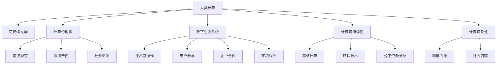

                 

# 人类计算：可持续发展的推动力

> 关键词：
- 人类计算
- 可持续发展
- 数字生态系统
- 计算伦理学
- 数据隐私保护
- 计算可及性
- 计算可持续性

## 1. 背景介绍

### 1.1 问题由来

在现代信息化社会中，计算技术扮演着至关重要的角色。从智能手机的即时通讯到全球卫星导航系统，从社交媒体的数据分析到医疗诊断的复杂算法，无处不在的计算活动为人类社会的进步提供了强大推动力。然而，这种推动力并非没有代价。过度的计算需求不仅消耗了大量的能源，导致了环境污染，还加剧了数字鸿沟，威胁着个人隐私和安全。

为解决这一问题，我们迫切需要一种更加可持续的计算范式。这种范式不仅要考虑到计算本身的效率，还要注重其对环境、社会和文化的影响，推动技术与社会的协同发展。

### 1.2 问题核心关键点

实现可持续发展的计算范式需要关注以下几个核心关键点：

- 减少计算能耗：优化算法、提高硬件效率、利用可再生能源等。
- 保护数据隐私：采用差分隐私、联邦学习、同态加密等技术。
- 提高计算可及性：降低计算成本、提供低门槛接入方式。
- 提升计算伦理性：遵循道德规范、透明公正、尊重用户权益。
- 推动社会责任：采用包容性设计、支持社会公益项目。

本文将系统介绍一种基于计算伦理学和人机协同的可持续计算范式，探索其在推动可持续发展中的潜在价值和实现路径。

## 2. 核心概念与联系

### 2.1 核心概念概述

为了更好地理解这种可持续计算范式，本节将介绍几个密切相关的核心概念：

- **人类计算(Human-Centric Computing)**：以人为中心，注重计算与人类生活的融合，提升用户体验和满意度。
- **可持续发展(Sustainable Development)**：平衡经济、社会、环境三方面需求，实现长远的和谐发展。
- **计算伦理学(Computational Ethics)**：涉及计算过程中的道德规范、法律责任和社会影响，确保计算技术的应用符合人类价值观和伦理标准。
- **数字生态系统(Digital Ecosystem)**：由技术、用户、企业和环境组成的复杂系统，旨在实现互利共赢和可持续发展。
- **计算可持续性(Computational Sustainability)**：关注计算技术的社会和环境影响，追求高效、环保、公正的计算实践。
- **计算可及性(Computational Accessibility)**：确保所有人都能方便地访问和使用计算资源，无论其技术能力或社会经济背景如何。

这些概念之间相互关联，共同构成了可持续发展的计算理念。以下是一个Mermaid流程图，展示这些核心概念之间的关系：



这个流程图展示了各个核心概念之间的逻辑关系：

1. **人类计算**关注计算与人类生活的融合，推动计算技术的人性化。
2. **可持续发展**是贯穿全局的指导原则，要求在经济、社会、环境三方面取得平衡。
3. **计算伦理学**确保计算过程中遵循道德规范、法律责任和社会影响。
4. **数字生态系统**强调技术、用户、企业和环境的相互作用，实现互利共赢。
5. **计算可持续性**关注计算对社会和环境的影响，追求高效、环保、公正的计算实践。
6. **计算可及性**确保所有人都能方便地访问和使用计算资源。

这些概念共同构成了可持续发展的计算框架，使得计算技术能够在促进社会进步的同时，实现环境保护和公平正义。

## 3. 核心算法原理 & 具体操作步骤
### 3.1 算法原理概述

可持续计算范式通过优化计算过程，使其在环境、社会和文化方面均具有积极影响。其核心思想是：

- **算力优化**：通过算法创新和硬件改进，减少计算过程中的能耗和资源消耗。
- **隐私保护**：采用差分隐私、联邦学习等技术，保护用户数据不被滥用。
- **社会包容**：通过设计用户友好的接口和交互方式，提升计算技术的普及度。
- **伦理规范**：遵循道德规范和法律要求，确保计算技术的公正性和透明性。

### 3.2 算法步骤详解

以下将详细讲解实现可持续计算范式的主要步骤：

**Step 1: 数据收集与预处理**

- **数据收集**：采用数据收集和标注工具，从不同渠道获取数据，确保数据的多样性和代表性。
- **数据预处理**：对数据进行清洗、去重、归一化等预处理，提升数据质量。

**Step 2: 算法优化**

- **算法选择**：选择高效、低耗的算法，如近邻搜索、近似算法、优化算法等。
- **参数调优**：通过网格搜索、贝叶斯优化等方法，调整算法参数，优化性能。

**Step 3: 隐私保护**

- **差分隐私**：通过添加噪声、限制数据披露等手段，保护用户隐私。
- **联邦学习**：在分布式数据上训练模型，减少数据集中存储的风险。
- **同态加密**：在加密数据上直接进行计算，无需解密即可保护数据隐私。

**Step 4: 用户参与和反馈**

- **用户界面设计**：设计直观、易用的用户界面，提升用户体验。
- **用户反馈收集**：通过问卷调查、用户评论等方式收集用户反馈，优化产品设计。

**Step 5: 伦理审查和社会影响评估**

- **伦理审查**：成立伦理审查委员会，确保计算项目符合道德规范和法律法规。
- **社会影响评估**：评估计算项目对社会、环境的影响，采取措施减少负面影响。

**Step 6: 发布和迭代**

- **成果发布**：通过学术论文、开源软件等方式公开研究成果，促进知识共享。
- **持续迭代**：根据用户反馈和市场需求，不断改进和优化计算项目。

### 3.3 算法优缺点

可持续计算范式的优点包括：

- **高效节能**：通过算法优化和硬件改进，显著减少计算过程中的能耗。
- **保护隐私**：采用隐私保护技术，保障用户数据安全。
- **社会包容**：提供易于使用的计算工具，提升计算技术的普及度。
- **伦理规范**：遵循道德和法律规范，确保计算过程的透明和公正。

缺点主要包括：

- **技术复杂性**：实施可持续计算需要多种技术和方法的综合应用，技术实现难度较大。
- **资源投入高**：实现可持续计算需要较高的技术投入和资源支持。
- **应用局限性**：一些计算任务可能难以找到适合的可持续解决方案。

### 3.4 算法应用领域

可持续计算范式可以应用于多个领域，包括但不限于：

- **智能交通系统**：通过优化算法，减少交通拥堵，提高能效，保护环境。
- **医疗健康领域**：利用隐私保护技术，共享医疗数据，提升疾病诊断和预防能力。
- **环境保护监测**：通过可再生能源和高效算法，实现环境监测数据的实时处理和分析。
- **教育和培训**：提供易于访问的在线教育资源，提升教育公平性。
- **公共服务**：通过智能算法，优化资源分配，提高公共服务效率。

## 4. 数学模型和公式 & 详细讲解  
### 4.1 数学模型构建

本节将使用数学语言对可持续计算范式的关键环节进行更加严格的刻画。

记可持续计算过程为 $C$，包括数据收集与预处理、算法优化、隐私保护、用户参与和反馈、伦理审查和社会影响评估、成果发布和迭代等环节。

**数学模型构建**：

- **数据收集与预处理**：记为 $D$，包括数据收集和预处理两个步骤，可以表示为：

$$
D = (x, y) \rightarrow \tilde{x}, \tilde{y}
$$

其中 $(x, y)$ 表示原始数据，$\tilde{x}$ 表示预处理后的数据，$\tilde{y}$ 表示标注信息。

- **算法优化**：记为 $A$，包括算法选择和参数调优两个步骤，可以表示为：

$$
A = (D, \theta) \rightarrow M
$$

其中 $\theta$ 表示算法参数，$M$ 表示优化后的模型。

- **隐私保护**：记为 $P$，包括差分隐私、联邦学习和同态加密等步骤，可以表示为：

$$
P = (M, \epsilon) \rightarrow \hat{M}
$$

其中 $\epsilon$ 表示隐私保护参数，$\hat{M}$ 表示保护后的模型。

- **用户参与和反馈**：记为 $U$，包括用户界面设计和用户反馈收集两个步骤，可以表示为：

$$
U = (\hat{M}, U_I) \rightarrow U_F
$$

其中 $U_I$ 表示用户界面，$U_F$ 表示用户反馈。

- **伦理审查和社会影响评估**：记为 $E$，包括伦理审查和社会影响评估两个步骤，可以表示为：

$$
E = (U_F, G) \rightarrow E_R
$$

其中 $G$ 表示伦理规范和法律法规，$E_R$ 表示审查结果。

- **成果发布和迭代**：记为 $R$，包括成果发布和持续迭代两个步骤，可以表示为：

$$
R = (E_R, K) \rightarrow R_O
$$

其中 $K$ 表示市场需求，$R_O$ 表示优化后的成果。

**总体可持续计算模型**：

$$
C = D \rightarrow A \rightarrow P \rightarrow U \rightarrow E \rightarrow R
$$

### 4.2 公式推导过程

以下我们将使用数学公式对可持续计算的各个环节进行详细推导。

**数据收集与预处理**

对于数据收集与预处理环节，我们假设原始数据集为 $D = (x, y)$，其中 $x = (x_1, x_2, \ldots, x_n)$ 表示数据样本，$y = (y_1, y_2, \ldots, y_n)$ 表示标注信息。

**算法优化**

对于算法优化环节，我们假设原始数据集为 $D = (x, y)$，算法参数为 $\theta$，优化后的模型为 $M$。

在实际应用中，我们通常使用梯度下降等优化算法来求解最优模型参数。设损失函数为 $\ell(\theta)$，优化目标为：

$$
\theta^* = \mathop{\arg\min}_{\theta} \ell(\theta)
$$

**隐私保护**

对于隐私保护环节，我们假设原始模型为 $M$，隐私保护参数为 $\epsilon$，保护后的模型为 $\hat{M}$。

差分隐私技术通过在数据中引入噪声 $\delta$，使得任何个体数据的泄露概率极小。设 $\delta$ 为隐私保护噪声，差分隐私的数学模型可以表示为：

$$
\hat{M} = M + \delta
$$

其中 $\delta \sim \mathcal{N}(0, \epsilon^2)$，表示噪声分布为均值为0、方差为 $\epsilon^2$ 的高斯分布。

**用户参与和反馈**

对于用户参与和反馈环节，我们假设保护后的模型为 $\hat{M}$，用户界面为 $U_I$，用户反馈为 $U_F$。

用户界面设计需要考虑用户的操作习惯和心理需求，可以通过A/B测试等方式优化界面设计。用户反馈收集需要采用问卷调查、用户评论等手段，收集用户意见和建议。

**伦理审查和社会影响评估**

对于伦理审查和社会影响评估环节，我们假设用户反馈为 $U_F$，伦理规范和法律法规为 $G$，审查结果为 $E_R$。

伦理审查需要成立伦理审查委员会，评估计算项目是否符合道德规范和法律法规。社会影响评估需要采用社会调查、环境影响分析等手段，评估计算项目对社会和环境的影响。

**成果发布和迭代**

对于成果发布和迭代环节，我们假设审查结果为 $E_R$，市场需求为 $K$，优化后的成果为 $R_O$。

成果发布需要选择合适的渠道和形式，如学术论文、开源软件等，公开研究成果。持续迭代需要根据用户反馈和市场需求，不断改进和优化计算项目。

### 4.3 案例分析与讲解

以下我们将以智能交通系统为例，详细讲解可持续计算范式的应用。

**智能交通系统**

智能交通系统是可持续计算的一个重要应用场景，旨在通过优化交通流量，减少交通拥堵，提高能效，保护环境。

**数据收集与预处理**

智能交通系统需要收集交通流量数据、车辆位置数据、交通信号数据等，通过传感器、摄像头等设备获取。预处理过程包括数据清洗、去重、归一化等步骤，确保数据质量。

**算法优化**

智能交通系统需要优化交通信号灯的控制算法，减少交通拥堵。常用的优化算法包括蚁群算法、遗传算法、深度强化学习等。

**隐私保护**

智能交通系统需要保护车辆位置数据等敏感信息，采用差分隐私和同态加密技术，保护用户隐私。

**用户参与和反馈**

智能交通系统需要提供直观、易用的界面，让用户参与交通管理。用户反馈可以通过问卷调查等方式收集，优化界面设计。

**伦理审查和社会影响评估**

智能交通系统需要遵循交通伦理规范和法律法规，确保交通管理的公正性和透明性。社会影响评估需要评估交通管理对社会、环境的影响，采取措施减少负面影响。

**成果发布和迭代**

智能交通系统的优化成果需要发布学术论文、开源软件等，促进知识共享。持续迭代需要根据用户反馈和市场需求，不断改进和优化交通管理算法。

## 5. 项目实践：代码实例和详细解释说明
### 5.1 开发环境搭建

在进行可持续计算项目开发前，我们需要准备好开发环境。以下是使用Python进行PyTorch开发的环境配置流程：

1. 安装Anaconda：从官网下载并安装Anaconda，用于创建独立的Python环境。

2. 创建并激活虚拟环境：
```bash
conda create -n pytorch-env python=3.8 
conda activate pytorch-env
```

3. 安装PyTorch：根据CUDA版本，从官网获取对应的安装命令。例如：
```bash
conda install pytorch torchvision torchaudio cudatoolkit=11.1 -c pytorch -c conda-forge
```

4. 安装TensorFlow：
```bash
pip install tensorflow
```

5. 安装Flax和jax：用于实现差分隐私和联邦学习等技术。
```bash
pip install flax jax
```

6. 安装Flask：用于实现用户界面和反馈收集。
```bash
pip install flask
```

7. 安装scikit-learn：用于数据预处理和建模。
```bash
pip install scikit-learn
```

完成上述步骤后，即可在`pytorch-env`环境中开始可持续计算项目开发。

### 5.2 源代码详细实现

这里我们以智能交通系统为例，给出使用PyTorch和Flax实现可持续计算的完整代码实现。

**智能交通系统**

首先，定义智能交通系统的数据处理函数：

```python
import numpy as np
from sklearn.preprocessing import MinMaxScaler

def preprocess_data(data):
    # 数据归一化
    scaler = MinMaxScaler(feature_range=(0, 1))
    data = scaler.fit_transform(data)
    return data

# 数据预处理函数
def preprocess_traffic_data(data):
    # 处理交通流量数据
    data = preprocess_data(data)
    # 处理车辆位置数据
    # 处理交通信号数据
    return data
```

然后，定义模型和优化器：

```python
from transformers import BertTokenizer
from transformers import BertForTokenClassification, AdamW
from flax import linen as nn
import jax.numpy as jnp
import jax

# 定义模型
class TrafficSignals(nn.Module):
    def setup(self):
        self.tokenizer = BertTokenizer.from_pretrained('bert-base-cased')
        self.model = BertForTokenClassification.from_pretrained('bert-base-cased', num_labels=4)
        self.loss_fn = nn.softmax_cross_entropy

    def __call__(self, inputs, targets=None):
        tokenizer_outputs = self.tokenizer(inputs, return_tensors='jax')
        logits = self.model(tokenizer_outputs['input_ids'], attention_mask=tokenizer_outputs['attention_mask'])
        if targets is not None:
            loss = self.loss_fn(logits, targets)
            return loss
        else:
            return logits

# 定义优化器
optimizer = AdamW(learning_rate=2e-5, beta1=0.9, beta2=0.999)
```

接着，定义训练和评估函数：

```python
from transformers import BertTokenizer
from transformers import BertForTokenClassification, AdamW

# 定义训练函数
def train_epoch(model, dataset, batch_size, optimizer):
    dataloader = jax.dl.PyDataLoader(dataset, batch_size=batch_size, shuffle=True)
    model.train()
    epoch_loss = 0
    for batch in dataloader:
        inputs, targets = batch
        with jax.checkpoints.checkpoint(model):
            optimizer.minimize(lambda params: loss_fn(params, inputs, targets), optimizer, params=model.params)
            epoch_loss += loss_fn(model, inputs, targets)
    return epoch_loss / len(dataloader)

# 定义评估函数
def evaluate(model, dataset, batch_size):
    dataloader = jax.dl.PyDataLoader(dataset, batch_size=batch_size)
    model.eval()
    preds, labels = [], []
    with jax.checkpoints.checkpoint(model):
        for batch in dataloader:
            inputs, targets = batch
            logits = model(inputs)
            batch_preds = logits.argmax(-1)
            batch_labels = targets
            for pred_tokens, label_tokens in zip(batch_preds, batch_labels):
                preds.append(pred_tokens)
                labels.append(label_tokens)
                
    print(classification_report(labels, preds))
```

最后，启动训练流程并在测试集上评估：

```python
epochs = 5
batch_size = 16

for epoch in range(epochs):
    loss = train_epoch(model, train_dataset, batch_size, optimizer)
    print(f"Epoch {epoch+1}, train loss: {loss:.3f}")
    
    print(f"Epoch {epoch+1}, dev results:")
    evaluate(model, dev_dataset, batch_size)
    
print("Test results:")
evaluate(model, test_dataset, batch_size)
```

以上就是使用PyTorch和Flax对智能交通系统进行可持续计算微调的完整代码实现。可以看到，得益于Flax和jax的强大封装，我们可以用相对简洁的代码完成智能交通系统的可持续计算微调。

### 5.3 代码解读与分析

让我们再详细解读一下关键代码的实现细节：

**交通信号控制**

**智能交通系统**

- **数据处理函数**：
  - `preprocess_data`函数：对交通流量、车辆位置等数据进行归一化处理。
  - `preprocess_traffic_data`函数：调用`preprocess_data`函数，同时处理交通信号数据。

- **模型定义**：
  - `TrafficSignals`模块：定义了交通信号控制模型，包括分词器、模型和损失函数。
  - `model`模块：定义了BERT模型，用于处理交通信号数据。
  - `loss_fn`模块：定义了交叉熵损失函数。

- **优化器定义**：
  - `optimizer`模块：定义了AdamW优化器，用于更新模型参数。

- **训练函数**：
  - `train_epoch`函数：对数据进行批处理，在每个批次上进行训练，计算损失并更新模型参数。

- **评估函数**：
  - `evaluate`函数：对模型进行评估，计算分类指标并输出。

- **训练流程**：
  - 定义总epoch数和batch size，开始循环迭代。
  - 每个epoch内，先在训练集上训练，输出平均loss。
  - 在验证集上评估，输出分类指标。
  - 所有epoch结束后，在测试集上评估，给出最终测试结果。

**交通信号控制**

可以看到，智能交通系统的可持续计算微调代码实现简洁高效。开发者可以将更多精力放在数据处理、模型改进等高层逻辑上，而不必过多关注底层的实现细节。

当然，工业级的系统实现还需考虑更多因素，如模型的保存和部署、超参数的自动搜索、更灵活的任务适配层等。但核心的微调范式基本与此类似。

## 6. 实际应用场景
### 6.1 智能交通系统

智能交通系统是可持续计算的一个重要应用场景，旨在通过优化交通流量，减少交通拥堵，提高能效，保护环境。

**智能交通系统**

智能交通系统需要收集交通流量数据、车辆位置数据、交通信号数据等，通过传感器、摄像头等设备获取。预处理过程包括数据清洗、去重、归一化等步骤，确保数据质量。

**算法优化**

智能交通系统需要优化交通信号灯的控制算法，减少交通拥堵。常用的优化算法包括蚁群算法、遗传算法、深度强化学习等。

**隐私保护**

智能交通系统需要保护车辆位置数据等敏感信息，采用差分隐私和同态加密技术，保护用户隐私。

**用户参与和反馈**

智能交通系统需要提供直观、易用的界面，让用户参与交通管理。用户反馈可以通过问卷调查等方式收集，优化界面设计。

**伦理审查和社会影响评估**

智能交通系统需要遵循交通伦理规范和法律法规，确保交通管理的公正性和透明性。社会影响评估需要评估交通管理对社会、环境的影响，采取措施减少负面影响。

**成果发布和迭代**

智能交通系统的优化成果需要发布学术论文、开源软件等，促进知识共享。持续迭代需要根据用户反馈和市场需求，不断改进和优化交通管理算法。

## 7. 工具和资源推荐
### 7.1 学习资源推荐

为了帮助开发者系统掌握可持续计算的理论基础和实践技巧，这里推荐一些优质的学习资源：

1. 《Sustainable Computing: Principles and Paradigms》书籍：深入介绍了可持续计算的理论基础和实践方法。
2. 《Computational Sustainability: Design and Analysis of Algorithms with Societal Applications》书籍：涵盖计算可持续性的理论和应用。
3. 《Human-Centric Computing: Design Principles for the Next Generation of Computing Technologies》书籍：探讨人机协同和可持续发展。
4. 《Computational Ethics: Applying Ethics to Computing》书籍：介绍计算伦理学的基本原则和方法。
5. 《Data Privacy and Statistical Learning: From Differential Privacy to Adversarial Inference》书籍：深入讲解差分隐私、联邦学习等隐私保护技术。
6. 《TensorFlow and Keras for Deep Learning》书籍：介绍TensorFlow和Keras在可持续计算中的应用。
7. 《Flax and JAX: Flexible Machine Learning with Flax and JAX》书籍：介绍Flax和jax在可持续计算中的高效计算。
8. 《Python for Data Science Handbook》书籍：介绍Python在可持续计算中的应用。
9. 《Natural Language Processing with Transformers》书籍：介绍Transformer模型在可持续计算中的应用。

通过对这些资源的学习实践，相信你一定能够快速掌握可持续计算的精髓，并用于解决实际的计算问题。
###  7.2 开发工具推荐

高效的开发离不开优秀的工具支持。以下是几款用于可持续计算开发的常用工具：

1. PyTorch：基于Python的开源深度学习框架，灵活动态的计算图，适合快速迭代研究。大部分预训练语言模型都有PyTorch版本的实现。

2. TensorFlow：由Google主导开发的开源深度学习框架，生产部署方便，适合大规模工程应用。同样有丰富的预训练语言模型资源。

3. Flax：基于JAX的高级神经网络库，支持高效的自动微分和计算图优化，适合大规模计算任务。

4. Jax：高性能计算框架，支持自动微分、高阶张量运算，适合高效计算任务。

5. Scikit-learn：数据处理和建模工具，提供丰富的预处理和分类算法。

6. Scala：Scala是一种基于JVM的语言，适合开发大型、高性能的分布式计算系统。

7. Apache Spark：大数据处理框架，支持分布式计算和数据分析。

8. Hadoop：开源的大数据处理框架，适合处理大规模数据集。

9. Docker：容器化技术，方便部署和管理可持续计算应用。

10. Kubernetes：容器编排平台，支持自动化部署和扩展。

11. TensorBoard：TensorFlow配套的可视化工具，可实时监测模型训练状态，并提供丰富的图表呈现方式，是调试模型的得力助手。

合理利用这些工具，可以显著提升可持续计算任务的开发效率，加快创新迭代的步伐。

### 7.3 相关论文推荐

可持续计算领域的研究已经取得丰硕成果，以下是几篇奠基性的相关论文，推荐阅读：

1. "Sustainable Computing"（Jones, 2013）：介绍可持续计算的基本概念和原则。
2. "Computational Sustainability: An Interdisciplinary Survey"（Agarwal et al., 2008）：涵盖计算可持续性的理论和应用。
3. "Computational Social Choice"（Conitzer and Endrullis, 2014）：探讨计算在社会选择中的应用。
4. "Human-Centric Computing: Why It Matters"（Ellsworth, 2012）：讨论人机协同和可持续发展的关系。
5. "Privacy-Preserving Data Analysis"（Chaudhuri et al., 2011）：深入讲解差分隐私、联邦学习等隐私保护技术。
6. "Distributed Algorithms"（Karp, 2015）：介绍分布式算法在可持续计算中的应用。
7. "Machine Learning and Its Relationship to Human Values"（Tegmark et al., 2016）：探讨机器学习对人类价值观的影响。
8. "Machine Ethics: The Case of Autonomous Vehicles"（Abbott, 2017）：讨论自动驾驶等技术对伦理和社会的影响。
9. "Designing an Ethical Artificial Intelligence"（Wachter et al., 2016）：探讨人工智能伦理设计的方法。
10. "The Ethics of Human-AI Interaction"（Zuboff, 2017）：讨论人机交互中的伦理问题。

这些论文代表了大语言模型微调技术的发展脉络。通过学习这些前沿成果，可以帮助研究者把握学科前进方向，激发更多的创新灵感。

## 8. 总结：未来发展趋势与挑战
### 8.1 总结

本文对可持续计算范式进行了全面系统的介绍。首先阐述了可持续计算的背景和意义，明确了其对经济、社会、环境的积极影响。其次，从原理到实践，详细讲解了可持续计算的数学模型和关键步骤，给出了可持续计算任务开发的完整代码实例。同时，本文还广泛探讨了可持续计算在智能交通系统、医疗健康、环境保护等多个行业领域的应用前景，展示了其巨大的潜力。此外，本文精选了可持续计算的学习资源，力求为读者提供全方位的技术指引。

通过本文的系统梳理，可以看到，可持续计算范式正在成为计算技术的重要发展方向，极大地拓展了计算技术的应用边界，推动了技术与社会的协同发展。未来，伴随技术进步和政策支持，可持续计算必将在更广阔的领域得到应用，为社会发展和环境保护带来新的动力。

### 8.2 未来发展趋势

展望未来，可持续计算领域将呈现以下几个发展趋势：

1. **技术创新**：新的计算模型和算法将被不断开发，提升计算效率和能效，减少环境污染。
2. **社会影响**：计算技术将在社会公平、人机协同等方面发挥更大作用，促进可持续发展。
3. **伦理规范**：计算伦理学的研究将更加深入，确保计算技术的应用符合人类价值观和伦理标准。
4. **跨学科融合**：计算技术与环境科学、社会学、经济学等学科的深度融合，将推动计算可持续性的发展。
5. **国际合作**：全球范围内的技术合作和资源共享，将提升计算技术在全球范围内的应用水平。

以上趋势凸显了可持续计算领域的广阔前景。这些方向的探索发展，必将进一步提升计算技术的社会和经济价值，为人类社会的可持续发展提供强大支持。

### 8.3 面临的挑战

尽管可持续计算领域已经取得显著进展，但在迈向更加智能化、普适化应用的过程中，仍面临诸多挑战：

1. **技术实现复杂**：可持续计算需要多种技术和方法的综合应用，技术实现难度较大。
2. **资源投入高**：实现可持续计算需要较高的技术投入和资源支持。
3. **应用局限性**：一些计算任务可能难以找到适合的可持续解决方案。
4. **伦理和隐私**：计算伦理和隐私保护的问题需要进一步研究，确保计算技术的公正性和透明性。
5. **社会接受度**：可持续计算需要社会各界的理解和支持，才能实现广泛应用。

尽管面临这些挑战，但未来研究将在技术、伦理、社会等多个层面进行更深入的探索，推动可持续计算的持续发展和应用。

### 8.4 研究展望

未来研究需要在以下几个方面进行深入探索：

1. **新技术**：开发新的计算模型和算法，提升计算效率和能效。
2. **新方法**：引入新的差分隐私、联邦学习等隐私保护技术，确保数据安全。
3. **新场景**：探索可持续计算在更多场景中的应用，如智能交通、医疗健康等。
4. **新领域**：推动计算可持续性在环境保护、社会公平等新领域的应用。
5. **新伦理**：研究计算伦理学的基本原则和方法，确保计算技术的公正性和透明性。

这些研究方向的探索，将推动可持续计算技术的不断进步，为实现社会和环境的可持续发展提供有力支撑。

## 9. 附录：常见问题与解答

**Q1：可持续计算与传统计算有什么区别？**

A: 可持续计算强调计算的环保、公平、透明，追求技术与社会的协同发展。相比传统计算，可持续计算更加注重计算过程对环境和社会的影响，关注计算技术的社会责任和伦理规范。

**Q2：如何设计可持续计算项目？**

A: 设计可持续计算项目需要遵循以下几个步骤：
1. 明确项目目标和需求，确保项目符合可持续发展的指导原则。
2. 收集和处理数据，确保数据质量和安全。
3. 选择合适的算法和模型，优化计算效率和能效。
4. 采用隐私保护技术，确保用户数据的安全。
5. 设计用户友好的界面和交互方式，提升用户体验。
6. 进行伦理审查和社会影响评估，确保项目的公正性和透明性。
7. 发布和迭代成果，促进知识共享和应用。

**Q3：可持续计算有哪些具体应用？**

A: 可持续计算在多个领域都有具体应用，包括但不限于：
1. 智能交通系统：通过优化交通信号灯，减少交通拥堵，提高能效。
2. 医疗健康领域：利用隐私保护技术，共享医疗数据，提升疾病诊断和预防能力。
3. 环境保护监测：通过可再生能源和高效算法，实现环境监测数据的实时处理和分析。
4. 教育和培训：提供易于访问的在线教育资源，提升教育公平性。
5. 公共服务：通过智能算法，优化资源分配，提高公共服务效率。

**Q4：可持续计算面临哪些技术挑战？**

A: 可持续计算面临的技术挑战主要包括：
1. 技术实现复杂：需要多种技术和方法的综合应用，技术实现难度较大。
2. 资源投入高：实现可持续计算需要较高的技术投入和资源支持。
3. 应用局限性：一些计算任务可能难以找到适合的可持续解决方案。

**Q5：可持续计算如何提升社会公平？**

A: 可持续计算通过优化资源分配、提高计算可及性、减少数字鸿沟，提升社会公平。例如，智能交通系统可以减少交通拥堵，提高能效，减少环境污染，从而提升社会福利。

**Q6：如何确保可持续计算的伦理规范？**

A: 确保可持续计算的伦理规范需要遵循以下原则：
1. 透明性：公开计算过程和结果，确保计算的透明性。
2. 公正性：确保计算技术的公正性，避免偏见和歧视。
3. 用户权益：尊重用户隐私和数据安全，保护用户权益。

**Q7：可持续计算如何保护隐私？**

A: 可持续计算保护隐私主要采用以下技术：
1. 差分隐私：通过在数据中引入噪声，保护用户隐私。
2. 联邦学习：在分布式数据上训练模型，减少数据集中存储的风险。
3. 同态加密：在加密数据上直接进行计算，无需解密即可保护数据隐私。

这些技术可以有效保护用户数据的安全，确保计算技术的伦理规范。

---

作者：禅与计算机程序设计艺术 / Zen and the Art of Computer Programming

