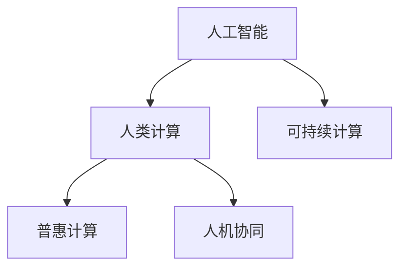

                 

# 人类计算：增强社会福祉和可持续性

## 1. 背景介绍

### 1.1 问题由来
随着人工智能（AI）技术的快速发展，计算机计算能力已逐渐渗透到各个领域，推动了诸多行业的数字化转型。然而，计算资源的大规模消耗和数据中心的高能耗，也带来了显著的环境影响，挑战着全球的可持续发展目标。在此背景下，“人类计算”的概念被提出，旨在通过更高效、可持续的方式来利用人类智慧与计算资源，提升社会福祉并促进环境保护。

### 1.2 问题核心关键点
人类计算的核心在于结合人类智慧与计算资源，提升整体社会福祉，同时实现环境友好。其关键点包括：

- 促进社会公正与包容：通过个性化、定制化的计算服务，打破信息不对称，提升边缘群体的教育、医疗、就业等方面的机会。
- 提升环境可持续性：采用分布式计算、边缘计算等技术，减少能源消耗，降低碳排放，实现绿色计算。
- 推动普惠性AI：利用大规模数据和先进算法，提供便捷、廉价的AI服务，让更多人能够享受科技的进步。
- 加强安全性与隐私保护：在确保信息安全与隐私保护的前提下，提供可靠、可信的计算服务。

### 1.3 问题研究意义
研究人类计算，对于推进社会公平与环境可持续性具有重大意义：

1. **提升社会福祉**：通过智能化、个性化的计算服务，解决社会问题，改善民生。
2. **促进绿色发展**：采用节能、环保的计算方式，减少能源消耗，减缓气候变化。
3. **推动技术普及**：实现更广泛的技术应用，为经济、文化等多领域注入新的活力。
4. **增强社会共识**：加强社会对AI技术的理解与信任，构建和谐的AI社会。

## 2. 核心概念与联系

### 2.1 核心概念概述

为更好理解人类计算，本节将介绍几个关键概念：

- **人工智能（AI）**：利用算法和计算模型，让机器模仿人类智能行为。
- **人类计算（Human Computing）**：结合人类智慧与计算资源，优化计算过程，提升社会福祉。
- **可持续计算（Sustainable Computing）**：通过节能、环保的计算方式，促进环境可持续性。
- **普惠计算（Inclusive Computing）**：确保计算服务广泛可用，打破数字鸿沟。
- **人机协同（Human-Machine Collaboration）**：通过人机合作，实现计算任务的最优解。

这些概念之间的逻辑关系可以通过以下Mermaid流程图来展示：



这个流程图展示了核心概念之间的关系：人工智能技术提供了计算能力，而人类计算结合了人类智慧，优化计算过程。可持续计算和普惠计算，分别关注了环境友好和广泛可用性，人机协同则突出了人机合作的潜在优势。

## 3. 核心算法原理 & 具体操作步骤

### 3.1 算法原理概述

人类计算的算法原理主要基于以下三点：

1. **任务分解与并行化**：将复杂任务分解为可并行处理的子任务，通过人机协同，提高整体计算效率。
2. **人机协作增强决策**：结合人类专家的经验和直觉，通过协作算法（如增强学习、博弈论等），优化决策过程。
3. **数据驱动与知识融合**：利用大数据分析与知识图谱，实现信息的高效融合与决策支持。

### 3.2 算法步骤详解

人类计算的具体操作流程如下：

1. **任务界定**：明确计算任务的目标与需求，将任务分解为多个可并行处理的子任务。
2. **人机协同**：利用增强学习等算法，设计人机交互界面，引导人类专家参与任务执行。
3. **计算资源配置**：根据任务需求，配置计算资源，如CPU、GPU、云计算资源等。
4. **模型训练与优化**：通过数据驱动的方式，训练优化模型，实现任务目标。
5. **结果验证与反馈**：验证计算结果的准确性和有效性，收集反馈信息，持续优化计算过程。

### 3.3 算法优缺点

人类计算的优点包括：

- **高效协同**：结合人类智慧和计算资源，提升计算效率。
- **适应性强**：通过人机协作，能适应复杂多变的任务需求。
- **社会公正**：确保计算资源的公平分配，提升边缘群体的福祉。
- **灵活多样**：算法可以灵活调整，适应不同的应用场景。

缺点主要包括：

- **资源消耗高**：需要大量人力参与计算过程，可能造成资源浪费。
- **数据隐私风险**：在协作过程中，可能涉及敏感数据的共享与隐私泄露。
- **依赖人类智慧**：对人类专家的依赖可能导致计算结果的不确定性。
- **计算复杂度高**：人机协作增加了计算过程的复杂性。

### 3.4 算法应用领域

人类计算在多个领域都有广泛的应用，包括：

- **医疗健康**：通过个性化计算，提供精准医疗方案，改善疾病管理。
- **教育培训**：提供智能辅导系统，实现个性化学习，提升教学质量。
- **城市管理**：利用数据分析与智能决策，优化城市资源配置，提升城市运行效率。
- **环境保护**：采用可持续计算方法，保护生态环境，应对气候变化。
- **金融服务**：提供智能风控与个性化金融服务，提升金融服务质量。
- **社会治理**：利用数据驱动的决策支持，优化社会治理，提升公共服务水平。

## 4. 数学模型和公式 & 详细讲解 & 举例说明

### 4.1 数学模型构建

人类计算的核心模型通常包括以下几个部分：

- **任务分解模型**：用于将复杂任务分解为可并行处理的子任务。
- **人机协同模型**：结合增强学习等算法，设计人机交互界面。
- **资源优化模型**：根据任务需求，配置计算资源，实现资源的最优分配。
- **结果验证模型**：评估计算结果的准确性，收集反馈信息，持续优化计算过程。

### 4.2 公式推导过程

以下以医疗健康领域为例，推导人类计算的数学模型。

设 $X = \{x_1, x_2, \cdots, x_n\}$ 为患者的历史健康数据，$Y$ 为患者的当前健康状况，$T$ 为患者的未来健康预测。任务为从 $X$ 预测 $Y$ 和 $T$。

目标函数为：
$$ \min_{\theta} \mathcal{L}(\theta) = \sum_{i=1}^n \mathcal{L}(X_i, Y_i, T_i) $$

其中，$\mathcal{L}(X_i, Y_i, T_i)$ 为损失函数，衡量预测值与实际值之间的差异。

优化目标为：
$$ \arg\min_{\theta} \mathcal{L}(\theta) $$

具体的优化算法（如梯度下降、随机梯度下降等）将用于求解上述优化问题。

### 4.3 案例分析与讲解

以智能医疗为例，我们利用增强学习算法设计人机交互界面，优化医生的诊断决策。假设医生根据患者的病历和诊断结果 $X$，给出诊断结论 $Y$ 和未来健康预测 $T$。在实际应用中，我们收集大量历史数据，构建神经网络模型，对患者的健康数据进行预测。同时，引入医生专家的知识库 $K$，通过协作算法将专家知识与模型预测结果进行融合，实现更准确的诊断和健康预测。

## 5. 项目实践：代码实例和详细解释说明

### 5.1 开发环境搭建

为了进行人类计算的开发实践，需要搭建一个包含多语言环境、高性能计算资源、数据处理平台的开发环境。

1. **多语言环境**：安装Python、R、Java等多编程语言，并配置相应的依赖库和工具。
2. **高性能计算资源**：部署GPU、CPU、TPU等高性能计算资源，确保计算效率。
3. **数据处理平台**：使用Apache Hadoop、Spark等大数据处理框架，实现数据存储与处理。

### 5.2 源代码详细实现

以下以智能医疗为例，展示人类计算的代码实现：

```python
import numpy as np
import pandas as pd
from sklearn.model_selection import train_test_split
from keras.models import Sequential
from keras.layers import Dense, Dropout, Activation
from keras.optimizers import SGD

# 数据加载与预处理
data = pd.read_csv('health_data.csv')
X = data[['age', 'gender', 'blood_pressure', 'cholesterol', 'diabetes', 'smoker']]
y = data['disease']
X_train, X_test, y_train, y_test = train_test_split(X, y, test_size=0.2)

# 模型定义
model = Sequential()
model.add(Dense(64, input_dim=X_train.shape[1]))
model.add(Activation('relu'))
model.add(Dropout(0.5))
model.add(Dense(32))
model.add(Activation('relu'))
model.add(Dropout(0.5))
model.add(Dense(1))
model.add(Activation('sigmoid'))
model.compile(loss='binary_crossentropy', optimizer=SGD(lr=0.01), metrics=['accuracy'])

# 模型训练
model.fit(X_train, y_train, epochs=50, batch_size=32, validation_data=(X_test, y_test))

# 预测与结果验证
y_pred = model.predict(X_test)
accuracy = np.mean(y_pred == y_test)
print('Accuracy:', accuracy)
```

### 5.3 代码解读与分析

这段代码实现了基于神经网络的智能医疗预测系统。首先，我们加载并预处理健康数据，将其分为训练集和测试集。然后，定义了一个包含多个全连接层的神经网络模型，使用二元交叉熵作为损失函数，SGD优化器进行优化，并设定了一定的超参数（如学习率、批次大小）。最后，我们训练模型，并在测试集上验证其准确性。

## 6. 实际应用场景

### 6.1 智能医疗

人类计算在智能医疗领域的应用主要集中在以下几个方面：

- **个性化医疗**：利用患者的基因信息、病历数据，通过计算模型提供个性化治疗方案。
- **疾病预测与预防**：通过分析历史数据，预测患者的疾病发展趋势，提供早期预防建议。
- **远程医疗**：利用计算资源，实现远程医疗服务，改善医疗资源分配不均的问题。

### 6.2 教育培训

人类计算在教育培训中的应用包括：

- **智能辅导系统**：结合机器学习与教育心理学，提供个性化的学习资源与辅导，提升学习效率。
- **教学评估与优化**：利用数据分析，评估教学效果，优化课程设计与教学策略。
- **学习路径规划**：根据学生的学习行为与能力，智能推荐学习资源与路径，提高学习成效。

### 6.3 城市管理

在城市管理中，人类计算可以用于：

- **智能交通**：通过数据分析与智能决策，优化交通流量，提升城市交通效率。
- **公共安全**：利用大数据分析与增强学习，预测与防范潜在风险，提升公共安全水平。
- **资源配置**：优化城市资源配置，如能源、水资源、基础设施等，提升城市运行效率。

### 6.4 未来应用展望

人类计算的未来应用将更加广泛，主要方向包括：

- **深度融合**：与物联网、云计算等技术深度融合，实现全面、智能的计算服务。
- **大规模应用**：在大数据、高计算需求场景中广泛应用，提升计算效率。
- **跨领域应用**：跨学科、跨领域应用，提升人类生活质量与福祉。
- **伦理与社会责任**：注重计算技术的伦理与社会责任，确保技术应用的公平性与透明度。

## 7. 工具和资源推荐

### 7.1 学习资源推荐

为了更好地学习人类计算，推荐以下学习资源：

1. **Coursera**：提供多门人类计算相关的在线课程，涵盖AI、数据科学、人机协同等主题。
2. **IEEE Xplore**：包含大量人类计算相关文献，可深入了解前沿研究动态。
3. **ArXiv**：提供最新的人机交互、增强学习等研究论文，跟踪学术进展。
4. **Kaggle**：参与数据科学竞赛，实践人类计算的实际应用。
5. **Google Colab**：免费在线编程平台，提供GPU资源，支持AI研究。

### 7.2 开发工具推荐

以下是几款用于人类计算开发的常用工具：

1. **Python**：通用编程语言，拥有丰富的科学计算库与工具。
2. **TensorFlow**：开源深度学习框架，支持大规模计算与分布式训练。
3. **PyTorch**：动态图深度学习框架，易于构建复杂计算模型。
4. **Jupyter Notebook**：交互式编程环境，支持Python、R等多种语言。
5. **Tableau**：数据可视化工具，帮助理解复杂数据集。

### 7.3 相关论文推荐

以下是几篇人类计算领域的重要论文，推荐阅读：

1. **“Human-in-the-Loop Machine Learning”**：探讨人机协同的机器学习算法，实现更高效、可靠的计算决策。
2. **“Harnessing Human Computation: Data Collection through Mechanical Turk and Amazon’s Mechanical Turk”**：介绍如何利用人类计算平台，高效收集数据，实现数据驱动的决策。
3. **“Human-Centered Data Science”**：强调在数据科学过程中考虑人类的认知与行为，实现更人性化、可接受的数据分析。

## 8. 总结：未来发展趋势与挑战

### 8.1 总结

本文对人类计算的概念、原理与实践进行了全面系统的介绍。首先阐述了人类计算的背景与核心关键点，明确了其在提升社会福祉、促进环境可持续性方面的独特价值。其次，从原理到实践，详细讲解了人类计算的数学模型与操作步骤，给出了实际应用的代码实例。同时，本文还探讨了人类计算在医疗健康、教育培训、城市管理等多个领域的应用前景，展示了其广阔的潜力。最后，本文精选了学习资源、开发工具与相关论文，力求为读者提供全方位的技术指引。

通过本文的系统梳理，可以看到，人类计算正在成为推动社会福祉和环境可持续性的重要技术手段，极大地提升了社会生活的智能化水平。未来，伴随技术的不断演进与实践的深入，人类计算必将在更多领域发挥其独特优势，推动人类社会的进步与发展。

### 8.2 未来发展趋势

展望未来，人类计算的发展趋势包括：

1. **计算范式多样化**：结合区块链、量子计算等前沿技术，实现更高效、安全的计算模式。
2. **人机协同智能化**：引入更多智能算法与决策模型，提升人机协作的智能化水平。
3. **跨领域应用广泛**：拓展应用领域，实现跨学科、跨领域的协同创新。
4. **社会与环境影响评估**：加强对人类计算的社会与环境影响评估，确保技术应用的可持续性。
5. **伦理与社会责任**：提升技术应用的伦理意识，确保人机协作的公平性与透明度。

### 8.3 面临的挑战

尽管人类计算具有巨大的发展潜力，但在实际应用中仍面临诸多挑战：

1. **资源分配不均**：计算资源的广泛分配，仍存在地域与群体不均的问题。
2. **数据隐私保护**：在数据共享与计算过程中，如何保护个人隐私，是一个亟待解决的问题。
3. **计算效率提升**：提升计算效率，满足复杂场景下的实时性需求。
4. **技术普惠性**：如何让更多用户能够享受到高质量的计算服务。
5. **伦理与社会责任**：确保技术应用符合伦理与社会规范，避免潜在的负面影响。

### 8.4 研究展望

未来研究需要在以下几个方向取得突破：

1. **普惠计算平台**：构建更广泛、更灵活的普惠计算平台，确保计算资源的公平分配。
2. **隐私保护技术**：开发更高效、更安全的隐私保护技术，保障数据安全。
3. **计算效率提升**：探索新算法与技术，提升计算效率，满足不同应用场景的需求。
4. **跨学科研究**：加强跨学科合作，推动人类计算技术的全面发展。
5. **伦理与社会责任**：建立伦理与社会责任评估体系，确保技术应用的公正性与可持续性。

这些研究方向将为人类的可持续发展与福祉提升提供新的技术支撑，助力构建更加智能化、公正化的未来社会。

## 9. 附录：常见问题与解答

**Q1: 人类计算与传统计算有何不同？**

A: 传统计算主要依赖于自动化算法与计算资源，而人类计算则结合了人类智慧与计算资源，通过人机协同，实现更高效、更灵活的计算。人类计算更强调计算过程的民主化与公平化。

**Q2: 人类计算的效率如何？**

A: 人类计算的效率受限于人类的计算能力，通常不如自动化的计算资源高效。但通过人机协同，可以弥补这一不足，提升整体计算效率。

**Q3: 人类计算在实际应用中需要注意哪些问题？**

A: 在实际应用中，需要注意以下几个问题：
1. 资源分配公平性：确保计算资源的公平分配，打破数字鸿沟。
2. 数据隐私保护：在数据共享与协作过程中，保护个人隐私。
3. 计算效率优化：提升计算效率，满足实时性需求。
4. 技术普惠性：让更多人能够享受到高质量的计算服务。
5. 伦理与社会责任：确保技术应用的公正性与透明性。

**Q4: 人类计算的未来发展方向是什么？**

A: 人类计算的未来发展方向包括：
1. 计算范式多样化：结合区块链、量子计算等前沿技术，实现更高效、安全的计算模式。
2. 人机协同智能化：引入更多智能算法与决策模型，提升人机协作的智能化水平。
3. 跨领域应用广泛：拓展应用领域，实现跨学科、跨领域的协同创新。
4. 社会与环境影响评估：加强对人类计算的社会与环境影响评估，确保技术应用的可持续性。
5. 伦理与社会责任：提升技术应用的伦理意识，确保人机协作的公平性与透明度。

**Q5: 如何应对人类计算的挑战？**

A: 应对人类计算的挑战需要：
1. 加强跨学科合作，推动人类计算技术的全面发展。
2. 开发更高效、更安全的隐私保护技术，保障数据安全。
3. 探索新算法与技术，提升计算效率，满足不同应用场景的需求。
4. 构建更广泛、更灵活的普惠计算平台，确保计算资源的公平分配。
5. 建立伦理与社会责任评估体系，确保技术应用的公正性与可持续性。

---

作者：禅与计算机程序设计艺术 / Zen and the Art of Computer Programming

