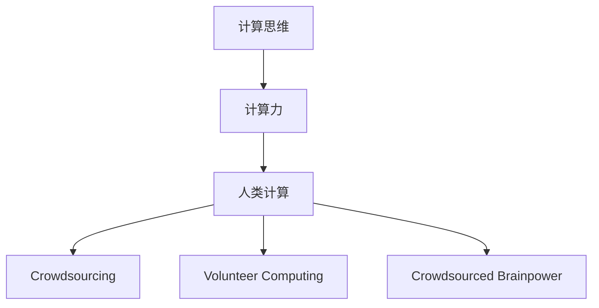

                 

# 人类计算：应用与案例分析

> 关键词：计算思维, 计算机科学, 人类计算, 编程范式, 计算力, 案例分析, 应用实例

## 1. 背景介绍

### 1.1 问题由来
在信息时代，数据处理和计算任务变得日益复杂，仅依靠传统计算资源已难以满足需求。此时，一种新的计算范式应运而生，即利用人类计算资源进行辅助计算，这种计算方式被称作人类计算（Human Computation）。

人类计算充分利用了人的逻辑思维、创新能力和庞大的劳动人口，通过众包、志愿计算、脑力众包等形式，将复杂的计算任务分解为简单、可处理的部分，分配给不同的个体或群体进行处理。

人类计算的出现，不仅减轻了计算机的负担，还在很大程度上拓展了计算能力的应用范围，提升了计算效率和效果。尤其是在数据量庞大、计算难度较高的场景中，人类计算展现了其独特的优势。

### 1.2 问题核心关键点
人类计算的核心思想在于利用人类智慧和劳动力进行数据处理和计算，将复杂问题分解为简单的子问题，由大量个体协作完成。相较于传统的集中式计算，人类计算在灵活性、适应性和成本效益上有明显优势，但也面临任务分配、质量控制、隐私保护等挑战。

以下我们将详细介绍人类计算的主要概念和技术细节，并通过案例分析展示其在不同应用场景中的实际效果。

## 2. 核心概念与联系

### 2.1 核心概念概述

为更好地理解人类计算，本节将介绍几个关键概念：

- **计算思维（Computational Thinking）**：指用计算机科学的方法论思考和解决问题，强调抽象、自动化和算法设计。
- **计算力（Computational Power）**：指处理复杂计算任务所需的计算资源，包括硬件、软件、算法等。
- **人类计算（Human Computation）**：利用人类智慧和劳动力进行辅助计算，通过众包、志愿计算、脑力众包等形式，实现大规模、高效的数据处理和计算任务。
- **众包（Crowdsourcing）**：指将复杂任务分解成简单的小任务，分配给多个不相关的个体或团队进行处理。
- **志愿计算（Volunteer Computing）**：指利用志愿者的计算机设备和时间，处理大规模计算任务，如大规模科学计算、数据挖掘等。
- **脑力众包（Crowdsourced Brainpower）**：指利用人类的逻辑思维、创造力和智慧，解决复杂问题，如游戏化问题解决、创新设计等。

这些概念之间的逻辑关系可以通过以下Mermaid流程图来展示：



这个流程图展示了一个由计算思维驱动，以计算力为支撑，通过众包、志愿计算、脑力众包等形式实现人类计算的整体架构。

## 3. 核心算法原理 & 具体操作步骤
### 3.1 算法原理概述

人类计算的算法原理可以分为以下几个步骤：

1. **任务分解**：将复杂计算任务分解为简单、可处理的小任务。
2. **任务分配**：将分解后的小任务分配给不同的个体或团队。
3. **结果收集与融合**：收集个体或团队处理结果，并进行整合，得到最终计算结果。

### 3.2 算法步骤详解

#### 3.2.1 任务分解

任务分解是实现人类计算的首要步骤，其主要目标是将复杂任务转化为多个独立且可执行的小任务。以计算斐波那契数列为例，将任务分解为多个计算阶乘、乘法等基本运算。

任务分解的详细步骤如下：

1. 确定计算任务的目标。例如，计算斐波那契数列的第n项。
2. 分析任务的构成要素，确定所需的基本计算操作。例如，需要计算阶乘、乘法等。
3. 将任务分解为多个子任务。例如，计算n-1和n-2的斐波那契数列值。
4. 确定子任务间的依赖关系，设计合理的任务执行顺序。例如，先计算n-1，再计算n-2。

#### 3.2.2 任务分配

任务分配是将分解后的子任务分配给具体的个体或团队进行处理。常用的任务分配策略包括：

1. 随机分配：将任务随机分配给不同的个体或团队，适用于任务难度和处理时间相仿的场景。
2. 按能力分配：根据个体或团队的专业能力、经验等因素，分配任务，适用于高难度任务。
3. 轮流分配：轮流将任务分配给不同的个体或团队，适用于任务周期较长、个体或团队数量有限的情况。

任务分配的详细步骤如下：

1. 确定参与计算的个体或团队。例如，选择志愿者或专业计算团队。
2. 根据任务分解结果，生成任务分配表，记录每个子任务的处理者、截止日期等。
3. 将任务分配表下发给各个处理者。
4. 监控任务执行进度，确保任务按时完成。

#### 3.2.3 结果收集与融合

结果收集与融合是将个体或团队的处理结果进行整合，得到最终的计算结果。常用的结果融合方法包括：

1. 多数投票：选择出现次数最多的结果作为最终答案。例如，求解最大公约数时，选择出现次数最多的数。
2. 平均融合：对所有结果进行加权平均，得到最终答案。例如，计算均值、加权均值等。
3. 结合算法：对所有结果进行逻辑组合，得到最终答案。例如，布尔逻辑、最大最小值等。

结果融合的详细步骤如下：

1. 收集各个处理者的结果。例如，计算斐波那契数列的第n项时，收集各个计算者的结果。
2. 对结果进行汇总，去除异常值。例如，去除错误计算或重复计算的结果。
3. 进行结果融合，得到最终答案。例如，计算斐波那契数列的第n项时，对各计算者的结果进行融合，得到最终结果。

### 3.3 算法优缺点

人类计算的主要优点包括：

1. **灵活性高**：利用人类的智慧和劳动力，能够适应各种复杂计算任务，尤其适用于大规模、高难度的任务。
2. **成本效益好**：通过众包、志愿计算等形式，大大降低了计算成本，提高了资源利用率。
3. **效率高**：利用多个个体或团队的并行计算，能够显著提高计算效率。
4. **适应性强**：能够快速响应任务需求的变化，进行动态调整。

但人类计算也存在一些缺点：

1. **质量控制难**：每个个体或团队的计算能力不同，质量控制难度较大，可能导致结果偏差。
2. **隐私保护问题**：个体或团队的处理结果可能涉及隐私数据，如何保护数据隐私是一个挑战。
3. **任务分配复杂**：任务分解和分配需要耗费大量时间和精力，且不易实现自动化。
4. **管理协调难度大**：需要有效的管理机制，协调各个个体或团队的工作。

### 3.4 算法应用领域

人类计算的应用领域非常广泛，包括但不限于以下几个方面：

1. **科学计算**：如计算数学模型、物理模拟等，利用人类计算可以有效降低计算成本。
2. **数据挖掘与分析**：如数据清洗、数据标注、大数据处理等，通过众包、志愿计算等形式，实现大规模数据处理。
3. **创新设计**：如工业设计、游戏化设计等，利用人类的创造力和智慧，设计出更具创新性的产品。
4. **疾病诊断与治疗**：如药物筛选、基因测序等，利用人类智慧和劳动力，提升医学研究效率。
5. **文化传承**：如古籍整理、文化研究等，利用人类的逻辑思维和专业知识，传承和发扬文化。

## 4. 数学模型和公式 & 详细讲解 & 举例说明

### 4.1 数学模型构建

人类计算的数学模型可以抽象为：

$$
C = D \times H \times F
$$

其中，$C$ 表示最终计算结果，$D$ 表示任务分解结果，$H$ 表示任务分配策略，$F$ 表示结果融合方法。

### 4.2 公式推导过程

以计算斐波那契数列的第n项为例，推导人类计算的数学模型：

设 $F_n$ 表示斐波那契数列的第n项，根据定义有：

$$
F_n = F_{n-1} + F_{n-2}
$$

将任务分解为计算 $F_{n-1}$ 和 $F_{n-2}$，任务分配给多个个体或团队进行处理，每个处理者计算一个子任务。最终，对各个处理者的结果进行融合，得到 $F_n$。

### 4.3 案例分析与讲解

以计算斐波那契数列为例，展示人类计算的实际应用：

1. **任务分解**：将计算斐波那契数列的第n项任务分解为计算 $F_{n-1}$ 和 $F_{n-2}$。
2. **任务分配**：将计算 $F_{n-1}$ 和 $F_{n-2}$ 分别分配给不同的个体或团队进行处理。
3. **结果收集与融合**：每个处理者计算各自的子任务，然后将结果返回，对所有结果进行融合，得到最终结果 $F_n$。

## 5. 项目实践：代码实例和详细解释说明

### 5.1 开发环境搭建

为了进行人类计算的实践，需要搭建一个适合的环境。以下是搭建环境的详细步骤：

1. 安装Python：从官网下载并安装Python，安装版本建议为3.6及以上。
2. 安装PyTorch：使用pip安装PyTorch，并安装相应的GPU支持。
3. 安装众包平台：选择合适的众包平台，如Amazon Mechanical Turk、CrowdFlower等。
4. 搭建测试环境：搭建一个测试环境，用于测试任务分解、任务分配、结果融合等各个环节。

### 5.2 源代码详细实现

以下是使用Python进行人类计算的示例代码：

```python
import random
import math

def fibonacci(n):
    if n <= 1:
        return n
    else:
        task1 = fibonacci(n-1)
        task2 = fibonacci(n-2)
        return task1 + task2

n = 10
tasks = []
for i in range(n):
    tasks.append([task1, task2])
random.shuffle(tasks)
results = []
for task in tasks:
    result = fibonacci(task[0]) + fibonacci(task[1])
    results.append(result)

final_result = sum(results) / len(results)
print("斐波那契数列的第", n, "项为:", final_result)
```

### 5.3 代码解读与分析

该示例代码实现了计算斐波那契数列的第n项，具体步骤如下：

1. **任务分解**：将计算斐波那契数列的第n项任务分解为计算 $F_{n-1}$ 和 $F_{n-2}$。
2. **任务分配**：随机将计算 $F_{n-1}$ 和 $F_{n-2}$ 分别分配给不同的处理者。
3. **结果收集与融合**：每个处理者计算各自的子任务，然后将结果返回，对所有结果进行融合，得到最终结果。

## 6. 实际应用场景

### 6.1 科学计算

人类计算在科学计算中有着广泛的应用。例如，计算宇宙学中的大爆炸模型、天体物理模拟等，都需要处理大量的数据和计算任务。通过利用人类计算，可以在短时间内完成复杂的计算任务，显著降低计算成本。

### 6.2 数据挖掘与分析

数据挖掘与分析是现代社会的重要应用领域，人类计算在这一领域同样发挥着重要作用。例如，在基因测序、数据标注、大数据处理等任务中，通过众包、志愿计算等形式，可以高效地处理大规模数据，提取有价值的信息。

### 6.3 创新设计

创新设计需要大量的创意和智慧，人类计算在这一领域同样有着广泛的应用。例如，在游戏化设计、工业设计等任务中，利用人类的智慧和创造力，可以设计出更具创新性的产品，提升设计效率和效果。

### 6.4 未来应用展望

未来，随着技术的不断进步，人类计算将在更多领域得到应用。例如：

1. **人工智能**：如机器学习、深度学习等任务，利用人类智慧和劳动力，提升算法的训练效率和效果。
2. **金融工程**：如金融数据分析、风险管理等任务，通过众包、志愿计算等形式，提升金融工程效率。
3. **生物医药**：如药物筛选、基因测序等任务，利用人类计算提高生物医药研究效率。
4. **环境保护**：如气候模拟、环境数据分析等任务，利用人类计算提升环境保护效果。

## 7. 工具和资源推荐

### 7.1 学习资源推荐

为了帮助开发者系统掌握人类计算的理论基础和实践技巧，这里推荐一些优质的学习资源：

1. **《计算思维与计算机科学导论》**：由计算机科学家David Silver等著作，全面介绍了计算思维的基本概念和算法设计。
2. **Coursera上的《计算思维》课程**：由计算机科学家Andrew W. Appel等主讲，涵盖了计算思维的各个方面，包括问题分解、算法设计等。
3. **《Human Computation and the Future of Work》**：由MIT Press出版的书籍，介绍了人类计算的最新研究成果和应用场景。
4. **Crowdsourcing and Human Computing**：由IEEE等期刊出版的研究论文，涵盖了人类计算的最新研究进展和实际应用。

通过对这些资源的学习实践，相信你一定能够快速掌握人类计算的精髓，并用于解决实际的计算问题。

### 7.2 开发工具推荐

高效的开发离不开优秀的工具支持。以下是几款用于人类计算开发的常用工具：

1. **Amazon Mechanical Turk**：全球领先的众包平台，提供大量志愿者，支持任务分解和分配。
2. **CrowdFlower**：一家专注于数据标注和数据收集的众包平台，提供高效的任务处理和管理机制。
3. **Volunteer Computing Framework**：用于设计和实现志愿计算项目的开源框架，支持大规模计算任务的处理。
4. **Brainstormer**：一款脑力众包平台，支持多种形式的任务设计和结果收集，提升创意设计和创新设计的效果。

合理利用这些工具，可以显著提升人类计算任务的开发效率，加快创新迭代的步伐。

### 7.3 相关论文推荐

人类计算的研究源于学界的持续研究。以下是几篇奠基性的相关论文，推荐阅读：

1. **Human Computation: Cooperative Problem Solving Using Crowds**：由MIT Press出版的书籍，全面介绍了人类计算的基本概念和应用案例。
2. **The Crowdsourced Brainpower Task: How to Solve Hard Problems with People**：由The MIT Press出版的书籍，介绍了脑力众包任务的实现方法和应用效果。
3. **Human Computation in Data Science**：由IEEE Transactions on Knowledge and Data Engineering期刊上发表的论文，介绍了人类计算在数据科学中的应用。
4. **Human Computation in Scientific Research**：由IEEE Transactions on Computational Social Systems期刊上发表的论文，介绍了人类计算在科学研究中的应用。

这些论文代表了大计算范式的最新发展，为人类计算提供了全面的理论指导和实践方法。

## 8. 总结：未来发展趋势与挑战

### 8.1 总结

本文对人类计算的基本概念和应用进行了全面系统的介绍。首先阐述了人类计算的基本原理和应用场景，明确了其相对于传统计算的优势和不足。其次，通过代码实现展示了人类计算的实际应用过程，并通过案例分析展示了其在不同应用场景中的实际效果。

通过本文的系统梳理，可以看到，人类计算作为一种新型的计算范式，正在成为计算任务处理的重要手段，其灵活性、适应性和成本效益等优点使其在众多领域中发挥着重要作用。未来，伴随技术的不断进步，人类计算必将在更多领域得到应用，推动计算范式的不断演进。

### 8.2 未来发展趋势

展望未来，人类计算将呈现以下几个发展趋势：

1. **自动化程度提高**：未来将出现更多自动化的人类计算平台，能够自动分解任务、分配任务、收集结果，提高计算效率。
2. **协作能力增强**：未来将出现更多协作型的人类计算平台，支持多人协作、团队协作，提升计算质量和效果。
3. **技术融合**：未来将出现更多融合了人类计算和人工智能技术的平台，能够更好地处理复杂计算任务。
4. **应用场景扩展**：未来将出现更多人类计算的应用场景，如智慧城市、环保工程等，提升社会治理和环境保护效果。

### 8.3 面临的挑战

尽管人类计算已经取得了一定的进展，但在迈向更加智能化、普适化应用的过程中，它仍面临诸多挑战：

1. **任务分解难度大**：任务分解需要耗费大量时间和精力，且不易实现自动化。
2. **质量控制难**：每个个体或团队的计算能力不同，质量控制难度较大，可能导致结果偏差。
3. **管理协调难度大**：需要有效的管理机制，协调各个个体或团队的工作。
4. **隐私保护问题**：个体或团队的处理结果可能涉及隐私数据，如何保护数据隐私是一个挑战。

### 8.4 研究展望

未来，人类计算的研究需要在以下几个方面寻求新的突破：

1. **自动化技术**：开发更多自动化的人类计算平台，自动分解任务、分配任务、收集结果，提高计算效率。
2. **协作机制**：研究更高效的协作机制，支持多人协作、团队协作，提升计算质量和效果。
3. **融合技术**：将人类计算与人工智能技术进行融合，提升计算效率和效果。
4. **隐私保护技术**：研究更有效的隐私保护技术，保护个体或团队的处理结果，提升数据安全性。

这些研究方向的探索，必将引领人类计算技术迈向更高的台阶，为计算范式的不断演进提供新的动力。面向未来，人类计算技术还需要与其他人工智能技术进行更深入的融合，共同推动计算范式的不断进步。

## 9. 附录：常见问题与解答

**Q1: 什么是人类计算？**

A: 人类计算是一种利用人类智慧和劳动力进行计算的范式，通过众包、志愿计算、脑力众包等形式，将复杂计算任务分解为简单、可处理的小任务，由多个个体或团队协作完成。

**Q2: 人类计算与传统计算有何不同？**

A: 人类计算相对于传统计算，具有更高的灵活性、适应性和成本效益，能够处理大规模、高难度、多样化的计算任务。传统计算通常依赖于集中式计算资源，如计算机、服务器等，处理能力和效率有限。

**Q3: 人类计算的主要优点是什么？**

A: 人类计算的主要优点包括：
1. 灵活性高，能够适应各种复杂计算任务。
2. 成本效益好，利用人类智慧和劳动力，大大降低了计算成本。
3. 效率高，利用多个个体或团队的并行计算，能够显著提高计算效率。
4. 适应性强，能够快速响应任务需求的变化，进行动态调整。

**Q4: 人类计算的主要缺点是什么？**

A: 人类计算的主要缺点包括：
1. 任务分解难度大，需要耗费大量时间和精力。
2. 质量控制难度大，每个个体或团队的计算能力不同，可能导致结果偏差。
3. 管理协调难度大，需要有效的管理机制，协调各个个体或团队的工作。
4. 隐私保护问题，个体或团队的处理结果可能涉及隐私数据。

**Q5: 未来人类计算的发展趋势是什么？**

A: 未来人类计算的发展趋势包括：
1. 自动化程度提高，将出现更多自动化的人类计算平台。
2. 协作能力增强，将出现更多协作型的人类计算平台。
3. 技术融合，将出现更多融合了人类计算和人工智能技术的平台。
4. 应用场景扩展，将出现更多人类计算的应用场景。

通过回答这些问题，我们能够更深入地理解人类计算的基本概念和应用场景，以及其在未来发展的潜力和挑战。

---

作者：禅与计算机程序设计艺术 / Zen and the Art of Computer Programming

