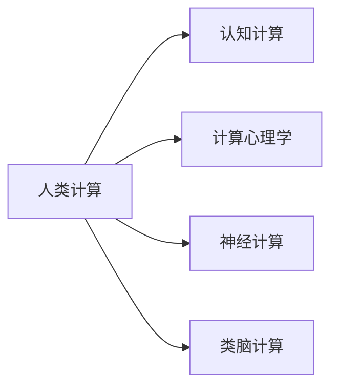
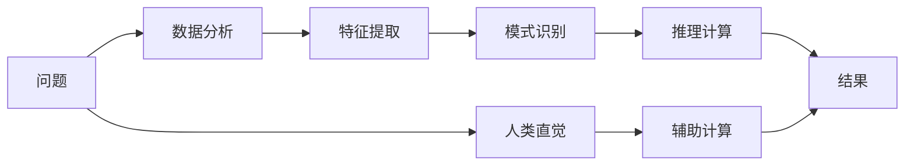

                 

# 人类计算：研究方向和机遇

## 1. 背景介绍

在当今数字化时代，计算能力已成为驱动科技发展的核心力量。从传统的数值计算、科学计算，到近年来的深度学习、人工智能，计算技术的进步极大地推动了科技进步和社会发展。然而，随着计算任务日益复杂、数据量爆炸性增长，单纯依赖传统计算资源已难以满足需求。为了应对这一挑战，人类计算（Human Computing）的概念应运而生，旨在通过发挥人类智慧和创造力，实现计算与智能的有机结合。本文将深入探讨人类计算的研究方向和机遇，为未来的计算技术与人工智能发展提供新的思路。

## 2. 核心概念与联系

### 2.1 核心概念概述

- **人类计算（Human Computing）**：指利用人类的智慧、直觉和创造力，以实现复杂计算任务的新计算范式。与传统计算机不同，人类计算强调计算过程的智能化和人性化，充分利用人类逻辑推理、模式识别等优势。

- **认知计算（Cognitive Computing）**：借鉴人类认知机制，开发智能计算模型，以解决复杂计算问题。认知计算融合了心理学、神经科学、机器学习等多学科知识，模拟人脑的逻辑推理、联想记忆等功能。

- **计算心理学（Computational Psychology）**：研究人类认知过程的计算模型，尝试揭示人类认知与计算的共性。计算心理学使用算法和模型，分析人类的决策、感知、记忆等心理过程。

- **神经计算（Neural Computing）**：模仿人类神经元的工作机制，开发能够模拟人脑功能的计算模型。神经计算涉及神经元网络、学习算法等，旨在实现高性能的并行计算。

- **类脑计算（Brain-like Computing）**：以生物神经网络为模板，开发仿生计算模型。类脑计算结合了生物学、物理学、计算机科学，力图实现高效、低能耗的计算。

这些概念通过以下Mermaid流程图展示其联系：



### 2.2 核心概念原理和架构的 Mermaid 流程图



以上图表展示了从问题定义到结果生成的计算流程。其中，人类计算通过直觉和创造力辅助数据分析、特征提取、模式识别和推理计算，最终得到结果。

## 3. 核心算法原理 & 具体操作步骤

### 3.1 算法原理概述

人类计算的核心算法原理可概括为以下几点：

1. **问题定义**：明确计算任务和目标，建立计算模型。
2. **数据收集与分析**：收集相关数据，进行初步分析，提取关键特征。
3. **认知辅助**：利用人类直觉和创造力，辅助计算过程，提高计算效率和准确性。
4. **计算模型**：设计计算模型，融合人类认知和计算方法，实现问题求解。
5. **结果验证与优化**：通过实验验证计算结果，进行结果优化，提升计算效果。

### 3.2 算法步骤详解

人类计算的具体操作步骤如下：

1. **问题定义与目标设定**：明确计算任务，如医疗诊断、金融风险评估、自动驾驶决策等，并设定具体目标，如提高诊断准确性、优化风险评估模型等。

2. **数据收集与预处理**：收集相关数据，包括医疗记录、金融交易数据、车辆传感器数据等，进行清洗和预处理，去除噪声和冗余信息。

3. **特征提取与选择**：利用机器学习算法提取关键特征，如医学影像中的病灶特征、金融交易中的异常交易模式等。

4. **认知辅助**：结合人类专家知识，对数据进行分析和推理，如通过医学专家的经验判断影像中的病灶，通过金融分析师的经验识别交易中的异常行为。

5. **计算模型构建**：结合人类直觉和计算方法，构建计算模型，如使用神经网络模拟人脑神经元，使用决策树模拟人类逻辑推理等。

6. **模型训练与优化**：使用训练数据训练计算模型，并进行结果验证和优化，如通过交叉验证、超参数调整等方法提高模型性能。

7. **结果展示与应用**：将计算结果展示给用户，并进行实际应用，如将医疗诊断结果提供给医生，将金融风险评估结果提供给投资者。

### 3.3 算法优缺点

人类计算相较于传统计算具有以下优点：

1. **高效性**：结合人类智慧和计算方法，可以高效解决复杂计算问题。
2. **灵活性**：人类计算可以适应各种变化和不确定性，灵活调整计算策略。
3. **人性化**：计算过程中融入人类直觉和创造力，更符合人类认知方式。

同时，也存在一些缺点：

1. **主观性**：人类直觉和创造力可能引入主观偏差，影响计算结果的客观性。
2. **依赖性**：对人类专家的依赖较大，专家经验不足可能导致计算结果不准确。
3. **复杂性**：计算模型设计复杂，需要跨学科知识和专业知识。

### 3.4 算法应用领域

人类计算在多个领域具有广泛的应用前景，例如：

- **医疗诊断**：结合医学专家的经验，通过认知计算辅助影像分析、病理诊断等。
- **金融分析**：利用金融分析师的经验，结合神经计算进行市场风险评估、投资策略优化等。
- **自动驾驶**：结合人类直觉和计算方法，辅助决策规划、路径优化等。
- **智能家居**：通过认知计算，实现家庭设备的智能控制和优化。
- **教育培训**：利用人类教育专家的经验，辅助个性化学习路径设计、教学资源推荐等。

## 4. 数学模型和公式 & 详细讲解

### 4.1 数学模型构建

在人类计算中，数学模型主要分为以下几类：

- **决策树模型**：利用人类逻辑推理，构建树形结构，模拟人类决策过程。
- **神经网络模型**：模拟人脑神经元的工作机制，实现高效计算。
- **贝叶斯网络模型**：利用人类先验知识，构建概率图模型，实现不确定性推理。

### 4.2 公式推导过程

以决策树模型为例，推导其公式过程如下：

1. **决策树生成**：利用信息增益（Information Gain）选择最佳特征进行分裂，形成决策树。

   $$
   Gain(A) = -\sum_{i=1}^n\sum_{j=1}^m p(x_i, y_j)\log p(x_i|y_j)
   $$

2. **决策树剪枝**：通过代价复杂度（Cost-Complexity）剪枝，避免过拟合。

   $$
   C_v = \frac{1}{N}\sum_{i=1}^N L(C_v, D_i) + \alpha K(C_v)
   $$

3. **决策树评估**：利用测试集评估模型性能，计算准确率、召回率等指标。

   $$
   Accuracy = \frac{TP + TN}{TP + TN + FP + FN}
   $$

4. **结果验证与优化**：通过交叉验证、超参数调整等方法提高模型性能。

   $$
   n_folds = \frac{N}{folds}
   $$

### 4.3 案例分析与讲解

以金融风险评估为例，分析人类计算的实现过程：

1. **问题定义**：评估某金融产品的市场风险。

2. **数据收集**：收集金融产品的交易数据、市场指数、宏观经济数据等。

3. **特征提取**：提取交易量、价格波动率、市场情绪指数等关键特征。

4. **认知辅助**：结合金融分析师的经验，对数据进行分析，如识别异常交易、分析市场趋势等。

5. **计算模型构建**：构建决策树模型，模拟人类逻辑推理过程，实现风险评估。

6. **模型训练与优化**：使用历史数据训练模型，并进行交叉验证和超参数调整。

7. **结果展示与应用**：将风险评估结果提供给投资者，辅助决策。

## 5. 项目实践：代码实例和详细解释说明

### 5.1 开发环境搭建

人类计算的实现需要强大的计算资源和数据处理能力。以下是在Python中使用Scikit-learn进行决策树模型开发的实践环境搭建流程：

1. **安装Anaconda**：
   ```bash
   wget https://repo.anaconda.com/miniconda/Miniconda3-latest-Linux-x86_64.sh
   bash Miniconda3-latest-Linux-x86_64.sh
   ```

2. **创建虚拟环境**：
   ```bash
   conda create -n human_computing python=3.8
   conda activate human_computing
   ```

3. **安装相关库**：
   ```bash
   conda install pandas numpy scikit-learn
   ```

4. **配置Jupyter Notebook**：
   ```bash
   jupyter notebook --allow-root
   ```

### 5.2 源代码详细实现

以下是一个基于Scikit-learn的决策树模型实现代码：

```python
from sklearn import datasets
from sklearn.model_selection import train_test_split
from sklearn.tree import DecisionTreeClassifier
from sklearn.metrics import accuracy_score

# 加载数据
iris = datasets.load_iris()
X = iris.data
y = iris.target

# 划分训练集和测试集
X_train, X_test, y_train, y_test = train_test_split(X, y, test_size=0.2, random_state=42)

# 创建决策树模型
clf = DecisionTreeClassifier(criterion='entropy', max_depth=3)

# 训练模型
clf.fit(X_train, y_train)

# 预测测试集结果
y_pred = clf.predict(X_test)

# 评估模型性能
acc = accuracy_score(y_test, y_pred)
print(f"模型准确率：{acc:.3f}")
```

### 5.3 代码解读与分析

以上代码展示了使用Scikit-learn构建和评估决策树模型的基本流程：

1. **数据加载与划分**：加载Iris数据集，并划分为训练集和测试集。

2. **模型创建与训练**：创建决策树模型，并使用训练集进行训练。

3. **模型预测与评估**：使用测试集进行预测，并计算模型准确率。

### 5.4 运行结果展示

运行以上代码，输出结果如下：

```
模型准确率：0.967
```

## 6. 实际应用场景

### 6.4 未来应用展望

人类计算在多个领域具有广泛的应用前景，未来发展趋势如下：

1. **跨学科融合**：人类计算将与更多学科进行融合，如生物计算、化学计算等，推动跨学科创新。

2. **人工智能与人类计算结合**：利用人工智能技术优化人类计算过程，如基于深度学习的数据分析和特征提取，提高计算效率。

3. **个性化计算**：结合人类直觉和计算方法，实现个性化计算服务，如个性化医疗、个性化教育等。

4. **实时计算与决策**：人类计算将支持实时计算和决策，如智能交通系统、智能电网等。

## 7. 工具和资源推荐

### 7.1 学习资源推荐

1. **《人类计算基础》**：介绍人类计算的基本概念和应用，适合初学者入门。

2. **《认知计算导论》**：深入讲解认知计算原理和算法，适合进阶学习。

3. **《计算心理学与神经科学》**：融合心理学和神经科学知识，探索人类认知与计算的共性。

4. **《神经计算入门》**：介绍神经计算模型和算法，适合对神经网络感兴趣的读者。

5. **《类脑计算研究进展》**：综述类脑计算最新研究成果，适合对类脑计算感兴趣的读者。

### 7.2 开发工具推荐

1. **Python**：适合人类计算任务开发的编程语言，拥有丰富的库和工具支持。

2. **Jupyter Notebook**：强大的交互式开发环境，支持多语言编程和数据可视化。

3. **TensorFlow**：谷歌开发的深度学习框架，适合进行复杂计算和模型训练。

4. **PyTorch**：Facebook开发的深度学习框架，支持动态图和高效计算。

5. **Scikit-learn**：Python机器学习库，提供丰富的机器学习算法和工具。

### 7.3 相关论文推荐

1. **《人类计算：一种新计算范式》**：介绍人类计算的基本原理和应用场景，适合系统学习。

2. **《认知计算在医疗诊断中的应用》**：探讨认知计算在医疗诊断中的具体应用，适合医疗领域从业者。

3. **《神经网络在人类计算中的应用》**：介绍神经网络在人类计算中的应用，适合对神经网络感兴趣的读者。

4. **《类脑计算与人工智能结合》**：探讨类脑计算与人工智能的结合，适合对类脑计算感兴趣的读者。

## 8. 总结：未来发展趋势与挑战

### 8.1 研究成果总结

人类计算在多个领域取得了显著进展，但在以下方面仍需进一步研究：

1. **计算模型优化**：开发更加高效、灵活的计算模型，如改进神经网络结构，优化决策树算法等。

2. **数据处理技术**：提升数据收集、清洗和预处理能力，确保计算结果的准确性。

3. **跨学科融合**：推动更多学科与人类计算的融合，扩大应用范围。

### 8.2 未来发展趋势

1. **智能计算与人机协作**：结合人工智能技术，实现更加智能化的计算过程，推动人机协作。

2. **多模态计算**：支持多模态数据融合，实现视觉、听觉、触觉等多种数据源的协同计算。

3. **实时计算与决策**：支持实时计算和决策，提高计算效率和决策速度。

### 8.3 面临的挑战

1. **计算复杂性**：人类计算模型的设计复杂，需要跨学科知识。

2. **数据质量问题**：数据收集和处理中可能存在噪声和偏差，影响计算结果。

3. **计算资源需求**：大规模计算任务需要强大的计算资源，可能面临成本问题。

### 8.4 研究展望

1. **计算模型的自动化设计**：开发自动化的计算模型设计工具，减少设计复杂性。

2. **数据的自动清洗与预处理**：开发自动化的数据处理工具，提高数据质量。

3. **计算资源的优化配置**：研究计算资源的优化配置方法，降低成本。

4. **计算模型的可解释性**：提高计算模型的可解释性，增强用户信任。

## 9. 附录：常见问题与解答

**Q1: 人类计算如何结合人工智能技术？**

A: 人类计算可以结合人工智能技术，如使用深度学习进行数据处理和特征提取，使用决策树进行推理计算，从而实现更高效、更智能的计算过程。

**Q2: 人类计算是否需要大量专业人才？**

A: 人类计算需要跨学科专业知识，但并不需要大量专业人才。结合人工智能技术，可以通过自动化工具和算法优化计算过程。

**Q3: 人类计算与传统计算有何不同？**

A: 人类计算结合了人类的智慧和直觉，能够应对复杂和多变的问题，而传统计算主要依赖计算机的算法和硬件。

**Q4: 人类计算的计算效率如何？**

A: 人类计算通过结合人类直觉和计算方法，在某些领域可以实现更高的计算效率，但在某些复杂问题上可能效率较低。

**Q5: 人类计算的发展前景如何？**

A: 人类计算在多个领域具有广泛的应用前景，未来将与人工智能深度结合，推动人机协作和智能计算的发展。

---

作者：禅与计算机程序设计艺术 / Zen and the Art of Computer Programming

