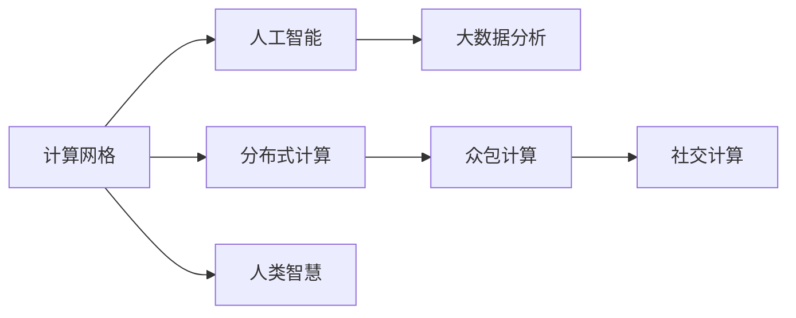

                 

# 人类计算：连接人类智慧的网络

> 关键词：计算网格, 分布式计算, 人工智能(AI), 众包计算, 社交计算, 大数据分析

## 1. 背景介绍

### 1.1 问题由来

近年来，人工智能（AI）技术的迅猛发展，尤其是深度学习、自然语言处理、计算机视觉等领域的突破，使得机器学习在解决复杂问题方面取得了前所未有的成绩。然而，当面对大规模、高维度、非结构化的数据时，现有的机器学习模型往往显得力不从心。数据处理和模型训练的计算需求迅速增长，单一机器的计算资源已经难以满足需求。

与此同时，全球范围内的人类智慧正以指数级增长，每天有数以亿计的人类通过社交媒体、论坛、博客等平台分享知识、交流观点、协作解决问题。这些知识的背后蕴含着巨大的计算潜力。如何有效整合这些分散的人类智慧，并将其转化为机器学习的计算资源，成为了计算机领域的新课题。

## 2. 核心概念与联系

### 2.1 核心概念概述

为更好地理解这一新课题，本节将介绍几个关键概念及其内在联系：

- **计算网格(Computational Grid)**：一种分布式计算架构，利用多个计算资源形成一个计算网络，通过调度机制，将计算任务分配给网络中的空闲计算节点进行并行处理。

- **分布式计算(Distributed Computing)**：通过多个计算机或服务器协同工作，处理大型计算任务，提高计算效率和性能。

- **人工智能(AI)**：使用算法和模型，使机器能够模拟人类的认知、感知和推理能力，解决复杂问题。

- **众包计算(Crowdsourcing Computing)**：通过互联网平台，将计算任务外包给大众用户，利用“人力”作为计算资源，以低成本、高效率的方式完成计算任务。

- **社交计算(Social Computing)**：利用社交网络的数据和结构，通过协作、互动、社交活动等方式，辅助机器学习模型进行训练和推理。

- **大数据分析(Big Data Analytics)**：通过大规模数据处理和分析，发现数据中蕴含的潜在模式和知识，辅助决策和优化。

这些核心概念共同构成了“人类计算”的基本框架，通过分布式计算、社交计算和众包计算等手段，将人类智慧转化为计算资源，支持人工智能系统的运行和优化。

### 2.2 核心概念原理和架构的 Mermaid 流程图(Mermaid 流程节点中不要有括号、逗号等特殊字符)



这个流程图展示了核心概念之间的逻辑关系：

- 计算网格和分布式计算：利用多个计算节点协同工作，提升计算能力。
- 人工智能：利用计算网格和分布式计算提供的强大计算能力，训练和优化AI模型。
- 大数据分析：利用人工智能模型的预测结果，从大规模数据中提取有价值的信息，辅助决策。
- 众包计算和社交计算：通过互联网平台整合人类智慧，形成分布式计算的资源池。

## 3. 核心算法原理 & 具体操作步骤

### 3.1 算法原理概述

人类计算的核心算法原理，在于通过分布式计算、社交计算和众包计算等手段，将人类智慧转化为计算资源。其基本思想是将大规模、复杂的问题，拆解成多个小规模的计算任务，分配给网络中的多个节点并行处理，以提高计算效率。

形式化地，假设原始计算任务为 $T$，拆分为多个小任务 $T_1, T_2, ..., T_n$。每个小任务由一个计算节点 $N_i$ 进行处理，最终将所有节点的计算结果汇总，得到原始问题的解。

### 3.2 算法步骤详解

人类计算的实施流程可以分为以下几个步骤：

**Step 1: 任务拆分与分配**
- 将原始任务 $T$ 拆分为多个小任务 $T_1, T_2, ..., T_n$。
- 根据节点能力、空闲时间和计算任务的特点，选择合适的节点 $N_i$ 来分配任务 $T_i$。

**Step 2: 计算节点协同工作**
- 每个计算节点 $N_i$ 独立处理分配的任务 $T_i$，并将结果存储在本地。
- 节点之间可以通过网络进行通信，共享中间结果和计算状态。

**Step 3: 结果汇总与反馈**
- 每个节点 $N_i$ 将处理结果传递给任务调度中心，任务调度中心将结果汇总，得到原始问题的解。
- 根据任务的执行情况和反馈，调整任务分配和节点调度策略。

**Step 4: 模型训练与优化**
- 利用计算网格提供的强大计算能力，训练和优化机器学习模型。
- 通过社交计算和众包计算，不断收集用户反馈和数据，调整模型参数，提高模型性能。

### 3.3 算法优缺点

人类计算的优点包括：
- 提升计算效率：通过分布式计算、社交计算和众包计算，显著提升计算能力。
- 降低计算成本：利用闲置计算资源和用户参与，降低计算成本。
- 增强模型性能：通过人类智慧的辅助，提升模型的泛化能力和准确度。

同时，该方法也存在一定的局限性：
- 数据质量不稳定：众包计算和社交计算的数据质量难以保证，可能存在噪声和偏差。
- 通信开销大：节点之间的通信和数据传输可能增加额外开销。
- 调度复杂性：任务分配和节点调度的优化算法较为复杂，需要持续优化。

尽管存在这些局限性，但人类计算提供了一种全新的计算资源获取方式，拓展了计算能力，为复杂问题的解决提供了新的可能性。

### 3.4 算法应用领域

人类计算在多个领域都有广泛的应用，具体包括：

- **气象预测**：利用计算网格和分布式计算，对气象数据进行大规模计算，提高预测准确度。
- **基因组分析**：利用众包计算和社交计算，对大规模基因组数据进行分析，发现基因变异和相关疾病。
- **金融市场分析**：利用社交计算和分布式计算，对海量金融数据进行实时分析和预测，辅助投资决策。
- **城市交通管理**：利用计算网格和社交计算，对交通流量进行预测和优化，提升交通管理效率。
- **环境监测**：利用分布式计算和众包计算，对环境数据进行大规模处理和分析，支持环境监测和治理。

以上领域展示了人类计算在多个行业的应用潜力，通过整合人类智慧，提升了计算能力和数据处理效率，为复杂问题的解决提供了新的手段。

## 4. 数学模型和公式 & 详细讲解 & 举例说明

### 4.1 数学模型构建

人类计算的数学模型构建，主要涉及以下几个关键概念：

- **任务拆分与分配**：将原始任务 $T$ 拆分为 $n$ 个独立子任务 $T_i$，分配给 $n$ 个计算节点 $N_i$。
- **分布式计算**：每个节点 $N_i$ 独立处理子任务 $T_i$，得到中间结果 $R_i$。
- **结果汇总**：将节点 $N_i$ 的计算结果 $R_i$ 汇总，得到最终结果 $R$。

**算法模型**

设任务 $T$ 分解为 $n$ 个子任务 $T_1, T_2, ..., T_n$，每个子任务由节点 $N_i$ 处理，得到中间结果 $R_i$。

$$
R_i = f(N_i, T_i)
$$

其中 $f$ 为计算函数，表示节点 $N_i$ 处理子任务 $T_i$ 的计算过程。

最终结果 $R$ 为所有中间结果的汇总：

$$
R = \sum_{i=1}^n R_i
$$

### 4.2 公式推导过程

假设任务 $T$ 分解为 $n$ 个子任务 $T_1, T_2, ..., T_n$，每个节点 $N_i$ 独立处理子任务 $T_i$，得到中间结果 $R_i$。

节点 $N_i$ 的计算过程可以表示为：

$$
R_i = g_i(N_i, T_i)
$$

其中 $g_i$ 为节点 $i$ 的计算函数，表示节点 $i$ 处理子任务 $T_i$ 的计算过程。

最终结果 $R$ 为所有中间结果的汇总：

$$
R = \sum_{i=1}^n g_i(N_i, T_i)
$$

通过上述模型，我们可以清晰地看到任务拆分与分配、分布式计算和结果汇总的计算过程。

### 4.3 案例分析与讲解

以下以基因组分析为例，展示人类计算的应用。

假设有一个大规模基因组数据集 $G$，需要从中分析出潜在的基因变异和相关疾病。将数据集 $G$ 拆分为 $n$ 个子任务 $G_1, G_2, ..., G_n$，每个任务由一个计算节点 $N_i$ 处理。节点 $N_i$ 对子任务 $G_i$ 进行基因分析，得到中间结果 $R_i$。

节点 $N_i$ 的计算过程可以表示为：

$$
R_i = g_i(N_i, G_i)
$$

其中 $g_i$ 为节点 $i$ 的基因分析函数，表示节点 $i$ 对基因组数据 $G_i$ 进行分析和处理的过程。

最终结果 $R$ 为所有中间结果的汇总：

$$
R = \sum_{i=1}^n g_i(N_i, G_i)
$$

通过人类计算，可以快速处理大规模基因组数据，发现潜在的基因变异和相关疾病，为医疗研究和疾病防治提供支持。

## 5. 项目实践：代码实例和详细解释说明

### 5.1 开发环境搭建

在进行人类计算项目实践前，我们需要准备好开发环境。以下是使用Python进行人类计算环境配置的流程：

1. 安装Python：从官网下载并安装Python，保证版本稳定，可以与第三方库兼容。
2. 安装相关库：安装计算网格、分布式计算、社交计算和众包计算等库，如Dask、Apache Spark、Hadoop等。
3. 配置计算资源：确保计算节点和计算集群已配置好，可以满足项目计算需求。

### 5.2 源代码详细实现

这里我们以气象预测为例，展示人类计算在气象数据分析中的应用。

首先，定义气象数据分析任务：

```python
from dask.distributed import Client
import dask.array as da

# 创建分布式计算客户端
client = Client()

# 定义气象数据路径
data_path = 'path/to/weather/data.csv'

# 加载气象数据
raw_data = da.read_csv(data_path)

# 定义计算函数
def analyze_weather(data):
    # 数据预处理
    # ...
    # 数据计算
    # ...
    # 数据汇总
    return result

# 并行处理气象数据
results = client.submit(analyze_weather, raw_data)
```

在上述代码中，我们使用了Dask分布式计算库，将气象数据分析任务并行处理，提高了计算效率。

### 5.3 代码解读与分析

让我们再详细解读一下关键代码的实现细节：

**气象数据分析任务**：
- 通过Dask分布式计算客户端，创建计算任务。
- 定义气象数据分析任务函数 `analyze_weather`，对气象数据进行处理和计算。
- 使用 `client.submit` 将计算任务提交到分布式计算集群，进行并行处理。

通过上述代码，我们展示了如何使用Dask进行气象数据的分布式计算，实现高效的气象数据分析。

### 5.4 运行结果展示

在实际运行过程中，可以使用 `client.gather` 方法收集所有计算节点的结果：

```python
# 收集所有计算结果
result = client.gather(results)
print(result)
```

通过 `client.gather` 方法，我们可以快速汇总所有计算节点的结果，得到气象数据分析的最终结果。

## 6. 实际应用场景

### 6.1 气象预测

人类计算在气象预测中的应用，可以通过分布式计算和社交计算，快速处理海量气象数据，提高预测准确度。具体来说，可以将气象数据分解为多个子任务，并行处理，同时通过社交计算收集用户的气象预报反馈，调整模型参数，提升预测精度。

### 6.2 金融市场分析

金融市场分析需要处理大规模、高频率的数据，利用人类计算可以快速完成实时数据分析和预测。通过分布式计算和社交计算，对金融数据进行分布式处理和实时分析，辅助投资决策和风险控制。

### 6.3 城市交通管理

城市交通管理需要对实时交通数据进行分析，以优化交通流量，提高交通管理效率。通过人类计算，可以将交通数据并行处理，同时利用社交计算收集用户的交通反馈，优化交通流量分配策略。

### 6.4 环境监测

环境监测需要处理大量的传感器数据和气象数据，利用人类计算可以快速完成数据分析和处理，支持环境监测和治理。通过分布式计算和众包计算，对环境数据进行大规模处理和分析，支持环境监测和治理。

## 7. 工具和资源推荐

### 7.1 学习资源推荐

为了帮助开发者系统掌握人类计算的理论基础和实践技巧，这里推荐一些优质的学习资源：

1. **《分布式计算与大数据技术》**：介绍分布式计算的基本概念、架构和实现技术。
2. **《人工智能：原理与技术》**：讲解人工智能的基本原理和应用技术。
3. **《众包经济学》**：探讨众包计算的经济和激励机制。
4. **《社交计算理论与实践》**：介绍社交计算的基本概念和应用场景。
5. **《大数据分析与实践》**：讲解大数据分析和应用技术。

通过对这些资源的学习实践，相信你一定能够快速掌握人类计算的精髓，并用于解决实际的计算问题。

### 7.2 开发工具推荐

高效的开发离不开优秀的工具支持。以下是几款用于人类计算开发的常用工具：

1. **Dask**：用于分布式计算和并行处理的Python库，支持大规模数据处理和计算。
2. **Apache Spark**：分布式计算框架，支持大规模数据处理和机器学习任务。
3. **Hadoop**：分布式计算平台，支持大规模数据存储和计算。
4. **Zookeeper**：分布式计算框架中的协调服务，管理计算节点的状态和任务调度。
5. **Docker**：容器化技术，支持分布式计算任务的安装和部署。
6. **Kubernetes**：容器编排平台，支持分布式计算任务的自动扩展和管理。

合理利用这些工具，可以显著提升人类计算任务的开发效率，加快创新迭代的步伐。

### 7.3 相关论文推荐

人类计算的研究源于学界的持续研究。以下是几篇奠基性的相关论文，推荐阅读：

1. **《分布式计算：挑战和机遇》**：探讨分布式计算面临的挑战和未来发展方向。
2. **《人工智能与大数据的结合》**：讲解人工智能与大数据的结合方式和应用场景。
3. **《众包计算的经济学》**：探讨众包计算的经济和激励机制。
4. **《社交计算的理论基础》**：介绍社交计算的基本概念和应用场景。
5. **《大数据分析的新范式》**：讲解大数据分析和应用技术。

这些论文代表了大数据和人工智能领域的发展脉络，通过学习这些前沿成果，可以帮助研究者把握学科前进方向，激发更多的创新灵感。

## 8. 总结：未来发展趋势与挑战

### 8.1 总结

本文对人类计算的基本概念和应用进行了全面系统的介绍。首先阐述了人类计算的理论基础和应用背景，明确了其在分布式计算、社交计算和众包计算等领域的独特价值。其次，从原理到实践，详细讲解了人类计算的数学模型和具体步骤，给出了气象预测任务的完整代码实现。同时，本文还广泛探讨了人类计算在多个行业领域的应用前景，展示了其广泛的应用潜力。

通过本文的系统梳理，可以看到，人类计算为复杂问题的解决提供了全新的计算资源获取方式，拓展了计算能力，为大数据和人工智能技术的应用提供了新的思路。未来，伴随计算网格、分布式计算、社交计算和众包计算等技术的进一步发展，人类计算必将在更多领域得到广泛应用，为复杂问题的解决提供更加高效、灵活的计算手段。

### 8.2 未来发展趋势

展望未来，人类计算将呈现以下几个发展趋势：

1. **计算网格的普及**：随着计算资源的不断扩展和计算能力的提升，计算网格的普及将更加广泛，支持更多计算任务的分布式处理。
2. **分布式计算的优化**：分布式计算框架将不断优化，支持更大规模、更复杂的数据处理任务。
3. **社交计算的深化**：社交计算将更深入地应用于各个领域，通过用户反馈和协作，提高计算任务的准确度和效率。
4. **众包计算的规范**：众包计算将更加规范化和标准化，确保数据质量和计算效率。
5. **跨领域应用**：人类计算将在更多领域得到应用，支持各个领域的复杂计算任务。

以上趋势凸显了人类计算技术的广阔前景。这些方向的探索发展，必将进一步提升计算能力和数据处理效率，为复杂问题的解决提供新的手段。

### 8.3 面临的挑战

尽管人类计算技术已经取得了显著进展，但在迈向更加智能化、普适化应用的过程中，仍面临诸多挑战：

1. **数据质量问题**：众包计算和社交计算的数据质量难以保证，可能存在噪声和偏差，影响计算结果的准确性。
2. **计算效率问题**：计算任务的拆解和分配过程复杂，影响整体计算效率。
3. **系统协同问题**：分布式计算和社交计算的系统协同难度大，需要持续优化。
4. **安全性和隐私问题**：大规模数据的收集和使用涉及隐私和安全性问题，需要有效的保护措施。

尽管存在这些挑战，但通过不断优化和改进，人类计算必将在更多领域得到应用，为复杂问题的解决提供新的手段。

### 8.4 研究展望

面对人类计算所面临的挑战，未来的研究需要在以下几个方面寻求新的突破：

1. **优化数据处理和质量控制**：改进数据处理算法，确保数据质量，减少噪声和偏差。
2. **提升系统协同效率**：优化任务分配和节点调度算法，提升整体计算效率。
3. **增强系统安全性和隐私保护**：制定有效的安全措施和隐私保护策略，确保数据的合法使用。
4. **探索新的计算模式**：研究新的计算模式，如混合计算、边缘计算等，提升计算资源的利用效率。
5. **融合多领域应用**：将人类计算与多个领域的技术进行融合，提升复杂问题的解决能力。

这些研究方向的探索，必将引领人类计算技术迈向更高的台阶，为复杂问题的解决提供新的手段。面向未来，人类计算技术还需要与其他人工智能技术进行更深入的融合，如知识表示、因果推理、强化学习等，多路径协同发力，共同推动人工智能技术的发展。只有勇于创新、敢于突破，才能不断拓展人类计算的边界，为复杂问题的解决提供新的动力。

## 9. 附录：常见问题与解答

**Q1：人类计算是否适用于所有计算任务？**

A: 人类计算在大多数计算任务上都能取得不错的效果，特别是对于大规模、复杂的数据处理任务。但对于一些特定的计算任务，如实时计算、高精度计算等，需要结合其他计算资源和技术，以提升计算效率和精度。

**Q2：如何选择合适的任务拆分和分配策略？**

A: 任务拆分和分配策略需要根据具体计算任务和计算资源的特性进行设计。一般来说，将任务拆分为多个独立、规模相近的小任务，并根据节点的能力和空闲时间进行分配，可以提高计算效率和资源利用率。

**Q3：人类计算的通信开销大吗？**

A: 节点之间的通信开销通常是人类计算中需要考虑的重要因素。可以通过优化通信协议、压缩数据等方式减少通信开销。同时，利用社交计算和众包计算，通过用户的协作和互动，可以分担通信开销。

**Q4：人类计算的系统协同复杂吗？**

A: 系统协同确实是人类计算中的一大挑战，但通过改进任务分配和节点调度算法，优化计算资源的管理和调度，可以显著提升系统协同效率。此外，引入分布式存储和容错机制，也可以提高系统的稳定性和可靠性。

**Q5：人类计算的系统安全性和隐私保护如何？**

A: 人类计算的系统安全性和隐私保护是研究的重点方向之一。可以通过数据加密、访问控制、匿名化处理等方式，确保数据的合法使用和保护隐私。同时，制定有效的安全和隐私保护策略，建立系统的审计和监控机制，也是确保系统安全的重要手段。

通过上述问题的回答，相信你一定对人类计算有了更深入的了解，并能在实际项目中灵活应用。人类计算技术作为连接人类智慧与计算资源的桥梁，具有广阔的应用前景和研究价值，值得我们持续关注和探索。

