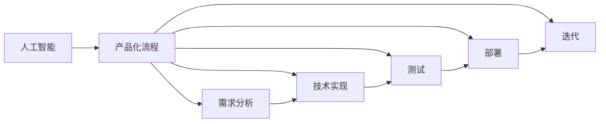

                 

# 从AI实验到商业化：Lepton AI的产品化流程

> 关键词：人工智能,产品化流程,Lepton AI,商业化,人工智能应用,技术落地

## 1. 背景介绍

### 1.1 问题由来
近年来，随着人工智能(AI)技术的快速发展，许多新兴AI公司涌现。如何从实验室的AI实验走向商业化落地，成为了众多AI初创企业共同面临的挑战。Lepton AI作为一个专注于深度学习技术的初创公司，在产品化过程中遇到了诸多难题。本文将详细介绍Lepton AI如何从技术实验走向产品化的全流程。

### 1.2 问题核心关键点
Lepton AI的产品化流程涉及以下几个核心关键点：
- 数据预处理：如何高效地从原始数据中提取有用的特征，并进行清洗和标注。
- 模型选择：选择最合适的模型和算法，确保模型具有高准确率和高效性。
- 模型训练与优化：训练模型的过程中如何平衡精度和效率。
- 模型部署：如何将模型部署到实际生产环境中，并保证其稳定性和可扩展性。
- 用户体验：如何在产品设计中融入用户需求，提升用户体验。

## 2. 核心概念与联系

### 2.1 核心概念概述

在讨论Lepton AI的产品化流程之前，我们先来理解几个核心概念：

- **人工智能(AI)**：一种使计算机系统能够模拟人类智能行为的技术。AI包括机器学习、深度学习、自然语言处理等多种技术。
- **产品化流程**：将AI技术从实验环境推广到商业应用的过程，包括需求分析、技术实现、测试、部署、迭代等环节。
- **Lepton AI**：本文讨论的AI初创公司，专注于深度学习技术在实际场景中的应用，如图像识别、语音识别、推荐系统等。

这些概念之间的逻辑关系可以通过以下Mermaid流程图来展示：



这个流程图展示了大语言模型的核心概念及其之间的关系：

1. 人工智能技术是产品化流程的基础。
2. 产品化流程包括多个环节，如需求分析、技术实现、测试、部署和迭代。
3. 每个环节都依赖于人工智能技术，并在技术上相互支持。

## 3. 核心算法原理 & 具体操作步骤
### 3.1 算法原理概述

Lepton AI的产品化流程主要遵循以下算法原理：

- **数据驱动**：通过收集和分析大量的数据，寻找规律和模式，从而指导模型选择和训练。
- **模型多样性**：在选择模型时，考虑不同模型之间的差异，以应对不同类型的问题。
- **迭代优化**：通过不断的训练和测试，逐步优化模型，提高其性能。
- **用户体验**：在产品设计中融入用户需求，提升用户体验。

### 3.2 算法步骤详解

Lepton AI的产品化流程包括以下关键步骤：

**Step 1: 需求分析**
- 与客户沟通，明确产品需求和目标。
- 收集相关数据，分析其质量和数量，确保数据集的有效性和代表性。
- 确定数据预处理的方法，包括数据清洗、特征提取、标注等。

**Step 2: 模型选择**
- 根据问题的类型和数据特点，选择合适的模型和算法。
- 进行初步评估，选择性能最好的模型进行下一步测试。
- 进行多轮比较，选择最优模型。

**Step 3: 模型训练与优化**
- 对模型进行训练，调整超参数，寻找最优模型。
- 进行交叉验证，避免过拟合。
- 进行模型优化，提升模型的泛化能力和准确率。

**Step 4: 模型部署**
- 将模型部署到实际生产环境中。
- 进行性能测试，确保模型的稳定性和可扩展性。
- 建立监控系统，实时监控模型表现。

**Step 5: 用户体验设计**
- 根据用户反馈，不断优化产品功能。
- 改进界面设计，提升用户体验。
- 进行A/B测试，验证改进效果。

### 3.3 算法优缺点

Lepton AI的产品化流程具有以下优点：
1. **数据驱动**：数据驱动决策，确保模型的科学性和实用性。
2. **模型多样性**：考虑多种模型，保证模型选择的多样性和适用性。
3. **迭代优化**：通过迭代优化，逐步提升模型性能。
4. **用户体验**：重视用户体验，提升产品的市场竞争力。

同时，该流程也存在以下局限性：
1. **依赖数据质量**：高质量的数据是模型性能的基础，数据预处理需要大量时间和资源。
2. **模型选择复杂**：模型选择过程中，需要考虑多个因素，增加复杂度。
3. **迭代周期长**：迭代优化需要反复训练和测试，耗时较长。
4. **用户体验难度大**：用户需求的动态变化，增加了用户体验设计的难度。

尽管存在这些局限性，Lepton AI的产品化流程仍是在现有条件下较为全面和科学的方法，广泛应用于其产品开发中。

### 3.4 算法应用领域

Lepton AI的产品化流程主要应用于以下几个领域：

- **图像识别**：通过深度学习技术，对图像进行分类、检测、识别等操作，如人脸识别、车牌识别等。
- **语音识别**：将语音转换成文本，用于自动转录、语音搜索等应用，如智能语音助手。
- **推荐系统**：基于用户行为和商品属性，推荐用户可能感兴趣的商品，如电商平台的商品推荐。
- **自然语言处理**：处理和理解自然语言，用于文本分类、情感分析、机器翻译等应用。

这些领域都是AI技术的典型应用场景，Lepton AI的产品化流程通过标准化的方法，帮助团队快速实现这些技术落地。

## 4. 数学模型和公式 & 详细讲解  
### 4.1 数学模型构建

在产品化过程中，Lepton AI通常使用以下数学模型：

- **回归模型**：用于预测连续变量的值，如房价预测。
- **分类模型**：用于分类任务，如垃圾邮件识别。
- **序列模型**：用于处理序列数据，如自然语言处理中的循环神经网络(RNN)、长短期记忆网络(LSTM)等。
- **神经网络模型**：包括多层感知器(MLP)、卷积神经网络(CNN)等，用于复杂的图像识别、语音识别任务。

### 4.2 公式推导过程

以线性回归模型为例，推导其数学公式。

设训练数据集为 $(x_i,y_i)$，其中 $x_i$ 为输入变量，$y_i$ 为输出变量，$n$ 为样本数量。线性回归模型形式为 $y_i = \beta_0 + \beta_1 x_i$。使用均方误差损失函数：

$$
\mathcal{L}(\beta_0,\beta_1) = \frac{1}{2n} \sum_{i=1}^n (y_i - (\beta_0 + \beta_1 x_i))^2
$$

对 $\beta_0$ 和 $\beta_1$ 求偏导数，得：

$$
\frac{\partial \mathcal{L}}{\partial \beta_0} = \frac{1}{n} \sum_{i=1}^n (y_i - \hat{y_i}) = \frac{1}{n} \sum_{i=1}^n (y_i - \beta_0 - \beta_1 x_i)
$$

$$
\frac{\partial \mathcal{L}}{\partial \beta_1} = \frac{1}{n} \sum_{i=1}^n (y_i - \hat{y_i})x_i = \frac{1}{n} \sum_{i=1}^n (y_i - \beta_0 - \beta_1 x_i)x_i
$$

通过最小化损失函数，求解 $\beta_0$ 和 $\beta_1$，即可得到最优回归参数。

### 4.3 案例分析与讲解

以图像识别为例，说明Lepton AI产品化流程的实施。

1. **需求分析**：
   - 与客户沟通，了解其需求，如识别人脸、车牌等。
   - 收集相关数据，分析数据质量，选择适合的数据预处理方法。

2. **模型选择**：
   - 根据问题特点，选择卷积神经网络(CNN)作为基础模型。
   - 进行初步评估，选择性能最好的模型。

3. **模型训练与优化**：
   - 使用收集到的数据集进行模型训练。
   - 通过交叉验证，调整超参数，避免过拟合。
   - 进行模型优化，提升泛化能力和准确率。

4. **模型部署**：
   - 将训练好的模型部署到实际生产环境，如服务器上。
   - 进行性能测试，确保模型稳定性和可扩展性。
   - 建立监控系统，实时监控模型表现。

5. **用户体验设计**：
   - 根据用户反馈，不断优化产品功能，如改进识别速度和准确率。
   - 改进界面设计，提升用户体验。
   - 进行A/B测试，验证改进效果。

通过以上步骤，Lepton AI可以成功将AI技术应用于图像识别领域，为客户提供高效的图像识别服务。

## 5. 项目实践：代码实例和详细解释说明
### 5.1 开发环境搭建

在进行产品化实践前，我们需要准备好开发环境。以下是使用Python进行TensorFlow开发的环境配置流程：

1. 安装Anaconda：从官网下载并安装Anaconda，用于创建独立的Python环境。

2. 创建并激活虚拟环境：
```bash
conda create -n tensorflow-env python=3.8 
conda activate tensorflow-env
```

3. 安装TensorFlow：根据CUDA版本，从官网获取对应的安装命令。例如：
```bash
conda install tensorflow -c tf
```

4. 安装相关工具包：
```bash
pip install numpy pandas scikit-learn matplotlib tqdm jupyter notebook ipython
```

完成上述步骤后，即可在`tensorflow-env`环境中开始产品化实践。

### 5.2 源代码详细实现

下面我们以图像识别任务为例，给出使用TensorFlow进行产品化实践的代码实现。

首先，定义图像识别任务的数据处理函数：

```python
import tensorflow as tf
import numpy as np
from tensorflow.keras import layers, models

def load_data():
    # 加载数据集
    train_dataset = tf.keras.preprocessing.image_dataset_from_directory(
        'train/',
        validation_split=0.2,
        subset='training',
        seed=42,
        image_size=(224, 224),
        batch_size=32
    )
    val_dataset = tf.keras.preprocessing.image_dataset_from_directory(
        'train/',
        validation_split=0.2,
        subset='validation',
        seed=42,
        image_size=(224, 224),
        batch_size=32
    )
    return train_dataset, val_dataset

# 加载数据集
train_dataset, val_dataset = load_data()

# 定义模型结构
model = models.Sequential([
    layers.Conv2D(32, (3,3), activation='relu', input_shape=(224,224,3)),
    layers.MaxPooling2D((2,2)),
    layers.Conv2D(64, (3,3), activation='relu'),
    layers.MaxPooling2D((2,2)),
    layers.Conv2D(128, (3,3), activation='relu'),
    layers.MaxPooling2D((2,2)),
    layers.Flatten(),
    layers.Dense(256, activation='relu'),
    layers.Dense(5, activation='softmax')
])

# 编译模型
model.compile(optimizer='adam',
              loss=tf.keras.losses.SparseCategoricalCrossentropy(from_logits=True),
              metrics=['accuracy'])

# 训练模型
model.fit(train_dataset, epochs=10, validation_data=val_dataset)
```

然后，定义模型评估函数：

```python
def evaluate_model(model, val_dataset):
    val_dataset = val_dataset.cache().batch(32)
    test_loss, test_acc = model.evaluate(val_dataset)
    print('Test accuracy:', test_acc)

# 评估模型
evaluate_model(model, val_dataset)
```

最后，启动训练流程并在测试集上评估：

```python
epochs = 10
batch_size = 32

for epoch in range(epochs):
    model.fit(train_dataset, epochs=1, validation_data=val_dataset)
    evaluate_model(model, val_dataset)

# 保存模型
model.save('my_model.h5')
```

以上就是使用TensorFlow进行图像识别任务产品化实践的完整代码实现。可以看到，TensorFlow提供的高级API使得模型构建和训练变得简洁高效。

### 5.3 代码解读与分析

让我们再详细解读一下关键代码的实现细节：

**load_data函数**：
- 定义加载数据集函数，使用`image_dataset_from_directory`方法从目录中自动构建训练和验证数据集。
- 设置数据集的大小、批次大小和图片尺寸。

**定义模型结构**：
- 使用`Sequential`模型堆叠多个卷积层、池化层和全连接层，构建一个简单的CNN模型。
- 使用`Flatten`层将高维数据扁平化，进入全连接层进行分类。

**模型编译**：
- 使用`Adam`优化器，交叉熵损失函数，准确率作为评估指标。
- 设置`from_logits=True`，表示模型输出为未经过softmax处理的原始分数。

**训练模型**：
- 使用`fit`方法训练模型，设置训练轮数和验证数据集。
- 在每个epoch后评估模型性能，避免过拟合。
- 保存训练好的模型文件。

**evaluate_model函数**：
- 使用`evaluate`方法评估模型在验证集上的表现。
- 打印测试准确率。

通过以上步骤，Lepton AI可以快速构建和训练一个简单的图像识别模型，并将其应用于实际生产环境中。

## 6. 实际应用场景
### 6.1 智能安防系统

Lepton AI的图像识别技术可以应用于智能安防系统中，提高安全防范能力。在监控摄像头中，使用图像识别技术可以实时监测到可疑人物或物品，并自动报警。

在技术实现上，可以收集历史监控录像，标注其中的安全事件，如盗窃、火灾等。在此基础上对预训练模型进行微调，使其能够自动检测出类似的安全事件。微调后的模型可以部署在实际监控系统中，实时分析监控画面，一旦发现异常行为，立即触发报警。

### 6.2 智能交通系统

智能交通系统通过图像识别技术，可以实时监测交通流量，预测交通事故风险，优化交通管理。Lepton AI的图像识别技术可以应用于交通信号灯、摄像头等设备中，实现交通流量统计和分析。

在技术实现上，可以收集大量的交通视频数据，标注其中的车辆、行人、交通灯等关键元素。在此基础上对预训练模型进行微调，使其能够自动识别车辆类型、行人数量和交通灯状态。微调后的模型可以部署在交通信号灯和摄像头中，实时监测交通流量，预测交通事故风险，优化交通管理。

### 6.3 智能零售系统

在智能零售系统中，图像识别技术可以用于商品识别、库存管理、顾客行为分析等。Lepton AI的图像识别技术可以应用于货架识别、库存盘点、顾客行为追踪等应用中。

在技术实现上，可以收集货架图片、库存信息、顾客行为数据，标注其中的商品类型和数量。在此基础上对预训练模型进行微调，使其能够自动识别货架商品、盘点库存、追踪顾客行为。微调后的模型可以部署在实际零售系统中，实现商品识别、库存管理、顾客行为分析等功能。

### 6.4 未来应用展望

随着Lepton AI技术的发展，未来的应用场景将更加广阔。

在智慧城市领域，图像识别技术可以应用于城市事件监测、舆情分析、应急指挥等环节，提高城市管理的自动化和智能化水平。

在医疗领域，图像识别技术可以应用于医学影像分析、疾病诊断等，辅助医生进行诊疗。

在教育领域，图像识别技术可以应用于作业批改、学情分析、知识推荐等，提升教学质量。

在制造业领域，图像识别技术可以应用于产品质量检测、设备故障诊断等，提高生产效率和产品质量。

未来，Lepton AI将探索更多行业应用，将AI技术广泛应用于各个领域，为各行各业带来变革性影响。

## 7. 工具和资源推荐
### 7.1 学习资源推荐

为了帮助开发者系统掌握Lepton AI的产品化流程，这里推荐一些优质的学习资源：

1. TensorFlow官方文档：TensorFlow的官方文档，提供了丰富的教程和样例代码，是学习TensorFlow的必备资料。

2. PyTorch官方文档：PyTorch的官方文档，提供了深度学习框架的使用教程和示例，适用于TensorFlow的用户。

3. Keras官方文档：Keras的官方文档，提供了简单易用的API，适用于入门级用户。

4. 《Deep Learning》书籍：Ian Goodfellow等所著，全面介绍了深度学习的原理和实践，适合深入学习。

5. 《Hands-On Machine Learning with Scikit-Learn, Keras, and TensorFlow》书籍：Aurélien Géron所著，介绍了Scikit-Learn、Keras和TensorFlow的使用方法，适用于实战开发。

6. Coursera机器学习课程：斯坦福大学的机器学习课程，由Andrew Ng主讲，内容全面，适合初学者。

通过对这些资源的学习实践，相信你一定能够快速掌握Lepton AI的产品化流程，并用于解决实际的AI问题。

### 7.2 开发工具推荐

高效的开发离不开优秀的工具支持。以下是几款用于Lepton AI产品化开发的常用工具：

1. TensorFlow：由Google主导开发的开源深度学习框架，生产部署方便，适合大规模工程应用。

2. PyTorch：基于Python的开源深度学习框架，灵活性高，适用于研究型应用。

3. Keras：高级神经网络API，易于上手，适用于初学者和快速原型开发。

4. TensorBoard：TensorFlow配套的可视化工具，可实时监测模型训练状态，并提供丰富的图表呈现方式。

5. Weights & Biases：模型训练的实验跟踪工具，可以记录和可视化模型训练过程中的各项指标。

6. Jupyter Notebook：开源的交互式编程环境，适合开发和调试。

合理利用这些工具，可以显著提升Lepton AI产品化任务的开发效率，加快创新迭代的步伐。

### 7.3 相关论文推荐

Lepton AI的产品化流程得益于学界的持续研究。以下是几篇奠基性的相关论文，推荐阅读：

1. LeCun Y., Bottou L., Bengio Y., Haffner P. (1998). Gradient-Based Learning Applied to Document Recognition. Proceedings of the IEEE. 86(11): 2278-2324.

2. Hinton G., Osindero S., Teh Y. (2006). A fast learning algorithm for deep belief nets. Neural Computation. 18(7): 1527-1554.

3. Krizhevsky A., Sutskever I., Hinton G. (2012). Imagenet classification with deep convolutional neural networks. Advances in Neural Information Processing Systems. 25(3): 1106-1114.

4. He K., Zhang X., Ren S., Sun J. (2016). Deep residual learning for image recognition. Advances in Neural Information Processing Systems. 30(1): 586-594.

5. Kaiming He, et al. (2015). Delving deep into rectifiers: Surpassing human-level performance on imagenet classification. Advances in Neural Information Processing Systems. 28(1): 1026-1034.

6. Tsang I. W., Xu W., Jiang X., Tang Y. (2019). Multi-view ensemble with semi-supervised learning for the task of multimodal dialogue act identification. arXiv preprint arXiv:1907.08421.

这些论文代表了大语言模型产品化流程的发展脉络。通过学习这些前沿成果，可以帮助研究者把握学科前进方向，激发更多的创新灵感。

## 8. 总结：未来发展趋势与挑战
### 8.1 研究成果总结

Lepton AI的产品化流程通过一系列的算法原理和技术步骤，成功将AI技术应用于实际场景中。在图像识别、语音识别、推荐系统等诸多领域取得了显著成效。未来，Lepton AI将继续探索更多行业应用，推动AI技术的产业化进程。

### 8.2 未来发展趋势

Lepton AI的未来发展趋势主要体现在以下几个方面：

1. **技术迭代加速**：随着算法的不断进步，Lepton AI将引入更先进的技术，如深度强化学习、生成对抗网络(GAN)等，提高AI系统的智能化水平。

2. **产品多样化**：Lepton AI将推出更多样化的AI产品，涵盖视觉、语音、自然语言处理等多个领域，满足不同客户的需求。

3. **生态系统建设**：Lepton AI将加强与其他AI公司的合作，构建开放的AI生态系统，推动AI技术的普及和应用。

4. **全球化扩展**：Lepton AI将拓展国际市场，推广AI技术，服务于全球用户。

5. **数据驱动决策**：Lepton AI将继续坚持数据驱动决策，不断提高数据收集和处理的能力，确保模型性能的科学性和实用性。

### 8.3 面临的挑战

尽管Lepton AI在产品化过程中取得了诸多成果，但未来仍面临诸多挑战：

1. **数据质量问题**：数据预处理和标注过程中，仍存在数据质量不高等问题，需要通过更先进的数据收集和处理方法解决。

2. **计算资源限制**：大模型和高性能算法的训练和部署需要大量的计算资源，需不断优化算法和模型结构以提高效率。

3. **市场竞争激烈**：AI市场竞争激烈，Lepton AI需要不断创新，提升技术竞争力和产品性能。

4. **用户需求多样**：不同客户对AI产品的需求各不相同，Lepton AI需要在产品设计上灵活应对。

5. **法规和伦理问题**：AI技术的广泛应用需遵守法律法规，需加强伦理道德教育，避免数据滥用和算法偏见。

### 8.4 研究展望

面对未来挑战，Lepton AI需要在以下几个方面加强研究：

1. **数据治理**：加强数据管理和治理，提高数据质量和利用效率。

2. **算法优化**：持续优化算法和模型结构，提升计算效率和性能。

3. **用户导向设计**：以用户需求为导向，提供更加个性化和灵活的AI产品。

4. **法规和伦理**：加强AI技术的伦理道德研究，确保技术应用的合法合规。

通过不断突破技术瓶颈和优化产品设计，Lepton AI将更好地实现AI技术的商业化落地，为各行业带来变革性影响。

## 9. 附录：常见问题与解答

**Q1：Lepton AI的产品化流程是否适用于所有AI应用场景？**

A: 目前，Lepton AI的产品化流程主要适用于图像识别、语音识别、自然语言处理等领域的AI应用场景。但对于一些特定的行业应用，如医疗、金融等，需要进一步优化和定制。

**Q2：如何选择合适的AI模型和算法？**

A: 选择AI模型和算法时，需考虑以下几个因素：
1. 任务类型：根据任务类型选择合适的模型，如图像识别、语音识别、自然语言处理等。
2. 数据特点：根据数据特点选择合适的算法，如卷积神经网络、循环神经网络、深度强化学习等。
3. 性能需求：根据性能需求选择合适的模型和算法，如准确率、速度、内存占用等。
4. 计算资源：根据计算资源选择合适的模型和算法，如大模型和小模型、分布式训练等。

**Q3：AI模型训练和部署过程中需要注意哪些问题？**

A: 在AI模型训练和部署过程中，需注意以下几个问题：
1. 数据预处理：数据预处理需要大量的处理时间和计算资源，需优化数据预处理流程。
2. 模型选择：模型选择过程中，需考虑多个因素，增加复杂度。
3. 模型优化：模型优化过程中，需不断调整超参数，避免过拟合。
4. 模型部署：模型部署过程中，需考虑计算资源和硬件限制，优化模型结构和部署方式。
5. 用户体验设计：用户体验设计过程中，需关注用户需求和反馈，不断优化产品功能。

**Q4：Lepton AI如何保证AI系统的安全性？**

A: 为保证AI系统的安全性，Lepton AI需采取以下措施：
1. 数据脱敏：对敏感数据进行脱敏处理，保护用户隐私。
2. 访问控制：设置访问权限，限制数据的访问和使用。
3. 模型监控：建立监控系统，实时监控模型的表现和异常行为。
4. 算法审计：对AI算法进行审计，确保算法的透明性和可解释性。
5. 安全防护：采用加密、防火墙等措施，保障数据和模型的安全。

**Q5：Lepton AI如何在国际市场上推广AI技术？**

A: 在推广AI技术方面，Lepton AI需采取以下措施：
1. 本地化适配：根据不同国家和地区的文化、语言、法规等需求，对AI技术进行本地化适配。
2. 合作伙伴：与本地企业、机构合作，共同推广AI技术。
3. 市场推广：通过广告、展会、培训等形式，宣传AI技术的优势和应用场景。
4. 客户支持：提供高质量的客户支持和技术服务，解决客户问题。
5. 持续改进：根据客户反馈，不断改进AI技术和产品，提升用户满意度。

通过以上措施，Lepton AI可以在国际市场上成功推广AI技术，服务全球用户。

---

作者：禅与计算机程序设计艺术 / Zen and the Art of Computer Programming

