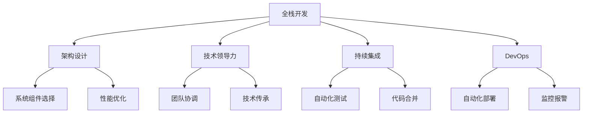

                 

# 从全栈开发到企业级架构师的进阶之路

> 关键词：全栈开发, 架构设计, 软件工程, 企业级系统, 技术领导力, 持续集成, DevOps

## 1. 背景介绍

### 1.1 问题由来
随着互联网和信息技术的迅猛发展，软件开发行业正经历着深刻的变革。对于一名全栈开发者来说，如何在快速变化的技术环境中保持竞争力，逐步成长为一名企业级架构师，成为了许多人的共同困惑。本文将从全栈开发的基本技能出发，逐步深入探讨架构设计、技术领导力、持续集成与DevOps等核心内容，旨在为全栈开发者的进阶之路提供系统性的指导。

### 1.2 问题核心关键点
全栈开发转变为企业级架构师的进阶之路，主要涉及以下几个核心关键点：
- 技术栈的全面升级：从前端、后端到数据库，实现全栈技术的全面掌握。
- 架构设计的深刻理解：从单体应用到微服务架构，掌握复杂系统设计理念。
- 技术领导力的提升：从技术贡献到团队管理，提升技术领导力和战略视野。
- 持续集成的实践应用：从手动集成到自动化流程，提高软件开发效率。
- DevOps的深度融合：从孤立开发到高效协作，构建高效的软件交付体系。

本文将系统梳理全栈开发进阶为架构师需要掌握的关键技能和经验，希望通过本指南，帮助全栈开发者实现职业生涯的转型和突破。

## 2. 核心概念与联系

### 2.1 核心概念概述

为更好地理解全栈开发者的进阶之路，本节将介绍几个密切相关的核心概念：

- 全栈开发(Full-stack Development)：指一个开发者需要掌握前端和后端的所有技术栈，以实现从用户界面到数据存储的全流程开发。
- 架构设计(Architecture Design)：指在系统设计阶段，根据业务需求和性能要求，选择合适的技术方案和组件，构建稳定、高效、可扩展的系统结构。
- 技术领导力(Technical Leadership)：指从技术贡献者到团队领导者的角色转变，具备带领团队实现技术目标的能力。
- 持续集成(Continuous Integration, CI)：指在软件开发过程中，通过自动化的集成和测试，确保代码的稳定性与一致性，减少人为错误。
- DevOps(Development and Operations)：指开发与运维的结合，通过自动化工具链和持续交付，提高软件交付效率，提升系统可用性。

这些核心概念之间的逻辑关系可以通过以下Mermaid流程图来展示：



这个流程图展示了他栈开发进阶为架构师的过程：

1. 全栈开发掌握基础技术。
2. 学习架构设计理论，了解复杂系统构建。
3. 提升技术领导力，实现从个人贡献到团队管理。
4. 实践持续集成，提高软件开发效率。
5. 深度融合DevOps，构建高效交付体系。

## 3. 核心算法原理 & 具体操作步骤
### 3.1 算法原理概述

全栈开发转变为架构师的过程，本质上是一个从个人技能提升到系统设计能力提升的过程。这一过程不仅需要掌握更广泛的技术栈，还需要深入理解架构设计原则和设计模式。

核心算法原理包括：

- 面向对象设计原则（OOD）：封装、继承、多态等面向对象的设计理念。
- 设计模式：如工厂模式、观察者模式、单例模式等，解决特定问题。
- 微服务架构：通过服务拆分和分布式部署，提升系统可扩展性和可用性。
- 容器化技术：通过Docker、Kubernetes等容器技术，实现代码和环境的快速迁移。
- DevOps流水线：通过Jenkins、GitLab CI等工具，构建自动化测试和部署流程。

### 3.2 算法步骤详解

1. **学习基础架构设计**：
   - 掌握架构设计的基本原则和模式，理解不同架构风格的优缺点。
   - 研究经典架构案例，如单体应用、微服务、服务网格等。
   - 熟悉常用的开源架构框架和组件，如Spring、Kubernetes、Docker等。

2. **参与复杂系统构建**：
   - 加入项目团队，承担架构设计任务，参与系统架构的规划和实现。
   - 与产品、运维团队沟通需求，平衡性能和可用性，优化系统设计。
   - 编写架构文档，记录设计决策和技术选型，便于团队协作。

3. **提升技术领导力**：
   - 参加项目管理培训，掌握项目管理的工具和方法。
   - 学会团队协作，推动技术决策和团队协同工作。
   - 定期进行技术分享，提升团队的技术能力和协作效率。

4. **实践持续集成与DevOps**：
   - 使用Git和GitHub/GitLab等版本控制工具，管理代码库和版本。
   - 引入自动化测试，编写单元测试、集成测试和端到端测试。
   - 使用CI/CD工具，构建自动化集成和部署流程，减少手动操作。

5. **构建高效交付体系**：
   - 引入持续交付理念，建立持续集成和持续交付的自动化流水线。
   - 优化部署流程，实现环境快速迁移和自动化回滚。
   - 监控系统性能，使用ELK、Prometheus等工具收集和分析监控数据。

### 3.3 算法优缺点

全栈开发转变为架构师的过程，具有以下优点：

- 全面掌握技术栈，具备跨领域的综合能力。
- 具备系统设计思维，能够应对复杂的技术挑战。
- 提升团队管理能力，推动技术创新和团队协作。

同时，该过程也存在一些局限：

- 需要投入大量时间和精力进行学习。
- 架构设计需要理论结合实践，存在一定的门槛。
- 持续集成和DevOps需要持续优化和维护。

## 4. 数学模型和公式 & 详细讲解 & 举例说明（备注：数学公式请使用latex格式，latex嵌入文中独立段落使用 $$，段落内使用 $)
### 4.1 数学模型构建

基于全栈开发进阶为架构师的过程，可以构建一个如下的数学模型：

设 $D$ 为开发者当前掌握的技术栈集，$A$ 为架构设计所需的技能集，$L$ 为领导力相关技能集，$C$ 为持续集成和DevOps技能集。则模型可表示为：

$$
\begin{aligned}
&\text{目标函数} = \min_{D, A, L, C} \text{时间成本} + \text{学习成本} + \text{协作成本} \\
&\text{约束条件} = \begin{cases}
D \subset A + L + C \\
A + L + C \subset \text{全栈技术栈}
\end{cases}
\end{aligned}
$$

其中，目标函数表示在满足约束条件下，开发者技能提升的总成本。约束条件表示开发者当前的技术栈必须覆盖架构设计、领导力和DevOps所需的技能，且这些技能能够被整合到全栈开发实践中。

### 4.2 公式推导过程

为了简化模型，假设开发者当前已掌握全栈开发基础技能，设 $D_0$ 为已掌握技能，$D_A, D_L, D_C$ 分别为需要新增的架构、领导力和DevOps技能。

目标函数可表示为：

$$
\begin{aligned}
&\text{目标函数} = |D_0 - D_A| + |D_0 - D_L| + |D_0 - D_C| \\
&\text{约束条件} = \begin{cases}
D_A \cap D_L \cap D_C \subset D \\
D_A + D_L + D_C \subset D
\end{cases}
\end{aligned}
$$

通过上述推导，可以看出，开发者需要不断学习新的技能，并整合到现有技术栈中，才能逐步实现进阶为架构师的目标。

### 4.3 案例分析与讲解

**案例一：从单体应用到微服务架构**

某电商网站初始采用单体架构，随着业务规模增长，系统逐渐变得复杂难以维护。为了提升系统的可扩展性和可用性，团队决定进行架构重构，将其拆分为多个微服务。

1. **技术栈整合**：
   - 将单体应用的基础设施（如数据库、缓存、消息队列）抽象为独立的微服务。
   - 引入Docker容器和Kubernetes集群，实现服务的快速部署和自动扩展。
   - 使用Spring Cloud Eureka、Zuul等组件，实现服务的发现和路由。

2. **架构设计优化**：
   - 引入分布式事务管理，保证服务的原子性和一致性。
   - 采用限流、熔断、重试等技术，增强系统的容错和稳定性。
   - 使用Prometheus和Grafana等工具，实时监控系统性能和健康状态。

3. **DevOps实践**：
   - 使用Jenkins Pipeline构建自动化集成和部署流水线。
   - 引入Kubernetes RBAC和IAM，增强系统的安全和访问控制。
   - 使用Docker Compose和Terraform等工具，管理环境和基础设施。

**案例二：从手动集成到持续交付**

某金融公司项目采用传统的CI/CD流程，每轮迭代手动部署，耗费大量时间和人力。为了提升开发效率，公司决定引入持续交付流程。

1. **自动化集成**：
   - 使用GitLab CI和Jenkins Pipeline，实现自动化集成和构建。
   - 编写测试用例，确保每次提交代码后，能自动执行单元测试和集成测试。
   - 集成静态代码分析工具，如SonarQube，提前发现代码问题。

2. **自动化部署**：
   - 引入Jenkins和Kubernetes，实现自动化部署和回滚。
   - 编写部署脚本，自动配置环境变量和数据库连接。
   - 使用Helm包管理工具，打包和部署Kubernetes应用。

3. **监控报警**：
   - 集成ELK Stack，实时收集和分析日志数据。
   - 使用Prometheus和Grafana，监控系统性能和资源使用情况。
   - 设置报警规则，及时发现和解决系统故障。

## 5. 项目实践：代码实例和详细解释说明
### 5.1 开发环境搭建

在进行架构设计实践前，我们需要准备好开发环境。以下是使用Docker和Kubernetes进行企业级系统开发的配置流程：

1. 安装Docker：从官网下载并安装Docker，创建本地镜像库。

2. 安装Kubernetes：从官网下载并安装Kubernetes，创建集群并设置Node。

3. 创建命名空间（Namespace）：
```kubeconfig
apiVersion: v1
```

4. 配置Kubernetes RBAC（Role-Based Access Control）：
```kubeconfig
apiVersion: v1
```

5. 创建Kubernetes Service：
```kubeconfig
apiVersion: v1
```

6. 创建Kubernetes Deployment：
```kubeconfig
apiVersion: v1
```

完成上述步骤后，即可在Docker和Kubernetes环境中开始架构设计实践。

### 5.2 源代码详细实现

下面我们以微服务架构为例，给出使用Docker和Kubernetes进行系统微服务化开发的代码实现。

首先，定义微服务模块的Docker镜像：

```dockerfile
# 使用Python 3.8环境
FROM python:3.8-slim

# 安装依赖
RUN apt-get update && apt-get install -y \
    python3-pip \
    nginx \
    supervisor \
    unzip \
    curl \
    && rm -rf /var/lib/apt/lists/*

# 安装微服务模块
COPY . /app
WORKDIR /app
RUN pip3 install -r requirements.txt

# 定义Nginx反向代理规则
COPY nginx.conf /etc/nginx/nginx.conf
```

然后，编写Kubernetes Deployment和Service的定义文件：

```yaml
apiVersion: v1

apiVersion: v1
kind: Deployment
metadata:
  name: my-service
  labels:
    app: my-service
spec:
  replicas: 3
  selector:
    matchLabels:
      app: my-service
  template:
    metadata:
      labels:
        app: my-service
    spec:
      containers:
      - name: my-service
        image: my-service:1.0
        ports:
        - containerPort: 8080
---
apiVersion: v1
kind: Service
metadata:
  name: my-service
  labels:
    app: my-service
spec:
  selector:
    app: my-service
  ports:
    - protocol: TCP
      port: 80
      targetPort: 8080
```

最后，启动微服务模块的Docker镜像，并设置Kubernetes的Deployment和Service：

```kubectl
kubectl create deployment my-service --image=my-service:1.0 --replicas=3
kubectl expose deployment my-service --name=my-service --port=8080 --target-port=8080
```

### 5.3 代码解读与分析

让我们再详细解读一下关键代码的实现细节：

**Dockerfile**：
- 使用Python 3.8基础镜像，安装依赖和微服务模块。
- 定义Nginx反向代理规则，将服务流量转发至内部应用。

**Kubernetes Deployment和Service的定义**：
- 定义Deployment，创建3个相同的服务副本，并设置标签。
- 定义Service，选择与Deployment匹配的Pod，并设置服务端口。

**Docker镜像启动与Kubernetes配置**：
- 使用`kubectl`命令创建Docker镜像和Service。
- 通过Service的配置，将服务流量代理至内部的微服务模块。

通过上述代码，可以看到Docker和Kubernetes的微服务架构实践，实现了一个简单而高效的服务部署和负载均衡。

## 6. 实际应用场景
### 6.1 智慧金融系统

基于Docker和Kubernetes的微服务架构，智慧金融系统可以实现高效、稳定、可扩展的金融服务。

在技术实现上，可以将金融服务模块化，如账户管理、交易结算、风险控制等，每个模块单独部署，通过API进行交互。微服务架构的部署方式，可以快速响应市场变化，提升系统的弹性和可用性。

### 6.2 智能医疗平台

通过微服务架构和DevOps实践，智能医疗平台可以实现高效、可靠、安全的医疗服务。

在技术实现上，可以将医疗服务分解为患者管理、电子病历、诊疗支持等多个模块。每个模块独立部署，通过微服务调用进行协同工作。结合DevOps实践，可以实现持续集成和持续交付，提升系统开发效率和用户体验。

### 6.3 电子商务平台

电子商务平台可以通过微服务架构和Docker容器，实现快速、灵活、可扩展的电商服务。

在技术实现上，可以将电商服务模块化，如商品管理、订单处理、物流配送等，每个模块单独部署，通过API进行交互。结合Docker容器和Kubernetes集群，可以提升系统的可扩展性和容错性，适应电商业务的高并发需求。

### 6.4 未来应用展望

随着微服务架构和DevOps的不断演进，智慧金融、智能医疗、电子商务等应用场景将迎来更多的创新和突破。未来，基于微服务架构的系统将具备更高的可扩展性、可用性和容错性，满足更多行业领域的应用需求。

## 7. 工具和资源推荐
### 7.1 学习资源推荐

为了帮助开发者系统掌握全栈开发进阶为架构师所需的技术和理论，这里推荐一些优质的学习资源：

1. 《微服务架构设计》系列书籍：深入讲解微服务架构的设计和实现，包括服务拆分、分布式事务、监控报警等关键技术。
2. 《DevOps实践指南》书籍：全面介绍DevOps的实践方法和工具，包括CI/CD流水线、自动化测试、持续交付等。
3. Udemy和Coursera的微服务架构和DevOps课程：系统化学习微服务和DevOps的最新技术，结合实战项目进行实践。
4. 《深入浅出Docker》和《Kubernetes实战》书籍：深入理解Docker容器和Kubernetes集群的使用和部署。
5. AWS、Google Cloud、Microsoft Azure等云平台官方文档：了解云平台提供的微服务架构和DevOps工具，进行实战练习。

通过对这些资源的学习实践，相信你一定能够快速掌握全栈开发进阶为架构师所需的技能和经验，为未来的职业发展打下坚实的基础。

### 7.2 开发工具推荐

高效的开发离不开优秀的工具支持。以下是几款用于全栈开发和架构设计的常用工具：

1. Docker：开源的容器引擎，提供快速、轻量级的应用部署和迁移。
2. Kubernetes：开源的容器编排系统，实现自动化的服务部署和管理。
3. Jenkins：开源的持续集成工具，支持自动化测试和流水线构建。
4. GitLab：开源的CI/CD平台，提供代码托管和自动化部署功能。
5. Prometheus和Grafana：开源的监控和报警工具，实时监控系统性能和健康状态。

合理利用这些工具，可以显著提升全栈开发的效率和质量，加速架构设计的实践和部署。

### 7.3 相关论文推荐

全栈开发进阶为架构师的过程，源于学界的持续研究。以下是几篇奠基性的相关论文，推荐阅读：

1. "Microservices: A Service-Oriented Architecture for Cloud Computing"：介绍微服务架构的基本理念和设计原则。
2. "Continuous Delivery: Software Team Culture, Workflow, and Practices"：探讨持续交付的核心要素和实践方法。
3. "Containerization: A Foundation for Cloud-Native Applications"：深入讲解Docker容器和Kubernetes集群的使用。
4. "DevOps: The Programmer as the New Network Administrator"：分析DevOps的起源和重要性，探讨软件开发和运维的融合。
5. "A Survey of Key Techniques and Technologies for Cloud-Native Applications"：全面回顾云计算技术领域的最新进展和趋势。

这些论文代表了大栈开发进阶为架构师的研究脉络，通过学习这些前沿成果，可以帮助研究者把握学科前进方向，激发更多的创新灵感。

## 8. 总结：未来发展趋势与挑战
### 8.1 总结

本文对从全栈开发到企业级架构师的进阶之路进行了系统性的介绍。首先阐述了全栈开发者的基本技能和需要掌握的技术栈，明确了架构设计、技术领导力、持续集成和DevOps等关键技能。其次，从原理到实践，详细讲解了微服务架构和DevOps的数学模型和操作细节，给出了架构设计的完整代码实例。同时，本文还广泛探讨了架构设计在多个行业领域的应用前景，展示了全栈开发者进阶为架构师的广阔空间。

通过本文的系统梳理，可以看到，全栈开发者需要不断学习新的技术，整合到现有技术栈中，才能逐步实现进阶为架构师的目标。在掌握全栈技术的基础上，进一步理解和应用架构设计和DevOps的实践方法，才能构建高效、稳定、可扩展的系统。未来，随着微服务架构和DevOps的不断演进，全栈开发者的进阶之路将更加宽广，更多创新和突破将值得期待。

### 8.2 未来发展趋势

展望未来，全栈开发者进阶为架构师的过程，将呈现以下几个发展趋势：

1. 微服务架构的应用范围将进一步扩大。未来，微服务架构不仅适用于大规模的电商、金融等互联网应用，还将被广泛应用于传统行业的数字化转型，如制造业、医疗、教育等。

2. DevOps的自动化程度将不断提升。通过引入先进的自动化工具和持续交付流程，开发者将能更快速、高效地交付软件，提升系统的稳定性和可靠性。

3. 容器化技术将进一步普及。Docker和Kubernetes等容器技术将成为主流应用开发和部署的标准，实现快速、灵活的资源管理和扩展。

4. 持续集成和持续交付将成为常态。持续集成和持续交付将贯穿软件开发的全生命周期，从代码编写到系统部署，实现高效、自动化的交付。

5. 云平台和云计算技术将推动架构设计的创新。云平台提供的各种服务和工具，将为架构设计提供更多灵活和高效的选择。

### 8.3 面临的挑战

尽管全栈开发者进阶为架构师的过程充满希望，但仍面临诸多挑战：

1. 微服务架构的复杂性。微服务架构的引入，增加了系统设计的复杂性和维护成本，需要开发者具备更高的系统设计和架构优化能力。

2. 持续集成和持续交付的复杂配置。持续集成和持续交付的实施，需要集成多种自动化工具和配置，增加了系统的管理和维护难度。

3. DevOps文化的普及。DevOps理念的推广和实践，需要团队成员的共同努力，包括开发、运维、测试等角色的协同工作。

4. 学习曲线陡峭。全栈开发者需要掌握新的技术栈和设计理念，学习曲线较陡，需要持续投入时间和精力。

5. 工具和平台的依赖。架构设计依赖于各种开源工具和云平台，需要开发者熟悉各种工具的使用和配置。

6. 数据和模型的集成。架构设计需要整合多源数据和模型，数据一致性和融合问题需要进一步优化。

正视这些挑战，积极应对并寻求突破，将是全栈开发者进阶为架构师的重要前提。相信通过不断的实践和学习，全栈开发者将逐步提升架构设计和DevOps的能力，在技术和管理上不断突破，实现职业生涯的转型和突破。

### 8.4 研究展望

面对全栈开发者进阶为架构师所面临的挑战，未来的研究需要在以下几个方面寻求新的突破：

1. 探索微服务架构的最佳实践。通过案例分析和对比研究，总结微服务架构在不同场景下的应用经验和最佳实践，提供可操作的指导。

2. 研究DevOps的自动化工具链。开发更高效的自动化工具链，实现持续集成和持续交付的自动化，提升开发效率和系统稳定性。

3. 融合多源数据和模型。探索如何高效整合多源数据和模型，实现数据的融合和协同建模，提升系统的综合分析能力。

4. 引入智能运维技术。引入AI和大数据分析技术，实现智能运维，提高系统的自动诊断和故障恢复能力。

5. 推动跨部门协作。加强开发、运维、测试等角色的协作，建立跨部门的知识共享和协同工作机制，提高团队的凝聚力和战斗力。

6. 构建持续学习体系。建立持续学习的体系，鼓励团队成员不断学习新知识和新技术，提升团队的技术水平和创新能力。

这些研究方向的探索，将引领全栈开发者向架构师转型，为未来的职业发展提供更多的可能和机遇。面向未来，全栈开发者需要不断学习和实践，在技术和管理上不断突破，才能在竞争激烈的技术环境中占据优势，实现职业生涯的飞跃。

## 9. 附录：常见问题与解答

**Q1：全栈开发者如何提升自己的技术栈？**

A: 全栈开发者可以通过以下步骤提升自己的技术栈：
1. 学习新的编程语言和技术栈，如JavaScript、React、Node.js等。
2. 参与开源项目和社区活动，积累实战经验。
3. 阅读最新的技术书籍和博客，了解前沿技术和趋势。
4. 参加线上和线下的技术会议和培训，扩展视野和知识面。

**Q2：微服务架构的设计难点在哪里？**

A: 微服务架构的设计难点主要在于：
1. 服务拆分粒度的设计。需要根据业务场景和性能要求，合理划分服务边界，避免过细或过粗。
2. 跨服务调用的管理。需要设计高效、稳定的服务调用协议和通信机制。
3. 数据一致性和分布式事务的管理。需要考虑数据一致性和分布式事务的处理。
4. 监控和报警机制的设计。需要建立全面的监控和报警体系，及时发现和解决系统故障。
5. 系统部署和管理。需要实现自动化的部署和管理，提升系统的可扩展性和可靠性。

**Q3：如何构建持续集成和持续交付的流程？**

A: 构建持续集成和持续交付的流程，需要以下步骤：
1. 配置版本控制和代码托管系统，如Git和GitHub。
2. 引入自动化测试工具，如Jenkins、GitLab CI。
3. 编写CI/CD流水线，包括编译、测试、部署等步骤。
4. 设置自动化部署和回滚机制，确保系统的快速响应和恢复。
5. 监控系统性能和健康状态，及时发现和解决系统故障。

**Q4：DevOps的实践方法有哪些？**

A: DevOps的实践方法主要包括：
1. 自动化集成和测试。通过自动化工具链，实现持续集成和持续交付。
2. 持续监控和报警。使用Prometheus、ELK等工具，实时监控系统性能和健康状态。
3. 持续反馈和优化。通过持续收集用户反馈，不断优化系统和产品。
4. 跨部门协作和沟通。加强开发、运维、测试等角色的协作，提升团队效率和凝聚力。
5. 持续学习和改进。建立持续学习的体系，提升团队的技术水平和创新能力。

通过上述问题的解答，希望能帮助全栈开发者更好地理解进阶为架构师所需的技能和经验，为未来的职业发展提供指导和方向。希望每位全栈开发者都能不断学习和实践，逐步实现技术栈的全面升级和架构设计的深入理解，在未来的职业道路上不断突破和成长。

