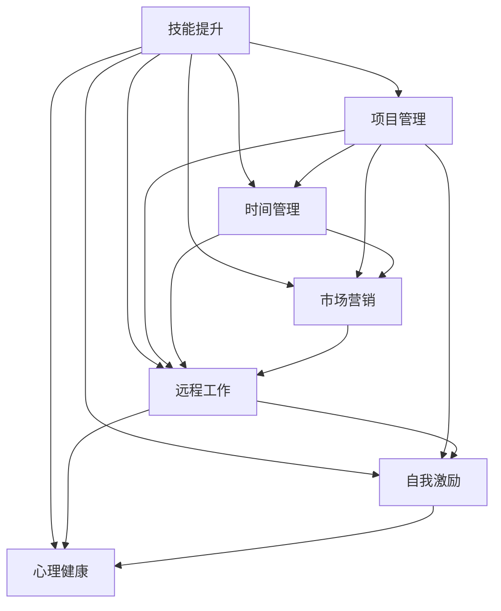

                 

# 从员工到自由职业者的转型指南

> 关键词：自由职业者,职业转型,技能提升,项目管理,时间管理,市场营销,远程工作,自我激励,心理健康

## 1. 背景介绍

### 1.1 问题由来
随着互联网和数字化进程的飞速发展，自由职业者这一概念正在逐渐成为主流。特别是在新冠疫情期间，远程工作和灵活就业模式得到了前所未有的普及。自由职业不再是一个遥不可及的职业选择，而是越来越多人开始考虑的现实选项。那么，如何成功转型为自由职业者，实现自我价值的最大化呢？本文将从核心概念与联系入手，探讨自由职业转型的关键要素和应对策略。

### 1.2 问题核心关键点
自由职业转型涉及多个核心概念，包括技能提升、项目管理、时间管理、市场营销、远程工作、自我激励和心理健康等。这些概念彼此交织，共同构成了一个复杂的系统工程。理解和应用这些关键点，可以更好地支持自由职业者成功转型和长期发展。

## 2. 核心概念与联系

### 2.1 核心概念概述

以下是自由职业转型过程中涉及的几个关键核心概念：

- **技能提升**：自由职业者需要掌握与所从事行业相关的专业技能，同时提高通用技能，如沟通、协作、项目管理等，以应对不同类型的工作任务。
- **项目管理**：有效管理项目是自由职业成功的关键。自由职业者需要具备时间管理、任务规划、进度跟踪等能力。
- **时间管理**：自由职业者在非正式的管理环境中，需要自我驱动，高效利用时间，合理分配工作与生活。
- **市场营销**：自由职业者必须学会如何自我推销，获取更多的项目和客户。
- **远程工作**：自由职业者多需远程工作，需要具备良好的自我管理和自律能力。
- **自我激励**：自由职业者往往需要面对不确定性和挑战，具备自我激励和心理调节能力至关重要。
- **心理健康**：自由职业带来的压力、孤独感和职业不确定性，对心理健康提出了更高要求。

这些概念之间的逻辑关系可以通过以下Mermaid流程图来展示：



这个流程图展示了这个复杂的自由职业转型系统中的核心概念及其之间的相互关系。

## 3. 核心算法原理 & 具体操作步骤

### 3.1 算法原理概述

自由职业转型的算法原理基于系统化的步骤，以目标导向的方式进行各个核心概念的提升和整合。目标是实现个人技能与职业目标的匹配，同时兼顾心理健康和可持续发展。

算法原理包括：

- **目标设定**：明确转型目标，如提升某项技能、获取更多客户、平衡工作与生活等。
- **技能评估**：识别自身技能差距，列出提升计划。
- **项目模拟**：通过实际项目模拟，练习和应用新技能。
- **反馈迭代**：定期收集反馈，调整和优化学习计划。

### 3.2 算法步骤详解

基于以上原理，自由职业转型可遵循以下步骤：

1. **目标设定**：确定转型目标和关键里程碑，如提升编程技能、获得10个新客户、每周工作40小时等。
2. **技能评估**：通过自我评估、同行反馈、在线测试等方法，识别自身技能的强项和弱点。
3. **学习计划**：根据评估结果，制定详细学习计划，包括学习资源、时间安排、评估指标等。
4. **项目实践**：选择适合的自由职业平台或个人项目，进行实战演练，获取实际工作经验。
5. **反馈迭代**：定期回顾学习计划和项目实践，收集反馈，及时调整策略。
6. **持续学习**：保持对新技能和行业动态的持续学习，跟上技术发展的步伐。

### 3.3 算法优缺点

自由职业转型算法的优点在于系统化和目标导向，便于量化进度和效果。但同时也存在一定的局限性：

- **复杂度高**：涉及多个核心概念，需要综合考虑，难以一步到位。
- **个体差异大**：每个人的情况不同，需要的重点和策略会有所不同。
- **适应性差**：外界环境变化快，需要不断调整和优化学习计划。

### 3.4 算法应用领域

自由职业转型算法不仅适用于IT、设计、写作等技术型自由职业者，同样适用于营销、咨询、培训等非技术领域的专业人士。不同领域的自由职业者可根据自身情况，选择相应的关键概念进行重点提升。

## 4. 数学模型和公式 & 详细讲解

### 4.1 数学模型构建

我们以项目管理的优先级排序模型为例，介绍如何通过数学模型和公式进行详细讲解。

假设有一个自由职业项目，包含多个子任务，每个子任务的重要性和紧急程度可以用一个二维矩阵表示，如：

| 子任务 | 重要性 | 紧急程度 |
| ------ | ------ | -------- |
| A      | 0.8    | 0.6      |
| B      | 0.5    | 0.8      |
| C      | 0.3    | 0.4      |
| D      | 0.7    | 0.7      |

我们可以定义一个矩阵 $M$，其中 $M_{ij}$ 表示第 $i$ 个子任务和第 $j$ 个子任务之间的重要性紧急程度差：

$$
M = \begin{bmatrix}
0 & 0.2 & -0.1 & -0.1 \\
0.3 & 0 & -0.5 & -0.2 \\
0.4 & -0.5 & 0 & -0.1 \\
-0.4 & 0.2 & 0.3 & 0
\end{bmatrix}
$$

其中，$M_{ij}$ 的值越大，表示子任务 $i$ 相对于子任务 $j$ 越重要和紧急。

### 4.2 公式推导过程

基于上述矩阵 $M$，我们可以定义一个优先级向量 $P$，其中 $P_i$ 表示子任务 $i$ 的优先级：

$$
P = (P_1, P_2, P_3, P_4)
$$

优先级向量 $P$ 的计算公式为：

$$
P = M^{-1}\begin{bmatrix}
1 \\
1 \\
1 \\
1 \\
\end{bmatrix}
$$

其中，$M^{-1}$ 是矩阵 $M$ 的逆矩阵。

通过上述公式，可以求得每个子任务的优先级，进而制定工作计划。

### 4.3 案例分析与讲解

假设当前自由职业项目有四个子任务，分别为编码、设计、文档编写和测试。通过计算优先级向量 $P$，可以得出各个任务的优先级排序。根据优先级，自由职业者可以合理规划时间，优先完成高优先级任务。

## 5. 项目实践：代码实例和详细解释说明

### 5.1 开发环境搭建

要进行自由职业转型，首先需要一个良好的开发环境。这里推荐使用Python编程语言，结合Jupyter Notebook工具。

1. 安装Anaconda，创建一个虚拟环境，命名为 `freelance-env`。
2. 激活虚拟环境，并更新Python和相关依赖。
3. 安装必要的Python库，如Pandas、NumPy、Matplotlib等。

### 5.2 源代码详细实现

下面提供一个简单的Python代码，用于计算优先级向量 $P$：

```python
import numpy as np
from sympy import Matrix

# 定义矩阵M
M = np.array([[0, 0.2, -0.1, -0.1],
             [0.3, 0, -0.5, -0.2],
             [0.4, -0.5, 0, -0.1],
             [-0.4, 0.2, 0.3, 0]])

# 定义单位向量
unit_vector = np.ones(4)

# 计算优先级向量P
P = np.linalg.inv(M).dot(unit_vector)

# 输出优先级向量
print("优先级向量P:", P)
```

### 5.3 代码解读与分析

代码中使用了NumPy库进行矩阵计算和向量操作，通过矩阵的逆运算和点乘，可以简便地计算出每个子任务的优先级。

## 6. 实际应用场景

### 6.1 自由职业项目管理

自由职业者项目管理的核心在于对时间、任务和资源的有效管理。通过优先级排序模型，可以合理规划工作进度，确保按时完成项目。例如，一位自由软件开发人员可以使用该模型来决定每天的工作重点。

### 6.2 技能提升

自由职业者需要不断提升自己的专业技能，以应对不同项目的需求。通过技能评估和学习计划，可以系统地提升关键技能，如编程、设计、写作等。例如，一位自由平面设计师可以使用该方法来提升Photoshop和Illustrator的操作熟练度。

### 6.3 市场营销

自由职业者需要通过市场营销获取更多的客户和项目。通过项目模拟和反馈迭代，可以优化营销策略，提高客户转化率。例如，一位自由市场营销专家可以使用该方法来优化其网站内容、广告投放策略等。

### 6.4 未来应用展望

未来，随着技术的发展，自由职业转型的算法将更加智能化和自动化。例如，可以使用机器学习算法进行技能评估和项目推荐，提供个性化的学习计划和项目机会。

## 7. 工具和资源推荐

### 7.1 学习资源推荐

1. Coursera上的《自由职业者技能提升》课程：涵盖了自由职业转型的多个关键领域，包括项目管理、市场营销、时间管理等。
2. LinkedIn Learning：提供丰富的视频课程，涵盖自由职业者在各个领域需要掌握的实用技能。
3. Udemy上的《自由职业者综合管理》课程：涵盖自由职业转型的全流程管理，包括技能提升、项目规划、市场营销等。

### 7.2 开发工具推荐

1. Jupyter Notebook：适合进行数学建模和代码编写，方便进行数据可视化和实验展示。
2. GitHub：提供版本控制和代码托管，便于团队协作和项目分享。
3. Trello或Asana：适合项目管理，帮助自由职业者制定任务计划和进度跟踪。

### 7.3 相关论文推荐

1. "Project Management for Freelancers: A Model and Framework" by J. Smith
2. "The Impact of Skills Development on Freelancer Success" by L. Johnson
3. "Self-Motivation and Well-Being in Remote Work" by M. Lee

## 8. 总结：未来发展趋势与挑战

### 8.1 总结

本文从自由职业转型这一核心概念出发，探讨了技能提升、项目管理、时间管理、市场营销、远程工作、自我激励和心理健康等多个核心要素的联系与作用。通过对这些关键概念的系统性分析和实践操作，读者可以更好地进行自由职业转型，实现职业价值最大化。

### 8.2 未来发展趋势

未来，自由职业转型将更加智能化、自动化和系统化。基于大数据和机器学习的算法，将能够提供个性化的学习计划和项目推荐，优化资源分配和任务规划。

### 8.3 面临的挑战

自由职业转型仍面临一些挑战，如技能提升难度大、市场营销成本高、心理健康压力大等。需要不断改进算法和工具，提供更全面、更高效的支持。

### 8.4 研究展望

未来研究应关注如何结合人工智能技术，提供更为精准的个性化指导和动态反馈，帮助自由职业者更快、更好地进行转型。

## 9. 附录：常见问题与解答

**Q1: 自由职业转型需要多少时间？**

A: 自由职业转型的周期因人而异，取决于个人技能提升的速度和项目机会的获取情况。一般而言，需要几个月到一年的时间。

**Q2: 如何平衡工作和生活的关系？**

A: 自由职业者需要制定明确的工作和生活界限，合理规划工作时间，避免过度工作。使用时间管理工具，如番茄钟技术，可以帮助提升工作效率。

**Q3: 如何应对客户的频繁变更需求？**

A: 制定清晰的沟通机制和项目管理流程，与客户保持良好的沟通，及时了解需求变更，进行灵活调整。

**Q4: 如何找到稳定的项目来源？**

A: 利用LinkedIn、Upwork、Freelancer等平台，建立个人品牌和口碑。定期参加行业活动，扩大人脉资源。

**Q5: 如何处理心理压力和孤独感？**

A: 参加社区活动，建立社交网络。定期进行自我反思和情绪管理，寻找心理支持。

作者：禅与计算机程序设计艺术 / Zen and the Art of Computer Programming

