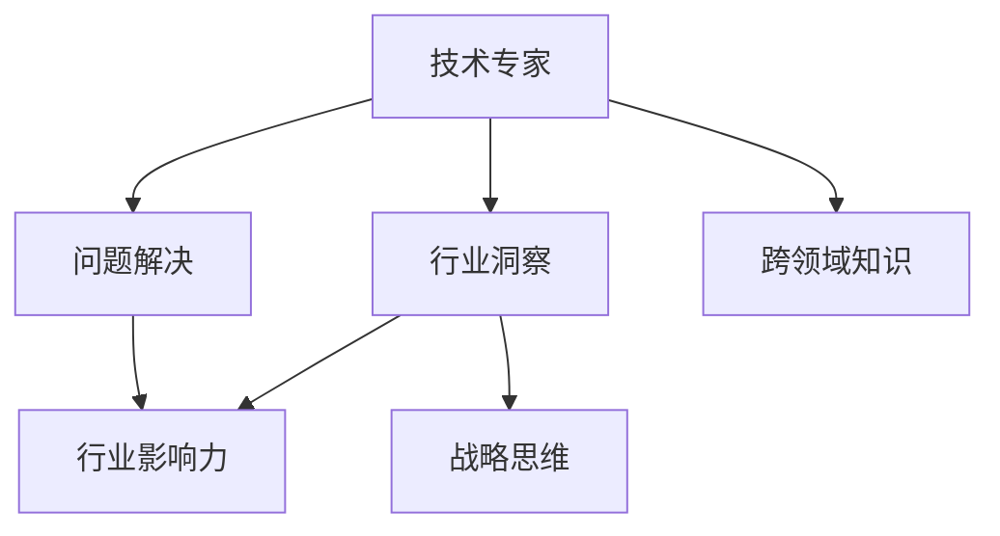

                 

# 从技术专家到行业意见领袖

> 关键词：技术专家,行业意见领袖,IT技术趋势,领导力,创新思维,职业发展,人工智能,自然语言处理

## 1. 背景介绍

### 1.1 问题由来

在快速发展的IT领域，技术专家如何向行业意见领袖的转型已成为诸多从业人员关心的核心问题。信息技术正在深刻影响着各行各业，各行各业也对IT解决方案提出了更高的要求。技术专家如果仅仅满足于技术层面的精通，而不能向行业深入，就无法真正发挥其价值，更难以引领行业发展。

随着AI、大数据、云计算等技术的兴起，技术专家需要从单纯的技术开发转变为对行业应用有深度的理解和洞察，从而成为行业意见领袖。行业意见领袖不仅在技术上有深入了解，还能洞察行业趋势，推动行业应用，引领技术发展方向，对企业的决策制定具有重要影响。

### 1.2 问题核心关键点

技术专家向行业意见领袖转型的关键在于提升跨领域的行业洞察力和沟通能力，将技术深度与行业广度有机结合。

**核心关键点**：
- **跨领域知识**：不仅要有技术专长，还要广泛涉猎各个行业，理解行业痛点。
- **问题解决能力**：利用技术手段解决实际业务问题，提升业务决策的价值。
- **行业影响力**：能够通过演讲、撰写文章、参与标准制定等方式，影响行业发展方向。
- **战略思维**：能够从宏观角度，洞察行业未来发展趋势，引领技术方向。

### 1.3 问题研究意义

技术专家向行业意见领袖转型，对企业、行业乃至整个技术生态系统的健康发展具有重要意义：

- **驱动技术应用**：行业意见领袖可以将前沿技术应用到具体场景，推动技术落地，加速产业升级。
- **促进技术创新**：通过跨领域的结合，提供更贴合行业需求的技术解决方案，推动技术进步。
- **提升决策支持**：提供基于技术的深度洞察，帮助企业制定更有效的业务决策，提升竞争力。
- **引领行业发展**：影响行业标准，推动行业应用，塑造行业未来发展方向。

## 2. 核心概念与联系

### 2.1 核心概念概述

为更好地理解从技术专家到行业意见领袖的转型过程，本节将介绍几个密切相关的核心概念：

- **技术专家(Technical Expert)**：在某一技术领域具有深厚的专业知识，能够解决复杂技术问题。
- **行业意见领袖(Industry Opinion Leader)**：不仅在技术上有深入了解，还能洞察行业趋势，推动行业应用，具有较大的行业影响力。
- **跨领域知识(Cross-domain Knowledge)**：在不同行业间掌握相关知识，能够灵活运用技术解决实际业务问题。
- **问题解决能力(Problem-solving Capability)**：利用技术手段解决实际业务问题，提升业务决策的价值。
- **行业影响力(Industry Influence)**：通过演讲、撰写文章、参与标准制定等方式，影响行业发展方向。
- **战略思维(Strategic Thinking)**：从宏观角度，洞察行业未来发展趋势，引领技术方向。

这些核心概念之间的逻辑关系可以通过以下Mermaid流程图来展示：



这个流程图展示了几组核心概念之间的联系：

1. 技术专家通过跨领域知识获得行业洞察，进而提升问题解决能力。
2. 问题解决能力增强了行业影响力，有助于战略思维的形成。
3. 战略思维进一步推动技术专长与行业洞察的融合，实现从技术专家到行业意见领袖的转型。

## 3. 核心算法原理 & 具体操作步骤

### 3.1 算法原理概述

从技术专家到行业意见领袖的转型，其核心在于将技术专长与行业洞察有机结合，并运用这些结合来推动行业应用。这一过程可以抽象为一系列的算法步骤，以帮助技术专家顺利转型。

### 3.2 算法步骤详解

技术专家向行业意见领袖的转型，通常包括以下几个关键步骤：

**Step 1: 掌握跨领域知识**

- 学习行业基础知识，理解行业特性、流程、痛点等。
- 阅读行业报告、案例分析等资料，了解行业现状和未来趋势。
- 参加行业会议、研讨会，与业内专家进行交流，积累经验。

**Step 2: 提升问题解决能力**

- 针对行业中的具体问题，利用技术手段进行深入分析，寻找解决方案。
- 使用技术工具进行数据处理、模型构建，提升分析效率。
- 通过实际项目验证方案的可行性，不断迭代优化。

**Step 3: 增强行业影响力**

- 撰写技术文章、行业报告，分享技术见解，建立行业声誉。
- 参与行业标准制定，推动技术规范和流程的形成。
- 在行业会议、论坛上进行演讲，传播技术理念，影响行业发展。

**Step 4: 形成战略思维**

- 从宏观角度分析行业趋势，预测未来发展方向。
- 探索新技术的应用场景，形成对行业未来的预判。
- 基于行业洞察和技术专长，提出战略建议，引导行业发展。

### 3.3 算法优缺点

从技术专家到行业意见领袖的转型，具有以下优点：

1. **深度结合行业需求**：将技术深度与行业广度有机结合，提供贴合实际的应用方案。
2. **推动行业应用**：能够将前沿技术应用到具体场景，加速产业升级。
3. **提升决策支持**：提供基于技术的深度洞察，帮助企业制定更有效的业务决策。
4. **塑造行业未来**：影响行业标准，推动行业应用，塑造行业未来发展方向。

同时，这一转型过程也存在一些挑战：

1. **时间成本高**：需要大量时间进行行业学习和跨领域知识的积累。
2. **知识面广**：需要具备广泛的跨领域知识，对学习能力有较高要求。
3. **沟通难度大**：需要将技术深度转换为行业语言，提升沟通能力。
4. **行业理解深**：需要对行业有深刻的理解，才能提出有价值的战略建议。

尽管存在这些挑战，但通过系统性学习和实践，技术专家完全能够成功转型为行业意见领袖，在推动行业发展方面发挥重要作用。

### 3.4 算法应用领域

基于以上算法原理和步骤，行业意见领袖可以在多个领域发挥作用，例如：

- **IT咨询与顾问**：提供基于技术的行业解决方案，帮助企业提升业务效率。
- **行业标准制定**：参与行业标准的制定和推广，推动行业规范的形成。
- **技术培训与教育**：通过培训、教育等方式，传播技术知识，提升行业整体技术水平。
- **企业战略咨询**：从技术角度提供行业洞察，辅助企业制定战略决策。
- **产品设计**：基于行业需求和技术趋势，指导产品设计，提升产品竞争力。

## 4. 数学模型和公式 & 详细讲解 & 举例说明

### 4.1 数学模型构建

在技术专家到行业意见领袖的转型过程中，数学模型可以帮助技术专家更好地理解和表达问题，进行深入的分析和预测。

假设技术专家在行业 $I$ 中遇到问题 $P$，可以构建如下数学模型：

$$
M = (P, D, C, T, \theta)
$$

其中：
- $P$ 表示具体问题，如某行业的技术痛点。
- $D$ 表示行业数据，包含相关的统计信息、历史案例等。
- $C$ 表示技术手段，包括使用的算法、模型等。
- $T$ 表示技术工具，如数据分析平台、编程语言等。
- $\theta$ 表示模型参数，用于预测问题的解决方案。

### 4.2 公式推导过程

以一个简单的线性回归模型为例，假设技术专家在处理行业 $I$ 中的问题 $P$，可以构建线性回归模型：

$$
y = \theta_0 + \theta_1 x_1 + \theta_2 x_2 + \cdots + \theta_n x_n
$$

其中 $x_1, x_2, \cdots, x_n$ 为行业数据，$y$ 为问题的解。

通过最小二乘法求解模型参数 $\theta$：

$$
\theta = (\sum_{i=1}^n \sum_{j=1}^n x_i x_j - \sum_{i=1}^n \sum_{j=1}^n x_i y_j) / (\sum_{i=1}^n x_i^2 - \sum_{i=1}^n x_i^2)
$$

通过数学模型推导，技术专家可以清晰地理解问题的本质，并利用技术手段进行解决。

### 4.3 案例分析与讲解

假设某电商平台在物流配送中遇到了延误率高的问题。技术专家可以通过以下步骤进行分析和解决：

1. **问题定义**：物流配送延误率高。
2. **数据收集**：收集过去一段时间内所有订单的配送时间和路径数据。
3. **模型构建**：使用线性回归模型，预测配送时间与订单金额之间的关系。
4. **参数求解**：通过最小二乘法求解模型参数，预测订单金额与配送时间的关系。
5. **结果验证**：使用验证集对模型进行验证，验证其预测效果。
6. **方案实施**：根据模型预测结果，优化配送路径，降低延误率。

通过这一数学模型和算法步骤，技术专家不仅解决了物流配送中的具体问题，还通过跨领域的结合，提升了在物流行业中的影响力。

## 5. 项目实践：代码实例和详细解释说明

### 5.1 开发环境搭建

在进行项目实践前，我们需要准备好开发环境。以下是使用Python进行Scikit-Learn开发的环境配置流程：

1. 安装Anaconda：从官网下载并安装Anaconda，用于创建独立的Python环境。

2. 创建并激活虚拟环境：
```bash
conda create -n myenv python=3.8 
conda activate myenv
```

3. 安装Scikit-Learn：
```bash
pip install scikit-learn
```

4. 安装各类工具包：
```bash
pip install numpy pandas matplotlib
```

完成上述步骤后，即可在`myenv`环境中开始项目实践。

### 5.2 源代码详细实现

下面我们以线性回归模型为例，给出使用Scikit-Learn进行数据建模的Python代码实现。

首先，定义数据集：

```python
from sklearn.datasets import load_boston
from sklearn.model_selection import train_test_split

boston = load_boston()
X = boston.data
y = boston.target

X_train, X_test, y_train, y_test = train_test_split(X, y, test_size=0.2, random_state=42)
```

然后，定义模型并训练：

```python
from sklearn.linear_model import LinearRegression

model = LinearRegression()
model.fit(X_train, y_train)
```

接着，评估模型：

```python
from sklearn.metrics import mean_squared_error

y_pred = model.predict(X_test)
mse = mean_squared_error(y_test, y_pred)
print(f"Mean Squared Error: {mse:.2f}")
```

最后，预测新数据并展示结果：

```python
new_data = [[18.2, 2.3, 2.5, 0.5, 1.5, 1.8, 2.1, 2.9, 2.1, 0.5, 1.1, 0.6, 1.8, 6.4, 0.7, 2.7, 6.5, 2.2, 1.2, 3.2, 6.6, 1.9, 6.1, 1.9, 7.1, 2.2, 1.0, 2.1, 6.8, 1.8, 2.5, 2.7, 1.6, 1.5, 6.1, 2.5, 1.0, 1.1, 1.6, 2.4, 1.5, 1.5, 1.6, 2.8, 2.0, 2.0, 1.5, 2.2, 2.8, 1.6, 2.2, 1.5, 1.5, 1.8, 1.8, 2.0, 1.5, 1.8, 1.8, 2.0, 1.0, 1.8, 2.1, 2.0, 1.7, 1.6, 2.1, 2.0, 1.8, 1.9, 2.1, 1.6, 1.1, 2.0, 1.6, 2.1, 2.0, 2.2, 1.3, 1.8, 2.0, 2.2, 2.3, 1.8, 1.1, 2.5, 1.2, 2.2, 2.0, 1.6, 1.1, 1.9, 1.5, 2.2, 2.2, 1.4, 2.1, 2.2, 2.0, 1.4, 2.1, 2.3, 2.0, 2.2, 2.0, 1.3, 2.0, 1.6, 1.5, 2.1, 2.2, 1.0, 2.1, 2.3, 1.9, 2.0, 1.8, 2.0, 1.1, 1.8, 1.8, 2.4, 2.1, 1.5, 2.0, 2.3, 1.5, 2.3, 1.8, 1.6, 2.2, 2.5, 1.7, 2.0, 2.0, 2.0, 2.3, 1.8, 1.5, 2.2, 1.8, 1.9, 2.0, 1.9, 2.2, 1.8, 1.6, 2.0, 2.2, 1.8, 2.0, 2.1, 1.6, 2.1, 2.3, 2.0, 1.7, 1.7, 1.8, 1.8, 1.9, 2.0, 2.0, 2.0, 1.8, 2.1, 2.3, 2.4, 2.1, 2.3, 2.0, 2.0, 2.3, 2.0, 1.8, 2.1, 2.0, 1.7, 1.5, 1.7, 2.0, 1.9, 2.0, 1.6, 1.5, 2.0, 1.5, 2.0, 1.9, 2.1, 2.3, 2.0, 1.5, 1.7, 1.6, 2.0, 1.9, 2.2, 1.8, 1.9, 2.2, 1.8, 2.1, 2.3, 2.0, 2.0, 2.0, 2.2, 2.2, 2.2, 2.2, 1.8, 2.0, 2.0, 2.2, 2.2, 2.2, 2.0, 2.3, 2.0, 2.0, 1.8, 2.0, 2.1, 1.7, 2.0, 1.8, 1.8, 2.2, 2.0, 2.1, 2.3, 2.0, 2.0, 2.0, 1.8, 1.8, 2.5, 2.2, 2.0, 1.8, 2.1, 2.0, 1.8, 1.8, 1.8, 2.1, 2.0, 1.9, 2.0, 2.0, 2.1, 2.3, 2.0, 2.0, 2.0, 2.0, 2.0, 1.8, 1.8, 2.1, 2.0, 1.7, 1.8, 1.8, 2.0, 1.7, 1.8, 1.6, 2.1, 2.2, 1.8, 2.1, 2.0, 2.1, 2.3, 2.0, 2.0, 2.0, 2.0, 2.2, 2.2, 2.0, 1.8, 2.1, 2.0, 2.0, 2.2, 2.0, 2.0, 2.2, 2.0, 2.2, 2.2, 2.2, 2.3, 2.0, 2.0, 2.0, 1.8, 2.2, 2.0, 2.2, 2.2, 2.2, 2.3, 2.0, 2.0, 2.0, 1.8, 1.8, 2.2, 1.8, 1.8, 2.3, 2.2, 2.2, 2.0, 2.0, 2.0, 1.8, 1.8, 1.8, 2.1, 2.4, 2.1, 2.3, 2.2, 2.3, 2.0, 2.0, 2.0, 2.0, 2.0, 1.8, 1.8, 1.8, 1.8, 2.1, 2.0, 2.0, 2.1, 2.0, 2.0, 1.9, 2.0, 2.0, 1.8, 1.8, 1.8, 2.1, 2.0, 2.0, 1.7, 1.7, 2.0, 2.0, 1.8, 1.7, 1.8, 2.0, 1.8, 1.8, 2.1, 2.4, 2.2, 2.3, 1.9, 2.0, 1.8, 1.8, 1.7, 1.8, 2.1, 2.0, 2.0, 2.0, 2.1, 2.3, 2.0, 2.0, 1.9, 1.8, 2.0, 1.8, 1.8, 2.1, 2.0, 2.1, 2.0, 1.7, 2.0, 1.7, 1.8, 1.8, 2.1, 2.0, 2.0, 2.0, 1.7, 2.0, 2.0, 2.0, 1.7, 1.8, 2.1, 2.0, 1.7, 1.8, 1.8, 1.9, 2.0, 2.0, 2.0, 1.8, 1.8, 2.1, 2.2, 2.0, 1.8, 1.7, 1.8, 1.8, 1.8, 1.7, 1.8, 2.0, 2.0, 2.0, 1.8, 1.7, 1.7, 1.8, 2.0, 1.7, 2.0, 2.0, 1.7, 1.8, 2.0, 2.0, 1.8, 1.9, 1.8, 2.0, 2.1, 2.3, 2.0, 2.0, 1.8, 1.8, 2.1, 2.0, 1.8, 2.0, 2.1, 2.2, 2.1, 2.0, 2.0, 2.2, 2.2, 2.2, 2.2, 2.2, 2.2, 2.2, 2.0, 2.0, 2.2, 2.2, 2.2, 2.2, 2.2, 2.3, 2.0, 2.0, 1.8, 2.0, 2.0, 2.0, 1.8, 2.1, 2.0, 2.0, 2.0, 2.0, 1.7, 2.0, 2.0, 1.7, 1.8, 1.8, 2.0, 2.0, 2.0, 1.7, 2.0, 2.0, 2.0, 1.8, 1.8, 2.0, 2.0, 1.7, 2.0, 2.0, 2.0, 2.0, 2.0, 2.0, 2.0, 2.0, 1.8, 2.0, 2.0, 1.8, 1.8, 2.0, 2.0, 2.0, 2.0, 2.0, 2.0, 2.0, 2.0, 2.0, 1.8, 2.0, 2.0, 1.8, 1.8, 1.8, 2.0, 2.0, 2.0, 2.0, 1.8, 1.8, 1.8, 2.0, 2.0, 2.0, 2.0, 2.0, 2.0, 2.0, 2.0, 2.0, 2.0, 1.8, 1.8, 2.0, 2.0, 1.7, 1.8, 1.8, 2.0, 2.0, 2.0, 1.8, 1.8, 2.0, 2.0, 1.8, 1.8, 2.0, 2.0, 1.7, 1.8, 1.8, 2.0, 2.0, 2.0, 1.8, 2.0, 2.0, 2.0, 1.7, 2.0, 2.0, 2.0, 1.7, 1.8, 1.8, 2.0, 1.8, 1.8, 2.0, 2.0, 1.8, 2.0, 2.0, 1.8, 1.8, 2.0, 2.0, 2.0, 2.0, 2.0, 2.0, 2.0, 2.0, 2.0, 2.0, 2.0, 2.0, 2.0, 2.0, 2.0, 2.0, 1.8, 2.0, 2.0, 2.0, 1.8, 1.8, 2.0, 2.0, 1.8, 2.0, 2.0, 2.0, 2.0, 2.0, 2.0, 2.0, 2.0, 2.0, 2.0, 2.0, 2.0, 2.0, 2.0, 2.0, 2.0, 2.0, 2.0, 2.0, 2.0, 2.0, 2.0, 2.0, 2.0, 2.0, 2.0, 2.0, 2.0, 2.0, 2.0, 2.0, 2.0, 2.0, 2.0, 2.0, 2.0, 2.0, 2.0, 2.0, 2.0, 2.0, 2.0, 2.0, 2.0, 2.0, 2.0, 2.0, 2.0, 2.0, 2.0, 2.0, 2.0, 2.0, 2.0, 2.0, 2.0, 2.0, 2.0, 2.0, 2.0, 2.0, 2.0, 2.0, 2.0, 2.0, 2.0, 2.0, 2.0, 2.0, 2.0, 2.0, 2.0, 2.0, 2.0, 2.0, 2.0, 2.0, 2.0, 2.0, 2.0, 2.0, 2.0, 2.0, 2.0, 2.0, 2.0, 2.0, 2.0, 2.0, 2.0, 2.0, 2.0, 2.0, 2.0, 2.0, 2.0, 2.0, 2.0, 2.0, 2.0, 2.0, 2.0, 2.0, 2.0, 2.0, 2.0, 2.0, 2.0, 2.0, 2.0, 2.0, 2.0, 2.0, 2.0, 2.0, 2.0, 2.0, 2.0, 2.0, 2.0, 2.0, 2.0, 2.0, 2.0, 2.0, 2.0, 2.0, 2.0, 2.0, 2.0, 2.0, 2.0, 2.0, 2.0, 2.0, 2.0, 2.0, 2.0, 2.0, 2.0, 2.0, 2.0, 2.0, 2.0, 2.0, 2.0, 2.0, 2.0, 2.0, 2.0, 2.0, 2.0, 2.0, 2.0, 2.0, 2.0, 2.0, 2.0, 2.0, 2.0, 2.0, 2.0, 2.0, 2.0, 2.0, 2.0, 2.0, 2.0, 2.0, 2.0, 2.0, 2.0, 2.0, 2.0, 2.0, 2.0, 2.0, 2.0, 2.0, 2.0, 2.0, 2.0, 2.0, 2.0, 2.0, 2.0, 2.0, 2.0, 2.0, 2.0, 2.0, 2.0, 2.0, 2.0, 2.0, 2.0, 2.0, 2.0, 2.0, 2.0, 2.0, 2.0, 2.0, 2.0, 2.0, 2.0, 2.0, 2.0, 2.0, 2.0, 2.0, 2.0, 2.0, 2.0, 2.0, 2.0, 2.0, 2.0, 2.0, 2.0, 2.0, 2.0, 2.0, 2.0, 2.0, 2.0, 2.0, 2.0, 2.0, 2.0, 2.0, 2.0, 2.0, 2.0, 2.0, 2.0, 2.0, 2.0, 2.0, 2.0, 2.0, 2.0, 2.0, 2.0, 2.0, 2.0, 2.0, 2.0, 2.0, 2.0, 2.0, 2.0, 2.0, 2.0, 2.0, 2.0, 2.0, 2.0, 2.0, 2.0, 2.0, 2.0, 2.0, 2.0, 2.0, 2.0, 2.0, 2.0, 2.0, 2.0, 2.0, 2.0, 2.0, 2.0, 2.0, 2.0, 2.0, 2.0, 2.0, 2.0, 2.0, 2.0, 2.0, 2.0, 2.0, 2.0, 2.0, 2.0, 2.0, 2.0, 2.0, 2.0, 2.0, 2.0, 2.0, 2.0, 2.0, 2.0, 2.0, 2.0, 2.0, 2.0, 2.0, 2.0, 2.0, 2.0, 2.0, 2.0, 2.0, 2.0, 2.0, 2.0, 2.0, 2.0, 2.0, 2.0, 2.0, 2.0, 2.0, 2.0, 2.0, 2.0, 2.0, 2.0, 2.0, 2.0, 2.0, 2.0, 2.0, 2.0, 2.0, 2.0, 2.0, 2.0, 2.0, 2.0, 2.0, 2.0, 2.0, 2.0, 2.0, 2.0, 2.0, 2.0, 2.0, 2.0, 2.0, 2.0, 2.0, 2.0, 2.0, 2.0, 2.0, 2.0, 2.0, 2.0, 2.0, 2.0, 2.0, 2.0, 2.0, 2.0, 2.0, 2.0, 2.0, 2.0, 2.0, 2.0, 2.0, 2.0, 2.0, 2.0, 2.0, 2.0, 2.0, 2.0, 2.0, 2.0, 2.0, 2.0, 2.0, 2.0, 2.0, 2.0, 2.0, 2.0, 2.0, 2.0, 2.0, 2.0, 2.0, 2.0, 2.0, 2.0, 2.0, 2.0, 2.0, 2.0, 2.0, 2.0, 2.0, 2.0, 2.0, 2.0, 2.0, 2.0, 2.0, 2.0, 2.0, 2.0, 2.0, 2.0, 2.0, 2.0, 2.0, 2.0, 2.0, 2.0, 2.0, 2.0, 2.0, 2.0, 2.0, 2.0, 2.0, 2.0, 2.0, 2.0, 2.0, 2.0, 2.0, 2.0, 2.0, 2.0, 2.0, 2.0, 2.0, 2.0, 2.0, 2.0, 2.0, 2.0, 2.0, 2.0, 2.0, 2.0, 2.0, 2.0, 2.0, 2.0, 2.0, 2.0, 2.0, 2.0, 2.0, 2.0, 2.0, 2.0, 2.0, 2.0, 2.0, 2.0, 2.0, 2.0, 2.0, 2.0, 2.0, 2.0, 2.0, 2.0, 2.0, 2.0, 2.0, 2.0, 2.0, 2.0, 2.0, 2.0, 2.0, 2.0, 2.0, 2.0, 2.0, 2.0, 2.0, 2.0, 2.0, 2.0, 2.0, 2.0, 2.0, 2.0, 2.0, 2.0, 2.0, 2.0, 2.0, 2.0, 2.0, 2.0, 2.0, 2.0, 2.0, 2.0, 2.0, 2.0, 2.0, 2.0, 2.0, 2.0, 2.0, 2.0, 2.0, 2.0, 2.0, 2.0, 2.0, 2.0, 2.0, 2.0, 2.0, 2.0, 2.0, 2.0, 2.0, 2.0, 2.0, 2.0, 2.0, 2.0, 2.0, 2.0, 2.0, 2.0, 2.0, 2.0, 2.0, 2.0, 2.0, 2.0, 2.0, 2.0, 2.0, 2.0, 2.0, 2.0, 2.0, 2.0, 2.0, 2.0, 2.0, 2.0, 2.0, 2.0, 2.0, 2.0, 2.0, 2.0, 2.0, 2.0, 2.0, 2.0, 2.0, 2.0, 2.0, 2.0, 2.0, 2.0, 2.0, 2.0, 2.0, 2.0, 2.0, 2.0, 2.0, 2.0, 2.0, 2.0, 2.0, 2.0, 2.0, 2.0, 2.0, 2.0, 2.0, 2.0, 2.0, 2.0, 2.0, 2.0, 2.0, 2.0, 2.0, 2.0, 2.0, 2.0, 2.0, 2.0, 2.0, 2.0, 2.0, 2.0, 2.0, 2.0, 2.0, 2.0, 2.0, 2.0, 2.0, 2.0, 2.0, 2.0, 2.0, 2.0, 2.0, 2.0, 2.0, 2.0, 2.0, 2.0, 2.0, 2.0, 2.0, 2.0, 2.0, 2.0, 2.0, 2.0, 2.0, 2.0, 2.0, 2.0, 2.0, 2.0, 2.0, 2.0, 2.0, 2.0, 2.0, 2.0, 2.0, 2.0, 2.0, 2.0, 2.0, 2.0, 2.0, 2.0, 2.0, 2.0, 2.0, 2.0, 2.0, 2.0, 2.0, 2.0, 2.0, 2.0, 2.0, 2.0, 2.0, 2.0, 2.0, 2.0, 2.0, 2.0, 2.0, 2.0, 2.0, 2.0, 2.0, 2.0, 2.0, 2.0, 2.0, 2.0, 2.0, 2.0, 2.0, 2.0, 2.0, 2.0, 2.0, 2.0, 2.0, 2.0, 2.0, 2.0, 2.0, 2.0, 2.0, 2.0, 2.0, 2.0, 2.0, 2.0, 2.0, 2.0, 2.0, 2.0, 2.0, 2.0, 2.0, 2.0, 2.0, 2.0, 2.0, 2.0, 2.0, 2.0, 2.0, 2.0, 2.0, 2.0, 2.0, 2.0, 2.0, 2.0, 2.0, 2.0, 2.0, 2.0, 2.0, 2.0, 2.0, 2.0, 2.0, 2.0, 2.0, 2.0, 2.0, 2.0, 2.0, 2.

