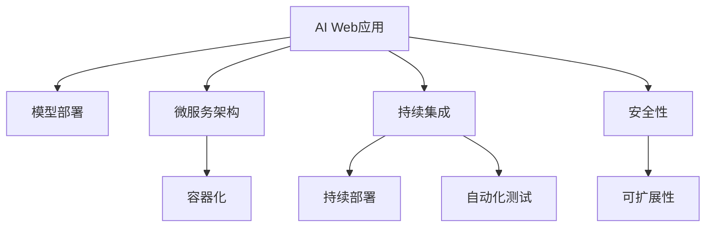

                 

# 从模型到产品：AI Web应用部署实践

> 关键词：AI Web应用, 模型部署, 云计算, 微服务架构, 容器化, 持续集成, 持续部署(CI/CD), 自动化测试, 安全性, 可扩展性

## 1. 背景介绍

### 1.1 问题由来

在人工智能(AI)和大数据时代，越来越多的企业开始利用AI技术驱动业务创新。然而，将AI模型从研究实验室成功部署到实际业务场景中，并非易事。传统的做法往往需要繁琐的开发、测试、部署等过程，不仅耗时耗力，还容易产生各种生产环境中的问题。

近年来，随着云服务、微服务架构、容器化技术的发展，AI模型的部署变得越来越简单、高效。企业可以通过云计算平台，轻松实现AI模型的部署和运维，加速业务创新和市场响应。

然而，AI模型在Web应用中的部署，仍然面临着诸多挑战：

- 如何高效构建微服务架构，方便模型管理？
- 如何利用云计算平台，实现弹性伸缩和自动化运维？
- 如何保证模型的安全性和可靠性？
- 如何保障服务的可扩展性和稳定性？

这些问题都需要系统的技术解决方案，本文将系统介绍AI Web应用的部署实践，涵盖模型构建、微服务架构设计、云平台选择、自动化运维等多个方面。

## 2. 核心概念与联系

### 2.1 核心概念概述

为更好地理解AI Web应用部署的技术细节，本节将介绍几个密切相关的核心概念：

- AI Web应用：指利用AI模型驱动的Web应用程序，能够自动处理和分析用户输入，并给出相应的响应。常见的AI Web应用包括智能客服、推荐系统、图像识别等。

- 模型部署：指将训练好的AI模型，转化为能够被Web应用调用的形式，部署到云服务或服务器上的过程。模型部署包括模型封装、导出、发布等多个步骤。

- 微服务架构：指将Web应用拆分为多个独立的小服务，每个服务负责特定的业务功能，能够独立部署、扩展和运维的架构设计模式。微服务架构通过服务治理、负载均衡等技术，实现高效、可靠的系统构建。

- 容器化技术：指通过Docker等容器技术，将应用程序及其依赖打包成容器镜像，方便在任意环境中快速部署和运维的技术。容器化技术将应用程序的运行环境和依赖隔离，避免了环境一致性的问题。

- 持续集成(CI)和持续部署(CD)：指利用CI/CD工具，自动化地构建、测试和部署应用，减少人为操作，提升生产效率和代码质量的技术。CI/CD流程能够持续集成代码变更，自动化测试，并快速部署新版本，保障应用的稳定性和可靠性。

- 自动化测试：指利用测试工具，自动化地执行测试用例，验证代码变更的正确性，避免引入新的Bug的技术。自动化测试通过持续集成和持续部署，能够实时发现问题，并快速修复。

- 安全性：指通过加密、认证、访问控制等技术，保护Web应用和用户数据不受外部攻击和内部滥用的技术。安全性是AI Web应用部署的基础保障，关系到用户隐私和企业安全。

- 可扩展性：指系统能够灵活应对业务量波动，快速扩展资源和功能，满足用户需求的技术。可扩展性能够确保AI Web应用在高峰期依然稳定运行，提升用户体验。

这些核心概念之间的逻辑关系可以通过以下Mermaid流程图来展示：



这个流程图展示了大语言模型的核心概念及其之间的关系：

1. AI Web应用是最终应用，需要模型驱动。
2. 模型部署是将预训练模型转化为Web应用调用的过程。
3. 微服务架构是系统设计，实现模块化和独立部署。
4. 容器化技术实现应用程序的隔离和自动化运维。
5. 持续集成和持续部署提升生产效率和代码质量。
6. 自动化测试保障应用质量，减少人为操作。
7. 安全性是基础保障，保证应用和数据的安全性。
8. 可扩展性实现系统的高效、稳定运行。

这些概念共同构成了AI Web应用部署的技术框架，使得AI模型能够顺利转化为生产环境中的实时应用，为业务创新提供有力支撑。

## 3. 核心算法原理 & 具体操作步骤

### 3.1 算法原理概述

AI Web应用的部署，本质上是一个从模型到生产环境的转化过程。其核心思想是：将训练好的AI模型，通过一系列技术手段，转化为能够在Web应用中调用的形式，部署到云服务或服务器上，实现实时响应和业务创新。

形式化地，假设AI Web应用为 $M$，其中包含N个微服务 $S_1, S_2, ..., S_N$。每个微服务 $S_i$ 包含 $C_i$ 个容器镜像 $C_{i1}, C_{i2}, ..., C_{ic_i}$，通过CI/CD流程进行构建和部署。模型 $M$ 的部署过程如下：

1. 在预训练框架下，训练得到模型 $F_{\theta}$。
2. 将模型 $F_{\theta}$ 转化为可部署的形式，如TensorFlow Serving、TensorFlow Lite等。
3. 根据微服务架构设计，将模型 $F_{\theta}$ 部署到对应的容器镜像中，构建微服务 $S_i$。
4. 通过CI/CD流程，将构建好的微服务 $S_i$ 自动部署到云平台或服务器上。
5. 在实际应用中，通过API接口调用微服务 $S_i$，实现AI模型的实时响应。

### 3.2 算法步骤详解

AI Web应用的部署一般包括以下几个关键步骤：

**Step 1: 模型训练与导出**

- 在预训练框架下，训练得到模型 $F_{\theta}$。
- 根据实际需求，选择适合的模型导出格式，如TensorFlow Lite、ONNX等。
- 将训练好的模型导出到本地文件或云存储中，便于后续部署。

**Step 2: 微服务架构设计**

- 根据业务需求，将Web应用拆分为多个独立的微服务 $S_1, S_2, ..., S_N$。
- 定义每个微服务的服务边界和功能，明确输入和输出接口。
- 设计微服务之间的通信协议，如REST API、gRPC等。

**Step 3: 容器化与镜像构建**

- 在微服务架构的基础上，选择合适的容器化工具，如Docker，构建微服务的容器镜像。
- 将模型 $F_{\theta}$ 导入容器镜像中，并配置环境变量和依赖。
- 定义启动脚本和健康检查，确保容器镜像能够在任意环境中正常运行。

**Step 4: CI/CD流程配置**

- 在代码托管平台（如GitHub）上配置CI/CD流程。
- 定义构建和测试命令，自动编译容器镜像，并运行自动化测试。
- 配置部署流程，将构建好的容器镜像部署到云平台或服务器上。
- 实现持续集成和持续部署，实时更新微服务，提升应用稳定性和代码质量。

**Step 5: 应用部署与运维**

- 将构建好的容器镜像部署到云平台或服务器上，启动微服务。
- 配置负载均衡和故障恢复机制，确保微服务的稳定性和可扩展性。
- 通过API接口调用微服务，实现AI模型的实时响应。
- 监控系统性能和日志，及时发现和修复问题，保障应用的正常运行。

以上是AI Web应用部署的一般流程。在实际应用中，还需要根据具体任务的特点，对部署过程的各个环节进行优化设计，如改进微服务设计、优化CI/CD流程、增强自动化测试等，以进一步提升应用性能和稳定性。

### 3.3 算法优缺点

AI Web应用的部署方法具有以下优点：
1. 高效灵活。通过微服务架构设计，能够灵活应对业务需求，快速构建和部署应用。
2. 可扩展性强。利用容器化和CI/CD流程，能够轻松应对业务量波动，实现弹性伸缩。
3. 自动化程度高。自动化测试和持续集成部署，减少了人为操作，提升了生产效率和代码质量。
4. 易于运维。通过容器化技术，隔离了应用程序的运行环境和依赖，使得应用在不同环境中的运行更加稳定。

同时，该方法也存在一定的局限性：
1. 依赖云平台。依赖云平台资源和服务的稳定性，一旦云平台出现故障，应用可能无法正常运行。
2. 复杂度较高。微服务架构设计复杂，需要系统化地规划和管理。
3. 迁移成本高。需要耗费大量时间和资源，将现有应用迁移到微服务架构中。
4. 安全问题突出。微服务架构增加了系统复杂性，也带来了更多的安全风险。

尽管存在这些局限性，但就目前而言，通过微服务架构和容器化技术的部署方法，仍是AI Web应用的主流范式。未来相关研究的重点在于如何进一步降低部署复杂度，提升应用的安全性和稳定性，同时兼顾效率和灵活性。

### 3.4 算法应用领域

AI Web应用的部署方法，已经在医疗、金融、电商、物流等多个领域得到了广泛应用，为企业的业务创新提供了有力支撑：

- 智能客服：利用深度学习模型驱动，实现7x24小时智能客服，提升客户体验和满意度。
- 金融推荐：利用深度学习模型驱动，为用户推荐金融产品，提升用户粘性和转化率。
- 电商推荐：利用深度学习模型驱动，为用户推荐商品，提升用户购买意愿和销售额。
- 物流配送：利用深度学习模型驱动，优化物流配送路线和仓储管理，提升配送效率和降低成本。

除了上述这些经典应用外，AI Web应用还被创新性地应用于更多场景中，如智能制造、智能交通、智慧医疗等，为各行各业带来了数字化转型的新动力。

## 4. 数学模型和公式 & 详细讲解 & 举例说明

### 4.1 数学模型构建

本节将使用数学语言对AI Web应用部署的整个过程进行更加严格的刻画。

记AI Web应用为 $M$，包含N个微服务 $S_1, S_2, ..., S_N$。每个微服务 $S_i$ 包含 $C_i$ 个容器镜像 $C_{i1}, C_{i2}, ..., C_{ic_i}$，每个容器镜像 $C_{ij}$ 表示为 $c_{ij} = (C_i, \theta_i, P_i)$，其中 $C_i$ 为微服务编号，$\theta_i$ 为模型参数，$P_i$ 为服务启动参数。

假设微服务的输入为 $X$，输出为 $Y$。定义模型 $M$ 在输入 $X$ 上的损失函数为 $\ell(M(X), Y)$。则微服务的损失函数可以表示为：

$$
\mathcal{L}(X, Y) = \sum_{i=1}^N \ell(M(X), Y_i)
$$

其中 $Y_i = M(S_i)(X)$，$M(S_i)$ 表示微服务 $S_i$ 的输出映射函数。

微服务的优化目标是最小化损失函数，即找到最优参数：

$$
\theta^* = \mathop{\arg\min}_{\theta} \mathcal{L}(X, Y)
$$

在得到损失函数的梯度后，即可带入优化算法（如SGD、Adam等）更新模型参数，完成模型的迭代优化。

### 4.2 公式推导过程

以下我们以推荐系统为例，推导模型的构建和优化过程。

假设模型 $F_{\theta}$ 的输入为用户行为数据 $x$，输出为推荐列表 $y$。定义模型 $F_{\theta}$ 在输入 $x$ 上的损失函数为 $\ell(F_{\theta}(x), y)$，推荐系统的损失函数为 $\mathcal{L}(x, y)$。

假设推荐系统有N个微服务，每个微服务 $S_i$ 通过容器镜像 $C_{ij}$ 进行部署，输入为 $x_i$，输出为 $y_i = M(S_i)(x_i)$。则推荐系统的损失函数可以表示为：

$$
\mathcal{L}(x, y) = \sum_{i=1}^N \ell(M(S_i)(x_i), y_i)
$$

根据链式法则，损失函数对参数 $\theta$ 的梯度为：

$$
\frac{\partial \mathcal{L}(x, y)}{\partial \theta} = \sum_{i=1}^N \frac{\partial \ell(M(S_i)(x_i), y_i)}{\partial \theta}
$$

其中 $\frac{\partial \ell(M(S_i)(x_i), y_i)}{\partial \theta}$ 为微服务 $S_i$ 的输出对模型参数 $\theta$ 的梯度，可以通过反向传播算法高效计算。

在得到损失函数的梯度后，即可带入优化算法（如SGD、Adam等）更新模型参数，完成模型的迭代优化。重复上述过程直至收敛，最终得到适应推荐任务的最优模型参数 $\theta^*$。

## 5. 项目实践：代码实例和详细解释说明

### 5.1 开发环境搭建

在进行AI Web应用部署实践前，我们需要准备好开发环境。以下是使用Python进行Kubernetes开发的环境配置流程：

1. 安装Anaconda：从官网下载并安装Anaconda，用于创建独立的Python环境。

2. 创建并激活虚拟环境：
```bash
conda create -n kube-env python=3.8 
conda activate kube-env
```

3. 安装Kubernetes：通过helm工具安装Minikube，在本地运行Kubernetes集群。
```bash
curl -LO "https://storage.googleapis.com/minikube/releases/latest/minikube-linux-amd64"
chmod +x minikube
sudo install -o root -g root -m 0755 minikube /usr/local/bin/minikube
minikube start --memory=4096 --cpus=4
```

4. 安装Jupyter Notebook：
```bash
pip install jupyter notebook
```

5. 安装Kubernetes Python客户端：
```bash
pip install kubernetes
```

完成上述步骤后，即可在`kube-env`环境中开始Kubernetes开发。

### 5.2 源代码详细实现

下面我们以推荐系统为例，给出使用Kubernetes部署微服务的PyKube代码实现。

首先，定义推荐系统的微服务：

```python
from kubernetes import client, config

# 配置Kubernetes环境
config.load_kube_config()

# 创建推荐系统微服务
app = client.AppsV1Api()

# 定义微服务名称和端口
name = "recommender"
port = 8080

# 创建Deployment对象
deployment = client.v1.Deployment()
deployment.metadata.name = name
deployment.metadata.labels = {"hello": "world"}

# 定义微服务的Pod模板
pod_template = client.v1.PodTemplateSpec()
pod_template.metadata.name = name
pod_template.spec.containers = [
    client.v1.Container(name=name, image="python:3.7", ports=[client.v1.ContainerPort(container_port=port)])
]

# 创建Deployment
deployment.spec = client.v1.DeploymentSpec()
deployment.spec.selectors = {"hello": "world"}
deployment.spec.replicas = 3
deployment.spec.template = pod_template

# 创建Deployment
app.create_namespaced_deployment(namespace="default", body=deployment)
```

然后，定义微服务的构建和测试流程：

```python
from jupyter_client import KernelManager

# 启动Jupyter Notebook服务器
kernel_manager = KernelManager(app='hello', port=8888, namespace='default', connection_file='connection_file.json')
kernel_manager.start_server()
```

最后，启动微服务并进行测试：

```python
# 获取微服务的IP地址
ip = kernel_manager.kernel_info['ip']

# 访问微服务
import requests
response = requests.get(f'http://{ip}:{port}')
print(response.text)
```

以上就是使用Kubernetes部署推荐系统的完整代码实现。可以看到，Kubernetes通过部署、扩展和管理Pod、Service等资源，轻松实现了微服务的自动化部署和运维。

### 5.3 代码解读与分析

让我们再详细解读一下关键代码的实现细节：

**Pod和Deployment定义**：
- `client.v1.PodTemplateSpec`：定义Pod模板，指定容器的镜像、端口等配置。
- `client.v1.Container`：定义容器，指定镜像和端口。
- `client.v1.Pod`：定义Pod，包含容器配置。
- `client.v1.Deployment`：定义Deployment，指定Pod模板和Replica数量。
- `client.v1.AppsV1Api`：定义API，用于创建和更新Deployment。

**Jupyter Notebook启动**：
- `KernelManager`：启动Jupyter Notebook服务器，生成IP地址和端口。
- `kernel_manager.start_server()`：启动Jupyter Notebook服务器，监听指定端口。

**微服务访问**：
- `requests.get`：通过HTTP请求访问微服务，获取其响应。
- `response.text`：获取响应内容，打印输出。

可以看到，Kubernetes通过Pod、Deployment等资源的定义和管理，实现了微服务的自动化部署和运维。Jupyter Notebook则提供了可视化界面和交互工具，方便开发者调试和测试微服务。

## 6. 实际应用场景

### 6.1 智能客服系统

基于AI Web应用部署的智能客服系统，可以实时响应客户咨询，提升客户体验和满意度。通过微服务架构设计，将语音识别、自然语言处理、响应生成等功能模块化，通过API接口调用，实现高效的智能客服。

在技术实现上，可以收集历史客服对话记录，将其作为训练数据，训练深度学习模型。将模型部署到Kubernetes集群中，通过API接口提供服务。客户可以通过Web界面或移动应用，实时输入问题，系统能够自动匹配回答，并记录用户行为数据，用于后续的持续改进。

### 6.2 金融推荐系统

利用AI Web应用部署的金融推荐系统，能够为用户推荐金融产品，提升用户粘性和转化率。通过微服务架构设计，将用户画像、交易数据、金融产品等模块化，通过API接口调用，实现高效的推荐服务。

在技术实现上，可以收集用户行为数据和金融产品信息，训练深度学习模型。将模型部署到Kubernetes集群中，通过API接口提供服务。用户可以通过Web界面或移动应用，实时输入偏好信息，系统能够自动推荐符合其兴趣的产品，并记录推荐效果，用于后续的持续改进。

### 6.3 电商推荐系统

利用AI Web应用部署的电商推荐系统，能够为用户推荐商品，提升用户购买意愿和销售额。通过微服务架构设计，将用户画像、商品信息、销售数据等模块化，通过API接口调用，实现高效的推荐服务。

在技术实现上，可以收集用户浏览、点击、购买等行为数据，训练深度学习模型。将模型部署到Kubernetes集群中，通过API接口提供服务。用户可以通过Web界面或移动应用，实时输入偏好信息，系统能够自动推荐符合其兴趣的商品，并记录推荐效果，用于后续的持续改进。

### 6.4 未来应用展望

随着AI Web应用部署技术的不断发展，其在更多领域得到了应用，为各行各业带来了数字化转型的新动力：

- 智能制造：利用AI Web应用部署的智能生产系统，能够实现设备状态监测、预测性维护、质量控制等功能，提升生产效率和产品质量。
- 智能交通：利用AI Web应用部署的智能交通系统，能够实现交通流量监测、事故预警、导航优化等功能，提升交通系统的运行效率和安全性。
- 智慧医疗：利用AI Web应用部署的智慧医疗系统，能够实现疾病诊断、药物推荐、患者监护等功能，提升医疗服务的质量和效率。
- 智慧城市：利用AI Web应用部署的智慧城市系统，能够实现公共安全、环境保护、智能出行等功能，提升城市治理的智能化水平。

除了上述这些经典应用外，AI Web应用还被创新性地应用于更多场景中，如智能家居、智能安防、智能农业等，为数字化社会带来了新的突破。

## 7. 工具和资源推荐

### 7.1 学习资源推荐

为了帮助开发者系统掌握AI Web应用部署的理论基础和实践技巧，这里推荐一些优质的学习资源：

1. Kubernetes官方文档：提供Kubernetes的详细介绍和最佳实践，是学习Kubernetes的必备资源。

2. Minikube官方文档：提供Minikube的安装和使用指南，是搭建本地Kubernetes集群的首选工具。

3. Helm官方文档：提供Helm的详细介绍和最佳实践，是管理Kubernetes部署的工具。

4. TensorFlow Serving官方文档：提供TensorFlow Serving的详细介绍和最佳实践，是部署TensorFlow模型的高效工具。

5. TensorFlow Lite官方文档：提供TensorFlow Lite的详细介绍和最佳实践，是部署移动设备的TensorFlow模型的高效工具。

6. 《深度学习实战》书籍：清华大学出版社出版的经典深度学习教材，涵盖深度学习模型的构建、训练和部署等方方面面。

通过对这些资源的学习实践，相信你一定能够快速掌握AI Web应用部署的精髓，并用于解决实际的业务问题。

### 7.2 开发工具推荐

高效的开发离不开优秀的工具支持。以下是几款用于AI Web应用部署开发的常用工具：

1. Kubernetes：Google开源的容器编排系统，实现微服务的自动化部署和运维。

2. Helm：Kubernetes的包管理工具，用于管理Kubernetes中的部署资源。

3. TensorFlow Serving：Google开源的模型服务框架，用于高效部署TensorFlow模型。

4. TensorFlow Lite：Google开源的移动设备模型优化工具，用于优化TensorFlow模型，适配移动设备。

5. Minikube：在本地搭建Kubernetes集群的工具，方便开发者调试和测试微服务。

6. Jupyter Notebook：可视化交互式编程环境，方便开发者调试和测试微服务。

合理利用这些工具，可以显著提升AI Web应用部署的开发效率，加快创新迭代的步伐。

### 7.3 相关论文推荐

AI Web应用部署技术的发展源于学界的持续研究。以下是几篇奠基性的相关论文，推荐阅读：

1. Google Borg: An Efficient Cluster Resource Manager：提出了Borg资源管理系统，为大规模集群资源管理提供了经典方案。

2. Kubernetes: Container Orchestration for Large-Scale Clusters：介绍了Kubernetes的架构设计和核心特性，是学习Kubernetes的必备资源。

3. TensorFlow Serving: A High-Performance, Highly Available, and Easy-to-Use TensorFlow Serving System：介绍了TensorFlow Serving的架构设计和核心特性，是学习TensorFlow Serving的必备资源。

4. TensorFlow Lite: A Compiled TensorFlow for Low-Resource Devices：介绍了TensorFlow Lite的架构设计和核心特性，是学习TensorFlow Lite的必备资源。

这些论文代表了大语言模型部署技术的发展脉络。通过学习这些前沿成果，可以帮助研究者把握学科前进方向，激发更多的创新灵感。

## 8. 总结：未来发展趋势与挑战

### 8.1 总结

本文对AI Web应用部署的技术细节进行了全面系统的介绍。首先阐述了AI Web应用部署的背景和意义，明确了部署技术在推动业务创新和提升用户体验中的重要性。其次，从原理到实践，详细讲解了微服务架构、容器化技术、CI/CD流程等核心概念，给出了部署模型的完整代码实现。同时，本文还探讨了AI Web应用在智能客服、金融推荐、电商推荐等领域的实际应用，展示了部署技术的广泛前景。此外，本文精选了部署技术的各类学习资源，力求为读者提供全方位的技术指引。

通过本文的系统梳理，可以看到，AI Web应用部署技术正在成为推动企业数字化转型的重要引擎，为企业带来了前所未有的创新机遇。未来，伴随微服务架构和容器化技术的不断演进，AI Web应用将能够在更广泛的场景下发挥其强大功能，为各行各业带来新的突破。

### 8.2 未来发展趋势

展望未来，AI Web应用部署技术将呈现以下几个发展趋势：

1. 微服务架构普及。微服务架构将成为主流架构模式，实现系统的高效、可靠构建和运维。

2. 容器化技术成熟。容器化技术将更加成熟，实现微服务的高效部署和扩展。

3. 云平台完善。云平台将提供更完善的资源和服务，实现微服务的弹性伸缩和自动化运维。

4. 持续集成和持续部署。持续集成和持续部署将成为标配，提升应用的稳定性和代码质量。

5. 自动化测试和监控。自动化测试和监控将更加完善，确保应用的质量和性能。

6. 微服务治理。微服务治理技术将更加成熟，实现微服务的快速扩展和故障恢复。

7. 安全性和可扩展性提升。通过安全性和可扩展性技术，保障微服务的安全和稳定运行。

这些趋势凸显了AI Web应用部署技术的广阔前景。这些方向的探索发展，必将进一步提升AI Web应用的性能和稳定性，为业务创新提供更有力的保障。

### 8.3 面临的挑战

尽管AI Web应用部署技术已经取得了显著进展，但在迈向更加智能化、普适化应用的过程中，仍面临诸多挑战：

1. 微服务设计复杂。微服务架构设计复杂，需要系统化地规划和管理，否则容易产生系统耦合、重复构建等问题。

2. 微服务监控困难。微服务架构增加了系统复杂性，也带来了更多的监控挑战，需要构建更完善的监控体系。

3. 微服务安全性问题。微服务架构增加了系统复杂性，也带来了更多的安全风险，需要构建更完善的安全体系。

4. 微服务扩展性不足。微服务架构的设计和部署需要兼顾扩展性，否则容易产生资源浪费和扩展瓶颈。

5. 微服务可维护性差。微服务架构的设计和部署需要兼顾可维护性，否则容易产生代码冗余和维护成本高的问题。

6. 微服务资源浪费。微服务架构的设计和部署需要兼顾资源利用效率，否则容易产生资源浪费和成本高的问题。

尽管存在这些挑战，但通过不断优化微服务架构设计、提升监控和安全性、优化扩展性和可维护性，相信AI Web应用部署技术将在实践中不断突破，带来更多业务价值。

### 8.4 研究展望

面向未来，AI Web应用部署技术还需要与其他人工智能技术进行更深入的融合，如知识表示、因果推理、强化学习等，多路径协同发力，共同推动AI Web应用的发展。未来，通过深度学习模型的优化、微服务架构的改进、容器化技术的创新、持续集成和持续部署的完善，AI Web应用部署技术必将迎来更大的突破，为各行各业带来新的数字化转型机遇。

## 9. 附录：常见问题与解答

**Q1：什么是微服务架构？**

A: 微服务架构是一种系统设计模式，将大型应用拆分为多个独立的微服务，每个微服务负责特定的业务功能，能够独立部署、扩展和运维。通过微服务架构设计，可以实现系统的高效、可靠构建和运维。

**Q2：如何实现微服务的自动化部署和运维？**

A: 通过容器化技术，将微服务打包成容器镜像，并利用Kubernetes等容器编排工具，实现微服务的自动化部署和运维。容器化技术隔离了应用程序的运行环境和依赖，使得应用在不同环境中的运行更加稳定。

**Q3：微服务架构的设计有哪些最佳实践？**

A: 微服务架构设计需要考虑多个方面，如服务粒度、通信协议、服务治理等。一般建议服务粒度以业务功能为单位，通信协议采用RESTful或gRPC，服务治理使用API网关和负载均衡等技术。

**Q4：微服务的安全性如何保障？**

A: 微服务架构的安全性保障需要考虑多个方面，如网络安全、应用安全、数据安全等。一般建议采用网络防火墙、HTTPS、OAuth等技术，保障微服务的通信安全和数据安全。

**Q5：微服务的扩展性如何提升？**

A: 微服务的扩展性提升需要考虑多个方面，如负载均衡、自动扩缩容、故障恢复等。一般建议采用负载均衡、自动扩缩容、故障恢复等技术，保障微服务的稳定性和可扩展性。

这些研究方向的探索，必将引领AI Web应用部署技术迈向更高的台阶，为构建安全、可靠、可扩展、可维护的智能系统铺平道路。面向未来，AI Web应用部署技术还需要与其他人工智能技术进行更深入的融合，如知识表示、因果推理、强化学习等，多路径协同发力，共同推动AI Web应用的发展。只有勇于创新、敢于突破，才能不断拓展AI Web应用的边界，让智能技术更好地造福人类社会。

---

作者：禅与计算机程序设计艺术 / Zen and the Art of Computer Programming

