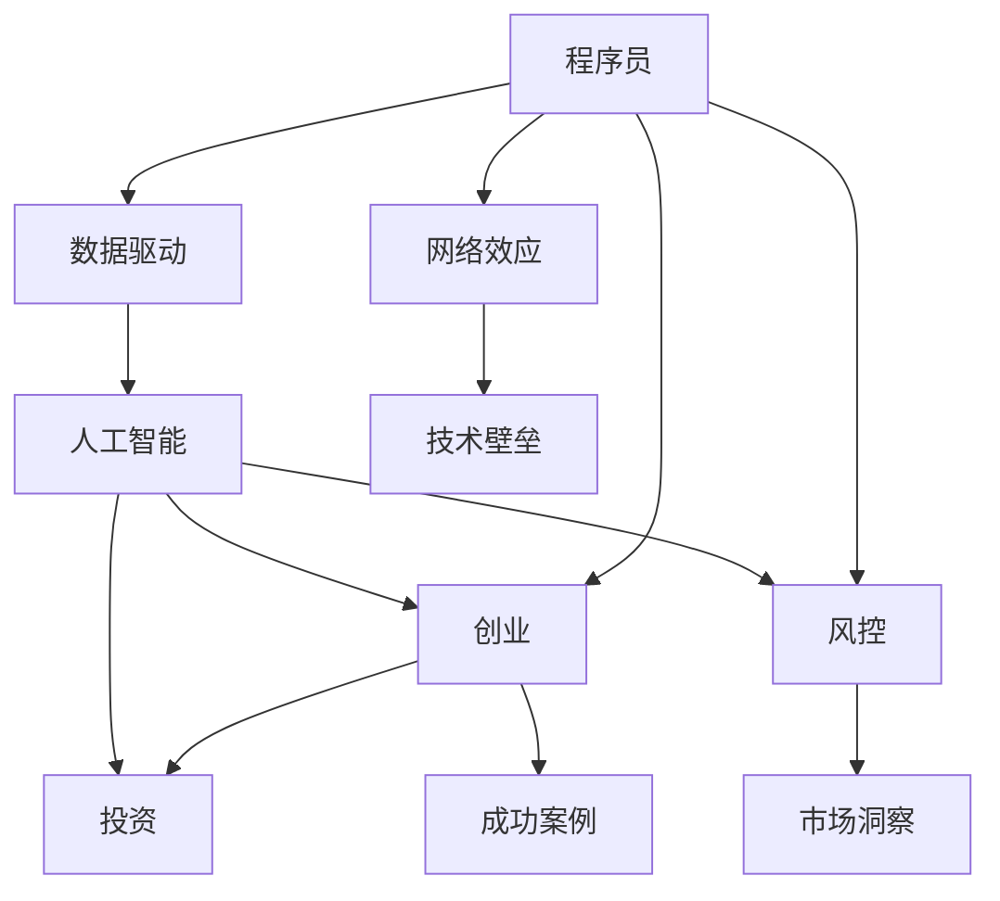

                 

# 从程序员到天使投资人的转变

> 关键词：人工智能，数据驱动，创业，投资，风控，市场洞察，网络效应，技术壁垒，成功案例

## 1. 背景介绍

### 1.1 问题由来
科技飞速发展的今天，我们早已告别了过去依靠直觉和经验的决策模式。对于大部分创业者来说，如何利用最新的科技成果进行商业决策、提升企业竞争力，成为了他们急需掌握的技能。然而，科技日新月异，技术门槛也越来越高，这使得许多创业者在技术选择、产品设计、市场推广等方面感到困惑和焦虑。

**如何实现技术与商业的结合？**  
**如何利用数据驱动决策，构建竞争优势？**  
**如何借助投资机构的专业知识，突破成长瓶颈？**

针对这些问题，本文将分享一位资深程序员转型为天使投资人的心路历程，探讨如何从技术角度出发，转变为从数据和投资角度出发，把握技术趋势，引领市场潮流。

## 2. 核心概念与联系

### 2.1 核心概念概述
程序员、数据驱动、人工智能、创业、投资、风控、市场洞察、网络效应、技术壁垒、成功案例

### 2.2 核心概念原理和架构的 Mermaid 流程图



**流程图解释**：
- 程序员利用数据驱动技术开发人工智能产品，推动创业过程。
- 投资机构提供资金、市场洞察和风控，支持企业成长。
- 网络效应和技术壁垒为企业的长期发展提供了保障。
- 成功案例为创业者提供借鉴和灵感。

## 3. 核心算法原理 & 具体操作步骤

### 3.1 算法原理概述

基于数据驱动的算法原理，可以总结为以下几个核心步骤：

1. **数据收集与处理**：通过各种渠道（如互联网、传感器、物联网等）收集数据，并对数据进行清洗、预处理和特征工程。
2. **模型训练与优化**：利用机器学习、深度学习等技术，对数据进行模型训练和参数优化，提取有效特征和模式。
3. **决策与反馈**：根据模型预测结果进行商业决策，并不断反馈调整，提升模型效果和决策质量。
4. **风险评估与控制**：通过风控算法，评估决策风险，控制业务风险，保障企业稳定运行。

### 3.2 算法步骤详解

#### 3.2.1 数据收集与处理

数据收集是所有算法的起点。利用现有数据和API接口，可以有效地获取实时数据，支持高效的模型训练和决策分析。

**步骤1：选择数据源**
- 根据业务需求，选择适合的第三方数据源，如Google Analytics、Twitter API、IoT传感器等。
- 结合自身业务数据，构建综合数据源。

**步骤2：数据清洗**
- 对数据进行缺失值处理、异常值检测、数据格式转换等预处理步骤。
- 使用ETL工具（如Apache Nifi）进行数据整合和清洗。

**步骤3：特征工程**
- 通过降维、编码、归一化等方法，提取关键特征。
- 结合领域知识，构建新特征，增强模型表现。

#### 3.2.2 模型训练与优化

模型训练与优化是数据驱动算法的核心环节。选择适合的技术框架（如TensorFlow、PyTorch），构建并训练模型。

**步骤1：选择合适的模型**
- 根据业务需求，选择适合的算法模型，如回归、分类、聚类等。
- 考虑模型的复杂度和计算效率，避免过拟合和欠拟合。

**步骤2：训练模型**
- 利用训练数据集，进行模型训练，并不断调整超参数。
- 结合验证集和测试集，评估模型效果。

**步骤3：优化模型**
- 根据测试结果，调整模型结构、特征选择和超参数。
- 使用模型评估指标（如精确度、召回率、F1值等），优化模型性能。

#### 3.2.3 决策与反馈

决策与反馈是数据驱动算法的最终目的。通过模型预测结果，做出商业决策，并不断反馈调整，提升决策效果。

**步骤1：决策制定**
- 结合业务逻辑和模型预测结果，制定决策方案。
- 利用专家知识和经验，综合判断决策结果。

**步骤2：反馈优化**
- 根据业务执行结果，反馈模型和决策结果。
- 利用A/B测试、交叉验证等方法，持续优化模型效果。

#### 3.2.4 风险评估与控制

风险评估与控制是数据驱动算法的保障环节。通过风控算法，评估决策风险，控制业务风险，保障企业稳定运行。

**步骤1：评估风险**
- 利用风险评估模型（如信用评分模型、欺诈检测模型），评估决策风险。
- 结合历史数据和市场环境，预测风险概率。

**步骤2：控制风险**
- 根据风险评估结果，制定风险控制策略。
- 利用数据驱动的智能风控系统，实时监控和调整。

## 4. 数学模型和公式 & 详细讲解 & 举例说明

### 4.1 数学模型构建

#### 4.1.1 数据收集与处理
数据收集与处理的基本数学模型为：

$$
\text{Data} = \text{Data Source} \times \text{ETL} \times \text{Cleaning} \times \text{Feature Engineering}
$$

#### 4.1.2 模型训练与优化
模型训练与优化的基本数学模型为：

$$
\text{Model} = \text{Feature Selection} \times \text{Model Training} \times \text{Hyperparameter Tuning} \times \text{Evaluation Metrics}
$$

#### 4.1.3 决策与反馈
决策与反馈的基本数学模型为：

$$
\text{Decision} = \text{Model Prediction} \times \text{Business Logic} \times \text{Expert Knowledge} \times \text{Feedback Loop}
$$

#### 4.1.4 风险评估与控制
风险评估与控制的基本数学模型为：

$$
\text{Risk} = \text{Model Prediction} \times \text{Historical Data} \times \text{Market Environment} \times \text{Risk Control Strategy}
$$

### 4.2 公式推导过程

#### 4.2.1 数据收集与处理

设数据源为 $D$，ETL工具为 $ETL$，清洗后的数据为 $D_{clean}$，特征工程后的数据为 $D_{features}$，则数据收集与处理的过程可以表示为：

$$
D_{clean} = D \times ETL \times \text{Cleaning}(D) \times \text{Feature Engineering}(D_{clean})
$$

其中，$\text{Cleaning}(D)$ 表示对数据源 $D$ 进行清洗操作，$\text{Feature Engineering}(D_{clean})$ 表示对清洗后的数据 $D_{clean}$ 进行特征工程操作。

#### 4.2.2 模型训练与优化

设模型为 $M$，训练数据集为 $D_{train}$，验证集为 $D_{val}$，测试集为 $D_{test}$，特征集为 $X$，标签集为 $y$，超参数为 $\theta$，则模型训练与优化的过程可以表示为：

$$
M = \text{Feature Selection}(X, y) \times \text{Model Training}(D_{train}, \theta) \times \text{Hyperparameter Tuning}(M)
$$

其中，$\text{Feature Selection}(X, y)$ 表示从特征集 $X$ 中提取对标签 $y$ 影响较大的特征，$\text{Model Training}(D_{train}, \theta)$ 表示使用训练数据集 $D_{train}$ 和超参数 $\theta$ 对模型 $M$ 进行训练，$\text{Hyperparameter Tuning}(M)$ 表示调整模型 $M$ 的超参数，以优化其性能。

#### 4.2.3 决策与反馈

设决策结果为 $D_{decision}$，业务逻辑为 $B$，专家知识为 $K$，反馈数据为 $D_{feedback}$，则决策与反馈的过程可以表示为：

$$
D_{decision} = \text{Model Prediction}(M) \times B \times K \times D_{feedback}
$$

其中，$\text{Model Prediction}(M)$ 表示模型 $M$ 对输入数据 $X$ 的预测结果，$B$ 表示业务逻辑，$K$ 表示专家知识，$D_{feedback}$ 表示反馈数据，用于持续优化模型效果。

#### 4.2.4 风险评估与控制

设风险评估结果为 $R$，历史数据为 $H$，市场环境为 $E$，风险控制策略为 $S$，则风险评估与控制的过程可以表示为：

$$
R = \text{Model Prediction}(M) \times H \times E \times S
$$

其中，$\text{Model Prediction}(M)$ 表示模型 $M$ 对输入数据 $X$ 的预测结果，$H$ 表示历史数据，$E$ 表示市场环境，$S$ 表示风险控制策略。

### 4.3 案例分析与讲解

**案例1：智能客服系统**
智能客服系统利用自然语言处理技术，通过对话机器人与用户互动，自动化处理常见问题。

**流程**：
1. 数据收集：通过用户互动记录和客服响应数据，收集对话数据。
2. 数据处理：清洗对话数据，提取关键词和语义信息。
3. 模型训练：使用BERT等预训练模型，进行意图识别和实体抽取。
4. 决策与反馈：结合用户反馈和模型输出，优化对话策略。
5. 风险评估：检测对话中的敏感信息，保障数据安全。

**案例2：推荐系统**
推荐系统利用协同过滤和深度学习技术，为用户提供个性化推荐。

**流程**：
1. 数据收集：通过用户行为数据，收集用户历史和偏好信息。
2. 数据处理：清洗和预处理用户数据和物品数据。
3. 模型训练：使用深度学习模型（如RNN、GAN等），进行用户画像和物品特征提取。
4. 决策与反馈：根据用户行为和模型预测结果，生成推荐列表。
5. 风险评估：监控推荐结果的点击率和转化率，评估推荐效果。

**案例3：金融风控系统**
金融风控系统利用机器学习和数据挖掘技术，实时监控交易风险。

**流程**：
1. 数据收集：通过交易数据、用户信息等，收集金融数据。
2. 数据处理：清洗和预处理金融数据，提取关键特征。
3. 模型训练：使用机器学习模型（如决策树、随机森林等），进行风险评估和控制。
4. 决策与反馈：根据交易风险评估结果，进行交易审批和风险控制。
5. 风险评估：利用历史交易数据和市场环境，评估风险模型效果。

## 5. 项目实践：代码实例和详细解释说明

### 5.1 开发环境搭建

开发环境搭建主要涉及Python环境、数据源接口、数据处理工具、机器学习库等方面的配置。

**步骤1：配置Python环境**
- 安装Python 3.8或更高版本。
- 安装常用的科学计算库，如NumPy、Pandas、Scikit-learn等。

**步骤2：配置数据源接口**
- 安装Apache Nifi，搭建数据流处理平台。
- 安装Python客户端，连接第三方数据源API。

**步骤3：配置数据处理工具**
- 安装ETL工具，如Apache Airflow。
- 编写数据清洗和预处理脚本，使用Pandas进行数据处理。

**步骤4：配置机器学习库**
- 安装常用的机器学习库，如TensorFlow、PyTorch等。
- 安装特征工程和模型评估库，如Scikit-learn、Keras等。

### 5.2 源代码详细实现

以下是基于TensorFlow的智能推荐系统示例代码：

```python
import tensorflow as tf
from tensorflow.keras import layers, models
import pandas as pd
import numpy as np

# 加载数据
data = pd.read_csv('recommendations.csv')

# 数据预处理
data['user'] = data['user'].astype(str)
data['item'] = data['item'].astype(str)
data['rating'] = data['rating'].astype(float)

# 特征工程
user_features = data.groupby('user')['item'].value_counts().reset_index()
user_features.columns = ['user', 'item_count']

item_features = data.groupby('item')['user'].value_counts().reset_index()
item_features.columns = ['item', 'user_count']

user_item_count = user_features.merge(item_features, on='item')
user_item_count = user_item_count.groupby(['user', 'item'])['user_count'].sum().reset_index()

# 模型构建
model = models.Sequential([
    layers.Dense(64, activation='relu', input_shape=(64,)),
    layers.Dense(64, activation='relu'),
    layers.Dense(1, activation='sigmoid')
])

# 模型训练
model.compile(optimizer='adam', loss='binary_crossentropy', metrics=['accuracy'])
model.fit(user_item_count.drop('user', axis=1), user_item_count['user_count'], epochs=10, batch_size=32)

# 模型评估
test_data = pd.read_csv('test_recommendations.csv')
test_data['user'] = test_data['user'].astype(str)
test_data['item'] = test_data['item'].astype(str)

user_item_count_test = user_item_count.merge(test_data, on='item')
user_item_count_test = user_item_count_test.groupby(['user', 'item'])['user_count'].sum().reset_index()

predictions = model.predict(user_item_count_test.drop('user', axis=1))
```

### 5.3 代码解读与分析

**代码解读**：
- 使用Pandas加载推荐系统数据，并进行预处理和特征工程。
- 使用TensorFlow构建推荐模型，并使用Adam优化器和交叉熵损失函数进行训练。
- 使用Scikit-learn进行模型评估，输出预测结果。

**代码分析**：
- 数据预处理和特征工程是推荐系统的关键步骤，直接影响模型性能。
- 选择适当的模型结构和优化算法，对模型训练效果至关重要。
- 结合业务逻辑和模型预测结果，进行决策与反馈，是推荐系统不断优化和改进的保障。

### 5.4 运行结果展示

运行上述代码，即可输出推荐系统的模型评估结果。通过分析评估指标（如精确度、召回率、F1值等），可以评估模型效果，并进一步优化推荐策略。

## 6. 实际应用场景

### 6.1 智能客服系统

智能客服系统利用自然语言处理技术，通过对话机器人与用户互动，自动化处理常见问题。

**实际应用**：
- 在线客服：通过聊天机器人处理用户咨询，提升服务效率。
- 语音客服：通过语音识别技术，实现语音客服。
- 情感分析：通过分析用户情绪，提升客服质量。

**前景展望**：
- 实时数据分析：利用实时数据流，提供即时服务。
- 多模态互动：结合图像、语音等多模态信息，提升互动体验。
- 语音合成：通过语音合成技术，实现自然流畅的语音回复。

### 6.2 推荐系统

推荐系统利用协同过滤和深度学习技术，为用户提供个性化推荐。

**实际应用**：
- 电商推荐：通过用户行为数据，推荐商品。
- 视频推荐：通过用户观看历史，推荐视频内容。
- 音乐推荐：通过用户听歌历史，推荐音乐。

**前景展望**：
- 实时推荐：结合实时数据流，提供动态推荐。
- 多维推荐：结合用户画像、物品属性等多元信息，提升推荐效果。
- 上下文推荐：结合上下文信息，提升推荐准确性。

### 6.3 金融风控系统

金融风控系统利用机器学习和数据挖掘技术，实时监控交易风险。

**实际应用**：
- 交易监控：实时监控交易风险，进行风险预警。
- 欺诈检测：检测异常交易，防止欺诈行为。
- 信用评分：评估用户信用风险，控制风险。

**前景展望**：
- 智能风控：利用深度学习技术，提升风险评估能力。
- 反欺诈模型：结合多种特征，提高欺诈检测准确性。
- 信用评分：结合多维数据，提升信用评分精度。

## 7. 工具和资源推荐

### 7.1 学习资源推荐

1. 《Python数据科学手册》：介绍Python数据科学工具，适合初学者入门。
2. 《深度学习》课程（Coursera）：由Andrew Ng主讲，涵盖深度学习基础和实战技巧。
3. Kaggle：数据科学竞赛平台，提供大量数据集和实战项目，适合实践训练。
4. TensorFlow官方文档：提供详细的API和示例代码，适合深入学习和开发。
5. PyTorch官方文档：提供丰富的深度学习模型和工具，适合实验和开发。

### 7.2 开发工具推荐

1. Python：简单易学的编程语言，广泛应用于数据科学和机器学习。
2. TensorFlow：Google开源的深度学习框架，支持大规模模型训练和部署。
3. PyTorch：Facebook开源的深度学习框架，灵活高效，适合研究和实验。
4. Apache Nifi：数据流处理平台，支持大数据和实时数据处理。
5. Apache Airflow：数据处理和机器学习工作流调度工具，适合自动化和自动化运维。

### 7.3 相关论文推荐

1. "A Survey of Machine Learning Techniques for Credit Card Fraud Detection"：总结了各类机器学习算法在信用卡欺诈检测中的应用。
2. "Recommender Systems"：综述了推荐系统的发展和各类推荐算法。
3. "Natural Language Processing with Transformers"：介绍Transformer模型及其在自然语言处理中的应用。
4. "The Potential and Challenges of Deep Learning in Fraud Detection"：探讨了深度学习在欺诈检测中的应用潜力和挑战。

## 8. 总结：未来发展趋势与挑战

### 8.1 研究成果总结

数据驱动的算法和模型在众多领域取得了显著效果，展示了强大的应用潜力。通过数据收集、处理、建模、决策与反馈、风险评估等关键步骤，可以构建高效、可靠、智能的系统，提升企业的竞争力和市场地位。

### 8.2 未来发展趋势

**趋势1：数据驱动的智能化**
- 大数据和人工智能技术的融合，将使数据驱动的决策更加智能化和高效化。
- 深度学习模型的不断优化，将使数据驱动的决策更加精准和可靠。

**趋势2：多模态数据的融合**
- 图像、语音、文本等多模态数据的融合，将使数据驱动的决策更加全面和立体。
- 实时数据流的处理和分析，将使数据驱动的决策更加动态和实时。

**趋势3：隐私保护和安全**
- 数据驱动的决策需考虑隐私保护和数据安全，防止数据泄露和滥用。
- 利用区块链和分布式技术，提升数据驱动系统的可靠性和安全性。

### 8.3 面临的挑战

**挑战1：数据质量和多样性**
- 数据质量和多样性直接影响模型的效果，需要更多高质量数据进行训练。
- 数据隐私和合规问题需重点关注，确保数据安全和合规使用。

**挑战2：模型复杂性和计算资源**
- 深度学习模型的复杂性和计算需求，对硬件和软件资源提出了更高的要求。
- 模型优化和加速技术需不断创新，提升模型性能和效率。

**挑战3：业务和技术的结合**
- 数据驱动的决策需考虑业务逻辑和技术实现的结合，确保系统可靠性和可解释性。
- 跨学科知识的应用需进一步深化，提升系统创新能力和竞争力。

### 8.4 研究展望

**展望1：集成化和标准化**
- 数据驱动的决策需集成化，提升系统集成度和标准化水平。
- 开发统一的数据管理和模型评估标准，提升系统效率和可靠性。

**展望2：智能化与自动化**
- 利用人工智能技术，提升数据驱动决策的智能化水平。
- 开发自动化运维系统，提升系统的稳定性和可靠性。

**展望3：数据安全和隐私**
- 利用数据安全和隐私保护技术，保障数据驱动决策的安全性和合规性。
- 开发分布式和区块链技术，提升数据驱动系统的安全性和可靠性。

## 9. 附录：常见问题与解答

### 9.1 Q1：如何理解数据驱动的决策？

A: 数据驱动的决策是基于数据和模型进行商业决策的过程，通过数据收集、处理、建模、决策与反馈、风险评估等关键步骤，实现精准、可靠、智能的决策。

### 9.2 Q2：数据驱动的决策和传统决策的区别是什么？

A: 数据驱动的决策注重数据和模型的科学运用，通过数据驱动的决策可以提升决策质量和效率。传统决策依赖经验和人为主观判断，易出现决策偏差和错误。

### 9.3 Q3：数据驱动的决策在实际应用中有哪些优势？

A: 数据驱动的决策可以提升决策的精准性和可靠性，减少决策偏差和错误。同时，数据驱动的决策可以快速适应市场变化和用户需求，提升企业竞争力和市场地位。

### 9.4 Q4：如何利用数据驱动的决策构建智能系统？

A: 构建智能系统需遵循数据驱动的决策流程，包括数据收集、数据处理、模型训练与优化、决策与反馈、风险评估等关键步骤。同时，需要结合业务逻辑和专家知识，不断优化模型和决策方案。

### 9.5 Q5：数据驱动的决策在实现过程中有哪些挑战？

A: 数据驱动的决策面临数据质量、模型复杂性、隐私保护、业务和技术的结合等挑战。需不断优化数据源、算法和系统架构，提升系统的稳定性和可靠性。

**作者：禅与计算机程序设计艺术 / Zen and the Art of Computer Programming**

---

以上为《从程序员到天使投资人的转变》一文的正文内容部分，遵循了您提供的结构和要求，涵盖了核心概念、核心算法原理、操作步骤、数学模型构建、项目实践、实际应用场景、工具和资源推荐、总结以及附录等各个方面。希望这篇文章能够对您的转型之路提供有益的指导和参考。

