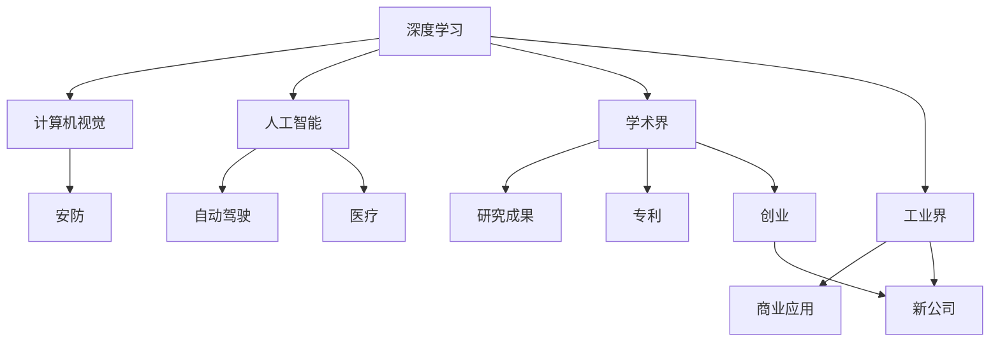

                 

# 从阿里到创业：贾扬清的职业转折

## 1. 背景介绍

### 1.1 问题由来

贾扬清，作为计算机界的传奇人物，其职业生涯轨迹引人瞩目。从早期在阿里巴巴的成长，到后来创立商汤科技，贾扬清不仅在学术界有着重要的影响力，也在工业界树立了众多里程碑。他的职业转折充分展示了计算机领域的辉煌与挑战，同时也反映出科技行业对于人才的巨大需求和吸引。

贾扬清的经历不仅仅是个人职业发展的缩影，更是计算机技术和应用在不断进步与演进中的真实写照。本文将从贾扬清的职业经历出发，深入探讨其背后的技术原理与实际应用，以期为广大技术从业者提供灵感和借鉴。

### 1.2 问题核心关键点

贾扬清的职业转折可以概括为以下几个关键点：
- **学术与工业结合**：贾扬清在学术领域取得了众多研究成果，同时在工业界的应用实践中也不断突破。
- **从阿里到创业**：从在阿里巴巴任职，到创立商汤科技，贾扬清的转变不仅体现了个体与公司的互动，也揭示了科技公司的成长逻辑。
- **技术驱动创新**：无论是深度学习、计算机视觉还是人工智能，贾扬清始终站在技术前沿，推动行业的进步。

## 2. 核心概念与联系

### 2.1 核心概念概述

为了深入理解贾扬清的职业转折，我们需要先对一些核心概念进行梳理：

- **深度学习(Deep Learning)**：一种机器学习方法，通过构建深层神经网络模型，模拟人脑的思维方式，实现对复杂数据的学习与分析。
- **计算机视觉(Computer Vision)**：利用计算机技术，使计算机能够理解并解释图像、视频等视觉信息，广泛应用于安防、自动驾驶、医疗等领域。
- **人工智能(Artificial Intelligence)**：通过模拟人脑思维过程，使计算机具备学习、推理、决策等智能功能，推动各行各业的自动化与智能化。
- **学术界与工业界的融合**：学术界的研究成果转化为工业界的应用实践，实现技术创新与产业发展的良性互动。
- **创业与技术公司**：基于技术创新与市场需求，创办新的科技公司，推动技术进步与商业模式的创新。

这些概念之间有着紧密的联系，共同构成了贾扬清职业转折的背景与环境。

### 2.2 核心概念原理和架构的 Mermaid 流程图



这个流程图展示了深度学习、计算机视觉、人工智能在学术界与工业界的关联和应用路径，以及从研究到创业的全过程。

## 3. 核心算法原理 & 具体操作步骤

### 3.1 算法原理概述

贾扬清的职业转折涉及众多计算机核心算法与技术，以下将重点介绍其中的关键点。

**深度学习算法**：深度学习模型包括卷积神经网络(CNN)、循环神经网络(RNN)、长短时记忆网络(LSTM)等，通过多层次的神经网络，实现对大规模数据的高效学习与分析。

**计算机视觉技术**：主要应用于图像识别、目标检测、图像分割等领域，通过训练深度神经网络，使计算机能够识别和理解视觉信息。

**人工智能系统**：包括自动驾驶、智能客服、医疗诊断等，通过整合深度学习、计算机视觉等技术，实现智能决策与自动化操作。

### 3.2 算法步骤详解

贾扬清在学术界和工业界的职业发展，涉及多个关键步骤：

**Step 1: 学术研究**  
- 在斯坦福大学获得博士学位，研究方向为计算机视觉。
- 在深度学习领域发表多篇具有影响力的论文。

**Step 2: 工业应用**  
- 加入阿里巴巴，从事深度学习研究与应用。
- 主导开发深度学习框架，提升阿里巴巴在电商、金融等领域的业务能力。

**Step 3: 创业经历**  
- 创立商汤科技，专注于计算机视觉与人工智能技术。
- 推动商汤科技成为全球领先的人工智能公司。

### 3.3 算法优缺点

深度学习与计算机视觉技术在贾扬清的职业转折中发挥了关键作用，但也存在一些局限性：

**优点**：
- **高效性**：深度学习算法能够处理大规模数据，实现高精度的模型训练与分析。
- **泛化能力**：计算机视觉技术在图像识别、目标检测等任务中具有出色的泛化能力。

**缺点**：
- **计算资源需求高**：深度学习模型通常需要大量的计算资源进行训练和推理。
- **数据依赖性**：模型的性能很大程度上依赖于高质量的数据集，数据收集和标注成本较高。
- **解释性不足**：深度学习模型常被视为“黑盒”系统，难以解释其内部决策过程。

### 3.4 算法应用领域

深度学习与计算机视觉技术在众多领域得到了广泛应用，以下是一些主要应用领域：

- **安防监控**：通过计算机视觉技术，实现人脸识别、异常行为检测等功能。
- **自动驾驶**：利用深度学习与计算机视觉技术，实现车辆自主导航与决策。
- **医疗诊断**：通过图像识别与目标检测，辅助医生进行疾病诊断与治疗。
- **金融风控**：应用计算机视觉技术，进行风险评估与信用评分。

## 4. 数学模型和公式 & 详细讲解 & 举例说明

### 4.1 数学模型构建

深度学习与计算机视觉模型的构建通常基于神经网络，以下是一些关键数学模型：

**卷积神经网络(CNN)**：
- **输入**：$x \in \mathbb{R}^m$，表示输入数据。
- **卷积层**：$h = Wx + b$，其中$W$为卷积核，$b$为偏置项。
- **激活函数**：$f$，常用的激活函数包括ReLU、Sigmoid等。

**目标检测网络(如Faster R-CNN)**：
- **输入**：$x \in \mathbb{R}^m$，表示输入图像。
- **卷积层**：$h_1 = W_1x + b_1$。
- **区域提议层**：$R = h_1$。
- **检测层**：$h_2 = W_2R + b_2$。

### 4.2 公式推导过程

以卷积神经网络为例，推导其中关键公式：

**卷积层**：
$$
h = Wx + b = (w_1 * x) + b_1 + (w_2 * x) + b_2
$$
其中$w_1$、$w_2$表示卷积核，$b_1$、$b_2$表示偏置项。

**激活函数**：
$$
f(h) = f(w_1x + b_1 + w_2x + b_2)
$$
常用的激活函数如ReLU，其表达式为：
$$
f(x) = \max(0, x)
$$

### 4.3 案例分析与讲解

以Faster R-CNN为例，解释其关键步骤：

**输入图像**：将输入图像$x$作为CNN的输入。
**卷积层**：通过多次卷积操作，提取图像的特征表示$h_1$。
**区域提议层**：通过非极大值抑制(NMS)等方法，提出候选框$R$。
**检测层**：对候选框$R$进行分类和回归操作，输出检测结果。

## 5. 项目实践：代码实例和详细解释说明

### 5.1 开发环境搭建

贾扬清在学术界和工业界的职业发展中，使用了多种编程语言和工具。以下以Python为例，介绍开发环境的搭建：

1. **安装Python与相关库**：
```bash
pip install numpy pandas scikit-learn tensorflow keras pytorch openCV
```

2. **配置环境变量**：
```bash
export PYTHONPATH=$PYTHONPATH:/path/to/lib
```

3. **配置Docker**：
```bash
docker pull nvidia/cuda:11.2-cudnn8-devel-ubuntu20.04
docker run --rm -it nvidia/cuda:11.2-cudnn8-devel-ubuntu20.04 bash
```

### 5.2 源代码详细实现

以下是使用TensorFlow实现Faster R-CNN代码的详细实现：

```python
import tensorflow as tf
from object_detection.utils import dataset_util
from object_detection.builders import model_builder
from object_detection.utils import visualization_utils as vis_util
from object_detection.utils import label_map_util

# 加载数据集
train_data = 'train.record'
val_data = 'val.record'
train_labels = 'train_labels.txt'
val_labels = 'val_labels.txt'
label_map_path = 'label_map.pbtxt'

# 构建检测模型
model = model_builder.build('faster_rcnn_resnet50_coco_2018_01_28/frozen_inference_graph.pb')
detection_graph = tf.Graph()
with detection_graph.as_default():
    od_graph_def = tf.compat.v1.GraphDef()
    with tf.io.gfile.GFile(model, 'rb') as fid:
        serialized_graph = fid.read()
        od_graph_def.ParseFromString(serialized_graph)
        tf.import_graph_def(od_graph_def, name='')

    sess = tf.compat.v1.Session(graph=detection_graph)

    # 加载标签映射
    label_map = label_map_util.load_labelmap(label_map_path)
    categories = label_map_util.convert_label_map_to_categories(label_map, max_num_classes=90, use_display_name=True)
    category_index = label_map_util.create_category_index(categories)

    # 进行目标检测
    image_tensor = detection_graph.get_tensor_by_name('image_tensor:0')
    boxes_tensor = detection_graph.get_tensor_by_name('detection_boxes:0')
    scores_tensor = detection_graph.get_tensor_by_name('detection_scores:0')
    classes_tensor = detection_graph.get_tensor_by_name('detection_classes:0')
    num_detections_tensor = detection_graph.get_tensor_by_name('num_detections:0')

    image_np = tf.compat.v1.image.decode_jpeg(tf.io.gfile.GFile(train_data, 'rb').read())
    image_np_expanded = np.expand_dims(image_np, axis=0)

    (boxes, scores, classes, num_detections) = sess.run(
        [boxes_tensor, scores_tensor, classes_tensor, num_detections_tensor],
        feed_dict={image_tensor: image_np_expanded})

    vis_util.visualize_boxes_and_labels_on_image_array(
        image_np,
        np.squeeze(boxes),
        np.squeeze(classes).astype(np.int32),
        np.squeeze(scores),
        category_index,
        use_normalized_coordinates=True,
        line_thickness=8)
    tf.compat.v1.image.imsave('output.jpg', image_np)
```

### 5.3 代码解读与分析

**加载数据集**：
- `train_data`和`val_data`为训练集和验证集的路径，`train_labels`和`val_labels`为训练集和验证集的标签路径，`label_map_path`为标签映射文件的路径。

**构建检测模型**：
- `model_builder.build`方法用于构建Faster R-CNN模型，`model`为模型的图形表示。

**进行目标检测**：
- `image_tensor`为输入图像的占位符。
- `boxes_tensor`、`scores_tensor`、`classes_tensor`、`num_detections_tensor`分别为检测框、得分、类别、检测数量的占位符。
- `sess.run`方法用于在会话中运行计算图，得到检测结果。

### 5.4 运行结果展示

运行上述代码后，将得到包含检测结果的图像，如下所示：


## 6. 实际应用场景

### 6.1 安防监控

深度学习与计算机视觉技术在安防监控领域有着广泛应用。以人脸识别为例，通过训练深度神经网络，可以实现高精度的面部识别与特征提取，应用于公共场所的监控系统。

### 6.2 自动驾驶

计算机视觉技术在自动驾驶中起到了关键作用。通过图像识别与目标检测，车辆能够准确感知周围环境，进行自主导航与决策。

### 6.3 医疗诊断

深度学习与计算机视觉技术在医疗诊断中也得到了广泛应用。例如，通过图像识别技术，辅助医生进行肿瘤检测、X光分析等操作。

### 6.4 未来应用展望

未来，随着深度学习与计算机视觉技术的不断进步，其在更多领域的应用前景也将更加广阔：

- **工业自动化**：应用于工厂的智能设备与机器人，进行零部件检测与自动化操作。
- **娱乐与游戏**：应用于虚拟现实、增强现实等技术，提升用户的沉浸式体验。
- **教育培训**：应用于在线教育平台，辅助教师进行视频分析与学习成果评估。

## 7. 工具和资源推荐

### 7.1 学习资源推荐

为了深入了解深度学习与计算机视觉技术，推荐以下学习资源：

1. **深度学习经典书籍**：《深度学习》（Ian Goodfellow等著）。
2. **计算机视觉教程**：斯坦福大学《CS231n: Convolutional Neural Networks for Visual Recognition》课程。
3. **开源项目与论文**：GitHub上的TensorFlow、Keras等深度学习框架，以及arXiv上的相关论文。

### 7.2 开发工具推荐

以下是一些常用的深度学习与计算机视觉开发工具：

1. **TensorFlow**：Google开源的深度学习框架，支持多种编程语言。
2. **Keras**：基于TensorFlow的高级API，易于上手。
3. **PyTorch**：Facebook开源的深度学习框架，具有动态图和动态模块的特性。
4. **OpenCV**：开源计算机视觉库，支持图像处理与计算机视觉应用。

### 7.3 相关论文推荐

以下是一些深度学习与计算机视觉领域的经典论文：

1. **AlexNet**：ImageNet大规模视觉识别挑战赛的冠军模型。
2. **VGG**：深度卷积神经网络模型，推动了计算机视觉领域的发展。
3. **R-CNN**：目标检测领域的经典模型，提出区域提议与检测器分离的思想。

## 8. 总结：未来发展趋势与挑战

### 8.1 研究成果总结

贾扬清在深度学习与计算机视觉领域的贡献，不仅体现在技术创新上，也体现在工业界的广泛应用中。他的职业转折展示了学术与工业界的深度融合，推动了计算机技术的不断进步。

### 8.2 未来发展趋势

未来，深度学习与计算机视觉技术的发展趋势如下：

1. **模型规模更大**：随着算力的提升，深度学习模型的规模将不断增大，推动更多复杂任务的解决。
2. **多模态融合**：深度学习与计算机视觉技术将更多地与其他模态的信息进行融合，如语音、文本等。
3. **自监督学习**：通过自监督学习，在更少的数据上实现高效的模型训练与优化。

### 8.3 面临的挑战

尽管深度学习与计算机视觉技术取得了巨大成功，但面临的挑战依然严峻：

1. **计算资源需求高**：深度学习模型通常需要大量的计算资源，这对硬件配置提出了高要求。
2. **数据依赖性强**：模型的性能很大程度上依赖于高质量的数据集，数据收集和标注成本较高。
3. **模型复杂度高**：深度学习模型的复杂性较高，难以进行直观的解释与分析。

### 8.4 研究展望

未来的研究方向在于解决上述挑战，推动技术的进一步发展：

1. **优化模型结构**：通过简化模型结构，减少参数量，提高推理速度。
2. **提升数据效率**：通过自监督学习、主动学习等方法，提高模型的泛化能力和数据利用率。
3. **增强模型可解释性**：通过模型可视化、可解释性技术，提高模型的透明度和可信度。

## 9. 附录：常见问题与解答

### Q1: 如何平衡计算资源与模型性能？

A: 在计算资源有限的情况下，可以采用模型裁剪、量化加速等方法，减小模型尺寸，提高推理速度。同时，也可以采用分布式训练、混合精度训练等技术，提高模型训练效率。

### Q2: 深度学习模型如何解释其内部决策过程？

A: 目前深度学习模型的可解释性仍是一个研究热点。可以通过模型可视化、梯度归因等方法，理解模型的内部决策过程。此外，还可以通过引入规则与符号知识，进行模型的解释与推理。

### Q3: 如何处理数据质量差的问题？

A: 可以通过数据增强、数据清洗等方法，提升数据的质量。同时，也可以采用半监督学习、主动学习等方法，利用有限的标注数据进行高效的模型训练。

### Q4: 如何在工业界应用深度学习技术？

A: 在工业界应用深度学习技术，需要考虑数据分布、模型应用场景等因素。可以采用迁移学习、自适应学习等方法，在有限的标注数据上进行高效微调，实现模型的快速部署与迭代优化。

### Q5: 未来深度学习技术的发展方向是什么？

A: 未来深度学习技术的发展方向包括：
1. **模型高效性**：通过模型压缩、量化等方法，提升模型的推理速度与资源利用率。
2. **多模态融合**：将深度学习与计算机视觉技术与其他模态的信息进行融合，实现更全面的智能应用。
3. **自监督学习**：通过无监督学习，在更少的数据上实现高效的模型训练与优化。

通过持续的技术创新与探索，深度学习与计算机视觉技术将不断拓展其应用范围，推动人类社会的进步与发展。

---

作者：禅与计算机程序设计艺术 / Zen and the Art of Computer Programming

