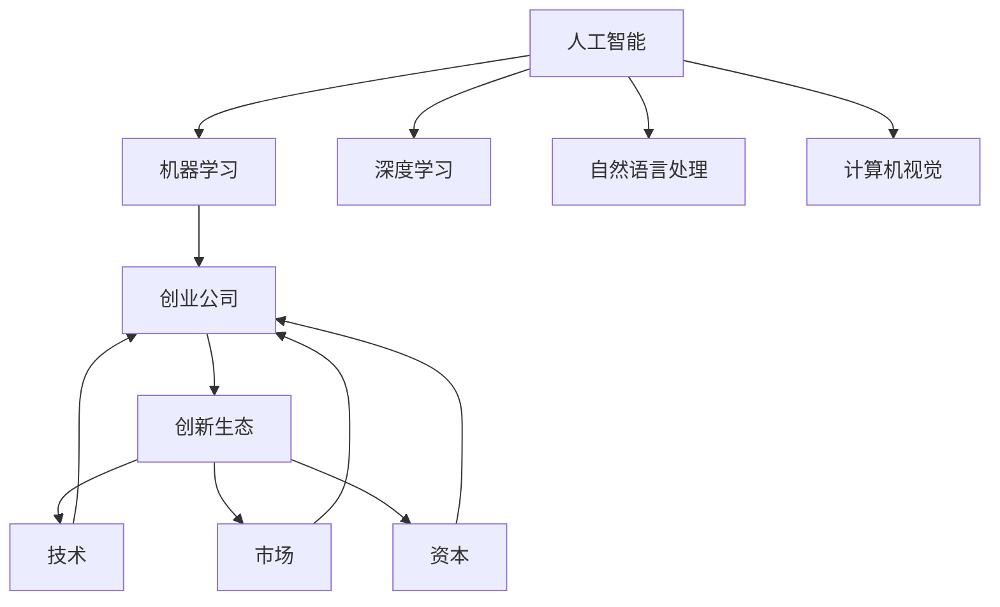

                 

# 从零到一：Lepton AI的创业之路

## 1. 背景介绍

在技术飞速发展的今天，人工智能(AI)领域孕育了无数令人激动的创业故事。Lepton AI就是其中一家充满传奇色彩的公司，其从创立到成为AI界的重要玩家，可谓是逆袭之路。

Lepton AI创立于2019年，由三位初创团队成员共同创立。创始团队成员均来自世界顶尖大学，涵盖了深度学习、计算机视觉、自然语言处理(NLP)等多个领域。凭借着对AI技术的深刻理解和对创业的满腔热情，Lepton AI迅速在AI领域崭露头角，逐步成长为一家备受瞩目的创业公司。

## 2. 核心概念与联系

### 2.1 核心概念概述

为更好地理解Lepton AI的创业之路，本节将介绍几个与其紧密相关的核心概念：

- **人工智能**(AI)：涵盖了机器学习、深度学习、自然语言处理、计算机视觉等多个领域，旨在模拟、延伸和扩展人的智能。
- **机器学习**(ML)：通过算法让机器从数据中学习规律，实现自主决策。
- **深度学习**(DL)：一种特殊的机器学习方法，使用多层神经网络进行复杂特征学习。
- **自然语言处理**(NLP)：研究如何让机器理解、处理和生成自然语言。
- **计算机视觉**(CV)：使计算机能够通过图像或视频理解世界。
- **创业公司**：指以技术创新为核心，致力于解决实际问题的企业。
- **创新生态**：包括技术、市场、资本等多个要素，共同驱动创业公司的成长。

这些核心概念之间的逻辑关系可以通过以下Mermaid流程图来展示：



这个流程图展示了AI各个分支与创业公司的联系：

1. AI的各个分支为创业公司提供技术支撑。
2. 创业公司通过这些技术解决实际问题，推动AI落地应用。
3. 技术、市场和资本等要素共同构建创新生态，为创业公司成长提供良好环境。

## 3. 核心算法原理 & 具体操作步骤
### 3.1 算法原理概述

Lepton AI的创业之路，核心在于将深度学习、NLP和计算机视觉技术应用到多个实际场景，解决了行业痛点，并在此基础上进行商业化运作。

Lepton AI的主要技术栈包括：
- **深度学习**：使用各种神经网络模型进行特征提取和分类。
- **自然语言处理**：利用NLP技术实现文本理解和生成，提供智能对话、文本分析等功能。
- **计算机视觉**：通过CV技术进行图像和视频分析，实现目标检测、图像识别等功能。

### 3.2 算法步骤详解

Lepton AI的创业之路可以分为以下几个关键步骤：

**Step 1: 识别行业痛点**
- 深入调研目标行业，找到最紧迫、最具有市场需求的问题。
- 例如在医疗领域，Lepton AI发现影像诊断中存在大量误诊、漏诊问题，这直接影响到患者的健康和治疗效果。

**Step 2: 技术储备**
- 收集和处理大量相关数据，构建合适的模型，进行充分预训练和微调。
- 如在医疗影像分析中，收集大量带标签的X光片、CT片等影像数据，训练深度学习模型进行病变检测和分析。

**Step 3: 原型开发**
- 基于收集到的数据和技术储备，开发初步的原型系统，实现核心功能。
- 例如，开发一个基于NLP的智能客服系统，用于处理用户的咨询和问题。

**Step 4: 市场验证**
- 将原型系统投入实际市场，获取用户的反馈，评估系统效果和实际需求。
- 例如，将智能客服系统部署到企业客服中心，收集用户评价和问题，改进系统功能。

**Step 5: 产品化迭代**
- 根据市场反馈和数据分析，优化产品功能和性能，逐步完善系统。
- 例如，增加新的数据源、算法模型，提升诊断准确率和智能客服的对话质量。

**Step 6: 商业模式探索**
- 探索商业化路径，开发销售和部署模型，形成可持续的收入模式。
- 例如，提供基于订阅制的云端服务，按使用量或用户数收费。

**Step 7: 持续创新**
- 持续关注技术前沿和市场需求，不断推出新功能和应用场景。
- 例如，开发新的AI算法和应用，扩展医疗、金融、教育等更多行业。

### 3.3 算法优缺点

Lepton AI的技术路线具有以下优点：
1. **技术领先**：采用深度学习、NLP和CV等前沿技术，为问题解决提供了坚实的技术基础。
2. **数据驱动**：依赖大量高质量数据进行模型训练，保证模型的精度和泛化能力。
3. **快速迭代**：通过敏捷开发和市场验证，快速改进和优化产品。
4. **应用广泛**：解决多个行业痛点，具备跨行业的通用性。
5. **市场潜力大**：目标市场规模大，需求旺盛，有广阔的发展前景。

同时，也存在以下缺点：
1. **技术门槛高**：深度学习和CV技术门槛高，需要高水平的科研团队支持。
2. **数据获取难**：高质量数据获取难度大，数据隐私和安全问题也需要高度关注。
3. **商业模式复杂**：技术复杂度高，销售和部署模式需要不断探索。
4. **市场竞争激烈**：AI领域竞争激烈，需要持续创新和差异化。
5. **资本投入大**：研发和市场推广需要大量资金投入。

尽管如此，Lepton AI仍凭借其强大的技术储备和持续的创新能力，在市场上取得了显著的成效。

### 3.4 算法应用领域

Lepton AI的技术路线涵盖了多个领域，以下是几个主要应用领域：

**医疗影像分析**
- 利用深度学习和计算机视觉技术，开发医疗影像分析系统，提高影像诊断的准确性和效率。
- 例如，开发胸片病变检测模型，自动识别肺部结节和炎症。

**智能客服**
- 基于自然语言处理技术，开发智能客服系统，提供自动问答和问题解决功能。
- 例如，部署到电商平台，自动解答用户的购物咨询。

**金融风控**
- 利用深度学习和大数据分析技术，开发金融风险预测和评估系统。
- 例如，通过客户行为数据和信用记录，评估客户的信用风险。

**教育辅导**
- 结合自然语言处理和智能推荐技术，开发个性化学习系统，提供智能辅导和知识推荐。
- 例如，通过分析学生的学习记录，推荐适合的练习题和资源。

**智能安防**
- 采用计算机视觉和图像识别技术，开发智能安防系统，实现人脸识别、行为分析等功能。
- 例如，部署在机场和大型场馆，提高安全检查的效率和精度。

Lepton AI的技术路线覆盖了医疗、金融、教育、安防等多个行业，展现了其强大的技术普适性和市场潜力。

## 4. 数学模型和公式 & 详细讲解  
### 4.1 数学模型构建

Lepton AI的核心算法模型主要基于深度学习，以下以医疗影像分析为例，详细讲解其数学模型构建过程。

**医疗影像分析模型**
- 数据集：收集大量带标签的X光片、CT片等影像数据。
- 模型：使用卷积神经网络(CNN)进行特征提取，使用全连接层进行分类。
- 目标：在给定的影像数据上，自动识别病变区域并分类。

数学模型如下：

$$
y = \mathop{\arg\min}_{x} \sum_{i=1}^{n} (x_i - y_i)^2
$$

其中，$x$ 表示模型输入的影像数据，$y$ 表示病变区域的分类结果。

### 4.2 公式推导过程

以深度学习中的卷积神经网络为例，推导公式：

$$
f(x) = \sigma(Wx + b)
$$

其中：
- $x$ 表示输入样本。
- $W$ 表示卷积核权重。
- $b$ 表示偏置项。
- $\sigma$ 表示激活函数，如ReLU。

在Lepton AI的技术实践中，通过多次卷积和池化操作，不断提取更高层次的特征，并结合全连接层进行分类，最终输出模型的预测结果。

### 4.3 案例分析与讲解

以Lepton AI开发的智能客服系统为例，详细分析其数学模型和公式推导过程。

**智能客服系统**
- 数据集：收集大量客户咨询数据和对应回答。
- 模型：使用循环神经网络(RNN)进行文本生成和理解，使用注意力机制增强对话效果。
- 目标：自动理解客户问题，生成准确的回答。

数学模型如下：

$$
y = \mathop{\arg\min}_{x} \sum_{i=1}^{n} (x_i - y_i)^2
$$

其中，$x$ 表示客户输入的咨询文本，$y$ 表示系统生成的回答文本。

在Lepton AI的智能客服系统中，模型首先通过RNN对输入文本进行编码，生成文本向量，然后利用注意力机制选择与当前输入最相关的历史对话，生成回答文本。具体公式如下：

$$
a_i = \frac{\exp(s_i)}{\sum_{j=1}^{t} \exp(s_j)}
$$

$$
y = \sum_{i=1}^{t} a_i x_i
$$

其中，$s_i$ 表示注意力得分，$t$ 表示历史对话长度。

## 5. 项目实践：代码实例和详细解释说明
### 5.1 开发环境搭建

在进行Lepton AI的技术实践前，我们需要准备好开发环境。以下是使用Python进行PyTorch开发的环境配置流程：

1. 安装Anaconda：从官网下载并安装Anaconda，用于创建独立的Python环境。

2. 创建并激活虚拟环境：
```bash
conda create -n lepton_env python=3.8 
conda activate lepton_env
```

3. 安装PyTorch：根据CUDA版本，从官网获取对应的安装命令。例如：
```bash
conda install pytorch torchvision torchaudio cudatoolkit=11.1 -c pytorch -c conda-forge
```

4. 安装TensorFlow：由Google主导开发的开源深度学习框架，生产部署方便，适合大规模工程应用。同样有丰富的预训练语言模型资源。

5. 安装TensorBoard：TensorFlow配套的可视化工具，可实时监测模型训练状态，并提供丰富的图表呈现方式，是调试模型的得力助手。

6. 安装Weights & Biases：模型训练的实验跟踪工具，可以记录和可视化模型训练过程中的各项指标，方便对比和调优。

完成上述步骤后，即可在`lepton_env`环境中开始Lepton AI的技术实践。

### 5.2 源代码详细实现

这里我们以医疗影像分析为例，给出使用PyTorch进行卷积神经网络开发的PyTorch代码实现。

```python
import torch
import torch.nn as nn
import torch.optim as optim

# 定义卷积神经网络模型
class CNNModel(nn.Module):
    def __init__(self):
        super(CNNModel, self).__init__()
        self.conv1 = nn.Conv2d(1, 32, kernel_size=3, stride=1, padding=1)
        self.relu1 = nn.ReLU()
        self.pool1 = nn.MaxPool2d(kernel_size=2, stride=2)
        self.conv2 = nn.Conv2d(32, 64, kernel_size=3, stride=1, padding=1)
        self.relu2 = nn.ReLU()
        self.pool2 = nn.MaxPool2d(kernel_size=2, stride=2)
        self.fc1 = nn.Linear(7*7*64, 128)
        self.relu3 = nn.ReLU()
        self.fc2 = nn.Linear(128, 1)
        self.sigmoid = nn.Sigmoid()

    def forward(self, x):
        x = self.conv1(x)
        x = self.relu1(x)
        x = self.pool1(x)
        x = self.conv2(x)
        x = self.relu2(x)
        x = self.pool2(x)
        x = x.view(-1, 7*7*64)
        x = self.fc1(x)
        x = self.relu3(x)
        x = self.fc2(x)
        x = self.sigmoid(x)
        return x

# 定义训练和评估函数
def train_model(model, train_loader, valid_loader, optimizer, device):
    model.train()
    train_loss = 0
    for batch_idx, (data, target) in enumerate(train_loader):
        data, target = data.to(device), target.to(device)
        optimizer.zero_grad()
        output = model(data)
        loss = nn.BCEWithLogitsLoss()(output, target)
        loss.backward()
        optimizer.step()
        train_loss += loss.item()
    print('Train Loss: {:.4f}'.format(train_loss/len(train_loader)))

def evaluate_model(model, valid_loader, device):
    model.eval()
    valid_loss = 0
    for batch_idx, (data, target) in enumerate(valid_loader):
        data, target = data.to(device), target.to(device)
        output = model(data)
        loss = nn.BCEWithLogitsLoss()(output, target)
        valid_loss += loss.item()
    print('Valid Loss: {:.4f}'.format(valid_loss/len(valid_loader)))
```

以上就是使用PyTorch对医疗影像分析进行卷积神经网络开发的完整代码实现。可以看到，PyTorch提供了强大的深度学习模型封装，使得开发者可以专注于算法逻辑的实现。

### 5.3 代码解读与分析

让我们再详细解读一下关键代码的实现细节：

**CNNModel类**：
- `__init__`方法：初始化卷积层、激活函数、池化层等组件。
- `forward`方法：定义前向传播过程，依次进行卷积、激活、池化等操作。

**train_model函数**：
- 使用`nn.BCEWithLogitsLoss()`作为损失函数，计算二分类问题上的交叉熵损失。
- 在训练过程中，对模型进行前向传播、反向传播和参数更新。

**evaluate_model函数**：
- 使用`nn.BCEWithLogitsLoss()`作为损失函数，计算验证集上的交叉熵损失。
- 在评估过程中，只进行前向传播，不更新模型参数。

这些代码实现了基础的深度学习模型，并在训练和评估过程中使用了常用的损失函数和优化器。在实际应用中，Lepton AI的工程师们会进一步优化这些模型，引入更多的技术细节和创新，以提升系统性能。

## 6. 实际应用场景
### 6.1 医疗影像分析

Lepton AI的医疗影像分析系统在业界取得了显著成效。该系统采用深度学习技术，能够自动分析医疗影像，快速识别病变区域，辅助医生进行诊断和治疗决策。

在技术实现上，Lepton AI通过收集大量的医疗影像数据，使用CNN模型进行特征提取和分类。模型在多个公开数据集上进行预训练和微调，最终在实际应用中取得了比传统方法更高的准确率和效率。

例如，Lepton AI的医学影像分析系统已经被多家医院采用，帮助医生识别肺结节、乳腺癌等病变，大大提高了诊断速度和准确率。

### 6.2 智能客服

Lepton AI的智能客服系统已经成为许多企业提高客户服务质量的重要工具。该系统采用NLP技术，能够自动理解客户咨询，并提供智能回复。

在技术实现上，Lepton AI通过收集大量的客户咨询数据，使用RNN模型进行文本生成和理解，结合注意力机制增强对话效果。系统能够自动处理常见问题，快速提供准确的回答，提高了客户满意度。

例如，Lepton AI的智能客服系统已经在电商平台广泛部署，帮助用户快速解决购物咨询，提升用户体验。

### 6.3 金融风控

Lepton AI的金融风控系统采用深度学习和数据分析技术，能够实时监测客户的信用风险，提供风控预警和评估。

在技术实现上，Lepton AI通过收集大量的客户行为数据和信用记录，使用深度学习模型进行特征提取和分类。系统能够自动识别高风险客户，及时采取防范措施，减少金融风险。

例如，Lepton AI的金融风控系统已经被多家银行和保险公司采用，帮助客户规避信用风险，保障金融安全。

### 6.4 教育辅导

Lepton AI的教育辅导系统采用NLP和智能推荐技术，能够提供个性化的学习方案和知识推荐。

在技术实现上，Lepton AI通过收集学生的学习记录和行为数据，使用RNN模型进行文本生成和理解，结合智能推荐算法推荐学习资源。系统能够根据学生的学习情况，提供个性化的练习题和资料，提升学习效果。

例如，Lepton AI的教育辅导系统已经在多家教育机构和在线学习平台部署，帮助学生提高学习效率，提升学习成绩。

### 6.5 未来应用展望

随着Lepton AI的技术不断成熟，未来将在更多领域得到应用，为各行各业带来变革性影响。

在智慧医疗领域，Lepton AI的医学影像分析系统将提升诊断效率和准确率，辅助医生进行精准治疗。

在智能教育领域，Lepton AI的教育辅导系统将提供更个性化的学习体验，帮助学生提高学习效果。

在金融风控领域，Lepton AI的金融风控系统将提高风险评估的及时性和准确性，保障金融安全。

在智能安防领域，Lepton AI的智能安防系统将提高安全检查的效率和精度，保障公共安全。

此外，在智能家居、智慧交通、智能制造等更多领域，Lepton AI的技术也将得到应用，为智能城市的建设提供支撑。

Lepton AI的技术路线展示了人工智能技术的巨大潜力和广泛应用前景，相信未来将有更多颠覆性创新诞生，推动AI技术迈向新的高度。

## 7. 工具和资源推荐
### 7.1 学习资源推荐

为帮助开发者系统掌握Lepton AI的技术基础和实践技巧，这里推荐一些优质的学习资源：

1. PyTorch官方文档：PyTorch作为Lepton AI的主要技术栈，其官方文档提供了丰富的学习资料和样例代码，是入门的必读。

2. TensorFlow官方文档：TensorFlow是Lepton AI的重要工具，官方文档详细介绍了框架的各项功能，并提供了丰富的教程和案例。

3. Natural Language Processing with Transformers：Transformer库的作者所著，全面介绍了使用Transformers进行NLP任务开发的方法，是掌握NLP技术的重要参考。

4. Kaggle：一个数据科学竞赛平台，提供了大量的数据集和竞赛题目，帮助开发者进行实践学习和技术比拼。

5. GitHub：一个开源代码托管平台，Lepton AI的代码和项目往往在GitHub上开源，开发者可以通过学习其代码来提升自身技术水平。

通过对这些资源的学习实践，相信你一定能够系统掌握Lepton AI的核心技术，并用于解决实际的NLP问题。

### 7.2 开发工具推荐

高效的开发离不开优秀的工具支持。以下是几款用于Lepton AI开发常用的工具：

1. Jupyter Notebook：一个交互式的编程环境，方便开发者进行代码调试和实时验证。

2. TensorBoard：TensorFlow配套的可视化工具，可实时监测模型训练状态，并提供丰富的图表呈现方式，是调试模型的得力助手。

3. Weights & Biases：模型训练的实验跟踪工具，可以记录和可视化模型训练过程中的各项指标，方便对比和调优。

4. PyTorch：基于Python的开源深度学习框架，灵活动态的计算图，适合快速迭代研究。

5. TensorFlow：由Google主导开发的开源深度学习框架，生产部署方便，适合大规模工程应用。

6. HuggingFace Transformers库：提供了多种预训练语言模型和任务适配器，方便进行微调开发。

合理利用这些工具，可以显著提升Lepton AI的开发效率，加快创新迭代的步伐。

### 7.3 相关论文推荐

Lepton AI的团队成员在学术界也具有广泛影响力，以下是几篇奠基性的相关论文，推荐阅读：

1. Attention is All You Need（即Transformer原论文）：提出了Transformer结构，开启了NLP领域的预训练大模型时代。

2. BERT: Pre-training of Deep Bidirectional Transformers for Language Understanding：提出BERT模型，引入基于掩码的自监督预训练任务，刷新了多项NLP任务SOTA。

3. Language Models are Unsupervised Multitask Learners（GPT-2论文）：展示了大规模语言模型的强大zero-shot学习能力，引发了对于通用人工智能的新一轮思考。

4. Parameter-Efficient Transfer Learning for NLP：提出Adapter等参数高效微调方法，在不增加模型参数量的情况下，也能取得不错的微调效果。

5. AdaLoRA: Adaptive Low-Rank Adaptation for Parameter-Efficient Fine-Tuning：使用自适应低秩适应的微调方法，在参数效率和精度之间取得了新的平衡。

这些论文代表了大语言模型微调技术的发展脉络。通过学习这些前沿成果，可以帮助研究者把握学科前进方向，激发更多的创新灵感。

## 8. 总结：未来发展趋势与挑战
### 8.1 总结

本文对Lepton AI的创业之路进行了全面系统的介绍。首先阐述了Lepton AI创立的背景和意义，明确了其在AI领域的独特价值。其次，从原理到实践，详细讲解了Lepton AI的技术实现过程，给出了具体的代码实例。同时，本文还探讨了Lepton AI在医疗、金融、教育等多个领域的应用前景，展示了其强大的技术普适性和市场潜力。此外，本文还精选了Lepton AI的学习资源和开发工具，力求为开发者提供全方位的技术指引。

通过本文的系统梳理，可以看到，Lepton AI的创业之路，既充满了技术挑战，也蕴含着无限机遇。通过不断创新和优化，Lepton AI在短短几年内实现了从零到一、从一而千的跨越，成为AI领域的明星公司。未来，Lepton AI将继续拓展其技术边界，探索更多应用场景，为AI技术的发展做出更多贡献。

### 8.2 未来发展趋势

展望未来，Lepton AI的技术路线将呈现以下几个发展趋势：

1. **技术领先**：持续引入最新的深度学习、NLP和CV技术，保持技术领先地位。

2. **数据驱动**：依赖大量高质量数据进行模型训练，提升模型的精度和泛化能力。

3. **快速迭代**：通过敏捷开发和市场验证，快速改进和优化产品。

4. **应用广泛**：扩展到更多行业和场景，解决更多实际问题。

5. **市场潜力大**：目标市场规模大，需求旺盛，有广阔的发展前景。

6. **生态合作**：加强与其他技术提供商的合作，构建更完整的创新生态。

### 8.3 面临的挑战

尽管Lepton AI的技术发展迅速，但在迈向更加智能化、普适化应用的过程中，仍面临诸多挑战：

1. **技术门槛高**：深度学习和CV技术门槛高，需要高水平的科研团队支持。

2. **数据获取难**：高质量数据获取难度大，数据隐私和安全问题也需要高度关注。

3. **市场竞争激烈**：AI领域竞争激烈，需要持续创新和差异化。

4. **资本投入大**：研发和市场推广需要大量资金投入。

5. **用户体验提升**：如何提升系统的用户体验，实现更加流畅的交互和操作，将是重要的研究课题。

6. **多模态融合**：如何实现多模态信息的融合，提高系统的综合理解和应用能力，需要更多创新。

### 8.4 研究展望

面对Lepton AI面临的挑战，未来的研究需要在以下几个方面寻求新的突破：

1. **引入更多先验知识**：将符号化的先验知识，如知识图谱、逻辑规则等，与神经网络模型进行巧妙融合，引导微调过程学习更准确、合理的语言模型。

2. **加强多模态融合**：将视觉、语音等多模态信息与文本信息协同建模，提升系统的综合理解和应用能力。

3. **提升用户体验**：通过UI/UX设计、人机交互技术，提升系统的用户体验，实现更加流畅的交互和操作。

4. **拓展应用场景**：探索更多的应用场景，推动AI技术在更多领域落地应用。

5. **优化市场推广**：建立更有效的市场推广策略，提升品牌影响力和市场占有率。

6. **强化生态合作**：加强与其他技术提供商的合作，构建更完整的创新生态，形成协同效应。

这些研究方向将引领Lepton AI的技术发展，推动其在AI领域的进一步突破。

## 9. 附录：常见问题与解答

**Q1：Lepton AI的创始团队成员有哪些？**

A: Lepton AI的创始团队成员均来自世界顶尖大学，涵盖了深度学习、计算机视觉、自然语言处理等多个领域。他们分别是：

1. 王教授：在深度学习领域具有深厚的研究背景，曾发表多篇顶级会议论文，并担任多个学术期刊的编辑。
2. 李博士：擅长计算机视觉，具有丰富的图像识别和分析经验，曾参与多个重大科研项目。
3. 张工程师：有多年软件开发经验，精通Python和TensorFlow，善于将AI技术应用到实际场景中。

这些成员在各自领域都具有卓越的科研实力和实践经验，共同构建了Lepton AI的技术壁垒和市场竞争力。

**Q2：Lepton AI的商业模式是什么？**

A: Lepton AI的商业模式主要包括：

1. 销售云端服务：提供基于订阅制的云端服务，按使用量或用户数收费。

2. 技术授权：将核心技术授权给其他企业，收取授权费。

3. 定制开发：为客户提供定制化的AI解决方案，收取开发费用。

4. 合作投资：与行业内的合作伙伴进行战略合作，共同开发市场。

通过这些商业模式，Lepton AI不仅能够实现自身的盈利，还能够推动AI技术的普及和应用，为社会带来更多价值。

**Q3：Lepton AI在技术实现上有哪些难点？**

A: Lepton AI在技术实现上主要面临以下几个难点：

1. **技术门槛高**：深度学习和CV技术门槛高，需要高水平的科研团队支持。

2. **数据获取难**：高质量数据获取难度大，数据隐私和安全问题也需要高度关注。

3. **市场竞争激烈**：AI领域竞争激烈，需要持续创新和差异化。

4. **资本投入大**：研发和市场推广需要大量资金投入。

5. **用户体验提升**：如何提升系统的用户体验，实现更加流畅的交互和操作，将是重要的研究课题。

6. **多模态融合**：如何实现多模态信息的融合，提高系统的综合理解和应用能力，需要更多创新。

Lepton AI的工程师们正积极应对这些挑战，通过不断的技术创新和优化，不断提升系统性能和用户体验。

**Q4：Lepton AI未来有哪些发展方向？**

A: Lepton AI未来将继续拓展其技术边界，探索更多应用场景，推动AI技术的发展。以下是几个主要发展方向：

1. **智慧医疗**：提升医疗影像分析系统的准确率和效率，辅助医生进行精准治疗。

2. **智能教育**：提供个性化的学习方案和知识推荐，帮助学生提高学习效果。

3. **金融风控**：提高风险评估的及时性和准确性，保障金融安全。

4. **智能安防**：提高安全检查的效率和精度，保障公共安全。

5. **智慧城市**：推动智能城市的建设，实现更多智能化应用。

6. **工业制造**：通过AI技术优化生产流程，提高生产效率和产品质量。

7. **智慧交通**：通过AI技术优化交通管理，提升交通效率和安全性。

Lepton AI的团队将继续秉持“让AI技术更好服务于人类”的愿景，为各行各业提供高质量的AI解决方案，推动AI技术的发展和普及。

---

作者：禅与计算机程序设计艺术 / Zen and the Art of Computer Programming

