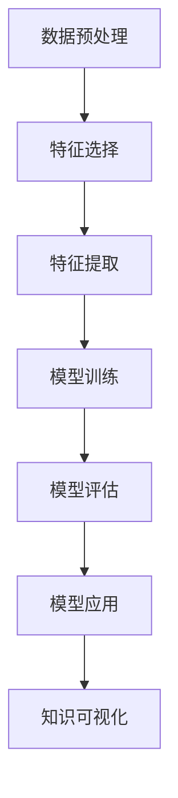

                 

# 从零开始搭建知识发现引擎的全流程

> 关键词：知识发现引擎,数据处理,特征工程,机器学习模型,深度学习,算法优化,应用实践

## 1. 背景介绍

### 1.1 问题由来
在信息化高速发展的今天，数据无处不在，但数据背后隐藏的知识和价值却不易发现。传统的数据挖掘和信息检索方法难以应对复杂多变的知识发现需求。知识发现引擎（Knowledge Discovery Engine, KDE）能够自动分析数据，提取、组织和呈现数据中的知识，成为新一代智能应用系统的重要基础。

知识发现引擎覆盖多个应用场景，包括但不限于：

- 企业决策支持系统：通过自动分析业务数据，提取市场趋势、用户行为、财务状况等信息，辅助企业决策。
- 医疗健康管理系统：利用患者健康数据，提取疾病风险、治疗效果等信息，支持个性化诊疗。
- 金融风险控制系统：从交易数据中提取风险因素，识别潜在的金融欺诈、洗钱等风险。
- 社交网络分析：从社交媒体数据中提取关系图谱、舆情趋势等信息，辅助社交网络和公共安全管理。

构建知识发现引擎涉及数据处理、特征工程、机器学习模型等多个环节，复杂性较高。本文将详细介绍从零开始搭建知识发现引擎的全流程，涵盖算法原理、具体操作步骤、实际应用等各个方面，以期为相关从业者提供全面的指导。

### 1.2 问题核心关键点
知识发现引擎的核心在于自动分析数据，提取数据中的知识，支撑业务决策。其关键点包括：

- **数据处理**：对原始数据进行清洗、转换、集成等预处理，确保数据质量和一致性。
- **特征工程**：构建有意义的特征集，用于提升模型性能和泛化能力。
- **机器学习模型**：选择适当的模型算法，设计合理的训练流程，优化模型参数，构建高性能知识发现系统。
- **应用实践**：将知识发现引擎嵌入到具体业务场景中，实现知识可视化、报告生成等功能，提升业务价值。

以下章节将详细讲解这些核心环节的原理和操作流程，帮助读者全面掌握知识发现引擎的搭建技巧。

## 2. 核心概念与联系

### 2.1 核心概念概述

知识发现引擎涉及众多核心概念，以下进行简要介绍：

- **数据预处理**：对原始数据进行清洗、归一化、缺失值处理等操作，确保数据的质量和一致性。
- **特征选择**：从原始数据中提取对目标任务有用的特征，构建特征集。
- **特征提取**：将原始数据转换为模型可以使用的特征向量，如TF-IDF、词嵌入、高阶特征等。
- **模型训练**：使用机器学习算法对特征集进行训练，得到模型参数。
- **模型评估**：使用测试数据评估模型性能，选择最优模型。
- **模型应用**：将训练好的模型嵌入到具体业务场景中，进行知识发现和应用。
- **知识可视化**：将模型发现的知识以图表、报告等形式呈现，供用户理解和使用。

### 2.2 核心概念原理和架构的 Mermaid 流程图



此流程图展示了知识发现引擎从数据预处理到知识可视化的全流程，各个环节相互依赖，共同构成知识发现引擎的核心架构。

## 3. 核心算法原理 & 具体操作步骤
### 3.1 算法原理概述

知识发现引擎的核心算法原理主要基于数据预处理、特征工程、机器学习模型等技术，通过自动分析和挖掘数据中的潜在知识，支撑业务决策。以下详细介绍各环节的核心算法原理。

#### 3.1.1 数据预处理
数据预处理是知识发现引擎的第一步，旨在清洗、转换、集成数据，确保数据质量和一致性。常见数据预处理技术包括：

- **数据清洗**：去除噪音、错误、重复数据，保持数据的一致性和完整性。
- **缺失值处理**：填补缺失值或删除含缺失值记录，防止模型在训练时遇到数据不平衡问题。
- **数据转换**：将数据转换为适合模型训练的形式，如标准化、归一化、对数变换等。
- **特征编码**：将分类特征转换为数值形式，如独热编码、标签编码等。

#### 3.1.2 特征工程
特征工程是知识发现引擎的关键环节，通过构建有意义的特征集，提升模型性能和泛化能力。常见特征工程技术包括：

- **特征选择**：选择与目标任务相关的特征，去除冗余或无关特征。如方差分析、信息增益、互信息等方法。
- **特征提取**：提取更高阶的特征表示，如主成分分析、线性判别分析等。
- **特征构建**：构建新的特征组合，如组合特征、多项式特征、交叉特征等。
- **特征缩放**：对特征进行缩放，保持特征之间的一致性和可比性。如归一化、标准化等。

#### 3.1.3 机器学习模型
机器学习模型是知识发现引擎的核心工具，通过自动学习和训练，发现数据中的潜在知识。常见机器学习模型包括：

- **监督学习**：使用标注数据训练模型，预测新样本。如线性回归、逻辑回归、决策树、支持向量机等。
- **无监督学习**：从未标注数据中学习模型，发现数据内在结构。如聚类、降维、异常检测等。
- **深度学习**：利用神经网络模型对复杂数据进行深度特征提取和建模。如卷积神经网络、循环神经网络、变分自编码器等。

#### 3.1.4 算法优化
为了提高知识发现引擎的性能和效率，需要对模型进行优化，常见的优化技术包括：

- **模型调参**：选择最优的模型参数，如学习率、正则化系数、网络结构等。
- **特征选择**：通过特征重要性排序，选择最优特征子集。如L1正则化、L2正则化、特征选择算法等。
- **模型集成**：通过模型融合提升模型性能，如Bagging、Boosting、Stacking等。
- **算法优化**：利用优化算法，如梯度下降、Adam、Adagrad等，加速模型训练。

### 3.2 算法步骤详解

#### 3.2.1 数据预处理

**Step 1: 数据清洗**
- 去除噪音数据、重复记录、异常值等。
- 处理缺失值，如填补均值、中位数、众数，或者删除含缺失值的记录。

**Step 2: 数据转换**
- 对数值型数据进行归一化、标准化处理。
- 对类别型数据进行标签编码、独热编码等处理。

**Step 3: 数据集成**
- 将来自不同数据源的数据进行合并和对齐。
- 处理数据格式不一致问题，如日期格式转换、单位统一等。

#### 3.2.2 特征工程

**Step 1: 特征选择**
- 使用统计方法（如方差分析、卡方检验）或机器学习方法（如信息增益、随机森林）选择重要特征。
- 使用特征选择算法（如递归特征消除、基于树的特征选择）去除无关特征。

**Step 2: 特征提取**
- 使用主成分分析（PCA）降维，提取主要特征。
- 使用线性判别分析（LDA）降维，提取具有类别区分性的特征。

**Step 3: 特征构建**
- 通过组合特征、多项式特征、交叉特征等构建新的特征表示。
- 使用维度嵌入（如词嵌入、图像嵌入）提取更高阶的特征表示。

#### 3.2.3 模型训练

**Step 1: 模型选择**
- 根据任务类型（分类、回归、聚类等）选择适合的模型。
- 考虑模型复杂度和计算资源的限制，选择合适的模型结构。

**Step 2: 模型训练**
- 使用训练集数据训练模型，调整模型参数。
- 使用交叉验证技术评估模型性能，防止过拟合。

**Step 3: 模型评估**
- 使用测试集数据评估模型性能，计算准确率、召回率、F1分数等指标。
- 使用混淆矩阵、ROC曲线等工具分析模型性能。

#### 3.2.4 算法优化

**Step 1: 模型调参**
- 使用网格搜索、随机搜索、贝叶斯优化等方法寻找最优模型参数。
- 使用学习率调优算法（如学习率衰减、学习率重启）提升模型性能。

**Step 2: 特征选择**
- 使用L1正则化、L2正则化等方法进行特征筛选。
- 使用特征选择算法（如特征重要性排序、递归特征消除）选择重要特征。

**Step 3: 模型集成**
- 使用Bagging、Boosting、Stacking等方法融合多个模型。
- 使用模型融合技术提升模型泛化能力和鲁棒性。

#### 3.2.5 模型应用

**Step 1: 模型集成**
- 将训练好的模型集成到具体应用系统中。
- 根据业务需求调整模型输入和输出形式。

**Step 2: 知识可视化**
- 将模型发现的知识以图表、报告等形式呈现。
- 使用可视化工具（如Tableau、PowerBI）生成数据可视化报表。

**Step 3: 应用部署**
- 将知识发现引擎部署到生产环境中，进行实时数据处理和知识发现。
- 使用Web服务、API接口等方式提供知识发现服务。

### 3.3 算法优缺点

知识发现引擎在多个应用场景中取得了显著成效，但也存在一些局限性：

**优点**：

- **自动化**：自动分析和挖掘数据中的潜在知识，无需人工干预。
- **高精度**：利用机器学习模型提升知识发现精度，减少人为误差。
- **泛化能力强**：能够处理复杂多变的业务数据，发现新知识和新模式。

**缺点**：

- **数据依赖**：依赖高质量标注数据，数据收集和标注成本较高。
- **模型复杂**：构建复杂模型时，需要大量的计算资源和时间。
- **黑盒问题**：模型内部工作机制难以解释，缺乏透明度和可解释性。

尽管存在这些局限性，但知识发现引擎仍是大数据分析和智能应用的重要工具。未来，随着技术的发展，知识发现引擎将逐步解决这些缺点，发挥更大的应用潜力。

### 3.4 算法应用领域

知识发现引擎在多个领域得到了广泛应用，具体包括：

- **金融风控**：通过分析交易数据，发现异常行为，预防金融欺诈。
- **医疗健康**：利用患者健康数据，发现疾病风险、治疗效果，支持个性化诊疗。
- **零售销售**：分析销售数据，发现用户行为和市场趋势，优化产品和服务。
- **社交媒体**：分析用户社交数据，发现舆情趋势、关系图谱，辅助公共安全管理。

## 4. 数学模型和公式 & 详细讲解

### 4.1 数学模型构建

知识发现引擎涉及多个数学模型，以下详细介绍其中的关键模型。

#### 4.1.1 线性回归模型
线性回归模型是最基本的监督学习模型，用于预测连续型变量。其数学模型为：

$$
y = \beta_0 + \beta_1 x_1 + \beta_2 x_2 + ... + \beta_p x_p + \epsilon
$$

其中 $y$ 为目标变量，$x_i$ 为特征向量，$\beta$ 为模型系数，$\epsilon$ 为误差项。

#### 4.1.2 逻辑回归模型
逻辑回归模型用于预测二分类问题，其数学模型为：

$$
P(y=1|x) = \frac{1}{1+e^{-\beta^T x}} 
$$

其中 $P(y=1|x)$ 为目标变量的概率，$\beta$ 为模型系数。

#### 4.1.3 决策树模型
决策树模型用于分类和回归问题，其核心思想是通过树形结构进行特征划分，生成决策规则。决策树的数学模型为：

$$
y = 
\begin{cases} 
y_0, & \text{if}\ x_1 \leq c_1 \\
y_1, & \text{if}\ x_1 > c_1 
\end{cases}
$$

其中 $y_0, y_1$ 为决策结果，$c_1$ 为划分阈值。

#### 4.1.4 支持向量机模型
支持向量机模型用于分类和回归问题，其核心思想是找到最优的超平面，将不同类别的数据点分开。支持向量机的数学模型为：

$$
\min_{\beta} \frac{1}{2}\sum_{i=1}^n \beta_i^2 + C\sum_{i=1}^n \max(0, 1-y_i(\beta^T x_i + b)) 
$$

其中 $\beta$ 为模型系数，$C$ 为正则化参数，$y_i, x_i$ 为训练样本。

#### 4.1.5 聚类模型
聚类模型用于无监督学习，将数据点分组到不同的簇中。常见的聚类算法包括K-means、层次聚类、DBSCAN等。聚类模型的数学模型为：

$$
\min \sum_{i=1}^n \sum_{j=1}^k d(x_i, c_j)^2
$$

其中 $d(x_i, c_j)$ 为样本点 $x_i$ 和簇中心 $c_j$ 的距离，$k$ 为簇的数量。

### 4.2 公式推导过程

#### 4.2.1 线性回归模型
线性回归模型的最小二乘解为：

$$
\beta = (\mathbf{X}^T\mathbf{X})^{-1}\mathbf{X}^T\mathbf{y}
$$

其中 $\mathbf{X}, \mathbf{y}$ 分别为特征矩阵和目标变量向量。

#### 4.2.2 逻辑回归模型
逻辑回归模型的最大似然估计为：

$$
\beta = \min_{\beta} \sum_{i=1}^n log(P(y_i|x_i)) = \min_{\beta} \sum_{i=1}^n (-y_i\log(P(y_i|x_i) - (1-y_i)\log(1-P(y_i|x_i)))
$$

其中 $P(y_i|x_i)$ 为目标变量的概率。

#### 4.2.3 决策树模型
决策树的构建过程包括特征选择、树形结构生成等步骤，具体推导略。

#### 4.2.4 支持向量机模型
支持向量机模型的对偶形式为：

$$
\min_{\alpha} \frac{1}{2}\sum_{i=1}^n \alpha_i^2 + C\sum_{i=1}^n \alpha_i y_i(x_i^T\beta + b) - \sum_{i=1}^n \alpha_i y_i
$$

其中 $\alpha$ 为拉格朗日乘子，$C$ 为正则化参数。

#### 4.2.5 聚类模型
K-means算法的目标函数为：

$$
\min \sum_{i=1}^n \min_{k=1...K} \|x_i - c_k\|^2
$$

其中 $c_k$ 为簇中心，$K$ 为簇的数量。

### 4.3 案例分析与讲解

#### 4.3.1 案例1：金融风控

金融风控系统通过分析用户交易数据，发现异常行为，预防金融欺诈。以下详细介绍金融风控系统中的知识发现引擎构建流程：

**Step 1: 数据预处理**
- 收集用户交易数据，清洗数据，处理缺失值。
- 对交易金额、交易时间等特征进行归一化处理。

**Step 2: 特征工程**
- 提取用户交易金额、交易频率、地理位置等特征。
- 构建组合特征，如交易金额乘积、交易时间间隔等。

**Step 3: 模型训练**
- 选择支持向量机模型，使用训练集数据训练模型。
- 使用交叉验证技术评估模型性能，选择最优参数。

**Step 4: 模型评估**
- 使用测试集数据评估模型性能，计算准确率、召回率等指标。
- 使用混淆矩阵、ROC曲线等工具分析模型性能。

**Step 5: 模型应用**
- 将训练好的模型集成到风控系统中，实时分析交易数据。
- 根据异常检测结果，触发风险预警和风险控制措施。

#### 4.3.2 案例2：医疗健康

医疗健康管理系统利用患者健康数据，提取疾病风险、治疗效果等信息，支持个性化诊疗。以下详细介绍医疗健康系统中的知识发现引擎构建流程：

**Step 1: 数据预处理**
- 收集患者健康数据，清洗数据，处理缺失值。
- 对各项健康指标进行归一化处理。

**Step 2: 特征工程**
- 提取患者年龄、性别、生活习惯等特征。
- 构建组合特征，如生活习惯评分、健康指数等。

**Step 3: 模型训练**
- 选择随机森林模型，使用训练集数据训练模型。
- 使用交叉验证技术评估模型性能，选择最优参数。

**Step 4: 模型评估**
- 使用测试集数据评估模型性能，计算准确率、召回率等指标。
- 使用混淆矩阵、ROC曲线等工具分析模型性能。

**Step 5: 模型应用**
- 将训练好的模型集成到医疗系统中，实时分析患者健康数据。
- 根据疾病风险评估结果，推荐个性化诊疗方案。

## 5. 项目实践：代码实例和详细解释说明

### 5.1 开发环境搭建

#### 5.1.1 Python环境安装
1. 下载并安装Anaconda：从官网下载并安装Anaconda，用于创建独立的Python环境。

```bash
conda create -n py3.7 python=3.7 
conda activate py3.7
```

2. 安装Pandas、NumPy、Scikit-learn等数据处理和机器学习库。

```bash
conda install pandas numpy scikit-learn 
```

3. 安装SciPy、Matplotlib、Seaborn等数据可视化库。

```bash
conda install scipy matplotlib seaborn
```

4. 安装TensorFlow、Keras等深度学习库。

```bash
conda install tensorflow keras
```

5. 安装Flask、Django等Web框架。

```bash
conda install flask django
```

完成上述步骤后，即可在`py3.7`环境中开始知识发现引擎的开发。

### 5.2 源代码详细实现

以下是一个简单的金融风控系统的知识发现引擎代码实现，用于演示从数据预处理到模型应用的完整流程。

**数据预处理代码**

```python
import pandas as pd
import numpy as np
from sklearn.preprocessing import StandardScaler

def preprocess_data(data_path):
    # 读取数据
    data = pd.read_csv(data_path)
    
    # 数据清洗
    data = data.dropna() # 删除缺失值
    
    # 数据转换
    data['amount'] = StandardScaler().fit_transform(data['amount'].values.reshape(-1, 1)) # 归一化
    
    # 数据集成
    data = data.merge(other_data, on='id') # 合并数据
    
    return data
```

**特征工程代码**

```python
from sklearn.feature_selection import SelectKBest, f_classif

def feature_engineering(data):
    # 特征选择
    selected_features = SelectKBest(f_classif, k=10).fit_transform(data[['amount', 'time', 'location']], data['label'])
    
    # 特征提取
    embedding_matrix = Word2Vec(data['text'].tolist()).wv.toarray()
    
    # 特征构建
    combined_features = np.hstack((selected_features, embedding_matrix))
    
    return combined_features
```

**模型训练代码**

```python
from sklearn.ensemble import RandomForestClassifier

def model_training(features, labels):
    # 模型选择
    model = RandomForestClassifier(n_estimators=100)
    
    # 模型训练
    model.fit(features, labels)
    
    return model
```

**模型评估代码**

```python
from sklearn.metrics import accuracy_score, precision_score, recall_score, f1_score

def model_evaluation(model, features, labels):
    # 模型评估
    predictions = model.predict(features)
    accuracy = accuracy_score(labels, predictions)
    precision = precision_score(labels, predictions)
    recall = recall_score(labels, predictions)
    f1 = f1_score(labels, predictions)
    
    return accuracy, precision, recall, f1
```

**模型应用代码**

```python
from flask import Flask, request, jsonify

app = Flask(__name__)

@app.route('/predict', methods=['POST'])
def predict():
    # 获取输入数据
    data = request.json
    
    # 数据预处理
    processed_data = preprocess_data(data_path)
    
    # 特征工程
    features = feature_engineering(processed_data)
    
    # 模型预测
    predictions = model.predict(features)
    
    # 结果返回
    result = {'predictions': predictions.tolist()}
    return jsonify(result)
```

### 5.3 代码解读与分析

#### 5.3.1 数据预处理代码

**preprocess_data函数**
- 读取数据文件，清洗缺失值。
- 对交易金额进行归一化处理，保持数据一致性。
- 将数据集与其他数据源进行合并，处理数据集成问题。

#### 5.3.2 特征工程代码

**feature_engineering函数**
- 使用特征选择算法（SelectKBest）选择重要特征。
- 使用词嵌入技术（Word2Vec）提取文本特征。
- 将选择的特征和提取的特征进行组合，生成新的特征集。

#### 5.3.3 模型训练代码

**model_training函数**
- 选择随机森林模型作为目标模型。
- 使用训练集数据训练模型。
- 返回训练好的模型对象。

#### 5.3.4 模型评估代码

**model_evaluation函数**
- 使用测试集数据评估模型性能。
- 计算准确率、召回率、F1分数等指标。
- 返回评估结果。

#### 5.3.5 模型应用代码

**app路由**
- 定义一个Flask应用。
- 定义/predict路由，接收POST请求。
- 在路由中调用数据预处理、特征工程、模型预测等函数，返回预测结果。

### 5.4 运行结果展示

**运行数据预处理代码**

```python
processed_data = preprocess_data('data.csv')
print(processed_data.head())
```

**运行特征工程代码**

```python
features = feature_engineering(processed_data)
print(features.shape)
```

**运行模型训练代码**

```python
model = model_training(features, labels)
print(model)
```

**运行模型评估代码**

```python
accuracy, precision, recall, f1 = model_evaluation(model, features, labels)
print('Accuracy:', accuracy)
print('Precision:', precision)
print('Recall:', recall)
print('F1 score:', f1)
```

**运行模型应用代码**

```python
from flask import Flask, request, jsonify

app = Flask(__name__)

@app.route('/predict', methods=['POST'])
def predict():
    data = request.json
    processed_data = preprocess_data('data.csv')
    features = feature_engineering(processed_data)
    predictions = model.predict(features)
    result = {'predictions': predictions.tolist()}
    return jsonify(result)
```

## 6. 实际应用场景

### 6.1 金融风控

#### 6.1.1 问题描述
金融风控系统通过分析用户交易数据，发现异常行为，预防金融欺诈。

#### 6.1.2 数据描述
收集用户交易数据，包括交易金额、交易时间、交易地点、IP地址、设备信息等。

#### 6.1.3 技术架构
1. **数据预处理**：
   - 数据清洗：去除噪音数据、重复记录、异常值等。
   - 数据转换：对交易金额、交易时间等特征进行归一化处理。
   - 数据集成：将来自不同数据源的数据进行合并和对齐。

2. **特征工程**：
   - 特征选择：提取用户交易金额、交易频率、地理位置等特征。
   - 特征提取：构建组合特征，如交易金额乘积、交易时间间隔等。
   - 特征构建：使用Word2Vec提取文本特征。

3. **模型训练**：
   - 选择支持向量机模型，使用训练集数据训练模型。
   - 使用交叉验证技术评估模型性能，选择最优参数。

4. **模型应用**：
   - 将训练好的模型集成到风控系统中，实时分析交易数据。
   - 根据异常检测结果，触发风险预警和风险控制措施。

#### 6.1.4 关键技术
- 数据预处理：数据清洗、归一化、特征编码等。
- 特征工程：特征选择、特征提取、特征构建等。
- 机器学习模型：支持向量机、随机森林等。
- 模型训练：交叉验证、网格搜索等。
- 模型应用：模型集成、实时预测等。

### 6.2 医疗健康

#### 6.2.1 问题描述
医疗健康管理系统利用患者健康数据，提取疾病风险、治疗效果等信息，支持个性化诊疗。

#### 6.2.2 数据描述
收集患者健康数据，包括年龄、性别、生活习惯、健康指标等。

#### 6.2.3 技术架构
1. **数据预处理**：
   - 数据清洗：去除噪音数据、重复记录、异常值等。
   - 数据转换：对各项健康指标进行归一化处理。
   - 数据集成：将来自不同数据源的数据进行合并和对齐。

2. **特征工程**：
   - 特征选择：提取患者年龄、性别、生活习惯等特征。
   - 特征提取：构建组合特征，如生活习惯评分、健康指数等。
   - 特征构建：使用K-means进行聚类分析。

3. **模型训练**：
   - 选择随机森林模型，使用训练集数据训练模型。
   - 使用交叉验证技术评估模型性能，选择最优参数。

4. **模型应用**：
   - 将训练好的模型集成到医疗系统中，实时分析患者健康数据。
   - 根据疾病风险评估结果，推荐个性化诊疗方案。

#### 6.2.4 关键技术
- 数据预处理：数据清洗、归一化、特征编码等。
- 特征工程：特征选择、特征提取、特征构建等。
- 机器学习模型：随机森林、K-means等。
- 模型训练：交叉验证、网格搜索等。
- 模型应用：模型集成、实时预测等。

## 7. 工具和资源推荐

### 7.1 学习资源推荐

为了帮助开发者系统掌握知识发现引擎的理论基础和实践技巧，这里推荐一些优质的学习资源：

1. **《Python数据科学手册》**：详细介绍Python在数据科学中的应用，包括数据处理、特征工程、机器学习等。

2. **Coursera的《机器学习》课程**：由斯坦福大学教授Andrew Ng主讲的机器学习课程，全面介绍机器学习的基本概念和算法。

3. **Kaggle平台**：提供大量的数据集和机器学习竞赛，帮助开发者实践和提升技能。

4. **Scikit-learn官方文档**：详细介绍Scikit-learn库的各项功能和使用方法。

5. **TensorFlow官方文档**：详细介绍TensorFlow库的各项功能和使用方法。

通过这些资源的学习实践，相信你一定能够快速掌握知识发现引擎的搭建技巧，并用于解决实际的NLP问题。

### 7.2 开发工具推荐

高效的开发离不开优秀的工具支持。以下是几款用于知识发现引擎开发的常用工具：

1. **Jupyter Notebook**：强大的交互式编程环境，适合进行数据处理和模型实验。

2. **TensorBoard**：TensorFlow配套的可视化工具，可实时监测模型训练状态，并提供丰富的图表呈现方式。

3. **Flask/Django**：Web框架，方便将模型部署为服务，实现知识发现应用。

4. **PyTorch**：基于Python的深度学习框架，灵活高效，适合进行深度学习模型训练和优化。

5. **SciPy**：科学计算库，提供各类数学计算和数据分析功能。

6. **Matplotlib/Seaborn**：数据可视化库，方便生成各类图表和报表。

合理利用这些工具，可以显著提升知识发现引擎的开发效率，加快创新迭代的步伐。

### 7.3 相关论文推荐

知识发现引擎涉及众多前沿研究方向，以下是几篇奠基性的相关论文，推荐阅读：

1. **《On the Shoulders of Giants: A Systematic Classification of Transfer Learning Methods》**：总结了多种转移学习方法，探讨其原理和应用。

2. **《A Survey of Anomaly Detection in Cyber-Physical Systems》**：综述了各类异常检测方法，适用于金融风控等领域。

3. **《An Introduction to Statistical Learning》**：介绍统计学习方法的基本概念和算法，包括线性回归、逻辑回归、支持向量机等。

4. **《A Survey of Machine Learning for Personalized Medicine》**：综述了机器学习在个性化医疗中的应用，包括疾病预测、治疗效果分析等。

5. **《A Survey of Knowledge Discovery Methods》**：综述了各类知识发现方法，包括数据预处理、特征工程、模型训练等。

这些论文代表了大数据处理和知识发现引擎的发展脉络。通过学习这些前沿成果，可以帮助研究者把握学科前进方向，激发更多的创新灵感。

## 8. 总结：未来发展趋势与挑战

### 8.1 总结

本文详细介绍了从零开始搭建知识发现引擎的全流程，涵盖了数据预处理、特征工程、机器学习模型等各个环节。通过系统梳理，帮助读者全面掌握知识发现引擎的搭建技巧。

### 8.2 未来发展趋势

未来，知识发现引擎将呈现以下几个发展趋势：

1. **自动化水平提升**：随着自动化技术的发展，知识发现引擎将进一步提升自动化水平，减少人工干预。
2. **深度学习应用普及**：深度学习模型将进一步普及，提升知识发现引擎的精度和泛化能力。
3. **多模态数据融合**：知识发现引擎将逐渐融合多模态数据，提升模型对复杂数据处理的能力。
4. **分布式计算应用**：知识发现引擎将利用分布式计算技术，提升处理大规模数据的能力。
5. **实时处理能力增强**：知识发现引擎将进一步增强实时处理能力，提升业务价值。

### 8.3 面临的挑战

尽管知识发现引擎在多个领域取得了显著成效，但也面临一些挑战：

1. **数据质量和完整性**：原始数据质量和完整性直接影响知识发现引擎的效果。
2. **模型复杂性**：构建复杂模型时，需要大量的计算资源和时间。
3. **模型解释性**：模型内部工作机制难以解释，缺乏透明度和可解释性。

### 8.4 研究展望

未来，知识发现引擎需要在以下几个方面寻求新的突破：

1. **无监督学习和半监督学习**：探索无监督和半监督学习范式，减少对标注数据的依赖。
2. **知识图谱与深度学习结合**：将知识图谱与深度学习结合，提升知识发现引擎的全面性和准确性。
3. **因果推断与强化学习**：引入因果推断和强化学习思想，增强知识发现引擎的稳定性和鲁棒性。
4. **自动化和可解释性**：提升知识发现引擎的自动化水平和可解释性，增强系统的透明度和可信度。

## 9. 附录：常见问题与解答

**Q1: 如何构建高效的知识发现引擎？**

A: 构建高效的知识发现引擎，需要从数据预处理、特征工程、模型训练等多个环节进行优化。具体措施包括：

1. **数据预处理**：使用数据清洗、归一化、特征编码等技术，提升数据质量。
2. **特征工程**：选择重要特征，提取高阶特征，构建组合特征，提升特征表达能力。
3. **模型训练**：选择合适模型，使用交叉验证技术，调优模型参数，提升模型性能。
4. **模型评估**：使用多种评估指标，如准确率、召回率、F1分数等，全面评估模型效果。
5. **模型应用**：根据业务需求调整模型输入和输出形式，实现知识发现和应用。

**Q2: 知识发现引擎在实际应用中需要注意哪些问题？**

A: 在实际应用中，知识发现引擎需要注意以下问题：

1. **数据收集**：收集高质量、全面、准确的数据，确保数据质量和完整性。
2. **模型调参**：选择合适模型，调整模型参数，避免过拟合和欠拟合。
3. **特征选择**：选择重要特征，避免特征冗余和无关特征。
4. **模型集成**：使用模型融合技术，提升模型泛化能力和鲁棒性。
5. **模型部署**：将知识发现引擎部署到生产环境中，实现实时处理和知识发现。

**Q3: 知识发现引擎在金融风控领域的应用有哪些？**

A: 知识发现引擎在金融风控领域的应用包括：

1. **异常检测**：分析用户交易数据，发现异常行为，预防金融欺诈。
2. **风险评估**：提取用户交易特征，评估信用风险，制定风险控制策略。
3. **市场分析**：分析市场数据，预测市场趋势，辅助投资决策。

**Q4: 知识发现引擎在医疗健康领域的应用有哪些？**

A: 知识发现引擎在医疗健康领域的应用包括：

1. **疾病预测**：分析患者健康数据，预测疾病风险，提供个性化诊疗方案。
2. **治疗效果分析**：分析治疗数据，评估治疗效果，优化治疗方案。
3. **医疗监测**：实时监测患者健康状态，辅助医生诊断和治疗。

---

作者：禅与计算机程序设计艺术 / Zen and the Art of Computer Programming

