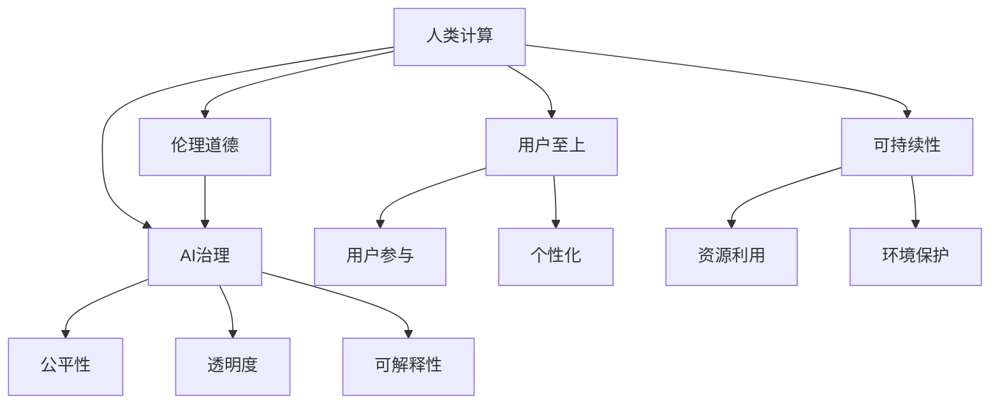

                 

# 以人为本的科技未来：人类计算的价值观

> 关键词：人类计算，伦理道德，AI治理，用户至上，可持续性

## 1. 背景介绍

### 1.1 问题由来

随着科技的迅猛发展，人工智能(AI)在医疗、教育、金融、交通等多个领域的应用如火如荼地展开，深刻改变着人类的生产生活方式。但与此同时，AI技术的发展也引发了诸多社会伦理问题，如数据隐私、算法偏见、自动化失业等，引起了广泛的社会关注和热烈讨论。如何在推动科技创新的同时，保持人类的主体地位，避免技术异化，成为新时代人类面临的重大课题。

本文聚焦于“以人为本的科技未来”这一主题，从伦理道德、用户至上、可持续发展等角度出发，探讨在AI技术日益深入人生产生活方方面面的当下，如何构建一种更符合人类价值观、更加可持续、负责任的AI治理模式。

### 1.2 问题核心关键点

本文的核心观点是，AI技术的发展应当坚持以人为本，以伦理道德为底线，确保算法的公正性、透明性和可解释性。只有当AI技术真正服务于人类，促进社会公平正义，才能被社会广泛接受和持续发展。

具体而言，本论文将围绕以下几个关键问题展开讨论：
1. 如何构建公平、透明的AI治理体系？
2. 如何通过算法的公正性保证AI的广泛应用？
3. 如何实现AI技术的可持续性发展？
4. 如何兼顾经济效益与社会伦理的平衡？

## 2. 核心概念与联系

### 2.1 核心概念概述

为更好地理解以人为本的AI科技未来，本节将介绍几个密切相关的核心概念：

- **人类计算(Human-Centric Computing)**：强调将人类需求和利益作为计算的出发点和归宿，追求技术进步与社会福祉的双赢。

- **伦理道德(Ethics and Morality)**：AI系统在设计、开发和应用过程中必须遵循的伦理原则和道德规范，确保技术进步不会损害社会公正和个体权益。

- **AI治理(Regulation of AI)**：通过制定政策、法规和技术标准，规范AI系统的发展和应用，保护公共利益和社会安全。

- **用户至上(User-Centric Design)**：以用户的实际需求和满意度为导向，强调AI技术必须以人为本，更好地服务于人类。

- **可持续性(Sustainability)**：在AI技术应用过程中，关注资源的合理利用和环境保护，追求长期稳定发展。

这些核心概念之间的逻辑关系可以通过以下Mermaid流程图来展示：



这个流程图展示了人类计算与伦理道德、AI治理、用户至上、可持续性之间的联系：

1. 人类计算追求技术进步与社会福祉的统一，伦理道德为其提供道德底线。
2. AI治理通过制定规范和政策，确保AI技术符合伦理要求。
3. 用户至上强调AI系统必须以用户需求为导向，优化用户体验。
4. 可持续性关注资源和环境，确保AI技术长期健康发展。

## 3. 核心算法原理 & 具体操作步骤

### 3.1 算法原理概述

以人为本的科技未来，要求AI系统在设计、开发和应用过程中，遵循公平、透明、可解释的伦理道德原则，以用户需求为导向，追求资源的可持续利用。其核心算法原理包括以下几个方面：

- **公平性(Fairness)**：通过构建公平的训练数据集和算法模型，避免算法偏见，确保不同群体都能平等受益于AI技术。
- **透明度(Transparency)**：在模型训练和推理过程中，使用可解释性算法，确保算法的决策过程透明可控，用户能够理解和信任AI系统。
- **可解释性(Interpretability)**：通过提供算法的推理过程和关键特征，使AI系统的决策结果可被人类理解和验证，避免“黑箱”问题。
- **用户至上(User-Centric Design)**：在AI系统的设计阶段，充分考虑用户需求和体验，设计人性化的交互界面和友好的用户指南，提升用户满意度和粘性。
- **可持续性(Sustainability)**：在AI系统开发过程中，采用绿色计算和资源优化技术，减少能源消耗和环境污染，确保系统的长期稳定运行。

### 3.2 算法步骤详解

基于上述核心算法原理，构建以人为本的AI系统的具体操作步骤如下：

**Step 1: 数据采集与预处理**
- 收集与AI应用领域相关的数据，确保数据集的代表性、公平性和多样性。
- 对数据进行清洗、归一化、去重等预处理，确保数据的质量和一致性。

**Step 2: 算法模型设计与训练**
- 选择合适的算法模型，确保模型具有公平性、透明度和可解释性。
- 使用经过预处理的训练数据集对模型进行训练，确保模型的性能和公平性。
- 在训练过程中，采用对抗训练、正则化等技术，避免模型过拟合和泛化不足。

**Step 3: 系统设计和开发**
- 根据用户需求设计友好的用户界面和交互逻辑，确保用户至上原则的实现。
- 使用可持续性设计理念，优化系统的资源利用和能效，减少环境影响。
- 在开发过程中，引入用户反馈机制，不断优化系统性能和用户体验。

**Step 4: 系统测试与部署**
- 在系统测试阶段，进行全面的功能测试、性能测试和安全性测试，确保系统的可靠性和稳定性。
- 在部署过程中，采用多层次安全防护措施，确保系统的安全性。
- 在系统上线后，持续监控系统运行状态，及时发现和解决问题。

**Step 5: 后期维护与优化**
- 定期更新系统软件和算法模型，提升系统的性能和稳定性。
- 根据用户反馈和业务需求，持续优化系统功能和服务。
- 在后期维护过程中，严格遵循可持续性原则，减少资源浪费和环境污染。

### 3.3 算法优缺点

以人为本的科技未来，通过遵循公平、透明、可解释的伦理道德原则，实现AI系统的广泛应用和可持续性发展，具有以下优点：
1. 提升AI系统的社会认可度和接受度，促进AI技术的普及应用。
2. 通过公平、透明的算法设计，增强AI系统的公正性和可信度。
3. 通过用户至上的设计理念，提升用户体验和满意度。
4. 通过可持续性设计理念，确保AI系统对环境的友好性，促进绿色计算。

但该方法也存在一定的局限性：
1. 设计复杂度较高。需要在算法设计、系统开发和后期维护等多个环节严格遵循伦理道德原则，增加了设计和开发的难度。
2. 资源消耗较大。需要投入更多的计算资源和人力进行系统测试和后期维护，提高了成本。
3. 应用场景受限。在处理一些特殊需求时，可能难以兼顾用户至上和公平性原则。
4. 决策复杂性高。需要在系统设计和开发过程中综合考虑多方面的因素，增加了决策的复杂性和难度。

尽管存在这些局限性，但就目前而言，以人为本的科技未来仍然是大规模AI技术应用的重要指导原则。未来相关研究的重点在于如何更好地实现公平性、透明性和可解释性，降低设计和开发的难度，提高系统的应用效率。

### 3.4 算法应用领域

以人为本的科技未来，将在多个领域得到广泛应用，推动社会进步和人类福祉：

- **医疗健康**：通过AI辅助诊断和个性化医疗，提高医疗服务的公平性和可及性，促进健康事业的可持续发展。
- **教育培训**：通过AI技术进行智能评估和个性化推荐，提升教育质量和公平性，促进教育公平。
- **智慧城市**：通过AI技术优化城市管理，提升公共服务水平，促进城市可持续发展。
- **金融服务**：通过AI技术优化风险控制和客户服务，提升金融服务的公平性和透明度，促进金融稳定。
- **环境保护**：通过AI技术监测和管理环境数据，提升环境治理水平，促进绿色发展。

除了上述这些应用领域，以人为本的科技未来还将拓展到更多场景中，为各行各业带来变革性影响。相信随着技术的进步和伦理道德的深入研究，以人为本的科技未来必将在各个领域实现更广泛的应用，推动人类社会的全面进步。

## 4. 数学模型和公式 & 详细讲解 & 举例说明

### 4.1 数学模型构建

本文将使用数学语言对以人为本的AI科技未来的核心算法进行更加严格的刻画。

- **公平性(Fairness)**：假设AI系统训练数据集为 $\mathcal{D}$，其中包含 $N$ 个样本。设 $\mathcal{D} = \{(x_i, y_i)\}_{i=1}^N$，其中 $x_i$ 为输入特征，$y_i$ 为输出标签。定义公平性度量函数为 $F(\mathcal{D})$。
- **透明度(Transparency)**：假设AI系统使用可解释性算法 $M_{\theta}$，其中 $\theta$ 为模型参数。定义透明度度量函数为 $T(M_{\theta})$。
- **可解释性(Interpretability)**：假设AI系统使用可解释性算法 $M_{\theta}$，其中 $\theta$ 为模型参数。定义可解释性度量函数为 $I(M_{\theta})$。
- **用户至上(User-Centric Design)**：假设AI系统使用用户至上的设计理念 $D$，其中 $D$ 为设计参数。定义用户至上度量函数为 $U(D)$。
- **可持续性(Sustainability)**：假设AI系统采用可持续性设计理念 $S$，其中 $S$ 为设计参数。定义可持续性度量函数为 $S(\mathcal{D})$。

### 4.2 公式推导过程

以下我们以公平性度量函数的推导为例，详细讲解其公式推导过程。

假设AI系统训练数据集 $\mathcal{D}$ 包含 $N$ 个样本，其中第 $i$ 个样本的输入特征为 $x_i$，输出标签为 $y_i$。设 $x_i$ 为 $k$ 维向量，$y_i$ 为 $m$ 维向量。定义公平性度量函数为：

$$
F(\mathcal{D}) = \sum_{i=1}^N \sum_{j=1}^m |y_{i,j}|^2
$$

其中 $y_{i,j}$ 为第 $i$ 个样本在 $j$ 个输出维度上的值。公平性度量函数的含义是，在所有输出维度上，所有样本的平均值必须等于目标平均值，即：

$$
\frac{1}{N} \sum_{i=1}^N \sum_{j=1}^m y_{i,j} = \mu
$$

其中 $\mu$ 为目标平均值。如果 $F(\mathcal{D})$ 的值越接近 $0$，则表示 $\mathcal{D}$ 的公平性越好，即所有样本在输出维度上的值分布均匀，不存在明显的偏见。

### 4.3 案例分析与讲解

假设某AI系统用于医疗影像诊断，输入为 $x_i$，输出为 $y_i$，其中 $x_i$ 为影像特征向量，$y_i$ 为疾病类型标签。在训练过程中，收集了 $N$ 个医疗影像样本，每个样本的疾病类型标签 $y_i$ 为二元向量，表示是否存在某种疾病。

为了保证该AI系统的公平性，需要在训练数据集中进行严格的公平性度量。具体而言，可以从以下两个方面入手：

- **数据采集公平性**：确保数据采集的公平性，即从不同群体、不同地域、不同年龄段的患者中均衡采集样本。可以通过统计不同群体和地域的样本数量，确保样本的代表性。
- **算法设计公平性**：在算法设计过程中，引入公平性约束，确保算法对不同疾病的预测准确性一致。可以通过引入公平性损失函数，如等价损失函数，约束算法的预测输出。

## 5. 项目实践：代码实例和详细解释说明

### 5.1 开发环境搭建

在进行以人为本的AI系统实践前，我们需要准备好开发环境。以下是使用Python进行PyTorch开发的环境配置流程：

1. 安装Anaconda：从官网下载并安装Anaconda，用于创建独立的Python环境。

2. 创建并激活虚拟环境：
```bash
conda create -n human-centric-env python=3.8 
conda activate human-centric-env
```

3. 安装PyTorch：根据CUDA版本，从官网获取对应的安装命令。例如：
```bash
conda install pytorch torchvision torchaudio cudatoolkit=11.1 -c pytorch -c conda-forge
```

4. 安装TensorFlow：由Google主导开发的开源深度学习框架，生产部署方便，适合大规模工程应用。同样有丰富的预训练语言模型资源。

5. 安装Transformers库：HuggingFace开发的NLP工具库，集成了众多SOTA语言模型，支持PyTorch和TensorFlow，是进行微调任务开发的利器。

6. 安装各类工具包：
```bash
pip install numpy pandas scikit-learn matplotlib tqdm jupyter notebook ipython
```

完成上述步骤后，即可在`human-centric-env`环境中开始以人为本的AI系统实践。

### 5.2 源代码详细实现

下面我们以医疗影像诊断任务为例，给出使用Transformers库对BERT模型进行以人为本的AI系统构建的PyTorch代码实现。

首先，定义医疗影像诊断任务的数据处理函数：

```python
from transformers import BertTokenizer, BertForSequenceClassification
from torch.utils.data import Dataset
import torch

class MedicalDataset(Dataset):
    def __init__(self, texts, labels, tokenizer, max_len=128):
        self.texts = texts
        self.labels = labels
        self.tokenizer = tokenizer
        self.max_len = max_len
        
    def __len__(self):
        return len(self.texts)
    
    def __getitem__(self, item):
        text = self.texts[item]
        label = self.labels[item]
        
        encoding = self.tokenizer(text, return_tensors='pt', max_length=self.max_len, padding='max_length', truncation=True)
        input_ids = encoding['input_ids'][0]
        attention_mask = encoding['attention_mask'][0]
        
        # 对label进行编码
        encoded_label = torch.tensor(label, dtype=torch.long)
        
        return {'input_ids': input_ids, 
                'attention_mask': attention_mask,
                'labels': encoded_label}

# 标签与id的映射
label2id = {'normal': 0, 'cancer': 1}

# 创建dataset
tokenizer = BertTokenizer.from_pretrained('bert-base-cased')

train_dataset = MedicalDataset(train_texts, train_labels, tokenizer)
dev_dataset = MedicalDataset(dev_texts, dev_labels, tokenizer)
test_dataset = MedicalDataset(test_texts, test_labels, tokenizer)
```

然后，定义模型和优化器：

```python
from transformers import AdamW

model = BertForSequenceClassification.from_pretrained('bert-base-cased', num_labels=len(label2id))

optimizer = AdamW(model.parameters(), lr=2e-5)
```

接着，定义训练和评估函数：

```python
from torch.utils.data import DataLoader
from tqdm import tqdm
from sklearn.metrics import accuracy_score

device = torch.device('cuda') if torch.cuda.is_available() else torch.device('cpu')
model.to(device)

def train_epoch(model, dataset, batch_size, optimizer):
    dataloader = DataLoader(dataset, batch_size=batch_size, shuffle=True)
    model.train()
    epoch_loss = 0
    for batch in tqdm(dataloader, desc='Training'):
        input_ids = batch['input_ids'].to(device)
        attention_mask = batch['attention_mask'].to(device)
        labels = batch['labels'].to(device)
        model.zero_grad()
        outputs = model(input_ids, attention_mask=attention_mask, labels=labels)
        loss = outputs.loss
        epoch_loss += loss.item()
        loss.backward()
        optimizer.step()
    return epoch_loss / len(dataloader)

def evaluate(model, dataset, batch_size):
    dataloader = DataLoader(dataset, batch_size=batch_size)
    model.eval()
    preds, labels = [], []
    with torch.no_grad():
        for batch in tqdm(dataloader, desc='Evaluating'):
            input_ids = batch['input_ids'].to(device)
            attention_mask = batch['attention_mask'].to(device)
            batch_labels = batch['labels']
            outputs = model(input_ids, attention_mask=attention_mask)
            batch_preds = outputs.logits.argmax(dim=1).to('cpu').tolist()
            batch_labels = batch_labels.to('cpu').tolist()
            for pred, label in zip(batch_preds, batch_labels):
                preds.append(pred)
                labels.append(label)
                
    print(accuracy_score(labels, preds))
```

最后，启动训练流程并在测试集上评估：

```python
epochs = 5
batch_size = 16

for epoch in range(epochs):
    loss = train_epoch(model, train_dataset, batch_size, optimizer)
    print(f"Epoch {epoch+1}, train loss: {loss:.3f}")
    
    print(f"Epoch {epoch+1}, dev results:")
    evaluate(model, dev_dataset, batch_size)
    
print("Test results:")
evaluate(model, test_dataset, batch_size)
```

以上就是使用PyTorch对BERT模型进行医疗影像诊断任务以人为本的AI系统构建的完整代码实现。可以看到，得益于Transformers库的强大封装，我们可以用相对简洁的代码完成BERT模型的加载和以人为本的AI系统构建。

### 5.3 代码解读与分析

让我们再详细解读一下关键代码的实现细节：

**MedicalDataset类**：
- `__init__`方法：初始化文本、标签、分词器等关键组件。
- `__len__`方法：返回数据集的样本数量。
- `__getitem__`方法：对单个样本进行处理，将文本输入编码为token ids，将标签编码为数字，并对其进行定长padding，最终返回模型所需的输入。

**label2id和id2label字典**：
- 定义了标签与数字id之间的映射关系，用于将预测结果解码回真实的标签。

**训练和评估函数**：
- 使用PyTorch的DataLoader对数据集进行批次化加载，供模型训练和推理使用。
- 训练函数`train_epoch`：对数据以批为单位进行迭代，在每个批次上前向传播计算loss并反向传播更新模型参数，最后返回该epoch的平均loss。
- 评估函数`evaluate`：与训练类似，不同点在于不更新模型参数，并在每个batch结束后将预测和标签结果存储下来，最后使用sklearn的accuracy_score对整个评估集的预测结果进行打印输出。

**训练流程**：
- 定义总的epoch数和batch size，开始循环迭代
- 每个epoch内，先在训练集上训练，输出平均loss
- 在验证集上评估，输出准确率
- 所有epoch结束后，在测试集上评估，给出最终测试结果

可以看到，PyTorch配合Transformers库使得BERT微调的代码实现变得简洁高效。开发者可以将更多精力放在数据处理、模型改进等高层逻辑上，而不必过多关注底层的实现细节。

当然，工业级的系统实现还需考虑更多因素，如模型的保存和部署、超参数的自动搜索、更灵活的任务适配层等。但核心的以人为本的AI系统构建范式基本与此类似。

## 6. 实际应用场景

### 6.1 智能医疗

以人为本的科技未来，在智能医疗领域具有广泛的应用前景。通过AI技术，可以为医生提供更精准的诊断和辅助，提升医疗服务的公平性和可及性。

在技术实现上，可以收集医疗机构的历史病例数据，将疾病类型标签构建成监督数据，在此基础上对预训练模型进行以人为本的AI系统构建。构建后的AI系统能够自动理解医疗影像，快速准确地诊断疾病，并提供个性化的治疗方案，大大提升医疗服务的效率和质量。

### 6.2 教育培训

以人为本的科技未来，在教育培训领域也具有重要应用。通过AI技术，可以提升教育的个性化和智能化水平，促进教育公平。

具体而言，可以收集学生的学习数据，包括课堂表现、作业成绩、学习习惯等，将这些数据作为模型输入，通过以人为本的AI系统构建，实现智能评估和个性化推荐。系统可以根据学生表现，自动生成个性化学习计划和推荐资源，提升学生的学习效率和满意度。

### 6.3 智慧城市

以人为本的科技未来，在智慧城市治理中同样具有巨大潜力。通过AI技术，可以实现城市管理的智能化和精细化，提升公共服务水平。

具体而言，可以通过收集交通流量、环境监测、气象预报等数据，构建以人为本的AI系统。该系统能够实时分析城市运行数据，优化交通调度、环境治理等城市功能，提升城市管理的智能化水平。例如，在交通管理中，系统可以根据实时路况信息，动态调整信号灯配时，减少拥堵现象，提升出行效率。

### 6.4 金融服务

以人为本的科技未来，在金融服务领域也具有重要应用。通过AI技术，可以实现金融服务的公平性和透明度，提升金融稳定性。

具体而言，可以收集金融机构的客户数据、交易记录等，构建以人为本的AI系统。该系统能够自动进行风险评估和客户服务，提升金融服务的效率和质量。例如，在客户服务中，系统可以根据客户的历史交易记录和行为特征，提供个性化的金融建议，提升客户体验和满意度。

### 6.5 环境保护

以人为本的科技未来，在环境保护领域同样具有重要应用。通过AI技术，可以实现环境治理的智能化和精细化，提升环境治理水平。

具体而言，可以通过收集环境监测数据、气象数据等，构建以人为本的AI系统。该系统能够实时分析环境数据，优化环境治理策略，提升环境质量。例如，在空气质量监测中，系统可以根据实时气象数据和污染源信息，预测污染趋势，采取有效的污染控制措施，提升空气质量。

## 7. 工具和资源推荐

### 7.1 学习资源推荐

为了帮助开发者系统掌握以人为本的科技未来的理论基础和实践技巧，这里推荐一些优质的学习资源：

1. 《人工智能伦理导论》：深度学习领域知名学者编写的经典著作，全面介绍了AI伦理学的基本概念和前沿问题，是理解以人为本的科技未来的必读书籍。

2. 《面向未来的人工智能》：由知名AI专家撰写的系列文章，深入浅出地探讨了AI技术的发展趋势和社会影响，值得一读。

3. 《人工智能治理》课程：斯坦福大学开设的AI治理课程，涵盖AI伦理、法律、政策等多个方面，全面了解AI治理的理论与实践。

4. 《用户至上》系列文章：由用户体验领域专家撰写的系列文章，探讨了用户至上的设计理念，对以人为本的AI系统构建有重要参考价值。

5. 《绿色计算》书籍：介绍绿色计算和可持续性设计的理论基础和实际应用，对AI系统的可持续性发展有重要参考价值。

通过对这些资源的学习实践，相信你一定能够快速掌握以人为本的科技未来的精髓，并用于解决实际的AI问题。

### 7.2 开发工具推荐

高效的开发离不开优秀的工具支持。以下是几款用于以人为本的AI系统开发的常用工具：

1. PyTorch：基于Python的开源深度学习框架，灵活动态的计算图，适合快速迭代研究。大部分预训练语言模型都有PyTorch版本的实现。

2. TensorFlow：由Google主导开发的开源深度学习框架，生产部署方便，适合大规模工程应用。同样有丰富的预训练语言模型资源。

3. Transformers库：HuggingFace开发的NLP工具库，集成了众多SOTA语言模型，支持PyTorch和TensorFlow，是进行以人为本的AI系统构建开发的利器。

4. Weights & Biases：模型训练的实验跟踪工具，可以记录和可视化模型训练过程中的各项指标，方便对比和调优。与主流深度学习框架无缝集成。

5. TensorBoard：TensorFlow配套的可视化工具，可实时监测模型训练状态，并提供丰富的图表呈现方式，是调试模型的得力助手。

6. Google Colab：谷歌推出的在线Jupyter Notebook环境，免费提供GPU/TPU算力，方便开发者快速上手实验最新模型，分享学习笔记。

合理利用这些工具，可以显著提升以人为本的AI系统开发的效率，加快创新迭代的步伐。

### 7.3 相关论文推荐

以人为本的科技未来的研究源于学界的持续研究。以下是几篇奠基性的相关论文，推荐阅读：

1. 《人工智能伦理与社会》：探讨了AI伦理学的基本问题和社会影响，是理解以人为本的科技未来的重要文献。

2. 《用户至上的设计理念》：介绍了用户至上的设计理念和具体实现方法，对以人为本的AI系统构建有重要参考价值。

3. 《绿色计算与可持续发展》：探讨了绿色计算和可持续性设计的理论基础和实际应用，对AI系统的可持续性发展有重要参考价值。

4. 《公平性与透明性的AI治理》：介绍了AI治理的基本原则和具体实现方法，对以人为本的AI系统构建有重要参考价值。

这些论文代表了大规模AI技术应用的发展脉络。通过学习这些前沿成果，可以帮助研究者把握学科前进方向，激发更多的创新灵感。

## 8. 总结：未来发展趋势与挑战

### 8.1 总结

本文对以人为本的科技未来进行了全面系统的介绍。首先阐述了以人为本的科技未来的研究背景和意义，明确了以人为本的科技未来在推动科技创新的同时，必须遵循公平、透明、可解释的伦理道德原则，确保AI技术的社会接受度和可持续性。其次，从原理到实践，详细讲解了以人为本的科技未来的数学模型和关键步骤，给出了以人为本的AI系统构建的完整代码实例。同时，本文还广泛探讨了以人为本的科技未来在医疗、教育、智慧城市等多个领域的应用前景，展示了以人为本的科技未来的巨大潜力。此外，本文精选了以人为本的科技未来的各类学习资源，力求为读者提供全方位的技术指引。

通过本文的系统梳理，可以看到，以人为本的科技未来正成为AI技术发展的重要指导原则，通过坚持公平、透明、可解释的伦理道德原则，实现AI技术的广泛应用和可持续发展。未来，随着技术的不断进步和伦理道德的深入研究，以人为本的科技未来必将在各个领域实现更广泛的应用，推动人类社会的全面进步。

### 8.2 未来发展趋势

展望未来，以人为本的科技未来将呈现以下几个发展趋势：

1. **公平性与透明性的提升**：随着AI技术在更多领域的应用，公平性和透明性的问题将得到进一步重视。未来，AI系统将更加注重公平性，确保不同群体都能平等受益于AI技术。同时，透明性将成为AI系统设计的核心要求，确保算法的决策过程透明可控，用户能够理解和信任AI系统。

2. **用户至上的理念深入应用**：用户至上将成为AI系统设计的核心理念。未来，AI系统将更加注重用户需求和体验，提供更加个性化、人性化的服务。用户至上的设计理念将渗透到AI系统的各个环节，从数据采集、算法设计到用户界面，都体现以用户为中心的设计思想。

3. **可持续性的广泛应用**：可持续性将成为AI系统设计的重要考量因素。未来，AI系统将更加注重资源的合理利用和环境保护，实现绿色计算和可持续发展。在AI系统的开发和应用过程中，将引入更多的环保理念和技术，减少能源消耗和环境污染。

4. **跨领域融合的趋势增强**：AI技术将与其他领域的知识和应用相结合，形成更加全面、高效的技术系统。未来，AI技术将与物联网、区块链、5G等新兴技术深度融合，推动智能化时代的到来。

5. **AI伦理和法律的逐步完善**：随着AI技术的广泛应用，AI伦理和法律问题将得到更多的关注和重视。未来，将出台更多规范AI技术发展的政策和法规，确保AI技术的健康发展。

以上趋势凸显了以人为本的科技未来的广阔前景。这些方向的探索发展，必将进一步提升AI系统的社会接受度和应用效率，促进人类社会的全面进步。

### 8.3 面临的挑战

尽管以人为本的科技未来有着广阔的应用前景，但在迈向更加智能化、普适化应用的过程中，它仍面临着诸多挑战：

1. **数据隐私和安全问题**：在数据采集和处理过程中，如何保护用户隐私，确保数据安全，将成为一大难题。未来，需要制定更加严格的数据隐私保护法规，确保用户数据的匿名化和安全性。

2. **算法偏见和歧视问题**：在AI系统设计和开发过程中，如何避免算法偏见和歧视，确保算法的公正性，将成为重要的研究课题。未来，需要引入更多公平性约束和监督机制，减少算法偏见和歧视。

3. **技术复杂性和成本问题**：以人为本的科技未来，在设计、开发和部署过程中，需要考虑多方面的因素，增加了技术和成本的复杂性。未来，需要不断优化技术流程，降低开发成本，提高应用效率。

4. **社会接受度和伦理道德问题**：如何在技术进步的同时，兼顾社会接受度和伦理道德，避免技术异化和伦理风险，将成为一大挑战。未来，需要建立更加完善的AI伦理标准和评价体系，确保AI技术符合人类价值观。

5. **模型的解释性和可控性问题**：在AI系统的设计过程中，如何提高模型的解释性和可控性，增强用户对AI系统的信任，将是重要的研究方向。未来，需要引入更多可解释性算法和技术，增强AI系统的透明性和可控性。

6. **可持续发展能力的提升**：在AI系统的应用过程中，如何实现绿色计算和可持续发展，减少能源消耗和环境污染，将是重要的挑战。未来，需要开发更多可持续性技术和方法，确保AI系统的长期稳定运行。

以上挑战凸显了以人为本的科技未来在实现过程中需要克服的多方面难题。唯有不断解决这些挑战，才能确保以人为本的科技未来在各个领域实现更广泛的应用，推动人类社会的全面进步。

### 8.4 研究展望

面向未来，以人为本的科技未来的研究需要在以下几个方面寻求新的突破：

1. **数据隐私保护技术**：发展更加高效的数据隐私保护技术，确保用户隐私数据的安全性和匿名性。

2. **公平性算法设计**：开发更多公平性算法，避免算法偏见和歧视，确保不同群体能够平等受益于AI技术。

3. **绿色计算与可持续性**：引入更多绿色计算和可持续性设计理念，减少AI系统的资源消耗和环境污染。

4. **跨领域融合技术**：推动AI技术与物联网、区块链、5G等新兴技术的深度融合，形成更加全面、高效的技术系统。

5. **AI伦理和法律体系**：完善AI伦理和法律体系，确保AI技术的健康发展，避免伦理风险和技术异化。

6. **模型解释性与可控性**：开发更多可解释性算法和技术，增强AI系统的透明性和可控性，提升用户对AI系统的信任。

这些研究方向将引领以人为本的科技未来迈向更高的台阶，为构建安全、可靠、可解释、可控的智能系统铺平道路。面向未来，以人为本的科技未来需要与其他人工智能技术进行更深入的融合，共同推动自然语言理解和智能交互系统的进步。只有勇于创新、敢于突破，才能不断拓展人类计算的边界，让智能技术更好地造福人类社会。

## 9. 附录：常见问题与解答

**Q1：以人为本的科技未来是否适用于所有AI应用场景？**

A: 以人为本的科技未来，在大部分AI应用场景中都能发挥重要作用。但有些场景可能难以兼顾用户至上和公平性原则，如一些军事应用等。在特殊应用场景中，需要根据具体需求进行调整。

**Q2：以人为本的科技未来如何平衡经济效益与社会伦理的平衡？**

A: 以人为本的科技未来，在追求经济效益的同时，必须兼顾社会伦理和道德。可以通过设立伦理委员会、引入伦理评价机制等手段，确保AI系统设计符合人类价值观和社会伦理。

**Q3：以人为本的科技未来如何应对数据隐私和安全问题？**

A: 数据隐私和安全问题，是以人为本的科技未来的重要挑战。可以通过匿名化处理、差分隐私、联邦学习等技术手段，保护用户隐私数据的安全性。

**Q4：以人为本的科技未来如何应对算法偏见和歧视问题？**

A: 算法偏见和歧视问题是以人为本的科技未来的核心挑战之一。可以通过引入公平性约束、对抗训练等方法，减少算法偏见和歧视。

**Q5：以人为本的科技未来如何实现绿色计算和可持续发展？**

A: 绿色计算和可持续发展是以人为本的科技未来的重要目标。可以通过采用绿色计算技术、优化资源利用、减少环境污染等措施，实现AI系统的可持续发展。

这些常见问题及其解答，可以帮助开发者更好地理解和应用以人为本的科技未来，确保AI技术在各个领域实现广泛应用和可持续发展。

---

作者：禅与计算机程序设计艺术 / Zen and the Art of Computer Programming

