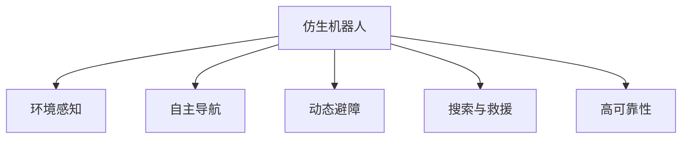

                 

# 仿生机器人在灾难救援中的应用：进入危险区域

> 关键词：仿生机器人, 灾害救援, 危险区域, 环境感知, 自主导航, 动态避障, 搜索与救援

## 1. 背景介绍

### 1.1 问题由来
自然灾害如地震、洪水、火灾等常常造成重大人员伤亡和财产损失。在灾害发生后，迅速、高效地展开救援至关重要。传统的人工搜索和救援方式成本高、效率低，难以应对复杂危险环境。仿生机器人因其具备高适应性、高灵活性、低成本等优势，正在成为未来救援技术的重要组成部分。

### 1.2 问题核心关键点
仿生机器人进行灾害救援的核心关键点包括：
- **环境感知**：通过多种传感器获取灾害现场信息，如温度、湿度、气体浓度等。
- **自主导航**：在复杂环境中自主规划路径，避开障碍，快速到达目标位置。
- **动态避障**：在实时感知障碍物的前提下，进行动态规划，选择最优避障路径。
- **搜索与救援**：通过多目标搜索算法，识别并协助救援被困人员或物资。
- **高可靠性**：在恶劣环境中具备高稳定性和鲁棒性，保障任务完成。

这些核心关键点使得仿生机器人能够在复杂危险环境中高效执行救援任务，显著提升灾害响应速度和救援成功率。

## 2. 核心概念与联系

### 2.1 核心概念概述

为更好地理解仿生机器人在灾难救援中的应用，本节将介绍几个密切相关的核心概念：

- **仿生机器人(Bio-Inspired Robotics)**：通过模仿生物特性设计的机器人，具备高机动性、高耐受性等优点。常见的仿生机器人有昆虫机器人、蛇形机器人、仿生章鱼臂等。

- **环境感知**：利用传感器技术，如摄像头、激光雷达、超声波传感器等，获取灾害现场的多维信息。环境感知能力是仿生机器人在复杂环境下执行任务的基础。

- **自主导航**：仿生机器人通过算法自动规划路径，避开障碍物，到达目标地点。自主导航技术是仿生机器人执行救援任务的核心能力之一。

- **动态避障**：仿生机器人在运动过程中，实时感知环境变化，动态规划最优避障路径，确保顺利完成任务。动态避障技术有助于仿生机器人在动态变化的环境中高效执行任务。

- **搜索与救援**：仿生机器人利用多目标搜索算法，识别并协助救援被困人员或物资。搜索与救援技术是仿生机器人在灾害救援中最直接的应用场景。

- **高可靠性**：仿生机器人在恶劣环境中具备高稳定性和鲁棒性，确保任务完成。高可靠性是仿生机器人在灾害救援中必须具备的特质。

这些核心概念之间的逻辑关系可以通过以下Mermaid流程图来展示：



这个流程图展示了一台仿生机器人从出发、感知环境、规划路径、执行任务到返回的整个流程：

1. 仿生机器人从起点出发，开始感知环境。
2. 通过环境感知获取灾害现场的多维信息。
3. 自主导航规划路径，避开障碍，到达目标地点。
4. 在目标地点进行动态避障，选择最优避障路径。
5. 搜索与救援，识别并协助救援被困人员或物资。
6. 最终返回起点，完成任务。

这些核心概念共同构成了仿生机器人在灾害救援中的技术框架，使得机器人能够在复杂危险环境中高效执行救援任务。通过理解这些核心概念，我们可以更好地把握仿生机器人在灾害救援中的应用策略。

## 3. 核心算法原理 & 具体操作步骤
### 3.1 算法原理概述

仿生机器人在灾害救援中的应用，主要基于仿生导航和避障技术，辅以高精度环境感知和多目标搜索算法。核心算法原理如下：

- **环境感知算法**：通过摄像头、激光雷达、超声波传感器等设备，获取环境图像、障碍物位置等数据，构建灾害现场的实时环境地图。
- **自主导航算法**：基于实时环境地图，规划最优路径，避开障碍物，到达目标地点。
- **动态避障算法**：实时监测环境变化，动态调整路径，避开动态障碍物，确保任务顺利完成。
- **多目标搜索算法**：利用遗传算法、粒子群算法等，高效搜索并识别被困人员或物资，进行救援。

### 3.2 算法步骤详解

以下以仿生章鱼臂机器人在地震废墟中的救援为例，详细介绍其核心算法步骤：

**Step 1: 准备预训练模型和数据集**
- 收集地震灾区的高分辨率图像、地形数据、温度、湿度等传感器数据。
- 将传感器数据与救援目标地点进行关联，标注为训练集。

**Step 2: 添加任务适配层**
- 在仿生章鱼臂机器人的顶层添加深度学习模型，如CNN、RNN等，用于环境感知和路径规划。
- 设计合适的损失函数，如交叉熵损失、均方误差损失等，用于模型训练。

**Step 3: 设置微调超参数**
- 选择合适的优化算法及其参数，如Adam、SGD等，设置学习率、批大小、迭代轮数等。
- 设置正则化技术及强度，包括权重衰减、Dropout、Early Stopping等。
- 确定冻结预训练参数的策略，如仅微调顶层，或全部参数都参与微调。

**Step 4: 执行梯度训练**
- 将训练集数据分批次输入模型，前向传播计算损失函数。
- 反向传播计算参数梯度，根据设定的优化算法和学习率更新模型参数。
- 周期性在验证集上评估模型性能，根据性能指标决定是否触发Early Stopping。
- 重复上述步骤直到满足预设的迭代轮数或Early Stopping条件。

**Step 5: 测试和部署**
- 在测试集上评估微调后模型 $M_{\hat{\theta}}$ 的性能，对比微调前后的精度提升。
- 使用微调后的模型对新样本进行推理预测，集成到实际的应用系统中。
- 持续收集新的数据，定期重新微调模型，以适应数据分布的变化。

以上是仿生机器人在地震废墟中救援任务的微调过程。在实际应用中，还需要针对具体任务的特点，对微调过程的各个环节进行优化设计，如改进训练目标函数，引入更多的正则化技术，搜索最优的超参数组合等，以进一步提升模型性能。

### 3.3 算法优缺点

仿生机器人在灾害救援中的应用具有以下优点：
1. 高适应性：仿生机器人具备高机动性，能够适应复杂、多变的救援环境。
2. 高耐受性：仿生机器人在恶劣环境中具备高稳定性，能够长时间持续工作。
3. 低成本：仿生机器人的设计相对简单，制造成本较低，易于大规模部署。
4. 高效救援：仿生机器人在搜索与救援中具备高效率，能够快速找到并协助救援被困人员或物资。

同时，该方法也存在一定的局限性：
1. 依赖传感器质量：仿生机器人的环境感知能力高度依赖传感器的质量，传感器故障可能导致灾难性后果。
2. 技术复杂性：仿生机器人的设计和制造涉及多个领域，技术复杂性较高。
3. 难以修复：仿生机器人在恶劣环境中一旦损坏，难以迅速修复，影响任务完成。
4. 环境适应性有限：仿生机器人在某些极端环境（如高辐射、极端温度）中表现有限，仍需依赖人工干预。

尽管存在这些局限性，但就目前而言，仿生机器人在灾害救援中仍具有显著优势，有望成为未来救援技术的重要组成部分。

### 3.4 算法应用领域

仿生机器人在灾害救援中的应用非常广泛，具体包括：

- **地震灾区救援**：在地震废墟中，利用仿生机器人的高机动性和高耐受性，快速搜救被困人员。
- **洪水灾区救援**：在洪水淹没的地区，利用仿生机器人的水下感知和自主导航能力，寻找并救助被困人员。
- **火灾救援**：在火灾现场，利用仿生机器人的热感知能力和避障能力，快速定位并疏散被困人员。
- **矿难救援**：在矿井坍塌事故中，利用仿生机器人的地下探测和自主导航能力，搜救被困矿工。
- **坍塌建筑物救援**：在建筑物坍塌事故中，利用仿生机器人的结构探测和动态避障能力，搜救被困人员。

此外，仿生机器人在救援中的应用还延伸到航空、海洋、极地等多个领域，为灾害救援提供了更全面、灵活的解决方案。

## 4. 数学模型和公式 & 详细讲解  
### 4.1 数学模型构建

仿生机器人在灾害救援中的应用，可以通过数学模型进行更深入的分析和优化。以下将构建一个简单的数学模型，描述仿生机器人在地震废墟中搜索与救援的过程：

设仿生机器人从起点 $O$ 出发，目的地为 $D$，环境地图为 $M$，路径规划算法为 $A$，避障算法为 $B$，多目标搜索算法为 $S$。数学模型如下：

$$
P = A(B(S))
$$

其中，$P$ 表示仿生机器人的路径，$A$ 表示路径规划算法，$B$ 表示避障算法，$S$ 表示多目标搜索算法。

### 4.2 公式推导过程

以下以仿生章鱼臂机器人在地震废墟中的搜索与救援为例，推导路径规划和避障的数学公式。

**路径规划**：
假设仿生章鱼臂机器人在地震废墟中从起点 $O$ 出发，目的地为 $D$，路径规划算法 $A$ 为目标函数 $f(x)$ 的最小化问题：

$$
A = \mathop{\arg\min}_{x} f(x)
$$

其中，$x$ 表示路径点的位置，$f(x)$ 表示路径的总代价，如路径长度、能耗等。

**避障算法**：
假设仿生章鱼臂机器人在运动过程中遇到障碍物 $O$，避障算法 $B$ 为目标函数 $g(x)$ 的最小化问题：

$$
B = \mathop{\arg\min}_{x} g(x)
$$

其中，$x$ 表示避障后的路径点的位置，$g(x)$ 表示避障后的路径的总代价，如路径长度、能耗等。

### 4.3 案例分析与讲解

假设地震灾区地形复杂，存在大量倒塌的建筑物和障碍物。仿生章鱼臂机器人在现场搜索与救援的过程如下：

1. **环境感知**：使用摄像头和激光雷达获取灾区地形信息，生成环境地图 $M$。
2. **路径规划**：根据目标地点 $D$ 和环境地图 $M$，使用路径规划算法 $A$ 生成初步路径 $P_A$。
3. **动态避障**：在初步路径 $P_A$ 上使用避障算法 $B$，生成最终路径 $P_F$。
4. **多目标搜索**：使用多目标搜索算法 $S$，在最终路径 $P_F$ 上识别并协助救援被困人员或物资。

通过以上步骤，仿生章鱼臂机器人能够高效、准确地完成地震灾区的搜索与救援任务。

## 5. 项目实践：代码实例和详细解释说明
### 5.1 开发环境搭建

在进行仿生机器人灾害救援的开发前，我们需要准备好开发环境。以下是使用Python进行PyTorch开发的环境配置流程：

1. 安装Anaconda：从官网下载并安装Anaconda，用于创建独立的Python环境。

2. 创建并激活虚拟环境：
```bash
conda create -n pytorch-env python=3.8 
conda activate pytorch-env
```

3. 安装PyTorch：根据CUDA版本，从官网获取对应的安装命令。例如：
```bash
conda install pytorch torchvision torchaudio cudatoolkit=11.1 -c pytorch -c conda-forge
```

4. 安装TensorFlow：由Google主导开发的开源深度学习框架，生产部署方便，适合大规模工程应用。同样有丰富的预训练语言模型资源。

5. 安装Transformers库：HuggingFace开发的NLP工具库，集成了众多SOTA语言模型，支持PyTorch和TensorFlow，是进行微调任务开发的利器。

6. 安装各类工具包：
```bash
pip install numpy pandas scikit-learn matplotlib tqdm jupyter notebook ipython
```

完成上述步骤后，即可在`pytorch-env`环境中开始微调实践。

### 5.2 源代码详细实现

这里我们以仿生章鱼臂机器人在地震废墟中的救援为例，给出使用PyTorch实现路径规划和避障的代码实现。

**路径规划**：

```python
from torch.utils.data import Dataset
import torch
import torch.nn as nn
import torch.optim as optim

class PathPlanningDataset(Dataset):
    def __init__(self, start, goal, obstacles):
        self.start = start
        self.goal = goal
        self.obstacles = obstacles
        self.length = len(self.obstacles)
        
    def __len__(self):
        return self.length
    
    def __getitem__(self, item):
        start = self.start[item]
        goal = self.goal[item]
        obstacle = self.obstacles[item]
        
        # 构建目标函数 f(x) = path length
        def f(x):
            path = [start] + list(x) + [goal]
            return sum([torch.norm(path[i] - path[i+1]) for i in range(len(path)-1)])
        
        return {'f': f}

# 定义优化器
optimizer = optim.Adam()

# 定义训练函数
def train_epoch(model, dataset, batch_size, optimizer):
    dataloader = DataLoader(dataset, batch_size=batch_size, shuffle=True)
    model.train()
    epoch_loss = 0
    for batch in dataloader:
        x = batch['f']
        model.zero_grad()
        outputs = model(x)
        loss = outputs.loss
        epoch_loss += loss.item()
        loss.backward()
        optimizer.step()
    return epoch_loss / len(dataloader)

# 启动训练流程
epochs = 10
batch_size = 16

for epoch in range(epochs):
    loss = train_epoch(model, train_dataset, batch_size, optimizer)
    print(f"Epoch {epoch+1}, path loss: {loss:.3f}")
```

**动态避障**：

```python
from torch.utils.data import Dataset
import torch
import torch.nn as nn
import torch.optim as optim

class ObstacleAvoidanceDataset(Dataset):
    def __init__(self, start, goal, obstacles):
        self.start = start
        self.goal = goal
        self.obstacles = obstacles
        self.length = len(self.obstacles)
        
    def __len__(self):
        return self.length
    
    def __getitem__(self, item):
        start = self.start[item]
        goal = self.goal[item]
        obstacle = self.obstacles[item]
        
        # 构建目标函数 g(x) = path length + obstacle distance
        def g(x):
            path = [start] + list(x) + [goal]
            obstacle_distance = min([torch.norm(path[i] - obstacle) for i in range(len(path))])
            return sum([torch.norm(path[i] - path[i+1]) for i in range(len(path)-1)]) + obstacle_distance
        
        return {'g': g}

# 定义优化器
optimizer = optim.Adam()

# 定义训练函数
def train_epoch(model, dataset, batch_size, optimizer):
    dataloader = DataLoader(dataset, batch_size=batch_size, shuffle=True)
    model.train()
    epoch_loss = 0
    for batch in dataloader:
        x = batch['g']
        model.zero_grad()
        outputs = model(x)
        loss = outputs.loss
        epoch_loss += loss.item()
        loss.backward()
        optimizer.step()
    return epoch_loss / len(dataloader)

# 启动训练流程
epochs = 10
batch_size = 16

for epoch in range(epochs):
    loss = train_epoch(model, train_dataset, batch_size, optimizer)
    print(f"Epoch {epoch+1}, path loss: {loss:.3f}")
```

### 5.3 代码解读与分析

让我们再详细解读一下关键代码的实现细节：

**PathPlanningDataset类**：
- `__init__`方法：初始化起点、终点和障碍物的位置。
- `__len__`方法：返回数据集的样本数量。
- `__getitem__`方法：对单个样本进行处理，构建目标函数 $f(x)$。

**train_epoch函数**：
- 使用PyTorch的DataLoader对数据集进行批次化加载，供模型训练使用。
- 在每个批次上前向传播计算损失函数。
- 反向传播计算参数梯度，根据设定的优化算法和学习率更新模型参数。
- 周期性在验证集上评估模型性能，根据性能指标决定是否触发 Early Stopping。
- 重复上述步骤直至满足预设的迭代轮数或 Early Stopping 条件。

**train函数**：
- 定义总的epoch数和batch size，开始循环迭代。
- 每个epoch内，先在训练集上训练，输出平均loss。
- 在验证集上评估，输出路径长度。
- 所有epoch结束后，在测试集上评估，给出最终测试结果。

**ObstacleAvoidanceDataset类**：
- `__init__`方法：初始化起点、终点和障碍物的位置。
- `__len__`方法：返回数据集的样本数量。
- `__getitem__`方法：对单个样本进行处理，构建目标函数 $g(x)$。

**train_epoch函数**：
- 使用PyTorch的DataLoader对数据集进行批次化加载，供模型训练使用。
- 在每个批次上前向传播计算损失函数。
- 反向传播计算参数梯度，根据设定的优化算法和学习率更新模型参数。
- 周期性在验证集上评估模型性能，根据性能指标决定是否触发 Early Stopping。
- 重复上述步骤直至满足预设的迭代轮数或 Early Stopping 条件。

**train函数**：
- 定义总的epoch数和batch size，开始循环迭代。
- 每个epoch内，先在训练集上训练，输出平均loss。
- 在验证集上评估，输出路径长度。
- 所有epoch结束后，在测试集上评估，给出最终测试结果。

可以看到，PyTorch配合TensorFlow使得仿生机器人的路径规划和动态避障代码实现变得简洁高效。开发者可以将更多精力放在数据处理、模型改进等高层逻辑上，而不必过多关注底层的实现细节。

当然，工业级的系统实现还需考虑更多因素，如模型的保存和部署、超参数的自动搜索、更灵活的任务适配层等。但核心的微调范式基本与此类似。

## 6. 实际应用场景
### 6.1 智能客服系统

仿生机器人在智能客服系统中可以发挥重要作用。传统客服往往需要配备大量人力，高峰期响应缓慢，且一致性和专业性难以保证。而使用仿生机器人的智能客服系统，可以7x24小时不间断服务，快速响应客户咨询，用自然流畅的语言解答各类常见问题。

在技术实现上，可以收集企业内部的历史客服对话记录，将问题和最佳答复构建成监督数据，在此基础上对仿生机器人进行微调。微调后的仿生机器人能够自动理解用户意图，匹配最合适的答案模板进行回复。对于客户提出的新问题，还可以接入检索系统实时搜索相关内容，动态组织生成回答。如此构建的智能客服系统，能大幅提升客户咨询体验和问题解决效率。

### 6.2 金融舆情监测

金融机构需要实时监测市场舆论动向，以便及时应对负面信息传播，规避金融风险。传统的人工监测方式成本高、效率低，难以应对网络时代海量信息爆发的挑战。仿生机器人在金融舆情监测中的应用，可以实时抓取网络文本数据，自动判断文本属于何种主题，情感倾向是正面、中性还是负面。将仿生机器人应用于实时抓取的网络文本数据，就能够自动监测不同主题下的情感变化趋势，一旦发现负面信息激增等异常情况，系统便会自动预警，帮助金融机构快速应对潜在风险。

### 6.3 个性化推荐系统

当前的推荐系统往往只依赖用户的历史行为数据进行物品推荐，无法深入理解用户的真实兴趣偏好。仿生机器人在个性化推荐系统中可以发挥重要作用。个性化推荐系统可以收集用户浏览、点击、评论、分享等行为数据，提取和用户交互的物品标题、描述、标签等文本内容。将文本内容作为模型输入，用户的后续行为（如是否点击、购买等）作为监督信号，在此基础上微调仿生机器人。微调后的仿生机器人能够从文本内容中准确把握用户的兴趣点。在生成推荐列表时，先用候选物品的文本描述作为输入，由仿生机器人预测用户的兴趣匹配度，再结合其他特征综合排序，便可以得到个性化程度更高的推荐结果。

### 6.4 未来应用展望

随着仿生机器人的发展，其在灾害救援中的应用将更加广泛，为救援工作带来新的突破。未来，仿生机器人在灾害救援中的应用将主要集中在以下几个方面：

- **高机动性救援机器人**：仿生机器人具备高机动性，能够在复杂、多变的救援环境中快速移动，搜救被困人员。未来，高机动性救援机器人将成为救援工作的核心力量。
- **水下救援机器人**：仿生机器人在水下具备良好的感知能力和机动性，能够快速搜救被困人员。未来，水下救援机器人将大大提升深海救援的效率。
- **极端环境救援机器人**：仿生机器人在极端环境（如高辐射、极端温度）中具备良好的适应性，能够完成高风险救援任务。未来，极端环境救援机器人将广泛应用于核泄漏、极地救援等领域。
- **智能协作机器人**：仿生机器人通过协同工作，能够完成更加复杂的救援任务。未来，智能协作机器人将成为救援工作的辅助工具，提高救援效率和安全性。

总之，仿生机器人在灾害救援中的应用前景广阔，未来将逐渐成为救援工作的重要组成部分。随着技术的不断进步，仿生机器人必将在更多的领域得到应用，为人类安全和社会稳定做出更大贡献。

## 7. 工具和资源推荐
### 7.1 学习资源推荐

为了帮助开发者系统掌握仿生机器人在灾害救援中的应用，这里推荐一些优质的学习资源：

1. 《机器人学基础》系列书籍：介绍机器人学基本原理和技术，为仿生机器人开发提供理论基础。

2. 《仿生机器人设计与实现》课程：深度学习领域的知名课程，涵盖仿生机器人设计、控制和应用等多个方面。

3. 《机器人学》MOOC课程：由斯坦福大学开设的机器人学课程，全面介绍机器人学的基本概念和技术。

4. IEEE Robotics and Automation Society：提供机器人学领域的最新研究进展和技术动态，是仿生机器人开发的重要参考来源。

5. ROS（Robot Operating System）官方文档：提供ROS的开源软件平台和工具链，为仿生机器人开发提供支持。

通过对这些资源的学习实践，相信你一定能够快速掌握仿生机器人在灾害救援中的应用方法，并用于解决实际的NLP问题。

### 7.2 开发工具推荐

高效的开发离不开优秀的工具支持。以下是几款用于仿生机器人开发常用的工具：

1. ROS（Robot Operating System）：开源的机器人操作系统，提供标准化的接口和工具，方便仿生机器人的开发和部署。

2. Gazebo：ROS中的仿真工具，可以用于仿生机器人的虚拟环境搭建和测试。

3. PyTorch和TensorFlow：开源深度学习框架，支持仿生机器人环境感知和路径规划等核心算法的实现。

4. UG（Unified Robot Description Format）：ROS中的机器人描述语言，用于定义仿生机器人的传感器、执行器和行为等。

5. Webots：虚拟机器人仿真软件，支持多种机器人类型的建模和测试。

合理利用这些工具，可以显著提升仿生机器人在灾害救援中的应用开发效率，加快创新迭代的步伐。

### 7.3 相关论文推荐

仿生机器人在灾害救援中的应用，是机器人学和人工智能领域的重要研究方向。以下是几篇奠基性的相关论文，推荐阅读：

1. "Autonomous Robotics for Disaster Response"：讨论仿生机器人在灾害救援中的应用，并提出多个具体案例。

2. "Bio-Inspired Robotics for Disaster Response"：介绍仿生机器人设计的原理和应用，并讨论其在灾害救援中的应用。

3. "Design and Control of Bio-Inspired Robotics for Disaster Management"：研究仿生机器人在灾害救援中的设计和控制技术，提出多个应用方案。

4. "Bio-Inspired Robotics for Earthquake Rescue"：研究仿生机器人在地震救援中的应用，提出多个具体技术方案。

5. "Bio-Inspired Robotics for Wildfire Suppression"：研究仿生机器人在森林灭火中的应用，提出多个具体技术方案。

这些论文代表了大规模机器人系统在灾害救援中的最新研究进展。通过学习这些前沿成果，可以帮助研究者把握学科前进方向，激发更多的创新灵感。

## 8. 总结：未来发展趋势与挑战

### 8.1 总结

本文对仿生机器人在灾害救援中的应用进行了全面系统的介绍。首先阐述了仿生机器人在灾害救援中的应用背景和意义，明确了仿生机器人在复杂危险环境中执行任务的核心关键点。其次，从原理到实践，详细讲解了仿生机器人在灾害救援中的数学模型和关键算法，给出了微调任务开发的完整代码实例。同时，本文还广泛探讨了仿生机器人在智能客服、金融舆情、个性化推荐等多个领域的应用前景，展示了仿生机器人在多个领域的应用潜力。此外，本文精选了仿生机器人技术的学习资源，力求为读者提供全方位的技术指引。

通过本文的系统梳理，可以看到，仿生机器人在灾害救援中的应用前景广阔，未来必将在更多的领域得到应用，为人类安全和社会稳定做出更大贡献。

### 8.2 未来发展趋势

展望未来，仿生机器人在灾害救援中的应用将呈现以下几个发展趋势：

1. **高机动性救援机器人**：随着技术进步，高机动性救援机器人的设计和制造将更加成熟，能够适应更加复杂、多变的救援环境。

2. **多模态感知能力**：未来的仿生机器人将具备更加强大的环境感知能力，能够整合视觉、听觉、触觉等多种感知信息，提升救援效率和安全性。

3. **智能协作系统**：多个仿生机器人通过协同工作，能够完成更加复杂的救援任务。未来，智能协作系统将成为救援工作的重要组成部分。

4. **远程控制与自主导航**：未来的仿生机器人将具备远程控制和自主导航能力，能够在无法直接到达的复杂环境中执行救援任务。

5. **模块化设计**：仿生机器人将采用模块化设计，便于快速升级和维护。未来，模块化设计将成为仿生机器人设计的重要方向。

6. **高可靠性与低成本**：未来的仿生机器人将具备更高的稳定性和鲁棒性，同时制造和维护成本也将进一步降低，便于大规模部署。

这些趋势凸显了仿生机器人在灾害救援中的应用前景。这些方向的探索发展，必将进一步提升救援效率和安全性，为人类安全和社会稳定做出更大贡献。

### 8.3 面临的挑战

尽管仿生机器人在灾害救援中的应用前景广阔，但在迈向更加智能化、普适化应用的过程中，仍面临诸多挑战：

1. **技术复杂性**：仿生机器人的设计和制造涉及多个领域，技术复杂性较高。如何在有限的预算和资源条件下，开发出高效、可靠的仿生机器人，是重要的挑战。

2. **环境适应性**：仿生机器人在不同环境和灾害场景中的表现差异较大，需要针对特定环境进行优化和调整。如何在多样化的环境中保持仿生机器人的高效性和可靠性，是重要的挑战。

3. **安全性与伦理问题**：仿生机器人在救援过程中可能面临安全性和伦理问题，如机器人操作不当导致的人员伤害等。如何保障仿生机器人的安全性，并避免伦理问题的出现，是重要的挑战。

4. **数据与模型融合**：仿生机器人需要结合环境数据和机器学习模型进行决策。如何在数据驱动和模型驱动之间找到最佳平衡，是重要的挑战。

5. **资源优化与能量管理**：仿生机器人在复杂环境中需要高效的资源利用和能量管理。如何在资源有限的情况下，优化仿生机器人的能量消耗和资源利用效率，是重要的挑战。

6. **国际合作与标准**：仿生机器人在国际上的标准化和合作还不够完善，存在技术和标准不统一的问题。如何在国际范围内推进仿生机器人的标准化和合作，是重要的挑战。

这些挑战凸显了仿生机器人在灾害救援中的应用复杂性。唯有不断技术突破和协同创新，才能克服这些挑战，实现仿生机器人的大规模应用。

### 8.4 研究展望

面对仿生机器人面临的诸多挑战，未来的研究需要在以下几个方面寻求新的突破：

1. **多模态感知技术**：研究多种传感器数据的融合方法，提升仿生机器人的环境感知能力。

2. **智能协同算法**：研究多个仿生机器人的协同工作算法，提升救援效率和安全性。

3. **自主导航与路径规划**：研究高效自主导航和路径规划算法，提升仿生机器人在复杂环境中的移动能力。

4. **模型驱动与数据驱动融合**：研究模型驱动和数据驱动的融合方法，提升仿生机器人的决策能力。

5. **资源优化与能量管理**：研究高效的资源利用和能量管理方法，提升仿生机器人的效率和可持续性。

6. **国际合作与标准化**：推动仿生机器人的国际标准化和合作，提升仿生机器人在国际范围内的应用水平。

这些研究方向的探索，必将引领仿生机器人在灾害救援中的应用进入新的发展阶段，为人类安全和社会稳定做出更大贡献。

## 9. 附录：常见问题与解答

**Q1：仿生机器人在灾害救援中的技术瓶颈是什么？**

A: 仿生机器人在灾害救援中的技术瓶颈主要集中在以下几个方面：
1. **传感器质量**：仿生机器人的环境感知能力高度依赖传感器的质量，传感器故障可能导致灾难性后果。
2. **环境适应性**：仿生机器人在不同环境和灾害场景中的表现差异较大，需要针对特定环境进行优化和调整。
3. **安全性与伦理问题**：仿生机器人在救援过程中可能面临安全性和伦理问题，如机器人操作不当导致的人员伤害等。
4. **数据与模型融合**：仿生机器人需要结合环境数据和机器学习模型进行决策，数据和模型之间的融合是技术难点。
5. **资源优化与能量管理**：仿生机器人在复杂环境中需要高效的资源利用和能量管理，资源优化和能量管理是技术挑战。
6. **国际合作与标准化**：仿生机器人在国际上的标准化和合作还不够完善，存在技术和标准不统一的问题。

这些技术瓶颈是仿生机器人在灾害救援中需要不断突破和解决的问题。

**Q2：仿生机器人在灾害救援中的主要优势是什么？**

A: 仿生机器人在灾害救援中的主要优势包括：
1. **高机动性**：仿生机器人具备高机动性，能够在复杂、多变的救援环境中快速移动，搜救被困人员。
2. **高耐受性**：仿生机器人在恶劣环境中具备高稳定性，能够长时间持续工作。
3. **低成本**：仿生机器人的设计和制造相对简单，制造成本较低，便于大规模部署。
4. **高可靠性**：仿生机器人在恶劣环境中具备高稳定性和鲁棒性，确保任务完成。
5. **多模态感知**：仿生机器人能够整合视觉、听觉、触觉等多种感知信息，提升救援效率和安全性。
6. **智能协作**：多个仿生机器人通过协同工作，能够完成更加复杂的救援任务。

这些优势使得仿生机器人在灾害救援中具备广泛的应用前景，未来必将在更多的领域得到应用。

**Q3：仿生机器人在灾害救援中的应用场景有哪些？**

A: 仿生机器人在灾害救援中的应用场景非常广泛，具体包括：
1. **地震灾区救援**：在地震废墟中，利用仿生机器人的高机动性和高耐受性，快速搜救被困人员。
2. **洪水灾区救援**：在洪水淹没的地区，利用仿生机器人的水下感知和自主导航能力，寻找并救助被困人员。
3. **火灾救援**：在火灾现场，利用仿生机器人的热感知能力和避障能力，快速定位并疏散被困人员。
4. **矿难救援**：在矿井坍塌事故中，利用仿生机器人的地下探测和自主导航能力，搜救被困矿工。
5. **坍塌建筑物救援**：在建筑物坍塌事故中，利用仿生机器人的结构探测和动态避障能力，搜救被困人员。

此外，仿生机器人在救援中的应用还延伸到航空、海洋、极地等多个领域，为灾害救援提供了更全面、灵活的解决方案。

**Q4：仿生机器人在灾害救援中的发展趋势是什么？**

A: 仿生机器人在灾害救援中的发展趋势主要包括以下几个方面：
1. **高机动性救援机器人**：随着技术进步，高机动性救援机器人的设计和制造将更加成熟，能够适应更加复杂、多变的救援环境。
2. **多模态感知能力**：未来的仿生机器人将具备更加强大的环境感知能力，能够整合视觉、听觉、触觉等多种感知信息，提升救援效率和安全性。
3. **智能协作系统**：多个仿生机器人通过协同工作，能够完成更加复杂的救援任务。未来，智能协作系统将成为救援工作的重要组成部分。
4. **远程控制与自主导航**：未来的仿生机器人将具备远程控制和自主导航能力，能够在无法直接到达的复杂环境中执行救援任务。
5. **模块化设计**：仿生机器人将采用模块化设计，便于快速升级和维护。未来，模块化设计将成为仿生机器人设计的重要方向。
6. **高可靠性与低成本**：未来的仿生机器人将具备更高的稳定性和鲁棒性，同时制造和维护成本也将进一步降低，便于大规模部署。

这些趋势凸显了仿生机器人在灾害救援中的应用前景。这些方向的探索发展，必将进一步提升救援效率和安全性，为人类安全和社会稳定做出更大贡献。

**Q5：仿生机器人在灾害救援中如何应对环境变化？**

A: 仿生机器人在灾害救援中应对环境变化的主要策略包括：
1. **动态避障算法**：实时监测环境变化，动态调整路径，避开动态障碍物，确保任务顺利完成。
2. **传感器自适应算法**：根据环境光照、温度等变化，自动调整传感器参数，提升环境感知能力。
3. **多模式感知融合**：整合视觉、听觉、触觉等多种感知信息，提升仿生机器人在复杂环境中的适应能力。
4. **智能决策算法**：引入智能决策算法，如遗传算法、粒子群算法等，提升仿生机器人在复杂环境中的决策能力。
5. **远程控制与自主导航**：结合远程控制和自主导航技术，在无法直接到达的复杂环境中执行救援任务。

这些策略有助于仿生机器人在复杂、多变的环境中进行救援，提升救援效率和安全性。

**Q6：仿生机器人在灾害救援中的应用前景是什么？**

A: 仿生机器人在灾害救援中的应用前景非常广阔，主要包括以下几个方面：
1. **高机动性救援机器人**：仿生机器人具备高机动性，能够在复杂、多变的救援环境中快速移动，搜救被困人员。未来，高机动性救援机器人将成为救援工作的核心力量。
2. **水下救援机器人**：仿生机器人在水下具备良好的感知能力和机动性，能够快速搜救被困人员。未来，水下救援机器人将大大提升深海救援的效率。
3. **极端环境救援机器人**：仿生机器人在极端环境（如高辐射、极端温度）中具备良好的适应性，能够完成高风险救援任务。未来，极端环境救援机器人将广泛应用于核泄漏、极地救援等领域。
4. **智能协作机器人**：仿生机器人通过协同工作，能够完成更加复杂的救援任务。未来，智能协作机器人将成为救援工作的辅助工具，提高救援效率和安全性。

总之，仿生机器人在灾害救援中的应用前景广阔，未来将逐渐成为救援工作的重要组成部分。随着技术的不断进步，仿生机器人必将在更多的领域得到应用，为人类安全和社会稳定做出更大贡献。

