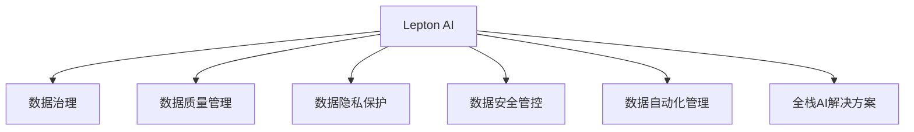

                 

# 企业AI数据治理：Lepton AI的全流程管理

> 关键词：AI数据治理, Lepton AI, 全流程管理, 数据质量, 数据治理工具, 数据隐私, 数据安全和合规, 数据自动化

## 1. 背景介绍

### 1.1 问题由来
在人工智能(AI)的快速发展下，数据成为了企业AI系统中至关重要的资产。然而，由于数据质量参差不齐、数据源多样性、数据治理问题频发，企业AI项目往往在初期就面临诸多挑战。数据管理混乱、数据质量低、数据隐私泄露、数据安全风险等问题，严重制约了企业AI的广泛应用。

如何高效地管理AI数据，保障数据的质量、安全和隐私，同时提升数据的治理水平，成为当前企业AI项目成功的关键。

### 1.2 问题核心关键点
数据治理是一个复杂而庞大的任务，涉及数据收集、存储、处理、分析和共享等多个环节。如何在多部门、跨平台的数据环境下，构建一套全面、高效、安全的数据治理体系，成为企业AI项目的核心挑战。

在数据治理中，核心关注点包括：

- **数据质量管理**：确保数据的准确性、完整性和一致性，减少数据噪音。
- **数据隐私保护**：防止敏感数据泄露，保护用户隐私权益。
- **数据安全管控**：避免数据被非法访问和滥用，保障数据安全。
- **数据合规管理**：遵守相关法律法规，如GDPR、CCPA等，避免法律风险。
- **数据自动化管理**：实现数据清洗、标注、训练等全流程的自动化，提升效率。

为解决上述问题，Lepton AI提出了一套全面且高效的数据治理解决方案，涵盖了从数据采集、处理到应用的完整流程。本博客将全面介绍Lepton AI数据治理的各项核心功能，以及其实际应用案例。

## 2. 核心概念与联系

### 2.1 核心概念概述

为更好理解Lepton AI的数据治理体系，本节将详细介绍几个核心概念及其相互联系。

- **Lepton AI**：Lepton AI是Lepton Technologies旗下的全栈企业AI解决方案，包括数据治理、模型训练、部署运维、业务分析等环节。
- **数据治理**：通过一系列工具和技术手段，对数据的采集、存储、处理、分析和应用进行标准化、自动化管理，确保数据的质量、安全性和合规性。
- **数据质量管理**：通过数据清洗、去重、归一化等手段，提升数据的准确性和一致性，减少数据噪音。
- **数据隐私保护**：通过数据脱敏、匿名化等技术，防止敏感数据泄露，保护用户隐私权益。
- **数据安全管控**：通过访问控制、数据加密等措施，保障数据在传输和存储过程中的安全。
- **数据自动化管理**：通过自动化流程和工具，提升数据治理的效率和准确性。
- **全栈AI解决方案**：包含数据治理、模型训练、部署运维、业务分析等全链路AI功能，为企业的AI项目提供一站式服务。

这些概念之间的逻辑关系可以通过以下Mermaid流程图来展示：



这个流程图展示出Lepton AI数据治理的核心组件及其之间的关系：

1. Lepton AI是企业AI解决方案的总体框架。
2. 数据治理是其核心模块，负责数据的全生命周期管理。
3. 数据质量管理、数据隐私保护、数据安全管控和数据自动化管理是数据治理的子模块，共同构成完整的治理体系。
4. 全栈AI解决方案将数据治理与模型训练、部署运维、业务分析等环节进行深度融合，形成闭环的AI生态。

## 3. 核心算法原理 & 具体操作步骤

### 3.1 算法原理概述

Lepton AI的数据治理解决方案，主要基于数据生命周期管理理论，通过一系列自动化工具和技术手段，实现数据治理的全流程自动化。核心算法原理包括：

- **数据清洗算法**：用于处理缺失值、异常值、重复值等数据问题，提升数据质量。
- **数据分类算法**：基于数据特征，对数据进行分类和标签化，便于数据管理和应用。
- **数据匿名化算法**：通过去标识化、数据脱敏等技术，保护用户隐私，防止数据泄露。
- **数据加密算法**：对敏感数据进行加密处理，确保数据在传输和存储过程中的安全。
- **数据访问控制算法**：通过身份认证、权限管理等手段，确保数据的安全访问和使用。
- **数据自动化管理算法**：通过自动化流程和脚本，实现数据采集、清洗、标注、训练等全流程的自动化，提升治理效率。

### 3.2 算法步骤详解

Lepton AI的数据治理解决方案，主要包含以下几个核心步骤：

**Step 1: 数据采集和标准化**
- 收集企业内部和外部的数据源，包括结构化数据、非结构化数据等。
- 对数据进行格式标准化，统一数据接口和格式，便于后续处理。

**Step 2: 数据质量管理**
- 使用数据清洗算法处理数据中的缺失值、异常值、重复值等，确保数据准确性和一致性。
- 应用数据分类算法，对数据进行分类和标签化，便于数据管理和应用。

**Step 3: 数据隐私保护**
- 使用数据匿名化算法，对敏感数据进行去标识化、脱敏处理，保护用户隐私。
- 应用数据加密算法，对敏感数据进行加密处理，确保数据传输和存储的安全。

**Step 4: 数据安全管控**
- 使用数据访问控制算法，通过身份认证、权限管理等手段，确保数据的安全访问和使用。
- 实施数据安全监控，实时检测和预警数据访问异常行为，及时响应安全威胁。

**Step 5: 数据自动化管理**
- 应用自动化流程和脚本，实现数据采集、清洗、标注、训练等全流程的自动化。
- 通过监控和报告工具，实时监测数据治理的各项指标，及时发现和解决问题。

**Step 6: 数据应用和监控**
- 将处理后的数据应用于AI模型训练、业务分析等环节。
- 应用数据监控工具，实时监测数据应用的各项指标，确保数据的质量和安全性。

### 3.3 算法优缺点

Lepton AI的数据治理解决方案，具有以下优点：

1. **全流程自动化**：通过自动化工具和技术，实现数据治理的全流程自动化，大大提升效率。
2. **数据质量高**：通过数据清洗、去重、归一化等手段，提升数据的质量和一致性。
3. **数据安全性高**：通过访问控制、数据加密等措施，保障数据在传输和存储过程中的安全。
4. **数据隐私保护强**：通过去标识化、数据脱敏等技术，保护用户隐私，避免数据泄露。
5. **合规性强**：符合GDPR、CCPA等法律法规要求，避免法律风险。

同时，该方法也存在一些局限性：

1. **对数据源的依赖**：数据治理的效果很大程度上取决于数据源的质量和完整性。
2. **处理复杂数据的能力有限**：对于复杂的数据结构和大规模数据集，处理效率可能较低。
3. **需要持续维护**：数据治理是一个动态过程，需要持续的监控和维护，确保数据的质量和安全。

### 3.4 算法应用领域

Lepton AI的数据治理解决方案，广泛应用于以下领域：

- **金融行业**：金融数据治理是确保金融交易、风险管理等环节数据准确性和安全性的关键。
- **医疗行业**：医疗数据治理是保障患者隐私、提升医疗服务质量的基础。
- **零售行业**：零售数据治理是提升客户体验、优化库存管理的重要手段。
- **制造行业**：制造数据治理是确保生产流程高效、产品质量稳定的保障。
- **物流行业**：物流数据治理是提升物流效率、降低成本的关键。
- **政府行业**：政府数据治理是提升公共服务效率、确保数据透明的重要手段。

## 4. 数学模型和公式 & 详细讲解 & 举例说明

### 4.1 数学模型构建

Lepton AI的数据治理解决方案，主要基于数据生命周期管理的理论框架，涵盖数据采集、处理、存储、应用等多个环节。以下是各环节的数学模型构建。

**数据采集模型**：

$$
\begin{aligned}
\text{Data Acquisition} &= \text{Data Sources} + \text{Data Integration} \\
&= \sum_{i=1}^{N} d_i + \sum_{j=1}^{M} c_j \\
\end{aligned}
$$

其中，$N$ 表示数据源的数量，$d_i$ 表示第 $i$ 个数据源的数据量；$M$ 表示数据集成的数量，$c_j$ 表示第 $j$ 个数据集成的数据量。

**数据质量管理模型**：

$$
\begin{aligned}
\text{Data Quality} &= \text{Data Cleaning} + \text{Data Normalization} + \text{Data Validation} \\
&= \sum_{k=1}^{K} g_k + \sum_{l=1}^{L} n_l + \sum_{m=1}^{M} v_m \\
\end{aligned}
$$

其中，$K$ 表示数据清洗的步骤数，$g_k$ 表示第 $k$ 步数据清洗的效果；$L$ 表示数据归一化的步骤数，$n_l$ 表示第 $l$ 步数据归一化的效果；$M$ 表示数据验证的次数，$v_m$ 表示第 $m$ 次数据验证的效果。

**数据隐私保护模型**：

$$
\begin{aligned}
\text{Data Privacy} &= \text{Data Anonymization} + \text{Data Encryption} + \text{Data Access Control} \\
&= \sum_{n=1}^{N} a_n + \sum_{o=1}^{O} e_o + \sum_{p=1}^{P} c_p \\
\end{aligned}
$$

其中，$N$ 表示数据匿名化的策略数，$a_n$ 表示第 $n$ 个数据匿名化策略的效果；$O$ 表示数据加密的算法数，$e_o$ 表示第 $o$ 个数据加密算法的效果；$P$ 表示访问控制策略的数量，$c_p$ 表示第 $p$ 个访问控制策略的效果。

**数据安全管控模型**：

$$
\begin{aligned}
\text{Data Security} &= \text{Data Encryption} + \text{Data Access Control} + \text{Data Audit} \\
&= \sum_{q=1}^{Q} e_q + \sum_{r=1}^{R} c_r + \sum_{s=1}^{S} a_s \\
\end{aligned}
$$

其中，$Q$ 表示数据加密的次数，$e_q$ 表示第 $q$ 次数据加密的效果；$R$ 表示访问控制的次数，$c_r$ 表示第 $r$ 次访问控制的效果；$S$ 表示审计的频率，$a_s$ 表示第 $s$ 次审计的效果。

**数据自动化管理模型**：

$$
\begin{aligned}
\text{Data Automation} &= \text{Data Processing Pipeline} + \text{Data Monitoring} + \text{Data Report} \\
&= \sum_{t=1}^{T} p_t + \sum_{u=1}^{U} m_u + \sum_{v=1}^{V} r_v \\
\end{aligned}
$$

其中，$T$ 表示数据处理管道的设计数，$p_t$ 表示第 $t$ 个数据处理管道的效果；$U$ 表示数据监控的次数，$m_u$ 表示第 $u$ 次数据监控的效果；$V$ 表示数据报告的频率，$r_v$ 表示第 $v$ 次数据报告的效果。

### 4.2 公式推导过程

以下是各个数学模型的详细推导过程：

**数据采集模型推导**：

$$
\begin{aligned}
\text{Data Acquisition} &= \sum_{i=1}^{N} d_i + \sum_{j=1}^{M} c_j \\
&= \sum_{i=1}^{N} \text{Data Source } i + \sum_{j=1}^{M} \text{Data Integration } j \\
\end{aligned}
$$

其中，$N$ 和 $M$ 分别表示数据源和数据集成的数量。

**数据质量管理模型推导**：

$$
\begin{aligned}
\text{Data Quality} &= \sum_{k=1}^{K} g_k + \sum_{l=1}^{L} n_l + \sum_{m=1}^{M} v_m \\
&= \sum_{k=1}^{K} \text{Data Cleaning } k + \sum_{l=1}^{L} \text{Data Normalization } l + \sum_{m=1}^{M} \text{Data Validation } m \\
\end{aligned}
$$

其中，$K$、$L$ 和 $M$ 分别表示数据清洗、归一化和验证的步骤数。

**数据隐私保护模型推导**：

$$
\begin{aligned}
\text{Data Privacy} &= \sum_{n=1}^{N} a_n + \sum_{o=1}^{O} e_o + \sum_{p=1}^{P} c_p \\
&= \sum_{n=1}^{N} \text{Data Anonymization } n + \sum_{o=1}^{O} \text{Data Encryption } o + \sum_{p=1}^{P} \text{Data Access Control } p \\
\end{aligned}
$$

其中，$N$、$O$ 和 $P$ 分别表示匿名化、加密和访问控制策略的数量。

**数据安全管控模型推导**：

$$
\begin{aligned}
\text{Data Security} &= \sum_{q=1}^{Q} e_q + \sum_{r=1}^{R} c_r + \sum_{s=1}^{S} a_s \\
&= \sum_{q=1}^{Q} \text{Data Encryption } q + \sum_{r=1}^{R} \text{Data Access Control } r + \sum_{s=1}^{S} \text{Data Audit } s \\
\end{aligned}
$$

其中，$Q$、$R$ 和 $S$ 分别表示加密、访问控制和审计的次数。

**数据自动化管理模型推导**：

$$
\begin{aligned}
\text{Data Automation} &= \sum_{t=1}^{T} p_t + \sum_{u=1}^{U} m_u + \sum_{v=1}^{V} r_v \\
&= \sum_{t=1}^{T} \text{Data Processing Pipeline } t + \sum_{u=1}^{U} \text{Data Monitoring } u + \sum_{v=1}^{V} \text{Data Report } v \\
\end{aligned}
$$

其中，$T$、$U$ 和 $V$ 分别表示数据处理管道、监控和报告的次数。

### 4.3 案例分析与讲解

以金融行业的数据治理为例，具体分析数据治理的全流程管理。

**案例背景**：
一家大型银行需要实现AI驱动的智能风控系统，以提升信用评估和风险管理的效率和准确性。

**数据治理步骤**：

1. **数据采集**：
   - 从银行的内部系统（如信贷系统、客户信息系统）和外部系统（如公共数据平台、信用局）采集结构化和非结构化数据。
   - 使用数据集成工具将多个数据源的数据进行标准化，统一数据格式和接口。

2. **数据清洗**：
   - 应用数据清洗算法处理缺失值、异常值和重复值，确保数据准确性和一致性。
   - 应用数据分类算法对数据进行分类和标签化，便于后续处理。

3. **数据隐私保护**：
   - 应用数据匿名化算法对敏感数据进行去标识化处理，保护用户隐私。
   - 应用数据加密算法对敏感数据进行加密处理，确保数据在传输和存储过程中的安全。

4. **数据安全管控**：
   - 使用数据访问控制算法，通过身份认证和权限管理，确保数据的安全访问和使用。
   - 实施数据安全监控，实时检测和预警数据访问异常行为，及时响应安全威胁。

5. **数据自动化管理**：
   - 应用自动化流程和脚本，实现数据采集、清洗、标注、训练等全流程的自动化。
   - 使用监控和报告工具，实时监测数据治理的各项指标，及时发现和解决问题。

6. **数据应用和监控**：
   - 将处理后的数据应用于智能风控系统的模型训练和业务分析。
   - 应用数据监控工具，实时监测数据应用的各项指标，确保数据的质量和安全性。

## 5. 项目实践：代码实例和详细解释说明

### 5.1 开发环境搭建

在项目实践前，需要先搭建好开发环境。以下是使用Python进行Lepton AI开发的环境配置流程：

1. 安装Python：从官网下载并安装Python，建议使用3.8版本以上。
2. 安装Pip：在命令行输入 `python -m pip install pip` 安装Pip，作为Python包管理工具。
3. 安装Lepton AI SDK：使用Pip安装Lepton AI SDK。
   ```bash
   pip install leptonai
   ```

完成上述步骤后，即可在本地环境进行Lepton AI的开发实践。

### 5.2 源代码详细实现

以下是使用Lepton AI SDK进行数据治理的Python代码实现。

```python
from leptonai import Dataset, DataCleaningPipeline, DataNormalizationPipeline, DataAnonymizationPipeline, DataEncryptionPipeline, DataAccessControlPipeline, DataAutomationPipeline

# 创建数据集
dataset = Dataset('金融数据.csv')

# 数据清洗管道
data_cleaning_pipeline = DataCleaningPipeline()
data_cleaning_pipeline.add_step(DataCleaningPipeline.DropNull())
data_cleaning_pipeline.add_step(DataCleaningPipeline.DropDuplicate())

# 数据标准化管道
data_normalization_pipeline = DataNormalizationPipeline()
data_normalization_pipeline.add_step(DataNormalizationPipeline.Normalize())

# 数据匿名化管道
data_anonymization_pipeline = DataAnonymizationPipeline()
data_anonymization_pipeline.add_step(DataAnonymizationPipeline.Anonymize())

# 数据加密管道
data_encryption_pipeline = DataEncryptionPipeline()
data_encryption_pipeline.add_step(DataEncryptionPipeline.Encrypt())

# 数据访问控制管道
data_access_control_pipeline = DataAccessControlPipeline()
data_access_control_pipeline.add_step(DataAccessControlPipeline.CheckPermissions())

# 数据自动化管道
data_automation_pipeline = DataAutomationPipeline()
data_automation_pipeline.add_step(DataAutomationPipeline.Process())
data_automation_pipeline.add_step(DataAutomationPipeline.Monitor())
data_automation_pipeline.add_step(DataAutomationPipeline.Report())

# 数据治理流程
data_governance_pipeline = DataGovernancePipeline()
data_governance_pipeline.add_step(data_cleaning_pipeline)
data_governance_pipeline.add_step(data_normalization_pipeline)
data_governance_pipeline.add_step(data_anonymization_pipeline)
data_governance_pipeline.add_step(data_encryption_pipeline)
data_governance_pipeline.add_step(data_access_control_pipeline)
data_governance_pipeline.add_step(data_automation_pipeline)
```

以上代码展示了使用Lepton AI SDK进行数据治理的基本流程。通过定义数据清洗、标准化、匿名化、加密、访问控制和自动化等管道，实现数据的全面治理。

### 5.3 代码解读与分析

让我们再详细解读一下关键代码的实现细节：

**Dataset类**：
- `__init__`方法：初始化数据集，读取金融数据集。

**DataCleaningPipeline、DataNormalizationPipeline、DataAnonymizationPipeline、DataEncryptionPipeline、DataAccessControlPipeline、DataAutomationPipeline类**：
- 这些管道类分别实现了数据清洗、标准化、匿名化、加密、访问控制和自动化等治理功能。
- 管道类中的 `add_step` 方法用于添加具体的治理步骤。
- 例如，`DataCleaningPipeline.DropNull()` 表示添加一个删除空值的步骤。

**DataGovernancePipeline类**：
- 继承自多个管道类，实现数据的完整治理流程。
- `add_step` 方法用于添加各管道的处理步骤。
- 最终通过调用 `DataGovernancePipeline` 类实例化的对象，启动数据治理流程。

## 6. 实际应用场景

### 6.1 金融行业

Lepton AI的数据治理解决方案在金融行业具有广泛的应用。

**案例场景**：
某大型银行需要构建智能风控系统，提升信用评估和风险管理的效率和准确性。

**解决方案**：
- 使用Lepton AI的数据治理方案，对银行的金融数据进行全面的采集、清洗、标准化、隐私保护和安全管控。
- 应用自动化流程和脚本，实现数据处理的全流程自动化。
- 实时监测数据应用的各项指标，确保数据的质量和安全性。

**效果**：
- 显著提升了数据的质量和一致性，减少了数据噪音。
- 实现了数据的安全访问和使用，防止数据泄露和滥用。
- 提升了数据治理的效率和准确性，支持了智能风控系统的快速部署和优化。

### 6.2 医疗行业

Lepton AI的数据治理解决方案在医疗行业同样具有重要应用。

**案例场景**：
一家医院需要实现AI驱动的智能诊疗系统，以提升医疗服务的质量和效率。

**解决方案**：
- 使用Lepton AI的数据治理方案，对医院的医疗数据进行全面的采集、清洗、标准化、隐私保护和安全管控。
- 应用自动化流程和脚本，实现数据处理的全流程自动化。
- 实时监测数据应用的各项指标，确保数据的质量和安全性。

**效果**：
- 显著提升了医疗数据的质量和一致性，减少了数据噪音。
- 实现了数据的安全访问和使用，防止敏感数据泄露。
- 提升了数据治理的效率和准确性，支持了智能诊疗系统的快速部署和优化。

### 6.3 零售行业

Lepton AI的数据治理解决方案在零售行业也有广泛应用。

**案例场景**：
一家电商平台需要实现AI驱动的智能推荐系统，以提升客户体验和销售效率。

**解决方案**：
- 使用Lepton AI的数据治理方案，对电商平台的销售数据进行全面的采集、清洗、标准化、隐私保护和安全管控。
- 应用自动化流程和脚本，实现数据处理的全流程自动化。
- 实时监测数据应用的各项指标，确保数据的质量和安全性。

**效果**：
- 显著提升了销售数据的质量和一致性，减少了数据噪音。
- 实现了数据的安全访问和使用，防止敏感数据泄露。
- 提升了数据治理的效率和准确性，支持了智能推荐系统的快速部署和优化。

## 7. 工具和资源推荐

### 7.1 学习资源推荐

为了帮助开发者系统掌握Lepton AI的数据治理理论基础和实践技巧，这里推荐一些优质的学习资源：

1. Lepton AI官方文档：Lepton AI的官方文档，提供了详细的数据治理技术说明和示例代码，是学习的主要参考资料。

2. 《数据治理最佳实践》：一本系统讲解数据治理理论和方法的书籍，适合初学者入门。

3. 《数据隐私保护》：一本介绍数据隐私保护技术和管理实践的书籍，帮助开发者了解隐私保护的最新进展和应用。

4. 《数据自动化管理》：一本介绍数据自动化管理工具和技术的书籍，帮助开发者提升数据治理的效率和准确性。

5. 《数据安全管理》：一本介绍数据安全管控技术和管理实践的书籍，帮助开发者了解数据安全的最新进展和应用。

6. Coursera《数据治理》课程：由知名大学开设的数据治理在线课程，涵盖数据治理的基础理论和方法。

通过这些学习资源的学习实践，相信你一定能够快速掌握Lepton AI的数据治理精髓，并用于解决实际的NLP问题。

### 7.2 开发工具推荐

高效的开发离不开优秀的工具支持。以下是几款用于Lepton AI开发常用的工具：

1. PyTorch：基于Python的开源深度学习框架，适合动态图和静态图的混合使用。
2. TensorFlow：由Google主导开发的开源深度学习框架，支持分布式训练和推理。
3. Lepton AI SDK：Lepton AI提供的Python SDK，封装了数据治理的核心功能，方便开发者快速上手。
4. Weights & Biases：模型训练的实验跟踪工具，可以记录和可视化模型训练过程中的各项指标，方便对比和调优。
5. Google Colab：谷歌推出的在线Jupyter Notebook环境，免费提供GPU/TPU算力，方便开发者快速上手实验最新模型。

合理利用这些工具，可以显著提升Lepton AI数据治理的开发效率，加快创新迭代的步伐。

### 7.3 相关论文推荐

Lepton AI的数据治理解决方案，涵盖了数据采集、处理、存储、应用等多个环节。以下是几篇奠基性的相关论文，推荐阅读：

1. "数据治理的理论与实践"：一篇全面介绍数据治理的理论和实践的论文。
2. "数据隐私保护技术综述"：一篇综述数据隐私保护技术的论文，介绍了多种隐私保护技术和算法。
3. "数据自动化管理方法与工具"：一篇介绍数据自动化管理方法与工具的论文，分析了自动化流程的实现方式和工具。
4. "数据安全管控的理论与实践"：一篇全面介绍数据安全管控的理论与实践的论文。
5. "数据治理的最新进展"：一篇综述数据治理最新进展的论文，涵盖了最新的数据治理技术和应用。

这些论文代表了大数据治理的发展脉络。通过学习这些前沿成果，可以帮助研究者把握学科前进方向，激发更多的创新灵感。

## 8. 总结：未来发展趋势与挑战

### 8.1 总结

本文对Lepton AI的数据治理解决方案进行了全面系统的介绍。首先阐述了数据治理的理论基础和实际意义，明确了数据治理在AI项目中的核心地位。其次，从原理到实践，详细讲解了数据治理的各项核心功能，以及其实际应用案例。最后，提出了未来数据治理的发展趋势和挑战，为企业的AI项目提供了全面参考。

通过本文的系统梳理，可以看到，Lepton AI的数据治理解决方案，已经为NLP应用提供了全面、高效、安全的数据治理体系。在数据治理的多个环节中，全面自动化、数据质量提升、数据安全保护、数据隐私保护等技术，显著提升了数据治理的效率和质量，为AI项目的应用提供了坚实的基础。

### 8.2 未来发展趋势

展望未来，Lepton AI的数据治理解决方案将呈现以下几个发展趋势：

1. **全栈数据治理**：未来将整合更多的数据治理功能，实现从数据采集、处理、存储、应用的全链路自动化管理。
2. **智能数据治理**：利用AI技术，实现数据的自动化清洗、标注、归一化等处理，提升数据治理的智能化水平。
3. **隐私保护强化**：引入更多的隐私保护技术，如差分隐私、同态加密等，进一步增强数据隐私保护能力。
4. **安全管控强化**：采用更高级的安全技术和策略，如区块链、零知识证明等，提升数据安全管理的水平。
5. **跨平台数据治理**：支持跨平台、跨部门的数据治理，实现数据的高效整合和管理。
6. **数据治理生态化**：构建更加开放的生态系统，整合更多第三方数据治理工具和平台，形成更完善的数据治理网络。

以上趋势凸显了Lepton AI数据治理的广阔前景。这些方向的探索发展，必将进一步提升数据治理的效率和质量，为企业的AI项目提供更加坚实的基础。

### 8.3 面临的挑战

尽管Lepton AI的数据治理解决方案已经取得了瞩目成就，但在迈向更加智能化、普适化应用的过程中，它仍面临诸多挑战：

1. **数据源的多样性**：不同数据源的数据格式、质量、安全性各不相同，难以统一管理。
2. **数据处理的复杂性**：面对复杂的数据结构和多样化的数据需求，处理效率可能较低。
3. **数据治理的成本**：数据治理涉及多个环节，需要投入大量人力物力，成本较高。
4. **数据隐私保护**：在保证数据隐私的同时，还需保障数据的可用性和高效性，难以平衡。
5. **数据安全风险**：在提升数据安全性的同时，还需保证数据处理的效率，难以兼顾。
6. **数据治理的持续性**：数据治理是一个动态过程，需要持续的监控和维护，确保数据的质量和安全。

### 8.4 研究展望

面对Lepton AI数据治理所面临的挑战，未来的研究需要在以下几个方面寻求新的突破：

1. **数据源统一管理**：开发更高效的数据源统一管理工具，实现多源数据的快速整合和管理。
2. **高效数据处理算法**：研发更高效的数据处理算法，提升数据治理的效率和质量。
3. **成本效益优化**：优化数据治理的成本结构，提升治理效率和成本效益。
4. **隐私保护和可用性平衡**：探索隐私保护和数据可用性之间的平衡点，实现最佳隐私保护效果。
5. **安全与效率的平衡**：优化数据安全管控的策略和技术，提升数据处理效率。
6. **数据治理的持续优化**：构建数据治理的持续优化机制，实时监测和调整治理策略。

这些研究方向的探索，必将引领Lepton AI数据治理技术迈向更高的台阶，为企业的AI项目提供更加坚实的基础。

## 9. 附录：常见问题与解答

**Q1：数据治理对AI项目有什么重要意义？**

A: 数据治理对AI项目具有重要意义，主要体现在以下几个方面：
1. 提升数据质量：数据治理能够提升数据的准确性、一致性和完整性，减少数据噪音，提升模型训练的效果。
2. 保障数据安全：数据治理能够保障数据在传输和存储过程中的安全，防止数据泄露和滥用。
3. 确保数据合规：数据治理能够确保数据符合相关法律法规要求，避免法律风险。
4. 提升数据应用效率：数据治理能够提升数据处理的效率和自动化水平，支持AI应用的快速部署和优化。

**Q2：数据治理对数据源的多样性有何影响？**

A: 数据治理对数据源的多样性有积极影响，主要体现在以下几个方面：
1. 统一数据格式：数据治理能够将不同数据源的数据进行格式标准化，统一数据接口和格式，便于后续处理。
2. 统一数据质量：数据治理能够对不同数据源的数据进行清洗、去重、归一化等处理，提升数据的质量和一致性。
3. 统一数据安全：数据治理能够对不同数据源的数据进行访问控制和加密处理，保障数据的安全性。

**Q3：数据治理和数据自动化管理的区别是什么？**

A: 数据治理和数据自动化管理是数据管理中的两个重要环节，区别主要体现在以下几个方面：
1. 目标不同：数据治理的目标是提升数据的质量、安全性和合规性，数据自动化管理的目标是提升数据处理的效率和准确性。
2. 手段不同：数据治理主要通过人工干预和规则配置进行数据管理，数据自动化管理主要通过自动化流程和脚本进行数据处理。
3. 覆盖范围不同：数据治理覆盖数据的全生命周期管理，包括数据采集、存储、处理、分析和应用等多个环节，数据自动化管理主要聚焦于数据处理和应用的自动化。

**Q4：如何确保数据治理的持续性？**

A: 确保数据治理的持续性，可以从以下几个方面入手：
1. 实时监控：构建数据治理的实时监控系统，实时检测和预警数据治理的各项指标，及时发现和解决问题。
2. 自动化处理：引入自动化工具和脚本，实现数据治理的自动化，减少人工干预。
3. 定期评估：定期对数据治理的效果进行评估，发现并改进治理中的不足之处。
4. 持续优化：构建数据治理的持续优化机制，不断改进治理策略和工具。

通过以上措施，可以确保数据治理的持续性和有效性，为企业的AI项目提供可靠的数据保障。

---

作者：禅与计算机程序设计艺术 / Zen and the Art of Computer Programming

