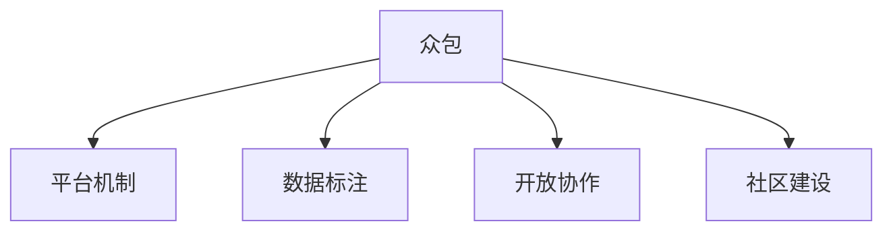

                 

# 众包：汇聚点滴智慧，解决重大难题

> 关键词：众包, 汇聚智慧, 重大难题, 社区力量, 平台机制, 数据标注, 创新解决方案, 开放协作, 问题解决, 社区建设

## 1. 背景介绍

### 1.1 问题由来
在现代社会，我们面临着越来越多的重大难题。从环境保护、公共卫生，到科技创新、社会治理，每一个领域都有其独特的复杂性，需要跨学科、跨领域的多样化视角来攻克。然而，这些问题往往超出了任何单个组织或个人的解决能力，需要借助更大范围的集体智慧。这正是众包（Crowdsourcing）的精髓所在：通过利用大众的智慧和力量，聚集起解决问题所需的知识、技能和创新思维。

### 1.2 问题核心关键点
众包的核心在于将复杂的问题拆分为更小的、可管理的部分，并分配给广大的、具有特定技能的参与者来解决。这种模式不仅能够快速响应社会的需求，还促进了知识的共享和创新的产生。具体来说，众包解决了以下几个关键问题：

1. **获取大规模数据**：众包平台通过广泛招募参与者，可以快速收集大量高质量的数据，为数据分析和研究提供坚实的基础。
2. **汇聚多样化的视角**：不同背景的参与者能够带来不同的观点和方法，有助于发现问题的多个侧面，促进全面理解。
3. **创新解决方案的产生**：面对复杂问题，众包平台提供的开放协作环境鼓励了创新思维，往往能激发出前所未有的解决方案。
4. **成本效益**：相较于传统研究方法，众包能够以较低的成本实现大规模协作，尤其适用于资源有限的组织。
5. **促进社会参与**：众包机制鼓励公众参与，增强了社会成员的归属感和责任感，推动了社会的整体进步。

### 1.3 问题研究意义
研究众包模式，对于推动知识共享、促进社会创新、提高问题解决的效率，具有重要意义：

1. **知识共享**：众包平台为不同领域的专家和爱好者提供了一个交流和协作的平台，促进了知识的自由流动和积累。
2. **社会创新**：众包模式通过开放的问题解决环境，激发了大众的创造力，推动了新技术、新方法的产生。
3. **问题解决效率**：相较于传统的研究方式，众包能够快速汇集大量专业意见，提高了问题解决的效率。
4. **社会参与**：众包机制鼓励公众参与，有助于提升社会整体的技术素养和问题解决能力。
5. **跨界融合**：众包能够促进不同学科、不同领域间的知识融合，推动跨界创新。

## 2. 核心概念与联系

### 2.1 核心概念概述

为了深入理解众包，我们先对相关的核心概念进行概述：

- **众包（Crowdsourcing）**：利用大众的智慧和力量来解决问题。众包平台通过将任务分配给广泛的参与者，汇聚他们的技能和创新思维，最终达成目标。
- **平台机制（Platform Mechanism）**：众包平台提供了一套规则和工具，确保任务分配、执行和评估的透明和公平。
- **数据标注（Data Annotation）**：众包中的一个重要应用场景，通过标注数据集，为机器学习模型的训练提供基础。
- **开放协作（Open Collaboration）**：众包平台鼓励大众的自由参与和协作，强调知识和创新的开放性。
- **社区建设（Community Building）**：众包平台通过机制设计，促进参与者的持续互动和交流，形成了一个自组织的学习和创新社区。

这些核心概念之间的逻辑关系可以通过以下Mermaid流程图来展示：



这个流程图展示了众包平台如何通过平台机制、数据标注、开放协作和社区建设，汇聚智慧，解决重大难题的过程。

## 3. 核心算法原理 & 具体操作步骤

### 3.1 算法原理概述

众包的核心算法原理可以简单概括为任务分解、分配、执行和评估。具体来说：

1. **任务分解**：将复杂问题拆分为多个子任务。
2. **任务分配**：根据参与者的技能和兴趣，将任务分配给最合适的个体或团队。
3. **任务执行**：参与者完成分配的任务，并提交解决方案。
4. **任务评估**：通过评估机制，选择最优的解决方案，并给予适当的激励。

这一过程形成了众包的基本算法框架，适用于各种复杂问题的解决。

### 3.2 算法步骤详解

以下是众包算法的基本操作步骤：

**Step 1: 任务定义**
- 明确问题的具体要求和目标。
- 将问题拆分为可管理的子任务。

**Step 2: 任务分配**
- 设计任务分配规则，选择合适的众包平台。
- 发布任务描述，并吸引感兴趣的参与者。

**Step 3: 任务执行**
- 参与者提交解决方案，并进行必要的质检。
- 审核和筛选合适的解决方案，并提交给相关决策者。

**Step 4: 任务评估**
- 设计评估标准，进行客观的评估。
- 选择最优方案，并给予适当的激励。

**Step 5: 结果应用**
- 应用最优方案，解决原始问题。
- 总结经验教训，为未来任务提供参考。

### 3.3 算法优缺点

众包算法具有以下优点：

1. **快速响应**：能够快速响应社会需求，特别是在资源紧张的情况下。
2. **汇聚智慧**：通过汇聚大众的智慧和力量，提高了问题解决的效率和质量。
3. **成本效益**：相对于传统研究方式，成本较低，特别适用于资源有限的组织。
4. **促进创新**：开放的环境鼓励创新思维，激发了新的解决方案的产生。

同时，众包算法也存在以下缺点：

1. **质量控制**：参与者素质参差不齐，需要严格的质量控制机制。
2. **数据一致性**：多个参与者提交的解决方案可能导致数据不一致，需要协调和整合。
3. **隐私和伦理**：需要处理好数据隐私和伦理问题，确保参与者权益。
4. **平台依赖**：众包平台的选择和维护需要投入资源，增加了运营成本。

### 3.4 算法应用领域

众包算法已经在多个领域得到了广泛应用，包括但不限于：

- **数据标注**：在机器学习模型的训练中，数据标注是一个关键步骤。众包平台如Amazon Mechanical Turk、CrowdFlower等，通过众包方式快速收集大规模高质量的数据集。
- **软件开发**：众包平台如GitHub的贡献者社区，通过开放协作，汇聚全球开发者共同开发软件。
- **市场调研**：通过众包平台进行消费者调研，获取市场反馈和趋势分析。
- **设计和创新**：众包平台如IDEO OpenIDEO，鼓励设计师和创新者提交创意方案，推动产品设计创新。
- **公共政策**：在政策制定过程中，众包平台如CrowdPolicyLab，通过公众参与收集意见，提高政策制定透明度和公正性。

## 4. 数学模型和公式 & 详细讲解 & 举例说明

### 4.1 数学模型构建

在众包算法中，数学模型主要用于任务评估和结果优化。我们以数据标注任务为例，构建一个简单的数学模型。

假设众包平台上有 $N$ 个参与者，每个参与者完成 $T$ 个标注任务，每个任务的成本为 $C$。设每个参与者完成某个任务的正确率概率为 $p_i^t$，总错误率为 $e_i$。模型的目标是在最小化错误率的同时，最大化平台收益 $R$。

定义收益函数为：
$$ R = \sum_{i=1}^{N} \sum_{t=1}^{T} p_i^t C $$

定义错误率函数为：
$$ e_i = \sum_{t=1}^{T} (1 - p_i^t) $$

众包算法的一个核心目标是最大化收益 $R$，同时最小化错误率 $e_i$。

### 4.2 公式推导过程

在上述模型中，我们需要最小化错误率 $e_i$，同时最大化收益 $R$。这可以通过构建拉格朗日乘子法来解决：

设 $\lambda$ 为错误率的惩罚系数，则目标函数为：
$$ \mathcal{L} = R + \lambda \sum_{i=1}^{N} e_i $$

对 $p_i^t$ 求导，得到：
$$ \frac{\partial \mathcal{L}}{\partial p_i^t} = C - \lambda = 0 $$

解得：
$$ p_i^t = 1 - \frac{\lambda}{C} $$

进一步，可以得到 $e_i$ 的表达式：
$$ e_i = \sum_{t=1}^{T} (1 - p_i^t) = \frac{T \lambda}{C} $$

### 4.3 案例分析与讲解

以数据标注任务为例，一个典型的众包平台如CrowdFlower的工作流程如下：

1. **任务发布**：标注平台发布标注任务，并设置完成任务的报酬和截止日期。
2. **参与者选择**：平台根据参与者的历史表现，选择最合适的参与者完成任务。
3. **任务分配**：将任务分配给选定的参与者，并提供必要的工具和指导。
4. **任务执行**：参与者根据平台要求完成标注，并提交解决方案。
5. **质量控制**：平台对提交的解决方案进行质量控制，筛选出高质量的标注结果。
6. **结果反馈**：标注结果返回给标注平台，用于后续的模型训练。

通过这一流程，CrowdFlower能够快速收集大规模、高质量的标注数据，为机器学习模型的训练提供了坚实的基础。

## 5. 项目实践：代码实例和详细解释说明

### 5.1 开发环境搭建

在进行众包项目实践前，我们需要准备好开发环境。以下是使用Python进行众包系统开发的常见环境配置流程：

1. 安装Python：从官网下载并安装Python，推荐使用Python 3.8及以上版本。
2. 安装pip：确保pip已经安装并配置正确，通过 `pip install` 命令可以方便地安装第三方库。
3. 安装Flask：Flask是一个轻量级的Web框架，适合快速开发众包平台的后端服务。
4. 安装SQLite：作为本地数据库，用于存储任务和参与者信息。
5. 安装Redis：作为分布式缓存，提升系统的响应速度和并发处理能力。
6. 安装Tesseract：用于图像识别和OCR任务，支持文本标注。

完成上述步骤后，即可在本地搭建一个基础的众包系统环境。

### 5.2 源代码详细实现

下面以众包数据标注系统为例，给出Python代码实现。

**1. 任务管理**

定义任务类Task，包含任务描述、报酬、截止日期等信息。

```python
class Task:
    def __init__(self, description, reward, deadline):
        self.description = description
        self.reward = reward
        self.deadline = deadline
```

**2. 参与者管理**

定义参与者类Participant，包含参与者的基本信息和历史表现。

```python
class Participant:
    def __init__(self, username, skills):
        self.username = username
        self.skills = skills
```

**3. 任务分配**

定义任务分配函数assign_task，根据参与者的技能和兴趣，选择最合适的参与者完成任务。

```python
def assign_task(task, participants):
    selected_participants = []
    for participant in participants:
        if participant.skills.match(task.description):
            selected_participants.append(participant)
    return selected_participants
```

**4. 任务执行**

定义任务执行函数execute_task，参与者根据任务要求完成标注，并提交解决方案。

```python
def execute_task(participant, task):
    solution = participant.solve_task(task)
    task.submit_solution(solution)
```

**5. 结果评估**

定义结果评估函数evaluate_solution，对参与者的解决方案进行质量控制和筛选。

```python
def evaluate_solution(participant, task):
    solution = task.get_solution()
    quality_score = participant.check_solution(solution)
    if quality_score > 0.8:
        return solution
    else:
        return None
```

**6. 结果应用**

将最优解决方案应用于实际问题，并总结经验教训。

```python
def apply_solution(task, solution):
    # 应用最优解决方案
    task.update_solution(solution)
    # 总结经验教训
    task.save_result()

```

### 5.3 代码解读与分析

**Task类**：
- `__init__`方法：初始化任务的基本信息。
- `description`属性：任务描述。
- `reward`属性：完成任务的报酬。
- `deadline`属性：任务截止日期。

**Participant类**：
- `__init__`方法：初始化参与者的基本信息。
- `username`属性：参与者用户名。
- `skills`属性：参与者的技能和兴趣。

**assign_task函数**：
- 根据参与者的技能和任务描述，选择最合适的参与者完成任务。

**execute_task函数**：
- 参与者根据任务要求完成标注，并提交解决方案。

**evaluate_solution函数**：
- 对参与者的解决方案进行质量控制和筛选，返回符合要求的解决方案。

**apply_solution函数**：
- 将最优解决方案应用于实际问题，并总结经验教训。

这些函数构成了众包数据标注系统的基本逻辑，能够实现任务定义、分配、执行和评估的全流程管理。

### 5.4 运行结果展示

假设我们在本地搭建了一个众包平台，并进行了以下操作：

1. 发布一个数据标注任务，描述为“对10张图片进行标注”，报酬为10美元，截止日期为明天。
2. 邀请了10个参与者，其中5个有标注经验，5个是图像识别专家。
3. 分配任务给5个标注经验丰富的参与者。
4. 参与者完成任务并提交标注结果。
5. 对提交的标注结果进行评估，筛选出高质量的标注。
6. 将最优标注结果应用于实际问题，并总结经验教训。

通过上述流程，平台能够快速收集大规模高质量的标注数据，为机器学习模型的训练提供了坚实的基础。

## 6. 实际应用场景

### 6.1 智能医疗

在智能医疗领域，众包算法可以用于医学影像标注、医疗记录分析等任务。通过众包平台，医疗机构能够快速收集大规模医学影像数据和病历数据，为诊断和治疗提供依据。例如，某医院可以使用众包平台，邀请医生和医疗学生共同标注医学影像，提高影像诊断的准确性和效率。

### 6.2 科技创新

在科技创新领域，众包算法可以用于新产品设计、技术改进等任务。通过众包平台，科技企业能够汇聚全球工程师和创新者的智慧，加速产品创新和技术进步。例如，某科技公司可以使用众包平台，邀请全球工程师共同设计一款新的智能家居产品，通过集思广益，提升产品设计的创新性和实用性。

### 6.3 公共政策

在公共政策领域，众包算法可以用于政策建议征集、民意调查等任务。通过众包平台，政府机构能够广泛听取公众意见，提高政策制定的透明度和公正性。例如，某市政府可以使用众包平台，邀请市民参与公共设施规划的讨论，通过汇聚民意，提升政策决策的科学性和民主性。

### 6.4 未来应用展望

随着众包技术的发展，未来在更多领域将得到应用，如教育、交通、环境保护等。

在教育领域，众包算法可以用于在线课程开发、学生作业评估等任务。通过众包平台，教育机构能够汇聚教师和学生的智慧，提升课程质量和教学效果。

在交通领域，众包算法可以用于道路施工监督、交通流量分析等任务。通过众包平台，交通管理部门能够汇聚公众和专业人员的智慧，提高道路施工质量和交通管理效率。

在环境保护领域，众包算法可以用于环境监测、污染源追踪等任务。通过众包平台，环保组织能够汇聚公众和环保专家的智慧，提升环境保护的效果和公众参与度。

## 7. 工具和资源推荐

### 7.1 学习资源推荐

为了帮助开发者系统掌握众包理论基础和实践技巧，这里推荐一些优质的学习资源：

1. 《Crowdsourcing: Studies and Innovations》书籍：由众包领域的权威专家撰写，全面介绍了众包的基本概念、成功案例和前沿技术。
2. 《Crowdsourcing: A Protocol Book》书籍：提供了众包项目从启动到执行的详细流程，适合实际操作参考。
3. 《Designing Crowdsourced Innovation》书籍：强调众包在创新管理中的应用，提供了丰富的成功案例和实用技巧。
4. 《The Science of Crowdsourcing》文章：科学角度探讨众包背后的心理学和社会学原理，提供了深入的理论分析。
5. 《Crowdsourcing: Work That Matters to Crowds in a World That Needs Big Ideas》文章：探讨众包在未来社会中的重要性和发展前景。

通过对这些资源的学习实践，相信你一定能够快速掌握众包的核心要义，并用于解决实际的NLP问题。

### 7.2 开发工具推荐

高效的开发离不开优秀的工具支持。以下是几款用于众包系统开发的常用工具：

1. Flask：基于Python的轻量级Web框架，适合快速开发众包平台的后端服务。
2. SQLAlchemy：Python的ORM框架，用于数据库操作和数据管理。
3. Redis：高性能的分布式缓存系统，提升系统的响应速度和并发处理能力。
4. Tesseract：开源OCR工具，支持图像识别和文本标注。
5. PyTesseract：Python的Tesseract封装，方便集成OCR功能。
6. Amazon Mechanical Turk：全球领先的众包平台，提供了丰富的众包工具和支持。

合理利用这些工具，可以显著提升众包系统的开发效率，加快创新迭代的步伐。

### 7.3 相关论文推荐

众包技术的发展源于学界的持续研究。以下是几篇奠基性的相关论文，推荐阅读：

1. A Survey of Crowdsourcing-Based Quality Control and Quality Enhancement in Data Annotation（IEEE Access）：总结了众包在数据标注中的应用及其质量控制方法。
2. Crowdsourcing for Health, Wellbeing and Social Good（IEEE Journal on Selected Areas in Information Theory）：探讨了众包在医疗、健康和公共福利中的应用前景。
3. Crowdsourcing and Human Computer Interaction（ACM Computing Surveys）：讨论了众包在HCI中的应用，提供了丰富的成功案例和实践经验。
4. Using Crowdsourcing for Collecting Text from Online Resources for Chinese Named Entity Recognition（IEEE Access）：探讨了众包在中文命名实体识别中的应用，提供了详细的操作流程和实验结果。
5. Crowdsourcing for Open Innovation: Conceptualizing the Crowdsourcing Model（Journal of Innovation Management）：探讨了众包在开放式创新中的应用，提供了创新的应用场景和实施策略。

这些论文代表了大众参与和众包技术的发展脉络。通过学习这些前沿成果，可以帮助研究者把握学科前进方向，激发更多的创新灵感。

## 8. 总结：未来发展趋势与挑战

### 8.1 总结

本文对众包模式进行了全面系统的介绍。首先阐述了众包模式的基本概念和应用场景，明确了众包在汇聚智慧、解决重大难题方面的独特价值。其次，从原理到实践，详细讲解了众包算法的核心步骤和具体实现，给出了众包系统开发的完整代码实例。同时，本文还广泛探讨了众包模式在多个领域的应用前景，展示了众包范式的巨大潜力。最后，本文精选了众包技术的各类学习资源，力求为读者提供全方位的技术指引。

通过本文的系统梳理，可以看到，众包模式正在成为社会创新的重要范式，极大地拓展了问题解决的边界，催生了更多的落地场景。众包模式不仅能够快速响应社会需求，还通过汇聚大众的智慧和力量，提高了问题解决的效率和质量。未来，随着技术的发展和社会的进步，众包模式将进一步推动知识的共享和创新，成为构建未来社会的关键工具。

### 8.2 未来发展趋势

展望未来，众包技术将呈现以下几个发展趋势：

1. **技术智能化**：通过引入人工智能和机器学习技术，提升众包平台的数据处理能力和任务分配效率。
2. **平台多样化**：众包平台将更加多样化，涵盖更多领域和任务，满足不同场景的需求。
3. **用户定制化**：众包平台将提供更多用户定制化选项，提升用户体验和参与度。
4. **全球化**：众包模式将进一步全球化，汇聚全球智慧，提升全球问题的解决能力。
5. **生态化**：众包平台将与其他平台和系统进行生态化整合，提供更全面的服务。

这些趋势凸显了众包模式的广阔前景。这些方向的探索发展，必将进一步提升众包系统的性能和应用范围，为人类认知智能的进化带来深远影响。

### 8.3 面临的挑战

尽管众包模式已经取得了瞩目成就，但在迈向更加智能化、普适化应用的过程中，它仍面临着诸多挑战：

1. **数据隐私和安全**：众包平台需要处理大量敏感数据，如何保护用户隐私和数据安全，是一个重要问题。
2. **质量控制**：参与者素质参差不齐，需要严格的质量控制机制，确保数据的质量和准确性。
3. **平台可持续性**：众包平台的运营需要持续投入资源，如何保证平台的可持续性，是一个挑战。
4. **社区管理**：如何促进社区成员之间的有效沟通和协作，提升社区的整体水平，是一个关键问题。
5. **技术门槛**：众包平台的技术实现复杂，需要具备一定的技术背景，如何降低技术门槛，提高平台的易用性，是一个重要课题。

### 8.4 研究展望

面对众包模式面临的种种挑战，未来的研究需要在以下几个方面寻求新的突破：

1. **引入区块链技术**：通过区块链技术，提升众包平台的数据安全性和透明度，增强社区成员的信任度。
2. **开发智能算法**：引入智能算法，提升众包平台的数据处理能力和任务分配效率，减少人工干预。
3. **设计社交网络**：通过社交网络设计，促进社区成员之间的有效沟通和协作，提升社区的整体水平。
4. **降低技术门槛**：开发用户友好的众包平台，降低技术门槛，提高平台的易用性。
5. **引入多语言支持**：通过多语言支持，提升众包平台的多样性和全球化能力。

这些研究方向的探索，必将引领众包技术迈向更高的台阶，为构建安全、可靠、高效的众包平台铺平道路。面向未来，众包模式将成为解决重大难题的重要手段，推动社会创新和进步。

## 9. 附录：常见问题与解答

**Q1：众包平台如何保障数据隐私和安全？**

A: 众包平台通常采用以下措施保障数据隐私和安全：
1. 数据加密：对敏感数据进行加密处理，确保数据传输和存储的安全性。
2. 访问控制：设置严格的访问权限，限制非授权人员的访问。
3. 匿名处理：对参与者数据进行匿名处理，保护参与者的隐私。
4. 审计日志：记录平台操作日志，定期进行审计，发现和修复安全漏洞。
5. 合规标准：遵守相关法律法规，确保数据处理和使用的合规性。

**Q2：众包平台如何实现高效的质量控制？**

A: 众包平台通常通过以下措施实现高效的质量控制：
1. 任务设计：设计清晰、明确的任务描述，避免歧义和误解。
2. 参与者筛选：根据参与者的历史表现和技能进行筛选，选择最合适的参与者。
3. 质量评估：引入多重评估机制，如人工审核、同行评审等，确保数据的准确性和一致性。
4. 反馈机制：提供反馈和改进机会，鼓励参与者不断提升自身能力。
5. 激励机制：设计合理的激励机制，激励参与者提交高质量的数据。

**Q3：众包平台如何保持社区的活跃度？**

A: 众包平台通常通过以下措施保持社区的活跃度：
1. 社区活动：定期组织社区活动，如讨论会、工作坊等，增强社区成员的参与感。
2. 用户反馈：及时收集和反馈用户意见，改进平台功能和用户体验。
3. 奖励机制：设计合理的奖励机制，激励社区成员积极参与。
4. 知识共享：建立知识共享平台，促进社区成员之间的知识交流和合作。
5. 社区管理：建立有效的社区管理机制，确保社区的规范和秩序。

通过这些措施，众包平台能够持续吸引和留住高素质的参与者，提升社区的整体水平和协作效率。

---

作者：禅与计算机程序设计艺术 / Zen and the Art of Computer Programming

