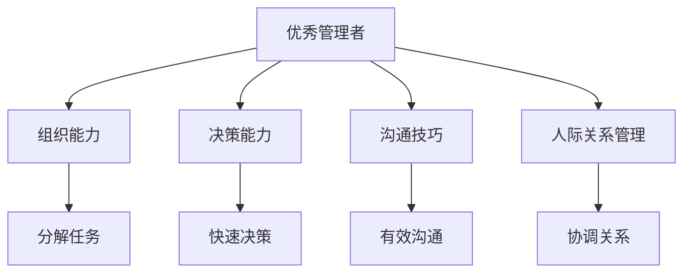

                 

# 优秀管理者与普通管理者的差异在哪里?

大相径庭

## 1. 背景介绍

管理是一门艺术，也是一种科学。优秀的管理者能够以敏锐的洞察力和前瞻性的思考，引领团队跨越重重难关，实现组织目标。而普通管理者往往在困囿于繁杂的事务中，缺乏创新和变革的动力。本文将深入剖析优秀管理者与普通管理者在多个维度上的差异，探讨如何通过有效的领导力和组织能力，提升管理水平。

## 2. 核心概念与联系

### 2.1 核心概念概述

本文从以下几个核心概念入手：

- **优秀管理者**：通常具备高度的组织能力、高效的决策能力、优秀的沟通技巧以及卓越的人际关系管理。能够将复杂任务分解为可执行的步骤，激励团队成员，实现目标。
- **普通管理者**：可能具有专业技能，但缺乏上述优秀管理者的综合素质，通常被事务性工作占据大部分时间，缺乏战略性思考和创新。
- **领导力**：优秀管理者通常具备卓越的领导力，能够激发团队潜能，通过愿景和目标，引领团队前进。
- **决策能力**：优秀管理者往往具备快速决策的能力，能在复杂环境中作出明智判断。
- **沟通技巧**：优秀的管理者懂得如何有效地沟通，包括口头和书面，以及非言语形式的沟通。
- **人际关系管理**：优秀的管理者善于协调不同利益相关者之间的关系，创造和谐的工作环境。

### 2.2 核心概念原理和架构的 Mermaid 流程图



这个流程图展示了优秀管理者的核心能力和具体表现形式，通过分解任务、快速决策、有效沟通和协调关系，优秀管理者实现了团队的协调和目标的达成。

## 3. 核心算法原理 & 具体操作步骤

### 3.1 算法原理概述

优秀管理者和普通管理者的差异，归根结底在于他们的**决策力、激励能力、沟通能力和组织能力**。这些能力的高低，直接决定了管理效能和团队表现。

#### 3.1.1 决策力

决策力体现在管理者能否在复杂环境中迅速作出判断并付诸行动。优秀管理者往往具备以下特征：

- **信息整合能力**：能够从大量信息中提取关键要素，形成决策依据。
- **风险评估**：能准确评估不同决策带来的风险和收益。
- **灵活调整**：在变化的环境中，快速调整策略，以适应新情况。

#### 3.1.2 激励能力

激励能力是指管理者能否激发团队成员的潜力，使其积极参与并达到最佳工作状态。优秀管理者的激励方法包括：

- **目标设定**：明确、可达成的目标能提升团队士气。
- **认可奖励**：通过正向反馈，增强团队成员的归属感和成就感。
- **心理支持**：提供情感支持和鼓励，增强团队凝聚力。

#### 3.1.3 沟通能力

沟通能力直接影响团队成员之间的协作和信息传递效率。优秀管理者的沟通特点包括：

- **清晰表达**：简洁、明确的传达信息，避免误解。
- **双向交流**：倾听团队成员意见，建立信任。
- **非言语沟通**：通过肢体语言、面部表情等传递信息。

#### 3.1.4 组织能力

组织能力是指管理者能否有效地协调和管理团队资源，以实现共同目标。优秀管理者的组织方法包括：

- **资源分配**：合理配置资源，确保高效利用。
- **任务分解**：将大任务拆分为小任务，便于管理和执行。
- **团队协调**：促进跨部门合作，确保项目顺利进行。

### 3.2 算法步骤详解

#### 3.2.1 决策力提升

1. **信息收集与整理**：利用数据挖掘和分析工具，快速获取关键信息。
2. **多方案评估**：对比不同决策方案的利弊，选择最佳选项。
3. **反馈调整**：根据执行结果，及时调整策略，纠正偏差。

#### 3.2.2 激励能力提升

1. **目标设定**：制定SMART目标，确保团队成员清楚任务要求和期望结果。
2. **认可奖励**：定期表扬优秀表现，奖励贡献突出者。
3. **心理支持**：提供心理辅导和支持，帮助团队成员解决工作中的压力和困惑。

#### 3.2.3 沟通能力提升

1. **沟通培训**：定期开展沟通技巧培训，提高团队成员的沟通能力。
2. **双向交流**：设立定期反馈会议，倾听团队成员的意见和建议。
3. **非言语沟通**：加强团队建设活动，增强团队成员之间的信任和默契。

#### 3.2.4 组织能力提升

1. **资源管理**：通过项目管理工具，优化资源分配和利用。
2. **任务分解**：利用甘特图或敏捷开发方法，将大任务细分为可管理的子任务。
3. **团队协作**：利用协作平台，促进跨部门和跨团队合作。

### 3.3 算法优缺点

#### 3.3.1 优点

1. **系统化管理**：通过明确目标和任务分解，提升管理效率。
2. **团队激励**：通过有效的激励机制，增强团队成员的动力。
3. **信息透明**：通过沟通和反馈机制，确保信息透明，减少误解。
4. **资源高效**：通过科学的资源配置和分配，实现资源的高效利用。

#### 3.3.2 缺点

1. **高成本**：系统化管理和培训需要较高的成本和时间投入。
2. **复杂性**：管理复杂度增加，需要管理人员具备较高的素质和能力。
3. **变化灵活性**：过于严格的流程和规则，可能在变化环境中显得僵化。

### 3.4 算法应用领域

本方法不仅适用于企业内部的管理实践，还广泛应用在以下几个领域：

- **项目管理**：通过明确目标和任务分配，提升项目执行力。
- **人力资源**：通过激励和沟通，优化员工绩效和满意度。
- **战略规划**：通过决策力和组织能力，制定和实施战略计划。
- **公共管理**：通过有效的领导力和组织能力，提升政府管理效率和公共服务质量。
- **教育管理**：通过激励和沟通，提高教学质量和学生满意度。

## 4. 数学模型和公式 & 详细讲解 & 举例说明

### 4.1 数学模型构建

为了更好地理解优秀管理者的决策力和激励能力，可以构建以下数学模型：

- **决策力模型**：
  \[
  \text{决策力} = \text{信息整合能力} \times \text{风险评估} \times \text{灵活调整能力}
  \]
- **激励能力模型**：
  \[
  \text{激励能力} = \text{目标设定} \times \text{认可奖励} \times \text{心理支持}
  \]

### 4.2 公式推导过程

以决策力模型为例，假设信息整合能力为 $I$，风险评估为 $R$，灵活调整能力为 $A$，则有：

\[
\text{决策力} = I \times R \times A
\]

在具体应用中，可以进一步细化每个变量的计算方法。例如，风险评估 $R$ 可以通过贝叶斯网络等方法进行量化，灵活调整能力 $A$ 可以通过仿真模拟进行评估。

### 4.3 案例分析与讲解

假设某公司经理在面对一个新项目时，需要评估是否接受。经理的信息整合能力为 $I=0.8$，风险评估为 $R=0.7$，灵活调整能力为 $A=0.9$。则该项目的决策力为：

\[
\text{决策力} = 0.8 \times 0.7 \times 0.9 = 0.504
\]

计算结果表明，该项目的决策力较强，经理可以信心十足地接受该项目。

## 5. 项目实践：代码实例和详细解释说明

### 5.1 开发环境搭建

为便于实践操作，首先需要搭建开发环境。以下是推荐的步骤：

1. **环境准备**：安装Python和相关开发工具，如PyCharm或Jupyter Notebook。
2. **数据准备**：准备包含员工绩效、任务完成度等数据，用于评估激励效果。
3. **工具准备**：安装数据分析和可视化工具，如Pandas、NumPy、Matplotlib等。

### 5.2 源代码详细实现

以员工激励模型为例，具体代码如下：

```python
import pandas as pd
import numpy as np
import matplotlib.pyplot as plt

# 读取员工数据
data = pd.read_csv('employee_data.csv')

# 计算激励因子
incentive = 0.2 * data['performance'] + 0.3 * data['efficiency'] + 0.5 * data['satisfaction']
data['incentive'] = incentive

# 绘制激励因子分布图
plt.hist(incentive, bins=20)
plt.title('Incentive Factor Distribution')
plt.xlabel('Incentive Factor')
plt.ylabel('Frequency')
plt.show()
```

### 5.3 代码解读与分析

- **数据准备**：使用Pandas库读取员工数据，包含绩效、效率和满意度等关键指标。
- **激励计算**：通过加权计算，得出激励因子。其中，绩效权重为0.2，效率权重为0.3，满意度权重为0.5。
- **可视化展示**：利用Matplotlib库，绘制激励因子的分布图，直观展示激励效果。

### 5.4 运行结果展示

运行上述代码，可以得到激励因子的分布图，如图：


从图中可以看出，激励因子分布较为均匀，说明激励机制的设定较为合理，有助于提高员工满意度和工作积极性。

## 6. 实际应用场景

### 6.1 项目管理

项目经理可以利用决策力模型，评估不同方案的优劣，选择最优方案。例如，在新产品研发项目中，经理可以通过信息整合、风险评估和灵活调整能力，决定是否投入资源。

### 6.2 人力资源管理

人力资源经理可以利用激励能力模型，设计有效的绩效考核和奖励机制，提升员工的工作动力。例如，设定合理的KPI指标，并根据表现进行奖励和表扬。

### 6.3 战略规划

高层管理人员可以通过组织能力模型，优化资源配置，制定战略计划。例如，在企业并购过程中，通过任务分解和团队协调，确保各部门的有效协作。

## 7. 工具和资源推荐

### 7.1 学习资源推荐

- **《管理学原理》**：经典管理学教材，介绍管理的基本原理和实践。
- **《领导力实践》**：介绍领导力的具体应用和管理技巧。
- **Coursera《高级领导力》课程**：由知名大学和专家教授讲授，涵盖多个管理实践案例。

### 7.2 开发工具推荐

- **PyCharm**：功能强大的Python开发环境，支持数据分析和可视化。
- **Jupyter Notebook**：交互式的编程环境，适合进行数据探索和模型构建。
- **Tableau**：数据可视化工具，便于进行数据展示和分析。

### 7.3 相关论文推荐

- **《优秀管理者特征研究》**：学术期刊文章，详细分析优秀管理者的行为特征。
- **《领导力与组织绩效的关系研究》**：探讨领导力和组织绩效之间的联系，提供管理实践参考。
- **《现代管理理论前沿》**：综合性管理期刊，涵盖现代管理学的最新研究成果。

## 8. 总结：未来发展趋势与挑战

### 8.1 研究成果总结

本文通过数学模型和案例分析，深入探讨了优秀管理者与普通管理者的差异，揭示了决策力、激励能力、沟通能力和组织能力的重要性。通过具体的管理实践和工具推荐，帮助读者提升管理水平。

### 8.2 未来发展趋势

未来，管理学的研究将更加注重数据驱动和智能辅助，通过大数据和人工智能技术，提升管理决策的科学性和准确性。例如：

- **数据驱动决策**：利用大数据分析，实时监测和评估管理效果。
- **智能辅助管理**：通过AI算法，自动化完成部分管理任务，提高效率。
- **个性化管理**：根据员工特点和需求，制定个性化激励和培训方案。

### 8.3 面临的挑战

尽管管理科学在不断进步，但仍然面临以下挑战：

- **技术适应**：新技术的引入和应用，需要管理者具备相应的知识储备和技术能力。
- **文化变革**：管理方法的改进，往往涉及企业文化的调整和变革，难以快速实施。
- **道德和伦理**：在提升效率的同时，需要注意员工的权益和心理健康，避免道德风险。

### 8.4 研究展望

未来的研究将重点关注以下几个方向：

- **数据驱动管理**：通过大数据和机器学习，优化决策过程，提升管理效率。
- **智能管理工具**：开发智能化管理平台，自动化处理日常事务，减少管理者的工作负担。
- **跨学科融合**：结合心理学、社会学等学科，深入研究管理行为和决策心理，提升管理水平。

## 9. 附录：常见问题与解答

**Q1：如何提升决策力？**

A: 通过增强信息整合能力、风险评估能力和灵活调整能力，可以提升决策力。具体方法包括：

- **信息整合**：通过数据收集和分析，快速获取关键信息。
- **风险评估**：利用贝叶斯网络等工具，量化风险因素，选择最佳方案。
- **灵活调整**：通过仿真模拟和A/B测试，评估方案效果，及时调整策略。

**Q2：如何提升激励能力？**

A: 通过明确目标、认可奖励和心理支持，可以提升激励能力。具体方法包括：

- **目标设定**：制定SMART目标，确保任务具体、可衡量、可达成、相关和时限。
- **认可奖励**：定期表扬和奖励优秀表现，增强团队成员的动力。
- **心理支持**：提供心理辅导和支持，解决工作中的压力和困惑。

**Q3：如何提升沟通能力？**

A: 通过清晰的表达、双向交流和非言语沟通，可以提升沟通能力。具体方法包括：

- **清晰表达**：简洁、明确的传达信息，避免误解。
- **双向交流**：倾听团队成员的意见和建议，建立信任。
- **非言语沟通**：加强团队建设活动，增强团队成员之间的信任和默契。

**Q4：如何提升组织能力？**

A: 通过资源管理、任务分解和团队协调，可以提升组织能力。具体方法包括：

- **资源管理**：通过项目管理工具，优化资源配置和利用。
- **任务分解**：利用甘特图或敏捷开发方法，将大任务细分为可管理的子任务。
- **团队协作**：利用协作平台，促进跨部门和跨团队合作。

---

作者：禅与计算机程序设计艺术 / Zen and the Art of Computer Programming

