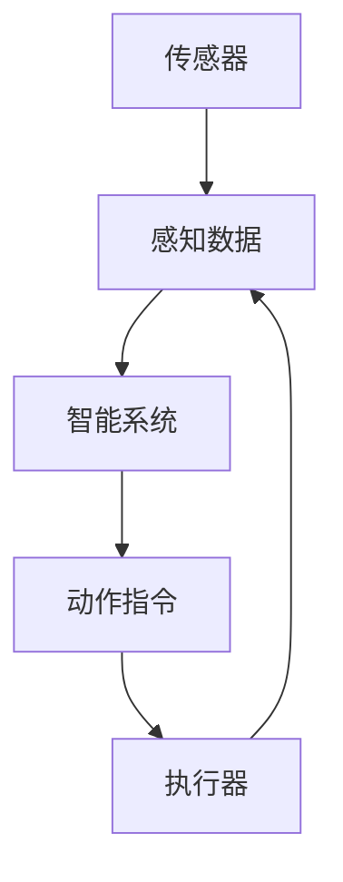
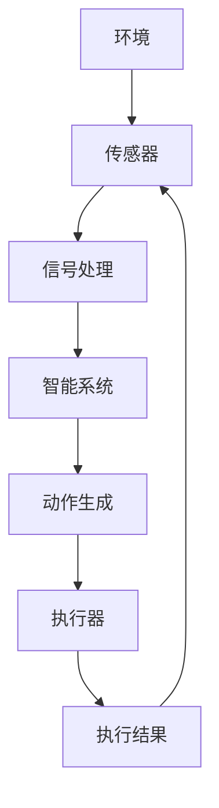

                 

# 传感器和执行器：获取和执行数据

## 1. 背景介绍

在现代智能系统中，传感器和执行器扮演着至关重要的角色。传感器负责获取环境信息，而执行器负责根据指令执行相应的动作。这种“感知-执行”的闭环控制机制，使得智能系统能够自适应环境变化，完成复杂的任务。无论是自动驾驶汽车、工业机器人，还是智能家居设备，传感器和执行器都是不可或缺的关键组件。

本文将深入探讨传感器的数据获取和执行器的动作执行机制，阐述其在智能系统中的核心作用，并讨论其面临的关键挑战和解决方案。通过深入理解传感器的数据获取与执行器的动作执行原理，开发者能够设计出更高效、更可靠的智能系统。

## 2. 核心概念与联系

### 2.1 核心概念概述

传感器和执行器作为智能系统的“眼睛和手脚”，其核心概念包括：

- **传感器**：用于感知外界环境信息的装置，如温度传感器、图像传感器、力传感器等。传感器将环境数据转换为电信号或其他形式的信号，供智能系统处理。

- **执行器**：根据智能系统指令执行相应动作的装置，如电机、电磁阀、机械臂等。执行器将电信号或其他形式的信号转换为机械动作，实现对环境的控制。

- **感知-执行循环**：传感器获取环境信息，智能系统根据感知数据生成动作指令，执行器执行动作，形成闭环控制，智能系统根据执行结果调整感知策略和动作指令，形成动态反馈。

这些概念之间的联系可以通过以下Mermaid流程图来展示：



这个流程图展示了传感器和执行器在智能系统中的基本工作流程：

1. 传感器获取环境信息，并将其转换为信号。
2. 智能系统根据传感器数据生成动作指令。
3. 执行器执行动作指令，实现对环境的操作。
4. 执行结果反馈回传感器，进入下一轮感知-执行循环。

### 2.2 核心概念原理和架构的 Mermaid 流程图



这个流程图示例展示了传感器、信号处理、智能系统和执行器之间的逻辑联系。环境数据通过传感器采集，经过信号处理模块进行数据转换和处理，智能系统根据处理后的数据生成动作指令，执行器执行动作并反馈结果，形成闭环控制。

## 3. 核心算法原理 & 具体操作步骤

### 3.1 算法原理概述

传感器和执行器的核心算法原理基于信号处理和控制理论。传感器通过将环境信息转换为电信号或其他形式的信号，智能系统通过算法对信号进行处理，生成动作指令。执行器则通过算法将指令转换为机械动作。这种“感知-执行”的闭环控制机制，使得智能系统能够自适应环境变化，完成复杂的任务。

### 3.2 算法步骤详解

#### 3.2.1 传感器数据获取

传感器数据获取步骤包括以下几个关键环节：

1. **数据采集**：传感器从环境中获取原始数据，如温度、压力、图像等。
2. **数据转换**：将原始数据转换为电信号或其他形式的信号，方便智能系统处理。
3. **数据滤波**：对信号进行滤波处理，去除噪声和干扰，提高数据质量。
4. **数据编码**：将信号转换为数字编码形式，供智能系统识别和处理。

#### 3.2.2 智能系统信号处理

智能系统信号处理步骤包括以下几个关键环节：

1. **数据解码**：将数字编码形式的信号解码为原始数据。
2. **数据分析和特征提取**：对原始数据进行分析，提取有用的特征。
3. **数据建模和预测**：根据提取的特征，建立模型并进行预测。
4. **动作指令生成**：根据预测结果生成动作指令。

#### 3.2.3 执行器动作执行

执行器动作执行步骤包括以下几个关键环节：

1. **指令接收**：接收智能系统生成的动作指令。
2. **指令解码**：将指令解码为具体的控制信号。
3. **执行器控制**：根据控制信号执行相应的动作。
4. **执行结果反馈**：将执行结果反馈回智能系统，完成闭环控制。

### 3.3 算法优缺点

传感器和执行器的核心算法具有以下优点：

1. **实时性**：能够实时获取和处理环境数据，快速响应环境变化。
2. **准确性**：通过先进的信号处理和算法优化，数据处理准确性高。
3. **可靠性**：传感器和执行器通常是硬件设备，具有高可靠性。
4. **可扩展性**：随着技术的发展，传感器和执行器的种类和功能不断扩展，适应性更强。

同时，这些算法也存在一些局限性：

1. **数据处理复杂性**：传感器数据种类多样，处理复杂。
2. **系统复杂性**：传感器和执行器与智能系统的接口复杂，需要精心设计和调试。
3. **成本高**：高性能传感器和执行器通常价格较高。
4. **环境适应性**：某些传感器和执行器对环境要求较高，如温度、湿度等。

### 3.4 算法应用领域

传感器和执行器的核心算法广泛应用于多个领域，包括：

- **工业自动化**：机器人、自动化生产线等。
- **医疗设备**：智能诊断、手术机器人等。
- **智能家居**：智能门锁、智能照明、智能安防等。
- **智能交通**：自动驾驶汽车、交通监控系统等。
- **环境监测**：气象站、水质监测、污染监测等。

这些领域中，传感器和执行器的应用使得智能系统能够实现对环境的感知和控制，提升系统性能和用户体验。

## 4. 数学模型和公式 & 详细讲解 & 举例说明

### 4.1 数学模型构建

传感器的数据获取和执行器的动作执行可以建模为信号处理和控制系统。假设传感器从环境采集的数据为 $x(t)$，智能系统的信号处理算法为 $f(x(t))$，执行器的控制算法为 $g(x(t))$，执行器的动作结果为 $y(t)$。

### 4.2 公式推导过程

根据上述假设，我们可以推导出以下公式：

$$
y(t) = g(f(x(t)))
$$

其中，$x(t)$ 表示在时间 $t$ 时刻从环境采集的数据，$f(x(t))$ 表示智能系统对数据 $x(t)$ 的处理结果，$g(f(x(t)))$ 表示执行器根据处理结果 $f(x(t))$ 执行的动作结果。

### 4.3 案例分析与讲解

以一个简单的工业自动化系统为例，该系统包含温度传感器、智能控制单元和加热器。

- **温度传感器**：采集环境温度数据 $x(t)$。
- **智能控制单元**：根据温度数据 $x(t)$ 计算温度偏差 $f(x(t)) = x(t) - T_{set}$，其中 $T_{set}$ 为设定温度。
- **加热器**：根据温度偏差 $f(x(t))$ 调整加热功率 $g(f(x(t)))$。

假设环境温度为 $T(t)$，设定温度为 $T_{set} = 100^\circ C$，智能控制单元的算法为 $f(x(t)) = x(t) - T_{set}$，加热器的控制算法为 $g(f(x(t))) = k \cdot f(x(t))$，其中 $k$ 为加热器响应系数。

根据上述公式，我们可以推导出加热器的动作结果为：

$$
y(t) = g(f(x(t))) = k \cdot (x(t) - T_{set})
$$

假设加热器响应系数 $k = 0.2$，环境温度 $T(t)$ 在时间 $t$ 时刻为 $95^\circ C$，则智能控制单元计算出的温度偏差 $f(x(t)) = 95 - 100 = -5$，加热器的动作结果为：

$$
y(t) = g(f(x(t))) = 0.2 \cdot (-5) = -1
$$

因此，加热器在时间 $t$ 时刻的加热功率为 $-1$，即关闭加热器。

## 5. 项目实践：代码实例和详细解释说明

### 5.1 开发环境搭建

为了进行传感器和执行器的开发，需要搭建一个完整的开发环境。以下是使用Python进行开发的建议配置：

1. **安装Python**：安装Python 3.7及以上版本。
2. **安装NumPy**：NumPy是Python科学计算的基础库，用于数组操作和数学运算。
3. **安装Pandas**：Pandas是Python数据处理库，用于数据清洗和分析。
4. **安装SciPy**：SciPy是Python科学计算库，用于数值优化和信号处理。
5. **安装Matplotlib**：Matplotlib是Python绘图库，用于数据可视化。
6. **安装OpenCV**：OpenCV是Python计算机视觉库，用于图像处理和分析。

### 5.2 源代码详细实现

以下是一个简单的温度控制系统示例，包括温度传感器、智能控制单元和加热器。

```python
import numpy as np
import pandas as pd
from scipy.optimize import minimize
import matplotlib.pyplot as plt
import cv2

# 温度传感器数据模拟
def generate_temperature_data(n=100, mean=95, std=2, noise=0.1):
    return np.random.normal(mean, std, n) + noise * np.random.normal(0, 1, n)

# 智能控制单元算法
def control_algorithm(T, T_set):
    return T - T_set

# 加热器控制算法
def heater_algorithm(f, k=0.2):
    return k * f

# 加热器动作结果模拟
def simulate_heater(T, T_set, k=0.2):
    f = control_algorithm(T, T_set)
    y = heater_algorithm(f, k)
    return y

# 运行温度控制系统
n = 100
T = generate_temperature_data(n=n)
T_set = 100
k = 0.2
y = []

for t in range(n):
    f = control_algorithm(T[t], T_set)
    y.append(simulate_heater(T[t], T_set, k))

# 数据可视化
plt.plot(T, label='Temperature')
plt.plot(y, label='Heater Power')
plt.legend()
plt.show()
```

在上述代码中，我们使用NumPy生成模拟的温度数据，通过控制算法计算温度偏差，并通过加热器算法调整加热功率。最终，我们通过数据可视化展示了系统的运行结果。

### 5.3 代码解读与分析

在上述代码中，我们定义了几个关键函数：

- `generate_temperature_data`：模拟生成温度数据。
- `control_algorithm`：智能控制单元的算法，计算温度偏差。
- `heater_algorithm`：加热器控制算法，调整加热功率。
- `simulate_heater`：模拟加热器的动作结果。

这些函数组合起来，形成了完整的温度控制系统。通过可视化结果，我们可以看到智能控制单元根据温度偏差调整加热器功率，实现对环境的控制。

## 6. 实际应用场景

### 6.1 智能家居

智能家居系统中，传感器和执行器可以用于实现自动化控制。例如，智能门锁可以根据主人回家时间自动开锁，智能照明可以根据环境光线自动调整亮度，智能安防可以根据异常声音自动报警。通过传感器和执行器的协同工作，智能家居系统能够提供更加智能化、便捷化的生活体验。

### 6.2 工业自动化

工业自动化系统中，传感器和执行器可以用于实现机器人自动化生产线。例如，机器臂可以配备温度传感器、力传感器等，通过智能控制系统实时调整运动参数，完成精密加工。通过传感器和执行器的协同工作，工业自动化系统能够提高生产效率和产品质量。

### 6.3 医疗设备

医疗设备中，传感器和执行器可以用于实现智能诊断和手术机器人。例如，医学影像设备可以配备高分辨率图像传感器，通过智能系统进行图像处理和分析，辅助医生诊断疾病。手术机器人可以配备力反馈传感器，通过智能控制系统实时调整操作力度，完成精准手术。通过传感器和执行器的协同工作，医疗设备能够提高诊断和手术的精准度和安全性。

## 7. 工具和资源推荐

### 7.1 学习资源推荐

为了深入理解传感器和执行器的核心算法，以下是几本推荐的书籍：

1. 《信号处理基础》：一本经典信号处理教材，涵盖信号采集、处理和分析的基础知识。
2. 《控制系统基础》：一本经典控制系统教材，涵盖控制算法和控制系统的基本原理。
3. 《Python科学计算》：一本Python科学计算教材，涵盖NumPy、SciPy等库的详细使用方法。
4. 《计算机视觉基础》：一本计算机视觉教材，涵盖图像处理、特征提取和分类等基础知识。
5. 《智能家居系统设计》：一本智能家居系统设计教材，涵盖传感器和执行器的协同工作原理。

这些书籍可以帮助开发者深入理解传感器和执行器的核心算法，并掌握相关的工具和技术。

### 7.2 开发工具推荐

为了高效进行传感器和执行器的开发，以下是几款推荐的开发工具：

1. **MATLAB/Simulink**：MATLAB是MathWorks公司开发的一款数学软件，Simulink是MATLAB的可视化开发环境，可用于模拟和控制系统的设计。
2. **LabVIEW**：LabVIEW是National Instruments公司开发的一款图形化编程语言，可用于编写传感器和执行器的控制程序。
3. **Arduino**：Arduino是一款开源硬件平台，可用于编写传感器和执行器的控制程序，具有简单易用的开发环境。
4. **ROS（Robot Operating System）**：ROS是ROS基金会开发的机器人操作系统，可用于机器人系统的开发和调试。
5. **OpenCV**：OpenCV是Open Source Computer Vision Library的缩写，可用于图像处理和计算机视觉任务。

这些工具可以帮助开发者高效进行传感器和执行器的开发和调试，提升开发效率。

### 7.3 相关论文推荐

为了了解传感器和执行器的最新研究成果，以下是几篇推荐的论文：

1. "A Survey on the Applications and Developments of Sensors in Robotics"：综述了传感器在机器人中的应用和发展。
2. "The Role of Actuators in Control Systems"：讨论了执行器在控制系统中的作用和设计方法。
3. "Adaptive Control of Robotic Manipulators Using Neural Networks"：介绍了一种基于神经网络的自适应控制方法，用于机器人操纵器的控制。
4. "Real-time Visual Object Tracking Using Deep Learning"：介绍了一种基于深度学习的实时视觉对象跟踪方法，用于智能系统的感知环节。
5. "Sensor Data Acquisition and Processing in Internet of Things (IoT)"：讨论了物联网中的传感器数据采集和处理技术。

这些论文代表了传感器和执行器的最新研究进展，可以帮助开发者了解前沿技术和方法。

## 8. 总结：未来发展趋势与挑战

### 8.1 研究成果总结

本文深入探讨了传感器和执行器的核心算法原理和操作步骤，详细分析了其在智能系统中的关键作用，并通过项目实践展示了其应用场景和开发流程。通过这些内容，读者可以全面理解传感器和执行器的核心算法和实际应用。

### 8.2 未来发展趋势

未来，传感器和执行器的技术将呈现出以下几个发展趋势：

1. **智能化和集成化**：随着技术的发展，传感器和执行器将更加智能化和集成化，能够自动进行数据处理和决策。
2. **网络化和无线化**：物联网的普及将使得传感器和执行器的网络化和无线化成为趋势，实现低成本、高可靠性的数据传输和控制。
3. **自适应和自学习**：基于机器学习和深度学习的自适应和自学习方法将使得传感器和执行器能够自我学习和优化，提高系统的性能和可靠性。
4. **多模态融合**：传感器和执行器将能够融合多种数据源，实现多模态数据的协同处理和分析，提升系统的综合性能。
5. **边缘计算和分布式控制**：随着边缘计算技术的发展，传感器和执行器将更多地部署在边缘节点上，实现分布式控制和实时处理。

### 8.3 面临的挑战

尽管传感器和执行器的技术不断发展，但仍然面临以下挑战：

1. **数据处理和存储**：传感器数据种类多样，处理复杂，存储量大，需要高效的数据处理和存储技术。
2. **实时性和可靠性**：传感器和执行器的实时性和可靠性是关键问题，需要在硬件和软件设计上进行全面优化。
3. **安全性和隐私保护**：传感器和执行器涉及大量敏感数据，需要加强安全性和隐私保护措施。
4. **标准化和互操作性**：传感器和执行器的标准化和互操作性问题是制约其广泛应用的重要因素。
5. **成本和维护**：传感器和执行器的成本和维护成本较高，需要在设计和应用中进行全面考虑。

### 8.4 研究展望

为了克服传感器和执行器面临的挑战，未来的研究需要在以下几个方面进行突破：

1. **高效数据处理技术**：开发高效的数据处理和存储技术，提高传感器数据处理的效率和可靠性。
2. **实时控制算法**：研究实时控制算法，提高传感器和执行器的实时性和可靠性。
3. **隐私保护技术**：开发隐私保护技术，保护传感器和执行器涉及的敏感数据。
4. **标准化和互操作性**：制定传感器和执行器的标准化协议，提高不同设备和系统的互操作性。
5. **低成本和可维护设计**：设计低成本和可维护的传感器和执行器，降低应用成本和维护难度。

## 9. 附录：常见问题与解答

### Q1：传感器和执行器在智能系统中的作用是什么？

A: 传感器和执行器是智能系统的“眼睛和手脚”，负责感知环境和执行任务。传感器从环境中获取原始数据，执行器根据智能系统指令执行相应的动作，从而实现对环境的控制。

### Q2：如何选择传感器和执行器？

A: 传感器和执行器的选择应根据具体应用场景的需求进行，考虑因素包括传感器和执行器的响应时间、精度、可靠性、成本和功耗等。

### Q3：如何处理传感器数据？

A: 传感器数据通常需要进行预处理，包括数据采集、数据转换、数据滤波和数据编码等步骤。预处理可以提高数据的质量和可用性，便于后续分析和处理。

### Q4：如何设计智能控制系统？

A: 智能控制系统的设计需要考虑传感器的数据获取、信号处理、控制算法和执行器动作执行等多个环节。设计过程中应注重系统的实时性、可靠性和可扩展性。

### Q5：如何优化传感器和执行器的性能？

A: 优化传感器和执行器的性能可以从以下几个方面入手：1) 优化传感器数据采集和预处理流程；2) 改进信号处理算法和控制算法；3) 提高执行器的响应速度和精度；4) 优化系统的实时性和可靠性；5) 降低系统的成本和功耗。

### Q6：如何保护传感器和执行器的数据安全？

A: 保护传感器和执行器的数据安全需要采用多种技术手段，包括数据加密、访问控制、隐私保护和异常检测等。同时，需要制定严格的数据使用和保护政策，确保数据的合法使用和保护。

---

作者：禅与计算机程序设计艺术 / Zen and the Art of Computer Programming

