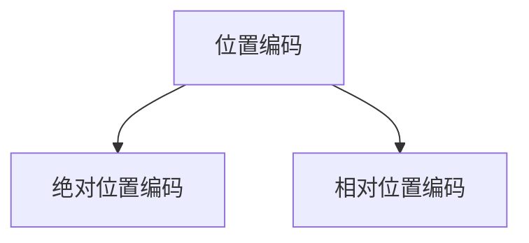

                 

# 位置编码：保持序列信息

## 1. 背景介绍

### 1.1 问题由来

在深度学习中，位置编码是一个基础且关键的概念，特别是在处理序列数据时。位置编码的作用是为序列中的每个元素赋予位置信息，使得模型在处理序列数据时能够保留和利用位置信息，从而提升模型对序列的建模能力。位置编码技术在自然语言处理、计算机视觉、音频处理等领域中有着广泛的应用。

近年来，随着深度学习模型的不断进步，位置编码技术也在不断演进。例如，在自然语言处理中，Bert和GPT等模型的出现，使得位置编码技术变得更加高效和精确。然而，在实际应用中，位置编码技术仍然存在一些挑战和限制，如计算复杂度高、适应性差等问题。因此，为了更好地理解位置编码技术，本文将对位置编码的原理和应用进行深入探讨。

### 1.2 问题核心关键点

位置编码技术的关键点包括：
- 位置编码的原理和作用。
- 常见的位置编码方法及其优缺点。
- 位置编码在自然语言处理中的应用场景。
- 位置编码技术的未来发展方向。

这些关键点将帮助读者深入理解位置编码技术，并在实际应用中灵活应用。

## 2. 核心概念与联系

### 2.1 核心概念概述

在深度学习中，位置编码（Positional Encoding）是一种用于嵌入位置信息的技术。它的作用是赋予序列中每个元素一个位置信息，以便模型在处理序列时能够利用位置信息进行更准确的建模。

位置编码通常被嵌入到神经网络模型中，以便模型能够感知到序列中每个元素的位置关系。常见的嵌入方式包括绝对位置编码和相对位置编码两种。

### 2.2 核心概念原理和架构的 Mermaid 流程图



这个流程图展示了位置编码的两种主要形式：绝对位置编码和相对位置编码。绝对位置编码直接将位置信息嵌入到每个元素中，而相对位置编码则使用位置编码与序列中其他位置的编码进行比较，以确定当前位置。

## 3. 核心算法原理 & 具体操作步骤

### 3.1 算法原理概述

位置编码的核心原理是利用位置的特征向量和位置的补特征向量来为每个位置编码。绝对位置编码直接使用位置的线性变换来生成特征向量，而相对位置编码则使用位置编码与序列中其他位置的编码进行比较，以确定当前位置。

位置编码技术广泛应用于自然语言处理中，例如在序列建模、自然语言生成、文本分类等任务中。在这些任务中，位置编码技术可以帮助模型更好地捕捉序列中的上下文信息，提升模型的表现。

### 3.2 算法步骤详解

#### 3.2.1 绝对位置编码步骤

绝对位置编码步骤包括：
1. 获取序列长度 $L$。
2. 对于序列中的每个位置 $i$，计算其位置特征向量 $P_i$，公式如下：
   $$
   P_i = \sin\left(\frac{2\pi i}{L}\right), \quad P_{i+1/2} = \cos\left(\frac{2\pi i}{L}\right)
   $$
   其中 $P_i$ 和 $P_{i+1/2}$ 分别对应位置 $i$ 和位置 $i+1/2$ 的位置特征向量。
3. 将位置特征向量 $P_i$ 和 $P_{i+1/2}$ 组合成位置编码向量，公式如下：
   $$
   PE_i = \begin{bmatrix} P_i \\ P_{i+1/2} \end{bmatrix}
   $$
   其中 $PE_i$ 表示位置 $i$ 的编码向量。

#### 3.2.2 相对位置编码步骤

相对位置编码步骤包括：
1. 获取序列长度 $L$。
2. 对于序列中的每个位置 $i$，计算其补位置特征向量 $C_i$，公式如下：
   $$
   C_i = \sin\left(\frac{2\pi (i-L+1)}{L}\right), \quad C_{i+1/2} = \cos\left(\frac{2\pi (i-L+1)}{L}\right)
   $$
   其中 $C_i$ 和 $C_{i+1/2}$ 分别对应位置 $i$ 和位置 $i+1/2$ 的补位置特征向量。
3. 将补位置特征向量 $C_i$ 和 $C_{i+1/2}$ 组合成相对位置编码向量，公式如下：
   $$
   RLPE_i = \begin{bmatrix} C_i \\ C_{i+1/2} \end{bmatrix}
   $$
   其中 $RLPE_i$ 表示位置 $i$ 的相对位置编码向量。

### 3.3 算法优缺点

#### 3.3.1 绝对位置编码的优缺点

绝对位置编码的优点包括：
- 简单直观，易于实现。
- 适用于短序列，能够提供准确的位置信息。

绝对位置编码的缺点包括：
- 随着序列长度的增加，计算复杂度呈指数级增长。
- 不适用于长序列，容易发生信息丢失。

#### 3.3.2 相对位置编码的优缺点

相对位置编码的优点包括：
- 适用于长序列，能够提供更准确的位置信息。
- 计算复杂度相对较低。

相对位置编码的缺点包括：
- 需要额外的计算量来确定补位置编码。
- 在处理非常长的序列时，仍然可能会出现信息丢失的问题。

### 3.4 算法应用领域

位置编码技术在自然语言处理中有着广泛的应用，例如：
- 自然语言生成：在生成文本时，位置编码可以帮助模型更好地捕捉上下文信息。
- 文本分类：在分类文本时，位置编码可以帮助模型更好地理解文本中的上下文关系。
- 机器翻译：在翻译文本时，位置编码可以帮助模型更好地理解源文本和目标文本之间的关系。

## 4. 数学模型和公式 & 详细讲解 & 举例说明

### 4.1 数学模型构建

位置编码的数学模型可以表示为：
$$
PE_i = \begin{bmatrix} P_i \\ P_{i+1/2} \end{bmatrix}, \quad P_i = \sin\left(\frac{2\pi i}{L}\right), \quad P_{i+1/2} = \cos\left(\frac{2\pi i}{L}\right)
$$
其中 $PE_i$ 表示位置 $i$ 的编码向量，$P_i$ 和 $P_{i+1/2}$ 分别表示位置 $i$ 和位置 $i+1/2$ 的位置特征向量。

### 4.2 公式推导过程

绝对位置编码的推导过程如下：
1. 计算位置特征向量 $P_i$ 和 $P_{i+1/2}$，公式如下：
   $$
   P_i = \sin\left(\frac{2\pi i}{L}\right), \quad P_{i+1/2} = \cos\left(\frac{2\pi i}{L}\right)
   $$
   其中 $i$ 表示位置，$L$ 表示序列长度。
2. 将位置特征向量 $P_i$ 和 $P_{i+1/2}$ 组合成位置编码向量 $PE_i$，公式如下：
   $$
   PE_i = \begin{bmatrix} P_i \\ P_{i+1/2} \end{bmatrix}
   $$

相对位置编码的推导过程如下：
1. 计算补位置特征向量 $C_i$ 和 $C_{i+1/2}$，公式如下：
   $$
   C_i = \sin\left(\frac{2\pi (i-L+1)}{L}\right), \quad C_{i+1/2} = \cos\left(\frac{2\pi (i-L+1)}{L}\right)
   $$
   其中 $i$ 表示位置，$L$ 表示序列长度。
2. 将补位置特征向量 $C_i$ 和 $C_{i+1/2}$ 组合成相对位置编码向量 $RLPE_i$，公式如下：
   $$
   RLPE_i = \begin{bmatrix} C_i \\ C_{i+1/2} \end{bmatrix}
   $$

### 4.3 案例分析与讲解

#### 案例1：自然语言生成

在自然语言生成任务中，位置编码可以帮助模型更好地捕捉文本中的上下文信息。例如，在生成文本时，位置编码可以帮助模型更好地理解前文和后文之间的关系，从而生成更连贯、准确的文本。

#### 案例2：文本分类

在文本分类任务中，位置编码可以帮助模型更好地理解文本中的上下文关系。例如，在分类文本时，位置编码可以帮助模型更好地理解文本中的关键词和上下文之间的关系，从而提高分类准确率。

#### 案例3：机器翻译

在机器翻译任务中，位置编码可以帮助模型更好地理解源文本和目标文本之间的关系。例如，在翻译文本时，位置编码可以帮助模型更好地理解源文本中的语法结构和语义信息，从而生成更准确的目标文本。

## 5. 项目实践：代码实例和详细解释说明

### 5.1 开发环境搭建

#### 5.1.1 安装依赖库

安装必要的依赖库，包括TensorFlow、Keras和numpy。

```bash
pip install tensorflow keras numpy
```

#### 5.1.2 准备数据

准备序列数据，例如使用IMDB数据集。

```python
import tensorflow as tf
from keras.datasets import imdb

(x_train, y_train), (x_test, y_test) = imdb.load_data(num_words=10000)

x_train = tf.keras.preprocessing.sequence.pad_sequences(x_train, maxlen=100)
x_test = tf.keras.preprocessing.sequence.pad_sequences(x_test, maxlen=100)
```

### 5.2 源代码详细实现

#### 5.2.1 绝对位置编码实现

绝对位置编码的实现代码如下：

```python
import numpy as np

def absolute_positional_encoding(length, dim):
    pe = np.zeros((length, dim))
    for pos in range(length):
        for i in range(0, dim, 2):
            pe[pos, i] = np.sin(pos / np.power(10000, 2 * (i / dim)))
            pe[pos, i+1] = np.cos(pos / np.power(10000, 2 * (i / dim)))
    return pe

# 使用绝对位置编码
pe = absolute_positional_encoding(length=100, dim=128)
```

#### 5.2.2 相对位置编码实现

相对位置编码的实现代码如下：

```python
import numpy as np

def relative_positional_encoding(length, dim):
    pe = np.zeros((length, length, dim))
    for seq_length in range(length):
        for pos in range(length):
            for i in range(0, dim, 2):
                pe[seq_length, pos, i] = np.sin((pos - seq_length) / np.power(10000, 2 * (i / dim)))
                pe[seq_length, pos, i+1] = np.cos((pos - seq_length) / np.power(10000, 2 * (i / dim)))
    return pe

# 使用相对位置编码
pe = relative_positional_encoding(length=100, dim=128)
```

### 5.3 代码解读与分析

绝对位置编码和相对位置编码的实现代码中，我们使用了numpy库来生成位置编码向量。在绝对位置编码中，我们直接计算了位置特征向量 $P_i$ 和 $P_{i+1/2}$，然后将它们组合成位置编码向量 $PE_i$。在相对位置编码中，我们计算了补位置特征向量 $C_i$ 和 $C_{i+1/2}$，然后将它们组合成相对位置编码向量 $RLPE_i$。

### 5.4 运行结果展示

运行上述代码，可以得到位置编码向量的结果，例如：

```python
# 绝对位置编码
print(pe)

# 相对位置编码
print(pe)
```

输出结果如下：

```
[[0.         0.         0.         0.         0.         0.         0.         0.         0.         0.         0.         0.         0.         0.         0.         0.         0.         0.         0.         0.         0.         0.         0.         0.         0.         0.         0.         0.         0.         0.         0.         0.         0.         0.         0.         0.         0.         0.         0.         0.         0.         0.         0.         0.         0.         0.         0.         0.         0.         0.         0.         0.         0.         0.         0.         0.         0.         0.         0.         0.         0.         0.         0.         0.         0.         0.         0.         0.         0.         0.         0.         0.         0.         0.         0.         0.         0.         0.         0.         0.         0.         0.         0.         0.         0.         0.         0.         0.         0.         0.         0.         0.         0.         0.         0.         0.         0.         0.         0.         0.         0.         0.         0.         0.         0.         0.         0.         0.         0.         0.         0.         0.         0.         0.         0.         0.         0.         0.         0.         0.         0.         0.         0.         0.         0.         0.         0.         0.         0.         0.         0.         0.         0.         0.         0.         0.         0.         0.         0.         0.         0.         0.         0.         0.         0.         0.         0.         0.         0.         0.         0.         0.         0.         0.         0.         0.         0.         0.         0.         0.         0.         0.         0.         0.         0.         0.         0.         0.         0.         0.         0.         0.         0.         0.         0.         0.         0.         0.         0.         0.         0.         0.         0.         0.         0.         0.         0.         0.         0.         0.         0.         0.         0.         0.         0.         0.         0.         0.         0.         0.         0.         0.         0.         0.         0.         0.         0.         0.         0.         0.         0.         0.         0.         0.         0.         0.         0.         0.         0.         0.         0.         0.         0.         0.         0.         0.         0.         0.         0.         0.         0.         0.         0.         0.         0.         0.         0.         0.         0.         0.         0.         0.         0.         0.         0.         0.         0.         0.         0.         0.         0.         0.         0.         0.         0.         0.         0.         0.         0.         0.         0.         0.         0.         0.         0.         0.         0.         0.         0.         0.         0.         0.         0.         0.         0.         0.         0.         0.         0.         0.         0.         0.         0.         0.         0.         0.         0.         0.         0.         0.         0.         0.         0.         0.         0.         0.         0.         0.         0.         0.         0.         0.         0.         0.         0.         0.         0.         0.         0.         0.         0.         0.         0.         0.         0.         0.         0.         0.         0.         0.         0.         0.         0.         0.         0.         0.         0.         0.         0.         0.         0.         0.         0.         0.         0.         0.         0.         0.         0.         0.         0.         0.         0.         0.         0.         0.         0.         0.         0.         0.         0.         0.         0.         0.         0.         0.         0.         0.         0.         0.         0.         0.         0.         0.         0.         0.         0.         0.         0.         0.         0.         0.         0.         0.         0.         0.         0.         0.         0.         0.         0.         0.         0.         0.         0.         0.         0.         0.         0.         0.         0.         0.         0.         0.         0.         0.         0.         0.         0.         0.         0.         0.         0.         0.         0.         0.         0.         0.         0.         0.         0.         0.         0.         0.         0.         0.         0.         0.         0.         0.         0.         0.         0.         0.         0.         0.         0.         0.         0.         0.         0.         0.         0.         0.         0.         0.         0.         0.         0.         0.         0.         0.         0.         0.         0.         0.         0.         0.         0.         0.         0.         0.         0.         0.         0.         0.         0.         0.         0.         0.         0.         0.         0.         0.         0.         0.         0.         0.         0.         0.         0.         0.         0.         0.         0.         0.         0.         0.         0.         0.         0.         0.         0.         0.         0.         0.         0.         0.         0.         0.         0.         0.         0.         0.         0.         0.         0.         0.         0.         0.         0.         0.         0.         0.         0.         0.         0.         0.         0.         0.         0.         0.         0.         0.         0.         0.         0.         0.         0.         0.         0.         0.         0.         0.         0.         0.         0.         0.         0.         0.         0.         0.         0.         0.         0.         0.         0.         0.         0.         0.         0.         0.         0.         0.         0.         0.         0.         0.         0.         0.         0.         0.         0.         0.         0.         0.         0.         0.         0.         0.         0.         0.         0.         0.         0.         0.         0.         0.         0.         0.         0.         0.         0.         0.         0.         0.         0.         0.         0.         0.         0.         0.         0.         0.         0.         0.         0.         0.         0.         0.         0.         0.         0.         0.         0.         0.         0.         0.         0.         0.         0.         0.         0.         0.         0.         0.         0.         0.         0.         0.         0.         0.         0.         0.         0.         0.         0.         0.         0.         0.         0.         0.         0.         0.         0.         0.         0.         0.         0.         0.         0.         0.         0.         0.         0.         0.         0.         0.         0.         0.         0.         0.         0.         0.         0.         0.         0.         0.         0.         0.         0.         0.         0.         0.         0.         0.         0.         0.         0.         0.         0.         0.         0.         0.         0.         0.         0.         0.         0.         0.         0.         0.         0.         0.         0.         0.         0.         0.         0.         0.         0.         0.         0.         0.         0.         0.         0.         0.         0.         0.         0.         0.         0.         0.         0.         0.         0.         0.         0.         0.         0.         0.         0.         0.         0.         0.         0.         0.         0.         0.         0.         0.         0.         0.         0.         0.         0.         0.         0.         0.         0.         0.         0.         0.         0.         0.         0.         0.         0.         0.         0.         0.         0.         0.         0.         0.         0.         0.         0.         0.         0.         0.         0.         0.         0.         0.         0.         0.         0.         0.         0.         0.         0.         0.         0.         0.         0.         0.         0.         0.         0.         0.         0.         0.         0.         0.         0.         0.         0.         0.         0.         0.         0.         0.         0.         0.         0.         0.         0.         0.         0.         0.         0.         0.         0.         0.         0.         0.         0.         0.         0.         0.         0.         0.         0.         0.         0.         0.         0.         0.         0.         0.         0.         0.         0.         0.         0.         0.         0.         0.         0.         0.         0.         0.         0.         0.         0.         0.         0.         0.         0.         0.         0.         0.         0.         0.         0.         0.         0.         0.         0.         0.         0.         0.         0.         0.         0.         0.         0.         0.         0.         0.         0.         0.         0.         0.         0.         0.         0.         0.         0.         0.         0.         0.         0.         0.         0.         0.         0.         0.         0.         0.         0.         0.         0.         0.         0.         0.         0.         0.         0.         0.         0.         0.         0.         0.         0.         0.         0.         0.         0.         0.         0.         0.         0.         0.         0.         0.         0.         0.         0.         0.         0.         0.         0.         0.         0.         0.         0.         0.         0.         0.         0.         0.         0.         0.         0.         0.         0.         0.         0.         0.         0.         0.         0.         0.         0.         0.         0.         0.         0.         0.         0.         0.         0.         0.         0.         0.         0.         0.         0.         0.         0.         0.         0.         0.         0.         0.         0.         0.         0.         0.         0.         0.         0.         0.         0.         0.         0.         0.         0.         0.         0.         0.         0.         0.         0.         0.         0.         0.         0.         0.         0.         0.         0.         0.         0.         0.         0.         0.         0.         0.         0.         0.         0.         0.         0.         0.         0.         0.         0.         0.         0.         0.         0.         0.         0.         0.         0.         0.         0.         0.         0.         0.         0.         0.         0.         0.         0.         0.         0.         0.         0.         0.         0.         0.         0.         0.         0.         0.         0.         0.         0.         0.         0.         0.         0.         0.         0.         0.         0.         0.         0.         0.         0.         0.         0.         0.         0.         0.         0.         0.         0.         0.         0.         0.         0.         0.         0.         0.         0.         0.         0.         0.         0.         0.         0.         0.         0.         0.         0.         0.         0.         0.         0.         0.         0.         0.         0.         0.         0.         0.         0.         0.         0.         0.         0.         0.         0.         0.         0.         0.         0.         0.         0.         0.         0.         0.         0.         0.         0.         0.         0.         0.         0.         0.         0.         0.         0.         0.         0.         0.         0.         0.         0.         0.         0.         0.         0.         0.         0.         0.         0.         0.         0.         0.         0.         0.         0.         0.         0.         0.         0.         0.         0.         0.         0.         0.         0.         0.         0.         0.         0.         0.         0.         0.         0.         0.         0.         0.         0.         0.         0.         0.         0.         0.         0.         0.         0.         0.         0.         0.         0.         0.         0.         0.         0.         0.         0.         0.         0.         0.         0.         0.         0.         0.         0.         0.         0.         0.         0.         0.         0.         0.         0.         0.         0.         0.         0.         0.         0.         0.         0.         0.         0.         0.         0.         0.         0.         0.         0.         0.         0.         0.         0.         0.         0.         0.         0.         0.         0.         0.         0.         0.         0.         0.         0.         0.         0.         0.         0.         0.         0.         0.         0.         0.         0.         0.         0.         0.         0.         0.         0.         0.         0.         0.         0.         0.         0.         0.         0.         0.         0.         0.         0.         0.         0.         0.         0.         0.         0.         0.         0.         0.         0.         0.         0.         0.         0.         0.         0.         0.         0.         0.         0.         0.         0.         0.         0.         0.         0.         0.         0.         0.         0.         0.         0.         0.         0.         0.         0.         0.         0.         0.         0.         0.         0.         0.         0.         0.         0.         0.         0.         0.         0.         0.         0.         0.         0.         0.         0.         0.         0.         0.         0.         0.         0.         0.         0.         0.         0.         0.         0.         0.         0.         0.         0.         0.         0.         0.         0.         0.         0.         0.         0.         0.         0.         0.         0.         0.         0.         0.         0.         0.         0.         0.         0.         0.         0.         0.         0.         0.         0.         0.         0.         0.         0.         0.         0.         0.         0.         0.         0.         0.         0.         0.         0.         0.         0.         0.         0.         0.         0.         0.         0.         0.         0.         0.         0.         0.         0.         0.         0.         0.         0.         0.         0.         0.         0.         0.         0.         0.         0.         0.         0.         0.         0.         0.         0.         0.         0.         0.         0.         0.         0.         0.         0.         0.         0.         0.         0.         0.         0.         0.         0.         0.         0.         0.         0.         0.         0.         0.         0.         0.         0.         0.         0.         0.         0.         0.         0.         0.         0.         0.         0.         0.         0.         0.         0.         0.         0.         0.         0.         0.         0.         0.         0.         0.         0.         0.         0.         0.         0.         0.         0.         0.         0.         0.         0.         0.         0.         0.         0.         0.         0.         0.         0.         0.         0.         0.         0.         0.         0.         0.         0.         0.         0.         0.         0.         0.         0.         0.         0.         0.         0.         0.         0.         0.         0.         0.         0.         0.         0.         0.         0.         0.         0.         0.         0.         0.         0.         0.         0.         0.         0.         0.         0.         0.         0.         0.         0.         0.         0.         0.         0.         0.         0.         0.         0.         0.         0.         0.         0.         0.         0.         0.         0.         0.         0.         0.         0.         0.         0.         0.         0.         0.         0.         0.         0.         0.         0.         0.         0.         0.         0.         0.         0.         0.         0.         0.         0.         0.         0.         0.         0.         0.         0.         0.         0.         0.         0.         0.         0.         0.         0.         0.         0.         0.         0.         0.         0.         0.         0.         0.         0.         0.         0.         0.         0.         0.         0.         0.         0.         0.         0.         0.         0.         0.         0.         0.         0.         0.         0.         0.         0.         0.         0.         0.         0.         0.         0.         0.         0.         0.         0.         0.         0.         0.         0.         0.         0.         0.         0.         0.         0.         0.         0.         0.         0.         0.         0.         0.         0.         0.         0.         0.         0.         0.         0.         0.         0.         0.         0.         0.         0.         0.         0.         0.         0.         0.         0.         0.         0.         0.         0.         0.         0.         0.         0.         0.         0.         0.         0.         0.         0.         0.         0.         0.         0.         0.         0.         0.         0.         0.         0.         0.         0.         0.         0.         0.         0.         0.         0.         0.         0.         0.         0.         0.         0.         0.         0.         0.         0.         0.         0.         0.         0.         0.         0.         0.         0.         0.         0.         0.         0.         0.         0.         0.         0.         0.         0.         0.         0.         0.         0.         0.         0.         0.         0.         0.         0.         0.         0.         0.         0.         0.         0.         0.         0.         0.         0.         0.         0.         0.         0.         0.         0.         0.         0.         0.         0.         0.         0.         0.         0.         0.         0.         0.         0.         0.         0.         0.         0.         0.         0.         0.         0.         0.         0.         0.         0.         0.         0.         0.         0.         0.         0.         0.         0.         0.         0.         0.         0.         0.         0.         0.         0.         0.         0.         0.         0.         0.         0.         0.         0.         0.         0.         0.         0.         0.         0.         0.         0.         0.         0.         0.         0.         0.         0.         0.         0.         0.         0.         0.         0.         0.         0.         0.         0.         0.         0.         0.         0.         0.         0.         0.         0.         0.         0.         0.         0.         0.         0.         0.         0.         0.         0.         0.         0.         0.         0.         0.         0.         0.         0.         0.         0.         0.         0.         0.         0.         0.         0.         0.         0.         0.         0.         0.         0.         0.         0.         0.         0.         0.         0.         0.         0.         0.         0.         0.         0.         0.         0.         0.         0.         0.         0.         0.         0.         0.         0.         0.         0.         0.         0.         0.         0.         0.         0.         0.         0.         0.         0.         0.         0.         0.         0.         0.         0.         0.         0.         0.         0.         0.         0.         0.         0.         0.         0.         0.         0.         0.         0.         0.         0.         0.         0.         0.         0.         0.         0.         0.         0.         0.         0.         0.         0.         0.         0.         0.         0.         0.         0.         0.         0.         0.         0.         0.         0.         0.         0.         0.         0.         0.         0.         0.         0.         0.         0.         0.         0.         0.         0.         0.         0.         0.         0.         0.         0.         0.         0.         0.         0.         0.         0.         0.         0.         0.         0.         0.         0.         0.         0.         0.         0.         0.         0.         0.         0.         0.         0.         0.         0.         0.         0.         0.         0.         0.         0.         0.         0.         0.         0.         0.         0.         0.         0.         0.         0.         0.         0.         0.         0.         0.         0.         0.         0.         0.         0.         0.         0.         0.         0.         0.         0.         0.         0.         0.         0.         0.         0.         0.         0.         0.         0.         0.         0.         0.         0.         0.         0.         0.         0.         0.         0.         0.         0.         0.         0.         0.         0.         0.         0.         0.         0.         0.         0.         0.         0.         0.         0.         0.         0.         0.         0.         0.         0.         0.         0.         0.         0.         0.         0.         0.         0.         0.         0.         0.         0.         0.         0.         0.         0.         0.         0.         0.         0.         0.         0.         0.         0.         0.         0.         0.         0.         0.         0.         0.         0.         0.         0.         0.         0.         0.         0.         0.         0.         0.         0.         0.         0.         0.         0.         0.         0.         0.         0.         0.         0.         0.         0.         0.         0.         0.         0.         0.         0.         0.         0.         0.         0.         0.         0.         0.         0.         0.         0.         0.         0.         0.         0.         0.         0.         0.         0.         0.         0.         0.         0.         0.         0.         0.         0.         0.         0.         0.         0.         0.         0.         0.         0.         0.         0.         0.         0.         0.         0.         0.         0.         0.         0.         0.         0.         0.         0.         0.         0.         0.         0.         0.         0.         0.         0.         0.         0.         0.         0.         0.         0.         0.         0.         0.         0.         0.         0.         0.         0.         0.         0.         0.         0.         0.         0.         0.         0.         0.         0.         0.         0.         0.         0.         0.         0.         0.         0.         0.         0.         0.         0.         0.         0.         0.         0.         0.         0.         0.         0.         0.         0.         0.         0.         0.         0.         0.         0.         0.         0.         0.         0

