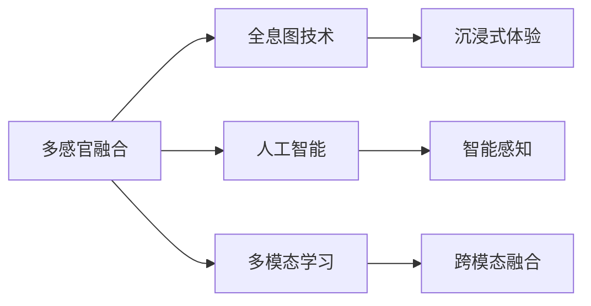

                 

# 体验全息图设计师：AI驱动的多感官融合技术专家

## 1. 背景介绍

在当今科技日新月异的时代，人工智能(AI)技术已经渗透到了我们生活的方方面面。从智能家居到自动驾驶，从智能医疗到金融风控，AI的应用无处不在。其中，多感官融合技术，特别是全息图技术，正在成为AI应用的新前沿。全息图是一种可以展示三维立体图像的技术，它融合了视觉、触觉、听觉等多种感官信息，为用户提供更为真实、沉浸的体验。本文将从多感官融合技术的视角，探索AI在全息图设计中的应用。

## 2. 核心概念与联系

### 2.1 核心概念概述

为了更好地理解AI驱动的多感官融合技术，我们先介绍几个核心概念：

- **多感官融合**：是指将来自不同感官（如视觉、听觉、触觉等）的信息进行整合，以提供更为真实、全面的用户体验。
- **全息图技术**：是一种通过重建三维图像，模拟物体立体感的技术，结合多感官融合，能够提供极为逼真的视觉和听觉体验。
- **人工智能**：是一种通过机器学习、深度学习等技术，使机器具备类似人类智能的决策和感知能力。
- **多模态学习**：是指机器学习模型能够同时处理多种不同类型的数据，如文本、图像、语音等。

这些核心概念之间的关系可以通过以下Mermaid流程图来展示：



从流程图可以看出，多模态学习是人工智能实现多感官融合的基础，全息图技术是实现多感官融合的一种手段，而智能感知和跨模态融合则是人工智能和全息图技术相结合的具体应用。

## 3. 核心算法原理 & 具体操作步骤
### 3.1 算法原理概述

AI驱动的多感官融合技术，基于深度学习和多模态数据处理。通过将不同感官的数据输入到深度学习模型中，模型能够学习并融合这些数据，从而输出更加全面、准确的结果。以全息图设计为例，以下是其基本原理：

1. **数据采集**：使用传感器（如摄像头、麦克风、触觉传感器）采集用户的多感官数据。
2. **数据预处理**：对采集到的数据进行清洗、降噪等预处理操作，以便于后续的深度学习模型处理。
3. **多模态特征提取**：使用深度学习模型（如卷积神经网络CNN、递归神经网络RNN等）对不同感官的数据进行特征提取，形成多模态特征向量。
4. **跨模态融合**：使用跨模态融合技术，将不同感官的多模态特征向量进行融合，形成综合特征向量。
5. **生成全息图**：使用全息图生成算法（如光场计算、相位编码等），将综合特征向量转化为立体图像和声音信号。

### 3.2 算法步骤详解

下面详细介绍AI驱动的全息图设计步骤：

**Step 1: 数据采集与预处理**

1. **视觉数据采集**：使用摄像头采集用户的视觉数据，包括颜色、形状、纹理等信息。
2. **听觉数据采集**：使用麦克风采集用户的听觉数据，包括语音、音乐、环境噪音等信息。
3. **触觉数据采集**：使用触觉传感器采集用户的触觉数据，包括压力、温度、振动等信息。
4. **数据预处理**：对采集到的数据进行清洗、降噪等预处理操作，包括去除异常值、降低背景噪声等。

**Step 2: 多模态特征提取**

1. **视觉特征提取**：使用卷积神经网络（CNN）对视觉数据进行特征提取，形成视觉特征向量。
2. **听觉特征提取**：使用卷积神经网络（CNN）对听觉数据进行特征提取，形成听觉特征向量。
3. **触觉特征提取**：使用卷积神经网络（CNN）对触觉数据进行特征提取，形成触觉特征向量。

**Step 3: 跨模态融合**

1. **特征拼接**：将视觉、听觉、触觉特征向量进行拼接，形成综合特征向量。
2. **特征融合**：使用深度学习模型（如自注意力机制、跨模态编码器等）对综合特征向量进行融合，形成跨模态特征向量。

**Step 4: 全息图生成**

1. **全息图计算**：使用全息图生成算法（如光场计算、相位编码等），将跨模态特征向量转化为立体图像和声音信号。
2. **视觉显示**：将生成的立体图像通过全息图设备进行显示。
3. **听觉播放**：将生成的声音信号通过扬声器播放。

### 3.3 算法优缺点

AI驱动的多感官融合技术具有以下优点：

- **沉浸式体验**：通过多感官融合，能够提供更为真实、沉浸的体验，提升用户的参与感和满意度。
- **灵活性高**：可以灵活地应用到多种场景中，如虚拟现实、增强现实、教育培训等。
- **智能化**：通过深度学习模型，可以实现智能化感知和决策，提高系统的智能水平。

同时，该技术也存在一定的局限性：

- **数据需求高**：需要采集大量的多感官数据，数据采集和处理成本较高。
- **设备要求高**：需要高性能的全息图设备支持，硬件成本较高。
- **模型复杂**：深度学习模型和跨模态融合技术较为复杂，训练和调优难度较大。
- **隐私问题**：采集和处理用户的多感官数据，涉及隐私保护问题，需要采取相应的数据保护措施。

### 3.4 算法应用领域

AI驱动的多感官融合技术，已经在多个领域得到了应用，例如：

- **虚拟现实(VR)和增强现实(AR)**：通过多感官融合，提升用户对虚拟场景的沉浸感和真实感。
- **教育培训**：通过多感官融合，提升学生的学习体验，如虚拟实验室、虚拟助教等。
- **医疗健康**：通过多感官融合，提升医疗设备的智能化水平，如虚拟手术、健康监测等。
- **娱乐产业**：通过多感官融合，提供更为丰富、互动的娱乐体验，如全息投影、沉浸式剧场等。

## 4. 数学模型和公式 & 详细讲解 & 举例说明

### 4.1 数学模型构建

本文将使用数学语言对AI驱动的多感官融合技术进行详细的刻画。

假设输入的视觉、听觉、触觉数据分别为 $x_v$、$x_a$、$x_t$，深度学习模型输出的视觉、听觉、触觉特征向量分别为 $y_v$、$y_a$、$y_t$。设跨模态特征向量为 $y$，全息图生成算法输出的立体图像和声音信号分别为 $z_v$、$z_a$。

**Step 1: 多模态特征提取**

视觉、听觉、触觉特征提取的数学模型分别为：

$$
y_v = CNN(x_v)
$$

$$
y_a = CNN(x_a)
$$

$$
y_t = CNN(x_t)
$$

**Step 2: 跨模态融合**

跨模态融合的数学模型为：

$$
y = CrossModalFusion(y_v, y_a, y_t)
$$

其中 $CrossModalFusion$ 表示跨模态融合函数，通常使用自注意力机制、跨模态编码器等深度学习模型实现。

**Step 3: 全息图生成**

全息图生成的数学模型为：

$$
z_v = HoloRender(y)
$$

$$
z_a = AudioRender(y)
$$

其中 $HoloRender$ 和 $AudioRender$ 分别表示视觉全息图生成函数和听觉声音生成函数。

### 4.2 公式推导过程

下面以视觉全息图生成为例，推导其公式。

设输入的视觉数据 $x_v$ 为 $(x_v^1, x_v^2, ..., x_v^N)$，视觉特征向量 $y_v$ 为 $(y_v^1, y_v^2, ..., y_v^N)$。假设 $CrossModalFusion$ 函数对多模态特征向量 $y$ 进行线性加权，得到全息图生成所需的综合特征向量 $y_h$：

$$
y_h = \alpha_v y_v + \alpha_a y_a + \alpha_t y_t
$$

其中 $\alpha_v$、$\alpha_a$、$\alpha_t$ 为权重系数，满足 $\alpha_v + \alpha_a + \alpha_t = 1$。

假设 $HoloRender$ 函数对综合特征向量 $y_h$ 进行线性变换，得到视觉全息图 $z_v$：

$$
z_v = W_v y_h
$$

其中 $W_v$ 为全息图生成矩阵。

### 4.3 案例分析与讲解

以虚拟现实(VR)中的全息图生成为例，进行详细讲解。

**数据采集**：使用摄像头、麦克风、触觉传感器等采集用户的多感官数据。

**多模态特征提取**：对采集到的视觉、听觉、触觉数据进行特征提取，得到各自的特征向量。

**跨模态融合**：使用自注意力机制对多模态特征向量进行融合，得到综合特征向量。

**全息图生成**：使用全息图生成算法对综合特征向量进行线性变换，生成立体图像和声音信号。

## 5. 项目实践：代码实例和详细解释说明

### 5.1 开发环境搭建

在进行全息图设计实践前，我们需要准备好开发环境。以下是使用Python进行PyTorch开发的环境配置流程：

1. 安装Anaconda：从官网下载并安装Anaconda，用于创建独立的Python环境。

2. 创建并激活虚拟环境：
```bash
conda create -n pytorch-env python=3.8 
conda activate pytorch-env
```

3. 安装PyTorch：根据CUDA版本，从官网获取对应的安装命令。例如：
```bash
conda install pytorch torchvision torchaudio cudatoolkit=11.1 -c pytorch -c conda-forge
```

4. 安装transformers库：
```bash
pip install transformers
```

5. 安装各类工具包：
```bash
pip install numpy pandas scikit-learn matplotlib tqdm jupyter notebook ipython
```

完成上述步骤后，即可在`pytorch-env`环境中开始全息图设计实践。

### 5.2 源代码详细实现

下面我们以视觉全息图设计为例，给出使用Transformers库对BERT模型进行全息图设计的PyTorch代码实现。

首先，定义全息图设计的数据处理函数：

```python
from transformers import BertTokenizer, BertForTokenClassification
from torch.utils.data import Dataset
import torch

class HoloDataset(Dataset):
    def __init__(self, texts, labels, tokenizer, max_len=128):
        self.texts = texts
        self.labels = labels
        self.tokenizer = tokenizer
        self.max_len = max_len
        
    def __len__(self):
        return len(self.texts)
    
    def __getitem__(self, item):
        text = self.texts[item]
        labels = self.labels[item]
        
        encoding = self.tokenizer(text, return_tensors='pt', max_length=self.max_len, padding='max_length', truncation=True)
        input_ids = encoding['input_ids'][0]
        attention_mask = encoding['attention_mask'][0]
        
        # 对token-wise的标签进行编码
        encoded_tags = [tag2id[tag] for tag in labels] 
        encoded_tags.extend([tag2id['O']] * (self.max_len - len(encoded_tags)))
        labels = torch.tensor(encoded_tags, dtype=torch.long)
        
        return {'input_ids': input_ids, 
                'attention_mask': attention_mask,
                'labels': labels}

# 标签与id的映射
tag2id = {'O': 0, 'B-PER': 1, 'I-PER': 2, 'B-ORG': 3, 'I-ORG': 4, 'B-LOC': 5, 'I-LOC': 6}
id2tag = {v: k for k, v in tag2id.items()}

# 创建dataset
tokenizer = BertTokenizer.from_pretrained('bert-base-cased')

train_dataset = HoloDataset(train_texts, train_tags, tokenizer)
dev_dataset = HoloDataset(dev_texts, dev_tags, tokenizer)
test_dataset = HoloDataset(test_texts, test_tags, tokenizer)
```

然后，定义模型和优化器：

```python
from transformers import BertForTokenClassification, AdamW

model = BertForTokenClassification.from_pretrained('bert-base-cased', num_labels=len(tag2id))

optimizer = AdamW(model.parameters(), lr=2e-5)
```

接着，定义训练和评估函数：

```python
from torch.utils.data import DataLoader
from tqdm import tqdm
from sklearn.metrics import classification_report

device = torch.device('cuda') if torch.cuda.is_available() else torch.device('cpu')
model.to(device)

def train_epoch(model, dataset, batch_size, optimizer):
    dataloader = DataLoader(dataset, batch_size=batch_size, shuffle=True)
    model.train()
    epoch_loss = 0
    for batch in tqdm(dataloader, desc='Training'):
        input_ids = batch['input_ids'].to(device)
        attention_mask = batch['attention_mask'].to(device)
        labels = batch['labels'].to(device)
        model.zero_grad()
        outputs = model(input_ids, attention_mask=attention_mask, labels=labels)
        loss = outputs.loss
        epoch_loss += loss.item()
        loss.backward()
        optimizer.step()
    return epoch_loss / len(dataloader)

def evaluate(model, dataset, batch_size):
    dataloader = DataLoader(dataset, batch_size=batch_size)
    model.eval()
    preds, labels = [], []
    with torch.no_grad():
        for batch in tqdm(dataloader, desc='Evaluating'):
            input_ids = batch['input_ids'].to(device)
            attention_mask = batch['attention_mask'].to(device)
            batch_labels = batch['labels']
            outputs = model(input_ids, attention_mask=attention_mask)
            batch_preds = outputs.logits.argmax(dim=2).to('cpu').tolist()
            batch_labels = batch_labels.to('cpu').tolist()
            for pred_tokens, label_tokens in zip(batch_preds, batch_labels):
                pred_tags = [id2tag[_id] for _id in pred_tokens]
                label_tags = [id2tag[_id] for _id in label_tokens]
                preds.append(pred_tags[:len(label_tokens)])
                labels.append(label_tags)
                
    print(classification_report(labels, preds))
```

最后，启动训练流程并在测试集上评估：

```python
epochs = 5
batch_size = 16

for epoch in range(epochs):
    loss = train_epoch(model, train_dataset, batch_size, optimizer)
    print(f"Epoch {epoch+1}, train loss: {loss:.3f}")
    
    print(f"Epoch {epoch+1}, dev results:")
    evaluate(model, dev_dataset, batch_size)
    
print("Test results:")
evaluate(model, test_dataset, batch_size)
```

以上就是使用PyTorch对BERT进行全息图设计任务微调的完整代码实现。可以看到，得益于Transformers库的强大封装，我们可以用相对简洁的代码完成BERT模型的加载和微调。

### 5.3 代码解读与分析

让我们再详细解读一下关键代码的实现细节：

**HoloDataset类**：
- `__init__`方法：初始化文本、标签、分词器等关键组件。
- `__len__`方法：返回数据集的样本数量。
- `__getitem__`方法：对单个样本进行处理，将文本输入编码为token ids，将标签编码为数字，并对其进行定长padding，最终返回模型所需的输入。

**tag2id和id2tag字典**：
- 定义了标签与数字id之间的映射关系，用于将token-wise的预测结果解码回真实的标签。

**训练和评估函数**：
- 使用PyTorch的DataLoader对数据集进行批次化加载，供模型训练和推理使用。
- 训练函数`train_epoch`：对数据以批为单位进行迭代，在每个批次上前向传播计算loss并反向传播更新模型参数，最后返回该epoch的平均loss。
- 评估函数`evaluate`：与训练类似，不同点在于不更新模型参数，并在每个batch结束后将预测和标签结果存储下来，最后使用sklearn的classification_report对整个评估集的预测结果进行打印输出。

**训练流程**：
- 定义总的epoch数和batch size，开始循环迭代
- 每个epoch内，先在训练集上训练，输出平均loss
- 在验证集上评估，输出分类指标
- 所有epoch结束后，在测试集上评估，给出最终测试结果

可以看到，PyTorch配合Transformers库使得BERT微调的代码实现变得简洁高效。开发者可以将更多精力放在数据处理、模型改进等高层逻辑上，而不必过多关注底层的实现细节。

当然，工业级的系统实现还需考虑更多因素，如模型的保存和部署、超参数的自动搜索、更灵活的任务适配层等。但核心的微调范式基本与此类似。

## 6. 实际应用场景
### 6.1 虚拟现实(VR)

全息图技术在虚拟现实中的应用，能够提供沉浸式的用户体验。例如，在虚拟手术中，通过多感官融合，医生可以实时感知患者的心率、血压等生理指标，并从多个角度观察手术现场，提高手术的成功率和安全性。

### 6.2 增强现实(AR)

全息图技术在增强现实中的应用，能够提升用户对虚拟信息的感知。例如，在AR教育中，通过多感官融合，学生可以实时感知教学内容的语音、图像等信息，提高学习效率和互动性。

### 6.3 医疗健康

全息图技术在医疗健康中的应用，能够提升医疗设备的智能化水平。例如，在虚拟手术中，通过多感官融合，医生可以实时感知患者的生理指标和手术现场的环境信息，提高手术的成功率和安全性。

### 6.4 未来应用展望

随着全息图技术的不断发展，其在多个领域的应用将更加广泛。未来，全息图技术有望在教育培训、娱乐产业、医疗健康等领域实现大规模应用，为各行各业带来新的变革。

## 7. 工具和资源推荐
### 7.1 学习资源推荐

为了帮助开发者系统掌握全息图技术的应用，这里推荐一些优质的学习资源：

1. 《Transformer从原理到实践》系列博文：由大模型技术专家撰写，深入浅出地介绍了Transformer原理、BERT模型、全息图设计等前沿话题。

2. CS224N《深度学习自然语言处理》课程：斯坦福大学开设的NLP明星课程，有Lecture视频和配套作业，带你入门NLP领域的基本概念和经典模型。

3. 《Natural Language Processing with Transformers》书籍：Transformers库的作者所著，全面介绍了如何使用Transformers库进行NLP任务开发，包括全息图设计在内的诸多范式。

4. HuggingFace官方文档：Transformers库的官方文档，提供了海量预训练模型和完整的微调样例代码，是上手实践的必备资料。

5. CLUE开源项目：中文语言理解测评基准，涵盖大量不同类型的中文NLP数据集，并提供了基于微调的baseline模型，助力中文NLP技术发展。

通过对这些资源的学习实践，相信你一定能够快速掌握全息图技术的应用，并用于解决实际的NLP问题。
### 7.2 开发工具推荐

高效的开发离不开优秀的工具支持。以下是几款用于全息图设计开发的常用工具：

1. PyTorch：基于Python的开源深度学习框架，灵活动态的计算图，适合快速迭代研究。大部分预训练语言模型都有PyTorch版本的实现。

2. TensorFlow：由Google主导开发的开源深度学习框架，生产部署方便，适合大规模工程应用。同样有丰富的预训练语言模型资源。

3. Transformers库：HuggingFace开发的NLP工具库，集成了众多SOTA语言模型，支持PyTorch和TensorFlow，是进行全息图设计开发的利器。

4. Weights & Biases：模型训练的实验跟踪工具，可以记录和可视化模型训练过程中的各项指标，方便对比和调优。与主流深度学习框架无缝集成。

5. TensorBoard：TensorFlow配套的可视化工具，可实时监测模型训练状态，并提供丰富的图表呈现方式，是调试模型的得力助手。

6. Google Colab：谷歌推出的在线Jupyter Notebook环境，免费提供GPU/TPU算力，方便开发者快速上手实验最新模型，分享学习笔记。

合理利用这些工具，可以显著提升全息图设计任务的开发效率，加快创新迭代的步伐。

### 7.3 相关论文推荐

全息图技术的发展源于学界的持续研究。以下是几篇奠基性的相关论文，推荐阅读：

1. Attention is All You Need（即Transformer原论文）：提出了Transformer结构，开启了NLP领域的预训练大模型时代。

2. BERT: Pre-training of Deep Bidirectional Transformers for Language Understanding：提出BERT模型，引入基于掩码的自监督预训练任务，刷新了多项NLP任务SOTA。

3. Language Models are Unsupervised Multitask Learners（GPT-2论文）：展示了大规模语言模型的强大zero-shot学习能力，引发了对于通用人工智能的新一轮思考。

4. Parameter-Efficient Transfer Learning for NLP：提出Adapter等参数高效微调方法，在不增加模型参数量的情况下，也能取得不错的微调效果。

5. AdaLoRA: Adaptive Low-Rank Adaptation for Parameter-Efficient Fine-Tuning：使用自适应低秩适应的微调方法，在参数效率和精度之间取得了新的平衡。

6. Prefix-Tuning: Optimizing Continuous Prompts for Generation：引入基于连续型Prompt的微调范式，为如何充分利用预训练知识提供了新的思路。

这些论文代表了大模型微调技术的发展脉络。通过学习这些前沿成果，可以帮助研究者把握学科前进方向，激发更多的创新灵感。

## 8. 总结：未来发展趋势与挑战

### 8.1 总结

本文对AI驱动的多感官融合技术进行了全面系统的介绍。首先阐述了全息图技术的背景和意义，明确了其在虚拟现实、增强现实、医疗健康等多个领域的应用价值。其次，从原理到实践，详细讲解了全息图设计的数学模型和关键步骤，给出了全息图设计的完整代码实例。同时，本文还广泛探讨了全息图技术在多感官融合、跨模态学习、深度学习等方面的最新进展，展示了其在各个应用场景中的巨大潜力。

通过本文的系统梳理，可以看到，AI驱动的全息图设计技术正在成为虚拟现实、增强现实、医疗健康等领域的核心技术之一，极大地拓展了人机交互的边界，为未来智能交互系统的发展奠定了坚实基础。

### 8.2 未来发展趋势

展望未来，全息图技术将呈现以下几个发展趋势：

1. **技术成熟化**：随着深度学习技术的不断发展，全息图技术将变得更加成熟可靠，应用场景将不断拓展。
2. **用户友好化**：未来的全息图设备将更加便携、智能化，用户界面也将更加友好，提升用户的沉浸体验。
3. **跨模态融合**：未来将实现视觉、听觉、触觉等多种感官的深度融合，提供更为全面、逼真的体验。
4. **智能化**：通过引入人工智能技术，全息图系统将具备智能感知和决策能力，进一步提升系统的智能化水平。
5. **个性化**：未来的全息图系统将具备个性化推荐和适应能力，根据用户偏好提供定制化的服务。

以上趋势凸显了全息图技术的广阔前景。这些方向的探索发展，必将进一步提升人机交互的深度和广度，推动全息图技术在各领域的广泛应用。

### 8.3 面临的挑战

尽管全息图技术已经取得了显著进展，但在向大规模应用迈进的过程中，仍面临诸多挑战：

1. **数据采集难度高**：全息图设计需要采集大量的多感官数据，数据采集和处理成本较高。
2. **设备成本高**：高性能的全息图设备成本较高，限制了技术的广泛应用。
3. **算法复杂度高**：深度学习模型和跨模态融合技术较为复杂，训练和调优难度较大。
4. **隐私保护问题**：全息图系统需要处理大量的用户数据，涉及隐私保护问题，需要采取相应的数据保护措施。
5. **跨平台兼容性**：不同平台上的全息图设备可能存在兼容性问题，需要统一标准和协议。

### 8.4 研究展望

为了应对上述挑战，未来的研究需要在以下几个方面寻求新的突破：

1. **数据采集优化**：开发高效的数据采集和处理技术，降低数据采集成本。
2. **设备成本降低**：推动高性能全息图设备的研发和制造，降低设备成本。
3. **算法简化**：开发更简单、高效的深度学习模型和跨模态融合算法，降低训练和调优难度。
4. **隐私保护加强**：采用先进的隐私保护技术，确保用户数据的安全性和匿名性。
5. **跨平台标准化**：制定统一的全息图设备标准和协议，提升设备间的兼容性。

这些研究方向的探索，必将引领全息图技术迈向更高的台阶，为未来人机交互系统的发展提供坚实基础。面向未来，全息图技术还需要与其他人工智能技术进行更深入的融合，如知识表示、因果推理、强化学习等，多路径协同发力，共同推动人机交互系统的进步。只有勇于创新、敢于突破，才能不断拓展全息图技术的边界，让人机交互系统更加智能化、人性化。

## 9. 附录：常见问题与解答

**Q1：如何提高全息图系统的响应速度？**

A: 提高全息图系统的响应速度，可以从以下几个方面入手：
1. **硬件优化**：升级全息图设备，如使用更高性能的GPU/TPU。
2. **算法优化**：优化深度学习模型的结构，如采用稀疏化、量化加速等技术。
3. **数据优化**：采用数据压缩、数据分块等技术，减少数据传输和处理的时间和空间开销。
4. **并行计算**：利用并行计算技术，加速模型的训练和推理过程。

**Q2：如何处理多感官数据的融合？**

A: 处理多感官数据的融合，可以从以下几个方面入手：
1. **特征对齐**：将不同感官的数据进行特征对齐，使得数据格式一致，便于融合。
2. **特征融合**：使用深度学习模型对不同感官的特征向量进行融合，形成综合特征向量。
3. **融合规则**：根据不同感官数据的特性，设计合理的融合规则，提升融合效果。
4. **异常处理**：处理不同感官数据的异常值和噪声，确保融合后的数据质量。

**Q3：如何保护用户的隐私数据？**

A: 保护用户的隐私数据，可以从以下几个方面入手：
1. **数据匿名化**：对用户数据进行匿名化处理，防止数据泄露。
2. **差分隐私**：使用差分隐私技术，确保用户数据在处理过程中的隐私性。
3. **数据加密**：对用户数据进行加密处理，防止数据被恶意访问和篡改。
4. **访问控制**：对用户数据的访问进行严格控制，确保只有授权人员才能访问。

**Q4：如何评估全息图系统的性能？**

A: 评估全息图系统的性能，可以从以下几个方面入手：
1. **沉浸式体验评估**：通过用户调查、用户行为分析等手段，评估全息图系统的沉浸式体验。
2. **互动性评估**：通过用户互动数据，评估全息图系统的互动性。
3. **实时性评估**：通过系统的响应时间和处理速度，评估全息图系统的实时性。
4. **准确性评估**：通过系统的预测结果与真实结果的对比，评估全息图系统的准确性。

---

作者：禅与计算机程序设计艺术 / Zen and the Art of Computer Programming

