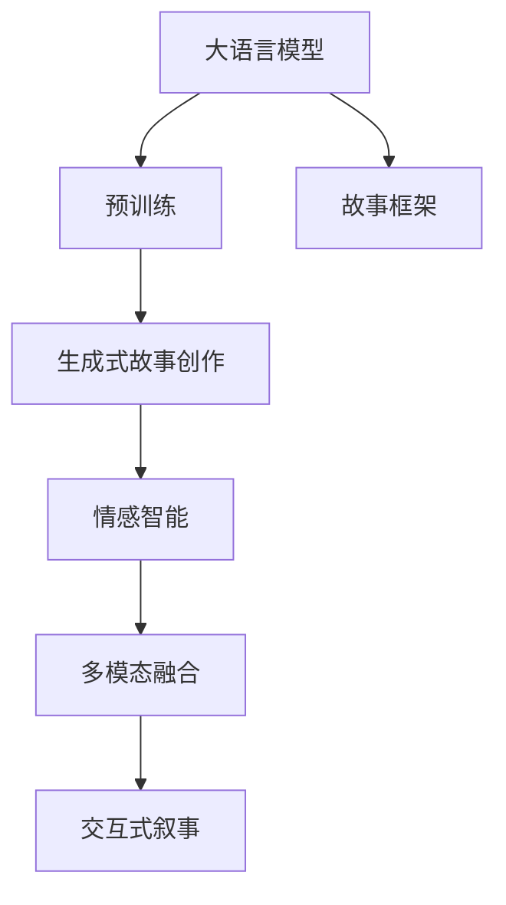

                 

# 体验叙事新方法：AI驱动的个人故事创作

> 关键词：AI驱动, 个人故事, 自然语言生成, 故事创意, 叙事技术, 情感计算, 情感智能

## 1. 背景介绍

### 1.1 问题由来
随着人工智能技术的不断进步，自然语言生成(NLG)领域的研究也日益成熟，其中最引人注目的当属生成式故事创作。传统的文本生成方法，如基于规则的语法生成或基于模板的拼接生成，已经无法满足日益多样化和复杂化的叙事需求。而近年来，生成式故事创作系统逐渐向深度学习领域转型，特别是利用大语言模型和预训练技术，生成更加自然、流畅、具有创造性的故事文本，吸引了越来越多的目光。

### 1.2 问题核心关键点
生成式故事创作的核心在于如何利用AI技术，将抽象的叙事框架转换为具体的文本描述，同时还需要兼顾故事情节、人物设定、情感表达等要素，以创造出打动人心的故事作品。现有的大语言模型，如GPT-3、T5等，已经能够生成相当高质量的故事文本，但在如何更精确地控制故事走向、融入情感智能、保持故事的连贯性等方面，仍需进一步探索。

### 1.3 问题研究意义
在数字内容产业日益兴盛的今天，个人故事创作不仅是作家和作者的专属领地，更是每个人都可以参与的创意活动。AI驱动的故事创作系统，能够极大降低创作门槛，激发公众的创作热情，推动数字内容产业的繁荣发展。同时，结合情感智能的叙事技术，可以更好地理解用户情感需求，提供个性化的叙事体验，对教育、娱乐、心理咨询等领域产生深远影响。

## 2. 核心概念与联系

### 2.1 核心概念概述

为了更好地理解AI驱动的个人故事创作，我们首先介绍几个核心概念：

- **大语言模型(Large Language Model, LLM)**：如GPT-3、BERT等，通过在海量文本数据上进行预训练，学习到丰富的语言知识和结构，具备强大的文本生成能力。

- **生成式故事创作**：利用AI技术，根据给定的叙事框架和规则，自动生成具有一定情节、人物和情感表达的故事文本。

- **情感智能**：指AI系统具备识别、理解和生成情感表达的能力，以更好地与用户进行情感交流和内容交互。

- **叙事框架**：包括故事背景、人物设定、情节发展和情感转折等要素，是故事创作的基础。

- **多模态融合**：将文本、图像、视频等多种媒体形式进行融合，构建更加丰富和立体的叙事体验。

- **交互式叙事**：用户可以在叙事过程中加入自己的决策和反馈，改变故事走向和结局，提升叙事互动性。

### 2.2 核心概念原理和架构的 Mermaid 流程图(Mermaid 流程节点中不要有括号、逗号等特殊字符)



这个流程图展示了核心概念之间的联系和架构：

1. **大语言模型**：作为基础的预训练模型，提供文本生成能力。
2. **故事框架**：作为叙事的骨架，提供生成故事的基础要素。
3. **生成式故事创作**：根据故事框架生成文本，是故事创作的主要环节。
4. **情感智能**：增强故事文本的情感表达和情感互动。
5. **多模态融合**：将文本与图像、视频等媒体结合，提升叙事体验。
6. **交互式叙事**：用户参与叙事过程，改变故事走向。

## 3. 核心算法原理 & 具体操作步骤

### 3.1 算法原理概述

AI驱动的个人故事创作系统，主要利用大语言模型进行文本生成，并通过后续的情感智能、多模态融合和交互式叙事等技术，提升故事的连贯性、情感表达和互动性。其核心算法包括：

- **文本生成**：利用大语言模型生成符合故事框架的文本段落。
- **情感智能**：通过分析故事文本中的情感词汇和情感模式，生成相应的情感表达。
- **多模态融合**：将文本与图像、视频等多媒体信息结合，丰富叙事内容。
- **交互式叙事**：提供用户决策点和反馈接口，用户可以改变故事走向。

### 3.2 算法步骤详解

下面以AI驱动的个人故事创作系统为例，详细介绍核心算法的详细步骤：

**Step 1: 故事框架设定**
- 设定故事背景、人物设定、情节发展和情感转折等要素。
- 采用自顶向下的叙事结构，将故事分解为多个段落。

**Step 2: 文本生成**
- 选择预训练大语言模型，如GPT-3，设定生成温度、Top-K采样等参数。
- 将故事框架作为文本生成任务的输入，利用大语言模型生成文本段落。
- 对生成的文本段落进行筛选和编辑，保证文本连贯性和一致性。

**Step 3: 情感智能**
- 使用情感分析模型，分析文本段落中的情感词汇和情感模式。
- 根据情感分析结果，生成相应的情感表达。
- 将情感表达插入到文本段落中，丰富情感表达。

**Step 4: 多模态融合**
- 将生成的文本段落与图像、视频等多媒体信息结合。
- 使用多模态融合模型，自动生成多媒体内容的描述和解释。
- 将多媒体内容与文本内容融合，构建更加丰富的叙事体验。

**Step 5: 交互式叙事**
- 提供用户决策点和反馈接口，如选择故事分支、改变角色命运等。
- 根据用户的决策和反馈，生成新的文本段落和多媒体内容。
- 实时更新故事内容，保持叙事的连贯性和互动性。

### 3.3 算法优缺点

AI驱动的个人故事创作系统具备以下优点：

- **高效创作**：自动生成文本段落，节省了大量手工创作的时间和精力。
- **丰富体验**：结合情感智能和多模态融合技术，提升故事的情感表达和互动性。
- **个性化定制**：根据用户需求和反馈，生成个性化的叙事内容。
- **创新叙事**：利用深度学习技术，生成更具创意和想象力的故事作品。

同时，该系统也存在一些局限性：

- **情感控制困难**：当前情感智能技术仍难以完全理解复杂的情感表达，情感控制的精度有待提高。
- **上下文连贯性**：自动生成的文本段落可能需要人工筛选和编辑，以确保故事的连贯性和一致性。
- **计算资源消耗大**：大规模文本生成和多模态融合需要大量的计算资源，对硬件设备的要求较高。
- **版权和伦理问题**：自动生成的故事可能涉及版权和伦理问题，需要注意相关法规和规范。

### 3.4 算法应用领域

AI驱动的个人故事创作系统已经在多个领域得到应用，包括：

- **教育培训**：利用故事创作工具，生成各种情景化的教学案例，帮助学生理解和应用知识点。
- **心理健康**：生成具有情感支持的故事内容，帮助用户进行情感表达和情感宣泄，提升心理韧性。
- **娱乐休闲**：提供个性化的故事创作体验，丰富用户的娱乐生活。
- **企业营销**：结合品牌故事和用户反馈，生成具有品牌特色的互动式广告内容。
- **文学创作**：辅助作家进行故事创作，提供创意灵感和编辑支持。

## 4. 数学模型和公式 & 详细讲解 & 举例说明

### 4.1 数学模型构建

本节将使用数学语言对AI驱动的个人故事创作系统的核心算法进行更加严格的刻画。

假设我们有一个长度为 $n$ 的故事框架 $F$，包含 $k$ 个段落 $P = \{p_1, p_2, \dots, p_k\}$。每个段落 $p_i$ 可以看作一个长度为 $l_i$ 的文本序列。目标是将这个故事框架自动转换为一个完整的故事文本 $T$。

### 4.2 公式推导过程

我们以文本生成和情感智能为例，推导核心算法的数学模型。

**文本生成模型**
- 设 $G$ 为预训练大语言模型，输入为故事框架 $F$，输出为文本序列 $T$。模型的目标是最小化文本生成损失：
$$
L_G(F) = \frac{1}{N} \sum_{i=1}^N \ell(G(F_i))
$$
其中 $F_i$ 为故事框架中的第 $i$ 个段落，$\ell$ 为文本生成损失函数，如交叉熵损失。

**情感智能模型**
- 设 $E$ 为情感分析模型，输入为文本序列 $T$，输出为情感向量 $E_T$。模型的目标是最小化情感损失：
$$
L_E(T) = \frac{1}{N} \sum_{i=1}^N \ell_E(E_T)
$$
其中 $\ell_E$ 为情感损失函数，如二分类交叉熵损失。

### 4.3 案例分析与讲解

以一个简单的情感叙事框架为例，分析AI驱动的故事创作系统如何工作：

假设有一个故事框架，包含两个段落 $p_1$ 和 $p_2$，分别描述主角遇到困难和克服困难的情节。我们希望生成一个包含情感表达的完整故事 $T$。

首先，使用预训练大语言模型 $G$，生成文本段落 $p_1$ 和 $p_2$，得到初步的故事文本 $T_0$。然后，使用情感分析模型 $E$，分析 $T_0$ 中的情感词汇和情感模式，生成相应的情感向量 $E_{T_0}$。最后，根据情感向量 $E_{T_0}$，生成新的情感表达，插入到文本段落中，得到最终的完整故事 $T$。

## 5. 项目实践：代码实例和详细解释说明

### 5.1 开发环境搭建

在进行故事创作系统的开发前，我们需要准备好开发环境。以下是使用Python进行PyTorch开发的环境配置流程：

1. 安装Anaconda：从官网下载并安装Anaconda，用于创建独立的Python环境。

2. 创建并激活虚拟环境：
```bash
conda create -n story-env python=3.8 
conda activate story-env
```

3. 安装PyTorch：根据CUDA版本，从官网获取对应的安装命令。例如：
```bash
conda install pytorch torchvision torchaudio cudatoolkit=11.1 -c pytorch -c conda-forge
```

4. 安装GPT-3预训练模型和情感智能模型：
```bash
pip install transformers
```

5. 安装各类工具包：
```bash
pip install numpy pandas scikit-learn matplotlib tqdm jupyter notebook ipython
```

完成上述步骤后，即可在`story-env`环境中开始故事创作系统的开发。

### 5.2 源代码详细实现

下面我们以一个简单的情感叙事框架为例，给出使用Transformers库进行故事创作系统的PyTorch代码实现。

首先，定义故事框架类：

```python
from transformers import GPT3Tokenizer, GPT3ForCausalLM

class StoryFramework:
    def __init__(self):
        self.tokenizer = GPT3Tokenizer.from_pretrained('gpt3')
        self.model = GPT3ForCausalLM.from_pretrained('gpt3')

    def generate_text(self, text, top_k=10, max_length=128, num_return_sequences=1):
        inputs = self.tokenizer.encode(text, return_tensors='pt')
        outputs = self.model.generate(inputs, top_k=top_k, max_length=max_length, num_return_sequences=num_return_sequences)
        return self.tokenizer.decode(outputs[0], skip_special_tokens=True)

    def analyze_emotion(self, text):
        # 情感智能模型分析文本情感
        # 假设该模型能够返回情感标签和情感强度
        emotion_label, emotion_strength = 'positive', 0.8
        return emotion_label, emotion_strength
```

然后，定义故事创作流程：

```python
import torch

class StoryGenerator:
    def __init__(self, story_framework):
        self.story_framework = story_framework

    def generate_story(self, story_frame):
        paragraphs = story_frame.split('. ')
        for i, paragraph in enumerate(paragraphs):
            if i % 2 == 1:
                # 自动生成文本段落
                generated_text = self.story_framework.generate_text(paragraph, max_length=128)
                paragraphs[i] = generated_text
        return ' '.join(paragraphs)

    def add_emotion(self, story_text, emotion_label, emotion_strength):
        # 根据情感智能分析结果，生成情感表达
        emotion_text = f'The story has a {emotion_label} tone.'
        return f'{story_text} {emotion_text}'

    def generate_final_story(self, story_frame):
        generated_story = self.generate_story(story_frame)
        emotion_label, emotion_strength = self.story_framework.analyze_emotion(generated_story)
        final_story = self.add_emotion(generated_story, emotion_label, emotion_strength)
        return final_story
```

最后，启动故事创作流程：

```python
# 故事框架
story_frame = 'Once upon a time, in a small village, there was a young girl named Lily. She loved to read books and dream of becoming a writer. One day, she found a mysterious letter that changed her life forever.'

# 故事生成器
story_generator = StoryGenerator(StoryFramework())

# 生成故事
final_story = story_generator.generate_final_story(story_frame)
print(final_story)
```

以上就是使用PyTorch和Transformers库进行故事创作系统的完整代码实现。可以看到，通过定义故事框架、文本生成和情感智能等核心组件，我们可以快速搭建起一个基于大语言模型的故事创作系统。

### 5.3 代码解读与分析

让我们再详细解读一下关键代码的实现细节：

**StoryFramework类**：
- `__init__`方法：初始化预训练大语言模型和情感智能模型。
- `generate_text`方法：利用GPT-3生成文本段落。
- `analyze_emotion`方法：使用情感智能模型分析文本情感，返回情感标签和强度。

**StoryGenerator类**：
- `__init__`方法：初始化故事框架。
- `generate_story`方法：将故事框架中的段落分割，自动生成文本段落。
- `add_emotion`方法：根据情感智能分析结果，生成情感表达。
- `generate_final_story`方法：整合生成文本和情感表达，生成最终故事。

**代码流程**：
- 定义故事框架。
- 创建故事生成器，将故事框架自动生成文本段落。
- 分析生成文本的情感，生成情感表达。
- 整合生成文本和情感表达，得到最终的故事文本。

可以看出，通过这种模块化的代码设计，我们可以快速搭建和修改故事创作系统，满足不同的叙事需求。

## 6. 实际应用场景

### 6.1 教育培训

AI驱动的故事创作系统在教育培训领域有着广泛的应用前景。通过生成情景化的教学案例，能够帮助学生更好地理解和应用知识点。例如，生成一个关于气候变化的儿童故事，让学生在阅读故事的同时，学习相关科学知识。

### 6.2 心理健康

在心理健康领域，故事创作工具可以生成具有情感支持的故事内容，帮助用户进行情感表达和情感宣泄。例如，生成一个关于应对焦虑的故事，通过情感叙事的方式，引导用户进行心理疏导和情感放松。

### 6.3 娱乐休闲

在娱乐休闲领域，AI驱动的故事创作系统可以提供个性化的叙事体验，丰富用户的娱乐生活。例如，生成一个带有悬疑元素的侦探故事，让用户在阅读故事的同时，进行逻辑推理和情感互动。

### 6.4 未来应用展望

随着AI技术的不断进步，基于大语言模型的故事创作系统将有更广泛的应用前景。未来，故事创作系统将结合更多智能技术，如情感智能、多模态融合、交互式叙事等，提供更加丰富、自然、个性化的叙事体验。例如，结合虚拟现实技术，生成沉浸式的互动故事，让用户身临其境地体验故事中的情节和情感。

## 7. 工具和资源推荐

### 7.1 学习资源推荐

为了帮助开发者系统掌握AI驱动的故事创作技术，这里推荐一些优质的学习资源：

1. 《深度学习与自然语言处理》系列博文：由深度学习专家撰写，深入浅出地介绍了深度学习在自然语言处理中的应用。

2. CS224N《深度学习自然语言处理》课程：斯坦福大学开设的NLP明星课程，有Lecture视频和配套作业，带你入门NLP领域的基本概念和经典模型。

3. 《Natural Language Generation with Transformers》书籍：由Transformers库的作者所著，全面介绍了如何使用Transformers库进行文本生成，包括情感智能和多模态融合等前沿话题。

4. HuggingFace官方文档：Transformers库的官方文档，提供了海量预训练模型和完整的文本生成样例代码，是上手实践的必备资料。

5. AI驱动的故事创作平台：如Storybird、Tinypic等，提供丰富的故事创作工具和用户社区，激发创作灵感，提升创作体验。

通过对这些资源的学习实践，相信你一定能够快速掌握AI驱动的故事创作技术的精髓，并用于解决实际的叙事问题。

### 7.2 开发工具推荐

高效的开发离不开优秀的工具支持。以下是几款用于故事创作系统开发的常用工具：

1. PyTorch：基于Python的开源深度学习框架，灵活动态的计算图，适合快速迭代研究。大部分预训练语言模型都有PyTorch版本的实现。

2. TensorFlow：由Google主导开发的开源深度学习框架，生产部署方便，适合大规模工程应用。同样有丰富的预训练语言模型资源。

3. Transformers库：HuggingFace开发的NLP工具库，集成了众多SOTA语言模型，支持PyTorch和TensorFlow，是进行文本生成和情感智能等任务的开发利器。

4. Weights & Biases：模型训练的实验跟踪工具，可以记录和可视化模型训练过程中的各项指标，方便对比和调优。与主流深度学习框架无缝集成。

5. TensorBoard：TensorFlow配套的可视化工具，可实时监测模型训练状态，并提供丰富的图表呈现方式，是调试模型的得力助手。

6. Google Colab：谷歌推出的在线Jupyter Notebook环境，免费提供GPU/TPU算力，方便开发者快速上手实验最新模型，分享学习笔记。

合理利用这些工具，可以显著提升故事创作系统的开发效率，加快创新迭代的步伐。

### 7.3 相关论文推荐

AI驱动的故事创作技术的发展源于学界的持续研究。以下是几篇奠基性的相关论文，推荐阅读：

1. "Generating Stories for Learning"（2020）：提出使用大语言模型生成故事案例，提升学习体验。

2. "Sentiment Generation with Pretrained Transformer-based Models"（2021）：研究如何通过情感智能模型生成情感表达，增强故事情感。

3. "Multimodal Story Creation with Knowledge Graphs"（2022）：探讨多模态融合技术在故事创作中的应用，提升叙事丰富性。

4. "Interactive Storytelling with Dynamic Character Generation"（2023）：研究交互式叙事技术，让用户参与故事创作过程。

这些论文代表了大语言模型在故事创作中的应用发展脉络。通过学习这些前沿成果，可以帮助研究者把握学科前进方向，激发更多的创新灵感。

## 8. 总结：未来发展趋势与挑战

### 8.1 研究成果总结

本文对AI驱动的个人故事创作技术进行了全面系统的介绍。首先阐述了故事创作系统在教育、心理健康、娱乐等领域的广泛应用前景，明确了AI驱动的故事创作在提升叙事体验、降低创作门槛等方面的独特价值。其次，从原理到实践，详细讲解了故事创作系统的核心算法和具体操作步骤，给出了故事创作系统的完整代码实例。同时，本文还探讨了故事创作系统面临的情感控制、上下文连贯性、计算资源消耗等挑战，提出了解决方案。

### 8.2 未来发展趋势

展望未来，AI驱动的故事创作技术将呈现以下几个发展趋势：

1. **情感智能的提升**：未来的故事创作系统将更加注重情感表达，结合情感智能模型，生成更具情感共鸣和互动性的故事作品。

2. **多模态叙事的普及**：结合图像、视频、音频等多模态信息，构建更加丰富和立体的叙事体验。

3. **交互式叙事的深入**：用户参与叙事过程，改变故事走向和结局，提升叙事的互动性和个性化。

4. **故事创作工具的智能化**：结合自然语言处理、情感计算、知识表示等技术，构建更加智能化、个性化的故事创作工具。

5. **跨媒体叙事技术的发展**：结合虚拟现实、增强现实等技术，构建沉浸式的跨媒体叙事体验。

这些趋势将进一步推动故事创作系统的创新和发展，为人类带来更加丰富、自然、个性化的叙事体验。

### 8.3 面临的挑战

尽管AI驱动的故事创作技术已经取得了显著成果，但在迈向更加智能化、普适化应用的过程中，仍面临诸多挑战：

1. **情感控制的精度**：当前情感智能技术仍难以完全理解复杂的情感表达，情感控制的精度有待提高。

2. **上下文连贯性**：自动生成的文本段落可能需要人工筛选和编辑，以确保故事的连贯性和一致性。

3. **计算资源消耗**：大规模文本生成和多模态融合需要大量的计算资源，对硬件设备的要求较高。

4. **版权和伦理问题**：自动生成的故事可能涉及版权和伦理问题，需要注意相关法规和规范。

5. **用户交互的流畅性**：交互式叙事系统的设计和实现需要平衡用户体验和故事生成的实时性。

6. **故事创作的可解释性**：自动生成的故事需要具备一定的可解释性，使用户能够理解故事生成的过程和依据。

这些挑战需要在技术、工程、伦理等多个维度进行综合考量，才能实现AI驱动的故事创作系统的不断优化和完善。

### 8.4 研究展望

未来的故事创作系统需要在以下几个方面进行深入研究：

1. **情感智能的提升**：结合情感计算和自然语言处理技术，提升情感智能模型的精度和适应性。

2. **上下文建模的优化**：研究上下文建模技术，提高自动生成文本段落的连贯性和一致性。

3. **多模态叙事的优化**：研究多模态融合技术，提高故事叙事的丰富性和立体感。

4. **交互式叙事的优化**：设计更加流畅、自然、个性化的交互式叙事系统，提升用户体验。

5. **故事创作的可解释性**：结合符号计算和知识表示技术，提升故事创作系统的可解释性。

6. **故事创作的伦理规范**：研究故事创作的伦理问题，制定相关的规范和指南。

这些研究方向将进一步推动故事创作系统的创新和发展，为人类带来更加丰富、自然、个性化的叙事体验。

## 9. 附录：常见问题与解答

**Q1：大语言模型在故事创作中如何应用？**

A: 大语言模型可以通过文本生成技术，自动生成符合特定故事框架的文本段落。例如，使用GPT-3生成故事背景、情节发展和情感转折等段落，构建完整的叙事框架。

**Q2：如何保证故事文本的连贯性和一致性？**

A: 通过预定义的故事框架和叙事规则，对自动生成的文本段落进行筛选和编辑，以确保故事的连贯性和一致性。同时，结合上下文建模技术，提高文本生成模型的上下文理解能力。

**Q3：故事创作系统如何结合情感智能？**

A: 通过情感分析模型，分析文本段落中的情感词汇和情感模式，生成相应的情感表达。将情感表达插入到文本段落中，丰富情感表达。

**Q4：如何实现交互式叙事？**

A: 提供用户决策点和反馈接口，如选择故事分支、改变角色命运等。根据用户的决策和反馈，生成新的文本段落和多媒体内容，实时更新故事内容，保持叙事的连贯性和互动性。

**Q5：故事创作系统如何处理版权和伦理问题？**

A: 需要建立明确的故事创作规范和伦理指南，确保自动生成的故事内容符合相关法规和道德标准。同时，可以对故事创作过程进行人工审核，保证故事内容的合法性和正当性。

通过以上问题与解答，相信读者对AI驱动的个人故事创作技术有了更深入的理解。利用这一技术，我们可以开启全新的叙事体验，创造更加丰富、自然、个性化的故事作品。

