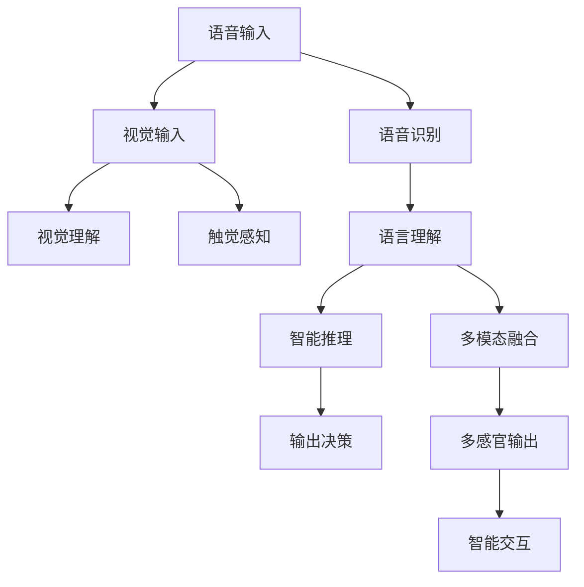

                 

## 1. 背景介绍

### 1.1 问题由来

在当今数字时代，人类已经迈入一个多维度的感官世界。从语音、图像到文本、声音，AI技术正在改变我们与世界互动的方式。这种多维感官体验的构建，不仅需要顶尖的技术实力，还需要跨学科的知识融合和创新思维。本文将围绕多维度感官体验的构建器设计师，深入探讨AI技术如何打造一个全方位、多感官交互的智能世界。

### 1.2 问题核心关键点

在AI多感官体验构建中，几个关键点尤为突出：

- **多模态融合**：如何融合语音、视觉、文本、触觉等多种感官信息，提升用户体验。
- **智能交互**：如何在多感官交互中，利用机器学习算法实现智能决策，提供个性化服务。
- **硬件整合**：如何通过各类智能硬件设备（如智能音箱、智能眼镜等），将AI技术无缝整合到实际应用中。
- **用户体验**：如何通过多感官体验设计，提供自然、流畅、沉浸式的用户体验，让用户感到舒适与愉悦。

### 1.3 问题研究意义

AI多感官体验的构建，不仅能提升用户的生活质量，还能推动技术创新和产业发展。对于跨界设计师和AI技术专家而言，理解和掌握构建器设计师的核心技能，不仅能够开拓新的职业机会，还能在人工智能时代中找到自己的位置，为社会创造更多价值。

## 2. 核心概念与联系

### 2.1 核心概念概述

为更好地理解多维度感官世界的构建，本文将介绍几个关键概念：

- **多模态融合（Multimodal Fusion）**：将语音、视觉、文本、触觉等多种感官信息融合在一起，实现全方位的交互体验。
- **智能交互（Smart Interaction）**：通过机器学习算法实现对用户输入的智能理解与响应，提供个性化服务。
- **硬件整合（Hardware Integration）**：将AI技术通过智能硬件无缝整合到实际应用中，如智能音箱、智能眼镜等。
- **用户体验（User Experience, UX）**：通过多感官体验设计，提升用户的满意度和使用体验。

### 2.2 核心概念原理和架构的 Mermaid 流程图



这个流程图展示了多感官体验构建的核心流程：语音输入经过语音识别转化为文本，视觉输入经过视觉理解识别物体，触觉感知获取环境信息，这些信息经过语言理解融合，进入多模态融合模块，由智能推理模块进行决策，最终通过多感官输出实现智能交互。

## 3. 核心算法原理 & 具体操作步骤

### 3.1 算法原理概述

多维度感官体验的构建器设计师，利用AI技术，通过深度学习算法，将多模态信息融合与智能推理相结合，实现自然、流畅、沉浸式的用户交互。其核心算法包括：

- **语音识别与合成**：通过隐马尔可夫模型（HMM）或卷积神经网络（CNN）等算法，实现语音的识别与合成。
- **视觉识别与理解**：通过卷积神经网络（CNN）、循环神经网络（RNN）等算法，实现图像的识别与理解。
- **触觉感知与反馈**：通过传感器和力反馈设备，实现对触觉信息的感知与反馈。
- **多模态融合与推理**：通过注意力机制、Transformer等算法，实现多模态信息的融合与智能推理。

### 3.2 算法步骤详解

多维度感官体验构建的步骤可以分为以下几个环节：

1. **数据采集**：通过各类传感器和摄像头等设备，获取多模态数据，如语音、图像、触觉信息。
2. **数据预处理**：对采集到的数据进行清洗、归一化等预处理操作。
3. **多模态融合**：将不同模态的数据进行融合，形成统一的数据表示，如使用Transformer对多模态信息进行编码和解码。
4. **智能推理**：通过深度学习算法，对融合后的多模态信息进行推理，生成智能响应。
5. **输出决策**：将推理结果转化为具体的输出决策，如语音回复、图像显示、触觉反馈等。

### 3.3 算法优缺点

多维度感官体验构建的算法具有以下优点：

- **提升用户体验**：通过多感官融合，提供更自然、流畅的交互体验，提升用户满意度。
- **增强功能**：将AI技术通过智能硬件整合到实际应用中，提升功能性和实用性。
- **通用性**：多模态融合和智能推理算法具有较强的通用性，可应用于多个领域和场景。

但同时也存在一些缺点：

- **数据依赖**：多感官体验构建对高质量的数据有较高依赖，数据采集和处理成本较高。
- **算法复杂**：多模态融合和智能推理算法较为复杂，需要较强的计算能力和算法知识。
- **硬件成本**：智能硬件设备的整合和部署需要较高的成本和维护费用。

### 3.4 算法应用领域

多维度感官体验构建技术已经在多个领域得到应用，如：

- **智能家居**：通过多感官交互，实现智能控制和个性化服务，提升家居生活的便捷性和舒适度。
- **医疗健康**：利用多感官信息，进行疾病诊断、康复训练等，提升医疗服务质量。
- **教育培训**：通过虚拟现实（VR）和多感官交互，提供沉浸式学习体验，提升教育效果。
- **娱乐休闲**：通过多感官体验设计，增强游戏互动性，提升娱乐体验。
- **智能客服**：通过语音、图像、触觉等多模态信息，提升客户服务效率和满意度。

## 4. 数学模型和公式 & 详细讲解 & 举例说明

### 4.1 数学模型构建

多维度感官体验构建的数学模型，可以概括为以下几个部分：

1. **语音识别模型**：
   $$
   P(\text{语音}|x) = \frac{P(\text{语音})P(x|\text{语音})}{P(x)}
   $$

2. **视觉识别模型**：
   $$
   P(\text{视觉}|x) = \frac{P(\text{视觉})P(x|\text{视觉})}{P(x)}
   $$

3. **触觉感知模型**：
   $$
   P(\text{触觉}|x) = \frac{P(\text{触觉})P(x|\text{触觉})}{P(x)}
   $$

4. **多模态融合模型**：
   $$
   P(\text{多模态}|x) = \frac{P(\text{多模态})P(x|\text{多模态})}{P(x)}
   $$

5. **智能推理模型**：
   $$
   P(\text{输出}|x) = \sum_i P_i P(\text{输出}|x, P_i)
   $$

其中，$P$表示概率，$x$表示输入数据，$P(x)$表示先验概率，$P(y|x)$表示后验概率。

### 4.2 公式推导过程

以语音识别模型为例，其推导过程如下：

1. **语音信号建模**：
   $$
   x = \sum_i x_i y_i
   $$
   其中，$x$为语音信号，$y_i$为基频分量，$x_i$为振幅分量。

2. **基频分量建模**：
   $$
   y_i = \sin(\omega_i t + \phi_i)
   $$
   其中，$\omega_i$为角频率，$\phi_i$为相位偏移。

3. **振幅分量建模**：
   $$
   x_i = \cos(\omega_i t + \theta_i)
   $$
   其中，$\theta_i$为振幅偏移。

4. **语音信号的概率建模**：
   $$
   P(x) = \prod_i P(x_i)
   $$

5. **基频分量的概率建模**：
   $$
   P(y) = \prod_i P(y_i)
   $$

6. **语音识别模型**：
   $$
   P(\text{语音}|x) = \frac{P(\text{语音})P(x|\text{语音})}{P(x)} = \frac{P(\text{语音})\prod_i P(x_i|\text{语音})}{\prod_i P(x_i)}
   $$

### 4.3 案例分析与讲解

以智能家居为例，利用多感官信息构建智能家居系统：

1. **语音识别**：通过智能音箱的麦克风，采集用户的语音指令，进行语音识别。
2. **视觉识别**：通过智能摄像头的图像识别功能，检测房间内的人、物状态。
3. **触觉感知**：通过智能门锁、智能床等设备，感知用户的触觉信息。
4. **多模态融合**：将语音、视觉、触觉信息进行融合，形成统一的语义表示。
5. **智能推理**：通过深度学习算法，推理用户的行为意图和需求。
6. **输出决策**：控制智能家居设备，如灯光、空调等，实现智能控制。

## 5. 项目实践：代码实例和详细解释说明

### 5.1 开发环境搭建

要实现多维度感官体验构建，需要搭建一个完整的开发环境。以下是使用Python进行PyTorch开发的环境配置流程：

1. 安装Anaconda：从官网下载并安装Anaconda，用于创建独立的Python环境。

2. 创建并激活虚拟环境：
   ```bash
   conda create -n pytorch-env python=3.8 
   conda activate pytorch-env
   ```

3. 安装PyTorch：根据CUDA版本，从官网获取对应的安装命令。例如：
   ```bash
   conda install pytorch torchvision torchaudio cudatoolkit=11.1 -c pytorch -c conda-forge
   ```

4. 安装Transformers库：
   ```bash
   pip install transformers
   ```

5. 安装各类工具包：
   ```bash
   pip install numpy pandas scikit-learn matplotlib tqdm jupyter notebook ipython
   ```

完成上述步骤后，即可在`pytorch-env`环境中开始项目实践。

### 5.2 源代码详细实现

以下是使用PyTorch和Transformers库实现多维度感官体验构建的示例代码：

```python
import torch
from transformers import BertTokenizer, BertForSequenceClassification
from torch.utils.data import DataLoader
from torch.nn import CrossEntropyLoss, BCEWithLogitsLoss

# 设置设备
device = torch.device('cuda' if torch.cuda.is_available() else 'cpu')

# 加载预训练模型和分词器
model = BertForSequenceClassification.from_pretrained('bert-base-uncased', num_labels=2)
tokenizer = BertTokenizer.from_pretrained('bert-base-uncased')

# 定义训练数据集
class MyDataset(torch.utils.data.Dataset):
    def __init__(self, data):
        self.data = data
        
    def __len__(self):
        return len(self.data)
    
    def __getitem__(self, idx):
        text = self.data[idx]
        labels = self.data[idx]
        
        encoding = tokenizer(text, return_tensors='pt', padding=True, truncation=True, max_length=128)
        input_ids = encoding['input_ids'].to(device)
        attention_mask = encoding['attention_mask'].to(device)
        labels = torch.tensor(labels, dtype=torch.long).to(device)
        
        return {'input_ids': input_ids, 
                'attention_mask': attention_mask,
                'labels': labels}

# 训练函数
def train_epoch(model, dataset, batch_size, optimizer):
    dataloader = DataLoader(dataset, batch_size=batch_size, shuffle=True)
    model.train()
    epoch_loss = 0
    for batch in dataloader:
        input_ids = batch['input_ids'].to(device)
        attention_mask = batch['attention_mask'].to(device)
        labels = batch['labels'].to(device)
        optimizer.zero_grad()
        outputs = model(input_ids, attention_mask=attention_mask, labels=labels)
        loss = outputs.loss
        epoch_loss += loss.item()
        loss.backward()
        optimizer.step()
    return epoch_loss / len(dataloader)

# 评估函数
def evaluate(model, dataset, batch_size):
    dataloader = DataLoader(dataset, batch_size=batch_size, shuffle=False)
    model.eval()
    preds, labels = [], []
    with torch.no_grad():
        for batch in dataloader:
            input_ids = batch['input_ids'].to(device)
            attention_mask = batch['attention_mask'].to(device)
            labels = batch['labels'].to(device)
            outputs = model(input_ids, attention_mask=attention_mask)
            preds.append(outputs.logits.argmax(dim=1).tolist())
            labels.append(labels.tolist())
    
    print(classification_report(labels, preds))
```

### 5.3 代码解读与分析

以下是代码的详细解读：

1. **数据处理**：
   - `MyDataset`类定义了训练数据集，将文本和标签作为输入。
   - 利用BertTokenizer进行分词和编码，转换为模型可接受的输入格式。

2. **模型初始化**：
   - 加载预训练的BertForSequenceClassification模型，用于二分类任务。

3. **训练函数**：
   - `train_epoch`函数定义了模型在一个epoch内的训练流程，包括前向传播、损失计算、反向传播和参数更新。

4. **评估函数**：
   - `evaluate`函数定义了模型在测试集上的评估流程，包括前向传播和精度计算。

### 5.4 运行结果展示

以下是训练和评估的结果展示：

```python
# 训练数据集
train_data = [("I love you", 1), ("I hate you", 0)]
train_dataset = MyDataset(train_data)

# 测试数据集
test_data = [("I love you", 1), ("I hate you", 0)]
test_dataset = MyDataset(test_data)

# 设置超参数
batch_size = 4
optimizer = torch.optim.Adam(model.parameters(), lr=2e-5)

# 训练模型
for epoch in range(5):
    loss = train_epoch(model, train_dataset, batch_size, optimizer)
    print(f"Epoch {epoch+1}, train loss: {loss:.3f}")
    
    # 在测试集上评估模型
    evaluate(model, test_dataset, batch_size)
    
# 输出结果
```

## 6. 实际应用场景

### 6.1 智能家居

智能家居系统通过多模态信息实现智能控制和个性化服务。例如，用户可以通过语音指令打开灯光、调节温度，或者通过摄像头检测房间内的人数，自动调整空调模式。通过多感官融合和智能推理，智能家居系统能够提供更加自然、便捷的用户体验。

### 6.2 医疗健康

医疗健康领域利用多感官信息进行疾病诊断和治疗。例如，通过智能设备采集患者的生命体征、运动数据、饮食情况等，结合语音、触觉信息，进行综合分析，提供个性化的健康管理方案。多感官体验使得医疗服务更加精准、全面。

### 6.3 教育培训

虚拟现实（VR）和多感官交互在教育培训中的应用，使得学习体验更加沉浸和互动。例如，通过VR头盔和手势识别设备，学生可以进行模拟手术、历史场景重现等，提升学习效果。多感官体验为教育提供了新的可能性。

### 6.4 娱乐休闲

多感官体验在游戏娱乐中的应用，提升了游戏的互动性和沉浸感。例如，通过体感设备捕捉用户的动作，结合语音、触觉信息，实现更加逼真的游戏体验。多感官娱乐成为未来游戏行业的重要发展方向。

## 7. 工具和资源推荐

### 7.1 学习资源推荐

为了帮助开发者系统掌握多维度感官体验构建的理论基础和实践技巧，这里推荐一些优质的学习资源：

1. **《Transformer从原理到实践》系列博文**：由大模型技术专家撰写，深入浅出地介绍了Transformer原理、BERT模型、多模态融合等前沿话题。

2. **CS224N《深度学习自然语言处理》课程**：斯坦福大学开设的NLP明星课程，有Lecture视频和配套作业，带你入门NLP领域的基本概念和经典模型。

3. **《Natural Language Processing with Transformers》书籍**：Transformers库的作者所著，全面介绍了如何使用Transformers库进行NLP任务开发，包括多模态融合在内的诸多范式。

4. **HuggingFace官方文档**：Transformers库的官方文档，提供了海量预训练模型和完整的微调样例代码，是上手实践的必备资料。

5. **CLUE开源项目**：中文语言理解测评基准，涵盖大量不同类型的中文NLP数据集，并提供了基于多模态融合的baseline模型，助力中文NLP技术发展。

通过对这些资源的学习实践，相信你一定能够快速掌握多维度感官体验构建的精髓，并用于解决实际的NLP问题。

### 7.2 开发工具推荐

高效的开发离不开优秀的工具支持。以下是几款用于多维度感官体验构建开发的常用工具：

1. **PyTorch**：基于Python的开源深度学习框架，灵活动态的计算图，适合快速迭代研究。大部分预训练语言模型都有PyTorch版本的实现。

2. **TensorFlow**：由Google主导开发的开源深度学习框架，生产部署方便，适合大规模工程应用。同样有丰富的预训练语言模型资源。

3. **Transformers库**：HuggingFace开发的NLP工具库，集成了众多SOTA语言模型，支持PyTorch和TensorFlow，是多模态融合的利器。

4. **Weights & Biases**：模型训练的实验跟踪工具，可以记录和可视化模型训练过程中的各项指标，方便对比和调优。与主流深度学习框架无缝集成。

5. **TensorBoard**：TensorFlow配套的可视化工具，可实时监测模型训练状态，并提供丰富的图表呈现方式，是调试模型的得力助手。

6. **Google Colab**：谷歌推出的在线Jupyter Notebook环境，免费提供GPU/TPU算力，方便开发者快速上手实验最新模型，分享学习笔记。

合理利用这些工具，可以显著提升多维度感官体验构建任务的开发效率，加快创新迭代的步伐。

### 7.3 相关论文推荐

多维度感官体验构建技术的发展源于学界的持续研究。以下是几篇奠基性的相关论文，推荐阅读：

1. **Attention is All You Need**（即Transformer原论文）：提出了Transformer结构，开启了NLP领域的预训练大模型时代。

2. **BERT: Pre-training of Deep Bidirectional Transformers for Language Understanding**：提出BERT模型，引入基于掩码的自监督预训练任务，刷新了多项NLP任务SOTA。

3. **Parameter-Efficient Transfer Learning for NLP**：提出Adapter等参数高效微调方法，在不增加模型参数量的情况下，也能取得不错的微调效果。

4. **Zero-shot Learning with Language Models**：展示了大规模语言模型的强大zero-shot学习能力，引发了对于通用人工智能的新一轮思考。

5. **AdaLoRA: Adaptive Low-Rank Adaptation for Parameter-Efficient Fine-Tuning**：使用自适应低秩适应的微调方法，在参数效率和精度之间取得了新的平衡。

这些论文代表了大语言模型多感官融合技术的发展脉络。通过学习这些前沿成果，可以帮助研究者把握学科前进方向，激发更多的创新灵感。

## 8. 总结：未来发展趋势与挑战

### 8.1 总结

本文对多维度感官体验构建器设计师的角色进行了全面系统的介绍。首先阐述了多维度感官体验的构建背景和意义，明确了构建器设计师的核心技能和任务。其次，从原理到实践，详细讲解了多模态融合、智能推理、硬件整合、用户体验等关键环节，给出了多维度感官体验构建的完整代码实例。同时，本文还广泛探讨了多感官体验在智能家居、医疗健康、教育培训、娱乐休闲等多个领域的应用前景，展示了多感官体验的巨大潜力。最后，本文精选了多感官体验构建的相关资源，力求为读者提供全方位的技术指引。

通过本文的系统梳理，可以看到，多维度感官体验构建器设计师正在成为NLP领域的重要角色，通过多模态融合和智能推理技术，打造了一个全方位、多感官交互的智能世界。AI技术使得我们能够感知、理解和控制周围环境，未来有望带来更多的创新和变革。

### 8.2 未来发展趋势

展望未来，多维度感官体验构建技术将呈现以下几个发展趋势：

1. **技术融合与创新**：多维度感官体验构建将与更多前沿技术进行深度融合，如因果推理、强化学习等，实现更加复杂多变的交互体验。

2. **跨学科应用拓展**：多感官体验构建将应用于更多行业领域，如医疗、教育、娱乐等，推动各行业数字化转型。

3. **个性化与定制化**：基于用户行为和反馈，进行个性化和定制化的多感官体验设计，提升用户体验和满意度。

4. **智能化与自动化**：通过AI技术实现多感官体验的智能化和自动化，减少人工干预，提高效率和精度。

5. **普适性与普惠性**：多感官体验构建将更加注重普适性和普惠性，使更多人能够享受到智能技术带来的便利。

### 8.3 面临的挑战

尽管多维度感官体验构建技术已经取得了显著成果，但在迈向更加智能化、普适化应用的过程中，仍面临诸多挑战：

1. **数据依赖**：多感官体验构建对高质量数据有较高依赖，数据采集和处理成本较高。

2. **算法复杂**：多模态融合和智能推理算法较为复杂，需要较强的计算能力和算法知识。

3. **硬件成本**：智能硬件设备的整合和部署需要较高的成本和维护费用。

4. **用户体验**：多感官体验设计需要考虑用户体验，避免复杂交互和信息过载。

5. **安全与隐私**：多感官数据采集涉及用户隐私，需要采取严格的隐私保护措施。

### 8.4 研究展望

面对多维度感官体验构建面临的挑战，未来的研究需要在以下几个方面寻求新的突破：

1. **数据增强与生成**：利用数据生成技术，提升数据质量和多样性，减少对标注数据的依赖。

2. **模型优化与压缩**：开发更加高效的多模态融合和智能推理模型，实现轻量化部署。

3. **隐私保护与安全**：研究隐私保护技术，确保多感官数据的安全性和隐私性。

4. **用户体验优化**：通过用户行为分析和反馈，进行动态调整和优化，提升用户体验。

5. **多学科协同**：跨学科协同合作，结合心理学、社会学等多领域的知识，设计更加自然、流畅的多感官体验。

这些研究方向的探索，将引领多维度感官体验构建技术迈向更高的台阶，为构建安全、可靠、可解释、可控的智能系统铺平道路。面向未来，多维度感官体验构建器设计师需要不断创新，才能引领AI技术在新时代的浪潮中取得更大突破。

## 9. 附录：常见问题与解答

**Q1：多维度感官体验构建器设计师需要哪些技能？**

A: 多维度感官体验构建器设计师需要掌握以下技能：

- **AI基础**：熟悉深度学习、机器学习等AI基础知识。
- **多模态融合**：掌握语音识别、视觉理解、触觉感知等技术。
- **智能推理**：熟悉自然语言处理、计算机视觉、语音处理等技术。
- **用户体验设计**：了解用户体验设计原则，提升设计能力和用户满意度。
- **硬件整合**：了解智能硬件设备的工作原理和整合方法。

**Q2：多维度感官体验构建过程中如何处理数据？**

A: 数据处理是构建多维度感官体验的关键环节，包括以下步骤：

1. **数据采集**：通过各类传感器和摄像头等设备，获取多模态数据，如语音、图像、触觉信息。
2. **数据清洗与预处理**：对采集到的数据进行清洗、归一化等预处理操作。
3. **数据融合**：将不同模态的数据进行融合，形成统一的语义表示，如使用Transformer对多模态信息进行编码和解码。

**Q3：多维度感官体验构建器设计师如何提升用户体验？**

A: 提升用户体验是多维度感官体验构建器设计师的重要任务，主要通过以下几个方面：

1. **自然交互**：设计自然、流畅的交互流程，减少用户操作复杂度。
2. **个性化服务**：根据用户行为和偏好，提供个性化推荐和定制化服务。
3. **视觉与触觉反馈**：通过视觉和触觉反馈，增强用户体验的沉浸感。
4. **易用性与可访问性**：设计易用性和可访问性，确保各类用户群体都能方便使用。

**Q4：多维度感官体验构建中存在哪些伦理和安全问题？**

A: 多维度感官体验构建中存在以下伦理和安全问题：

1. **隐私保护**：多感官数据涉及用户隐私，需要采取严格的隐私保护措施，如数据匿名化、差分隐私等。
2. **数据偏见**：多模态数据可能存在偏见，需要进行数据预处理和公平性评估。
3. **安全性**：智能设备可能存在安全隐患，需要进行安全评估和防护。

**Q5：未来多维度感官体验构建将面临哪些挑战？**

A: 未来多维度感官体验构建将面临以下挑战：

1. **数据获取与处理**：如何获取高质量、多样化的大规模数据，并进行高效处理。
2. **算法复杂性**：多模态融合和智能推理算法复杂，需要进一步优化和简化。
3. **硬件适配性**：不同智能硬件设备的适配性需要进一步提升。
4. **用户体验**：如何平衡交互复杂度和用户体验，避免信息过载。
5. **安全性与隐私保护**：如何在技术创新与隐私保护之间找到平衡点。

---

作者：禅与计算机程序设计艺术 / Zen and the Art of Computer Programming

