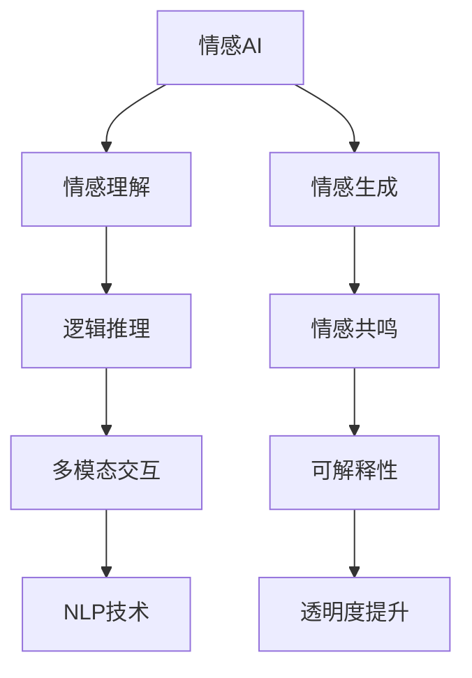

                 

# 体验的authenticity：AI时代的真实性追求

## 1. 背景介绍

在数字时代，人工智能(AI)技术以惊人的速度改变着我们的生活方式，从自动驾驶到智能推荐，从智能客服到虚拟助手，AI技术正逐渐渗透到我们生活的方方面面。然而，随着AI技术的普及，对体验的真实性、自然性提出了更高的要求。如何构建一个既能“拟人化”又能真实反映人类情感和逻辑的AI系统，成为了当前AI技术研究的焦点。

### 1.1 问题由来

近年来，深度学习技术的飞速发展，使得AI在自然语言处理(NLP)、计算机视觉等领域取得了显著的进展。但随之而来的问题也越来越多。一方面，传统AI系统往往缺乏真实性和自然性，难以贴近人类的真实体验。另一方面，人类对AI的期望值也在不断提高，希望AI能不仅具备强大的计算能力，还能具有情感理解和逻辑推理的能力，更好地与人类互动。

如何构建一个既有真实感又具备强大智能的AI系统？这成为了AI研究领域亟待解决的问题。本文将从真实性的角度出发，探讨AI时代下体验的真实性追求，分析当前存在的问题，提出可能的解决方案，并对未来的发展方向进行展望。

### 1.2 问题核心关键点

实现AI体验的真实性，涉及多个方面的问题：

1. **情感理解**：能否让AI系统理解和模仿人类的情感变化，并做出适当的回应。
2. **逻辑推理**：AI系统是否具备类人的逻辑推理能力，能够处理复杂的情境和推理任务。
3. **自然语言处理**：AI系统是否能够自然地生成和理解人类的语言，而非机械式的回复。
4. **多模态交互**：AI系统能否通过多种感知方式与人类交互，如语音、视觉、触觉等。
5. **可解释性**：AI系统的决策过程是否透明，能否被人类理解和接受。

这些核心问题构成了AI体验真实性的主要挑战，需要从技术、算法、模型等多个角度进行综合探索和优化。

## 2. 核心概念与联系

### 2.1 核心概念概述

在探讨体验的真实性时，需要关注以下几个核心概念：

- **情感AI**：能够理解和生成人类情感的AI系统。
- **认知AI**：具备逻辑推理和问题解决的AI系统。
- **自然语言处理(NLP)**：使AI系统能够自然地理解和使用人类语言的技术。
- **多模态交互**：通过多种感知方式与人类互动的AI系统。
- **可解释性**：AI系统的决策过程透明、可解释。

这些概念之间的联系可以通过以下Mermaid流程图来展示：



这个流程图展示了AI体验真实性追求的核心概念及其相互关系。通过理解和生成情感、具备逻辑推理能力、支持多模态交互、具备可解释性，AI系统才能真正实现与人类平等的互动。

## 3. 核心算法原理 & 具体操作步骤

### 3.1 算法原理概述

实现AI体验的真实性，主要涉及以下几个关键算法：

- **情感计算**：通过情感分析、情感生成等技术，使AI系统能够理解和生成人类情感。
- **逻辑推理**：通过知识图谱、逻辑推理引擎等技术，使AI系统具备逻辑推理和问题解决能力。
- **多模态交互**：通过语音识别、图像处理、触觉感知等技术，使AI系统能够通过多种感知方式与人类互动。
- **可解释性**：通过模型解释、决策可视化等技术，使AI系统的决策过程透明、可解释。

这些算法的核心思想是通过技术手段，使AI系统在情感、认知、交互和可解释性等方面具备更强的真实性。

### 3.2 算法步骤详解

以下是实现AI体验真实性的具体操作步骤：

**Step 1: 数据收集与标注**
- 收集与真实体验相关的数据，如情感数据、语音数据、图像数据等。
- 对数据进行标注，使其具备可理解的标签，如情感标签、语言标签等。

**Step 2: 模型训练与优化**
- 使用收集到的数据训练情感AI、认知AI、多模态交互模型和可解释性模型。
- 在训练过程中，通过调整算法参数、优化模型结构等手段，提高模型的性能。

**Step 3: 模型融合与集成**
- 将训练好的模型进行融合和集成，构建能够真实反映人类情感和逻辑的AI系统。
- 通过多模型集成和决策树、投票等手段，提高系统的鲁棒性和准确性。

**Step 4: 实际应用与迭代**
- 将训练好的AI系统应用于实际场景，进行实际应用和测试。
- 根据测试结果，对模型进行迭代和优化，进一步提升系统的性能。

### 3.3 算法优缺点

实现AI体验真实性的算法具有以下优点：

1. **广泛适用性**：这些算法可以应用于多个领域，如医疗、教育、娱乐等，提升用户体验。
2. **多模态融合**：通过多种感知方式与人类互动，使AI系统更具真实感。
3. **可解释性**：提高AI系统的透明性，便于人类理解和接受。

同时，这些算法也存在一些局限性：

1. **数据依赖性强**：需要大量的高质量数据进行训练，数据标注工作量大。
2. **技术复杂度高**：涉及多个领域的算法，技术实现复杂。
3. **鲁棒性不足**：在处理复杂情境时，算法可能会表现不稳定。

尽管存在这些局限性，但通过合理的设计和实现，这些算法仍可以大大提升AI体验的真实性，为AI技术的发展提供新的突破。

### 3.4 算法应用领域

实现AI体验真实性的算法在多个领域都有广泛的应用：

1. **医疗健康**：情感AI可以帮助医生更好地理解患者的情感和需求，提高医疗服务的质量。
2. **教育培训**：认知AI可以辅助教师进行个性化教学，提升学生的学习效果。
3. **娱乐媒体**：情感AI和认知AI可以用于影视制作、游戏开发等领域，使作品更具情感感染力和逻辑性。
4. **客服支持**：多模态交互技术可以提高智能客服的互动效果，提升用户满意度。
5. **智能家居**：通过语音识别和自然语言处理技术，智能家居系统可以更好地理解人类的需求和指令。

这些应用场景展示了AI体验真实性的广泛前景，为AI技术在实际应用中的推广提供了新的可能。

## 4. 数学模型和公式 & 详细讲解  
### 4.1 数学模型构建

实现AI体验的真实性，需要构建多个数学模型，以涵盖情感、逻辑、交互和可解释性等多个方面。以下是这些模型的简要构建：

- **情感计算模型**：通常使用情感分析模型，如BERT、GPT等，结合情感标签进行训练。模型输出为情感类别或情感强度。
- **逻辑推理模型**：可以使用规则推理、知识图谱等方法，结合逻辑标签进行训练。模型输出为推理结果或逻辑判断。
- **多模态交互模型**：结合语音识别、图像处理、触觉感知等技术，将不同模态的数据进行融合。
- **可解释性模型**：使用决策树、模型解释工具等方法，输出模型的决策路径和依据。

### 4.2 公式推导过程

以情感计算模型为例，进行简要公式推导：

假设情感计算模型为 $M_{\theta}$，其中 $\theta$ 为模型参数。给定情感数据 $D=\{(x_i,y_i)\}_{i=1}^N, x_i \in \mathcal{X}, y_i \in \{1,2,...,k\}$，其中 $k$ 为情感类别数。

情感分类模型的损失函数定义为交叉熵损失：

$$
\mathcal{L}(\theta) = -\frac{1}{N}\sum_{i=1}^N \sum_{j=1}^k y_{ij}\log M_{\theta}(x_i)^j
$$

其中 $y_{ij}$ 为 $x_i$ 属于情感类别 $j$ 的标签。

在得到损失函数后，使用梯度下降等优化算法更新模型参数，最小化损失函数：

$$
\theta \leftarrow \theta - \eta \nabla_{\theta}\mathcal{L}(\theta)
$$

其中 $\eta$ 为学习率，$\nabla_{\theta}\mathcal{L}(\theta)$ 为损失函数对参数 $\theta$ 的梯度。

### 4.3 案例分析与讲解

以下是一个情感计算模型的简单实现案例：

1. **数据准备**：收集情感数据，进行标注。
2. **模型构建**：使用预训练的BERT模型，将其顶层作为情感分类器，结合交叉熵损失函数进行训练。
3. **模型评估**：在测试集上评估模型性能，如准确率、F1分数等。
4. **模型应用**：将训练好的模型应用于实际场景，如智能客服、医疗咨询等，进行情感识别和响应。

## 5. 项目实践：代码实例和详细解释说明
### 5.1 开发环境搭建

实现AI体验真实性的项目实践，需要以下开发环境：

1. 安装Python和PyTorch：使用Anaconda创建虚拟环境，安装所需的深度学习库。
2. 收集和标注数据：收集情感数据、语音数据、图像数据等，进行标注。
3. 训练模型：使用收集到的数据训练情感AI、认知AI、多模态交互模型和可解释性模型。

### 5.2 源代码详细实现

以情感计算模型为例，提供一段简单的代码实现：

```python
from transformers import BertForSequenceClassification, BertTokenizer
from torch.utils.data import DataLoader
from sklearn.metrics import accuracy_score, f1_score
from torch.optim import Adam

# 数据准备
tokenizer = BertTokenizer.from_pretrained('bert-base-uncased')
train_data = load_train_data()
test_data = load_test_data()

# 模型构建
model = BertForSequenceClassification.from_pretrained('bert-base-uncased', num_labels=3)

# 训练模型
optimizer = Adam(model.parameters(), lr=2e-5)
train_loader = DataLoader(train_data, batch_size=16)
test_loader = DataLoader(test_data, batch_size=16)

for epoch in range(10):
    model.train()
    for batch in train_loader:
        inputs, labels = batch
        outputs = model(inputs)
        loss = outputs.loss
        optimizer.zero_grad()
        loss.backward()
        optimizer.step()

    model.eval()
    test_outputs, test_labels = [], []
    for batch in test_loader:
        inputs, labels = batch
        outputs = model(inputs)
        test_outputs.append(outputs.logits.argmax(dim=1))
        test_labels.append(labels)
    
    test_outputs = torch.cat(test_outputs, dim=0).numpy()
    test_labels = torch.cat(test_labels, dim=0).numpy()
    accuracy = accuracy_score(test_labels, test_outputs)
    f1 = f1_score(test_labels, test_outputs, average='micro')
    print(f'Epoch {epoch+1}, Accuracy: {accuracy:.3f}, F1 Score: {f1:.3f}')
```

### 5.3 代码解读与分析

以上代码实现了基于BERT模型的情感分类任务，分为数据准备、模型构建、训练和评估四个部分：

- **数据准备**：使用BertTokenizer对文本数据进行分词和编码，构建输入特征。
- **模型构建**：使用预训练的BERT模型，添加顶部全连接层进行情感分类。
- **训练模型**：使用Adam优化器进行训练，并计算损失函数和准确率和F1分数。
- **评估模型**：在测试集上计算模型的准确率和F1分数，进行性能评估。

## 6. 实际应用场景

### 6.1 医疗健康

在医疗健康领域，AI体验的真实性具有重要意义。情感AI可以帮助医生更好地理解患者的情感和需求，从而提供更人性化的医疗服务。例如，智能医疗咨询系统可以通过情感分析，识别患者的焦虑、抑郁等情绪，及时提供心理支持和医疗建议。

### 6.2 教育培训

教育培训领域是AI体验真实性的另一个重要应用场景。认知AI可以辅助教师进行个性化教学，提高学生的学习效果。例如，智能教育平台可以根据学生的学习进度和兴趣，推荐合适的学习内容和课程，并提供个性化的学习路径和建议。

### 6.3 娱乐媒体

在娱乐媒体领域，AI体验的真实性可以显著提升用户体验。情感AI和认知AI可以用于影视制作、游戏开发等领域，使作品更具情感感染力和逻辑性。例如，智能推荐系统可以根据用户的情感偏好和行为数据，推荐符合其喜好的电影、音乐和书籍，提高用户的满意度。

### 6.4 未来应用展望

随着技术的发展，未来AI体验的真实性将有更多的应用场景：

1. **智能家居**：通过语音识别和自然语言处理技术，智能家居系统可以更好地理解人类的需求和指令，提供更加个性化和便捷的生活体验。
2. **智能客服**：多模态交互技术可以提高智能客服的互动效果，提升用户满意度。例如，智能客服系统可以通过语音和图像等多种方式与用户互动，提供更丰富的服务。
3. **智能驾驶**：情感AI可以帮助驾驶员更好地识别和应对突发情况，提高驾驶安全性。例如，智能驾驶系统可以通过情感分析，识别驾驶员的疲劳和注意力不集中等情绪，及时提醒和干预。

## 7. 工具和资源推荐

### 7.1 学习资源推荐

实现AI体验真实性需要掌握多个领域的技术，以下是一些推荐的学习资源：

1. **《Deep Learning for Natural Language Processing》书籍**：介绍了NLP领域的基本概念和前沿技术，包括情感计算、多模态交互等。
2. **CS224N《Deep Learning for Natural Language Processing》课程**：斯坦福大学开设的NLP明星课程，涵盖了NLP领域的多个重要主题。
3. **Transformers官方文档**：提供丰富的预训练模型和微调样例代码，是实现情感AI和认知AI的必备资源。
4. **HuggingFace官方博客**：提供大量的实战案例和模型介绍，帮助开发者快速上手。

### 7.2 开发工具推荐

以下是一些常用的开发工具，有助于实现AI体验真实性：

1. **PyTorch**：灵活的动态计算图，适合深度学习模型的开发和训练。
2. **TensorFlow**：广泛使用的深度学习框架，适合大规模模型的部署和应用。
3. **Jupyter Notebook**：交互式的数据分析和模型开发工具，方便调试和迭代。
4. **Weights & Biases**：模型训练的实验跟踪工具，帮助记录和分析模型性能。
5. **TensorBoard**：可视化工具，方便实时监测模型训练状态和性能。

### 7.3 相关论文推荐

实现AI体验真实性涉及多个领域的算法和技术，以下是一些重要的相关论文：

1. **《Emotion Analysis in Natural Language Processing》**：介绍了情感计算的基本方法和应用场景。
2. **《Knowledge-Base-Based Reasoning System》**：探讨了知识图谱和逻辑推理在AI系统中的应用。
3. **《Multi-Modal Interaction in AI Systems》**：分析了多模态交互技术的发展现状和应用前景。
4. **《Explainable AI: Interpreting and Visualizing Machine Learning Opacities》**：探讨了可解释性技术在AI系统中的应用。

## 8. 总结：未来发展趋势与挑战

### 8.1 研究成果总结

实现AI体验的真实性，需要从多个方面进行综合优化，涵盖情感计算、逻辑推理、多模态交互和可解释性等多个领域。近年来，学术界和工业界在这方面进行了大量的研究和实践，取得了显著的进展。

### 8.2 未来发展趋势

未来AI体验真实性的发展趋势如下：

1. **技术融合**：情感AI、认知AI、多模态交互和可解释性等技术将进一步融合，形成更加全面、智能的AI系统。
2. **数据驱动**：更多的数据将用于训练和优化AI模型，提高系统的准确性和鲁棒性。
3. **跨领域应用**：AI体验真实性将拓展到更多的领域，如医疗、教育、娱乐等，提升人类的生活质量。
4. **实时化部署**：AI系统将更加注重实时性，通过边缘计算等技术，实现低延迟、高可靠性的部署。

### 8.3 面临的挑战

实现AI体验真实性仍面临诸多挑战：

1. **数据瓶颈**：高质量标注数据获取困难，需要大规模的标注工作和资金投入。
2. **算法复杂度**：涉及多个领域的算法，技术实现复杂。
3. **鲁棒性不足**：在处理复杂情境时，算法可能会表现不稳定。
4. **可解释性**：模型的决策过程难以解释，难以满足高风险应用的要求。
5. **伦理和安全**：AI系统的公平性、安全性等问题仍需进一步研究。

### 8.4 研究展望

未来，实现AI体验真实性需要从以下几个方面进行探索：

1. **自动化标注**：开发自动化的数据标注工具，降低标注成本。
2. **跨领域融合**：探索不同领域的数据和算法融合方法，提高系统的适应性。
3. **鲁棒性优化**：研究鲁棒性优化方法，提高算法在复杂情境下的表现。
4. **可解释性增强**：提高模型的可解释性，增强用户信任。
5. **伦理和法规**：制定AI系统的伦理和法规标准，确保其公平性、安全性。

## 9. 附录：常见问题与解答

**Q1：实现AI体验真实性需要多少数据？**

A: 数据量越大，模型的性能越优。具体的数据需求取决于任务复杂度和模型规模。一般来说，情感计算和认知AI需要至少数千甚至数万条标注数据，多模态交互和可解释性模型则需要更多数据。

**Q2：情感AI和认知AI的性能如何评估？**

A: 情感AI的性能可以通过准确率、F1分数、情感强度等指标进行评估。认知AI的性能可以通过推理准确率、逻辑判断正确率等指标进行评估。

**Q3：多模态交互技术有哪些？**

A: 常见的多模态交互技术包括语音识别、图像处理、触觉感知等。这些技术可以结合使用，提升AI系统的感知和互动能力。

**Q4：如何提高AI系统的可解释性？**

A: 提高AI系统的可解释性可以从以下几个方面入手：使用可解释性模型、引入可视化工具、编写详细的模型文档等。

**Q5：AI体验真实性在哪些领域有应用前景？**

A: AI体验真实性在医疗健康、教育培训、娱乐媒体、智能家居、智能客服等多个领域都有广泛的应用前景。

---

作者：禅与计算机程序设计艺术 / Zen and the Art of Computer Programming

