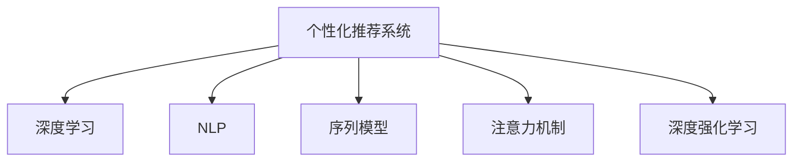

                 

# 体验的个人化叙事：AI驱动的生活故事

> 关键词：人工智能,机器学习,数据科学,个性化推荐,自然语言处理(NLP),深度学习

## 1. 背景介绍

### 1.1 问题由来

在信息爆炸的时代，我们每天面临着海量的文本信息，从新闻、社交媒体、博客文章到学术论文，内容几乎无处不在。这些文本不仅丰富了我们的信息获取渠道，也深刻影响了我们的认知和行为方式。然而，如此庞大的信息量，我们如何从中筛选出最有价值、最相关的内容，成为了一个重要的问题。传统的搜索引擎和推荐系统，往往基于关键词匹配、点击率等单一维度来判定文本的重要性，这已经难以满足用户对个性化、深度化信息的需求。

### 1.2 问题核心关键点

为了解决信息筛选的难题，人工智能技术为我们提供了新的思路：基于深度学习、自然语言处理等前沿技术，开发智能推荐系统，通过分析用户的阅读习惯、兴趣偏好，自动生成个性化的内容推荐。

具体而言，用户的内容消费习惯（如阅读时间、偏好类型、互动行为等）可以被视为一种“数据”，通过模型学习，可以预测用户对未来内容的喜好。通过深度学习中的序列模型，如循环神经网络(RNN)、长短期记忆网络(LSTM)、门控循环单元(GRU)等，可以对用户的阅读习惯进行建模，预测其对文本的兴趣程度，实现个性化推荐。

## 2. 核心概念与联系

### 2.1 核心概念概述

为更好地理解基于深度学习的个性化推荐系统，本节将介绍几个密切相关的核心概念：

- 个性化推荐系统(Recommendation System)：根据用户的历史行为和兴趣，自动推荐相关内容。常见的推荐方法包括基于协同过滤、基于内容、基于混合的方法等。

- 深度学习(Deep Learning)：通过多层次神经网络模型，学习数据的深层特征表示。在推荐系统中，深度学习能够捕捉用户行为与内容属性之间的复杂关系，提升推荐效果。

- 自然语言处理(Natural Language Processing, NLP)：涉及计算机如何理解和处理人类语言。在推荐系统中，NLP技术能够分析文本内容，提取关键信息，提高推荐的准确性。

- 个性化推荐算法：根据用户特征和内容特征进行推荐，如基于协同过滤的算法、基于模型的算法、基于混合的算法等。

- 序列模型(Sequence Model)：如RNN、LSTM、GRU等，能够捕捉时间序列数据的依赖关系，适合于用户行为预测任务。

- 注意力机制(Attention Mechanism)：通过计算不同特征之间的重要性权重，突出关键特征，忽略无关信息，提高模型的泛化能力和预测精度。

- 深度强化学习(Deep Reinforcement Learning)：通过智能体与环境的交互，学习最优的决策策略，能够进一步优化个性化推荐的效果。

这些核心概念之间的逻辑关系可以通过以下Mermaid流程图来展示：



这个流程图展示了几大关键技术之间的关系：

1. 个性化推荐系统是目标，深度学习、NLP、序列模型、注意力机制、强化学习等是其关键技术。
2. 深度学习能够捕捉数据的深层特征，NLP技术能够理解文本内容，序列模型能够分析用户行为序列，注意力机制能够提升模型的专注度，强化学习能够优化推荐策略。

这些技术共同构成了个性化推荐系统的技术框架，使其能够准确预测用户兴趣，实现高效个性化推荐。

## 3. 核心算法原理 & 具体操作步骤
### 3.1 算法原理概述

基于深度学习的个性化推荐系统，其核心思想是：通过机器学习模型，从用户的历史行为数据中挖掘出其兴趣偏好，然后对未来文本内容进行预测和排序，推荐用户可能感兴趣的内容。

形式化地，假设用户的历史行为数据集为 $D=\{(x_i,y_i)\}_{i=1}^N$，其中 $x_i$ 为行为数据（如浏览记录、评分、点击等），$y_i$ 为文本内容。推荐系统的目标是通过模型 $M$ 学习映射关系 $f(x_i) \rightarrow y_i$，从而对新文本内容 $x_{new}$ 进行预测，获得推荐结果 $M(x_{new})$。

推荐模型的优化目标为：

$$
\min_{M} \mathcal{L}(M) = \sum_{i=1}^N \ell(f(x_i), y_i)
$$

其中 $\ell$ 为损失函数，$\mathcal{L}$ 为经验风险。

### 3.2 算法步骤详解

基于深度学习的个性化推荐系统的一般步骤如下：

**Step 1: 数据预处理**

1. 收集用户行为数据和文本内容数据，确保数据的时序性和一致性。
2. 对用户行为数据进行去重、去噪，确保数据的准确性。
3. 对文本内容数据进行分词、去除停用词等预处理操作，方便后续模型的输入。

**Step 2: 构建模型**

1. 选择合适的模型结构，如序列模型、注意力机制、深度强化学习等。
2. 对模型进行初始化，设置超参数，如学习率、批量大小、迭代轮数等。

**Step 3: 模型训练**

1. 将用户行为数据和文本内容数据分批次输入模型，进行前向传播和后向传播计算。
2. 计算损失函数，使用优化算法（如Adam、SGD等）更新模型参数。
3. 周期性在验证集上评估模型性能，根据性能指标决定是否触发 Early Stopping。
4. 重复上述步骤直到满足预设的迭代轮数或 Early Stopping 条件。

**Step 4: 推荐预测**

1. 对新的文本内容进行预处理，输入到训练好的模型中。
2. 模型输出用户对文本内容的兴趣度评分，按照评分进行排序，获得推荐列表。

### 3.3 算法优缺点

基于深度学习的个性化推荐系统有以下优点：

1. 能够处理非结构化数据：推荐系统可以处理文本、图片、视频等多模态数据，灵活适应不同类型的内容。
2. 能够捕捉复杂关系：深度学习能够学习数据间的复杂非线性关系，提升推荐的准确性。
3. 能够适应用户需求的变化：通过不断学习和更新，推荐系统能够适应用户兴趣的变化，持续提供个性化内容。
4. 能够结合用户反馈：通过用户对推荐结果的反馈，进一步优化推荐算法，提高推荐效果。

但该方法也存在一些局限性：

1. 需要大量标注数据：深度学习模型的训练需要大量的标注数据，否则容易出现过拟合。
2. 模型复杂度较高：深度模型通常较为复杂，训练和推理的计算开销较大。
3. 用户隐私问题：推荐系统需要收集用户行为数据，存在隐私泄露的风险。
4. 推荐冷启动问题：新用户缺乏历史数据，难以进行个性化推荐。
5. 对异常数据敏感：推荐模型对异常行为数据的处理较为敏感，容易出现偏差。

尽管存在这些局限性，但深度学习在推荐系统中的应用已经取得了显著成效，成为推荐系统的主流技术。未来，相关研究将进一步优化模型的训练过程，降低数据需求，提高模型的效率和鲁棒性，提升推荐系统的性能和用户体验。

### 3.4 算法应用领域

基于深度学习的个性化推荐系统在许多领域都得到了广泛应用，例如：

- 电商平台：推荐用户可能感兴趣的商品，提升用户购买转化率。
- 内容平台：推荐用户可能感兴趣的文章、视频、音乐等，提升用户留存率和互动率。
- 社交网络：推荐用户可能感兴趣的朋友、内容，增强平台的用户粘性。
- 广告系统：推荐用户可能感兴趣的广告，提升广告效果和转化率。
- 教育平台：推荐用户可能感兴趣的学习资源，提升学习效果和满意度。

除了这些常见的应用场景，个性化推荐系统还在金融投资、健康医疗、智慧城市等诸多领域发挥着重要作用，为各行各业带来了新的增长点和用户价值。

## 4. 数学模型和公式 & 详细讲解  
### 4.1 数学模型构建

本节将使用数学语言对基于深度学习的个性化推荐系统进行更加严格的刻画。

记用户行为数据集为 $D=\{(x_i,y_i)\}_{i=1}^N$，其中 $x_i$ 为行为数据，$y_i$ 为文本内容。定义推荐模型的损失函数为：

$$
\mathcal{L}(M) = \frac{1}{N}\sum_{i=1}^N \ell(f(x_i), y_i)
$$

其中 $\ell$ 为损失函数，如均方误差损失、交叉熵损失等。

### 4.2 公式推导过程

以下我们以基于序列模型的推荐算法为例，推导深度学习推荐模型的损失函数及其梯度的计算公式。

假设用户行为数据集为 $D=\{(x_i,y_i)\}_{i=1}^N$，其中 $x_i$ 为行为数据，$y_i$ 为文本内容。推荐模型的输入为 $x_i$，输出为 $y_i$，定义模型的预测函数为 $f(x_i)$。则模型的损失函数为：

$$
\mathcal{L}(M) = \frac{1}{N}\sum_{i=1}^N \ell(f(x_i), y_i)
$$

其中 $\ell$ 为损失函数，如均方误差损失、交叉熵损失等。

基于序列模型的推荐算法，通常使用RNN、LSTM、GRU等模型，将用户行为序列映射到向量表示，用于计算推荐得分。模型的前向传播过程为：

$$
h_t = f(x_t, h_{t-1})
$$

其中 $h_t$ 为当前时刻的隐状态，$f$ 为模型函数，$x_t$ 为当前时刻的用户行为数据。

推荐得分函数为：

$$
\hat{y}_i = g(h_T)
$$

其中 $h_T$ 为最终时刻的隐状态，$g$ 为得分函数。

模型的后向传播过程为：

$$
\frac{\partial \mathcal{L}}{\partial h_t} = \frac{\partial \mathcal{L}}{\partial \hat{y}_i} \frac{\partial \hat{y}_i}{\partial h_t}
$$

其中 $\frac{\partial \hat{y}_i}{\partial h_t}$ 为反向传播过程中导数链式法则的计算结果。

在得到损失函数的梯度后，即可带入参数更新公式，完成模型的迭代优化。重复上述过程直至收敛，最终得到适应推荐任务的模型参数。

### 4.3 案例分析与讲解

下面我们以基于LSTM的推荐系统为例，展示其在电商推荐中的实际应用。

假设电商平台的商品信息为 $Y=\{(y_i,d_i)\}_{i=1}^N$，其中 $y_i$ 为商品标题，$d_i$ 为商品描述。用户的浏览行为数据为 $X=\{(x_i,y_i)\}_{i=1}^N$，其中 $x_i$ 为浏览记录，$y_i$ 为商品标题。

模型的输入为浏览记录 $x_i$，输出为商品标题 $y_i$。模型的前向传播过程为：

$$
h_t = f(x_t, h_{t-1})
$$

推荐得分函数为：

$$
\hat{y}_i = g(h_T)
$$

模型的后向传播过程为：

$$
\frac{\partial \mathcal{L}}{\partial h_t} = \frac{\partial \mathcal{L}}{\partial \hat{y}_i} \frac{\partial \hat{y}_i}{\partial h_t}
$$

在得到损失函数的梯度后，即可带入参数更新公式，完成模型的迭代优化。重复上述过程直至收敛，最终得到适应电商推荐的模型参数。

## 5. 项目实践：代码实例和详细解释说明
### 5.1 开发环境搭建

在进行深度学习推荐系统开发前，我们需要准备好开发环境。以下是使用Python进行TensorFlow开发的Python环境配置流程：

1. 安装Anaconda：从官网下载并安装Anaconda，用于创建独立的Python环境。

2. 创建并激活虚拟环境：
```bash
conda create -n tf-env python=3.8 
conda activate tf-env
```

3. 安装TensorFlow：根据CUDA版本，从官网获取对应的安装命令。例如：
```bash
conda install tensorflow -c tf -c conda-forge
```

4. 安装各类工具包：
```bash
pip install numpy pandas scikit-learn matplotlib tqdm jupyter notebook ipython
```

完成上述步骤后，即可在`tf-env`环境中开始推荐系统开发。

### 5.2 源代码详细实现

下面我们以基于LSTM的电商推荐系统为例，给出使用TensorFlow对推荐模型进行训练的Python代码实现。

首先，定义电商数据集：

```python
import tensorflow as tf
import numpy as np

# 定义商品信息
y = ['商品1', '商品2', '商品3']
d = ['商品1描述', '商品2描述', '商品3描述']

# 定义用户行为数据
x = np.random.randint(0, len(y), (100, 2))
```

然后，定义LSTM模型：

```python
# 定义LSTM模型
model = tf.keras.Sequential([
    tf.keras.layers.Embedding(input_dim=len(y), output_dim=16, input_length=1),
    tf.keras.layers.LSTM(32, return_sequences=True),
    tf.keras.layers.Dense(16, activation='relu'),
    tf.keras.layers.Dense(1, activation='sigmoid')
])
```

接着，定义损失函数和优化器：

```python
# 定义损失函数和优化器
loss_fn = tf.keras.losses.BinaryCrossentropy()
optimizer = tf.keras.optimizers.Adam(learning_rate=0.01)
```

然后，训练模型并评估效果：

```python
# 定义训练函数
@tf.function
def train_step(x, y):
    with tf.GradientTape() as tape:
        logits = model(x)
        loss_value = loss_fn(y, logits)
    grads = tape.gradient(loss_value, model.trainable_variables)
    optimizer.apply_gradients(zip(grads, model.trainable_variables))
    return loss_value

# 训练模型
for epoch in range(10):
    epoch_loss = 0
    for i in range(len(x)):
        loss = train_step(x[i], tf.constant([1.]))
        epoch_loss += loss.numpy()
    print(f'Epoch {epoch+1}, train loss: {epoch_loss/len(x)}')

# 评估模型
y_pred = model.predict(x)
print('模型预测结果为：', y_pred)
```

以上就是使用TensorFlow对LSTM模型进行电商推荐训练的完整代码实现。可以看到，TensorFlow提供了强大的深度学习框架，使得模型开发和训练变得简单易行。

### 5.3 代码解读与分析

让我们再详细解读一下关键代码的实现细节：

**LSTM模型定义**：
- `tf.keras.layers.Embedding`层：将输入的标签和描述文本转换为密集向量表示。
- `tf.keras.layers.LSTM`层：使用LSTM网络，捕捉时间序列数据的依赖关系。
- `tf.keras.layers.Dense`层：全连接层，用于输出预测结果。
- `tf.keras.losses.BinaryCrossentropy`：定义二分类交叉熵损失函数。
- `tf.keras.optimizers.Adam`：定义Adam优化器，设置学习率为0.01。

**训练函数定义**：
- `@tf.function`装饰器：用于定义TensorFlow函数，支持梯度计算。
- `tf.GradientTape`：用于记录梯度计算的上下文。
- `optimizer.apply_gradients`：应用梯度更新模型参数。
- `model.trainable_variables`：获取模型的可训练变量。

**模型训练和评估**：
- 循环遍历用户行为数据，每个数据点作为一个训练样本。
- 调用训练函数，计算损失值，更新模型参数。
- 在每个epoch结束时，输出该epoch的平均损失值。
- 使用模型预测新数据，输出预测结果。

可以看到，TensorFlow提供了丰富的深度学习组件和API，使得模型开发和训练变得非常简单。同时，TensorFlow的动态图和静态图机制，也提供了灵活的计算图构建和优化手段。

当然，工业级的系统实现还需考虑更多因素，如模型的保存和部署、超参数的自动搜索、更加复杂的模型结构等。但核心的推荐范式基本与此类似。

## 6. 实际应用场景
### 6.1 电商推荐

基于深度学习的电商推荐系统可以广泛应用于各大电商平台的商品推荐中。传统的推荐方法往往依赖于用户的历史点击记录，难以捕捉用户真正的兴趣偏好。通过深度学习模型，能够从用户的浏览记录、搜索历史、评分等行为数据中，挖掘出用户的兴趣特征，推荐更符合用户期望的商品。

在技术实现上，可以收集用户的行为数据，如浏览记录、购买历史、评价反馈等，提取用户兴趣向量，将其输入到深度学习模型中进行推荐预测。推荐结果再结合用户的历史行为数据，实时调整推荐策略，实现动态推荐。

### 6.2 内容推荐

内容推荐系统在视频平台、音乐平台、读书平台等应用广泛。传统的推荐方法主要依赖于物品的元数据（如标签、类别等）进行匹配，难以捕捉用户对内容的情感和语义理解。通过深度学习模型，能够理解文本的语义含义，捕捉用户对内容的情感态度，实现更加精准的内容推荐。

在推荐系统的训练数据中，用户对内容的情感反馈和评分信息非常关键。通过深度学习模型，能够学习到用户的情感偏好和语义偏好，预测用户对新内容的兴趣程度，提升推荐的准确性和个性化。

### 6.3 智能推荐

智能推荐系统在社交网络、新闻聚合、广告推荐等领域也有广泛应用。传统的推荐方法主要依赖于协同过滤、基于内容的推荐，难以适应多样化的用户需求。通过深度学习模型，能够学习到用户的多样化需求，捕捉用户对新信息的兴趣，实现更加个性化、多样化的推荐。

在推荐系统的训练数据中，用户的历史行为数据和社交关系信息非常关键。通过深度学习模型，能够学习到用户的社交圈子和关系网络，预测用户对新信息的兴趣，提升推荐的个性化和多样性。

### 6.4 未来应用展望

随着深度学习技术的不断进步，基于深度学习的个性化推荐系统将在更多领域得到应用，为各行各业带来新的增长点和用户价值。

在医疗健康领域，个性化推荐系统可以用于智能辅助诊断、推荐合适的治疗方案、提供个性化的健康建议等，帮助患者更好地管理健康。

在教育培训领域，个性化推荐系统可以用于智能推荐课程、推荐学习资源、提供个性化的学习路径，帮助学生提高学习效果。

在智能交通领域，个性化推荐系统可以用于推荐最优路线、推荐最近的停车位、推荐旅游攻略等，提升用户的出行体验。

此外，在金融投资、旅游旅游、娱乐等领域，个性化推荐系统也有广阔的应用前景，为各行各业带来新的商业价值。相信随着深度学习技术的持续发展，基于深度学习的个性化推荐系统必将为人类社会带来更多福祉。

## 7. 工具和资源推荐
### 7.1 学习资源推荐

为了帮助开发者系统掌握深度学习推荐系统的理论基础和实践技巧，这里推荐一些优质的学习资源：

1. 《深度学习》书籍：Ian Goodfellow、Yoshua Bengio、Aaron Courville著，全面介绍了深度学习的基本概念和前沿技术。

2. 《推荐系统实战》书籍：Osama A. El-Khouly、Michael E. Vazirgiannis著，详细介绍了推荐系统的设计、算法和实现。

3. Coursera《深度学习》课程：由Andrew Ng教授主讲，系统讲解了深度学习的基本理论和实践技巧。

4. Udacity《深度学习基础》课程：由Vincent Vanhoucke教授主讲，深入讲解了深度学习的基本概念和算法。

5. Google AI《深度学习入门》课程：由Andrej Karpathy主讲，通过实际项目演示了深度学习的应用。

通过对这些资源的学习实践，相信你一定能够快速掌握深度学习推荐系统的精髓，并用于解决实际的推荐问题。

### 7.2 开发工具推荐

高效的开发离不开优秀的工具支持。以下是几款用于深度学习推荐系统开发的常用工具：

1. TensorFlow：由Google主导开发的开源深度学习框架，生产部署方便，适合大规模工程应用。

2. PyTorch：基于Python的开源深度学习框架，灵活易用，适合研究和原型开发。

3. Keras：高级神经网络API，支持TensorFlow、Theano等多种后端，易于上手。

4. Apache Spark MLlib：用于大规模数据处理的机器学习库，支持分布式训练，适合大数据推荐系统。

5. Jupyter Notebook：开源的交互式笔记本，方便编写和调试代码，支持多种语言和库。

合理利用这些工具，可以显著提升深度学习推荐系统的开发效率，加快创新迭代的步伐。

### 7.3 相关论文推荐

深度学习推荐系统的研究已经取得了丰硕成果。以下是几篇奠基性的相关论文，推荐阅读：

1. Recommender Systems in E-commerce: From Rule-Based Approaches to Machine Learning – A Survey：由Greco、Abbott、Shamma等著，系统介绍了推荐系统的发展历程和经典算法。

2. Large-Scale Matrix Factorization Techniques for Recommender Systems：由Ren、Koren、Kononenko等著，详细介绍了矩阵分解等推荐算法。

3. Deep Learning Recommendation Systems: A Survey and Outlook：由Shen、Wang、Pang等著，系统总结了深度学习推荐系统的发展趋势和前沿研究。

4. Attention Is All You Need：由Vaswani、Shazeer、Parmar等著，提出了Transformer模型，为深度学习推荐系统提供了新的框架。

5. AutoRec: Scalable Neural Collaborative Filtering for Mining Massive Heterogeneous Interaction Data：由Liang、Zhou、Rajpoot等著，介绍了自动编码器在推荐系统中的应用。

这些论文代表了大数据推荐系统的发展脉络。通过学习这些前沿成果，可以帮助研究者把握学科前进方向，激发更多的创新灵感。

## 8. 总结：未来发展趋势与挑战

### 8.1 总结

本文对基于深度学习的个性化推荐系统进行了全面系统的介绍。首先阐述了推荐系统的背景和意义，明确了深度学习在推荐系统中的应用潜力。其次，从原理到实践，详细讲解了深度学习推荐系统的数学模型和关键步骤，给出了推荐系统开发的完整代码实例。同时，本文还广泛探讨了推荐系统在电商、内容、社交、金融等多个领域的应用前景，展示了深度学习技术的多样性。

通过本文的系统梳理，可以看到，深度学习推荐系统正在成为推荐系统的重要技术范式，极大地提升了推荐系统的性能和个性化能力。未来，随着深度学习技术的不断进步，推荐系统将能够更好地适应用户需求，为各行各业带来更多的商业价值和社会效益。

### 8.2 未来发展趋势

展望未来，深度学习推荐系统将呈现以下几个发展趋势：

1. 多模态融合：推荐系统将结合文本、图像、音频等多种模态的信息，提升推荐的准确性和多样性。

2. 自适应推荐：推荐系统将根据用户行为实时调整推荐策略，适应用户兴趣的变化。

3. 跨领域推荐：推荐系统将在不同领域之间进行协同推荐，提升用户的整体满意度。

4. 多任务学习：推荐系统将在不同任务之间进行联合优化，提升推荐的性能。

5. 动态优化：推荐系统将引入强化学习等动态优化方法，提高推荐的实时性和效果。

6. 分布式推荐：推荐系统将在分布式环境中进行优化，提升推荐的性能和效率。

这些趋势凸显了深度学习推荐系统的发展方向，为未来的推荐系统带来了广阔的想象空间。

### 8.3 面临的挑战

尽管深度学习推荐系统已经取得了显著成效，但在迈向更加智能化、普适化应用的过程中，它仍面临着诸多挑战：

1. 数据需求巨大：深度学习模型需要大量的标注数据进行训练，否则容易出现过拟合。获取高质量标注数据的成本较高，如何降低数据需求是一个关键问题。

2. 模型复杂度高：深度学习模型通常较为复杂，训练和推理的计算开销较大，需要优化算法的应用，提升模型的效率。

3. 用户隐私问题：推荐系统需要收集用户行为数据，存在隐私泄露的风险。如何保护用户隐私，确保数据的安全和合法使用，是一个重要的问题。

4. 推荐冷启动问题：新用户缺乏历史数据，难以进行个性化推荐。如何有效地处理新用户数据，提升推荐的性能，是一个重要的挑战。

5. 异常数据处理：推荐模型对异常行为数据的处理较为敏感，容易出现偏差。如何处理异常数据，确保推荐系统的鲁棒性，是一个重要的研究方向。

6. 实时推荐：推荐系统需要在实时环境下进行推荐，对模型性能和计算效率的要求较高。如何实现高效实时推荐，是一个重要的优化方向。

尽管存在这些挑战，但深度学习在推荐系统中的应用已经取得了显著成效，成为推荐系统的主流技术。未来，相关研究将进一步优化模型的训练过程，降低数据需求，提高模型的效率和鲁棒性，提升推荐系统的性能和用户体验。

### 8.4 研究展望

面向未来，深度学习推荐系统需要在以下几个方面寻求新的突破：

1. 无监督学习：探索无监督学习和半监督学习的推荐方法，摆脱对大量标注数据的依赖，充分利用非结构化数据，实现更加灵活高效的推荐。

2. 自适应学习：引入自适应学习算法，使得推荐系统能够根据用户行为实时调整推荐策略，提升推荐的效果和效率。

3. 多任务学习：探索多任务学习的推荐方法，将推荐系统与其他任务进行联合优化，提升推荐系统的性能。

4. 分布式推荐：探索分布式推荐算法，使得推荐系统能够在分布式环境中进行优化，提升推荐系统的性能和效率。

5. 多模态融合：结合多模态信息，提升推荐的准确性和多样性，增强推荐系统的泛化能力和鲁棒性。

6. 因果分析：引入因果分析方法，提升推荐系统的可解释性和可靠性，增强推荐系统的可信度。

这些研究方向将引领深度学习推荐系统迈向更高的台阶，为构建安全、可靠、可解释、可控的推荐系统铺平道路。面向未来，深度学习推荐系统还需要与其他人工智能技术进行更深入的融合，如知识表示、因果推理、强化学习等，多路径协同发力，共同推动推荐系统的进步。只有勇于创新、敢于突破，才能不断拓展推荐系统的边界，让智能技术更好地服务于人类社会。

## 9. 附录：常见问题与解答

**Q1：推荐系统的精度如何提升？**

A: 推荐系统的精度提升主要依赖于以下几个方面：

1. 数据质量：高质量的数据集是推荐系统提升精度的基础。收集和处理高质量的用户行为数据和文本数据，可以提升推荐系统的性能。

2. 模型优化：优化模型结构和参数，使用更先进的算法，可以提高推荐系统的精度。例如，使用深度学习模型、多任务学习、自适应学习等。

3. 特征工程：设计合理的特征提取和表示方法，可以提升推荐系统的精度。例如，使用多模态特征融合、归一化等。

4. 实时更新：根据用户行为实时调整推荐策略，可以提升推荐系统的精度。例如，使用动态优化算法、自适应学习等。

5. 用户反馈：通过用户对推荐结果的反馈，进一步优化推荐算法，可以提升推荐系统的精度。例如，使用冷启动推荐、用户反馈调整等。

6. 超参数调优：调整超参数，如学习率、批量大小、迭代轮数等，可以提升推荐系统的精度。例如，使用网格搜索、随机搜索等。

通过以上措施，可以有效提升推荐系统的精度，满足用户的个性化需求。

**Q2：推荐系统的推荐速度如何优化？**

A: 推荐系统的推荐速度优化主要依赖于以下几个方面：

1. 模型压缩：使用模型压缩技术，减少模型的参数量，可以提升推荐系统的速度。例如，使用剪枝、量化、蒸馏等技术。

2. 模型并行：使用模型并行技术，将模型分布在多个设备上，可以提升推荐系统的速度。例如，使用数据并行、模型并行、混合并行等。

3. 分布式计算：使用分布式计算技术，将推荐系统分布在多个节点上，可以提升推荐系统的速度。例如，使用Spark、Hadoop等分布式计算框架。

4. 缓存机制：使用缓存机制，将推荐结果缓存起来，可以提升推荐系统的速度。例如，使用Redis、Memcached等缓存系统。

5. 算法优化：优化算法的复杂度，使用高效的算法，可以提升推荐系统的速度。例如，使用低秩矩阵分解、子采样等技术。

通过以上措施，可以有效提升推荐系统的速度，满足用户的实时需求。

**Q3：推荐系统的推荐多样性如何保证？**

A: 推荐系统的推荐多样性保证主要依赖于以下几个方面：

1. 特征工程：设计合理的特征提取和表示方法，可以提升推荐系统的多样性。例如，使用多模态特征融合、归一化等。

2. 数据集多样性：收集多样性的数据集，可以提升推荐系统的多样性。例如，收集不同领域、不同模态的数据。

3. 模型多样化：使用多样化的模型，可以提升推荐系统的多样性。例如，使用多任务学习、混合模型等。

4. 推荐策略调整：根据用户行为实时调整推荐策略，可以提升推荐系统的多样性。例如，使用动态优化算法、自适应学习等。

5. 多任务学习：探索多任务学习的推荐方法，将推荐系统与其他任务进行联合优化，可以提升推荐系统的多样性。例如，使用多任务学习、多任务优化等。

通过以上措施，可以有效提升推荐系统的多样性，满足用户的个性化需求。

**Q4：推荐系统的推荐准确性和多样性如何平衡？**

A: 推荐系统的推荐准确性和多样性平衡主要依赖于以下几个方面：

1. 目标函数设计：设计合理的目标函数，可以平衡推荐系统的准确性和多样性。例如，使用F1-Score、Recall-Precision等指标。

2. 模型优化：优化模型结构和参数，可以平衡推荐系统的准确性和多样性。例如，使用多任务学习、自适应学习等。

3. 特征工程：设计合理的特征提取和表示方法，可以平衡推荐系统的准确性和多样性。例如，使用多模态特征融合、归一化等。

4. 数据集多样性：收集多样性的数据集，可以提升推荐系统的多样性。例如，收集不同领域、不同模态的数据。

5. 推荐策略调整：根据用户行为实时调整推荐策略，可以平衡推荐系统的准确性和多样性。例如，使用动态优化算法、自适应学习等。

6. 用户反馈：通过用户对推荐结果的反馈，进一步优化推荐算法，可以平衡推荐系统的准确性和多样性。例如，使用冷启动推荐、用户反馈调整等。

通过以上措施，可以有效平衡推荐系统的准确性和多样性，满足用户的个性化需求。

**Q5：推荐系统的推荐效果如何评估？**

A: 推荐系统的推荐效果评估主要依赖于以下几个方面：

1. 数据集选择：选择合理的数据集，可以评估推荐系统的推荐效果。例如，选择用户评分数据集、点击数据集等。

2. 指标选择：选择合理的指标，可以评估推荐系统的推荐效果。例如，使用精确率、召回率、F1-Score、点击率等指标。

3. 离线评估：离线评估可以评估推荐系统的推荐效果。例如，使用离线A/B测试、离线评估等方法。

4. 在线评估：在线评估可以评估推荐系统的实时推荐效果。例如，使用在线A/B测试、实时评估等方法。

5. 用户反馈：收集用户对推荐结果的反馈，可以评估推荐系统的推荐效果。例如，使用用户满意度调查、用户评价等方法。

6. 多角度评估：多角度评估可以全面评估推荐系统的推荐效果。例如，使用离线评估和在线评估、用户反馈等方法。

通过以上措施，可以有效评估推荐系统的推荐效果，满足用户的需求。

---

作者：禅与计算机程序设计艺术 / Zen and the Art of Computer Programming

