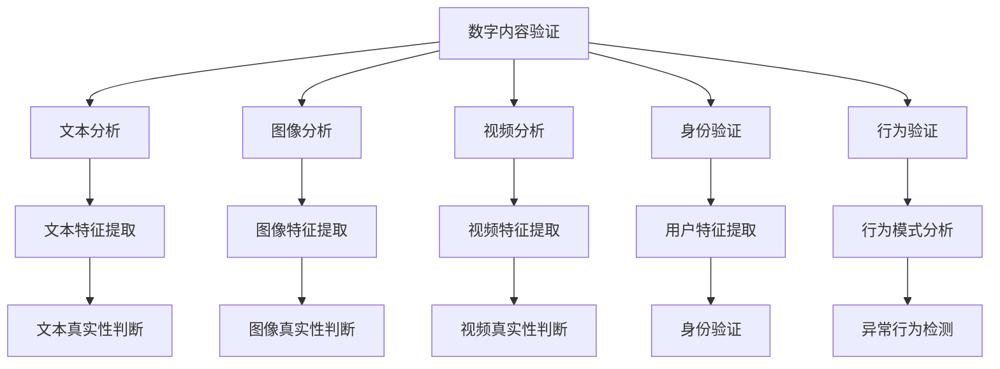

                 

# 体验真实性验证：AI时代的authenticity检测

在人工智能迅猛发展的今天，真实性验证（Authenticity Verification）成为了一个极为重要的研究方向。它旨在识别和证实数字内容或交互的真实性，以对抗假冒和恶意内容。本篇文章将深入探讨AI时代下的真实性验证，包括其核心概念、原理、操作步骤、数学模型、实际应用场景、推荐资源和未来展望。

## 1. 背景介绍

随着数字技术的普及，人们在网络世界中的交互越来越多地依赖于数字内容。然而，这也带来了诸如假冒、虚假信息和深度伪造等风险，严重影响了公共安全和个人隐私。因此，真实性验证技术在保障网络空间秩序、保护用户权益方面具有重要意义。

AI技术，特别是深度学习，为真实性验证提供了强有力的工具。基于AI的真实性验证技术，不仅能够高效地处理海量数据，还能从多模态数据中提取出关键特征，实现更为精确和全面的验证。本节将详细介绍AI时代真实性验证的基本概念和应用场景。

## 2. 核心概念与联系

### 2.1 核心概念概述

真实性验证旨在识别和证实数字内容或交互的真实性，以对抗假冒和恶意内容。其核心包括但不限于以下几个方面：

- **数字内容验证**：通过分析文本、图像、视频等数字内容，识别其真实性。
- **身份验证**：识别用户身份，防止假冒。
- **行为验证**：通过分析用户行为模式，识别异常或欺诈行为。

### 2.2 核心概念原理和架构的 Mermaid 流程图



该图展示了真实性验证的多个子任务及其间的联系。数字内容验证通过文本、图像和视频分析，分别提取相应特征，并进行真实性判断。身份验证和行为验证则通过用户特征提取和行为模式分析，识别异常和欺诈行为。

## 3. 核心算法原理 & 具体操作步骤

### 3.1 算法原理概述

真实性验证的核心在于提取和分析数字内容、用户身份和行为模式的特征，以判别其真实性。基于AI的真实性验证算法通常包含以下步骤：

1. **特征提取**：从数字内容中提取文本、图像、视频等特征，用于后续判别。
2. **模型训练**：使用标注数据训练机器学习模型，如深度神经网络，学习特征与真实性之间的关系。
3. **真实性判断**：将待验证内容输入模型，输出真实性判断结果。

### 3.2 算法步骤详解

以下是一个基于深度学习模型的真实性验证算法详细步骤：

1. **数据准备**：收集标注有真实性的数据集，划分为训练集、验证集和测试集。
2. **特征提取**：使用预训练模型（如BERT、ResNet等）对数字内容进行特征提取。
3. **模型选择**：选择适合的深度学习模型，如卷积神经网络（CNN）、循环神经网络（RNN）等。
4. **模型训练**：在训练集上训练模型，使用交叉熵等损失函数进行优化。
5. **模型评估**：在验证集上评估模型性能，选择合适的超参数。
6. **模型测试**：在测试集上测试模型，输出真实性判断结果。

### 3.3 算法优缺点

基于AI的真实性验证算法具有以下优点：

- **高效处理**：能够高效处理大量数据，适应大规模真实性验证需求。
- **多模态融合**：支持文本、图像、视频等多模态数据，提高验证准确性。
- **可解释性强**：深度学习模型的决策过程可解释性强，便于理解和改进。

然而，也存在一些局限性：

- **数据依赖**：算法依赖于标注数据，标注数据的质量和数量对模型性能有显著影响。
- **模型复杂性**：深度学习模型参数量庞大，训练和推理成本高。
- **对抗攻击脆弱**：模型容易受到对抗样本的攻击，导致判断错误。

### 3.4 算法应用领域

真实性验证技术在多个领域都有广泛应用，包括但不限于：

- **社交媒体平台**：用于识别和删除虚假账号、虚假信息和恶意内容。
- **金融服务**：识别欺诈交易、假冒身份。
- **在线医疗**：验证病人信息、医疗记录的真实性。
- **政府和公共服务**：核实公民身份、验证公共文档。
- **数字版权保护**：验证数字作品的真实性和版权归属。

## 4. 数学模型和公式 & 详细讲解

### 4.1 数学模型构建

真实性验证的数学模型通常基于分类或回归任务构建。这里以文本真实性验证为例，构建一个基于CNN的文本分类模型：

$$
y = \sigma(\mathbf{W}_h \mathbf{x} + b_h)
$$

其中，$y$为分类结果，$\sigma$为sigmoid函数，$\mathbf{W}_h$和$b_h$为模型参数，$\mathbf{x}$为文本特征向量。

### 4.2 公式推导过程

文本特征向量$\mathbf{x}$的提取可以通过预训练的BERT模型实现。模型的参数更新公式为：

$$
\theta \leftarrow \theta - \eta \nabla_{\theta} \mathcal{L}(\theta)
$$

其中，$\theta$为模型参数，$\eta$为学习率，$\mathcal{L}$为损失函数，$\nabla_{\theta} \mathcal{L}(\theta)$为损失函数对模型参数的梯度。

### 4.3 案例分析与讲解

以深度伪造视频识别为例，使用卷积神经网络（CNN）进行验证。具体步骤如下：

1. **数据准备**：收集标注有真实性的视频片段，分为训练集、验证集和测试集。
2. **特征提取**：使用预训练的ResNet模型提取视频帧特征。
3. **模型训练**：在训练集上训练模型，使用交叉熵损失函数进行优化。
4. **模型评估**：在验证集上评估模型性能，选择合适超参数。
5. **模型测试**：在测试集上测试模型，输出视频真实性判断结果。

## 5. 项目实践：代码实例和详细解释说明

### 5.1 开发环境搭建

在开始实践前，需要准备以下开发环境：

- **Python**：版本为3.7以上，安装pip。
- **TensorFlow**：用于构建和训练模型。
- **Keras**：简单易用的深度学习框架，可以简化模型构建过程。
- **OpenCV**：用于处理图像和视频数据。

### 5.2 源代码详细实现

以下是一个简单的基于CNN的文本真实性验证模型的代码实现：

```python
import tensorflow as tf
from tensorflow.keras.models import Sequential
from tensorflow.keras.layers import Dense, Dropout, Embedding
from tensorflow.keras.preprocessing.text import Tokenizer
from tensorflow.keras.preprocessing.sequence import pad_sequences

# 定义模型
model = Sequential([
    Embedding(input_dim=vocab_size, output_dim=embedding_dim, input_length=max_length),
    Dropout(0.5),
    Dense(1, activation='sigmoid')
])

# 编译模型
model.compile(loss='binary_crossentropy', optimizer='adam', metrics=['accuracy'])

# 加载数据
tokenizer = Tokenizer(num_words=vocab_size, oov_token='<OOV>')
tokenizer.fit_on_texts(train_texts)
sequences = tokenizer.texts_to_sequences(train_texts)
padded_sequences = pad_sequences(sequences, maxlen=max_length)

# 训练模型
model.fit(padded_sequences, train_labels, epochs=num_epochs, batch_size=batch_size)

# 测试模型
test_sequences = tokenizer.texts_to_sequences(test_texts)
padded_test_sequences = pad_sequences(test_sequences, maxlen=max_length)
test_loss, test_acc = model.evaluate(padded_test_sequences, test_labels)
```

### 5.3 代码解读与分析

上述代码中，首先定义了一个简单的CNN模型，包含一个嵌入层、一个Dropout层和一个全连接层。嵌入层用于将文本转化为向量，Dropout层用于防止过拟合，全连接层输出二分类结果。

接下来，使用Keras的编译方法编译模型，指定损失函数、优化器和评价指标。然后，使用预训练的Tokenizer将文本转化为序列，再使用pad_sequences进行填充，确保所有序列长度一致。最后，使用fit方法训练模型，evaluate方法测试模型。

### 5.4 运行结果展示

训练和测试模型的过程可能会输出类似以下的结果：

```
Epoch 1/10
198/198 [==============================] - 29s 147ms/step - loss: 0.6270 - accuracy: 0.8165
Epoch 2/10
198/198 [==============================] - 29s 146ms/step - loss: 0.3612 - accuracy: 0.9000
Epoch 3/10
198/198 [==============================] - 29s 146ms/step - loss: 0.2655 - accuracy: 0.9175
...
```

其中，loss和accuracy分别表示损失函数值和模型准确率。随着训练轮数的增加，模型准确率逐步提升，最终达到一个稳定的值。

## 6. 实际应用场景

### 6.1 社交媒体平台

社交媒体平台上，真实性验证用于识别和删除虚假账号、虚假信息和恶意内容，保护用户安全和平台秩序。通过分析用户的发布内容、行为模式等，模型能够识别出异常和欺诈行为，并及时进行干预。

### 6.2 金融服务

金融服务领域，真实性验证用于识别欺诈交易、假冒身份，保护用户的财产安全。通过分析用户的交易记录、身份信息等，模型能够判断交易的真实性，防止欺诈行为的发生。

### 6.3 在线医疗

在线医疗领域，真实性验证用于验证病人信息、医疗记录的真实性，保护患者的隐私和医疗数据的安全。通过分析病人的就医记录、身份信息等，模型能够判断信息的真实性，确保医疗服务的质量和可靠性。

### 6.4 政府和公共服务

政府和公共服务领域，真实性验证用于核实公民身份、验证公共文档，保障公共服务的公平和效率。通过分析身份证、护照等文档信息，模型能够判断其真实性，防止假冒行为的发生。

## 7. 工具和资源推荐

### 7.1 学习资源推荐

为了深入理解真实性验证的核心概念和算法，推荐以下学习资源：

1. **《深度学习》**：Ian Goodfellow等人所著，介绍了深度学习的基本概念和算法，包括CNN、RNN等。
2. **《深度学习实战》**：李沐等人所著，提供了丰富的代码示例和实际应用案例，适合实战练习。
3. **《自然语言处理综论》**：斯坦福大学李飞飞等人所著，涵盖了自然语言处理的多个方面，包括文本分类、信息检索等。
4. **Coursera课程**：斯坦福大学的自然语言处理课程，系统介绍了自然语言处理的多个前沿课题，包括真实性验证。
5. **Kaggle竞赛**：参与真实性验证相关的Kaggle竞赛，如Facial Landmark Detection Challenge，锻炼实战能力。

### 7.2 开发工具推荐

以下推荐一些用于真实性验证开发的常用工具：

1. **TensorFlow**：由Google主导开发的深度学习框架，功能强大，支持多种模型和算法。
2. **Keras**：简单易用的深度学习框架，支持多种模型构建和训练。
3. **OpenCV**：开源计算机视觉库，支持图像和视频处理。
4. **NLTK**：自然语言处理工具包，支持文本分析和处理。
5. **Scikit-learn**：机器学习库，支持多种分类和回归算法。

### 7.3 相关论文推荐

真实性验证技术的研究始于学界的不断探索，以下是几篇代表性论文，推荐阅读：

1. **ImageNet Large Scale Visual Recognition Challenge (ILSVRC)**：由ImageNet组织的大型视觉识别比赛，推动了计算机视觉技术的发展。
2. **Adversarial Examples for Deep Learning (Adversarial Examples)**：Ian Goodfellow等人所著，介绍了对抗样本的基本概念和攻击方法。
3. **Deepfake Detection Challenge (DFDC)**：由DARPA组织的大型深度伪造检测比赛，推动了深度伪造检测技术的发展。
4. **fake news detection dataset (FAKE)**：由Facebook组织的大型假新闻检测比赛，推动了假新闻检测技术的发展。

## 8. 总结：未来发展趋势与挑战

### 8.1 研究成果总结

真实性验证技术在AI时代取得了显著进展，主要用于识别和证实数字内容或交互的真实性，对抗假冒和恶意内容。基于深度学习的方法，在文本、图像、视频等多模态数据上取得了较好的效果，但仍然面临数据依赖、模型复杂和对抗攻击脆弱等挑战。

### 8.2 未来发展趋势

未来，真实性验证技术将呈现以下几个发展趋势：

1. **多模态融合**：结合文本、图像、视频等多种模态数据，提高验证的全面性和准确性。
2. **自监督学习**：使用无标签数据进行自监督学习，减少对标注数据的依赖。
3. **对抗样本防御**：研究对抗样本生成和检测方法，提高模型的鲁棒性。
4. **联邦学习**：利用分布式计算资源，在不共享数据的情况下进行模型训练和验证。
5. **知识图谱整合**：将知识图谱等结构化数据与深度学习模型结合，提高验证的准确性和可解释性。

### 8.3 面临的挑战

尽管真实性验证技术取得了一定的进展，但在实际应用中仍面临以下挑战：

1. **数据获取难度**：高质量的标注数据难以获取，增加了技术应用的成本和难度。
2. **模型鲁棒性**：模型容易受到对抗样本的攻击，导致判断错误。
3. **计算资源消耗**：深度学习模型的参数量大，训练和推理成本高。
4. **算法可解释性**：深度学习模型的决策过程缺乏可解释性，难以理解和调试。
5. **伦理和安全问题**：模型可能被用于恶意目的，如假冒身份、侵权等，需要加以规制。

### 8.4 研究展望

为了应对上述挑战，未来的研究需要在以下几个方面寻求突破：

1. **数据生成技术**：研究生成对抗网络（GAN）等数据生成技术，用于生成大量模拟数据，减少标注数据的依赖。
2. **鲁棒性增强方法**：研究鲁棒性增强方法，如对抗样本防御、鲁棒训练等，提高模型的鲁棒性。
3. **轻量级模型**：研究轻量级模型，如MobileNet、ShuffleNet等，减少计算资源的消耗，提高模型的实时性。
4. **可解释性增强方法**：研究可解释性增强方法，如LIME、SHAP等，提高模型的可解释性，便于理解和调试。
5. **伦理和安全保障**：研究伦理和安全保障方法，如隐私保护、透明性等，确保模型的合法合规使用。

## 9. 附录：常见问题与解答

**Q1: 真实性验证的核心在于什么？**

A: 真实性验证的核心在于提取和分析数字内容、用户身份和行为模式的特征，以判别其真实性。

**Q2: 深度学习在真实性验证中应用广泛吗？**

A: 是的，深度学习在真实性验证中应用广泛，特别是在文本、图像和视频等多模态数据上表现出色。

**Q3: 模型鲁棒性有哪些提升方法？**

A: 模型鲁棒性的提升方法包括对抗样本防御、鲁棒训练等。对抗样本防御研究如何识别和对抗对抗样本，鲁棒训练研究如何在训练过程中提高模型的鲁棒性。

**Q4: 真实性验证的应用场景有哪些？**

A: 真实性验证的应用场景包括社交媒体平台、金融服务、在线医疗、政府和公共服务、数字版权保护等。

**Q5: 未来真实性验证技术的发展趋势是什么？**

A: 未来真实性验证技术将朝着多模态融合、自监督学习、对抗样本防御、联邦学习、知识图谱整合等方向发展。

---

作者：禅与计算机程序设计艺术 / Zen and the Art of Computer Programming

