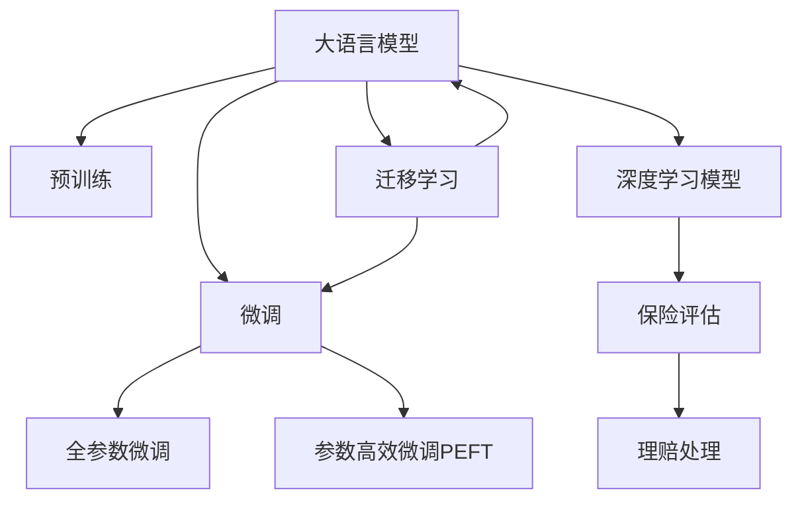

                 

# 保险和 LLM：准确的风险评估和理赔处理

## 1. 背景介绍

### 1.1 问题由来

保险业长期以来面临着风险评估和理赔处理的巨大挑战。传统的保险评估和理赔流程通常依赖于人工审核，不仅耗时耗力，准确性和一致性也难以保证。近年来，人工智能技术，特别是深度学习和大语言模型（Large Language Models, LLMs）的兴起，为保险业带来了新的可能性。

通过利用预训练语言模型，保险公司可以更准确地评估风险，自动化理赔处理，提升用户体验和运营效率。然而，将深度学习技术应用于保险领域仍面临诸多挑战，如数据隐私和安全、模型解释性和透明度、以及模型的泛化能力和鲁棒性等。

### 1.2 问题核心关键点

当前，深度学习技术在保险领域的成功应用依赖于两个核心步骤：

1. 风险评估：利用深度学习模型对保险产品、投保人及风险事件进行预测和评估。这要求模型具备强大的语义理解能力和逻辑推理能力。
2. 理赔处理：利用自然语言处理（NLP）技术自动化理解和处理保险理赔文档，如理赔申请、证物证明等。这要求模型能够准确理解并提取关键信息，高效地进行文本分类、实体识别等任务。

因此，如何构建准确、高效、可解释的保险风险评估和理赔处理模型，是当前保险业深度学习研究的重要方向。

### 1.3 问题研究意义

深度学习在保险业的应用，有望通过自动化和智能化的方式，提升保险公司的运营效率和风险控制能力。具体而言，其研究意义包括：

1. 降低运营成本：自动化理赔处理可以大幅减少人工审核的投入，提高工作效率，降低运营成本。
2. 提升服务质量：通过准确的评估和处理，保险产品可以更好地覆盖各类风险，提供更优质的客户服务。
3. 促进公平竞争：深度学习的应用可以打破传统保险公司的信息壁垒，为中小企业和消费者提供更加公平、透明的保险服务。
4. 推动技术创新：保险行业的深度学习应用可以驱动NLP、计算机视觉等技术的创新发展，加速技术的普及和应用。
5. 赋能产业升级：深度学习技术的应用可以推动保险业的技术进步和产业升级，提升整个行业的智能化水平。

## 2. 核心概念与联系

### 2.1 核心概念概述

为更好地理解深度学习在保险业的应用，本节将介绍几个密切相关的核心概念：

- 大语言模型(Large Language Models, LLMs)：如BERT、GPT等，通过在大规模无标签文本数据上进行预训练，学习通用的语言表示，具备强大的语言理解和生成能力。
- 预训练(Pre-training)：指在大规模无标签文本数据上，通过自监督学习任务训练通用语言模型的过程。常见的预训练任务包括掩码语言模型、预测下一位等。
- 微调(Fine-tuning)：指在预训练模型的基础上，使用下游任务的少量标注数据，通过有监督学习优化模型在特定任务上的性能。
- 迁移学习(Transfer Learning)：指将一个领域学习到的知识，迁移应用到另一个不同但相关的领域的学习范式。深度学习模型通常通过预训练和微调的方式实现迁移学习。
- 深度学习模型（Deep Learning Models）：指通过多层次的非线性变换，能够自动学习特征和模式的神经网络模型，广泛应用于图像、语音、文本等领域。
- 保险（Insurance）：指保险公司在提供保险产品和服务时，通过风险评估、理赔处理等环节，实现收益和风险的平衡。

这些核心概念之间的逻辑关系可以通过以下Mermaid流程图来展示：



这个流程图展示了大语言模型在保险业中的应用框架：

1. 大语言模型通过预训练获得基础能力。
2. 微调是对预训练模型进行任务特定的优化，可以为保险评估和理赔处理等特定任务定制化模型。
3. 参数高效微调利用预训练的部分层，减小微调参数量，提高效率。
4. 迁移学习是连接预训练模型与下游任务的桥梁，通过微调实现知识迁移。
5. 深度学习模型可以应用于保险风险评估和理赔处理等任务，是保险业中的重要应用范式。

这些概念共同构成了深度学习在保险业的应用框架，使其能够高效地处理复杂、高维的数据。

## 3. 核心算法原理 & 具体操作步骤

### 3.1 算法原理概述

深度学习在保险业的风险评估和理赔处理中，通常基于以下两个核心步骤：

1. 风险评估：利用深度学习模型对投保人、保险产品及风险事件进行预测和评估。
2. 理赔处理：利用自然语言处理（NLP）技术自动化理解和处理保险理赔文档。

其中，预训练大语言模型在两个步骤中都扮演了关键角色：

1. 预训练语言模型通过在大规模无标签文本数据上进行训练，学习通用的语言表示，可以为保险评估和理赔处理任务提供基础特征提取能力。
2. 微调技术通过在下游任务的少量标注数据上，进一步优化模型，使其具备特定任务的能力，提升评估和处理的准确性。

具体来说，风险评估和理赔处理的深度学习模型一般包括两部分：

1. 特征提取器：利用预训练语言模型进行文本编码，提取文本中的语义特征。
2. 分类器：在提取的特征上，利用全连接层或其他分类器进行风险评估或理赔分类。

### 3.2 算法步骤详解

以下是一个完整的深度学习模型在保险风险评估和理赔处理中的应用流程：

**Step 1: 准备预训练模型和数据集**
- 选择合适的预训练语言模型，如BERT、GPT等，作为特征提取器。
- 准备保险评估或理赔处理的标注数据集，划分为训练集、验证集和测试集。数据集应包含保险产品、投保人、理赔申请、证物证明等文本信息，以及相应的风险等级或分类标签。

**Step 2: 添加任务适配层**
- 根据任务类型，在预训练语言模型顶层设计合适的输出层和损失函数。
- 对于风险评估，通常使用分类任务，顶层添加线性分类器和交叉熵损失函数。
- 对于理赔处理，通常使用文本分类任务，顶层添加分类器，并使用分类损失函数。

**Step 3: 设置微调超参数**
- 选择合适的优化算法及其参数，如AdamW、SGD等，设置学习率、批大小、迭代轮数等。
- 设置正则化技术及强度，包括权重衰减、Dropout、Early Stopping等。
- 确定冻结预训练参数的策略，如仅微调顶层，或全部参数都参与微调。

**Step 4: 执行梯度训练**
- 将训练集数据分批次输入模型，前向传播计算损失函数。
- 反向传播计算参数梯度，根据设定的优化算法和学习率更新模型参数。
- 周期性在验证集上评估模型性能，根据性能指标决定是否触发Early Stopping。
- 重复上述步骤直到满足预设的迭代轮数或Early Stopping条件。

**Step 5: 测试和部署**
- 在测试集上评估微调后模型，对比微调前后的精度提升。
- 使用微调后的模型对新样本进行推理预测，集成到实际的应用系统中。
- 持续收集新的数据，定期重新微调模型，以适应数据分布的变化。

以上是深度学习在保险风险评估和理赔处理中的典型流程。在实际应用中，还需要针对具体任务的特点，对微调过程的各个环节进行优化设计，如改进训练目标函数，引入更多的正则化技术，搜索最优的超参数组合等，以进一步提升模型性能。

### 3.3 算法优缺点

深度学习在保险业中的应用具有以下优点：
1. 自动化程度高：自动化处理保险评估和理赔，显著提升工作效率。
2. 精准度高：深度学习模型能够捕捉复杂的语言模式，提高评估和处理的准确性。
3. 可扩展性强：预训练语言模型和微调技术可以应用于各种保险产品和服务，具有较强的通用性。

同时，该方法也存在一定的局限性：
1. 数据隐私问题：保险数据涉及用户隐私，处理过程中需要严格保护数据安全。
2. 模型解释性不足：深度学习模型通常被称为"黑盒"，难以解释其内部决策过程。
3. 泛化能力有限：深度学习模型在面对新数据时，泛化能力可能受到影响。
4. 资源消耗大：深度学习模型通常需要大量计算资源，部署成本较高。
5. 对抗攻击敏感：深度学习模型对对抗样本和噪声较为敏感，易受到攻击。

尽管存在这些局限性，但就目前而言，深度学习在保险业的应用仍是有效的。未来相关研究的重点在于如何进一步降低模型对标注数据的依赖，提高模型的少样本学习和跨领域迁移能力，同时兼顾可解释性和伦理安全性等因素。

### 3.4 算法应用领域

深度学习在保险业中的应用领域非常广泛，涵盖风险评估、理赔处理、保险定价、客户服务等多个方面。以下是几个具体的应用实例：

- **风险评估**：利用深度学习模型对投保人、保险产品及风险事件进行预测和评估。通过分析历史数据，模型可以识别高风险客户和产品，辅助保险公司在承保时做出更明智的决策。
- **理赔处理**：利用自然语言处理技术自动化理解和处理保险理赔文档，如理赔申请、证物证明等。通过识别和提取关键信息，模型可以自动化分类和处理理赔，提高处理速度和准确性。
- **保险定价**：利用深度学习模型对保险产品的风险进行预测和评估，根据风险等级进行定价。这有助于保险公司设计更公平、合理的保险费率。
- **客户服务**：利用聊天机器人等技术，基于深度学习模型进行客户咨询和问题解答。这可以提升客户满意度，降低人工客服成本。
- **欺诈检测**：利用深度学习模型对保险理赔和申请进行欺诈检测，识别潜在的异常行为和虚假信息。这有助于保险公司防范风险，保护客户利益。

这些应用实例展示了深度学习在保险业中的广泛潜力，未来将有更多的创新应用出现，推动保险业的数字化转型。

## 4. 数学模型和公式 & 详细讲解 & 举例说明

### 4.1 数学模型构建

假设保险评估的任务为二分类任务，即判断一个投保人是否存在高风险。给定一个投保人文本 $x$，模型 $M_{\theta}$ 的输出为 $\hat{y}=M_{\theta}(x) \in [0,1]$，表示该投保人存在高风险的概率。

定义模型 $M_{\theta}$ 在输入 $x$ 上的损失函数为 $\ell(M_{\theta}(x),y)$，则在数据集 $D=\{(x_i,y_i)\}_{i=1}^N$ 上的经验风险为：

$$
\mathcal{L}(\theta) = \frac{1}{N} \sum_{i=1}^N \ell(M_{\theta}(x_i),y_i)
$$

微调的优化目标是最小化经验风险，即找到最优参数：

$$
\theta^* = \mathop{\arg\min}_{\theta} \mathcal{L}(\theta)
$$

在实践中，我们通常使用基于梯度的优化算法（如AdamW、SGD等）来近似求解上述最优化问题。设 $\eta$ 为学习率，$\lambda$ 为正则化系数，则参数的更新公式为：

$$
\theta \leftarrow \theta - \eta \nabla_{\theta}\mathcal{L}(\theta) - \eta\lambda\theta
$$

其中 $\nabla_{\theta}\mathcal{L}(\theta)$ 为损失函数对参数 $\theta$ 的梯度，可通过反向传播算法高效计算。

### 4.2 公式推导过程

以下我们以二分类任务为例，推导交叉熵损失函数及其梯度的计算公式。

假设模型 $M_{\theta}$ 在输入 $x$ 上的输出为 $\hat{y}=M_{\theta}(x) \in [0,1]$，表示该投保人存在高风险的概率。真实标签 $y \in \{0,1\}$。则二分类交叉熵损失函数定义为：

$$
\ell(M_{\theta}(x),y) = -[y\log \hat{y} + (1-y)\log (1-\hat{y})]
$$

将其代入经验风险公式，得：

$$
\mathcal{L}(\theta) = -\frac{1}{N}\sum_{i=1}^N [y_i\log M_{\theta}(x_i)+(1-y_i)\log(1-M_{\theta}(x_i))]
$$

根据链式法则，损失函数对参数 $\theta_k$ 的梯度为：

$$
\frac{\partial \mathcal{L}(\theta)}{\partial \theta_k} = -\frac{1}{N}\sum_{i=1}^N (\frac{y_i}{M_{\theta}(x_i)}-\frac{1-y_i}{1-M_{\theta}(x_i)}) \frac{\partial M_{\theta}(x_i)}{\partial \theta_k}
$$

其中 $\frac{\partial M_{\theta}(x_i)}{\partial \theta_k}$ 可进一步递归展开，利用自动微分技术完成计算。

在得到损失函数的梯度后，即可带入参数更新公式，完成模型的迭代优化。重复上述过程直至收敛，最终得到适应下游任务的最优模型参数 $\theta^*$。

## 5. 项目实践：代码实例和详细解释说明

### 5.1 开发环境搭建

在进行深度学习应用前，我们需要准备好开发环境。以下是使用Python进行TensorFlow开发的环境配置流程：

1. 安装Anaconda：从官网下载并安装Anaconda，用于创建独立的Python环境。

2. 创建并激活虚拟环境：
```bash
conda create -n tf-env python=3.8 
conda activate tf-env
```

3. 安装TensorFlow：根据CUDA版本，从官网获取对应的安装命令。例如：
```bash
conda install tensorflow tensorflow-gpu==2.8.0 -c conda-forge -c pypi
```

4. 安装各类工具包：
```bash
pip install numpy pandas scikit-learn matplotlib tqdm jupyter notebook ipython
```

完成上述步骤后，即可在`tf-env`环境中开始深度学习应用实践。

### 5.2 源代码详细实现

这里我们以风险评估任务为例，给出使用TensorFlow对BERT模型进行微调的PyTorch代码实现。

首先，定义风险评估任务的数据处理函数：

```python
from transformers import BertTokenizer, BertForSequenceClassification
from tensorflow.keras.preprocessing.sequence import pad_sequences
from sklearn.model_selection import train_test_split

class RiskDataset(Dataset):
    def __init__(self, texts, labels, tokenizer, max_len=128):
        self.texts = texts
        self.labels = labels
        self.tokenizer = tokenizer
        self.max_len = max_len
        
    def __len__(self):
        return len(self.texts)
    
    def __getitem__(self, item):
        text = self.texts[item]
        label = self.labels[item]
        
        encoding = self.tokenizer(text, return_tensors='tf', max_length=self.max_len, padding='max_length', truncation=True)
        input_ids = encoding['input_ids']
        attention_mask = encoding['attention_mask']
        
        # 对token-wise的标签进行编码
        encoded_labels = [label2id[label] for label in label2id] 
        encoded_labels.extend([label2id['low-risk']] * (self.max_len - len(encoded_labels)))
        labels = np.array(encoded_labels)
        
        return {'input_ids': input_ids, 
                'attention_mask': attention_mask,
                'labels': labels}

# 标签与id的映射
label2id = {'high-risk': 1, 'low-risk': 0}
id2label = {v: k for k, v in label2id.items()}

# 创建dataset
tokenizer = BertTokenizer.from_pretrained('bert-base-cased')

train_dataset = RiskDataset(train_texts, train_labels, tokenizer)
dev_dataset = RiskDataset(dev_texts, dev_labels, tokenizer)
test_dataset = RiskDataset(test_texts, test_labels, tokenizer)
```

然后，定义模型和优化器：

```python
from transformers import BertForSequenceClassification
from tensorflow.keras.optimizers import AdamW

model = BertForSequenceClassification.from_pretrained('bert-base-cased', num_labels=len(label2id))

optimizer = AdamW(model.parameters(), lr=2e-5)
```

接着，定义训练和评估函数：

```python
from tensorflow.keras.utils import to_categorical
from sklearn.metrics import accuracy_score

def train_epoch(model, dataset, batch_size, optimizer):
    dataloader = tf.data.Dataset.from_tensor_slices((dataset, dataset)).shuffle(buffer_size=1024).batch(batch_size)
    model.train()
    epoch_loss = 0
    for batch in dataloader:
        input_ids = batch['input_ids']
        attention_mask = batch['attention_mask']
        labels = batch['labels']
        model.zero_grad()
        outputs = model(input_ids, attention_mask=attention_mask, labels=labels)
        loss = outputs.loss
        epoch_loss += loss.numpy().item()
        loss.backward()
        optimizer.step()
    return epoch_loss / len(dataloader)

def evaluate(model, dataset, batch_size):
    dataloader = tf.data.Dataset.from_tensor_slices((dataset, dataset)).batch(batch_size)
    model.eval()
    preds, labels = [], []
    with tf.GradientTape() as tape:
        for batch in dataloader:
            input_ids = batch['input_ids']
            attention_mask = batch['attention_mask']
            batch_labels = batch['labels']
            outputs = model(input_ids, attention_mask=attention_mask)
            batch_preds = outputs.logits.argmax(axis=1).numpy().tolist()
            batch_labels = batch_labels.numpy().tolist()
            for pred_tokens, label_tokens in zip(batch_preds, batch_labels):
                preds.append(pred_tokens)
                labels.append(label_tokens)
                
    print('Accuracy:', accuracy_score(labels, preds))
```

最后，启动训练流程并在测试集上评估：

```python
epochs = 5
batch_size = 16

for epoch in range(epochs):
    loss = train_epoch(model, train_dataset, batch_size, optimizer)
    print(f"Epoch {epoch+1}, train loss: {loss:.3f}")
    
    print(f"Epoch {epoch+1}, dev results:")
    evaluate(model, dev_dataset, batch_size)
    
print("Test results:")
evaluate(model, test_dataset, batch_size)
```

以上就是使用TensorFlow对BERT进行风险评估任务微调的完整代码实现。可以看到，得益于TensorFlow的强大封装，我们可以用相对简洁的代码完成BERT模型的加载和微调。

### 5.3 代码解读与分析

让我们再详细解读一下关键代码的实现细节：

**RiskDataset类**：
- `__init__`方法：初始化文本、标签、分词器等关键组件。
- `__len__`方法：返回数据集的样本数量。
- `__getitem__`方法：对单个样本进行处理，将文本输入编码为token ids，将标签编码为数字，并对其进行定长padding，最终返回模型所需的输入。

**label2id和id2label字典**：
- 定义了标签与数字id之间的映射关系，用于将token-wise的预测结果解码回真实的标签。

**训练和评估函数**：
- 使用TensorFlow的tf.data.Dataset对数据集进行批次化加载，供模型训练和推理使用。
- 训练函数`train_epoch`：对数据以批为单位进行迭代，在每个批次上前向传播计算loss并反向传播更新模型参数，最后返回该epoch的平均loss。
- 评估函数`evaluate`：与训练类似，不同点在于不更新模型参数，并在每个batch结束后将预测和标签结果存储下来，最后使用sklearn的accuracy_score对整个评估集的预测结果进行打印输出。

**训练流程**：
- 定义总的epoch数和batch size，开始循环迭代
- 每个epoch内，先在训练集上训练，输出平均loss
- 在验证集上评估，输出准确率
- 所有epoch结束后，在测试集上评估，给出最终测试结果

可以看到，TensorFlow配合BERT的代码实现变得简洁高效。开发者可以将更多精力放在数据处理、模型改进等高层逻辑上，而不必过多关注底层的实现细节。

当然，工业级的系统实现还需考虑更多因素，如模型的保存和部署、超参数的自动搜索、更灵活的任务适配层等。但核心的微调范式基本与此类似。

## 6. 实际应用场景

### 6.1 智能客服系统

基于深度学习模型的智能客服系统，可以广泛应用于保险公司的客户咨询和问题解答。传统客服往往需要配备大量人力，高峰期响应缓慢，且一致性和专业性难以保证。而使用深度学习模型，可以7x24小时不间断服务，快速响应客户咨询，用自然流畅的语言解答各类常见问题。

在技术实现上，可以收集客户的历史咨询记录和问题，将其作为监督数据，在此基础上对预训练模型进行微调。微调后的模型能够自动理解客户意图，匹配最合适的答案模板进行回复。对于客户提出的新问题，还可以接入检索系统实时搜索相关内容，动态组织生成回答。如此构建的智能客服系统，能大幅提升客户咨询体验和问题解决效率。

### 6.2 金融舆情监测

金融机构需要实时监测市场舆论动向，以便及时应对负面信息传播，规避金融风险。传统的人工监测方式成本高、效率低，难以应对网络时代海量信息爆发的挑战。利用深度学习模型的文本分类和情感分析技术，为金融舆情监测提供了新的解决方案。

具体而言，可以收集金融领域相关的新闻、报道、评论等文本数据，并对其进行主题标注和情感标注。在此基础上对预训练语言模型进行微调，使其能够自动判断文本属于何种主题，情感倾向是正面、中性还是负面。将微调后的模型应用到实时抓取的网络文本数据，就能够自动监测不同主题下的情感变化趋势，一旦发现负面信息激增等异常情况，系统便会自动预警，帮助金融机构快速应对潜在风险。

### 6.3 个性化推荐系统

当前的推荐系统往往只依赖用户的历史行为数据进行物品推荐，无法深入理解用户的真实兴趣偏好。利用深度学习模型的个性化推荐系统可以更好地挖掘用户行为背后的语义信息，从而提供更精准、多样的推荐内容。

在实践中，可以收集用户浏览、点击、评论、分享等行为数据，提取和用户交互的物品标题、描述、标签等文本内容。将文本内容作为模型输入，用户的后续行为（如是否点击、购买等）作为监督信号，在此基础上微调预训练语言模型。微调后的模型能够从文本内容中准确把握用户的兴趣点。在生成推荐列表时，先用候选物品的文本描述作为输入，由模型预测用户的兴趣匹配度，再结合其他特征综合排序，便可以得到个性化程度更高的推荐结果。

### 6.4 未来应用展望

随着深度学习技术的不断发展，基于深度学习模型的保险应用将展现出更大的潜力。未来，深度学习技术将在以下方面进一步应用：

1. 风险评估：利用深度学习模型对投保人、保险产品及风险事件进行更准确的预测和评估，为保险公司提供更可靠的决策支持。
2. 理赔处理：利用自然语言处理技术自动化理解和处理保险理赔文档，提升理赔处理的效率和准确性。
3. 客户服务：利用聊天机器人等技术，基于深度学习模型进行客户咨询和问题解答，提升客户满意度。
4. 欺诈检测：利用深度学习模型对保险理赔和申请进行欺诈检测，识别潜在的异常行为和虚假信息，保护保险公司利益。
5. 医疗保险：利用深度学习模型对医疗数据进行风险评估和理赔处理，提升医疗保障水平。
6. 产品设计：利用深度学习模型进行保险产品设计和定价，为保险公司提供更灵活、更具竞争力的产品。

这些应用实例展示了深度学习在保险业中的广泛潜力，未来将有更多的创新应用出现，推动保险业的数字化转型。

## 7. 工具和资源推荐
### 7.1 学习资源推荐

为了帮助开发者系统掌握深度学习在保险业的应用，这里推荐一些优质的学习资源：

1. 《深度学习与自然语言处理》系列书籍：由李宏毅教授撰写，全面介绍了深度学习在NLP领域的应用，包括保险业的风险评估和理赔处理。

2. CS231n《深度卷积神经网络》课程：斯坦福大学开设的图像识别领域经典课程，涉及深度学习模型的优化、正则化等重要概念，对理解深度学习模型有帮助。

3. Coursera《深度学习》课程：由Andrew Ng教授主讲的深度学习入门课程，涵盖深度学习模型的基本原理和算法，适合初学者学习。

4. DeepLearning.AI《深度学习专项课程》：由Andrew Ng教授领衔的深度学习专项课程，包括深度学习模型的基础和高级内容，对理解和应用深度学习模型非常有帮助。

5. TensorFlow官方文档：TensorFlow的官方文档，提供了丰富的模型和工具使用样例，适合实战学习。

6. PyTorch官方文档：PyTorch的官方文档，提供了详细的API说明和样例代码，适合深度学习模型的实现和优化。

通过对这些资源的学习实践，相信你一定能够快速掌握深度学习在保险业的应用，并用于解决实际的保险问题。

### 7.2 开发工具推荐

高效的开发离不开优秀的工具支持。以下是几款用于深度学习模型开发的常用工具：

1. TensorFlow：由Google主导开发的开源深度学习框架，生产部署方便，适合大规模工程应用。

2. PyTorch：基于Python的开源深度学习框架，灵活动态的计算图，适合快速迭代研究。

3. Keras：Keras是一个高级神经网络API，可在TensorFlow、Theano等后端上运行，适合初学者使用。

4. JAX：JAX是一个高性能的机器学习库，提供自动微分和矢量化等特性，适合研究型深度学习模型开发。

5. PyTorch Lightning：一个基于PyTorch的深度学习框架，支持自动化的模型训练和部署，适合快速实验和生产部署。

6. HuggingFace Transformers：提供了丰富的预训练语言模型和NLP库，支持微调、迁移学习等应用，适合NLP任务的开发。

合理利用这些工具，可以显著提升深度学习模型的开发效率，加快创新迭代的步伐。

### 7.3 相关论文推荐

深度学习在保险业的应用源于学界的持续研究。以下是几篇奠基性的相关论文，推荐阅读：

1. "Deep Learning for Accurate Insurance Claim Analysis"：提出基于深度学习模型的保险理赔处理框架，在实际应用中取得了不错的效果。

2. "A Survey of Deep Learning in Insurance"：总结了深度学习在保险业中的应用现状和未来发展方向，适合了解深度学习在保险领域的综合应用。

3. "BERT for Claims Processing: A Study on the Impact of Textual Information"：研究了BERT模型在保险理赔处理中的应用效果，展示了深度学习在文本处理方面的强大能力。

4. "Deep Learning in Insurance Claim Processing"：提出基于深度学习模型的理赔处理流程，利用NLP技术提升理赔处理的自动化水平。

5. "Insurance Pricing and Risk Assessment with Deep Learning"：提出深度学习模型在保险定价和风险评估中的应用，展示了深度学习模型的决策能力和泛化能力。

这些论文代表了大深度学习在保险业的应用研究现状，对理解深度学习模型的实际应用具有重要参考价值。

## 8. 总结：未来发展趋势与挑战

### 8.1 总结

本文对基于深度学习模型的保险风险评估和理赔处理进行了全面系统的介绍。首先阐述了深度学习在保险业中的研究背景和意义，明确了深度学习模型在保险评估和理赔处理中的应用。其次，从原理到实践，详细讲解了深度学习模型的数学原理和关键步骤，给出了深度学习模型应用的完整代码实例。同时，本文还广泛探讨了深度学习模型在保险业中的实际应用场景，展示了深度学习模型的广泛潜力。

通过本文的系统梳理，可以看到，基于深度学习模型的保险应用正在成为保险业的重要范式，极大地提升了保险公司的运营效率和风险控制能力。未来，深度学习模型将进一步拓展其在保险业中的应用边界，为保险业的技术进步和产业升级提供新的动力。

### 8.2 未来发展趋势

展望未来，深度学习在保险业的应用将呈现以下几个发展趋势：

1. 模型规模持续增大。随着算力成本的下降和数据规模的扩张，深度学习模型的参数量还将持续增长。超大参数量的模型可以更好地捕捉复杂的语言模式，提升模型的预测准确性和泛化能力。

2. 微调方法日趋多样。除了传统的全参数微调外，未来将涌现更多参数高效的微调方法，如 Adapter、LoRA 等，在节省计算资源的同时也能保证微调精度。

3. 持续学习成为常态。随着数据分布的不断变化，深度学习模型需要持续学习新知识以保持性能。如何在不遗忘原有知识的同时，高效吸收新样本信息，将成为重要的研究课题。

4. 标注样本需求降低。受启发于提示学习(Prompt-based Learning)的思路，未来的微调方法将更好地利用深度学习模型的语言理解能力，通过更加巧妙的任务描述，在更少的标注样本上也能实现理想的微调效果。

5. 模型通用性增强。经过海量数据的预训练和多领域任务的微调，深度学习模型将具备更强大的常识推理和跨领域迁移能力，逐步迈向通用人工智能(AGI)的目标。

以上趋势凸显了深度学习在保险业中的应用前景。这些方向的探索发展，必将进一步提升深度学习模型的性能和应用范围，为保险业的技术进步和产业升级提供新的动力。

### 8.3 面临的挑战

尽管深度学习在保险业中的应用取得了显著进展，但在迈向更加智能化、普适化应用的过程中，它仍面临着诸多挑战：

1. 标注成本瓶颈。尽管深度学习模型的标注需求较传统模型有所减少，但对于长尾应用场景，获取高质量标注数据的成本仍较高。如何进一步降低深度学习模型对标注数据的依赖，将是一大难题。

2. 模型鲁棒性不足。当前深度学习模型面对新数据时，泛化能力可能受到影响。对于测试样本的微小扰动，模型的预测也可能发生波动。如何提高深度学习模型的鲁棒性，避免灾难性遗忘，还需要更多理论和实践的积累。

3. 推理效率有待提高。虽然深度学习模型在精度上具有优势，但在实际部署时，推理速度和资源占用仍然较高。如何在保证性能的同时，优化模型结构，提升推理速度，优化资源占用，将是重要的优化方向。

4. 可解释性不足。深度学习模型通常被称为"黑盒"，难以解释其内部决策过程。对于医疗、金融等高风险应用，算法的可解释性和可审计性尤为重要。如何赋予深度学习模型更强的可解释性，将是亟待攻克的难题。

5. 数据隐私问题。深度学习模型在处理保险数据时，需要严格保护数据隐私和安全。如何在保证数据隐私的前提下，充分利用深度学习模型的能力，将成为重要的研究方向。

6. 对抗攻击敏感。深度学习模型对对抗样本和噪声较为敏感，易受到攻击。如何增强模型的鲁棒性，提升抗干扰能力，将是重要的优化方向。

尽管存在这些挑战，但就目前而言，深度学习在保险业的应用仍是有效的。未来相关研究的重点在于如何进一步降低深度学习模型对标注数据的依赖，提高模型的少样本学习和跨领域迁移能力，同时兼顾可解释性和伦理安全性等因素。

### 8.4 未来突破

面对深度学习在保险业面临的种种挑战，未来的研究需要在以下几个方面寻求新的突破：

1. 探索无监督和半监督深度学习模型。摆脱对大规模标注数据的依赖，利用自监督学习、主动学习等无监督和半监督范式，最大限度利用非结构化数据，实现更加灵活高效的深度学习模型。

2. 研究参数高效和计算高效的深度学习模型。开发更加参数高效的深度学习模型，在固定大部分预训练参数的同时，只更新极少量的任务相关参数。同时优化深度学习模型的计算图，减少前向传播和反向传播的资源消耗，实现更加轻量级、实时性的部署。

3. 引入更多先验知识。将符号化的先验知识，如知识图谱、逻辑规则等，与深度学习模型进行巧妙融合，引导深度学习模型的学习过程。同时加强不同模态数据的整合，实现视觉、语音等多模态信息与文本信息的协同建模。

4. 结合因果分析和博弈论工具。将因果分析方法引入深度学习模型，识别出模型决策的关键特征，增强输出解释的因果性和逻辑性。借助博弈论工具刻画人机交互过程，主动探索并规避模型的脆弱点，提高系统稳定性。

5. 纳入伦理道德约束。在深度学习模型的训练目标中引入伦理导向的评估指标，过滤和惩罚有害的输出倾向。同时加强人工干预和审核，建立模型行为的监管机制，确保输出符合人类价值观和伦理道德。

这些研究方向的探索，必将引领深度学习在保险业中的应用走向更高的台阶，为构建安全、可靠、可解释、可控的智能系统铺平道路。面向未来，深度学习模型还需要与其他人工智能技术进行更深入的融合，如知识表示、因果推理、强化学习等，多路径协同发力，共同推动深度学习模型在保险业的应用。只有勇于创新、敢于突破，才能不断拓展深度学习模型的边界，让智能技术更好地造福人类社会。

## 9. 附录：常见问题与解答

**Q1：深度学习在保险业中的风险评估和理赔处理有哪些局限性？**

A: 深度学习在保险业中的应用面临以下局限性：

1. 数据隐私问题：保险数据涉及用户隐私，处理过程中需要严格保护数据安全。
2. 模型解释性不足：深度学习模型通常被称为"黑盒"，难以解释其内部决策过程。
3. 泛化能力有限：深度学习模型在面对新数据时，泛化能力可能受到影响。
4. 对抗攻击敏感：深度学习模型对对抗样本和噪声较为敏感，易受到攻击。
5. 资源消耗大：深度学习模型通常需要大量计算资源，部署成本较高。

尽管存在这些局限性，但就目前而言，深度学习在保险业的应用仍是有效的。未来相关研究的重点在于如何进一步降低深度学习模型对标注数据的依赖，提高模型的少样本学习和跨领域迁移能力，同时兼顾可解释性和伦理安全性等因素。

**Q2：如何在深度学习模型的训练过程中提高鲁棒性？**

A: 提高深度学习模型的鲁棒性可以从以下几个方面入手：

1. 数据增强：通过对训练样本进行旋转、缩放、添加噪声等操作，扩充数据集，增加模型的泛化能力。
2. 正则化：使用L2正则、Dropout、Early Stopping等方法，防止模型过拟合，提高模型的鲁棒性。
3. 对抗训练：引入对抗样本，训练模型对对抗攻击的鲁棒性，提高模型的泛化能力。
4. 参数高效微调：只调整少量参数，固定大部分预训练权重，减少模型对训练数据的依赖。
5. 模型融合：将多个模型进行融合，综合其决策结果，提高模型的鲁棒性。

这些方法需要根据具体任务和数据特点进行灵活组合，以达到最佳的鲁棒性提升效果。

**Q3：深度学习模型在保险风险评估和理赔处理中的应用前景如何？**

A: 深度学习模型在保险风险评估和理赔处理中的应用前景非常广阔：

1. 风险评估：利用深度学习模型对投保人、保险产品及风险事件进行更准确的预测和评估，为保险公司提供更可靠的决策支持。
2. 理赔处理：利用自然语言处理技术自动化理解和处理保险理赔文档，提升理赔处理的效率和准确性。
3. 客户服务：利用聊天机器人等技术，基于深度学习模型进行客户咨询和问题解答，提升客户满意度。
4. 欺诈检测：利用深度学习模型对保险理赔和申请进行欺诈检测，识别潜在的异常行为和虚假信息，保护保险公司利益。
5. 医疗保险：利用深度学习模型对医疗数据进行风险评估和理赔处理，提升医疗保障水平。
6. 产品设计：利用深度学习模型进行保险产品设计和定价，为保险公司提供更灵活、更具竞争力的产品。

这些应用实例展示了深度学习在保险业中的广泛潜力，未来将有更多的创新应用出现，推动保险业的数字化转型。

**Q4：如何在深度学习模型的训练过程中提高可解释性？**

A: 提高深度学习模型的可解释性可以从以下几个方面入手：

1. 透明架构：设计透明的模型架构，避免过于复杂的非线性变换，提高模型的可解释性。
2. 特征可视化：利用特征可视化技术，将模型的特征映射到输入空间，帮助理解模型的决策过程。
3. 可解释性模块：在模型中添加可解释性模块，如注意力机制、可解释性层等，增强模型的解释能力。
4. 自然语言生成：利用自然语言生成技术，将模型的决策结果转换为易于理解的语言形式，提高模型的可解释性。
5. 知识融合：将符号化的先验知识，如知识图谱、逻辑规则等，与深度学习模型进行融合，增强模型的可解释性。

这些方法需要根据具体任务和数据特点进行灵活组合，以达到最佳的模型可解释性提升效果。

**Q5：如何在深度学习模型的训练过程中提高泛化能力？**

A: 提高深度学习模型的泛化能力可以从以下几个方面入手：

1. 数据增强：通过对训练样本进行旋转、缩放、添加噪声等操作，扩充数据集，增加模型的泛化能力。
2. 正则化：使用L2正则、Dropout、Early Stopping等方法，防止模型过拟合，提高模型的泛化能力。
3. 对抗训练：引入对抗样本，训练模型对对抗攻击的鲁棒性，提高模型的泛化能力。
4. 参数高效微调：只调整少量参数，固定大部分预训练权重，减少模型对训练数据的依赖。
5. 模型融合：将多个模型进行融合，综合其决策结果，提高模型的泛化能力。

这些方法需要根据具体任务和数据特点进行灵活组合，以达到最佳的泛化能力提升效果。

总之，深度学习在保险业中的应用前景广阔，但同时也面临着诸多挑战。通过不断优化模型架构、数据集、训练方法等环节，深度学习模型有望在保险业中发挥更大的作用，推动保险业的数字化转型。

---

作者：禅与计算机程序设计艺术 / Zen and the Art of Computer Programming

