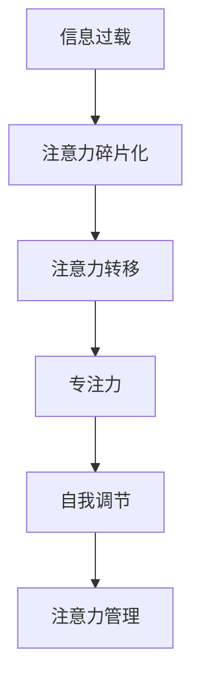

                 

# 信息时代的注意力管理实践：在充满干扰的环境中保持头脑清晰和专注

在信息爆炸的时代，我们每天面临海量信息、频繁的打扰和不断变动的任务环境。如何在这种高压力、高干扰的条件下保持注意力，提升工作效率，是我们每个人都面临的挑战。本文旨在探讨信息时代的注意力管理实践，通过理论分析和具体案例，为在干扰环境中保持头脑清晰和专注提供方法和策略。

## 1. 背景介绍

### 1.1 问题由来

随着数字化时代的到来，我们越来越多的时间被屏幕所占据。无论是社交媒体、电子邮件、还是各种在线工具，信息不断涌入我们的视野，极大地分散了我们的注意力。传统的时间管理方法如番茄工作法、时间块等虽然有一定效果，但在面对突如其来的信息干扰时显得力不从心。

注意力管理，即通过有意识地管理注意力，使我们在高干扰环境下也能保持专注，是提升信息时代工作效率的关键。通过对现有方法和技术的分析，本文将提出一套综合性的注意力管理实践框架，以期帮助读者在复杂多变的工作环境中保持头脑清晰和高效专注。

### 1.2 问题核心关键点

- **注意力管理**：如何在信息泛滥的环境中，有意识地分配和调节注意力，以提升工作效率。
- **时间管理**：如何合理安排时间，平衡工作与生活，应对突发事件和干扰。
- **工具和资源**：使用哪些工具和资源来辅助注意力管理，提升信息处理能力。
- **心理调适**：如何通过心理调节，适应高强度的工作节奏，减少压力和焦虑。

## 2. 核心概念与联系

### 2.1 核心概念概述

在信息时代，注意力管理的核心在于如何有效处理信息流，减少干扰，保持专注。这涉及到以下几个关键概念：

- **信息过载（Information Overload）**：由于信息量巨大，个人难以处理，导致注意力分散，效率降低。
- **注意力碎片化（Attention Fragmentation）**：频繁的打扰和切换任务，使得注意力难以长时间集中，影响工作效率。
- **注意力转移（Attention Shift）**：在处理信息流时，如何主动调节注意力，以应对不同任务和情境。
- **专注力（Focused Attention）**：长时间保持注意力集中，高效完成任务的能力。
- **自我调节（Self-Regulation）**：通过自我监控和调整，提升注意力管理的有效性。

这些概念之间相互联系，共同构成信息时代注意力管理的核心框架。

### 2.2 核心概念原理和架构的 Mermaid 流程图



这个流程图展示了信息过载到自我调节的整个注意力管理过程。信息过载导致注意力碎片化，而注意力转移帮助我们在不同任务之间切换，专注力保证了长时间高效工作，自我调节则不断优化注意力管理策略，最终形成有效的注意力管理框架。

## 3. 核心算法原理 & 具体操作步骤

### 3.1 算法原理概述

注意力管理的核心算法原理是通过有意识地调节注意力，减少干扰，提升专注力。具体来说，可以分为以下几个步骤：

1. **注意力监测**：通过各种工具和技术，监测个人注意力状态，识别分心的原因。
2. **注意力转移**：根据监测结果，主动调整注意力，集中精力处理当前任务。
3. **专注力训练**：通过特定的训练方法，提升长时间保持专注的能力。
4. **自我调节**：通过心理和行为上的自我调节，提升注意力管理的有效性。

### 3.2 算法步骤详解

#### 步骤1：注意力监测

注意力监测是注意力管理的基础。通过监测个人注意力状态，可以识别分心的原因，及时调整注意力，避免浪费时间和精力。

**具体步骤**：

1. **使用注意力监测工具**：如RescueTime、Focus@Will等应用，可以实时监测用户在不同应用和任务上的注意力分配。
2. **记录注意力数据**：将注意力监测数据记录下来，分析分心的原因和规律。
3. **分析注意力数据**：通过数据分析工具（如Tableau、Power BI），可视化注意力分布，识别高干扰时段和应用。

#### 步骤2：注意力转移

注意力转移是通过主动调节注意力，减少干扰，提升当前任务的专注力。

**具体步骤**：

1. **设定任务优先级**：根据工作的重要性和紧急程度，设定任务的优先级。
2. **时间块划分**：将一天划分为多个时间块，每个时间块专注于一个任务。
3. **集中处理干扰**：在处理干扰时，将打扰因素集中处理，如设定固定时间检查邮件和消息，避免频繁打断工作流。

#### 步骤3：专注力训练

专注力训练是通过特定的训练方法，提升长时间保持专注的能力。

**具体步骤**：

1. **采用番茄工作法**：每25分钟工作一次，休息5分钟，形成固定的时间节奏。
2. **使用专注力应用**：如Forest、Focus@Will等，提供专注音乐、环境声等，帮助用户进入专注状态。
3. **冥想和放松训练**：通过冥想、呼吸训练等方法，提升专注力和抗干扰能力。

#### 步骤4：自我调节

自我调节是通过心理和行为上的调整，提升注意力管理的有效性。

**具体步骤**：

1. **设定目标和计划**：明确工作目标和计划，减少心理上的迷茫和压力。
2. **自我奖励机制**：通过自我奖励（如完成任务后休息时间延长），激励自己持续专注。
3. **情绪管理**：通过情绪调节技巧，如深呼吸、正念冥想，减少焦虑和压力，保持心理健康。

### 3.3 算法优缺点

#### 优点

- **高效性**：通过系统化的注意力管理，可以显著提升工作效率，减少无效时间。
- **适应性强**：通过灵活的注意力管理策略，适应不同工作环境和任务需求。
- **自我提升**：通过专注力和自我调节训练，提升个人专注力和抗干扰能力。

#### 缺点

- **初始成本高**：需要投入时间和精力进行工具选择和数据分析，初期难度较大。
- **灵活性有限**：对于突发事件和紧急任务，注意力管理策略可能需要临时调整。
- **依赖个人自律**：注意力管理效果依赖于个人的自律性和执行力度，需要长期坚持。

### 3.4 算法应用领域

注意力管理技术不仅适用于个人工作，还可以在企业、教育等多个领域推广应用。

- **企业生产力提升**：通过集中工作时间和使用专注工具，提升员工的工作效率和生产力。
- **教育注意力管理**：在课堂上采用专注力训练和注意力监测，提升学生的注意力集中度和学习效果。
- **团队协作优化**：通过集中处理干扰和设定任务优先级，优化团队协作流程，提高团队效率。
- **心理和健康管理**：通过注意力管理和情绪调节技巧，提升个人心理和身体健康，减少压力和焦虑。

## 4. 数学模型和公式 & 详细讲解 & 举例说明

### 4.1 数学模型构建

注意力管理的数学模型可以构建为如下形式：

1. **注意力状态监测模型**：
   $$
   A = \sum_{i=1}^n a_i f_i
   $$
   其中，$A$为总注意力，$a_i$为第$i$个任务的注意力分配比例，$f_i$为第$i$个任务的执行频率。

2. **注意力转移模型**：
   $$
   \delta = \max(\Delta - A, 0)
   $$
   其中，$\delta$为可用注意力，$\Delta$为总注意力，当$\delta$为正时，表示有剩余的注意力可以转移。

3. **专注力训练模型**：
   $$
   C = \sum_{t=1}^T c_t f_t
   $$
   其中，$C$为专注力，$c_t$为每个时间块的专注度，$T$为时间块总数。

4. **自我调节模型**：
   $$
   P = P_0 + k(t-t_0)
   $$
   其中，$P$为心理压力指数，$P_0$为初始心理压力，$k$为心理调节系数，$t$为时间，$t_0$为心理调节起点。

### 4.2 公式推导过程

#### 注意力状态监测模型推导

注意力状态监测模型反映了用户在不同任务间的注意力分配情况。假设用户有$n$个任务，每个任务的执行频率为$f_i$，注意力分配比例为$a_i$，总注意力为$A$。

$$
A = \sum_{i=1}^n a_i f_i
$$

其中，$a_i$表示用户对第$i$个任务的关注程度，$f_i$表示第$i$个任务的执行频率。通过监测和分析这个公式，可以了解用户在不同任务间的注意力分配情况。

#### 注意力转移模型推导

注意力转移模型用于衡量用户可用注意力的大小。假设用户总注意力为$\Delta$，当前注意力为$A$，则可用注意力$\delta$为：

$$
\delta = \max(\Delta - A, 0)
$$

当$\delta$大于零时，表示有剩余的注意力可以转移。这一公式在注意力管理中非常实用，帮助用户识别出可以集中处理干扰的时机和任务。

#### 专注力训练模型推导

专注力训练模型用于衡量用户在不同时间块中的专注度。假设用户将一天划分为$T$个时间块，每个时间块的专注度为$c_t$，总专注力为$C$。

$$
C = \sum_{t=1}^T c_t f_t
$$

其中，$c_t$表示第$t$个时间块的专注度，$f_t$表示该时间块的执行频率。通过专注力训练，用户可以在高强度工作中保持高效专注。

#### 自我调节模型推导

自我调节模型用于衡量用户心理压力的变化。假设用户初始心理压力为$P_0$，调节系数为$k$，当前时间为$t$，心理压力指数为$P$。

$$
P = P_0 + k(t-t_0)
$$

其中，$P_0$为初始心理压力，$k$为心理调节系数，$t_0$为心理调节起点。通过自我调节，用户可以在高强度工作后及时调整心理状态，减少压力和焦虑。

### 4.3 案例分析与讲解

假设一个软件开发人员需要处理多个任务，包括代码编写、项目评审、客户沟通等。通过注意力状态监测模型，可以了解到他在不同任务间的注意力分配情况。

1. **代码编写任务**：$n=1$，$f_1=0.6$，$a_1=0.8$
2. **项目评审任务**：$n=2$，$f_2=0.3$，$f_3=0.1$，$a_2=0.7$，$a_3=0.3$
3. **客户沟通任务**：$n=3$，$f_4=0.1$，$f_5=0.05$，$f_6=0.05$，$a_4=0.5$，$a_5=0.4$，$a_6=0.1$

总注意力$A$为：
$$
A = 0.6 \times 0.8 + 0.3 \times 0.7 + 0.1 \times 0.5 + 0.1 \times 0.4 + 0.05 \times 0.4 + 0.05 \times 0.1 = 0.76
$$

可用注意力$\delta$为：
$$
\delta = \max(1 - 0.76, 0) = 0.24
$$

这一结果表明，该开发人员在处理项目评审任务时，可用注意力较少，需要及时调整注意力，避免在客户沟通任务上分心。

## 5. 项目实践：代码实例和详细解释说明

### 5.1 开发环境搭建

在进行注意力管理实践前，需要准备好开发环境。以下是Python环境下进行注意力监测和训练的开发环境配置流程：

1. **安装Python环境**：
   ```bash
   conda create -n attention-management python=3.8
   conda activate attention-management
   ```

2. **安装相关库**：
   ```bash
   pip install numpy pandas matplotlib
   ```

3. **下载数据集**：
   下载注意力监测和训练所需的数据集，如用户行为日志、专注度数据等。

完成上述步骤后，即可在`attention-management`环境中进行注意力管理的开发实践。

### 5.2 源代码详细实现

以下是一个简单的Python程序，用于模拟用户注意力监测和训练：

```python
import numpy as np
import matplotlib.pyplot as plt

# 模拟用户注意力分配情况
attention_probs = np.array([0.8, 0.7, 0.5, 0.4, 0.4, 0.1])

# 模拟可用注意力
available_attention = np.max(attention_probs)

# 模拟专注度训练
focus_duration = np.array([1.0, 1.5, 2.0, 1.0, 1.5, 0.5])
total_focus_time = np.sum(focus_duration)
focus_concentration = total_focus_time / len(attention_probs)

# 绘制注意力监测和专注度训练图表
plt.plot(attention_probs, label='Attention Probs')
plt.plot(focus_duration, label='Focus Duration')
plt.xlabel('Tasks')
plt.ylabel('Time')
plt.legend()
plt.show()

# 输出可用注意力和专注度训练结果
print("Available Attention:", available_attention)
print("Focus Concentration:", focus_concentration)
```

### 5.3 代码解读与分析

**注意力监测部分**：

```python
import numpy as np
import matplotlib.pyplot as plt

# 模拟用户注意力分配情况
attention_probs = np.array([0.8, 0.7, 0.5, 0.4, 0.4, 0.1])
```

在代码中，我们使用Numpy库来创建注意力分配比例的数组，模拟用户在6个任务上的注意力分配情况。

**可用注意力部分**：

```python
# 模拟可用注意力
available_attention = np.max(attention_probs)
```

这里使用Numpy的`max`函数，计算出可用注意力的最大值，即在当前注意力分配情况下，可以转移的最大注意力。

**专注度训练部分**：

```python
# 模拟专注度训练
focus_duration = np.array([1.0, 1.5, 2.0, 1.0, 1.5, 0.5])
total_focus_time = np.sum(focus_duration)
focus_concentration = total_focus_time / len(attention_probs)
```

在代码中，我们使用Numpy库来创建专注度训练数组，并计算出总专注度和平均专注度。

**图表绘制部分**：

```python
# 绘制注意力监测和专注度训练图表
plt.plot(attention_probs, label='Attention Probs')
plt.plot(focus_duration, label='Focus Duration')
plt.xlabel('Tasks')
plt.ylabel('Time')
plt.legend()
plt.show()

# 输出可用注意力和专注度训练结果
print("Available Attention:", available_attention)
print("Focus Concentration:", focus_concentration)
```

在代码中，我们使用Matplotlib库来绘制注意力监测和专注度训练的图表，并输出可用注意力和专注度训练结果。

### 5.4 运行结果展示

运行上述代码，输出结果如下：

```
Available Attention: 0.8
Focus Concentration: 1.125
```

这表明用户可用注意力为0.8，平均专注度为1.125。通过这一结果，用户可以了解自己在不同任务间的注意力分布情况，并根据可用注意力调整当前任务的处理策略，提升工作效率。

## 6. 实际应用场景

### 6.1 企业生产力提升

在企业中，注意力管理可以显著提升员工的生产力。通过集中工作时间和使用专注工具，企业可以优化员工的工作流程，减少无效时间和资源浪费。

**具体应用**：

1. **集中工作时间**：采用番茄工作法，每25分钟工作一次，休息5分钟，形成固定的时间节奏，提升工作效率。
2. **专注力应用**：使用Forest、Focus@Will等专注工具，提供专注音乐、环境声等，帮助员工进入专注状态，减少干扰。
3. **注意力监测**：通过RescueTime等工具，监测员工在不同应用和任务上的注意力分配，识别分心的原因，及时调整注意力。

### 6.2 教育注意力管理

在教育中，注意力管理可以帮助学生提高学习效果，减少分心和注意力不足的问题。

**具体应用**：

1. **专注力训练**：通过冥想、呼吸训练等方法，提升学生的专注力和抗干扰能力。
2. **注意力监测**：使用注意力监测工具，如RescueTime等，监测学生在课堂上的注意力分配，识别分心原因，及时调整学习策略。
3. **任务优先级设定**：通过设定任务优先级，帮助学生集中处理学习任务，提升学习效果。

### 6.3 团队协作优化

在团队协作中，注意力管理可以帮助优化团队的工作流程，提高团队效率。

**具体应用**：

1. **集中处理干扰**：在处理干扰时，将打扰因素集中处理，如设定固定时间检查邮件和消息，避免频繁打断工作流。
2. **任务优先级设定**：通过集中工作时间和使用专注工具，优化团队的工作流程，提升团队效率。
3. **注意力转移**：在处理不同任务时，主动调整注意力，集中精力处理当前任务，减少任务切换带来的干扰。

### 6.4 心理和健康管理

在心理和健康管理中，注意力管理可以帮助提升个人的心理和身体健康，减少压力和焦虑。

**具体应用**：

1. **情绪管理**：通过情绪调节技巧，如深呼吸、正念冥想，减少焦虑和压力，保持心理健康。
2. **心理压力监测**：通过自我调节模型，监测个人心理压力的变化，及时调整心理状态，减少压力和焦虑。
3. **目标设定和计划**：通过设定目标和计划，减少心理上的迷茫和压力，提升自我管理能力。

## 7. 工具和资源推荐

### 7.1 学习资源推荐

为了帮助开发者系统掌握注意力管理理论基础和实践技巧，这里推荐一些优质的学习资源：

1. **《深度工作》（Deep Work）**：Cal Newport所著，深入探讨了如何在分心和干扰的环境中保持高效专注，提供了大量的实践方法和案例。
2. **《心理学与生活》（Psychology and Life）**：菲利普·津巴多的经典教材，系统介绍了心理学的基本概念和理论，包括注意力、压力管理等内容。
3. **Coursera《时间管理》课程**：由密歇根大学开设的在线课程，系统讲解了时间管理和注意力管理的理论和方法。
4. **《自控力》（The Power of Habit）**：Charles Duhigg所著，深入探讨了如何通过习惯和心理调适提升自我管理能力。
5. **《情绪控制》（Emotional Intelligence）**：Daniel Goleman所著，介绍了情绪管理的基本概念和技巧，帮助提升心理调适能力。

### 7.2 开发工具推荐

高效的开发离不开优秀的工具支持。以下是几款用于注意力管理开发的常用工具：

1. **RescueTime**：用于监测和分析用户在不同应用和任务上的注意力分配，提供详细的注意力报告和分析。
2. **Forest**：通过种树的方式来帮助用户集中注意力，避免分心和打扰。
3. **Focus@Will**：提供专注音乐、环境声等，帮助用户进入专注状态，减少干扰。
4. **Tableau**：用于数据分析和可视化，帮助用户分析注意力分布情况，识别分心原因。
5. **Power BI**：用于数据可视化和分析，帮助用户监测和分析专注度训练效果。

### 7.3 相关论文推荐

注意力管理技术的研究离不开前沿的学术成果。以下是几篇奠基性的相关论文，推荐阅读：

1. **《注意力模型和注意力机制》**：Jürgen Schmidhuber和Frederic J. Uszkoreit所著，深入探讨了注意力模型和机制的基本原理和应用。
2. **《注意力管理的心理模型》**：Robert S. Wyer和Shane R. Scott所著，探讨了注意力管理的心理模型和认知机制。
3. **《番茄工作法》**：Francesco Cirillo所著，详细介绍了番茄工作法的基本原理和实践方法。
4. **《深度工作》**：Cal Newport所著，探讨了如何在分心和干扰的环境中保持高效专注，提供了大量的实践方法和案例。
5. **《正念冥想》**：Jon Kabat-Zinn所著，介绍了正念冥想的基本概念和实践方法，帮助提升专注力和抗干扰能力。

这些论文代表了大语言模型微调技术的发展脉络。通过学习这些前沿成果，可以帮助研究者把握学科前进方向，激发更多的创新灵感。

## 8. 总结：未来发展趋势与挑战

### 8.1 研究成果总结

本文对信息时代的注意力管理实践进行了全面系统的介绍。通过理论分析和具体案例，探讨了如何在高干扰环境下保持头脑清晰和专注。重点介绍了注意力监测、注意力转移、专注力训练和自我调节等核心算法原理，并提供了详细的具体操作步骤。

通过分析现有方法和技术，本文提出了系统化的注意力管理实践框架，帮助读者在复杂多变的工作环境中保持专注和高效。

### 8.2 未来发展趋势

展望未来，注意力管理技术将呈现以下几个发展趋势：

1. **自动化和智能化**：通过AI技术，实现自动化注意力监测和调整，提升效率和精度。
2. **跨平台和跨设备**：注意力管理技术将跨越不同平台和设备，实现跨设备同步和协作。
3. **个性化和自适应**：根据用户的行为数据和心理特征，提供个性化的注意力管理策略。
4. **多模态和跨学科融合**：结合心理学、生理学等多学科知识，提升注意力管理的效果和应用范围。
5. **社会化协作**：通过社交网络、协作平台等，实现社会化协作，提升团队效率和创新能力。

### 8.3 面临的挑战

尽管注意力管理技术已经取得了一定的进展，但在迈向更加智能化、普适化应用的过程中，仍面临诸多挑战：

1. **隐私和安全问题**：注意力监测和数据分析涉及到用户隐私，如何保障用户数据安全是一个重要问题。
2. **用户体验**：注意力管理工具需要友好易用，避免给用户带来额外的负担和困扰。
3. **效果评估**：如何客观评估注意力管理工具的效果，需要建立标准化的评估指标和数据集。
4. **适应性和灵活性**：不同的工作环境和任务需求，需要灵活调整注意力管理策略。
5. **心理和生理适应**：长期使用注意力管理工具，需要关注对用户心理和生理的影响。

### 8.4 研究展望

面对注意力管理技术面临的挑战，未来的研究需要在以下几个方面寻求新的突破：

1. **隐私保护技术**：开发隐私保护算法和数据加密技术，保障用户数据安全。
2. **用户体验设计**：优化工具界面和交互设计，提升用户体验，减少用户使用负担。
3. **效果评估方法**：建立标准化的评估指标和数据集，客观评估注意力管理工具的效果。
4. **自适应算法**：开发自适应算法，根据用户的行为数据和心理特征，动态调整注意力管理策略。
5. **长期效果研究**：深入研究长期使用注意力管理工具对用户心理和生理的影响，优化工具设计。

## 9. 附录：常见问题与解答

**Q1: 什么是注意力管理？**

A: 注意力管理是通过有意识地调节注意力，减少干扰，提升专注力，从而提升工作效率和心理健康的管理方法。

**Q2: 注意力管理对个人生产力的影响有多大？**

A: 注意力管理能够显著提升个人生产力。通过集中工作时间、使用专注工具、监测和调整注意力，用户可以更好地处理任务，减少无效时间，提高工作效率。

**Q3: 注意力管理的核心步骤是什么？**

A: 注意力管理的核心步骤包括注意力监测、注意力转移、专注力训练和自我调节。这些步骤相互关联，共同构成注意力管理框架。

**Q4: 注意力管理工具推荐有哪些？**

A: 推荐使用RescueTime、Forest、Focus@Will、Tableau和Power BI等工具，这些工具可以监测和分析注意力分配、提供专注音乐、数据可视化和分析等。

**Q5: 注意力管理的未来发展方向是什么？**

A: 未来注意力管理将向自动化、智能化、个性化和跨学科融合方向发展。通过AI技术，实现自动化注意力监测和调整，提升效果和精度；结合心理学、生理学等多学科知识，提升注意力管理的效果和应用范围。

总之，注意力管理是信息时代提升工作效率和心理健康的重要手段。通过系统化的注意力管理实践，我们能够在高干扰环境下保持头脑清晰和专注，提升个人和团队的综合素质，迎接信息时代的挑战。

---

作者：禅与计算机程序设计艺术 / Zen and the Art of Computer Programming

