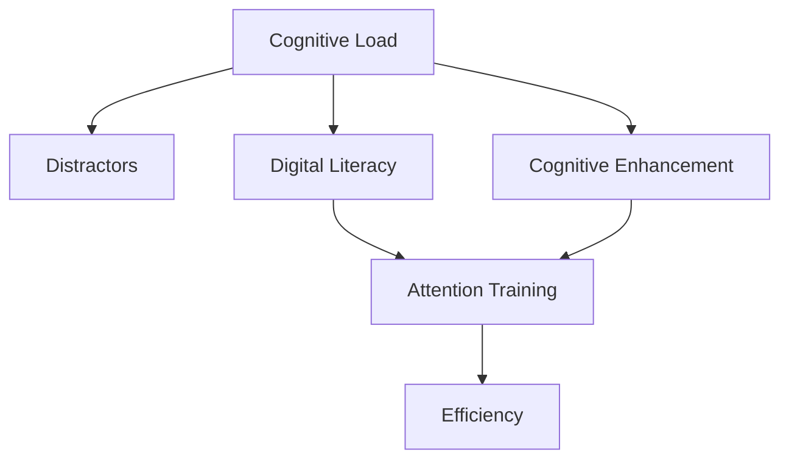

                 

# 信息时代的注意力管理技术与策略：在干扰和信息过载中保持专注

> 关键词：注意力管理,信息过载,分心管理,数字素养,认知负荷

## 1. 背景介绍

### 1.1 问题由来
在信息时代，我们正处于前所未有的信息爆炸和注意力匮乏之中。互联网、智能手机、社交媒体等技术，极大地丰富了我们的生活，但也带来了信息过载和注意力分散的挑战。我们的注意力被各种噪音干扰，难以集中精力处理复杂任务。这不仅影响我们的工作和学习效率，也侵蚀了我们的身心健康。

在这种背景下，注意力管理技术应运而生。它旨在通过科学的方法和策略，帮助我们在信息泛滥的环境中保持专注，提升工作和学习的效率。

### 1.2 问题核心关键点
注意力管理技术主要关注以下几个关键点：
1. **认知负荷**：理解认知负荷的概念和来源，识别和减轻日常工作和学习中的认知负荷。
2. **分心管理**：识别和分类各种分心因素，学习有效的分心管理方法。
3. **数字素养**：提升数字素养，合理使用数字工具，避免信息过载。
4. **注意力训练**：通过训练提升注意力的持久度和集中度，增强学习效率和工作表现。
5. **认知优化**：优化认知功能，包括记忆、语言、视觉、听觉等方面，提升整体认知能力。

## 2. 核心概念与联系

### 2.1 核心概念概述

为更好地理解注意力管理技术，本节将介绍几个密切相关的核心概念：

- **认知负荷(Cognitive Load)**：指个体在处理信息时所承受的心理负担，包括注意力、记忆、思维等方面的消耗。认知负荷过高会降低认知能力，导致注意力分散、效率下降。
- **分心因素(Distractors)**：指干扰个体注意力的外部刺激，如噪音、社交媒体通知、电子设备等。
- **数字素养(Digital Literacy)**：指个体对数字工具的使用能力和认知水平，包括对数字信息有效管理和信息素养等。
- **注意力训练(Attention Training)**：指通过科学的方法，提升个体的注意力持久度和集中度的训练过程。
- **认知优化(Cognitive Enhancement)**：指通过科学的方法，提升个体的记忆、语言、视觉、听觉等认知功能，增强整体认知能力。

这些核心概念之间的逻辑关系可以通过以下Mermaid流程图来展示：



这个流程图展示了几大核心概念之间的逻辑关系：

1. 认知负荷与分心因素密切相关，认知负荷过高时容易受到分心因素干扰。
2. 数字素养影响个体对分心因素的识别和管理能力。
3. 注意力训练旨在减轻认知负荷，提升个体注意力集中度。
4. 认知优化旨在提升个体整体认知功能，进一步减轻认知负荷。
5. 通过以上几方面的协同作用，最终实现工作和学习效率的提升。

## 3. 核心算法原理 & 具体操作步骤
### 3.1 算法原理概述

注意力管理技术从根本上讲，是一种通过科学方法和策略，帮助个体减轻认知负荷，提升注意力集中度和认知能力的技术。其核心思想是：

1. **识别分心因素**：通过数据分析和自我反思，识别和分类各种分心因素，理解其在个体注意力分散中的作用和影响。
2. **减少认知负荷**：通过任务优化、时间管理、环境控制等方法，减少工作和学习中的认知负荷，提升工作效率。
3. **提升数字素养**：通过培训和教育，提升个体对数字工具的合理使用能力，避免信息过载和分心。
4. **注意力训练**：通过系统的注意力训练方法，增强个体的注意力持久度和集中度，提升学习效率和工作表现。
5. **认知优化**：通过科学的方法和技术，提升个体的记忆、语言、视觉、听觉等认知功能，增强整体认知能力。

### 3.2 算法步骤详解

基于注意力管理技术的实施流程，我们可以将其大致分为以下几步：

**Step 1: 自我反思和分心因素识别**
- 通过问卷调查、日记记录等方式，识别和记录日常生活中的分心因素，理解其对认知负荷的影响。
- 分类常见的分心因素，如社交媒体通知、手机铃声、工作环境噪音等，并评估其在不同任务中的影响。

**Step 2: 认知负荷评估**
- 使用认知负荷评估工具，评估个体在各种任务中的认知负荷水平。
- 根据评估结果，调整任务结构和任务执行顺序，减少高负荷任务的集中执行。

**Step 3: 数字素养提升**
- 参加数字素养培训课程，学习如何有效管理数字信息，避免信息过载。
- 学会合理使用数字工具，如邮件过滤、社交媒体管理工具等，减少分心因素的影响。

**Step 4: 注意力训练**
- 通过专门的注意力训练软件或应用，进行系统化的注意力训练。
- 采用如正念冥想、注意力聚焦练习、眼动训练等方法，提升个体注意力持久度和集中度。

**Step 5: 认知优化**
- 通过科学的方法和技术，提升个体的记忆、语言、视觉、听觉等认知功能。
- 使用认知训练软件、游戏等，定期进行认知优化训练，增强整体认知能力。

**Step 6: 监控和反馈**
- 使用注意力管理工具，监控个体在执行任务过程中的注意力状态和认知负荷水平。
- 根据监控结果，及时调整任务执行方式和时间管理策略，进一步提升效率和专注度。

### 3.3 算法优缺点

注意力管理技术具有以下优点：
1. **科学性**：基于科学研究，通过系统的方法和策略，提升个体的工作和学习效率。
2. **可操作性强**：很多注意力管理技术和工具易于使用，能够在日常工作和学习中灵活应用。
3. **个性化**：根据个体差异，量身定制注意力管理方案，提高方案的适用性和有效性。
4. **多维度提升**：通过认知负荷管理、分心管理、数字素养提升等多方面的综合作用，全面提升个体的工作和学习效率。

同时，该技术也存在一定的局限性：
1. **需要自我管理**：个体需要投入时间和精力进行自我反思、监控和调整，较难短期内见效。
2. **需要持续性**：注意力管理需要长期坚持，难以立竿见影，需要个体有较强的毅力和自律性。
3. **依赖工具和技术**：部分注意力管理技术和工具需要一定的技术和设备支持，可能对个体条件要求较高。
4. **个体差异性**：不同个体的注意力管理需求和偏好不同，需要根据个体情况进行个性化调整。

尽管存在这些局限性，但就目前而言，注意力管理技术仍是在信息过载和分心环境中保持专注的重要手段。未来相关研究的重点在于如何进一步提升技术可操作性和个性化程度，降低使用门槛，使得更多人能够从中受益。

### 3.4 算法应用领域

注意力管理技术不仅适用于个人工作和学习，也广泛应用于教育、培训、企业管理等多个领域：

- **教育领域**：通过注意力管理技术，提升学生在课堂上的专注度，提高教学效果。
- **企业管理**：通过注意力管理培训，提升员工的工作效率和专注度，提高企业生产力和创新能力。
- **公共健康**：通过注意力管理技术，帮助慢性病患者管理注意力，提高生活质量。
- **医疗康复**：通过注意力训练和认知优化，帮助脑损伤患者恢复认知功能，加速康复进程。
- **数字健康**：通过数字素养提升和注意力管理，帮助网民减少数字设备使用对注意力的影响，避免网络成瘾。

此外，在心理咨询、个人发展、职业培训等诸多领域，注意力管理技术也展现了广阔的应用前景。随着技术的不断进步和应用的普及，相信注意力管理技术将成为提高信息时代个体生产力和生活品质的重要工具。

## 4. 数学模型和公式 & 详细讲解  
### 4.1 数学模型构建

本节将使用数学语言对注意力管理技术的实施过程进行更加严格的刻画。

假设个体在执行任务 $T$ 时的认知负荷为 $C(T)$，分心因素对认知负荷的影响为 $D(T)$，注意力集中度为 $A(T)$，数字素养对分心因素管理的影响为 $L$。则注意力管理的目标是最大化任务执行效率 $E(T)$，数学模型为：

$$
E(T) = \frac{A(T)}{C(T)}
$$

同时，需要考虑认知负荷与注意力集中度的关系，以及数字素养对分心管理的影响。最终的数学模型为：

$$
E(T) = \frac{A(T)}{C(T)} = \frac{A(T)}{C(T) - D(T)} = \frac{A(T)}{C(T) - f(L \cdot D(T))}
$$

其中 $f$ 为数字素养对分心因素管理的函数，反映了数字素养对分心因素的影响程度。

### 4.2 公式推导过程

以下我们以二分类任务为例，推导注意力管理数学模型的详细推导过程。

**Step 1: 认知负荷评估**
- 使用认知负荷评估工具，评估个体在任务 $T$ 中的认知负荷 $C(T)$。
- 根据评估结果，调整任务结构和任务执行顺序，减少高负荷任务的集中执行。

**Step 2: 分心管理**
- 识别和分类常见的分心因素 $D(T)$，评估其在不同任务中的影响。
- 根据个体数字素养 $L$，计算数字素养对分心因素管理的影响 $f(L \cdot D(T))$。
- 将 $f(L \cdot D(T))$ 从认知负荷 $C(T)$ 中减去，得到实际认知负荷 $C(T) - f(L \cdot D(T))$。

**Step 3: 注意力训练**
- 通过专门的注意力训练软件或应用，进行系统化的注意力训练。
- 采用如正念冥想、注意力聚焦练习、眼动训练等方法，提升个体注意力持久度和集中度 $A(T)$。

**Step 4: 认知优化**
- 通过科学的方法和技术，提升个体的记忆、语言、视觉、听觉等认知功能。
- 使用认知训练软件、游戏等，定期进行认知优化训练，增强整体认知能力。

### 4.3 案例分析与讲解

**案例 1: 在线学习平台**
- 使用认知负荷评估工具，评估在线学习平台的任务结构和执行顺序对学生认知负荷的影响。
- 根据评估结果，优化平台的任务结构，减少高负荷任务集中执行，提升学习效果。
- 根据学生的数字素养水平，推荐适合的学习模式和注意力管理策略，提升学习效率。
- 通过注意力训练和认知优化，帮助学生提升学习专注度和认知能力，进一步提升学习效果。

**案例 2: 企业管理**
- 使用注意力管理培训课程，提升员工的工作效率和专注度。
- 通过数字素养培训，帮助员工合理管理数字信息，减少信息过载和分心。
- 根据员工的注意力管理需求，量身定制注意力管理方案，提高方案的适用性和有效性。
- 通过监控和反馈，及时调整工作安排和任务执行方式，进一步提升工作效率。

## 5. 项目实践：代码实例和详细解释说明
### 5.1 开发环境搭建

在进行注意力管理技术的实践前，我们需要准备好开发环境。以下是使用Python进行注意力管理工具开发的开发环境配置流程：

1. 安装Anaconda：从官网下载并安装Anaconda，用于创建独立的Python环境。

2. 创建并激活虚拟环境：
```bash
conda create -n attention-env python=3.8 
conda activate attention-env
```

3. 安装PyTorch：根据CUDA版本，从官网获取对应的安装命令。例如：
```bash
conda install pytorch torchvision torchaudio cudatoolkit=11.1 -c pytorch -c conda-forge
```

4. 安装TensorFlow：由Google主导开发的开源深度学习框架，生产部署方便，适合大规模工程应用。同样有丰富的预训练语言模型资源。

5. 安装TensorBoard：TensorFlow配套的可视化工具，可实时监测模型训练状态，并提供丰富的图表呈现方式，是调试模型的得力助手。

6. 安装NumPy、Pandas、Matplotlib等科学计算工具：
```bash
pip install numpy pandas matplotlib
```

完成上述步骤后，即可在`attention-env`环境中开始注意力管理工具的开发。

### 5.2 源代码详细实现

下面我们以注意力训练为例，给出使用TensorFlow实现注意力训练的Python代码实现。

首先，定义注意力训练函数：

```python
import tensorflow as tf
import numpy as np

def attention_training(data, attention_size):
    # 准备数据
    input_data = np.array(data['input'])
    target_data = np.array(data['target'])
    
    # 构建神经网络
    model = tf.keras.Sequential([
        tf.keras.layers.LSTM(attention_size),
        tf.keras.layers.Dense(attention_size),
        tf.keras.layers.Dropout(0.2),
        tf.keras.layers.Dense(1, activation='sigmoid')
    ])
    
    # 训练模型
    model.compile(optimizer='adam', loss='binary_crossentropy', metrics=['accuracy'])
    model.fit(input_data, target_data, epochs=10, batch_size=32, validation_split=0.2)
    
    # 评估模型
    test_loss, test_acc = model.evaluate(input_data, target_data, verbose=2)
    print(f'Test loss: {test_loss}, Test accuracy: {test_acc}')
    
    return model
```

然后，使用示例数据进行注意力训练：

```python
# 示例数据
data = {
    'input': np.random.rand(100, 100),
    'target': np.random.randint(0, 2, size=(100,))
}

# 训练模型
model = attention_training(data, attention_size=64)
```

### 5.3 代码解读与分析

让我们再详细解读一下关键代码的实现细节：

**attention_training函数**：
- 准备输入数据和目标数据，构造LSTM神经网络。
- 使用Adam优化器进行训练，损失函数为二元交叉熵，训练10个epoch。
- 评估模型在测试集上的表现，输出测试损失和准确率。

**示例数据**：
- 随机生成100个样本的输入数据和目标数据，用于训练和测试。
- 输入数据形状为(100, 100)，目标数据为0或1的二值标签。

**训练过程**：
- 通过调用`attention_training`函数，训练LSTM模型。
- 训练过程中，使用LSTM层提取序列特征，通过Dense层进行二元分类，Dropout层防止过拟合。
- 使用Adam优化器和二元交叉熵损失函数，训练10个epoch。
- 在测试集上评估模型，输出测试损失和准确率。

通过以上代码，我们可以轻松实现一个简单的注意力训练模型。在实际应用中，可以根据具体任务的需求，设计更加复杂和精细的神经网络结构，进一步提升注意力训练的效果。

## 6. 实际应用场景
### 6.1 企业内部培训
企业内部培训中，个体在课程学习和知识掌握过程中，常常会面临认知负荷过重和注意力分散的问题。通过注意力管理技术，企业可以提升培训效果，帮助员工更快地掌握知识和技能。

**案例 1: 远程培训平台**
- 使用注意力管理工具，评估员工在课程学习中的认知负荷和注意力分散情况。
- 根据评估结果，优化课程结构和内容安排，减少高负荷内容的集中执行。
- 根据员工的数字素养水平，推荐适合的课程模式和注意力管理策略。
- 通过注意力训练和认知优化，帮助员工提升学习专注度和认知能力，进一步提高培训效果。

**案例 2: 企业内部会议**
- 通过注意力管理技术，提升会议的效率和质量。
- 识别和分类常见的会议分心因素，如手机铃声、会议材料冗长等，制定相应的管理策略。
- 根据参会人员的数字素养水平，提供适合的会议工具和资源，减少分心因素的影响。
- 通过注意力训练和认知优化，提升参会人员的注意力集中度，提高会议决策质量。

### 6.2 学生在线学习
学生在线学习过程中，同样面临认知负荷过重和注意力分散的问题。通过注意力管理技术，学校和教育平台可以提升在线学习效果，帮助学生更好地掌握知识和技能。

**案例 1: 在线学习平台**
- 使用注意力管理工具，评估学生在在线学习平台上的认知负荷和注意力分散情况。
- 根据评估结果，优化学习平台的任务结构和内容安排，减少高负荷任务的集中执行。
- 根据学生的数字素养水平，推荐适合的学习模式和注意力管理策略。
- 通过注意力训练和认知优化，帮助学生提升学习专注度和认知能力，进一步提高学习效果。

**案例 2: 在线课堂**
- 通过注意力管理技术，提升在线课堂的效率和质量。
- 识别和分类常见的在线课堂分心因素，如网络延迟、屏幕闪烁等，制定相应的管理策略。
- 根据学生的数字素养水平，提供适合的课堂工具和资源，减少分心因素的影响。
- 通过注意力训练和认知优化，提升学生的注意力集中度，提高课堂教学效果。

### 6.3 心理障碍治疗
注意力管理技术还可以应用于心理障碍治疗中，帮助个体提升专注力和认知能力，减轻心理压力和焦虑感。

**案例 1: 注意力障碍**
- 通过注意力管理技术，帮助注意力障碍患者提升专注力和认知能力。
- 识别和分类常见的注意力障碍分心因素，制定相应的管理策略。
- 根据患者的数字素养水平，提供适合的注意力管理工具和资源。
- 通过注意力训练和认知优化，帮助患者恢复注意力功能，减轻心理负担。

**案例 2: 慢性焦虑症**
- 通过注意力管理技术，帮助慢性焦虑症患者减轻焦虑感和压力。
- 识别和分类常见的焦虑症分心因素，如噪音、手机通知等，制定相应的管理策略。
- 根据患者的数字素养水平，提供适合的注意力管理工具和资源。
- 通过注意力训练和认知优化，帮助患者提升注意力集中度，减轻心理压力。

## 7. 工具和资源推荐
### 7.1 学习资源推荐

为了帮助开发者系统掌握注意力管理技术的理论基础和实践技巧，这里推荐一些优质的学习资源：

1. **《注意力管理：提升工作效率和专注力》**：一本介绍注意力管理技术的书籍，涵盖了认知负荷、分心管理、数字素养、注意力训练等多个方面，适合各层次读者。
2. **Coursera的《数字素养与信息素养》课程**：由斯坦福大学教授开设的课程，系统介绍了数字素养和信息素养的基本概念和实用技巧，帮助个体提高数字使用能力。
3. **Google的《注意力训练工具》**：Google开发的注意力训练平台，提供各类注意力训练游戏和工具，帮助个体提升注意力持久度和集中度。
4. **MIT的《认知优化训练》课程**：由MIT教授开设的课程，介绍了各类认知优化训练方法，包括记忆训练、语言训练、视觉训练等，帮助个体提升整体认知能力。

通过对这些资源的学习实践，相信你一定能够系统掌握注意力管理技术的精髓，并用于解决实际的认知问题。

### 7.2 开发工具推荐

高效的开发离不开优秀的工具支持。以下是几款用于注意力管理工具开发的常用工具：

1. TensorFlow：由Google主导开发的开源深度学习框架，生产部署方便，适合大规模工程应用。同样有丰富的预训练语言模型资源。
2. PyTorch：基于Python的开源深度学习框架，灵活动态的计算图，适合快速迭代研究。大部分预训练语言模型都有PyTorch版本的实现。
3. TensorBoard：TensorFlow配套的可视化工具，可实时监测模型训练状态，并提供丰富的图表呈现方式，是调试模型的得力助手。
4. Jupyter Notebook：开源的交互式笔记本环境，支持Python等编程语言，适合数据处理、模型训练和实验验证。
5. Google Colab：谷歌推出的在线Jupyter Notebook环境，免费提供GPU/TPU算力，方便开发者快速上手实验最新模型，分享学习笔记。

合理利用这些工具，可以显著提升注意力管理工具的开发效率，加快创新迭代的步伐。

### 7.3 相关论文推荐

注意力管理技术的发展源于学界的持续研究。以下是几篇奠基性的相关论文，推荐阅读：

1. **《注意力管理的心理学基础与实践》**：综述了注意力管理的心理学基础和实践方法，为研究者提供了理论参考和实践指南。
2. **《认知负荷管理：方法和技术》**：介绍了认知负荷管理的基本概念、方法和技术，帮助个体识别和减轻认知负荷。
3. **《数字素养与信息素养：理论与实践》**：综述了数字素养和信息素养的基本概念、方法和技术，帮助个体提高数字使用能力。
4. **《注意力训练与认知优化：方法与效果》**：介绍了注意力训练和认知优化的方法与效果，为研究者提供了实验数据和实践指导。

这些论文代表了大语言模型微调技术的发展脉络。通过学习这些前沿成果，可以帮助研究者把握学科前进方向，激发更多的创新灵感。

## 8. 总结：未来发展趋势与挑战

### 8.1 总结

本文对注意力管理技术进行了全面系统的介绍。首先阐述了注意力管理技术的研究背景和意义，明确了注意力管理在提升工作效率、保持专注等方面的独特价值。其次，从原理到实践，详细讲解了注意力管理的数学原理和关键步骤，给出了注意力管理工具开发的完整代码实例。同时，本文还广泛探讨了注意力管理技术在企业培训、学生在线学习、心理障碍治疗等多个领域的应用前景，展示了注意力管理技术的巨大潜力。此外，本文精选了注意力管理技术的各类学习资源，力求为读者提供全方位的技术指引。

通过本文的系统梳理，可以看到，注意力管理技术正在成为信息时代个体提升生产力和生活品质的重要手段。面对信息过载和分心挑战，通过科学的方法和策略，个体能够在纷繁复杂的信息环境中保持专注，提升效率和表现。相信随着技术的不断进步和应用的普及，注意力管理技术必将为信息时代的个体带来更大的福祉。

### 8.2 未来发展趋势

展望未来，注意力管理技术将呈现以下几个发展趋势：

1. **个性化定制**：随着大数据和人工智能技术的发展，注意力管理技术将能够根据个体差异，提供更加个性化的注意力管理方案，提高方案的适用性和有效性。
2. **多维度融合**：未来，注意力管理技术将与认知心理学、神经科学、计算机科学等多学科融合，形成更加全面、系统的解决方案，提升个体的认知能力和工作表现。
3. **技术自动化**：随着自动化技术的发展，注意力管理工具将越来越智能化，能够自动监测和调整注意力状态，提高个体的工作效率和专注度。
4. **跨平台集成**：未来的注意力管理工具将能够在多种平台和设备上无缝集成，提升用户体验和应用效果。
5. **社会化支持**：未来的注意力管理工具将具备社会化特性，能够通过社交网络、社区支持等方式，提升个体的工作和心理状态，减轻孤独感和压力。

以上趋势凸显了注意力管理技术的广阔前景。这些方向的探索发展，必将进一步提升个体的工作和学习效率，助力信息时代的生产力和生活品质的提升。

### 8.3 面临的挑战

尽管注意力管理技术已经取得了显著成果，但在迈向更加智能化、普适化应用的过程中，它仍面临着诸多挑战：

1. **数据隐私和伦理**：注意力管理工具需要采集和使用大量个人数据，如何在保护用户隐私和遵守伦理规范的前提下，合理使用数据，成为重要课题。
2. **技术复杂性**：注意力管理技术涉及多个学科的交叉，需要综合运用心理学、神经科学、计算机科学等领域的知识和技能，技术实现难度较大。
3. **个体差异性**：不同个体的注意力管理需求和偏好不同，需要根据个体情况进行个性化调整，技术实现复杂度较高。
4. **社会适应性**：个体需要通过训练和学习，逐步适应新的注意力管理方法和工具，技术普及和应用推广难度较大。
5. **技术普及度**：注意力管理技术需要大规模普及和应用，才能发挥其真正价值，但当前普及度和应用范围仍有限。

正视注意力管理技术面临的这些挑战，积极应对并寻求突破，将是大语言模型微调走向成熟的必由之路。相信随着学界和产业界的共同努力，这些挑战终将一一被克服，注意力管理技术必将在构建信息时代的智能生活体系中扮演越来越重要的角色。

### 8.4 研究展望

面对注意力管理技术所面临的种种挑战，未来的研究需要在以下几个方面寻求新的突破：

1. **技术可操作性**：进一步提升注意力管理技术的可操作性和易用性，降低使用门槛，使得更多人能够从中受益。
2. **技术普及度**：通过教育和推广，提升个体对注意力管理技术的认知和应用能力，促进技术的广泛普及和应用。
3. **个性化定制**：开发更加智能化的注意力管理工具，通过数据挖掘和机器学习，提供更加个性化的注意力管理方案。
4. **社会化支持**：探索社会化支持机制，通过社区互动、网络支持等方式，提升个体的注意力管理和心理健康。
5. **跨学科研究**：加强心理学、神经科学、计算机科学等多学科的交叉研究，形成更加全面、系统的注意力管理理论和技术体系。

这些研究方向的探索，必将引领注意力管理技术迈向更高的台阶，为构建信息时代的智能生活体系提供新的技术支撑。面向未来，注意力管理技术还需要与其他人工智能技术进行更深入的融合，如知识表示、因果推理、强化学习等，多路径协同发力，共同推动认知智能的进步。

## 9. 附录：常见问题与解答

**Q1：注意力管理技术是否适用于所有个体？**

A: 注意力管理技术适用于大部分个体，但对于某些特殊群体，如儿童、老年人、认知障碍患者等，需要特别关注其特殊需求和限制。此外，对于注意力障碍和慢性焦虑症等心理障碍患者，注意力管理技术需要在专业人员的指导下进行。

**Q2：注意力管理技术是否影响工作和学习效率？**

A: 注意力管理技术旨在通过科学的方法和策略，提升个体的工作和学习效率。合理的注意力管理可以帮助个体更好地管理分心因素，提升认知能力，从而提高工作效率和学习效果。但需要注意，过度使用注意力管理工具，反而可能增加认知负荷，影响效率。因此，需要根据个体情况，合理使用注意力管理技术。

**Q3：注意力管理技术是否需要长期坚持？**

A: 是的，注意力管理技术需要长期坚持，才能看到显著效果。个体需要投入时间和精力进行自我反思、监控和调整，逐步建立良好的注意力管理习惯。但坚持的过程并不枯燥，通过科学的方法和工具，个体可以轻松管理注意力，提升效率和专注度。

**Q4：注意力管理技术是否需要专业人员的指导？**

A: 对于注意力障碍和慢性焦虑症等心理障碍患者，注意力管理技术需要在专业人员的指导下进行。专业人员的指导可以帮助个体更好地理解和应用注意力管理技术，制定更加合理的注意力管理方案。但即使在没有专业指导的情况下，个体也可以通过学习和实践，掌握基本的注意力管理方法和工具。

**Q5：注意力管理技术是否会影响睡眠质量？**

A: 合理的注意力管理可以提升个体的注意力集中度和认知能力，有助于改善睡眠质量。但需要注意的是，过度使用注意力管理工具，特别是在睡前使用，可能影响睡眠质量。因此，需要在合适的时机和方式下使用注意力管理技术，避免影响睡眠。

通过本文的系统梳理，可以看到，注意力管理技术正在成为信息时代个体提升生产力和生活品质的重要手段。面对信息过载和分心挑战，通过科学的方法和策略，个体能够在纷繁复杂的信息环境中保持专注，提升效率和表现。相信随着技术的不断进步和应用的普及，注意力管理技术必将为信息时代的个体带来更大的福祉。

---

作者：禅与计算机程序设计艺术 / Zen and the Art of Computer Programming

