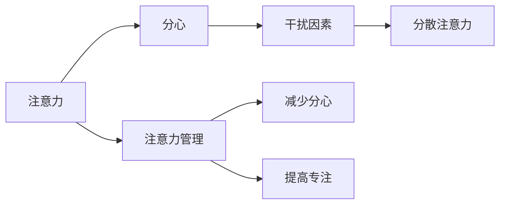
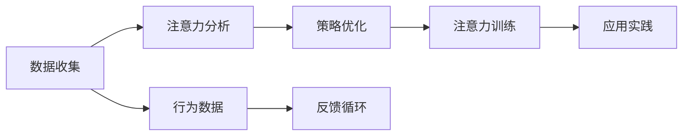

                 

## 1. 背景介绍

在信息时代，人们每天面对海量的信息流，注意力管理成为一项艰巨的挑战。如何在这信息泛滥的环境中保持专注，成为许多人关注的焦点。本文将从注意力管理的核心概念入手，探讨其在现代社会的挑战，以及如何通过技术手段提升我们的注意力水平。

## 2. 核心概念与联系

### 2.1 核心概念概述

- **注意力（Attention）**：指大脑对外部信息的选择性聚焦。在信息处理中，注意力机制帮助系统或个体优先处理关键信息，忽略干扰信息。
- **分心（Distraction）**：指导致注意力分散的外部因素，如噪音、多任务、通知等。
- **注意力管理（Attention Management）**：指通过策略和工具，提升个体的注意力集中度，减少分心的过程。

以下是一个Mermaid流程图，展示了注意力管理的核心概念及其之间的联系：



### 2.2 核心概念原理和架构的 Mermaid 流程图

以下是一个Mermaid流程图，展示了注意力管理的技术架构和关键组件：



## 3. 核心算法原理 & 具体操作步骤

### 3.1 算法原理概述

注意力管理涉及多个领域，如心理学、认知科学和计算机科学。核心思想是通过优化注意力分配和减少分心，提升信息处理的效率和质量。

- **认知控制理论**：指出注意力是一种有限的资源，需要通过策略来优化分配。
- **神经网络模型**：将注意力建模为神经网络的一部分，通过训练提升模型对信息的感知和选择能力。

### 3.2 算法步骤详解

1. **数据收集**：收集个体的行为数据，如浏览记录、操作时间等。
2. **注意力分析**：利用机器学习技术分析数据，识别分心的时间和模式。
3. **策略优化**：根据分析结果，制定或调整注意力管理的策略。
4. **注意力训练**：通过训练提升个体对干扰的抵抗力和注意力集中度。
5. **应用实践**：在实际环境中应用注意力管理策略，评估效果。

### 3.3 算法优缺点

- **优点**：
  - **量化和优化**：通过数据驱动的方式，识别分心的模式和原因，提供针对性的优化策略。
  - **个性化和适应性**：根据个体差异，制定个性化策略，提升效率和满意度。
- **缺点**：
  - **隐私和伦理**：数据收集和分析可能涉及隐私问题，需严格遵守数据保护法规。
  - **模型局限性**：模型可能存在偏差或过拟合，导致策略效果不稳定。

### 3.4 算法应用领域

注意力管理技术广泛应用于教育、工作、健康等领域，帮助个体提升效率，减少压力。

- **教育**：通过监测学生的学习行为，定制个性化学习计划，提升学习效果。
- **工作**：优化工作流程，减少会议时间，提升工作效率。
- **健康**：监测睡眠质量，改善睡眠习惯，提升整体健康水平。

## 4. 数学模型和公式 & 详细讲解

### 4.1 数学模型构建

注意力管理的数学模型主要基于概率模型和强化学习模型。

- **概率模型**：利用概率模型描述个体在特定时间点上分心和专注的概率。
- **强化学习模型**：通过奖励机制训练个体选择策略，提升注意力管理效果。

### 4.2 公式推导过程

以一个简单的概率模型为例，设 $P$ 为个体在时间 $t$ 上分心的概率，$C$ 为时间 $t$ 上专注的概率。根据马尔可夫假设，有：

$$
P_t = P_{t-1}(1 - C_{t-1}) + (1 - P_{t-1})D_t
$$

其中 $D_t$ 为干扰因素在时间 $t$ 上分心的概率。

### 4.3 案例分析与讲解

一个实际案例是使用概率模型分析社交媒体对注意力的影响。通过分析用户在社交媒体上的活动数据，可以发现特定时间点上的分心概率，进而提出减少社交媒体干扰的策略。

## 5. 项目实践：代码实例和详细解释说明

### 5.1 开发环境搭建

为便于研究，可以使用Python和相关库，如Pandas、Scikit-learn、TensorFlow等。

1. **安装Python**：
   ```bash
   sudo apt-get install python3-pip
   ```

2. **安装相关库**：
   ```bash
   pip install pandas scikit-learn tensorflow
   ```

### 5.2 源代码详细实现

以下是一个简单的Python代码示例，用于分析用户的注意力分布：

```python
import pandas as pd
import numpy as np
from sklearn.model_selection import train_test_split

# 假设数据为CSV格式，包含用户ID、时间戳、专注度
df = pd.read_csv('user_data.csv')

# 时间戳转换为时间
df['time'] = pd.to_datetime(df['timestamp'])

# 计算每个时间段的专注度平均值
df_group = df.groupby(pd.Grouper(key='time', freq='1min')).mean()

# 可视化专注度分布
df_group['focus'].plot(kind='line')
```

### 5.3 代码解读与分析

代码中使用了Pandas和Scikit-learn库对用户数据进行分析，通过时间戳和专注度数据，计算每个时间段的专注度平均值，并可视化结果。

### 5.4 运行结果展示

运行代码后，可以得到一个时间段的专注度分布图，帮助识别分心的模式和时间点，进而制定针对性的策略。

## 6. 实际应用场景

### 6.1 教育

在教育领域，注意力管理技术可以帮助教师和学生识别分心的时刻，优化教学和学习的效率。例如，可以通过监测学生的在线学习行为，提供个性化学习建议，提升学习效果。

### 6.2 工作

在工作环境中，注意力管理技术可以优化工作流程，减少会议时间，提升工作效率。例如，可以通过监测员工的工作时间，识别分心的时间点，制定更合理的工作计划。

### 6.3 健康

在健康领域，注意力管理技术可以帮助监测睡眠质量，改善睡眠习惯，提升整体健康水平。例如，可以通过监测用户的睡眠数据，提供个性化的睡眠建议，改善睡眠质量。

### 6.4 未来应用展望

未来，注意力管理技术将进一步发展，结合更多前沿技术，如人工智能、物联网等，实现更加智能化的注意力管理。例如，结合智能穿戴设备，实时监测用户的生理指标，提供更精准的注意力管理方案。

## 7. 工具和资源推荐

### 7.1 学习资源推荐

- **Coursera**：提供心理学和认知科学相关的课程，帮助理解注意力管理的理论基础。
- **edX**：提供数据科学和机器学习的课程，学习注意力管理的实际应用。
- **Google AI Blog**：分享前沿的研究成果和技术进展，了解注意力管理领域的发展趋势。

### 7.2 开发工具推荐

- **Jupyter Notebook**：用于数据处理和代码调试，支持多种编程语言。
- **TensorBoard**：用于可视化模型训练和结果，帮助调试和优化模型。
- **Tableau**：用于数据可视化，帮助理解注意力分布和模式。

### 7.3 相关论文推荐

- **Attention Is All You Need**：介绍Transformer模型，展示了注意力机制在NLP中的应用。
- **Deep Learning for Attention**：总结了深度学习在注意力管理中的研究和应用，提供了丰富的案例分析。
- **The Role of Attention in Cognitive Control**：探讨了注意力在认知控制中的作用，为注意力管理提供了理论基础。

## 8. 总结：未来发展趋势与挑战

### 8.1 研究成果总结

注意力管理技术在现代信息社会中得到了广泛应用，通过数据驱动的方式，提升了个体在学习和工作中的效率和质量。

### 8.2 未来发展趋势

未来，注意力管理技术将结合更多前沿技术，如人工智能、物联网等，实现更加智能化的注意力管理。例如，结合智能穿戴设备，实时监测用户的生理指标，提供更精准的注意力管理方案。

### 8.3 面临的挑战

- **隐私和伦理**：数据收集和分析可能涉及隐私问题，需严格遵守数据保护法规。
- **模型局限性**：模型可能存在偏差或过拟合，导致策略效果不稳定。
- **技术门槛**：注意力管理技术涉及复杂的数学和算法，需要较高的技术水平。

### 8.4 研究展望

未来的研究应聚焦于以下几个方向：

- **多模态注意力**：结合视觉、听觉等多模态数据，提升注意力管理的全面性。
- **自适应学习**：根据个体差异，制定个性化的注意力管理策略。
- **跨领域应用**：将注意力管理技术应用于更多领域，如健康、娱乐等，提升整体生活质量。

## 9. 附录：常见问题与解答

**Q1: 注意力管理技术是否适用于所有人？**

A: 注意力管理技术适用于大多数人群，但具体效果可能因个体差异而异。对于注意力缺陷多动障碍（ADHD）患者，注意力管理技术可能更为有效。

**Q2: 注意力管理技术如何应用在日常工作和学习中？**

A: 在日常工作和学习中，可以使用注意力管理工具监测专注度和分心时间，根据分析结果调整工作和学习计划，优化时间分配。例如，可以设置番茄工作法（Pomodoro Technique），每25分钟专注一次，休息5分钟。

**Q3: 注意力管理技术是否会对工作和学习产生负面影响？**

A: 合理使用注意力管理技术不会产生负面影响，反而能提升工作效率和学习效果。但过度依赖技术，如过度监测或过度干预，可能导致焦虑和压力，需要谨慎使用。

**Q4: 注意力管理技术的局限性是什么？**

A: 注意力管理技术的局限性包括数据隐私、模型偏差和用户接受度等。需平衡数据收集和隐私保护，优化模型效果，提高用户接受度。

**Q5: 如何评估注意力管理技术的效果？**

A: 评估注意力管理技术的效果可以通过跟踪个体的专注度和任务完成情况，分析前后差异。还可以通过用户反馈，了解技术对工作和学习的影响。

作者：禅与计算机程序设计艺术 / Zen and the Art of Computer Programming

