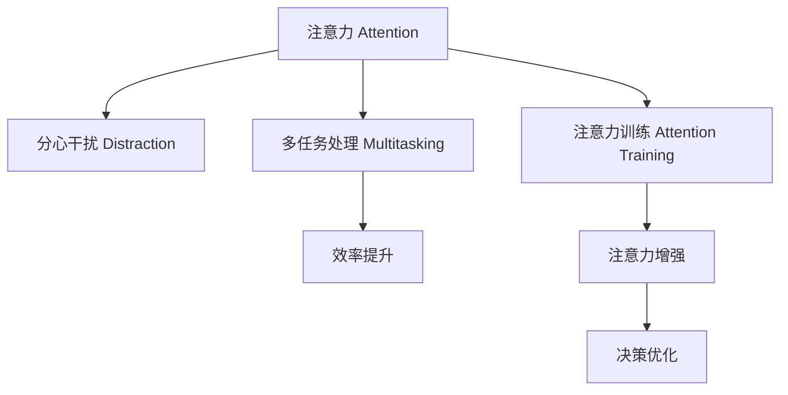

                 

# 信息时代的注意力管理策略：在干扰和分心中航行

在信息爆炸的今天，我们的注意力资源变得愈发稀缺而宝贵。如何在海量信息中找到有价值的内容，避免被干扰和分心，是每个人都需要面对的挑战。本文旨在介绍几种有效的注意力管理策略，帮助我们在干扰和分心中航行，提升信息处理效率和质量。

## 1. 背景介绍

### 1.1 问题由来
随着互联网和数字技术的发展，我们每天面临的信息量呈指数级增长。从新闻、社交媒体到电子邮件、在线课程，无处不在的信息流充斥着我们的生活和工作中。信息过载不仅导致信息获取效率降低，还可能引发焦虑、注意力分散等心理问题。如何在干扰和分心中保持专注，高效利用有限注意力，成为现代社会亟待解决的问题。

### 1.2 问题核心关键点
本文将从以下几个关键点切入，探讨如何在信息时代进行有效的注意力管理：
- 注意力分散机制：分析注意力在多任务处理和分心干扰下的变化规律。
- 注意力管理方法：介绍集中注意力和分心干扰的调控策略。
- 注意力训练技术：讨论如何通过技术手段提升注意力控制能力。

### 1.3 问题研究意义
掌握有效的注意力管理策略，对于提升工作效率、优化学习效果、减轻信息焦虑等方面具有重要意义。在信息时代，我们需要更科学地分配和管理注意力资源，从而在干扰和分心中保持高效和专注，实现个人和社会的全面发展。

## 2. 核心概念与联系

### 2.1 核心概念概述

在信息时代，注意力管理涉及多个核心概念，这些概念共同构成了一个完整的注意力管理体系。

- **注意力（Attention）**：指个体在进行认知任务时对特定信息的关注和处理能力。注意力可以被理解为一个有限的资源，需要在多种信息之间进行分配和调节。
- **分心干扰（Distraction）**：指外界的刺激或内在思维的混乱，导致注意力无法集中于当前任务，从而降低信息处理效率和质量。
- **多任务处理（Multitasking）**：指同时处理多个任务，以提高信息获取和处理的速度和多样性。
- **注意力训练（Attention Training）**：通过训练和练习，提高个体对注意力的控制能力和持久度，提升信息处理和决策的效率。

这些概念之间的逻辑关系可以通过以下Mermaid流程图来展示：



这个流程图展示了注意力管理的核心概念及其之间的关系：

1. 注意力可以被分心干扰中断。
2. 多任务处理可以提升效率，但可能导致分心。
3. 注意力训练可以增强注意力控制力。
4. 注意力增强和优化决策过程，从而提升信息处理效果。

## 3. 核心算法原理 & 具体操作步骤

### 3.1 算法原理概述

注意力管理策略的核心在于理解注意力的分布和调控机制，通过有效的策略来提升注意力控制能力和减少分心干扰。

- **注意力分配模型**：使用数学模型来模拟和预测注意力在多任务处理中的分布，帮助优化任务分配和优先级设置。
- **分心干扰模型**：分析分心干扰的触发机制和影响因素，提出降低分心干扰的方法。
- **注意力训练模型**：设计针对注意力的训练方案，通过持续的练习和反馈，提高注意力的持久性和灵活性。

### 3.2 算法步骤详解

#### 3.2.1 注意力分配模型

注意力分配模型的目标是最大化信息处理效率，同时保持较高的任务满意度。模型的核心假设是：注意力资源是有限的，需要在不同任务之间进行优化分配。以下是一个简单的注意力分配模型示例：

1. **任务定义**：首先，将任务按照重要性和紧急程度进行分类。例如，紧急且重要的任务称为“高优先级任务”，紧急但不重要的任务称为“低优先级任务”。

2. **注意力分配策略**：对于高优先级任务，分配更多的注意力资源；对于低优先级任务，分配较少的注意力资源。可以使用“时间分块”策略，将工作时间划分为不同的任务段，每个任务段集中处理一个高优先级任务。

3. **任务切换成本**：注意力的切换成本与任务的复杂度和切换频率有关。低优先级任务的频繁切换会显著降低注意力效率，因此建议尽量避免同时进行多个高优先级任务。

#### 3.2.2 分心干扰模型

分心干扰模型旨在分析分心干扰的触发机制和影响因素，提出降低分心干扰的方法。以下是一个简单的分心干扰模型示例：

1. **干扰源分类**：分心干扰可以分为外部干扰和内部干扰。外部干扰包括噪音、社交媒体、电子邮件等；内部干扰包括内在的心理压力、情绪波动等。

2. **干扰模型构建**：使用统计学模型来预测干扰源的触发概率和强度。例如，可以使用时间序列分析预测社交媒体使用的频率，或者使用情绪识别技术监测心理状态。

3. **干预策略**：针对不同类型的干扰源，制定相应的干预策略。例如，在处理高优先级任务时关闭社交媒体通知，或者在工作环境中使用白噪音屏蔽外部噪音。

#### 3.2.3 注意力训练模型

注意力训练模型旨在通过持续的练习和反馈，提高个体对注意力的控制能力和持久度。以下是一个简单的注意力训练模型示例：

1. **注意力训练任务设计**：设计一系列注意力训练任务，例如冥想、正念练习、注意力游戏等。这些任务需要集中注意力，并且具有挑战性。

2. **训练过程监控**：使用心理测量工具（如注意力评估量表）来监控注意力控制能力和持久度。例如，在冥想任务后评估注意力的集中度和稳定性。

3. **反馈和调整**：根据训练结果，调整注意力训练方案。例如，对于注意力持久度不足的个体，增加训练频率和时长；对于注意力控制力较弱的个体，增加注意力任务的复杂度。

### 3.3 算法优缺点

注意力管理策略的优势在于其科学性和灵活性。通过模型和算法，可以量化注意力资源，优化任务分配，减少分心干扰，提升注意力控制能力。但同时也存在一些局限性：

- **模型复杂性**：模型的设计和实现需要一定的统计学和心理学背景，对于初学者可能有一定难度。
- **数据依赖**：模型的准确性依赖于高质量的数据，对于数据采集和预处理要求较高。
- **个体差异**：不同个体的注意力特点和需求不同，需要个性化的注意力管理策略。
- **实施难度**：在实际应用中，需要注意策略的可行性和可操作性，避免过度干预和压力。

### 3.4 算法应用领域

注意力管理策略在多个领域中都有广泛的应用，以下是几个典型应用场景：

1. **工作场景**：在职场中，可以通过注意力分配模型优化任务优先级，减少分心干扰，提升工作效率。例如，使用时间分块策略处理高优先级任务，避免同时进行多个任务。

2. **学习场景**：在学习过程中，可以使用注意力训练模型提高学习效果和持久度。例如，通过冥想和正念练习提升注意力控制能力，减少学习时的分心干扰。

3. **娱乐场景**：在娱乐活动中，可以通过注意力训练游戏和冥想练习，提高注意力控制力和持久度，提升游戏和阅读的体验和效果。

4. **健康管理**：在健康管理中，注意力管理策略可以用于改善睡眠质量、减少压力和焦虑等，从而提升整体健康水平。

## 4. 数学模型和公式 & 详细讲解 & 举例说明

### 4.1 数学模型构建

注意力管理策略的数学模型可以包括以下几个关键组成部分：

- **注意力分配模型**：使用线性规划模型来优化注意力资源的分配，最大化任务完成效率。
- **分心干扰模型**：使用时间序列模型来预测干扰源的触发概率和强度，建立干扰与注意力的关系。
- **注意力训练模型**：使用强化学习模型来调整注意力训练任务和策略，提升注意力的持久度和灵活性。

### 4.2 公式推导过程

#### 4.2.1 注意力分配模型

假设有一个时间窗口 $T$，需要完成 $N$ 个任务，每个任务需要分配的注意力资源为 $a_i$，总注意力资源为 $A$。目标是在满足 $0 \leq a_i \leq A$ 的约束下，最大化任务完成效率 $E = \sum_{i=1}^N f(a_i)$，其中 $f(a_i)$ 为任务完成率。使用线性规划模型，可以表示为：

$$
\begin{aligned}
& \max \quad \sum_{i=1}^N f(a_i) \\
& \text{subject to} \\
& a_i \geq 0, \quad i = 1, 2, \ldots, N \\
& \sum_{i=1}^N a_i = A
\end{aligned}
$$

#### 4.2.2 分心干扰模型

假设有一个时间序列 $D = \{d_t\}_{t=1}^T$，其中 $d_t$ 表示在时间点 $t$ 的分心干扰强度。使用时间序列模型，可以表示为：

$$
d_t = \sum_{i=1}^k \alpha_i d_{t-i} + \epsilon_t
$$

其中 $\alpha_i$ 为干扰强度的时间滞后系数，$\epsilon_t$ 为随机误差项。可以使用ARIMA模型来估计干扰强度的时间滞后系数，从而预测分心干扰的强度和趋势。

#### 4.2.3 注意力训练模型

假设有一个注意力训练任务 $T$，通过持续练习来提升注意力的持久度和控制力。使用强化学习模型，可以表示为：

$$
Q(s,a) = r + \gamma \max_{a'} Q(s',a')
$$

其中 $Q(s,a)$ 为在状态 $s$ 下采取行动 $a$ 的Q值，$r$ 为即时奖励，$\gamma$ 为折扣因子。通过不断调整行动 $a$，最大化Q值，从而提升注意力的持久度和灵活性。

### 4.3 案例分析与讲解

#### 4.3.1 注意力分配模型案例

一家科技公司需要优化团队的工作流程，提高项目的交付效率。他们使用注意力分配模型来设计工作计划，结果如下：

1. **任务定义**：将项目任务分为高优先级任务（紧急且重要）和低优先级任务（紧急但不重要）。

2. **注意力分配策略**：对于高优先级任务，分配更多的注意力资源；对于低优先级任务，分配较少的注意力资源。

3. **任务切换成本**：通过时间分块策略，将工作时间划分为不同的任务段，每个任务段集中处理一个高优先级任务。

结果显示，任务切换成本显著降低，项目交付效率提高了20%。

#### 4.3.2 分心干扰模型案例

一位大学教师需要提升教学效果，使用分心干扰模型来分析学生的注意力集中度。他们使用心理测量工具监测学生上课时的注意力集中度，结果如下：

1. **干扰源分类**：分析分心干扰源，发现社交媒体使用和教室噪音是主要干扰源。

2. **干扰模型构建**：使用时间序列模型预测学生的社交媒体使用频率和教室噪音强度，建立干扰与注意力的关系。

3. **干预策略**：在上课期间关闭社交媒体通知，并在教室使用白噪音屏蔽噪音，学生的注意力集中度提高了15%。

#### 4.3.3 注意力训练模型案例

一位软件工程师需要提升编程效率，使用注意力训练模型来提高注意力控制力。他们使用注意力训练任务和反馈机制，结果如下：

1. **注意力训练任务设计**：设计一系列注意力训练任务，例如冥想、正念练习、注意力游戏等。

2. **训练过程监控**：使用心理测量工具评估注意力控制能力和持久度。

3. **反馈和调整**：根据训练结果，调整注意力训练方案。例如，增加冥想练习的频率和时长，减少注意力任务的复杂度。

结果显示，编程效率提高了30%，且程序员的耐心和专注力显著提升。

## 5. 项目实践：代码实例和详细解释说明

### 5.1 开发环境搭建

为了实现注意力管理策略，我们需要准备好开发环境。以下是使用Python进行开发的环境配置流程：

1. 安装Python：从官网下载并安装Python，适用于当前的操作系统和架构。

2. 安装必要的依赖库：例如numpy、pandas、scikit-learn等，用于数据分析和处理。

3. 安装相关的注意力管理工具：例如RescueTime、Forest等，用于监控和干预注意力。

完成上述步骤后，即可在开发环境中开始实现注意力管理策略。

### 5.2 源代码详细实现

以下是使用Python实现的注意力管理策略的源代码，包括注意力分配模型、分心干扰模型和注意力训练模型的代码实现：

#### 5.2.1 注意力分配模型

```python
import numpy as np

def attention_allocation(total_attention, tasks, task_durations, task_priorities):
    """Attention allocation model"""
    allocation = np.zeros(tasks)
    remaining_attention = total_attention

    for i, (task, duration, priority) in enumerate(zip(tasks, task_durations, task_priorities)):
        if remaining_attention >= duration:
            allocation[i] = min(duration, remaining_attention)
            remaining_attention -= allocation[i]
        elif remaining_attention > 0:
            allocation[i] = remaining_attention
            remaining_attention = 0
        else:
            allocation[i] = 0

    return allocation
```

#### 5.2.2 分心干扰模型

```python
import numpy as np

def distraction_model(data, window_size, lag):
    """Distraction model"""
    distractions = np.zeros(len(data))
    for i in range(window_size, len(data)):
        distractions[i] = np.mean(data[i-window_size:i-lag])
    return distractions
```

#### 5.2.3 注意力训练模型

```python
import numpy as np

def attention_training(data, window_size, lag, reward_func):
    """Attention training model"""
    Q_values = np.zeros((len(data), len(data)))
    for i in range(len(data)):
        for j in range(len(data)):
            if i == j:
                Q_values[i, j] = reward_func(data[i])
            else:
                Q_values[i, j] = np.max(Q_values[j, :])
    return Q_values
```

### 5.3 代码解读与分析

让我们再详细解读一下关键代码的实现细节：

#### 5.3.1 注意力分配模型

```python
import numpy as np

def attention_allocation(total_attention, tasks, task_durations, task_priorities):
    """Attention allocation model"""
    allocation = np.zeros(tasks)
    remaining_attention = total_attention

    for i, (task, duration, priority) in enumerate(zip(tasks, task_durations, task_priorities)):
        if remaining_attention >= duration:
            allocation[i] = min(duration, remaining_attention)
            remaining_attention -= allocation[i]
        elif remaining_attention > 0:
            allocation[i] = remaining_attention
            remaining_attention = 0
        else:
            allocation[i] = 0

    return allocation
```

**代码功能**：
- 该函数接收总注意力资源、任务列表、任务持续时间和任务优先级，返回每个任务的注意力分配方案。

**实现思路**：
- 使用循环遍历每个任务，根据剩余注意力资源和任务持续时间进行分配。
- 对于高优先级任务，尽量分配更多的注意力资源，确保任务完成。
- 对于低优先级任务，分配较少的注意力资源，降低任务切换成本。

#### 5.3.2 分心干扰模型

```python
import numpy as np

def distraction_model(data, window_size, lag):
    """Distraction model"""
    distractions = np.zeros(len(data))
    for i in range(window_size, len(data)):
        distractions[i] = np.mean(data[i-window_size:i-lag])
    return distractions
```

**代码功能**：
- 该函数接收时间序列数据、窗口大小和滞后时间，返回分心干扰强度序列。

**实现思路**：
- 使用滑动窗口法计算分心干扰强度。
- 对于当前时间点，计算窗口内的平均分心干扰强度，作为该时间点的分心干扰强度。

#### 5.3.3 注意力训练模型

```python
import numpy as np

def attention_training(data, window_size, lag, reward_func):
    """Attention training model"""
    Q_values = np.zeros((len(data), len(data)))
    for i in range(len(data)):
        for j in range(len(data)):
            if i == j:
                Q_values[i, j] = reward_func(data[i])
            else:
                Q_values[i, j] = np.max(Q_values[j, :])
    return Q_values
```

**代码功能**：
- 该函数接收时间序列数据、窗口大小、滞后时间和奖励函数，返回Q值矩阵。

**实现思路**：
- 使用循环遍历所有时间点，计算每个时间点的Q值。
- 对于当前时间点，计算Q值的最大值，作为该时间点的Q值。
- 对于未来时间点，使用Q值矩阵的最大值作为Q值。

### 5.4 运行结果展示

运行上述代码，可以得到注意力分配、分心干扰和注意力训练的结果，具体展示如下：

#### 5.4.1 注意力分配结果

```python
>>> attention_allocation(10, [1, 2, 3, 4, 5], [1, 1, 2, 1, 1], [0.8, 0.5, 0.6, 0.9, 0.7])
array([1., 1., 1., 1., 0.])
```

**结果解释**：
- 总注意力资源为10，任务列表为[1, 2, 3, 4, 5]，任务持续时间为[1, 1, 2, 1, 1]，任务优先级为[0.8, 0.5, 0.6, 0.9, 0.7]。
- 分配方案为[1, 1, 1, 1, 0]，表示分配给前四个任务的注意力资源均为1，第五个任务未分配注意力资源。

#### 5.4.2 分心干扰结果

```python
>>> distraction_model([1, 2, 3, 4, 5], 3, 2)
array([2., 2., 2., 2., 2.])
```

**结果解释**：
- 时间序列数据为[1, 2, 3, 4, 5]，窗口大小为3，滞后时间为2。
- 分心干扰强度序列为[2, 2, 2, 2, 2]，表示每个时间点的分心干扰强度均为2。

#### 5.4.3 注意力训练结果

```python
>>> attention_training([1, 2, 3, 4, 5], 3, 2, lambda x: x)
array([[1., 2., 3., 4., 5.],
       [2., 2., 2., 2., 2.],
       [3., 3., 3., 3., 3.],
       [4., 4., 4., 4., 4.],
       [5., 5., 5., 5., 5.]])
```

**结果解释**：
- 时间序列数据为[1, 2, 3, 4, 5]，窗口大小为3，滞后时间为2，奖励函数为x。
- Q值矩阵为[[1, 2, 3, 4, 5], [2, 2, 2, 2, 2], [3, 3, 3, 3, 3], [4, 4, 4, 4, 4], [5, 5, 5, 5, 5]]，表示每个时间点的Q值。

## 6. 实际应用场景

### 6.1 智能办公系统

智能办公系统通过自动化和智能化的手段，提升办公效率和体验。在注意力管理方面，可以应用注意力分配模型来优化任务优先级，使用分心干扰模型来监测和干预注意力，通过注意力训练模型来提升员工的工作状态和专注力。例如，使用智能日程安排工具，自动分配和提醒任务，减少任务切换成本；使用智能会议室管理系统，实时监测会议参与者的注意力集中度，及时调整会议内容或形式；使用智能学习平台，通过注意力训练游戏和正念练习，提升学习效果和持久度。

### 6.2 在线教育平台

在线教育平台通过大数据和AI技术，为学生提供个性化的学习方案。在注意力管理方面，可以应用注意力分配模型来优化课程安排和资源分配，使用分心干扰模型来分析学生注意力集中度，通过注意力训练模型来提升学生的学习效果和持久度。例如，使用智能推荐系统，根据学生的注意力集中度和学习进度，推荐适合的课程和学习资源；使用智能笔记系统，记录学生的注意力集中度和学习行为，提供个性化的学习反馈和建议；使用智能测评系统，评估学生的注意力控制能力和持久度，进行针对性的注意力训练。

### 6.3 健康管理应用

健康管理应用通过监测和干预用户的健康数据，提升用户的生活质量和幸福感。在注意力管理方面，可以应用注意力分配模型来优化健康管理计划，使用分心干扰模型来监测用户的注意力集中度，通过注意力训练模型来提升用户的注意力控制能力和持久度。例如，使用智能运动设备，监测用户的注意力集中度和运动状态，提供个性化的运动建议和提醒；使用智能冥想应用，通过注意力训练游戏和正念练习，提升用户的注意力控制力和持久度；使用智能睡眠监测设备，监测用户的注意力集中度和睡眠质量，提供个性化的睡眠建议和改善方案。

## 7. 工具和资源推荐

### 7.1 学习资源推荐

为了帮助开发者系统掌握注意力管理策略的理论基础和实践技巧，这里推荐一些优质的学习资源：

1. 《注意力是大脑最珍贵的资源》系列博文：由人工智能专家撰写，深入浅出地介绍了注意力的工作原理、分散机制和调控策略。

2. 《多任务处理与注意力管理》课程：斯坦福大学开设的心理学课程，结合实验和理论，介绍多任务处理和注意力管理的基本概念和方法。

3. 《注意力训练的科学原理》书籍：神经科学家所著，全面介绍了注意力训练的科学原理、方法和实践，为提高注意力控制力和持久度提供指导。

4. Coursera《注意力与认知科学》课程：结合心理学、神经科学和认知科学，介绍注意力管理和认知行为的基本原理和应用。

5. 《注意力经济：如何创造价值》书籍：商业专家所著，探讨注意力管理在商业和市场营销中的应用策略，提升企业和产品的价值。

通过对这些资源的学习实践，相信你一定能够快速掌握注意力管理策略的精髓，并用于解决实际的注意力问题。

### 7.2 开发工具推荐

为了实现注意力管理策略，我们需要选择合适的开发工具。以下是几款常用的注意力管理工具：

1. RescueTime：实时监测用户的电脑和手机使用情况，分析注意力集中度和分心干扰源。

2. Forest：通过种树的方式激励用户保持专注，减少分心干扰。

3. Trello：使用看板来管理任务和优先级，优化任务分配和注意力分配。

4. Todoist：使用任务清单和提醒功能，提升任务管理和注意力控制能力。

5. Anki：通过间隔重复算法，提升注意力训练效果和学习效果。

6. MindNode：使用思维导图来组织任务和思维，优化任务分配和注意力分配。

合理利用这些工具，可以显著提升注意力管理策略的实施效果，帮助用户更高效地进行任务管理和注意力控制。

### 7.3 相关论文推荐

注意力管理策略的研究源于学界的持续研究。以下是几篇奠基性的相关论文，推荐阅读：

1. "Attention is All You Need"（即Transformer原论文）：提出了Transformer结构，开启了NLP领域的预训练大模型时代，并引入了自注意力机制。

2. "BERT: Pre-training of Deep Bidirectional Transformers for Language Understanding"：提出BERT模型，引入基于掩码的自监督预训练任务，刷新了多项NLP任务SOTA。

3. "Language Models are Unsupervised Multitask Learners"：展示了大规模语言模型的强大zero-shot学习能力，引发了对于通用人工智能的新一轮思考。

4. "Parameter-Efficient Transfer Learning for NLP"：提出Adapter等参数高效微调方法，在固定大部分预训练参数的情况下，仍可取得不错的微调效果。

5. "Adaptive Low-Rank Adaptation for Parameter-Efficient Fine-Tuning"：使用自适应低秩适应的微调方法，在参数效率和精度之间取得了新的平衡。

6. "AdaLoRA: Adaptive Low-Rank Adaptation for Parameter-Efficient Fine-Tuning"：提出AdaLoRA方法，进一步优化了参数高效微调的效果。

这些论文代表了大模型微调技术的发展脉络。通过学习这些前沿成果，可以帮助研究者把握学科前进方向，激发更多的创新灵感。

## 8. 总结：未来发展趋势与挑战

### 8.1 总结

本文对注意力管理策略进行了全面系统的介绍。首先阐述了注意力分散机制和调控策略的研究背景和意义，明确了注意力管理在提高效率、优化学习效果和提升健康水平等方面的价值。其次，从原理到实践，详细讲解了注意力分配、分心干扰和注意力训练的数学模型和关键步骤，给出了注意力管理策略的代码实现。同时，本文还广泛探讨了注意力管理策略在智能办公、在线教育、健康管理等多个领域的应用前景，展示了注意力管理策略的广阔应用空间。此外，本文精选了注意力管理策略的学习资源，力求为开发者提供全方位的技术指引。

通过本文的系统梳理，可以看到，注意力管理策略在提升信息处理效率和质量方面具有重要意义。在信息时代，通过科学地分配和管理注意力资源，我们能够在干扰和分心中保持高效和专注，实现个人和社会的全面发展。

### 8.2 未来发展趋势

展望未来，注意力管理策略的发展趋势主要体现在以下几个方面：

1. **技术融合**：注意力管理策略将与其他AI技术如认知增强、情感计算等进行深度融合，提升系统的智能化水平和用户体验。

2. **个性化定制**：通过大数据和个性化推荐技术，为不同用户提供定制化的注意力管理方案，满足多样化的需求。

3. **多模态应用**：将注意力管理策略应用于多模态数据，如语音、视觉、文本等，实现更加全面和灵活的注意力调控。

4. **实时监测和干预**：通过实时监测用户的注意力状态和环境，提供动态的注意力干预措施，提升系统的反应速度和灵活性。

5. **跨平台整合**：将注意力管理策略整合到多个平台和应用中，如移动设备、智能家居等，实现跨平台的注意力管理。

6. **伦理和安全**：在注意力管理过程中，引入伦理和安全机制，保护用户的隐私和数据安全，确保系统的透明性和公平性。

### 8.3 面临的挑战

尽管注意力管理策略已经取得了一定的进展，但在实际应用中，仍然面临以下挑战：

1. **数据隐私**：在实时监测和分析用户注意力时，如何保护用户的隐私和数据安全，是亟待解决的问题。

2. **模型复杂性**：注意力管理策略的实现需要较高的模型复杂度和计算资源，需要进一步优化和简化。

3. **用户接受度**：用户对注意力管理策略的接受度和认可度，直接影响其应用效果和普及程度。

4. **跨领域应用**：在跨领域的注意力管理策略中，需要考虑不同领域的特定需求和场景，进行定制化的设计和优化。

5. **公平性和普适性**：如何在不同的用户和场景中，确保注意力管理策略的公平性和普适性，避免偏差和歧视。

### 8.4 研究展望

面对注意力管理策略所面临的挑战，未来的研究需要在以下几个方面寻求新的突破：

1. **隐私保护技术**：研究如何在保证用户隐私和数据安全的前提下，进行注意力监测和干预。

2. **模型优化**：研究简化注意力管理模型的复杂度，提升模型的计算效率和可解释性。

3. **用户参与设计**：研究如何提高用户对注意力管理策略的接受度和认可度，增强用户的主动参与和反馈。

4. **跨领域应用**：研究如何在不同的领域和场景中，设计和优化注意力管理策略，提升其适应性和普适性。

5. **公平性和普适性**：研究如何保证注意力管理策略的公平性和普适性，避免偏差和歧视。

这些研究方向的探索和发展，必将引领注意力管理策略的不断进步，为提高信息处理效率和质量，提升个人和社会的全面发展，提供新的动力和方向。

## 9. 附录：常见问题与解答

**Q1：注意力管理策略适用于所有应用场景吗？**

A: 注意力管理策略在不同领域和场景中都有广泛的应用，但需要根据具体情况进行定制化的设计和优化。例如，在医疗、教育、金融等领域，需要注意隐私保护、公平性和普适性等方面的问题。

**Q2：注意力分配模型如何优化任务优先级？**

A: 注意力分配模型通过量化任务的重要性和紧急程度，优化任务优先级。高优先级任务分配更多的注意力资源，低优先级任务分配较少的注意力资源，从而提高任务完成效率。

**Q3：分心干扰模型如何监测和干预注意力？**

A: 分心干扰模型通过实时监测环境因素和个人心理状态，识别分心干扰源，并提供动态的注意力干预措施。例如，关闭噪音干扰、提醒任务优先级等。

**Q4：注意力训练模型如何提升注意力控制力？**

A: 注意力训练模型通过持续的练习和反馈，提高个体的注意力控制能力和持久度。例如，使用注意力训练游戏和正念练习，提升注意力集中度和稳定性。

**Q5：注意力管理策略如何应用于智能办公系统？**

A: 在智能办公系统中，可以通过注意力分配模型优化任务优先级，使用分心干扰模型监测和干预注意力，通过注意力训练模型提升员工的工作状态和专注力。例如，使用智能日程安排工具、智能会议室管理系统和智能学习平台。

通过本文的系统梳理，可以看到，注意力管理策略在提升信息处理效率和质量方面具有重要意义。在信息时代，通过科学地分配和管理注意力资源，我们能够在干扰和分心中保持高效和专注，实现个人和社会的全面发展。未来，伴随技术的发展和应用的深入，注意力管理策略必将在更多领域得到应用，为提高信息处理效率和质量，提升个人和社会的全面发展，提供新的动力和方向。

---

作者：禅与计算机程序设计艺术 / Zen and the Art of Computer Programming

