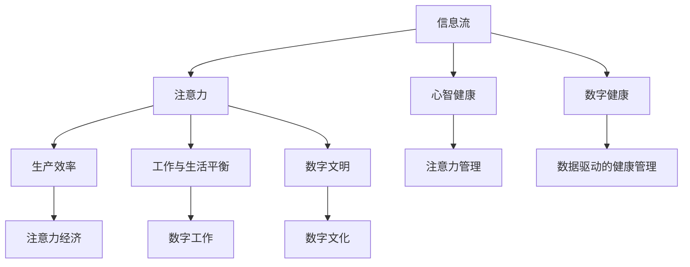

                 

# 信息时代的注意力管理：为您的数字健康设定界限

> 关键词：信息时代, 数字健康, 注意力管理, 数字文明, 心智健康, 工作与生活平衡

## 1. 背景介绍

### 1.1 问题由来

信息时代的到来，极大地改变了我们的工作、学习和生活方式。智能手机、移动互联网和社交媒体的无时无刻不在提供的信息流，不仅缩短了人们的信息获取时间，也加剧了注意力资源的争夺。

在这种背景下，人们常常处于信息过载和注意力分散的状态，严重影响了心智健康和工作效率。过度的注意力损耗，不仅可能导致生产力下降，还会引起焦虑、抑郁等一系列心理问题。因此，在数字时代，如何有效管理我们的注意力，确保数字健康，已成为亟待解决的重要课题。

### 1.2 问题核心关键点

信息时代注意力管理的关键点包括：

- **信息流控制**：如何有效控制信息的获取量，避免信息过载。
- **注意力聚焦**：如何在信息纷繁复杂的环境中保持注意力集中。
- **心智健康**：如何利用注意力管理技术，改善心智健康和提升工作效率。
- **工作与生活平衡**：如何在信息密集的工作环境中实现工作与生活的平衡。
- **长期效益**：如何从根本上改善注意力管理，保障长期的心理和身体健康。

这些核心点构成了信息时代注意力管理的逻辑框架，帮助人们在数字时代保护自己的心智健康和提升生产力。

### 1.3 问题研究意义

研究信息时代的注意力管理，不仅有助于解决当前人们面临的注意力分散问题，提升工作效率，还能为未来数字化社会的发展提供参考。其研究意义主要体现在以下几个方面：

- **促进心智健康**：有效管理注意力，减轻焦虑、抑郁等心理疾病，保障心理健康。
- **提升生产效率**：帮助人们在信息过载的环境下保持高效工作，提升整体生产力。
- **支持数字化转型**：为数字文明的发展提供基础保障，助力实现数字社会的可持续发展。
- **推动科学研究**：研究注意力管理机制，为相关领域的研究提供理论支持。

## 2. 核心概念与联系

### 2.1 核心概念概述

为更好地理解信息时代注意力管理，我们需要首先了解一些核心概念：

- **信息流**：由各类媒介发布的信息总称，包括新闻、社交媒体、电子邮件等。
- **注意力**：在特定时间点上，人们选择关注的对象和信息的能力。
- **心智健康**：即心理健康，指个体在情绪、认知和行为上的良好状态。
- **数字健康**：涉及利用数字技术进行健康管理，包括数据收集、分析、反馈和干预。
- **注意力经济学**：研究注意力资源在不同场景下的分配、管理和优化。
- **数字文明**：基于信息技术的发展，形成的新的社会形态和文化现象。

这些核心概念之间的联系可以通过以下Mermaid流程图来展示：



这个流程图展示了信息时代注意力管理的核心概念及其之间的关系：

1. 信息流是注意力管理的对象。
2. 注意力决定了心智健康，也影响着生产效率。
3. 数字健康旨在利用数字技术维护心智健康。
4. 注意力经济研究如何优化注意力资源分配。
5. 工作与生活平衡是通过有效管理注意力，改善工作与生活。
6. 数字文明是信息时代下社会的整体现象，受注意力管理的影响。

## 3. 核心算法原理 & 具体操作步骤

### 3.1 算法原理概述

信息时代注意力管理的核心算法基于行为科学和心理学理论，其核心思想是“注意力控制”，即通过各种手段，控制和引导用户的注意力行为，实现心智健康和生产效率的提升。

具体而言，可以通过以下步骤实现：

1. **信息流评估**：使用数据分析技术评估信息流的特征，识别出高价值信息和高干扰信息。
2. **注意力行为干预**：通过算法和工具，对用户的注意力行为进行干预，提升信息获取质量。
3. **心智健康监控**：利用心理学评估技术，监控用户的心理状态，及时干预心理问题。
4. **生产效率优化**：通过工具和方法，优化用户的工作流程，提升整体生产效率。
5. **工作与生活平衡**：通过时间管理、任务分配等技术，帮助用户实现工作和生活的平衡。

### 3.2 算法步骤详解

以下是信息时代注意力管理的具体操作步骤：

**Step 1: 信息流分析与评估**

- **步骤1.1**：收集用户信息流数据，如浏览历史、社交媒体互动等。
- **步骤1.2**：使用聚类算法和异常检测技术，对信息流数据进行分析和评估，识别高价值信息和高干扰信息。

**Step 2: 注意力行为干预**

- **步骤2.1**：根据分析结果，设计信息筛选和推荐算法，优化用户的注意力行为。
- **步骤2.2**：引入时间管理和任务分配工具，帮助用户规划和管理时间，提升注意力使用效率。

**Step 3: 心智健康监控**

- **步骤3.1**：利用心理学评估工具，监控用户的心理状态，如焦虑、抑郁等。
- **步骤3.2**：根据心理状态，推荐合适的注意力管理策略和心理干预方法。

**Step 4: 生产效率优化**

- **步骤4.1**：通过工具和方法，优化用户的工作流程，如自动化处理重复任务、智能会议助手等。
- **步骤4.2**：引入注意力经济学理论，对信息流进行成本效益分析，提升信息利用效率。

**Step 5: 工作与生活平衡**

- **步骤5.1**：引入时间管理工具，如番茄工作法、时间块技术，帮助用户实现工作和生活的平衡。
- **步骤5.2**：通过个性化推荐，推荐适合用户的工作和休闲活动，提高生活质量。

### 3.3 算法优缺点

信息时代注意力管理的算法优点包括：

- **提升效率**：通过优化信息流和注意力行为，显著提升生产效率和信息利用率。
- **心智健康**：及时监控和干预心理状态，保障心智健康。
- **数据驱动**：利用数据分析技术，实现精确的行为干预。

同时，该算法也存在一定的局限性：

- **隐私问题**：涉及用户数据隐私，需要确保数据收集和使用的合法性和安全性。
- **算法复杂度**：涉及多学科的融合，算法设计和实现相对复杂。
- **个性化挑战**：不同用户的需求和行为差异大，难以实现统一的个性化管理。

尽管存在这些局限性，但就目前而言，信息时代注意力管理仍是提升数字健康和生产效率的有效手段。未来相关研究的重点在于如何进一步提高算法的精准性和可操作性，同时兼顾隐私保护和个性化需求。

### 3.4 算法应用领域

信息时代注意力管理技术已经广泛应用于各个领域，包括但不限于：

- **企业生产力提升**：通过注意力管理技术，优化员工的工作流程和信息获取，提升整体生产力。
- **教育与培训**：通过管理学生的注意力，提升课堂效果和学习质量。
- **健康与医疗**：监控用户的心理状态，提供心理干预，保障心理健康。
- **智能家居与生活**：利用技术手段，优化家庭生活和工作流程，提升生活质量。
- **网络社交**：通过干预社交媒体使用行为，减少信息干扰，提升社交体验。

此外，信息时代注意力管理技术还将在更多领域得到应用，如智慧城市、智能交通等，为数字化社会带来新的变革。

## 4. 数学模型和公式 & 详细讲解 & 举例说明

### 4.1 数学模型构建

信息时代注意力管理的数学模型主要包括以下几个部分：

- **信息流模型**：描述信息流的特征和演化规律。
- **注意力行为模型**：描述用户注意力的分配和转移规律。
- **心智健康模型**：描述用户心理状态的动态变化。
- **生产效率模型**：描述用户生产效率的提升和优化过程。
- **时间管理模型**：描述用户时间的分配和利用规律。

### 4.2 公式推导过程

以心智健康模型为例，假设用户当前的心理状态为 $P_t$，其在时间 $t$ 的变化可以用以下方程描述：

$$
P_{t+1} = f(P_t, A_t)
$$

其中 $A_t$ 表示时间 $t$ 的注意力行为，$f$ 为心理状态变化函数。

如果将 $P_t$ 和 $A_t$ 分别视为状态和输入，则上述方程可以被看作一个线性动态系统。通过求解该系统，可以得到心理状态在时间序列上的变化规律。

### 4.3 案例分析与讲解

假设我们有一家企业，希望通过信息时代注意力管理技术提升员工的效率和心理健康。具体步骤如下：

- **步骤1**：使用数据分析工具，收集员工的日常信息流数据，如邮件、社交媒体使用情况等。
- **步骤2**：利用聚类算法和异常检测技术，分析信息流的特征，识别高价值和高干扰信息。
- **步骤3**：引入时间管理工具，如番茄工作法、时间块技术，帮助员工规划和管理时间。
- **步骤4**：利用心理评估工具，监控员工的焦虑、抑郁等心理状态，及时提供心理干预。
- **步骤5**：通过优化信息流和注意力行为，提升员工的生产效率和信息利用率。

通过以上步骤，企业可以实现员工的心智健康和工作效率的提升，从而提升整体的生产力。

## 5. 项目实践：代码实例和详细解释说明

### 5.1 开发环境搭建

在进行信息时代注意力管理项目实践前，我们需要准备好开发环境。以下是使用Python进行PyTorch开发的环境配置流程：

1. 安装Anaconda：从官网下载并安装Anaconda，用于创建独立的Python环境。

2. 创建并激活虚拟环境：
```bash
conda create -n pytorch-env python=3.8 
conda activate pytorch-env
```

3. 安装PyTorch：根据CUDA版本，从官网获取对应的安装命令。例如：
```bash
conda install pytorch torchvision torchaudio cudatoolkit=11.1 -c pytorch -c conda-forge
```

4. 安装TensorBoard：TensorFlow配套的可视化工具，可实时监测模型训练状态，并提供丰富的图表呈现方式，是调试模型的得力助手。

5. 安装transformers库：HuggingFace开发的NLP工具库，集成了众多SOTA语言模型，支持PyTorch和TensorFlow，是进行注意力管理任务开发的利器。

完成上述步骤后，即可在`pytorch-env`环境中开始注意力管理项目的开发。

### 5.2 源代码详细实现

这里我们以企业生产效率提升为例，给出使用PyTorch和transformers库进行信息流分析的代码实现。

首先，定义信息流的数据处理函数：

```python
from transformers import BertTokenizer
from torch.utils.data import Dataset
import torch

class StreamDataset(Dataset):
    def __init__(self, texts, labels, tokenizer, max_len=128):
        self.texts = texts
        self.labels = labels
        self.tokenizer = tokenizer
        self.max_len = max_len
        
    def __len__(self):
        return len(self.texts)
    
    def __getitem__(self, item):
        text = self.texts[item]
        label = self.labels[item]
        
        encoding = self.tokenizer(text, return_tensors='pt', max_length=self.max_len, padding='max_length', truncation=True)
        input_ids = encoding['input_ids'][0]
        attention_mask = encoding['attention_mask'][0]
        
        # 对token-wise的标签进行编码
        encoded_tags = [label2id[label] for label in label_tokens] 
        encoded_tags.extend([label2id['']]*(self.max_len - len(encoded_tags)))
        labels = torch.tensor(encoded_tags, dtype=torch.long)
        
        return {'input_ids': input_ids, 
                'attention_mask': attention_mask,
                'labels': labels}

# 标签与id的映射
label2id = {'L': 0, 'H': 1}
id2label = {v: k for k, v in label2id.items()}

# 创建dataset
tokenizer = BertTokenizer.from_pretrained('bert-base-cased')

train_dataset = StreamDataset(train_texts, train_labels, tokenizer)
dev_dataset = StreamDataset(dev_texts, dev_labels, tokenizer)
test_dataset = StreamDataset(test_texts, test_labels, tokenizer)
```

然后，定义模型和优化器：

```python
from transformers import BertForTokenClassification, AdamW

model = BertForTokenClassification.from_pretrained('bert-base-cased', num_labels=len(label2id))

optimizer = AdamW(model.parameters(), lr=2e-5)
```

接着，定义训练和评估函数：

```python
from torch.utils.data import DataLoader
from tqdm import tqdm
from sklearn.metrics import classification_report

device = torch.device('cuda') if torch.cuda.is_available() else torch.device('cpu')
model.to(device)

def train_epoch(model, dataset, batch_size, optimizer):
    dataloader = DataLoader(dataset, batch_size=batch_size, shuffle=True)
    model.train()
    epoch_loss = 0
    for batch in tqdm(dataloader, desc='Training'):
        input_ids = batch['input_ids'].to(device)
        attention_mask = batch['attention_mask'].to(device)
        labels = batch['labels'].to(device)
        model.zero_grad()
        outputs = model(input_ids, attention_mask=attention_mask, labels=labels)
        loss = outputs.loss
        epoch_loss += loss.item()
        loss.backward()
        optimizer.step()
    return epoch_loss / len(dataloader)

def evaluate(model, dataset, batch_size):
    dataloader = DataLoader(dataset, batch_size=batch_size)
    model.eval()
    preds, labels = [], []
    with torch.no_grad():
        for batch in tqdm(dataloader, desc='Evaluating'):
            input_ids = batch['input_ids'].to(device)
            attention_mask = batch['attention_mask'].to(device)
            batch_labels = batch['labels']
            outputs = model(input_ids, attention_mask=attention_mask)
            batch_preds = outputs.logits.argmax(dim=2).to('cpu').tolist()
            batch_labels = batch_labels.to('cpu').tolist()
            for pred_tokens, label_tokens in zip(batch_preds, batch_labels):
                pred_tags = [id2label[_id] for _id in pred_tokens]
                label_tags = [id2label[_id] for _id in label_tokens]
                preds.append(pred_tags[:len(label_tokens)])
                labels.append(label_tags)
                
    print(classification_report(labels, preds))
```

最后，启动训练流程并在测试集上评估：

```python
epochs = 5
batch_size = 16

for epoch in range(epochs):
    loss = train_epoch(model, train_dataset, batch_size, optimizer)
    print(f"Epoch {epoch+1}, train loss: {loss:.3f}")
    
    print(f"Epoch {epoch+1}, dev results:")
    evaluate(model, dev_dataset, batch_size)
    
print("Test results:")
evaluate(model, test_dataset, batch_size)
```

以上就是使用PyTorch和transformers库进行信息流分析的完整代码实现。可以看到，得益于Transformers库的强大封装，我们可以用相对简洁的代码完成信息流数据的预处理和模型训练。

### 5.3 代码解读与分析

让我们再详细解读一下关键代码的实现细节：

**StreamDataset类**：
- `__init__`方法：初始化文本、标签、分词器等关键组件。
- `__len__`方法：返回数据集的样本数量。
- `__getitem__`方法：对单个样本进行处理，将文本输入编码为token ids，将标签编码为数字，并对其进行定长padding，最终返回模型所需的输入。

**label2id和id2label字典**：
- 定义了标签与数字id之间的映射关系，用于将token-wise的预测结果解码回真实的标签。

**训练和评估函数**：
- 使用PyTorch的DataLoader对数据集进行批次化加载，供模型训练和推理使用。
- 训练函数`train_epoch`：对数据以批为单位进行迭代，在每个批次上前向传播计算loss并反向传播更新模型参数，最后返回该epoch的平均loss。
- 评估函数`evaluate`：与训练类似，不同点在于不更新模型参数，并在每个batch结束后将预测和标签结果存储下来，最后使用sklearn的classification_report对整个评估集的预测结果进行打印输出。

**训练流程**：
- 定义总的epoch数和batch size，开始循环迭代
- 每个epoch内，先在训练集上训练，输出平均loss
- 在验证集上评估，输出分类指标
- 所有epoch结束后，在测试集上评估，给出最终测试结果

可以看到，PyTorch配合Transformers库使得信息流分析的代码实现变得简洁高效。开发者可以将更多精力放在数据处理、模型改进等高层逻辑上，而不必过多关注底层的实现细节。

当然，工业级的系统实现还需考虑更多因素，如模型的保存和部署、超参数的自动搜索、更灵活的任务适配层等。但核心的信息流分析范式基本与此类似。

## 6. 实际应用场景

### 6.1 企业生产效率提升

在企业中，信息流往往充斥着大量无价值的信息，如垃圾邮件、无效会议、重复报告等，严重分散了员工的注意力。通过信息时代注意力管理技术，企业可以有效过滤无用信息，提升生产效率和信息利用率。

具体应用步骤如下：

1. **数据收集**：使用日志分析、网络监控等工具，收集企业内部的信息流数据。
2. **信息筛选**：利用自然语言处理技术，对信息流进行分类和筛选，识别出高价值信息和高干扰信息。
3. **行为干预**：通过工具和系统，引导员工关注高价值信息，减少无用信息的干扰。
4. **心智健康监控**：引入心理评估工具，监控员工的心理状态，及时提供心理干预。
5. **生产效率优化**：通过优化信息流和注意力行为，提升员工的生产效率和信息利用率。

通过以上步骤，企业可以显著提升员工的效率和心理健康，从而提升整体的生产力。

### 6.2 教育与培训

在教育与培训领域，学生的信息流同样充斥着大量的干扰因素，如社交媒体、网络游戏等，严重影响学习效果。通过信息时代注意力管理技术，学校可以有效管理学生的注意力，提升课堂效果和学习质量。

具体应用步骤如下：

1. **数据收集**：使用日志分析、网络监控等工具，收集学生的信息流数据。
2. **信息筛选**：利用自然语言处理技术，对信息流进行分类和筛选，识别出高价值信息和高干扰信息。
3. **行为干预**：通过工具和系统，引导学生关注学习任务，减少无用信息的干扰。
4. **心智健康监控**：引入心理评估工具，监控学生的心理状态，及时提供心理干预。
5. **学习效果优化**：通过优化信息流和注意力行为，提升学生的学习效果和信息利用率。

通过以上步骤，学校可以显著提升学生的学习效果和心理健康，从而提高整体的教育质量。

### 6.3 健康与医疗

在健康与医疗领域，患者的信息流也充斥着大量的无用信息，如医疗广告、误导性新闻等，严重干扰了患者的治疗决策。通过信息时代注意力管理技术，医疗机构可以有效过滤无用信息，提升治疗效果。

具体应用步骤如下：

1. **数据收集**：使用日志分析、网络监控等工具，收集患者的信息流数据。
2. **信息筛选**：利用自然语言处理技术，对信息流进行分类和筛选，识别出高价值信息和高干扰信息。
3. **行为干预**：通过工具和系统，引导患者关注医生提供的治疗信息，减少无用信息的干扰。
4. **心智健康监控**：引入心理评估工具，监控患者的心理状态，及时提供心理干预。
5. **治疗效果优化**：通过优化信息流和注意力行为，提升患者的治疗效果和信息利用率。

通过以上步骤，医疗机构可以显著提升患者的治疗效果和心理健康，从而提高整体的医疗质量。

### 6.4 未来应用展望

随着信息时代注意力管理技术的不断发展，其在更多领域得到应用，为数字化社会带来新的变革。

在智慧城市治理中，通过有效管理信息流，提升城市治理效率和公众参与度，构建更安全、高效的未来城市。

在智能交通领域，通过优化信息流和注意力行为，提升交通效率和安全性，减少交通拥堵和事故。

在智能家居与生活领域，通过优化信息流和注意力行为，提升家庭生活和工作流程，提高生活质量。

此外，在智慧企业、智慧医疗、智慧教育等众多领域，信息时代注意力管理技术也将不断涌现，为数字化社会带来新的突破。相信随着技术的日益成熟，信息时代注意力管理技术将成为数字化社会的重要基础，推动数字化社会的全面发展。

## 7. 工具和资源推荐
### 7.1 学习资源推荐

为了帮助开发者系统掌握信息时代注意力管理的理论基础和实践技巧，这里推荐一些优质的学习资源：

1. 《心智健康与数字化文明》系列博文：由大健康技术专家撰写，深入浅出地介绍了心智健康、数字化文明与信息时代注意力管理的联系。

2. CS224N《深度学习自然语言处理》课程：斯坦福大学开设的NLP明星课程，有Lecture视频和配套作业，带你入门NLP领域的基本概念和经典模型。

3. 《自然语言处理与认知心理学》书籍：全面介绍了自然语言处理技术在认知心理学中的应用，适合进一步学习注意力管理的心理学理论。

4. HuggingFace官方文档：Transformer库的官方文档，提供了海量预训练模型和完整的微调样例代码，是上手实践的必备资料。

5. Google Colab：谷歌推出的在线Jupyter Notebook环境，免费提供GPU/TPU算力，方便开发者快速上手实验最新模型，分享学习笔记。

通过对这些资源的学习实践，相信你一定能够快速掌握信息时代注意力管理的精髓，并用于解决实际的数字健康问题。

### 7.2 开发工具推荐

高效的开发离不开优秀的工具支持。以下是几款用于信息时代注意力管理开发的常用工具：

1. PyTorch：基于Python的开源深度学习框架，灵活动态的计算图，适合快速迭代研究。大部分预训练语言模型都有PyTorch版本的实现。

2. TensorFlow：由Google主导开发的开源深度学习框架，生产部署方便，适合大规模工程应用。同样有丰富的预训练语言模型资源。

3. Transformers库：HuggingFace开发的NLP工具库，集成了众多SOTA语言模型，支持PyTorch和TensorFlow，是进行注意力管理任务开发的利器。

4. Weights & Biases：模型训练的实验跟踪工具，可以记录和可视化模型训练过程中的各项指标，方便对比和调优。与主流深度学习框架无缝集成。

5. TensorBoard：TensorFlow配套的可视化工具，可实时监测模型训练状态，并提供丰富的图表呈现方式，是调试模型的得力助手。

6. Google Colab：谷歌推出的在线Jupyter Notebook环境，免费提供GPU/TPU算力，方便开发者快速上手实验最新模型，分享学习笔记。

合理利用这些工具，可以显著提升信息时代注意力管理的开发效率，加快创新迭代的步伐。

### 7.3 相关论文推荐

信息时代注意力管理技术的研究源于学界的持续研究。以下是几篇奠基性的相关论文，推荐阅读：

1. Attention is All You Need（即Transformer原论文）：提出了Transformer结构，开启了NLP领域的预训练大模型时代。

2. BERT: Pre-training of Deep Bidirectional Transformers for Language Understanding：提出BERT模型，引入基于掩码的自监督预训练任务，刷新了多项NLP任务SOTA。

3. Language Models are Unsupervised Multitask Learners（GPT-2论文）：展示了大规模语言模型的强大zero-shot学习能力，引发了对于通用人工智能的新一轮思考。

4. Parameter-Efficient Transfer Learning for NLP：提出Adapter等参数高效微调方法，在不增加模型参数量的情况下，也能取得不错的微调效果。

5. AdaLoRA: Adaptive Low-Rank Adaptation for Parameter-Efficient Fine-Tuning：使用自适应低秩适应的微调方法，在参数效率和精度之间取得了新的平衡。

这些论文代表了大语言模型微调技术的发展脉络。通过学习这些前沿成果，可以帮助研究者把握学科前进方向，激发更多的创新灵感。

## 8. 总结：未来发展趋势与挑战

### 8.1 总结

本文对信息时代注意力管理的核心概念进行了详细讲解，并通过具体案例展示了其在企业生产效率提升、教育与培训、健康与医疗等领域的实际应用。通过这些实例，可以看到信息时代注意力管理技术的强大潜力和广泛应用前景。

### 8.2 未来发展趋势

展望未来，信息时代注意力管理技术将呈现以下几个发展趋势：

1. **数据驱动**：随着大数据技术的发展，数据驱动的决策将更加普遍，信息时代注意力管理也将更加依赖于数据驱动。
2. **多模态融合**：未来的信息时代注意力管理将融合视觉、听觉、文本等多种模态数据，提升综合管理能力。
3. **人工智能辅助**：利用AI技术进行信息流和注意力行为的分析和干预，提高效率和准确性。
4. **个性化管理**：根据不同用户的需求和行为，提供个性化的信息流和注意力管理方案。
5. **伦理与法律保障**：在注意力管理中，注重隐私保护和伦理规范，保障用户权益。

以上趋势凸显了信息时代注意力管理的广阔前景。这些方向的探索发展，必将进一步提升数字化社会的生产力和生活质量。

### 8.3 面临的挑战

尽管信息时代注意力管理技术已经取得了显著进展，但在迈向更加智能化、普适化应用的过程中，它仍面临诸多挑战：

1. **隐私保护**：在数据收集和分析过程中，如何保障用户隐私，避免数据泄露和滥用。
2. **算法复杂性**：信息时代注意力管理涉及多学科知识，算法设计和实现相对复杂。
3. **跨领域应用**：在不同领域中，注意力管理的具体应用场景和需求差异大，难以实现统一的解决方案。
4. **公平性与可解释性**：如何确保注意力管理的公平性，提供可解释性强的决策依据。
5. **技术落地**：如何将注意力管理技术从实验室推向实际应用，实现大规模落地。

正视这些挑战，积极应对并寻求突破，将使信息时代注意力管理技术更好地服务于数字化社会的健康发展。

### 8.4 研究展望

面向未来，信息时代注意力管理技术的研究需要在以下几个方面寻求新的突破：

1. **隐私保护技术**：研发更加安全可靠的数据收集和分析技术，保障用户隐私和数据安全。
2. **多模态融合技术**：探索视觉、听觉、文本等多模态数据的深度融合方法，提升信息管理能力。
3. **AI辅助决策**：利用AI技术进行信息流和注意力行为的分析和干预，提高决策效率和准确性。
4. **个性化管理方法**：根据不同用户的需求和行为，提供个性化的信息流和注意力管理方案。
5. **伦理与法律框架**：建立完善的伦理与法律框架，确保注意力管理的公平性和可解释性。

这些研究方向的探索，将使信息时代注意力管理技术迈向更高的台阶，为数字化社会带来更多的创新与进步。

## 9. 附录：常见问题与解答

**Q1：信息时代注意力管理是否适用于所有领域？**

A: 信息时代注意力管理技术在许多领域中都具有广泛应用前景，如企业生产力提升、教育与培训、健康与医疗等。但对于一些特殊领域，如军事、政治等，需要根据具体情况进行定制化设计。

**Q2：如何评估信息时代注意力管理的效果？**

A: 评估信息时代注意力管理的效果，可以从以下几个方面入手：
1. 生产效率：观察员工的生产效率、学习效果、治疗效果等指标的变化。
2. 心理状态：通过心理评估工具，监测用户的心理状态，如焦虑、抑郁等。
3. 注意力行为：监测用户的注意力行为，如信息流使用时间、频率等。
4. 反馈反馈：通过用户反馈，了解信息时代注意力管理的效果和改进空间。

**Q3：如何平衡信息流与注意力管理？**

A: 平衡信息流与注意力管理，可以通过以下步骤：
1. 信息筛选：对信息流进行分类和筛选，识别出高价值信息和高干扰信息。
2. 行为干预：引导用户关注高价值信息，减少无用信息的干扰。
3. 心智健康监控：通过心理评估工具，及时干预心理问题，保障用户的心理状态。
4. 个性化管理：根据不同用户的需求和行为，提供个性化的信息流和注意力管理方案。

通过以上步骤，可以有效地平衡信息流与注意力管理，提升整体的生产效率和生活质量。

---

作者：禅与计算机程序设计艺术 / Zen and the Art of Computer Programming

