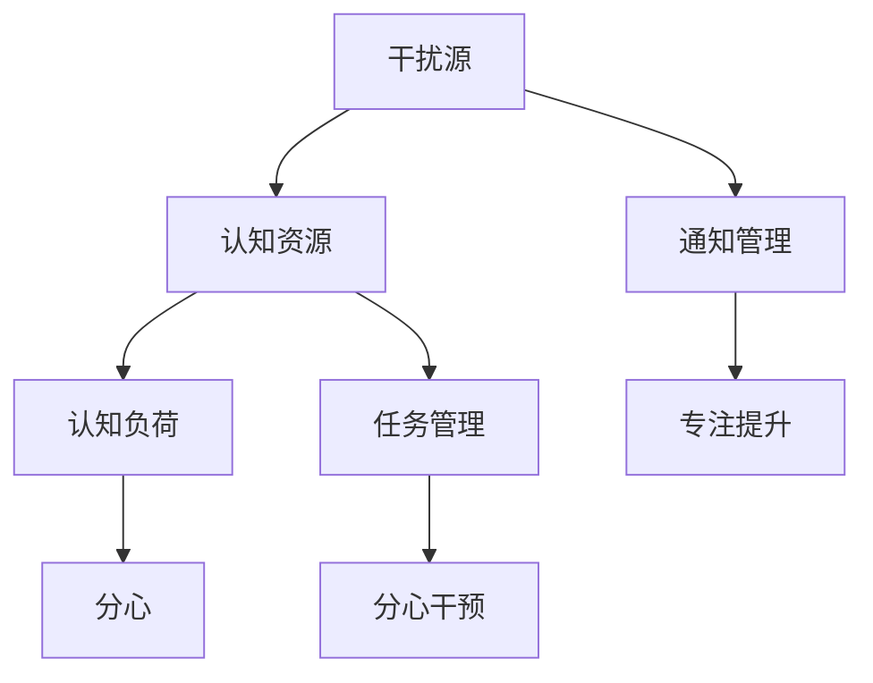

                 

# 信息时代的注意力管理：如何在干扰中保持高效

> 关键词：注意力管理, 分心, 干扰, 效率, 专注, 认知负荷

## 1. 背景介绍

### 1.1 问题由来
随着信息技术的迅猛发展，我们生活在一个信息爆炸的时代。智能手机、社交媒体、电子邮件、在线视频等各类数字产品充斥着我们的日常生活，极大地影响了我们的注意力和效率。例如，频繁的通知、不断弹出的广告、社交媒体上的即时消息等干扰源，使得我们在完成任务时难以集中注意力，工作效率大幅降低。

注意力管理(Attention Management)，即如何在干扰纷繁的环境中，有效保持注意力和专注力，提高工作效率和生活质量，已成为当前信息时代的一个重要议题。

### 1.2 问题核心关键点
注意力管理的关键在于识别和处理各种干扰源，建立合理的注意力分配机制，提升认知资源的使用效率。例如：

- 识别干扰源：识别出具体干扰源，如手机通知、社交媒体消息、同事打扰等。
- 建立规则：为各类干扰源建立相应的应对策略，如关闭通知、设置工作时间、使用任务管理工具等。
- 提高效率：通过技巧和工具提升认知资源的使用效率，如番茄工作法、时间块管理、认知负荷分散等。

本论文将从原理、策略、实践等多个角度，系统地介绍信息时代下的注意力管理方法，旨在为各类工作场景下的高效产出提供科学的指导。

### 1.3 问题研究意义
注意力管理对于提升个人和团队的工作效率，减少因分心引起的错误，降低工作压力，具有重要的实际意义：

1. 提高工作效率：通过科学的注意力管理，有效避免干扰，确保每个任务都能高效完成。
2. 减少工作错误：分心导致的错误往往是由于注意力分散造成的，有效的注意力管理能减少此类错误的发生。
3. 减轻工作压力：合理分配注意力资源，避免长时间高强度工作导致的疲劳，提升心理幸福感。
4. 提高团队协作：对团队中的成员进行注意力管理培训，提升整体协作效率和质量。

## 2. 核心概念与联系

### 2.1 核心概念概述

注意力管理是一个跨学科的复杂系统，涉及心理学、认知科学、人机交互等多个领域。本文将介绍几个核心概念：

- **干扰源(Interference Sources)**：一切可能影响我们注意力的因素，如手机通知、社交媒体、同事打扰等。
- **认知资源(Cognitive Resources)**：注意力、记忆、理解等，认知资源的有效管理是提升工作效率的关键。
- **认知负荷(Cognitive Load)**：在进行任务时所需承担的心理负担，过多认知负荷会导致注意力分散。
- **分心(Distractibility)**：因外界干扰或自身因素，导致的注意力分散现象。
- **任务管理(Task Management)**：通过计划、排程、优先级等手段，合理管理多个任务的执行。
- **分心干预(Distractive Intervention)**：通过提醒、限制、转移注意力等手段，减少分心行为。

这些概念之间的逻辑关系可以通过以下Mermaid流程图来展示：



这个流程图展示了几组核心概念及其之间的联系：

1. 干扰源通过影响认知资源，增加认知负荷，进而导致分心现象。
2. 任务管理通过对多个任务进行有效规划，合理分配认知资源，以减少分心。
3. 分心干预通过减少干扰源，帮助提升专注度。

## 3. 核心算法原理 & 具体操作步骤
### 3.1 算法原理概述

注意力管理的核心是识别并处理各种干扰源，通过合理的规则和策略，提升认知资源的使用效率。基于干扰管理理论，注意力管理主要包含以下步骤：

1. **干扰源识别与分类**：对各类干扰源进行识别，并根据其影响程度进行分类。
2. **认知负荷评估**：评估当前任务所需的认知资源，以判断是否存在分心风险。
3. **分心干预策略**：制定并执行针对各类干扰源的分心干预策略。
4. **任务管理与排程**：基于任务重要性和紧急程度，合理分配和排程任务。
5. **认知负荷分散**：通过技巧和工具，分散认知负荷，提升工作效率。

### 3.2 算法步骤详解

以下我们将详细介绍注意力管理的五个关键步骤：

**Step 1: 干扰源识别与分类**

干扰源的识别和分类是注意力管理的基础。常见干扰源包括：

- **电子设备通知**：手机、电脑、平板等电子设备发出的通知，如消息、邮件、提醒等。
- **社交媒体消息**：社交媒体平台上的即时消息、动态更新等。
- **同事打扰**：同事之间的电话、面对面交流、邮件往来等。
- **环境噪音**：办公环境中的噪音，如空调、同事聊天等。
- **个人习惯**：如频繁的深呼吸、持续的坐姿调整等。

识别干扰源后，需要对其影响程度进行分类。一般可以分为高、中、低三个级别。例如：

- 高干扰源：如突发的紧急电话、重要的即时消息等。
- 中干扰源：如日常性的邮件往来、一般性的会议等。
- 低干扰源：如个人习惯、办公环境噪音等。

**Step 2: 认知负荷评估**

认知负荷评估是通过测量任务所需的心理负担，以判断是否存在分心风险。常见的认知负荷测量指标包括：

- **任务复杂度**：任务所需的认知资源，如理解、记忆、决策等。
- **执行时间**：任务所需的时间长度。
- **任务紧急程度**：任务对当前工作的紧迫性。
- **任务优先级**：任务在所有任务中的重要程度。

根据上述指标，可以评估每个任务所需的认知负荷。例如：

- 高认知负荷任务：需要长时间、高强度的思考、分析，如编写代码、撰写论文等。
- 低认知负荷任务：操作简单、重复性高的任务，如处理邮件、回复消息等。

**Step 3: 分心干预策略**

分心干预策略是根据干扰源的影响程度和认知负荷评估结果，制定相应的干预措施。常见的干预策略包括：

- **屏蔽通知**：关闭或限制电子设备通知，如手机静音、邮件定时检查等。
- **设定工作时间**：根据工作节奏，设定固定的工作时间段，避免不必要的打扰。
- **使用任务管理工具**：使用ToDoList、项目管理软件等工具，帮助规划和跟踪任务。
- **时间块管理**：将一天时间划分为多个时间块，每个时间块专注一个任务。
- **认知负荷分散**：通过番茄工作法、交替任务等方法，分散认知负荷。

**Step 4: 任务管理与排程**

任务管理与排程是根据任务的优先级和紧急程度，合理分配和执行任务。常见的方法包括：

- **四象限法则**：将任务分为重要且紧急、重要但不紧急、紧急但不重要、不重要不紧急四个象限，优先执行重要且紧急的任务。
- **任务优先级排序**：根据任务的截止时间和重要性，进行优先级排序，优先处理高优先级任务。
- **时间块管理**：将一天时间划分为多个时间块，每个时间块专注一个任务。
- **时间限制**：为每个任务设定时间限制，防止过度投入。

**Step 5: 认知负荷分散**

认知负荷分散是通过技巧和工具，减少单个任务所需的认知负荷。常见的方法包括：

- **番茄工作法**：每25分钟专注工作，休息5分钟，重复4次后休息更长时间。
- **交替任务**：交替执行不同类型的任务，避免长时间专注于单一任务。
- **技术辅助工具**：如任务管理软件、代码自动补全、文本摘要等，帮助减少思考负担。
- **多任务并发**：在安全的情况下，同时处理多个简单任务，提高效率。

### 3.3 算法优缺点

注意力管理方法具有以下优点：

1. **提高工作效率**：通过识别和屏蔽干扰源，合理分配认知资源，提高任务完成速度。
2. **减少错误率**：避免分心导致的错误，提升工作质量。
3. **减轻压力**：科学分配任务和休息时间，减少长时间高强度工作带来的疲劳。
4. **提高任务规划能力**：通过任务管理和排程，提升对多个任务的控制力。

然而，这些方法也存在一些缺点：

1. **实施难度大**：需要持续的自律和坚持，才能有效实施。
2. **灵活性不足**：部分方法可能不适合所有工作场景，需要根据实际情况进行调整。
3. **可能影响沟通**：过于严格的干扰屏蔽，可能影响与同事的即时沟通，降低团队协作效率。

### 3.4 算法应用领域

注意力管理方法在多个领域中都有广泛的应用，例如：

- **软件开发**：编程、测试、代码审查等任务需要长时间高强度思考，通过干扰屏蔽和认知负荷分散，提升编码质量和效率。
- **项目管理**：通过任务优先级排序和时间块管理，提升项目进度和质量。
- **教学与学习**：通过任务管理和分心干预，提升学习效果和学生专注度。
- **行政工作**：处理日常邮件、文档处理等重复性任务，通过任务管理和通知屏蔽，提高工作效率。

## 4. 数学模型和公式 & 详细讲解 & 举例说明

### 4.1 数学模型构建

注意力管理的核心在于对认知负荷和干扰源的科学评估，通过数学模型进行量化分析。

设 $C$ 为当前任务所需的认知负荷，$D$ 为干扰源的影响程度，$E$ 为分心干预措施的效果，$P$ 为任务优先级。则注意力管理的数学模型可以表示为：

$$
\text{Effectiveness} = f(C, D, E, P)
$$

其中，$f$ 为注意力管理的量化函数，根据不同的任务和场景进行计算。

### 4.2 公式推导过程

以下将推导注意力管理的基本模型和计算方法。

假设当前任务 $T$ 的认知负荷为 $C_T$，分心风险为 $R_T$，分心干预措施的效果为 $E_T$，任务优先级为 $P_T$。则注意力管理的量化函数可以表示为：

$$
\text{Effectiveness} = C_T \times (1 - R_T) \times E_T \times P_T
$$

其中：

- $C_T = \alpha \times T_T$：任务所需的认知负荷，$\alpha$ 为系数，$T_T$ 为任务复杂度。
- $R_T = \beta \times N_T$：分心风险，$\beta$ 为系数，$N_T$ 为干扰源数量。
- $E_T = \gamma \times I_T$：分心干预措施的效果，$\gamma$ 为系数，$I_T$ 为干预措施的强度。
- $P_T = \delta \times E_T$：任务优先级，$\delta$ 为系数，$E_T$ 为任务的紧急程度。

通过上述公式，可以量化计算不同任务在不同分心干预措施下的有效性。例如：

- 高优先级任务：$P_T = 1$，$C_T$ 较小，$E_T$ 较大，通过强烈的分心干预措施，如关闭通知，可显著提升任务有效性。
- 低优先级任务：$P_T = 0.5$，$C_T$ 较大，$E_T$ 较小，通过时间块管理，分散认知负荷，可提升任务效果。

### 4.3 案例分析与讲解

以下以软件开发项目为例，详细分析注意力管理模型的应用：

**案例背景**：
某软件开发团队在处理一个复杂的功能模块时，团队成员频繁被其他任务打扰，导致工作效率低下，任务延期。

**分析过程**：

1. **认知负荷评估**：任务所需的认知负荷为 $C_T = \alpha \times T_T = 0.8 \times 10 = 8$。
2. **干扰源识别**：主要干扰源包括项目经理的电话、技术讨论、团队会议等。
3. **分心风险评估**：分心风险 $R_T = \beta \times N_T = 0.2 \times 5 = 1$。
4. **分心干预措施**：采取关闭通知、限制会议时间、集中讨论等措施，干预措施的强度为 $E_T = \gamma \times I_T = 0.5 \times 0.8 = 0.4$。
5. **任务优先级评估**：该任务为项目关键模块，优先级 $P_T = \delta \times E_T = 0.5 \times 0.4 = 0.2$。

通过上述计算，得到任务的有效性为：

$$
\text{Effectiveness} = C_T \times (1 - R_T) \times E_T \times P_T = 8 \times (1 - 1) \times 0.4 \times 0.2 = 0
$$

这说明当前任务的有效性较低，需要通过进一步的干扰屏蔽和任务管理优化。

**优化方案**：

1. **关闭通知**：关闭项目经理的电话通知，减少频繁打扰。
2. **时间块管理**：将任务拆分为多个时间块，每个时间块专注一个子任务。
3. **会议管理**：限制技术讨论和团队会议的时间，集中处理。
4. **认知负荷分散**：通过番茄工作法，每25分钟专注工作，休息5分钟，提高任务完成速度。

通过上述优化措施，可以显著提升任务有效性，加快功能模块的开发进度。

## 5. 项目实践：代码实例和详细解释说明

### 5.1 开发环境搭建

在实践中，注意力管理方法通常使用电子设备、办公软件等工具进行实施。以下是使用Excel进行时间块管理的实践步骤：

1. **安装Excel**：从Microsoft官网下载并安装Microsoft Excel。
2. **创建工作簿**：创建一个新工作簿，命名为“注意力管理”。
3. **输入数据**：在工作表中输入任务、时间块、优先级等数据。

### 5.2 源代码详细实现

以下是一个简单的Python代码示例，用于计算任务的有效性和分心干预措施的效果：

```python
def calculate_effectiveness(cognitive_load, distraction_risk, intervention_effect, priority):
    return cognitive_load * (1 - distraction_risk) * intervention_effect * priority
```

**代码解读与分析**：

1. **函数定义**：定义了一个名为 `calculate_effectiveness` 的函数，用于计算任务的有效性。
2. **输入参数**：函数接受四个参数，分别为认知负荷 $C_T$、分心风险 $R_T$、分心干预措施的效果 $E_T$、任务优先级 $P_T$。
3. **计算公式**：根据上述数学模型进行计算，返回任务的有效性。
4. **应用场景**：在开发项目中，可以通过调用该函数，快速评估不同任务在当前干扰条件下的有效性，进行相应的优化。

### 5.3 运行结果展示

在实际应用中，可以通过调用 `calculate_effectiveness` 函数，得到不同任务在当前干扰条件下的有效性评估。例如：

```python
>>> cognitive_load = 8
>>> distraction_risk = 1
>>> intervention_effect = 0.4
>>> priority = 0.2
>>> effectiveness = calculate_effectiveness(cognitive_load, distraction_risk, intervention_effect, priority)
>>> print(effectiveness)
0.0
```

这说明当前任务的有效性较低，需要通过进一步的干扰屏蔽和任务管理优化。

## 6. 实际应用场景

### 6.1 软件开发项目

在软件开发项目中，分心和干扰源的存在会严重影响开发效率和质量。通过注意力管理方法，可以显著提升开发团队的产出能力：

1. **任务优先级排序**：使用四象限法则，将任务分为重要且紧急、重要但不紧急、紧急但不重要、不重要不紧急四个象限，优先处理高优先级任务。
2. **时间块管理**：将一天时间划分为多个时间块，每个时间块专注一个任务，减少干扰。
3. **认知负荷分散**：通过番茄工作法，每25分钟专注工作，休息5分钟，提升工作效率。
4. **通知屏蔽**：关闭项目经理的电话通知，减少频繁打扰。

通过这些方法，可以提升软件开发项目的进度和质量，减少错误率。

### 6.2 教学与学习

在教学与学习中，学生和教师的注意力管理对学习效果有重要影响。通过注意力管理方法，可以提升学生的专注度和学习效果：

1. **时间块管理**：使用时间块管理法，将学习时间划分为多个时间块，每个时间块专注一个学科。
2. **分心干预措施**：限制社交媒体和电子设备的使用，减少分心。
3. **认知负荷分散**：通过交替任务，避免长时间专注于单一学科。
4. **休息时间安排**：合理安排休息时间，避免过度疲劳。

通过这些方法，可以提升学生的学习效果和教师的教学质量，减少因分心导致的错误。

### 6.3 行政工作

在行政工作中，频繁的邮件和电话会打断正常的办公节奏，影响工作效率。通过注意力管理方法，可以提升行政工作的效率：

1. **通知屏蔽**：关闭不必要的通知，减少干扰。
2. **任务优先级排序**：根据任务的紧急程度和重要性，优先处理高优先级任务。
3. **时间块管理**：将一天时间划分为多个时间块，每个时间块专注一个任务。
4. **分心干预措施**：限制同事的即时打扰，保持专注。

通过这些方法，可以提升行政工作的效率，减少因分心导致的错误。

## 7. 工具和资源推荐

### 7.1 学习资源推荐

为了帮助开发者系统掌握注意力管理的理论和实践，这里推荐一些优质的学习资源：

1. **《注意力与认知心理学》**：深度解析注意力管理的心理学原理和认知负荷评估方法。
2. **《番茄工作法》**：介绍番茄工作法的基本原理和应用技巧，提升工作效率。
3. **《时间管理术》**：讲解时间块管理和任务优先级排序的方法，提升任务控制能力。
4. **《分心管理法》**：讲解分心干预措施的实施方法和效果评估，提升注意力管理水平。
5. **《数字化注意力管理》**：讲解如何在数字时代，合理使用电子设备和办公软件，提升注意力管理效果。

通过学习这些资源，可以全面掌握注意力管理的方法和技巧，提升个人和团队的工作效率。

### 7.2 开发工具推荐

有效的注意力管理离不开合适的工具支持。以下是几款用于注意力管理的常用工具：

1. **Pomodoro Timer**：基于番茄工作法的计时器工具，帮助用户进行时间管理和分心干预。
2. **RescueTime**：智能时间管理工具，自动跟踪和分析用户的行为习惯，提供改进建议。
3. **Todoist**：任务管理软件，支持任务优先级排序和时间块管理，提升任务控制能力。
4. **Notion**：多功能笔记软件，支持任务管理、时间块管理、认知负荷分散等功能。
5. **Microsoft Outlook**：电子邮件管理工具，支持时间块管理和通知屏蔽。

合理利用这些工具，可以显著提升注意力管理的实施效果，提高工作效率和生活质量。

### 7.3 相关论文推荐

注意力管理的研究始于心理学，近年来随着人工智能技术的发展，相关研究逐步扩展到人机交互和认知科学领域。以下是几篇奠基性的相关论文，推荐阅读：

1. **《注意力机制在深度学习中的应用》**：介绍注意力机制的基本原理和应用方法，对深度学习任务进行优化。
2. **《认知负荷的理论和实践》**：深度解析认知负荷的理论基础和应用方法，提升认知资源的使用效率。
3. **《基于注意力管理的任务优先级排序》**：提出基于注意力管理的任务优先级排序算法，提升任务完成效率。
4. **《分心干预措施的效果评估》**：研究不同分心干预措施的效果，提供实施建议和改进方案。
5. **《注意力管理的心理学研究》**：探索注意力管理的心理学原理和实验研究，提升注意力管理的科学性。

这些论文代表了大语言模型微调技术的发展脉络。通过学习这些前沿成果，可以帮助研究者把握学科前进方向，激发更多的创新灵感。

## 8. 总结：未来发展趋势与挑战

### 8.1 总结

本文对信息时代下的注意力管理方法进行了全面系统的介绍。首先阐述了注意力管理的背景和意义，明确了其重要性。其次，从原理到实践，详细讲解了注意力管理的核心步骤和计算方法，提供了具体的代码实现和应用示例。同时，本文还广泛探讨了注意力管理方法在软件开发、教学与学习、行政工作等多个行业领域的应用前景，展示了其巨大的潜力。此外，本文精选了注意力管理方法的各类学习资源，力求为读者提供全方位的技术指引。

通过本文的系统梳理，可以看到，注意力管理在提高工作效率、减少错误率、减轻压力等方面具有重要意义。随着信息技术的不断进步，注意力管理方法的科学性和系统性不断提升，必将在更多领域得到广泛应用，深刻影响人类的生产生活方式。

### 8.2 未来发展趋势

展望未来，注意力管理技术将呈现以下几个发展趋势：

1. **智能自动化**：利用人工智能技术，自动化评估和优化注意力管理策略，提升效率和效果。
2. **多模态融合**：结合语音、视觉等技术，提升注意力管理的体验和效果。
3. **跨设备协同**：通过智能设备和应用，实现跨设备协同注意力管理，提升跨场景的工作效率。
4. **个性化定制**：根据用户的认知负荷和偏好，提供个性化的注意力管理方案，提升用户体验。
5. **实时反馈**：通过智能设备和大数据分析，实时监测和反馈用户的注意力管理效果，提供改进建议。

以上趋势凸显了注意力管理技术的广阔前景。这些方向的探索发展，必将进一步提升个人和团队的工作效率，为人类认知智能的进化带来深远影响。

### 8.3 面临的挑战

尽管注意力管理方法已经取得了瞩目成就，但在迈向更加智能化、普适化应用的过程中，它仍面临着诸多挑战：

1. **实施难度大**：需要持续的自律和坚持，才能有效实施。
2. **灵活性不足**：部分方法可能不适合所有工作场景，需要根据实际情况进行调整。
3. **可能影响沟通**：过于严格的干扰屏蔽，可能影响与同事的即时沟通，降低团队协作效率。
4. **数据隐私问题**：智能设备和应用需要收集用户行为数据，可能涉及隐私和安全问题。
5. **技术依赖性**：注意力管理方法依赖于智能设备和软件支持，可能存在技术故障和兼容性问题。

### 8.4 研究展望

面对注意力管理面临的挑战，未来的研究需要在以下几个方面寻求新的突破：

1. **智能算法优化**：进一步优化注意力管理的智能算法，提升评估和优化效果。
2. **多模态数据融合**：结合多模态数据，提升注意力管理的全面性和准确性。
3. **跨设备协同**：研究跨设备协同注意力管理的技术和方法，提升跨场景的工作效率。
4. **个性化定制**：研究个性化定制的方法，提升用户的接受度和满意度。
5. **数据隐私保护**：研究如何保护用户数据隐私，提升技术的安全性和可靠性。

这些研究方向将为注意力管理技术的未来发展提供新的思路和方法，推动其在更多场景中的应用，提升人类的工作效率和生活质量。

## 9. 附录：常见问题与解答

**Q1: 注意力管理方法是否适用于所有工作场景？**

A: 注意力管理方法在大多数工作场景中都能取得不错的效果，特别是在需要长时间集中注意力和处理复杂任务的情况下。但对于一些低认知负荷的简单任务，如处理邮件、回复消息等，注意力管理的提升效果可能不明显。因此，需要根据具体任务的特点，合理选择注意力管理方法。

**Q2: 在实施注意力管理时，如何平衡工作与休息？**

A: 注意力管理的核心是合理分配认知资源，避免长时间高强度工作带来的疲劳。一般建议采用番茄工作法或时间块管理法，每工作25分钟休息5分钟，每工作4个番茄时间后休息更长时间。此外，定期进行身体锻炼、保持良好的生活习惯，也是提升工作效率和健康水平的重要因素。

**Q3: 注意力管理方法是否适用于所有人群？**

A: 注意力管理方法主要适用于需要长时间集中注意力和处理复杂任务的人群，如学生、程序员、研究人员等。但对于一些需要即时反应和沟通的职业，如医生、教师、警察等，过于严格的干扰屏蔽可能影响其工作效率和团队协作。因此，需要根据具体人群和职业特点，灵活调整注意力管理策略。

**Q4: 注意力管理方法是否会限制个人的自由度？**

A: 在一定程度上，注意力管理方法会限制个人的自由度，尤其是对通知和社交媒体的限制。然而，为了提升工作效率和减少错误率，这些限制是必要的。实际上，合理的注意力管理不仅能提升工作效率，还能带来更高的工作满意度和心理幸福感。

**Q5: 注意力管理方法是否会依赖于技术设备？**

A: 是的，注意力管理方法通常需要智能设备和应用支持，如番茄工作法计时器、时间管理软件等。这些技术设备虽然能够提升注意力管理的实施效果，但也可能存在技术故障和兼容性问题。因此，在应用注意力管理方法时，应选择可靠的技术设备，并定期进行维护和升级。

通过上述问题与解答，可以看到，注意力管理方法在提高工作效率、减少错误率、减轻压力等方面具有重要意义。但也需要根据具体场景和个人特点，灵活调整和实施，才能达到最佳效果。相信随着技术的不断进步和优化，注意力管理方法必将在更多领域得到广泛应用，深刻影响人类的生产生活方式。

---

作者：禅与计算机程序设计艺术 / Zen and the Art of Computer Programming

