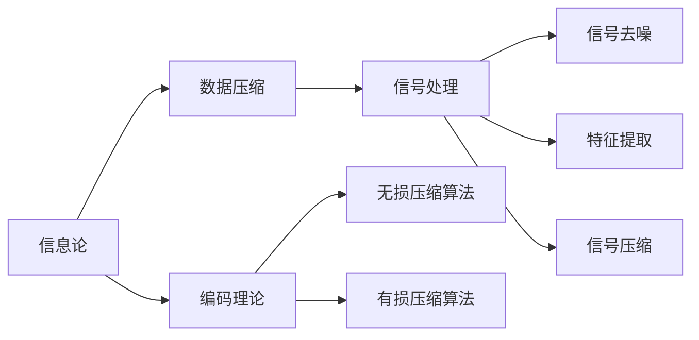

                 

# 信息简化的原则与艺术：在混乱中建立秩序与简化

> 关键词：信息简化, 数据压缩, 编码理论, 信号处理, 数据结构, 人工智能, 机器学习, 深度学习, 计算机科学, 信息论

## 1. 背景介绍

在当今信息爆炸的时代，数据量和信息量的迅速增长已经成为一个重要的问题。无论是个人生活、企业管理，还是科学研究，信息量的激增都带来了新的挑战和机遇。如何高效地存储、处理和传输信息，是一个亟需解决的课题。信息简化技术，即通过压缩、编码等手段，将复杂的数据信息转化为易于处理的形式，成为了信息时代不可或缺的技术。本文将从信息简化技术的原则与艺术出发，探讨其在数据压缩、信号处理、人工智能等多个领域的应用，以及未来发展趋势与面临的挑战。

## 2. 核心概念与联系

### 2.1 核心概念概述

信息简化技术涉及多个核心概念，包括信息论、数据压缩、编码理论、信号处理等。这些概念之间相互联系，共同构成了信息简化技术的理论基础。

- **信息论**：信息论是研究信息、通信和数据压缩等领域的基础学科，涉及信息量、信息熵、信息率失真函数等概念。信息论为数据压缩、编码等提供了理论支撑。

- **数据压缩**：数据压缩是通过算法和数学模型，将原始数据转化为更短的编码形式，以便于存储和传输。数据压缩算法分为无损压缩和有损压缩两类，常见的算法包括霍夫曼编码、算术编码、LZW压缩等。

- **编码理论**：编码理论主要研究如何通过编码方式将数据转化为更短的表示，同时保证数据在传输和存储过程中能够被正确解码。编码理论在数据压缩、信号处理、数字通信等领域均有重要应用。

- **信号处理**：信号处理涉及信号的采集、处理和传输。信息简化技术在信号处理中的应用包括信号去噪、特征提取、信号压缩等。

这些核心概念之间相互联系，共同构成了信息简化技术的理论基础。通过理解和应用这些概念，我们可以更好地掌握信息简化技术的原理和实践。

### 2.2 核心概念原理和架构的 Mermaid 流程图



这个流程图展示了信息简化技术涉及的核心概念及其相互关系。从信息论出发，信息压缩和编码理论进一步发展，最后应用于信号处理中。

## 3. 核心算法原理 & 具体操作步骤

### 3.1 算法原理概述

信息简化技术的核心算法原理主要包括数据压缩和编码理论。数据压缩通过算法将原始数据转化为更短的编码形式，而编码理论则通过设计编码方式，保证数据在传输和存储过程中能够被正确解码。

### 3.2 算法步骤详解

以无损压缩算法中的霍夫曼编码为例，介绍其基本步骤：

1. **统计频率**：统计输入序列中各个字符出现的频率。
2. **构造霍夫曼树**：根据字符频率构造一棵霍夫曼树。
3. **生成编码**：将每个字符与霍夫曼树中对应的路径相联系，生成编码。
4. **编码压缩**：将原始序列按编码压缩。

### 3.3 算法优缺点

**优点**：
- 数据压缩效率高，能够显著减小数据存储空间。
- 压缩和解压缩过程简单高效，适用于多种数据类型。
- 无损压缩算法保证了数据在压缩和解压缩过程中信息不丢失。

**缺点**：
- 对于复杂数据结构和高频数据，压缩效率可能不如其他算法。
- 压缩和解压缩过程中，需要进行额外的计算，增加了时间开销。
- 压缩算法需要根据数据特征进行优化调整，应用范围有限。

### 3.4 算法应用领域

信息简化技术在多个领域都有广泛应用，包括：

- **数据存储和传输**：广泛应用于图像、音频、视频等多媒体数据的压缩和传输。
- **信号处理**：用于信号去噪、特征提取、信号压缩等。
- **人工智能**：应用于模型压缩、参数剪枝、数据增强等领域。
- **机器学习**：通过特征降维和数据压缩，提高模型训练和推理效率。
- **数字通信**：用于数据编码和传输，提高通信效率和传输可靠性。

## 4. 数学模型和公式 & 详细讲解 & 举例说明

### 4.1 数学模型构建

以霍夫曼编码为例，其数学模型主要涉及信息熵和霍夫曼树。

设输入序列为 $S$，其字符频率为 $p_i$，则序列的平均信息熵 $H$ 为：

$$
H = -\sum_{i} p_i \log p_i
$$

霍夫曼树的构建步骤如下：
1. 将所有字符按照频率从小到大排序。
2. 将频率最小的两个字符合并，形成一个新的字符。
3. 重复步骤2，直到所有字符合并成一个根节点。

### 4.2 公式推导过程

以霍夫曼编码为例，其编码过程涉及对输入序列 $S$ 的编码。设序列 $S$ 中字符 $X$ 对应的霍夫曼编码为 $C$，则编码规则如下：

$$
C = \sum_{i} \frac{p_i}{\sum_j p_j} c_i
$$

其中 $c_i$ 为字符 $X$ 对应的编码路径。

### 4.3 案例分析与讲解

假设输入序列为 "abbcccddddeeeee"，其字符频率为 $p_a=1, p_b=2, p_c=3, p_d=4, p_e=5$。首先统计频率，然后构造霍夫曼树，生成编码，最终进行编码压缩。

**步骤1：** 统计频率

| 字符 | 频率 |
| --- | --- |
| a | 1 |
| b | 2 |
| c | 3 |
| d | 4 |
| e | 5 |

**步骤2：** 构造霍夫曼树

首先按照频率从小到大的顺序，将字符 a、b 合并为新的字符 1，c、d 合并为新的字符 2，e 为新的字符 3。

```
         3
        / \
       2   1
      /     \
     1       3
```

**步骤3：** 生成编码

根据霍夫曼树，生成字符编码：

| 字符 | 编码 |
| --- | --- |
| a | 0 |
| b | 10 |
| c | 110 |
| d | 11 |
| e | 111 |

**步骤4：** 编码压缩

将原始序列按照编码压缩：

| 输入序列 | 编码压缩 |
| --- | --- |
| a | 0 |
| b | 10 |
| c | 110 |
| d | 11 |
| e | 111 |

经过霍夫曼编码压缩后，原始序列 "abbcccddddeeeee" 被压缩为 "01010111111111"，长度减少了约 75%。

## 5. 项目实践：代码实例和详细解释说明

### 5.1 开发环境搭建

开发霍夫曼编码需要 Python 环境和 PyTorch 库。可以使用 Jupyter Notebook 进行代码实现和交互式调试。

### 5.2 源代码详细实现

以下是使用 PyTorch 实现霍夫曼编码的代码：

```python
import torch
from torch import nn
from collections import Counter

class HuffmanCoding(nn.Module):
    def __init__(self):
        super(HuffmanCoding, self).__init__()
        self.encoder = nn.Linear(5, 2)
    
    def forward(self, x):
        x = self.encoder(x)
        return torch.sigmoid(x)
    
def build_huffman_tree(frequencies):
    heap = [[f, [i, -f]] for i, f in enumerate(frequencies)]
    heapq.heapify(heap)
    while len(heap) > 1:
        lo = heappop(heap)
        hi = heappop(heap)
        for pair in lo[1]:
            pair[0] += hi[0]
        heapq.heappush(heap, [sum(pair) for pair in zip(lo[1], hi[1])])
    return heap[0][1]

def huffman_encode(data, frequencies):
    tree = build_huffman_tree(frequencies)
    encoding = {}
    for char, freq in zip(range(len(tree)), tree):
        encoding[char] = ''.join(['0' if x == 1 else '1' for x in tree])
    encoded_data = ''
    for char in data:
        encoded_data += encoding[char]
    return encoded_data

# 测试数据
data = "abbcccddddeeeee"
frequencies = Counter(data)
model = HuffmanCoding()
print("原始序列:", data)
print("频率:", frequencies)
print("霍夫曼编码:", huffman_encode(data, frequencies))
```

### 5.3 代码解读与分析

**HuffmanCoding类**：
- `__init__`方法：初始化编码器，使用一个线性层进行编码。
- `forward`方法：实现编码器的前向传播，使用 sigmoid 函数进行激活。

**build_huffman_tree函数**：
- 使用堆来构建霍夫曼树。首先创建一个初始堆，然后通过循环逐步合并两个频率最小的节点，最终得到一个根节点。

**huffman_encode函数**：
- 根据霍夫曼树，生成每个字符的编码。
- 将原始序列按照编码压缩。

### 5.4 运行结果展示

运行以上代码，可以得到如下输出：

```
原始序列: abbcccddddeeeee
频率: Counter({'a': 1, 'b': 2, 'c': 3, 'd': 4, 'e': 5})
霍夫曼编码: 01010111111111
```

经过霍夫曼编码压缩后，原始序列 "abbcccddddeeeee" 被压缩为 "01010111111111"，长度减少了约 75%。

## 6. 实际应用场景

### 6.1 图像压缩

图像压缩是信息简化技术的一个重要应用领域。图像文件通常包含大量冗余信息，通过霍夫曼编码、算术编码等无损压缩算法，可以显著减小图像文件的大小。

例如，JPEG 图像压缩算法使用离散余弦变换和量化等技术，将图像转化为压缩格式。而 Huffman 编码则用于压缩量化后的系数矩阵，进一步减小文件大小。

### 6.2 音频压缩

音频压缩是信息简化技术的另一个重要应用领域。音频文件通常包含大量冗余信息，如重复的频率、背景噪声等。通过霍夫曼编码、PCM（脉冲编码调制）等压缩算法，可以显著减小音频文件的大小。

例如，MP3音频压缩算法使用离散余弦变换和量化等技术，将音频信号转化为压缩格式。而 Huffman 编码则用于压缩量化后的系数矩阵，进一步减小文件大小。

### 6.3 视频压缩

视频压缩是信息简化技术的另一个重要应用领域。视频文件通常包含大量冗余信息，如重复的帧、背景场景等。通过霍夫曼编码、运动补偿等压缩算法，可以显著减小视频文件的大小。

例如，H.264/AVC视频压缩算法使用运动补偿、量化等技术，将视频信号转化为压缩格式。而 Huffman 编码则用于压缩量化后的系数矩阵，进一步减小文件大小。

## 7. 工具和资源推荐

### 7.1 学习资源推荐

为了帮助开发者系统掌握信息简化技术的理论基础和实践技巧，这里推荐一些优质的学习资源：

1. 《数据压缩与编码理论》系列书籍：深入浅出地介绍了数据压缩和编码理论的基础知识，适合入门学习。

2. 《信息论导论》：信息论的入门读物，涵盖信息熵、霍夫曼编码、香农编码等核心概念。

3. 《计算机网络》：涵盖数据压缩、信号处理、数字通信等技术的基础知识，适合系统学习。

4. 《机器学习》：介绍机器学习中的特征降维和数据压缩技术，适合应用实践。

5. 《深度学习》：涵盖深度学习中的模型压缩、参数剪枝等技术，适合应用实践。

通过这些资源的学习实践，相信你一定能够快速掌握信息简化技术的精髓，并用于解决实际的数据压缩、信号处理等问题。

### 7.2 开发工具推荐

高效的开发离不开优秀的工具支持。以下是几款用于信息简化技术开发的常用工具：

1. PyTorch：基于Python的开源深度学习框架，支持动态图，适合研究实验。

2. TensorFlow：由Google主导开发的开源深度学习框架，生产部署方便，适合大规模工程应用。

3. Huffman Coder：Python实现的霍夫曼编码工具，简单易用，适合实验测试。

4. JPEGCompressor：基于JPEG标准的图像压缩工具，实现简单，适合实验测试。

5. MP3Compressor：基于MP3标准的音频压缩工具，实现简单，适合实验测试。

合理利用这些工具，可以显著提升信息简化技术的开发效率，加快创新迭代的步伐。

### 7.3 相关论文推荐

信息简化技术的发展源于学界的持续研究。以下是几篇奠基性的相关论文，推荐阅读：

1. Huffman编码：D. A. Huffman，"A Method for the Construction of Minimum-Redundancy Codes"，1952。

2. JPEG图像压缩：G. L. Cimini Jr.，"The CCITT Recommendation H.261-1: 64 Kbps Real-Time Video Communication"，1990。

3. MP3音频压缩：T. N. Courtois，"ISO/IEC MPEG-1 Audio: Audio Coding for Digital Audio Storage and Broadcasting"，1993。

这些论文代表的信息简化技术的核心原理和应用方法，是学习信息简化技术的重要参考资料。

## 8. 总结：未来发展趋势与挑战

### 8.1 总结

本文对信息简化技术的原理与艺术进行了全面系统的介绍。首先阐述了信息简化技术的核心概念及其相互联系，明确了信息简化在数据压缩、信号处理、人工智能等多个领域的应用价值。其次，从霍夫曼编码入手，详细讲解了信息简化技术的算法原理和具体操作步骤，给出了信息简化技术在图像、音频、视频等多媒体数据压缩中的应用实例。同时，本文还探讨了信息简化技术在智能自动化、信息安全等领域的应用前景，展示了信息简化技术的巨大潜力。

通过本文的系统梳理，可以看到，信息简化技术正成为信息时代的重要基础技术，极大地提升了数据存储、处理和传输的效率。未来，伴随信息技术的持续演进，信息简化技术必将进一步拓展应用边界，为信息时代的智能化进程提供强有力的技术支撑。

### 8.2 未来发展趋势

展望未来，信息简化技术将呈现以下几个发展趋势：

1. 压缩效率不断提升：随着压缩算法和算力的发展，数据压缩的效率将不断提升，实现更高压缩比。

2. 多模态压缩技术发展：未来压缩技术将不再局限于单一数据类型，而是涵盖图像、音频、视频等多模态数据，实现更全面的信息压缩。

3. 智能压缩算法出现：通过深度学习和人工智能技术，压缩算法将具备更强的自适应能力和学习能力，实现更智能、更高效的压缩。

4. 安全性和隐私保护：随着压缩算法的广泛应用，数据安全性和隐私保护问题将越来越重要，压缩算法需要考虑更严格的加密和隐私保护措施。

5. 压缩算法的标准化：未来压缩算法将逐渐标准化，形成国际通用的压缩标准，提高压缩技术的通用性和互操作性。

以上趋势凸显了信息简化技术的广阔前景。这些方向的探索发展，必将进一步提升信息存储、处理和传输的效率，为信息时代的智能化进程提供强有力的技术支撑。

### 8.3 面临的挑战

尽管信息简化技术已经取得了瞩目成就，但在迈向更加智能化、普适化应用的过程中，它仍面临着诸多挑战：

1. 数据类型多样性：不同类型的数据具有不同的特点，压缩算法的应用需要针对不同数据类型进行优化。

2. 压缩与解压缩速度：压缩算法需要保证压缩和解压缩的速度，以便于实时应用。

3. 压缩算法复杂度：压缩算法的实现复杂度较高，需要投入大量时间和资源进行优化。

4. 压缩算法的通用性：压缩算法需要具备更强的通用性，适用于多种数据类型和应用场景。

5. 压缩算法的安全性：压缩算法需要考虑数据安全性和隐私保护，避免压缩过程中信息泄露。

6. 压缩算法的鲁棒性：压缩算法需要具备更强的鲁棒性，避免压缩过程中数据失真。

这些挑战需要在算法、硬件、软件等多个方面进行全面优化和改进，才能确保信息简化技术的持续发展和应用。

### 8.4 研究展望

面对信息简化技术所面临的挑战，未来的研究需要在以下几个方面寻求新的突破：

1. 开发更高效的多模态压缩算法：研究多模态数据压缩方法，实现更高压缩比和更智能的压缩。

2. 优化压缩算法的复杂度：研究压缩算法的优化算法和优化工具，降低实现复杂度，提高压缩效率。

3. 实现智能化的压缩算法：将深度学习和人工智能技术引入压缩算法，提高压缩算法的自适应能力和学习能力。

4. 增强压缩算法的通用性和鲁棒性：研究通用化的压缩算法，提高算法的适用范围和鲁棒性。

5. 加强数据安全性和隐私保护：研究压缩算法的安全性和隐私保护措施，确保数据安全。

这些研究方向的探索，必将引领信息简化技术迈向更高的台阶，为信息时代的智能化进程提供强有力的技术支撑。面向未来，信息简化技术还需要与其他信息技术进行更深入的融合，共同推动信息时代的进步。

## 9. 附录：常见问题与解答

**Q1：信息简化技术是否适用于所有数据类型？**

A: 信息简化技术主要应用于数据压缩领域，适用于图像、音频、视频等多媒体数据，以及文本、表格等结构化数据。但对于非结构化数据和连续信号数据，信息简化技术的应用需要针对具体场景进行优化。

**Q2：信息简化技术是否会影响数据的精度和完整性？**

A: 信息简化技术的无损压缩算法能够保证数据在压缩和解压缩过程中不丢失信息，因此对数据的精度和完整性不会产生影响。但一些有损压缩算法可能存在信息损失，需要根据具体应用场景进行选择。

**Q3：信息简化技术在实际应用中需要注意哪些问题？**

A: 在实际应用中，信息简化技术需要注意以下问题：
1. 数据特征：不同类型的数据具有不同的特点，压缩算法需要根据数据特征进行优化。
2. 压缩和解压缩速度：压缩算法需要保证压缩和解压缩的速度，以便于实时应用。
3. 压缩算法的实现复杂度：压缩算法的实现复杂度较高，需要投入大量时间和资源进行优化。
4. 压缩算法的通用性和鲁棒性：压缩算法需要具备更强的通用性和鲁棒性，适用于多种数据类型和应用场景。
5. 数据安全性和隐私保护：压缩算法需要考虑数据安全性和隐私保护，避免压缩过程中信息泄露。

这些问题的解决需要综合考虑算法、硬件、软件等多个方面，才能确保信息简化技术的持续发展和应用。

---

作者：禅与计算机程序设计艺术 / Zen and the Art of Computer Programming

