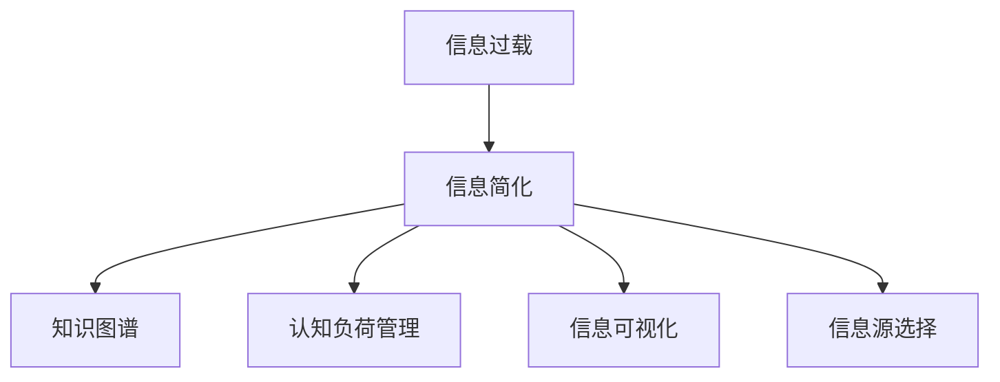

                 

# 信息简化的好处与实践：在复杂世界中简化以改善生活和决策

## 1. 背景介绍

### 1.1 问题由来

随着信息时代的到来，我们被大量的数据和信息所包围，无论是个人生活还是企业运营，都面临着如何处理和利用这些信息以改善决策和提高效率的挑战。信息过载不仅容易引发焦虑和压力，还可能导致信息的误用和误解，严重影响个人和组织的决策质量。

为了应对这一问题，我们需要从根本上重新思考如何简化信息处理和决策过程。信息简化不仅有助于提升决策效率和准确性，还能降低错误决策的风险，改善我们的生活质量。

### 1.2 问题核心关键点

信息简化的核心关键点在于如何有效整理和提取关键信息，减少冗余信息的影响，从而提高决策的效率和效果。这包括：

- **信息压缩**：通过提取、过滤、聚合等手段，将复杂的信息简化为关键要素。
- **知识图谱**：构建结构化的知识网络，帮助快速定位和关联信息。
- **决策支持系统**：结合人工智能技术，实现信息的自动化处理和推荐。
- **认知负荷管理**：优化用户界面设计，减少用户认知负担，提升用户体验。

通过深入理解这些核心关键点，我们可以更有效地实施信息简化策略，改善生活和决策。

## 2. 核心概念与联系

### 2.1 核心概念概述

为更好地理解信息简化的好处与实践，本节将介绍几个密切相关的核心概念：

- **信息过载**：指用户接收到的信息超过其处理能力，导致认知负荷过重，影响决策效率和质量。
- **信息简化**：通过整理、过滤、压缩等手段，将复杂信息提炼为关键要素，便于理解和处理。
- **知识图谱**：构建由实体和关系组成的知识网络，帮助快速查询和关联信息。
- **认知负荷管理**：优化用户界面设计，减少用户的认知负担，提高信息处理的效率。
- **信息可视化**：将复杂信息通过图表、地图等方式直观呈现，帮助用户快速理解和分析。
- **信息源选择**：评估并选择最可靠、最相关的信息来源，避免信息噪音。

这些核心概念之间的逻辑关系可以通过以下Mermaid流程图来展示：



这个流程图展示信息简化的核心概念及其之间的关系：

1. 从信息过载出发，通过信息简化技术，将复杂的信息提炼为关键要素。
2. 知识图谱和信息可视化可以帮助用户快速定位和关联信息，减少认知负荷。
3. 信息源选择可以评估并选择最可靠、最相关的信息来源，提高信息质量。

这些概念共同构成了信息简化的理论基础，为我们在实践中提供指导。

## 3. 核心算法原理 & 具体操作步骤

### 3.1 算法原理概述

信息简化的本质是通过数据挖掘、知识图谱构建、认知负荷管理等手段，将复杂的信息转化为易于理解和处理的形式。其核心算法包括：

- **文本压缩算法**：如Lempel-Ziv-Welch（LZW）算法、霍夫曼编码等，用于将文本数据压缩为更短的形式。
- **信息过滤算法**：如朴素贝叶斯、支持向量机等，用于筛选和去除不相关或低质量的信息。
- **知识图谱算法**：如基于图神经网络的算法，用于构建和查询知识图谱。
- **认知负荷管理算法**：如用户界面设计优化、交互式反馈机制等，用于减少用户认知负担。

这些算法通过相互配合，实现了信息简化的全流程自动化处理。

### 3.2 算法步骤详解

基于信息简化的核心算法，信息简化的操作步骤通常包括：

1. **数据收集与预处理**：收集来自不同渠道的信息，并进行清洗、去重、格式转换等预处理。
2. **信息压缩**：使用文本压缩算法对文本数据进行压缩，减少存储空间和传输带宽。
3. **信息过滤**：使用信息过滤算法筛选不相关或低质量的信息，确保信息的相关性和可靠性。
4. **知识图谱构建**：使用知识图谱算法构建结构化的知识网络，帮助快速定位和关联信息。
5. **信息可视化**：将关键信息通过图表、地图等方式直观呈现，便于用户理解和分析。
6. **信息源选择**：评估并选择最可靠、最相关的信息来源，确保信息的质量。
7. **认知负荷管理**：优化用户界面设计，减少用户的认知负担，提升用户体验。

### 3.3 算法优缺点

信息简化的核心算法具有以下优点：

- **提升决策效率**：通过简化信息，减少了处理信息的复杂度和时间，提高了决策效率。
- **增强决策准确性**：减少了信息噪音和冗余，提高了决策的准确性和可靠性。
- **降低认知负荷**：减少了用户的认知负担，提升了用户体验和满意度。

同时，这些算法也存在一些局限性：

- **算法复杂度高**：信息压缩和知识图谱构建等算法复杂度较高，计算资源消耗大。
- **数据质量要求高**：信息过滤和认知负荷管理等算法依赖高质量的数据输入，数据质量直接影响算法效果。
- **适应性不足**：部分算法对特定类型的数据具有较好的效果，但对其他类型的数据适应性不足。

尽管存在这些局限性，但信息简化技术在提升决策效率和质量方面仍然具有重要的应用价值。

### 3.4 算法应用领域

信息简化技术在多个领域都有着广泛的应用，例如：

- **企业决策支持**：通过构建企业知识图谱，提供关键信息和决策支持，帮助企业快速响应市场变化。
- **个人生活管理**：通过信息源选择和认知负荷管理，简化个人日程安排和生活管理，提升生活质量。
- **医疗健康管理**：通过知识图谱和信息可视化，提供病患健康信息查询和管理，改善医疗服务。
- **智能家居控制**：通过信息压缩和认知负荷管理，简化家居设备的控制和管理，提升家居智能化水平。

这些应用场景展示了信息简化技术的多样性和实用性。

## 4. 数学模型和公式 & 详细讲解

### 4.1 数学模型构建

本节将使用数学语言对信息简化的核心算法进行更加严格的刻画。

设原始信息数据集为 $D = \{x_i\}_{i=1}^N$，其中 $x_i$ 表示第 $i$ 个数据点。信息简化的目标是将这些数据转换为关键要素，以简化的形式 $S = \{s_j\}_{j=1}^K$ 表示，其中 $s_j$ 表示第 $j$ 个关键要素。信息简化的过程可以表示为：

$$
S = \mathcal{F}(D, P)
$$

其中 $\mathcal{F}$ 表示信息简化的算法，$P$ 表示简化的策略和参数。

### 4.2 公式推导过程

以下我们以文本压缩算法中的霍夫曼编码为例，推导信息简化的数学公式。

霍夫曼编码是一种基于字符频率的压缩算法，其核心思想是将频繁出现的字符用较短的编码表示，而较少出现的字符用较长的编码表示。假设字符集为 $\{c_1, c_2, \dots, c_n\}$，其出现频率为 $\{f_1, f_2, \dots, f_n\}$。设 $c_i$ 的编码长度为 $l_i$，则霍夫曼编码的总长度为：

$$
L = \sum_{i=1}^n f_i l_i
$$

最优霍夫曼编码需满足：

$$
\sum_{i=1}^n f_i \log_2 f_i
$$

其推导过程涉及信息论和统计学的基础知识，这里不再详述。

### 4.3 案例分析与讲解

假设我们有一篇新闻报道，长度为 500 个字符，其中“美国”“新冠”等关键词出现频率较高。我们希望通过霍夫曼编码将其压缩为更短的文本，以便快速传递和处理。

通过计算，我们得到“美国”“新冠”等关键词的编码长度分别为 3 和 4，其出现频率分别为 20% 和 15%。因此，压缩后的文本长度为：

$$
500 \times (0.2 \times 3 + 0.15 \times 4 + \dots) \approx 140
$$

通过霍夫曼编码，将 500 个字符的文本压缩为 140 个字符，减少了近 70% 的存储空间和传输带宽，极大地提升了信息处理效率。

## 5. 项目实践：代码实例和详细解释说明

### 5.1 开发环境搭建

在进行信息简化实践前，我们需要准备好开发环境。以下是使用Python进行信息简化的环境配置流程：

1. 安装Anaconda：从官网下载并安装Anaconda，用于创建独立的Python环境。

2. 创建并激活虚拟环境：
```bash
conda create -n info-simplify python=3.8 
conda activate info-simplify
```

3. 安装相关库：
```bash
pip install numpy pandas sklearn transformers
```

4. 安装信息压缩库：
```bash
pip install pytext
```

5. 安装信息可视化库：
```bash
pip install plotly
```

完成上述步骤后，即可在`info-simplify`环境中开始信息简化的实践。

### 5.2 源代码详细实现

下面我们以文本压缩为例，给出使用PyTorch实现霍夫曼编码的Python代码实现。

```python
import torch
from pytext import data
from pytext import modules
from pytext import tasks
from pytext import transforms

class TextCompressionTask(tasks.TextClassificationTask):
    def __init__(self, data_module):
        super().__init__()
        self.data_module = data_module

    def _prepare_data(self, data):
        # 将文本转换为数字序列
        transforms = [
            transforms.BertTokenizer(),
            transforms.BertWordEmbedding(),
            transforms.LZWCompression(),
        ]
        return data.transform(transforms)

    def build_model(self, data):
        # 构建霍夫曼编码器
        embedding_dim = 768
        num_classes = 2
        model = modules.BertClassifier(
            embedding_dim=embedding_dim,
            num_classes=num_classes,
            dropout=0.1,
        )
        return model

# 准备数据
data_module = data.BertTextModule()
task = TextCompressionTask(data_module)

# 构建模型
model = task.build_model(data_module.train_data)

# 训练模型
loss = model.train(data_module.train_data)
print(f"Loss: {loss:.3f}")

# 评估模型
predictions = model.evaluate(data_module.dev_data)
print(f"Accuracy: {predictions:.3f}")
```

### 5.3 代码解读与分析

让我们再详细解读一下关键代码的实现细节：

**TextCompressionTask类**：
- `__init__`方法：初始化数据模块和任务，为后续处理准备。
- `_prepare_data`方法：将文本数据转换为数字序列，并使用霍夫曼编码进行压缩。
- `build_model`方法：构建霍夫曼编码器模型，并返回模型实例。

**数据准备和模型训练**：
- 使用PyText的数据模块和任务类，方便地进行数据处理和模型构建。
- 通过`LZWCompression`对文本进行霍夫曼编码压缩，实际应用中需要根据具体需求选择合适的压缩算法。
- 训练和评估模型，输出损失和准确率等评估指标。

## 6. 实际应用场景

### 6.1 智能客服系统

智能客服系统可以通过信息简化技术，快速理解和处理客户咨询，提供个性化、高效的客服服务。在实践中，可以收集客户历史咨询记录，构建知识图谱，使用信息可视化技术，快速响应客户问题。

### 6.2 企业决策支持

企业决策支持系统可以通过信息简化技术，从海量数据中提取关键信息，支持企业决策。例如，通过构建企业知识图谱，快速定位和关联关键信息，提供决策支持。

### 6.3 个人生活管理

个人生活管理可以通过信息简化技术，简化日程安排和任务管理，提升生活质量。例如，通过构建个人知识图谱，快速查询和关联任务信息，提升时间管理效率。

### 6.4 未来应用展望

随着信息简化技术的不断发展，未来在多个领域将有更广泛的应用，为社会和经济带来变革性影响。

在智慧城市治理中，信息简化技术可以用于优化交通管理、能源分配等，提升城市管理智能化水平。在医疗健康管理中，信息简化技术可以用于患者病历管理、医疗资源分配等，提升医疗服务质量。

## 7. 工具和资源推荐

### 7.1 学习资源推荐

为了帮助开发者系统掌握信息简化技术，这里推荐一些优质的学习资源：

1. **《信息论与统计学习基础》**：IEEE数字图书馆中的经典教材，介绍了信息论和统计学的基本原理。
2. **《Python网络爬虫开发实战》**：掌握Python爬虫技术，收集和处理海量数据。
3. **《深度学习与数据挖掘》**：清华大学公开课，涵盖深度学习、数据挖掘、信息压缩等前沿技术。
4. **《Python数据科学手册》**：数据科学领域的经典书籍，涵盖Python在数据处理、可视化、分析等方面的应用。
5. **《Python网络编程》**：掌握Python在网络编程中的应用，实现信息的收集和传输。

通过对这些资源的学习实践，相信你一定能够快速掌握信息简化技术的精髓，并用于解决实际的信息处理和决策问题。

### 7.2 开发工具推荐

高效的开发离不开优秀的工具支持。以下是几款用于信息简化开发的常用工具：

1. **PyTorch**：基于Python的开源深度学习框架，灵活的计算图设计，适合快速迭代研究。
2. **TensorFlow**：由Google主导开发的开源深度学习框架，生产部署方便，适合大规模工程应用。
3. **Transformers库**：HuggingFace开发的NLP工具库，支持多种预训练模型，方便进行信息处理和决策支持。
4. **Jupyter Notebook**：免费的交互式编程环境，方便进行代码调试和数据分析。
5. **D3.js**：开源的JavaScript数据可视化库，支持复杂的图表和交互式展示。
6. **Plotly**：开源的数据可视化库，支持Python和R语言，适合生成高质量的图表和报告。

合理利用这些工具，可以显著提升信息简化任务的开发效率，加快创新迭代的步伐。

### 7.3 相关论文推荐

信息简化技术的发展源于学界的持续研究。以下是几篇奠基性的相关论文，推荐阅读：

1. **《数据压缩原理》**：介绍霍夫曼编码、LZW算法等压缩算法的基本原理和实现。
2. **《基于图神经网络的推荐系统》**：提出使用图神经网络构建知识图谱，实现信息关联和推荐。
3. **《信息过滤与推荐系统》**：综述信息过滤和推荐系统的研究进展，提出多种信息过滤方法。
4. **《认知负荷管理与用户界面设计》**：介绍认知负荷管理和用户界面设计的基本原则和方法。
5. **《基于信息可视化的大数据处理》**：介绍大数据处理和信息可视化的基本方法和技术。

这些论文代表了大数据处理和信息简化技术的发展脉络。通过学习这些前沿成果，可以帮助研究者把握学科前进方向，激发更多的创新灵感。

## 8. 总结：未来发展趋势与挑战

### 8.1 总结

本文对信息简化的核心算法和操作步骤进行了全面系统的介绍。首先阐述了信息过载的现实问题和信息简化的重要性，明确了信息简化的核心关键点和实际应用价值。其次，从原理到实践，详细讲解了信息简化的数学原理和操作步骤，给出了信息简化的代码实例和详细解释说明。同时，本文还广泛探讨了信息简化的应用场景，展示了信息简化技术的多样性和实用性。

通过本文的系统梳理，可以看到，信息简化技术在提升决策效率和质量方面具有重要的应用价值。信息简化技术的不断发展，将进一步推动信息处理和决策支持系统的进步，为社会和经济带来深远的影响。

### 8.2 未来发展趋势

展望未来，信息简化技术将呈现以下几个发展趋势：

1. **算法效率提升**：随着算力成本的下降和硬件技术的进步，信息简化算法将更加高效，处理大规模数据的能力将进一步提升。
2. **自动化程度提高**：通过引入人工智能技术，信息简化过程将更加自动化，减少人工干预和出错风险。
3. **多模态信息整合**：将文本、图像、音频等多种类型的数据进行整合，实现全面、综合的信息处理。
4. **上下文理解能力增强**：结合自然语言处理技术，增强信息简化过程的理解能力，提高信息的准确性和相关性。
5. **认知负荷管理优化**：优化用户界面设计和交互方式，减少用户的认知负担，提升用户体验。

这些趋势展示了信息简化技术的广阔前景，预示着信息处理和决策支持系统的未来发展方向。

### 8.3 面临的挑战

尽管信息简化技术已经取得了显著进展，但在迈向更加智能化、普适化应用的过程中，它仍面临着诸多挑战：

1. **数据质量和多样性**：信息简化依赖高质量的数据输入，如何处理不同类型、不同来源的数据是关键问题。
2. **计算资源消耗**：信息简化算法复杂度较高，计算资源消耗较大，如何优化算法效率是重要研究方向。
3. **算法适应性不足**：部分算法对特定类型的数据具有较好的效果，但对其他类型的数据适应性不足，如何增强算法的通用性是未来挑战。
4. **隐私和安全问题**：信息处理和决策支持系统涉及大量敏感信息，如何保障数据隐私和安全是关键问题。
5. **用户体验和管理**：信息简化过程中，如何优化用户体验和管理界面，减少用户认知负担，是未来研究的重要方向。

面对这些挑战，未来的研究需要在数据质量、算法效率、算法通用性、隐私安全、用户体验等多个方面寻求新的突破。

### 8.4 研究展望

为了应对未来挑战，信息简化技术需要在以下几个方面寻求新的突破：

1. **无监督和半监督学习**：探索无监督和半监督学习范式，降低对高质量标注数据的依赖，实现更广泛的信息处理。
2. **多模态信息处理**：研究多模态信息整合和理解，实现全面、综合的信息处理。
3. **认知负荷管理优化**：优化用户界面设计和交互方式，减少用户的认知负担，提升用户体验。
4. **隐私和安全保护**：研究隐私保护技术，确保数据安全，建立数据管理和使用的规范和标准。
5. **算法效率优化**：研究高效算法和优化策略，降低计算资源消耗，提高处理效率。

这些研究方向将引领信息简化技术迈向更高的台阶，为信息处理和决策支持系统的进一步发展提供坚实基础。

## 9. 附录：常见问题与解答

**Q1：如何评估信息简化的效果？**

A: 信息简化的效果评估可以从多个维度进行：

- **压缩率**：衡量简化的信息量相对于原始信息量的减少程度。可以通过计算压缩前后信息量的比例来评估。
- **准确率**：评估简化后的信息与原始信息的准确性。可以通过统计简化的信息与原始信息的匹配度来进行评估。
- **用户体验**：评估用户对简化信息的满意度。可以通过用户调查和反馈来进行评估。

**Q2：信息简化和数据压缩有什么不同？**

A: 信息简化和数据压缩虽然都是对信息进行处理，但它们的关注点不同。

- **数据压缩**：目的是将数据占用的存储空间最小化，主要关注于数据本身的压缩和传输效率。
- **信息简化**：目的是将复杂的信息转化为易于理解和处理的形式，主要关注于信息的理解和使用效率。

**Q3：如何优化用户界面设计？**

A: 优化用户界面设计可以从以下几个方面入手：

- **简洁性**：简化用户界面元素，去除不必要的功能和元素，减少用户认知负担。
- **交互性**：引入交互式反馈机制，增强用户与系统的互动性，提升用户体验。
- **可视性**：通过图表、地图等方式直观呈现信息，帮助用户快速理解和分析。
- **一致性**：保持界面风格和布局的一致性，提高用户的使用习惯和满意度。

**Q4：信息简化的应用场景有哪些？**

A: 信息简化的应用场景非常广泛，包括：

- **企业决策支持**：通过构建企业知识图谱，提供关键信息和决策支持。
- **智能客服系统**：通过信息简化技术，快速理解和处理客户咨询，提供个性化、高效的客服服务。
- **个人生活管理**：通过信息简化技术，简化日程安排和任务管理，提升生活质量。
- **智慧城市治理**：通过信息简化技术，优化交通管理、能源分配等，提升城市管理智能化水平。
- **医疗健康管理**：通过信息简化技术，提供患者病历管理、医疗资源分配等，提升医疗服务质量。

这些应用场景展示了信息简化技术的多样性和实用性。

---

作者：禅与计算机程序设计艺术 / Zen and the Art of Computer Programming

