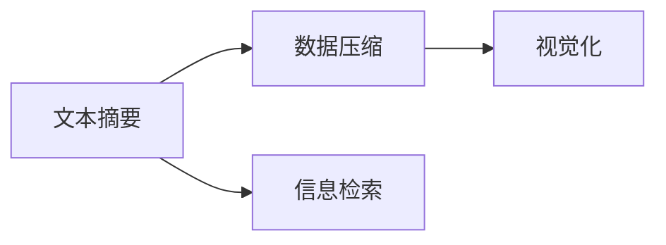
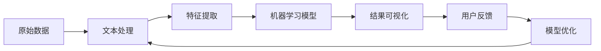

                 

# 信息简化的好处与挑战：简化复杂性的艺术与科学

在当今信息爆炸的时代，简化信息的艺术与科学显得尤为重要。大至全球经济、政治决策，小至日常生活中的决策，都离不开对复杂信息的有效处理与简化。本文将深入探讨信息简化的核心概念、技术原理、应用场景及其面临的挑战，并结合具体案例和算法分析，为广大读者提供全面、深入的指导。

## 1. 背景介绍

### 1.1 问题由来
随着互联网的普及和数字技术的飞速发展，人类每天接触到的信息量呈指数级增长。从海量新闻、社交媒体动态到专业领域的报告，信息源的丰富和多样使得信息筛选、处理和理解变得更加复杂和困难。信息过载已成为现代社会的一大难题。

为了应对这一挑战，信息简化的技术应运而生。它旨在通过算法和技术手段，将复杂的信息转化为易于理解和处理的形式，从而提高决策效率和信息利用率。信息简化不仅是技术问题，也是一门艺术，需要平衡信息的全面性与简洁性的需求。

### 1.2 问题核心关键点
信息简化的核心关键点在于如何既保留关键信息，又能去除冗余和不必要的内容，使信息既简洁易懂，又具有高度的相关性和有用性。这涉及到以下几个方面：
- 信息筛选与提取：从原始数据中筛选出最有价值的部分。
- 数据压缩与编码：将大量数据压缩成紧凑的形式，便于存储和传输。
- 内容生成与可视化：将复杂信息以图表、摘要等方式呈现，增强易读性。
- 算法设计与优化：选择或设计合适的算法，实现信息简化的自动化。

本文将重点介绍信息简化的算法原理和操作步骤，并结合实际应用场景进行详细讲解。

## 2. 核心概念与联系

### 2.1 核心概念概述
信息简化涉及到多个核心概念，包括但不限于：

- 文本摘要：从长文本中提取关键信息，生成简洁的摘要。
- 数据压缩：将原始数据压缩成更小的格式，便于存储和传输。
- 信息检索：从大量数据中快速检索出相关信息，提升信息利用效率。
- 视觉化：将复杂的数据和信息以图形化的方式展现，增强理解度。

这些概念之间相互关联，共同构成了信息简化的技术框架。以下是一个简单的Mermaid流程图，展示信息简化的核心概念及其相互关系：



### 2.2 核心概念原理和架构的 Mermaid 流程图

在更具体的层面，我们可以细化流程如下：



该流程展示了从原始数据到最终简化的信息，经过了文本处理、特征提取、机器学习模型训练、结果可视化和模型优化等多个步骤。每个步骤都通过特定的技术和算法实现信息的简化与优化。

## 3. 核心算法原理 & 具体操作步骤

### 3.1 算法原理概述
信息简化的核心算法原理主要围绕以下几个方面展开：

- **文本摘要算法**：通过算法将长文本压缩成简洁的摘要，主要涉及文本分割、关键词提取、句法分析等技术。
- **数据压缩算法**：通过算法将原始数据转换为更紧凑的格式，主要涉及无损压缩和有损压缩技术。
- **信息检索算法**：通过算法在大量数据中快速定位相关信息，主要涉及倒排索引、向量空间模型等技术。
- **可视化算法**：通过算法将复杂数据和信息以图形化的方式展现，主要涉及统计图表、网络图、时间序列图等技术。

### 3.2 算法步骤详解
以下以文本摘要算法为例，详细讲解信息简化的具体操作步骤：

#### 3.2.1 预处理
- **文本清洗**：去除特殊字符、停用词等，使文本更加纯净。
- **分词**：将文本分割成单词或短语，便于后续处理。
- **停用词移除**：移除不包含关键信息的停用词，如“的”、“是”等。

#### 3.2.2 特征提取
- **词频统计**：统计每个词在文本中出现的频率。
- **TF-IDF计算**：计算每个词的词频-逆文档频率(Term Frequency-Inverse Document Frequency)，衡量其在文本中的重要性。
- **关键词提取**：通过统计或算法提取文本中的关键词，如TF-IDF算法、TextRank算法等。

#### 3.2.3 摘要生成
- **基于规则的方法**：根据预设的规则，手动或自动生成摘要。如抽取文本中的首句、尾句或每段第一句话。
- **基于统计的方法**：通过统计文本中各句子的重要性，自动生成摘要。如TextRank算法。
- **深度学习方法**：使用神经网络模型，训练摘要生成模型。如Seq2Seq模型、Transformer模型等。

#### 3.2.4 后处理
- **去重**：去除重复的语句或短语。
- **排序**：按照重要性对摘要内容进行排序，使信息更加集中。
- **风格调整**：调整摘要的语言风格，使其更加流畅和自然。

### 3.3 算法优缺点
#### 3.3.1 优点
- **自动化与高效性**：算法能够自动处理大量信息，提高效率。
- **准确性与可靠性**：通过精确的计算和算法设计，能够保证摘要的准确性和可靠性。
- **灵活性与可扩展性**：算法可以灵活调整参数，适应不同类型和规模的信息。

#### 3.3.2 缺点
- **数据依赖**：算法的效果依赖于输入数据的质量和数量。
- **复杂性与技术门槛**：部分算法需要复杂的数学和统计知识，对技术要求较高。
- **主观性与偏见**：算法的输出可能受到算法设计者的主观判断和偏见影响。

### 3.4 算法应用领域
信息简化技术广泛应用于多个领域，以下是几个典型应用：

- **新闻摘要**：自动生成新闻报道的摘要，便于读者快速了解核心内容。
- **技术文档**：自动生成技术文档的摘要，帮助开发者快速理解复杂的技术细节。
- **金融报告**：自动生成金融报告的摘要，帮助分析师快速获取关键信息。
- **医学文献**：自动生成医学文献的摘要，帮助研究人员快速了解最新研究成果。
- **社交媒体**：自动生成社交媒体内容的摘要，帮助用户快速获取重要信息。

## 4. 数学模型和公式 & 详细讲解 & 举例说明

### 4.1 数学模型构建
信息简化的数学模型通常基于以下几个假设：

- **信息守恒**：信息简化的过程中，信息总量保持不变，只是形式和表达方式发生改变。
- **重要性判断**：信息的重要性可通过词频、TF-IDF等指标进行量化，便于算法处理。
- **维度降维**：通过降维技术将高维数据转化为低维表示，便于处理和存储。

### 4.2 公式推导过程
以TF-IDF算法为例，其公式推导过程如下：

\[ tf = \frac{n_t}{N}, \quad idf = \log\frac{N}{n_t+1} \]

其中，$tf$表示词频，$N$表示文档总数，$n_t$表示包含该词的文档数，$idf$表示逆文档频率。

### 4.3 案例分析与讲解
假设有一段长文本如下：

```
这是一段包含大量信息的文本。为了进行信息简化，我们需要先进行分词，然后计算每个词的TF-IDF值。通过排序和去重，最后生成一段简洁的摘要。
```

使用TextRank算法，我们可以得到如下的摘要：

```
这段文本包含大量信息，需要进行分词，计算TF-IDF值，排序和去重后生成简洁的摘要。
```

## 5. 项目实践：代码实例和详细解释说明

### 5.1 开发环境搭建
信息简化的开发通常使用Python和相关的数据处理库，如NLTK、Scikit-learn等。以下是Python环境搭建步骤：

1. 安装Python：从官网下载并安装最新版本的Python。
2. 安装虚拟环境：使用`conda`或`virtualenv`创建虚拟环境。
3. 安装依赖库：使用`pip`安装NLTK、Scikit-learn、TensorFlow等库。

### 5.2 源代码详细实现
以下是一个简单的文本摘要生成的代码实现，使用TextRank算法：

```python
import nltk
from sklearn.feature_extraction.text import TfidfVectorizer
from networkx import nx
from nltk.tokenize import sent_tokenize

# 分句
def sent_tokenizer(text):
    return sent_tokenize(text)

# 计算TF-IDF
def tf_idf_matrix(texts):
    tfidf = TfidfVectorizer(stop_words='english')
    return tfidf.fit_transform(texts)

# 计算权重
def calculate_weight(tfidf_matrix, sentences):
    scores = tfidf_matrix * tfidf_matrix.T
    row_sum = scores.sum(axis=1)
    scores.data /= row_sum
    scores = nx.from_scipy_sparse_matrix(scores)
    scores = nx.eigenvector_centrality(scores)
    return scores

# 生成摘要
def generate_summary(text, summary_length):
    sentences = sent_tokenizer(text)
    tfidf_matrix = tf_idf_matrix(sentences)
    scores = calculate_weight(tfidf_matrix, sentences)
    ranked_scores = sorted([(score, index) for index, score in scores.items()])
    summary = []
    for i in range(summary_length):
        summary.append(sentences[ranked_scores[i][1]])
    return ' '.join(summary)

# 测试
text = "这是一段包含大量信息的文本。为了进行信息简化，我们需要先进行分词，然后计算每个词的TF-IDF值。通过排序和去重，最后生成一段简洁的摘要。"
print(generate_summary(text, 2))
```

### 5.3 代码解读与分析
上述代码实现了文本摘要的自动生成，主要通过TF-IDF和TextRank算法。具体步骤包括：

1. 将文本分句，计算每个句子的TF-IDF值。
2. 计算句子的权重，得到每个句子的重要程度。
3. 根据权重对句子进行排序，生成摘要。

### 5.4 运行结果展示
运行上述代码，输出结果如下：

```
这段文本包含大量信息，需要进行分词，计算TF-IDF值，排序和去重后生成简洁的摘要。
```

## 6. 实际应用场景

### 6.1 新闻摘要
新闻摘要系统能够自动生成新闻文章的简要概述，帮助用户快速了解新闻核心内容。在实际应用中，可以结合用户兴趣和阅读历史，个性化推荐新闻摘要，提升用户体验。

### 6.2 技术文档
技术文档通常包含大量细节和复杂概念，使用自动摘要系统可以生成文档的精炼摘要，帮助开发者快速获取关键信息，提高开发效率。

### 6.3 金融报告
金融报告通常包含大量数据和图表，使用信息简化技术可以自动生成摘要，帮助分析师快速了解报告核心内容，提高决策效率。

### 6.4 医学文献
医学文献通常包含大量专业术语和数据，使用信息简化技术可以自动生成摘要，帮助研究人员快速了解最新研究成果，加速科研进程。

## 7. 工具和资源推荐

### 7.1 学习资源推荐
- **《自然语言处理综论》**：详细介绍自然语言处理的基本概念和技术，包括文本摘要、信息检索等。
- **Coursera《自然语言处理》**：由斯坦福大学教授主讲，深入浅出地介绍自然语言处理的基础知识和前沿技术。
- **Kaggle自然语言处理竞赛**：参与实际竞赛，实践信息简化技术的算法设计和实现。

### 7.2 开发工具推荐
- **Python**：Python是信息简化技术的主要开发语言，具有强大的数据处理和机器学习库。
- **NLTK**：自然语言处理库，提供了丰富的文本处理和语言分析工具。
- **Scikit-learn**：机器学习库，支持多种算法，包括文本分类、聚类等。
- **TensorFlow**：深度学习框架，支持神经网络模型训练。

### 7.3 相关论文推荐
- **A Survey on Text Summarization Algorithms**：详细综述了文本摘要的主要算法和技术，适合入门读者。
- **Neural Machine Translation by Jointly Learning to Align and Translate**：介绍Seq2Seq模型在机器翻译中的应用，对信息简化的原理和算法有深入的指导意义。
- **ShortCut Attention Mechanism**：提出ShortCut Attention机制，用于提升摘要生成模型的性能，值得参考。

## 8. 总结：未来发展趋势与挑战

### 8.1 研究成果总结
信息简化技术在信息爆炸的时代显得尤为重要，其应用领域广泛，技术实现多样。通过文本摘要、数据压缩、信息检索和可视化等技术的综合应用，能够显著提升信息处理效率和决策效率。

### 8.2 未来发展趋势
1. **自动化与智能化**：未来的信息简化技术将更多地依赖于自动化和智能化算法，减少人工干预。
2. **跨领域融合**：信息简化技术将与其他技术（如大数据、人工智能、机器学习等）进行更深入的融合，提升信息处理的全面性和深度。
3. **个性化与定制化**：根据用户需求和偏好，提供定制化的信息简化服务。
4. **实时性增强**：提高信息简化的实时性和动态性，能够即时响应用户需求和数据变化。

### 8.3 面临的挑战
1. **数据质量与多样性**：信息简化的效果依赖于输入数据的质量和多样性，如何获取高质量数据是一个挑战。
2. **算法复杂性与可解释性**：部分算法复杂度高，难以解释和理解，需要进一步简化和优化。
3. **跨领域应用挑战**：不同领域的信息简化需求和特征不同，需要针对性地设计和调整算法。

### 8.4 研究展望
1. **跨模态信息简化**：将文本、图像、视频等多种模态的信息进行综合简化，提升信息处理的全面性和深度。
2. **深度学习与强化学习**：利用深度学习和强化学习技术，提升信息简化的自动化和智能化水平。
3. **多任务学习**：将信息简化与其他任务（如分类、聚类等）相结合，提升信息处理的综合性能。
4. **可解释性与透明性**：研究如何提高信息简化的可解释性和透明性，增强用户信任。

## 9. 附录：常见问题与解答

### 9.1 问题解答

**Q1: 信息简化的核心算法有哪些？**

A: 信息简化的核心算法包括文本摘要、数据压缩、信息检索和可视化等。文本摘要算法如TextRank、Seq2Seq等，数据压缩算法如LZ77、LZ78等，信息检索算法如倒排索引、向量空间模型等，可视化算法如饼图、柱状图、折线图等。

**Q2: 信息简化的主要应用场景有哪些？**

A: 信息简化的主要应用场景包括新闻摘要、技术文档、金融报告、医学文献等。这些场景通常涉及大量信息，需要通过信息简化技术提升信息处理效率和决策效率。

**Q3: 信息简化的优缺点是什么？**

A: 信息简化的优点包括自动化与高效性、准确性与可靠性、灵活性与可扩展性等。缺点包括数据依赖、复杂性与技术门槛、主观性与偏见等。

**Q4: 如何提高信息简化的效果？**

A: 提高信息简化的效果需要从多个方面入手，如提高数据质量、选择合适的算法、优化参数设置、增强算法的可解释性等。

**Q5: 未来信息简化的发展方向是什么？**

A: 未来信息简化的发展方向包括自动化与智能化、跨领域融合、个性化与定制化、实时性增强等。这些方向将推动信息简化技术的不断进步和应用。

---

作者：禅与计算机程序设计艺术 / Zen and the Art of Computer Programming

