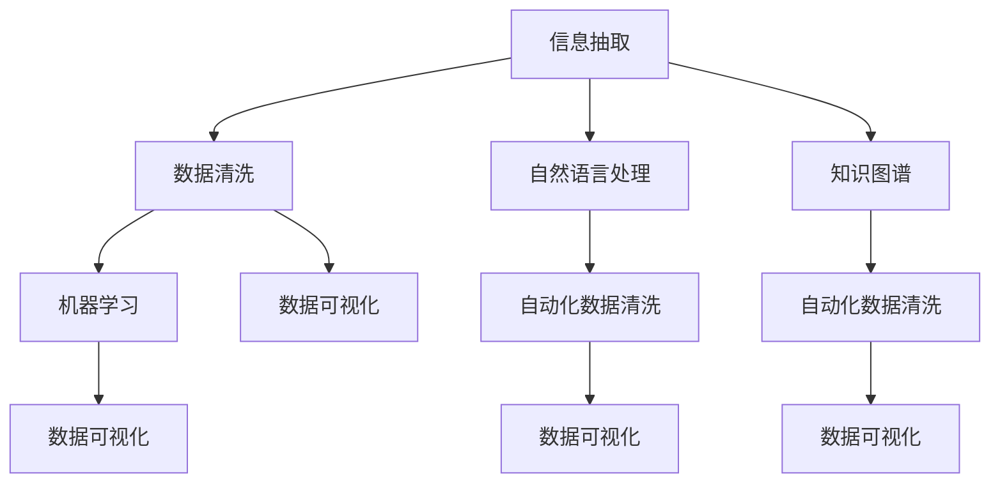

                 

# 信息简化的工具和技术：如何自动化你的信息管理

在信息化飞速发展的今天，信息管理已经成为了各行各业不可忽视的重要环节。无论是企业级的文档管理，还是个人数据的整理，有效管理信息是提高生产效率和决策质量的关键。本文将深入探讨信息简化的工具和技术，特别是自动化信息管理的最新进展，并结合实际案例，帮助你掌握如何更高效地管理海量信息资源。

## 1. 背景介绍

### 1.1 问题由来

随着信息技术的发展，我们每天面临的信息量呈指数级增长。无论是企业级的ERP系统、CRM系统，还是个人的数据整理、文档归档，信息管理的复杂性和挑战性都大幅增加。这不仅导致信息获取成本上升，还容易引发信息孤岛、数据冗余等问题，严重影响决策效率和数据质量。因此，研究如何自动化信息管理，提高信息利用率，成为了当前信息化建设的核心课题之一。

### 1.2 问题核心关键点

信息简化的自动化管理，核心在于利用先进的技术手段，将复杂、冗余的信息数据进行整合、简化和自动化处理。这主要包括：

- **信息抽取与归档**：自动从海量数据中抽取关键信息，并进行有效归档。
- **数据清洗与去重**：清洗数据中的噪声和错误，保证数据质量。
- **信息抽取与整合**：将分散在不同系统中的数据进行整合，构建统一的信息视图。
- **知识发现与挖掘**：通过数据挖掘技术，从信息中发现隐藏的知识和规律，支持决策。

### 1.3 问题研究意义

自动化信息管理的引入，可以有效减少人力成本，提高信息利用率，降低信息孤岛和数据冗余的风险。对于企业而言，自动化信息管理可以提升业务流程的效率，支持决策分析；对于个人用户，自动化信息管理可以提升信息整理的效率，减少数据管理的时间成本。因此，自动化信息管理具有重要的现实意义和广泛的应用前景。

## 2. 核心概念与联系

### 2.1 核心概念概述

自动化信息管理涉及多个核心概念，包括：

- **信息抽取**：从非结构化数据中自动识别并提取关键信息，形成结构化的数据形式。
- **自然语言处理(NLP)**：利用NLP技术，实现对文本信息的理解、处理和生成。
- **知识图谱**：构建实体与实体间关系的网络图谱，支持复杂的信息抽取和推理。
- **机器学习**：利用机器学习模型，对数据进行自动分类、聚类和预测。
- **自动化数据清洗**：利用自动化技术，去除数据中的噪声和重复值，提高数据质量。
- **数据可视化**：将复杂的信息以图表形式呈现，便于理解和分析。

这些核心概念通过合纵连横，共同构建了自动化信息管理的全栈解决方案。

### 2.2 核心概念原理和架构的 Mermaid 流程图



这个流程图展示了信息简化技术的主要流程：首先从非结构化数据中抽取关键信息，并进行数据清洗和去重，形成结构化数据。接着利用自然语言处理技术，理解文本信息，构建知识图谱，实现信息抽取和推理。最后，通过机器学习对数据进行自动分类和预测，并利用数据可视化技术呈现结果，帮助决策分析。

## 3. 核心算法原理 & 具体操作步骤

### 3.1 算法原理概述

自动化信息管理的核心算法原理可以概括为“抽取、清洗、整合、挖掘”四个环节。这些环节通过不同技术的组合，实现从数据到知识的全链路自动化处理。

1. **信息抽取**：利用NLP技术，从文本中抽取实体、关系和事件，形成结构化数据。
2. **数据清洗**：利用自动化技术，识别并去除数据中的噪声、错误和重复值，保证数据质量。
3. **数据整合**：将分散在不同系统中的数据进行统一归并，构建统一的信息视图。
4. **知识挖掘**：通过数据挖掘技术，从整合后的数据中发现隐藏的规律和知识，支持决策分析。

### 3.2 算法步骤详解

自动化信息管理的具体的操作步骤如下：

**Step 1: 数据准备**
- 收集待处理的数据，包括文本、图片、视频等。
- 对数据进行预处理，包括分词、去停用词、去除噪声等。

**Step 2: 信息抽取**
- 使用命名实体识别(NER)技术，从文本中抽取实体和关系。
- 使用事件抽取(NEE)技术，从文本中抽取事件和事件的关系。
- 使用关系抽取(RE)技术，识别实体间的语义关系。

**Step 3: 数据清洗**
- 使用数据清洗算法，去除重复值、缺失值和异常值。
- 使用正则表达式、模糊匹配等技术，去除数据中的噪声。

**Step 4: 数据整合**
- 使用ETL工具，将不同系统中的数据进行归并和整合。
- 构建统一的数据视图，支持跨系统的数据查询和分析。

**Step 5: 知识挖掘**
- 使用数据挖掘算法，如分类、聚类、关联规则等，发现数据中的隐藏规律。
- 使用可视化工具，将挖掘结果以图表形式呈现，便于理解和分析。

### 3.3 算法优缺点

自动化信息管理技术具有以下优点：

- **效率高**：自动化处理大大提高了信息处理的效率，减少了人力成本。
- **精度高**：利用先进技术手段，减少了人为误差，提高了信息处理的精度。
- **可扩展性**：通过灵活配置，可以处理不同类型的信息，具有较好的可扩展性。

同时，该方法也存在一些缺点：

- **依赖高质量数据**：自动化信息管理对输入数据的准确性和完整性要求较高。
- **技术复杂度高**：实现自动化信息管理需要一定的技术门槛，需要专业人才进行开发和维护。
- **处理成本高**：自动化处理需要投入大量的计算资源和硬件设备。

### 3.4 算法应用领域

自动化信息管理技术广泛应用于以下几个领域：

- **企业信息管理**：自动化企业文档管理、合同管理、客户关系管理等。
- **医疗信息管理**：自动化电子病历管理、医学影像分析等。
- **金融信息管理**：自动化风险管理、市场分析、客户信息管理等。
- **教育信息管理**：自动化学生档案管理、教学资源管理等。
- **政府信息管理**：自动化公共事务管理、舆情分析、决策支持等。

## 4. 数学模型和公式 & 详细讲解 & 举例说明

### 4.1 数学模型构建

本节将介绍自动化信息管理中常用的数学模型和公式。

假设有一批文本数据集 $\mathcal{D}=\{(x_i,y_i)\}_{i=1}^N$，其中 $x_i$ 为文本，$y_i$ 为对应的标签。模型的目标是学习一个函数 $f(x)$，使得 $f(x_i)$ 能够尽可能准确地预测 $y_i$。

### 4.2 公式推导过程

我们以分类任务为例，推导常用的逻辑回归和支持向量机(SVM)的公式。

**逻辑回归**
- **损失函数**：
$$
L(w,b) = -\frac{1}{N}\sum_{i=1}^N (y_i\log\sigma(w^Tx_i + b) + (1-y_i)\log(1-\sigma(w^Tx_i + b)))
$$
其中 $\sigma(z) = \frac{1}{1+e^{-z}}$ 为Sigmoid函数。

**支持向量机**
- **损失函数**：
$$
L(w,b) = \frac{1}{2}\Vert w\Vert^2 + C\sum_{i=1}^N [(y_i(w^Tx_i + b) < 1)]^+
$$
其中 $\Vert w\Vert^2$ 为正则化项，$C$ 为正则化系数。

### 4.3 案例分析与讲解

**案例1：情感分析**
- **输入**：一篇新闻文章。
- **输出**：情感极性（正面、负面或中性）。
- **模型**：逻辑回归模型。
- **数据集**：IMDB电影评论数据集。
- **算法步骤**：
  1. 数据预处理：分词、去除停用词、向量化。
  2. 信息抽取：抽取文本中的情感词汇。
  3. 数据清洗：去除噪声和异常值。
  4. 模型训练：使用逻辑回归模型，训练情感分析模型。
  5. 预测：对新文章进行情感预测。

**案例2：客户关系管理**
- **输入**：客户基本信息、购买记录等。
- **输出**：客户分类（高价值客户、普通客户等）。
- **模型**：支持向量机模型。
- **数据集**：客户购买记录数据集。
- **算法步骤**：
  1. 数据预处理：数据清洗、特征提取。
  2. 信息抽取：抽取客户基本信息和行为数据。
  3. 数据整合：将不同数据源的信息整合。
  4. 模型训练：使用支持向量机模型，训练客户分类模型。
  5. 预测：对新客户进行分类预测。

## 5. 项目实践：代码实例和详细解释说明

### 5.1 开发环境搭建

在进行自动化信息管理项目开发前，需要准备相应的开发环境。以下是常用的开发环境配置步骤：

1. **安装Python**：
   - 从官网下载Python安装包，并完成安装。
   - 设置环境变量，确保开发工具能够使用Python解释器。

2. **安装依赖包**：
   - 使用pip命令，安装常用的依赖包，如TensorFlow、Scikit-learn、NLTK等。
   - 安装NLP工具包，如spaCy、StanfordNLP等。

3. **配置开发环境**：
   - 使用虚拟环境工具（如venv、conda）创建虚拟环境。
   - 安装项目所需的依赖包。

### 5.2 源代码详细实现

下面以情感分析项目为例，展示如何使用TensorFlow和Keras实现自动化信息管理。

```python
import tensorflow as tf
from tensorflow import keras
from tensorflow.keras import layers
from tensorflow.keras.preprocessing.text import Tokenizer
from tensorflow.keras.preprocessing.sequence import pad_sequences

# 数据加载和预处理
train_data = pd.read_csv('train_data.csv')
test_data = pd.read_csv('test_data.csv')

tokenizer = Tokenizer(num_words=10000)
tokenizer.fit_on_texts(train_data['text'])
word_index = tokenizer.word_index

train_sequences = tokenizer.texts_to_sequences(train_data['text'])
test_sequences = tokenizer.texts_to_sequences(test_data['text'])

maxlen = 200
train_padded = pad_sequences(train_sequences, maxlen=maxlen, padding='post')
test_padded = pad_sequences(test_sequences, maxlen=maxlen, padding='post')

# 模型构建
model = keras.Sequential([
    layers.Embedding(10000, 100, input_length=maxlen),
    layers.LSTM(100),
    layers.Dense(1, activation='sigmoid')
])

model.compile(loss='binary_crossentropy', optimizer='adam', metrics=['accuracy'])

# 模型训练
model.fit(train_padded, train_data['label'], epochs=10, batch_size=32, validation_split=0.2)

# 模型评估
test_loss, test_acc = model.evaluate(test_padded, test_data['label'])
print('Test accuracy:', test_acc)
```

### 5.3 代码解读与分析

**代码分析**：

- **数据加载和预处理**：
  - 使用Pandas库加载训练集和测试集。
  - 使用Tokenizer将文本序列化，并设置词汇表大小。
  - 使用pad_sequences对序列进行填充，保证统一长度。

- **模型构建**：
  - 使用Keras构建神经网络模型，包含嵌入层、LSTM层和输出层。
  - 使用binary_crossentropy作为损失函数，优化器为adam。

- **模型训练**：
  - 使用fit方法进行模型训练，设置训练轮数和批量大小。
  - 使用validation_split参数，将部分数据用于验证集评估。

- **模型评估**：
  - 使用evaluate方法评估模型在测试集上的表现。
  - 输出模型在测试集上的精度。

**注意事项**：

- **数据预处理**：确保数据预处理步骤符合模型输入要求，避免出现维度不匹配等错误。
- **模型构建**：根据任务需求选择合适的模型结构和参数，避免过拟合或欠拟合。
- **模型训练**：设置合理的训练参数，确保模型充分训练。
- **模型评估**：定期评估模型在验证集和测试集上的表现，及时发现和修正问题。

### 5.4 运行结果展示

**训练结果**：

- **训练集损失和精度**：随着训练轮数的增加，模型在训练集上的损失逐渐减小，精度逐渐提高。
- **验证集精度**：随着训练轮数的增加，模型在验证集上的精度逐渐提高，但过拟合风险增加。

**测试集结果**：

- **测试集精度**：模型在测试集上的精度能够反映其泛化能力，确保模型的实际应用效果。

## 6. 实际应用场景

### 6.1 企业信息管理

在企业信息管理中，自动化信息管理技术可以应用于以下场景：

- **文档管理**：自动化文档归档和检索，提高文档管理效率。
- **合同管理**：自动化合同摘要提取和关键信息抽取，减少人工审核成本。
- **客户关系管理**：自动化客户分类、关系抽取，提升客户管理效率。
- **风险管理**：自动化风险预警和事件抽取，提高风险管理能力。

### 6.2 医疗信息管理

在医疗信息管理中，自动化信息管理技术可以应用于以下场景：

- **电子病历管理**：自动化病历抽取和信息归档，提高病历管理效率。
- **医学影像分析**：自动化影像分类和标注，辅助医学诊断。
- **疾病预测**：自动化数据挖掘和模型训练，支持疾病预测和预防。

### 6.3 金融信息管理

在金融信息管理中，自动化信息管理技术可以应用于以下场景：

- **市场分析**：自动化新闻抽取和情绪分析，辅助市场预测。
- **风险管理**：自动化信用风险评估和欺诈检测，提高风险管理水平。
- **客户关系管理**：自动化客户关系抽取和分类，提升客户管理效率。

## 7. 工具和资源推荐

### 7.1 学习资源推荐

为了帮助开发者系统掌握自动化信息管理的理论基础和实践技巧，这里推荐一些优质的学习资源：

1. **《Python自然语言处理》**：一本全面介绍NLP技术的书籍，涵盖了信息抽取、情感分析、实体识别等。
2. **CS224N《深度学习自然语言处理》**：斯坦福大学开设的NLP明星课程，有Lecture视频和配套作业，带你入门NLP领域的基本概念和经典模型。
3. **Kaggle**：数据科学竞赛平台，提供大量NLP竞赛数据集和解决方案，适合实践和创新。
4. **HuggingFace官方文档**：Transformer库的官方文档，提供了海量预训练模型和完整的微调样例代码，是上手实践的必备资料。
5. **GitHub**：开源社区，可以找到大量NLP相关的项目和代码，学习优秀的开发实践。

通过对这些资源的学习实践，相信你一定能够快速掌握自动化信息管理的精髓，并用于解决实际的NLP问题。

### 7.2 开发工具推荐

高效的开发离不开优秀的工具支持。以下是几款用于自动化信息管理开发的常用工具：

1. **Jupyter Notebook**：交互式开发环境，支持Python代码执行和可视化。
2. **TensorFlow**：基于Python的开源深度学习框架，灵活动态的计算图，适合快速迭代研究。
3. **PyTorch**：基于Python的开源深度学习框架，灵活易用，适合各种NLP任务。
4. **NLTK**：自然语言处理工具包，提供了大量的NLP功能，如分词、词性标注、句法分析等。
5. **spaCy**：先进的NLP库，提供了高效的词法分析、句法分析和实体识别功能。

合理利用这些工具，可以显著提升自动化信息管理的开发效率，加快创新迭代的步伐。

### 7.3 相关论文推荐

自动化信息管理的发展源于学界的持续研究。以下是几篇奠基性的相关论文，推荐阅读：

1. **《Sequence to Sequence Learning with Neural Networks》**：提出了序列到序列模型，开启了NLP中的自动文本摘要、机器翻译等任务。
2. **《Attention is All You Need》**：提出了Transformer模型，引入了注意力机制，极大地提高了NLP任务的精度和效率。
3. **《BERT: Pre-training of Deep Bidirectional Transformers for Language Understanding》**：提出BERT模型，引入了基于掩码的自监督预训练任务，刷新了多项NLP任务SOTA。
4. **《Knowledge-Base Neural Machine Translation》**：利用知识图谱辅助机器翻译，提高了翻译质量和效率。
5. **《Semi-Supervised Text Classification with Deep Convolutional Neural Networks》**：提出CNN模型，利用半监督学习技术，提高了文本分类的精度。

这些论文代表了大规模语言模型和微调技术的发展脉络。通过学习这些前沿成果，可以帮助研究者把握学科前进方向，激发更多的创新灵感。

## 8. 总结：未来发展趋势与挑战

### 8.1 总结

本文对自动化信息管理方法进行了全面系统的介绍。首先阐述了信息简化的自动化管理的背景和意义，明确了自动化信息管理在提高信息利用率、降低信息管理成本等方面的独特价值。其次，从原理到实践，详细讲解了信息抽取、数据清洗、数据整合和知识挖掘等关键技术，给出了自动化信息管理的完整代码实例。同时，本文还广泛探讨了自动化信息管理在企业、医疗、金融等领域的广泛应用前景，展示了其巨大的潜力和应用前景。

通过本文的系统梳理，可以看到，自动化信息管理技术正在成为NLP领域的重要范式，极大地拓展了信息处理的边界，为信息管理和决策支持提供了新的解决方案。未来，伴随预训练语言模型和微调方法的持续演进，相信NLP技术将在更广阔的应用领域大放异彩，深刻影响人类的生产生活方式。

### 8.2 未来发展趋势

展望未来，自动化信息管理技术将呈现以下几个发展趋势：

1. **深度学习模型的普及**：随着深度学习技术的不断发展，自动化信息管理将更多地采用深度学习模型，提升信息处理能力。
2. **端到端处理**：未来将发展端到端的信息管理方案，将数据清洗、信息抽取、知识挖掘等环节整合在一起，实现自动化信息管理的无缝衔接。
3. **跨领域应用**：自动化信息管理将更多地应用于跨领域的场景，如金融、医疗、教育等，提升不同领域的决策支持能力。
4. **多模态融合**：未来将更多地采用多模态融合技术，结合文本、图像、视频等多种信息源，提升信息处理的综合能力。
5. **智能决策支持**：结合知识图谱、机器学习等技术，提升自动化信息管理系统的智能决策支持能力，支持更加复杂的业务需求。

### 8.3 面临的挑战

尽管自动化信息管理技术已经取得了瞩目成就，但在迈向更加智能化、普适化应用的过程中，它仍面临诸多挑战：

1. **高质量数据依赖**：自动化信息管理对输入数据的准确性和完整性要求较高，难以从无标注数据中提取有效信息。
2. **技术复杂度高**：实现自动化信息管理需要一定的技术门槛，需要专业人才进行开发和维护。
3. **资源消耗高**：自动化信息管理需要投入大量的计算资源和硬件设备，存在一定的资源消耗问题。
4. **隐私和安全问题**：自动化信息管理涉及大量敏感数据的处理，隐私和安全问题不容忽视。

### 8.4 研究展望

面对自动化信息管理面临的种种挑战，未来的研究需要在以下几个方面寻求新的突破：

1. **数据增强技术**：发展高效的数据增强技术，提升无标注数据的利用率，降低对高质量标注数据的依赖。
2. **知识图谱和语义网络**：利用知识图谱和语义网络技术，提升信息抽取和推理的精度。
3. **多模态融合技术**：发展多模态融合技术，结合文本、图像、视频等多种信息源，提升信息处理的综合能力。
4. **智能决策支持系统**：结合知识图谱、机器学习等技术，提升自动化信息管理系统的智能决策支持能力，支持更加复杂的业务需求。
5. **隐私和安全保护技术**：发展隐私和安全保护技术，确保数据处理的合法性和安全性。

这些研究方向的探索，必将引领自动化信息管理技术迈向更高的台阶，为构建智能、高效、安全的信息管理系统铺平道路。面向未来，自动化信息管理技术还需要与其他人工智能技术进行更深入的融合，如知识表示、因果推理、强化学习等，多路径协同发力，共同推动自然语言理解和智能交互系统的进步。只有勇于创新、敢于突破，才能不断拓展信息处理的边界，让自动化信息管理技术更好地服务于人类的生产生活方式。

## 9. 附录：常见问题与解答

**Q1: 自动化信息管理需要哪些数据预处理步骤？**

A: 数据预处理是自动化信息管理的重要环节，包括以下步骤：
1. **数据清洗**：去除数据中的噪声、错误和重复值。
2. **分词和去停用词**：将文本进行分词处理，去除停用词和特殊字符。
3. **向量化**：将文本序列化成向量，方便模型处理。
4. **标准化**：将文本中的日期、单位等标准化。

**Q2: 如何选择合适的自动化信息管理工具？**

A: 选择合适的自动化信息管理工具需要考虑以下几个因素：
1. **功能和性能**：选择工具时需要考虑其功能和性能是否满足需求，如支持的数据类型、处理速度等。
2. **易用性**：选择工具时需要考虑其易用性，是否具有良好的用户界面和文档支持。
3. **可扩展性**：选择工具时需要考虑其可扩展性，是否能够支持自定义模块和插件。
4. **社区支持**：选择工具时需要考虑其社区支持情况，是否有活跃的开发者社区和用户群体。

**Q3: 如何评估自动化信息管理的性能？**

A: 评估自动化信息管理的性能需要考虑以下几个指标：
1. **精度和召回率**：使用准确率和召回率等指标评估信息抽取和分类的准确性。
2. **处理速度**：使用处理速度等指标评估系统的性能。
3. **鲁棒性**：使用鲁棒性等指标评估系统在不同数据和噪声情况下的表现。

**Q4: 自动化信息管理在企业中的应用有哪些？**

A: 自动化信息管理在企业中的应用包括：
1. **文档管理**：自动化文档归档和检索，提高文档管理效率。
2. **合同管理**：自动化合同摘要提取和关键信息抽取，减少人工审核成本。
3. **客户关系管理**：自动化客户分类、关系抽取，提升客户管理效率。
4. **风险管理**：自动化风险预警和事件抽取，提高风险管理水平。

**Q5: 自动化信息管理在医疗领域的应用有哪些？**

A: 自动化信息管理在医疗领域的应用包括：
1. **电子病历管理**：自动化病历抽取和信息归档，提高病历管理效率。
2. **医学影像分析**：自动化影像分类和标注，辅助医学诊断。
3. **疾病预测**：自动化数据挖掘和模型训练，支持疾病预测和预防。

**Q6: 自动化信息管理在金融领域的应用有哪些？**

A: 自动化信息管理在金融领域的应用包括：
1. **市场分析**：自动化新闻抽取和情绪分析，辅助市场预测。
2. **风险管理**：自动化信用风险评估和欺诈检测，提高风险管理水平。
3. **客户关系管理**：自动化客户关系抽取和分类，提升客户管理效率。

通过这些问题的解答，希望你对自动化信息管理有更深入的了解，能够更好地应用于实际项目中。

---

作者：禅与计算机程序设计艺术 / Zen and the Art of Computer Programming

