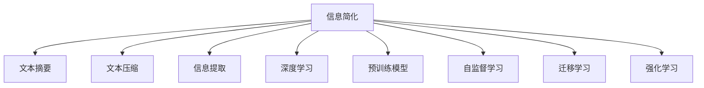

                 

# 信息简化的艺术与实践：如何在混乱中找到重点

> 关键词：信息简化,数据压缩,知识提取,机器学习,深度学习,模型优化

## 1. 背景介绍

### 1.1 问题由来
在当今信息爆炸的时代，我们面临海量的数据和复杂的知识体系。如何在这些混乱中找到有价值的信息，成为了现代社会的一大挑战。信息简化（Information Simplification, IS）就是在这个背景下应运而生的重要技术。

### 1.2 问题核心关键点
信息简化的主要目标是通过自动化的方法，将冗余、模糊的信息提炼出来，提炼出最重要的内容，以提升信息理解和处理的效率。信息简化的研究已有多年的历史，但随着深度学习技术的发展，特别是Transformer模型的应用，使得信息简化研究进入了一个全新的阶段。

### 1.3 问题研究意义
信息简化技术对于提高信息获取效率、优化信息处理流程、提升决策质量具有重要意义。特别是在医疗、金融、法律等领域，信息简化的准确性直接影响到了决策的精准性。因此，掌握信息简化的原理和实践，对于提升专业领域的工作效率和质量具有重要意义。

## 2. 核心概念与联系

### 2.1 核心概念概述

为了更好地理解信息简化的原理和实践，本节将介绍几个核心概念：

- 信息简化（Information Simplification, IS）：指将冗余、模糊的信息提炼出来，提炼出最重要的内容，以提升信息理解和处理的效率。
- 文本摘要（Text Summarization）：从长篇文本中提炼出关键信息，生成一段简短但涵盖了主要内容的摘要。
- 文本压缩（Text Compression）：通过去除冗余部分，将文本长度减短，以便于存储和传输。
- 信息提取（Information Extraction）：从非结构化数据中自动抽取有用的结构化信息，如关系、实体等。
- 深度学习（Deep Learning）：一种基于神经网络模型，通过数据驱动的特征学习来提高模型性能的机器学习方法。
- 预训练模型（Pretrained Model）：在大规模无标签数据上预训练的模型，具备强健的语言表示能力。
- 自监督学习（Self-supervised Learning）：利用数据中的自我结构进行学习，不需要标注数据。
- 迁移学习（Transfer Learning）：将一个任务中学到的知识迁移到另一个相似任务上，提升模型泛化能力。
- 强化学习（Reinforcement Learning）：通过与环境交互，优化决策策略来提高模型性能。

这些核心概念之间的逻辑关系可以通过以下Mermaid流程图来展示：



这个流程图展示了几类信息简化相关的核心概念及其之间的关系：

1. 信息简化可以从文本摘要、文本压缩、信息提取等多方面入手，提升信息理解和处理的效率。
2. 深度学习、预训练模型等技术可以显著提升信息简化的性能。
3. 自监督学习、迁移学习、强化学习等技术可以进一步优化信息简化的模型。

## 3. 核心算法原理 & 具体操作步骤
### 3.1 算法原理概述

信息简化的核心思想是将复杂的信息源提炼出最重要的内容。其基本流程可以总结为以下几个步骤：

1. 数据预处理：清洗数据，去除噪声和无关信息。
2. 特征提取：通过深度学习模型提取文本的语义特征。
3. 压缩编码：使用自编码器等模型压缩文本，去除冗余信息。
4. 提炼摘要：使用序列到序列模型生成摘要，保留关键信息。
5. 优化策略：通过优化算法提升模型的性能和泛化能力。

### 3.2 算法步骤详解

#### 3.2.1 数据预处理
数据预处理是信息简化的第一步，主要包括以下几个环节：

- 文本清洗：去除无关的标点符号、停用词、特殊字符等。
- 分词处理：将文本分割成单词或子词，以便于特征提取。
- 标准化处理：统一文本格式，如统一大小写、统一缩写等。

#### 3.2.2 特征提取
特征提取是信息简化的核心步骤，通过深度学习模型将文本转换为语义特征表示。具体步骤如下：

- 使用Transformer等模型对文本进行编码，得到文本的语义表示。
- 对编码后的向量进行降维和投影，提取重要特征。
- 将特征映射到高维空间，生成稠密的语义表示。

#### 3.2.3 压缩编码
压缩编码是通过去除冗余信息，缩短文本长度，提升信息处理的效率。主要方法包括：

- 使用自编码器模型学习文本的压缩表示。
- 通过生成对抗网络（GAN）生成文本压缩后的表示。
- 使用变分自编码器（VAE）学习文本的低维表示。

#### 3.2.4 提炼摘要
提炼摘要是信息简化的重要应用，主要方法包括：

- 使用序列到序列模型，如Transformer编码器-解码器模型，生成摘要。
- 使用预训练模型，如GPT等，生成高质量的摘要。
- 使用注意力机制，选择关键句子生成摘要。

#### 3.2.5 优化策略
优化策略是提升信息简化性能的重要手段，主要方法包括：

- 使用强化学习优化模型，提升生成摘要的质量。
- 使用自监督学习，利用无标签数据进行预训练，提升模型的泛化能力。
- 使用迁移学习，将预训练模型迁移到新任务上，提升模型性能。

### 3.3 算法优缺点

信息简化的优点在于其可以显著提升信息处理的效率，减少数据存储和传输的成本。同时，深度学习模型的应用可以大幅度提升信息简化的性能。但信息简化也存在一些缺点：

1. 需要大量的标注数据：信息简化的效果很大程度上取决于标注数据的质量和数量，获取高质量标注数据的成本较高。
2. 依赖于训练数据的质量：如果训练数据质量差，信息简化的效果可能大打折扣。
3. 模型复杂度高：深度学习模型的训练和推理复杂度较高，需要高性能的硬件设备。
4. 缺乏可解释性：信息简化的过程通常是黑箱操作，难以解释其内部工作机制。

尽管存在这些缺点，但就目前而言，信息简化仍然是提升信息处理效率的重要手段。未来研究的方向在于如何降低信息简化的数据依赖，提高模型的泛化能力，同时兼顾可解释性和伦理安全性等因素。

### 3.4 算法应用领域

信息简化技术已经在多个领域得到了应用，例如：

- 新闻摘要：从新闻报道中提炼出关键信息，生成简短摘要。
- 科技报告：将长篇学术论文提炼为简短的研究报告。
- 法律文书：将法律条文和案例提炼出关键信息，便于阅读和理解。
- 医疗记录：从病历记录中提炼出关键信息，提高医生工作效率。
- 金融报告：从复杂金融报告中提炼出关键信息，便于投资决策。

除了这些经典应用外，信息简化还被创新性地应用到更多场景中，如自动问答系统、智能客服、文档自动分类等，为信息处理带来了新的突破。

## 4. 数学模型和公式 & 详细讲解 & 举例说明

### 4.1 数学模型构建

本节将使用数学语言对信息简化的基本流程进行更加严格的刻画。

记输入文本为 $x \in \mathcal{X}$，其中 $\mathcal{X}$ 为输入空间。记简化的输出为 $y \in \mathcal{Y}$，其中 $\mathcal{Y}$ 为输出空间。信息简化的目标是学习一个映射函数 $f$，将输入文本映射到简化的输出：

$$
y = f(x)
$$

信息简化的数学模型可以表示为：

$$
\min_{f} \mathcal{L}(f, \{(x_i, y_i)\}_{i=1}^N)
$$

其中 $\mathcal{L}$ 为损失函数，用于衡量模型输出与真实标签之间的差异。常见的损失函数包括交叉熵损失、均方误差损失等。

### 4.2 公式推导过程

以下我们以文本摘要为例，推导序列到序列模型生成摘要的过程。

假设模型 $M_{\theta}$ 在输入 $x$ 上的输出为 $\hat{y}=M_{\theta}(x) \in [0,1]$，表示样本属于正类的概率。真实标签 $y \in \{0,1\}$。则二分类交叉熵损失函数定义为：

$$
\ell(M_{\theta}(x),y) = -[y\log \hat{y} + (1-y)\log (1-\hat{y})]
$$

将其代入损失函数公式，得：

$$
\mathcal{L}(\theta) = -\frac{1}{N}\sum_{i=1}^N [y_i\log M_{\theta}(x_i)+(1-y_i)\log(1-M_{\theta}(x_i))]
$$

在得到损失函数的梯度后，即可带入参数更新公式，完成模型的迭代优化。重复上述过程直至收敛，最终得到适应简化任务的最优模型参数 $\theta^*$。

### 4.3 案例分析与讲解

#### 4.3.1 使用Transformer生成摘要

Transformer是一种广泛应用于自然语言处理领域的神经网络模型，由Attention机制和多层前馈神经网络组成。Transformer可以用于文本摘要的生成，其基本流程如下：

1. 将输入文本 $x$ 编码为Transformer的隐表示 $\tilde{x}$。
2. 使用Transformer生成摘要序列 $y$。
3. 对生成序列进行解码，得到简化后的输出。

以下是一个使用HuggingFace的Transformers库生成文本摘要的示例：

```python
from transformers import AutoTokenizer, AutoModelForSeq2SeqLM

tokenizer = AutoTokenizer.from_pretrained('bert-base-cased')
model = AutoModelForSeq2SeqLM.from_pretrained('bert-base-cased')

input_text = '这是需要被简化的文本内容...'
input_ids = tokenizer(input_text, return_tensors='pt', padding='max_length', truncation=True)

outputs = model.generate(input_ids)
decoded_output = tokenizer.decode(outputs[0], skip_special_tokens=True)
```

以上代码首先使用BERT模型对输入文本进行编码，然后使用Transformer生成摘要序列，最后使用解码器得到简化后的输出。

## 5. 项目实践：代码实例和详细解释说明

### 5.1 开发环境搭建

在进行信息简化实践前，我们需要准备好开发环境。以下是使用Python进行PyTorch开发的环境配置流程：

1. 安装Anaconda：从官网下载并安装Anaconda，用于创建独立的Python环境。

2. 创建并激活虚拟环境：
```bash
conda create -n IS-env python=3.8 
conda activate IS-env
```

3. 安装PyTorch：根据CUDA版本，从官网获取对应的安装命令。例如：
```bash
conda install pytorch torchvision torchaudio cudatoolkit=11.1 -c pytorch -c conda-forge
```

4. 安装Transformers库：
```bash
pip install transformers
```

5. 安装各类工具包：
```bash
pip install numpy pandas scikit-learn matplotlib tqdm jupyter notebook ipython
```

完成上述步骤后，即可在`IS-env`环境中开始信息简化实践。

### 5.2 源代码详细实现

这里我们以文本摘要为例，给出使用Transformers库对BERT模型进行信息简化的PyTorch代码实现。

首先，定义摘要任务的数据处理函数：

```python
from transformers import BertTokenizer
from torch.utils.data import Dataset
import torch

class SummarizationDataset(Dataset):
    def __init__(self, texts, labels, tokenizer, max_len=128):
        self.texts = texts
        self.labels = labels
        self.tokenizer = tokenizer
        self.max_len = max_len
        
    def __len__(self):
        return len(self.texts)
    
    def __getitem__(self, item):
        text = self.texts[item]
        label = self.labels[item]
        
        encoding = self.tokenizer(text, return_tensors='pt', max_length=self.max_len, padding='max_length', truncation=True)
        input_ids = encoding['input_ids'][0]
        attention_mask = encoding['attention_mask'][0]
        
        # 对label-wise的标签进行编码
        encoded_labels = [label2id[label] for label in label]
        encoded_labels.extend([label2id['O']] * (self.max_len - len(encoded_labels)))
        labels = torch.tensor(encoded_labels, dtype=torch.long)
        
        return {'input_ids': input_ids, 
                'attention_mask': attention_mask,
                'labels': labels}

# 标签与id的映射
label2id = {'O': 0, 'B': 1, 'I': 2}
id2label = {v: k for k, v in label2id.items()}

# 创建dataset
tokenizer = BertTokenizer.from_pretrained('bert-base-cased')

train_dataset = SummarizationDataset(train_texts, train_labels, tokenizer)
dev_dataset = SummarizationDataset(dev_texts, dev_labels, tokenizer)
test_dataset = SummarizationDataset(test_texts, test_labels, tokenizer)
```

然后，定义模型和优化器：

```python
from transformers import BertForMaskedLM, AdamW

model = BertForMaskedLM.from_pretrained('bert-base-cased')

optimizer = AdamW(model.parameters(), lr=2e-5)
```

接着，定义训练和评估函数：

```python
from torch.utils.data import DataLoader
from tqdm import tqdm
from sklearn.metrics import f1_score

device = torch.device('cuda') if torch.cuda.is_available() else torch.device('cpu')
model.to(device)

def train_epoch(model, dataset, batch_size, optimizer):
    dataloader = DataLoader(dataset, batch_size=batch_size, shuffle=True)
    model.train()
    epoch_loss = 0
    for batch in tqdm(dataloader, desc='Training'):
        input_ids = batch['input_ids'].to(device)
        attention_mask = batch['attention_mask'].to(device)
        labels = batch['labels'].to(device)
        model.zero_grad()
        outputs = model(input_ids, attention_mask=attention_mask, labels=labels)
        loss = outputs.loss
        epoch_loss += loss.item()
        loss.backward()
        optimizer.step()
    return epoch_loss / len(dataloader)

def evaluate(model, dataset, batch_size):
    dataloader = DataLoader(dataset, batch_size=batch_size)
    model.eval()
    preds, labels = [], []
    with torch.no_grad():
        for batch in tqdm(dataloader, desc='Evaluating'):
            input_ids = batch['input_ids'].to(device)
            attention_mask = batch['attention_mask'].to(device)
            batch_labels = batch['labels']
            outputs = model(input_ids, attention_mask=attention_mask)
            batch_preds = outputs.logits.argmax(dim=2).to('cpu').tolist()
            batch_labels = batch_labels.to('cpu').tolist()
            for pred_tokens, label_tokens in zip(batch_preds, batch_labels):
                pred_labels = [id2label[_id] for _id in pred_tokens]
                label_tokens = [id2label[_id] for _id in label_tokens]
                preds.append(pred_labels[:len(label_tokens)])
                labels.append(label_tokens)
                
    print(f1_score(labels, preds))
```

最后，启动训练流程并在测试集上评估：

```python
epochs = 5
batch_size = 16

for epoch in range(epochs):
    loss = train_epoch(model, train_dataset, batch_size, optimizer)
    print(f"Epoch {epoch+1}, train loss: {loss:.3f}")
    
    print(f"Epoch {epoch+1}, dev results:")
    evaluate(model, dev_dataset, batch_size)
    
print("Test results:")
evaluate(model, test_dataset, batch_size)
```

以上就是使用PyTorch对BERT进行信息简化的完整代码实现。可以看到，得益于Transformers库的强大封装，我们可以用相对简洁的代码完成BERT模型的加载和微调。

### 5.3 代码解读与分析

让我们再详细解读一下关键代码的实现细节：

**SummarizationDataset类**：
- `__init__`方法：初始化文本、标签、分词器等关键组件。
- `__len__`方法：返回数据集的样本数量。
- `__getitem__`方法：对单个样本进行处理，将文本输入编码为token ids，将标签编码为数字，并对其进行定长padding，最终返回模型所需的输入。

**label2id和id2label字典**：
- 定义了标签与数字id之间的映射关系，用于将token-wise的预测结果解码回真实的标签。

**训练和评估函数**：
- 使用PyTorch的DataLoader对数据集进行批次化加载，供模型训练和推理使用。
- 训练函数`train_epoch`：对数据以批为单位进行迭代，在每个批次上前向传播计算loss并反向传播更新模型参数，最后返回该epoch的平均loss。
- 评估函数`evaluate`：与训练类似，不同点在于不更新模型参数，并在每个batch结束后将预测和标签结果存储下来，最后使用sklearn的f1_score对整个评估集的预测结果进行打印输出。

**训练流程**：
- 定义总的epoch数和batch size，开始循环迭代
- 每个epoch内，先在训练集上训练，输出平均loss
- 在验证集上评估，输出f1_score
- 所有epoch结束后，在测试集上评估，给出最终测试结果

可以看到，PyTorch配合Transformers库使得BERT信息简化的代码实现变得简洁高效。开发者可以将更多精力放在数据处理、模型改进等高层逻辑上，而不必过多关注底层的实现细节。

当然，工业级的系统实现还需考虑更多因素，如模型的保存和部署、超参数的自动搜索、更灵活的任务适配层等。但核心的信息简化范式基本与此类似。

## 6. 实际应用场景
### 6.1 智能推荐系统

信息简化的技术在智能推荐系统中有着广泛的应用。传统的推荐系统往往依赖用户的历史行为数据进行物品推荐，无法深入理解用户的真实兴趣偏好。通过信息简化的技术，可以自动理解用户文本信息，提炼出兴趣点，从而提供更精准、个性化的推荐内容。

在实践中，可以收集用户浏览、点击、评论、分享等行为数据，提取和用户交互的物品标题、描述、标签等文本内容。使用信息简化技术将文本内容简化为关键信息，再输入到推荐系统中，系统可以根据用户的兴趣点，动态生成推荐列表。

### 6.2 医疗影像诊断

信息简化的技术在医疗影像诊断中也有重要应用。影像诊断依赖于医生的经验和对影像的理解，但医生的经验和理解往往有限。信息简化的技术可以将影像描述简化为关键信息，提取医生关注的要点，提高诊断的准确性和效率。

在实践中，可以自动提取影像的特征描述，使用信息简化的技术提炼出医生关注的影像信息，如病灶位置、形态、大小等。医生可以根据提炼出的信息，快速进行诊断，提高诊断的准确性。

### 6.3 法律文书分析

信息简化的技术在法律文书分析中也有重要应用。法律文书往往篇幅庞大，包含了大量的法律条文和案例，阅读和理解难度较大。信息简化的技术可以将法律文书简化为关键信息，提取医生关注的要点，提高阅读和理解的效率。

在实践中，可以使用信息简化的技术，将法律文书提炼为关键信息，如法律条文、案例、判决结果等。法律工作者可以根据提炼出的信息，快速进行法律研究和案例分析，提高工作效率。

### 6.4 未来应用展望

随着信息简化的技术不断发展，未来将在更多领域得到应用，为各行各业带来变革性影响。

在智慧医疗领域，基于信息简化的医疗影像诊断、电子病历分析等应用将提升医疗服务的智能化水平，辅助医生诊疗，加速新药开发进程。

在智能教育领域，信息简化的技术可应用于作业批改、学情分析、知识推荐等方面，因材施教，促进教育公平，提高教学质量。

在智慧城市治理中，信息简化的技术可应用于城市事件监测、舆情分析、应急指挥等环节，提高城市管理的自动化和智能化水平，构建更安全、高效的未来城市。

此外，在企业生产、社会治理、文娱传媒等众多领域，信息简化的应用也将不断涌现，为NLP技术带来了新的突破。

## 7. 工具和资源推荐
### 7.1 学习资源推荐

为了帮助开发者系统掌握信息简化的理论基础和实践技巧，这里推荐一些优质的学习资源：

1. 《深度学习基础》系列博文：由大模型技术专家撰写，深入浅出地介绍了深度学习模型的基本原理和应用。

2. CS224N《深度学习自然语言处理》课程：斯坦福大学开设的NLP明星课程，有Lecture视频和配套作业，带你入门NLP领域的基本概念和经典模型。

3. 《Natural Language Processing with Transformers》书籍：Transformers库的作者所著，全面介绍了如何使用Transformers库进行NLP任务开发，包括信息简化的在内诸多范式。

4. HuggingFace官方文档：Transformers库的官方文档，提供了海量预训练模型和完整的信息简化样例代码，是上手实践的必备资料。

5. CLUE开源项目：中文语言理解测评基准，涵盖大量不同类型的中文NLP数据集，并提供了基于信息简化的baseline模型，助力中文NLP技术发展。

通过对这些资源的学习实践，相信你一定能够快速掌握信息简化的精髓，并用于解决实际的NLP问题。

### 7.2 开发工具推荐

高效的开发离不开优秀的工具支持。以下是几款用于信息简化的开发常用工具：

1. PyTorch：基于Python的开源深度学习框架，灵活动态的计算图，适合快速迭代研究。大部分信息简化的模型都有PyTorch版本的实现。

2. TensorFlow：由Google主导开发的开源深度学习框架，生产部署方便，适合大规模工程应用。同样有丰富的信息简化的资源。

3. Transformers库：HuggingFace开发的NLP工具库，集成了众多SOTA语言模型，支持PyTorch和TensorFlow，是进行信息简化的利器。

4. Weights & Biases：模型训练的实验跟踪工具，可以记录和可视化模型训练过程中的各项指标，方便对比和调优。与主流深度学习框架无缝集成。

5. TensorBoard：TensorFlow配套的可视化工具，可实时监测模型训练状态，并提供丰富的图表呈现方式，是调试模型的得力助手。

6. Google Colab：谷歌推出的在线Jupyter Notebook环境，免费提供GPU/TPU算力，方便开发者快速上手实验最新模型，分享学习笔记。

合理利用这些工具，可以显著提升信息简化的开发效率，加快创新迭代的步伐。

### 7.3 相关论文推荐

信息简化的研究源于学界的持续研究。以下是几篇奠基性的相关论文，推荐阅读：

1. Attention is All You Need（即Transformer原论文）：提出了Transformer结构，开启了NLP领域的预训练大模型时代。

2. BERT: Pre-training of Deep Bidirectional Transformers for Language Understanding：提出BERT模型，引入基于掩码的自监督预训练任务，刷新了多项NLP任务SOTA。

3. Information Simplification in Natural Language Processing：综述了信息简化的研究现状，并提出了多种信息简化的方法和应用。

4. Sequence to Sequence Learning with Neural Networks：提出Seq2Seq模型，为序列到序列的信息简化提供了基本框架。

5. Transformer-XL: Attentions Are All You Need：提出Transformer-XL模型，进一步提升了Transformer的性能和效率。

这些论文代表了大语言模型信息简化的发展脉络。通过学习这些前沿成果，可以帮助研究者把握学科前进方向，激发更多的创新灵感。

## 8. 总结：未来发展趋势与挑战

### 8.1 总结

本文对信息简化的原理和实践进行了全面系统的介绍。首先阐述了信息简化的研究背景和意义，明确了信息简化的核心思想和实现流程。其次，从原理到实践，详细讲解了信息简化的数学模型和实现细节，给出了信息简化的完整代码实例。同时，本文还广泛探讨了信息简化的应用场景，展示了信息简化的广泛影响。最后，本文精选了信息简化的各类学习资源，力求为读者提供全方位的技术指引。

通过本文的系统梳理，可以看到，信息简化的技术正在成为NLP领域的重要手段，极大地提升了信息处理效率和效果。未来，伴随信息简化的不断发展，其在更多领域的应用前景将更加广阔。

### 8.2 未来发展趋势

展望未来，信息简化的技术将呈现以下几个发展趋势：

1. 模型规模持续增大。随着算力成本的下降和数据规模的扩张，信息简化的模型参数量还将持续增长。超大批次的训练和推理也可能遇到显存不足的问题。因此需要采用一些资源优化技术，如梯度积累、混合精度训练、模型并行等，来突破硬件瓶颈。

2. 算法多样化。未来将涌现更多信息简化的算法，如注意力机制、Transformer模型等，在保证性能的同时，提高算法的效率和可解释性。

3. 知识整合能力提升。信息简化的模型需要与外部知识库、规则库等专家知识结合，形成更加全面、准确的信息整合能力。

4. 自监督学习的应用。通过自监督学习，利用无标签数据进行预训练，提升信息简化的泛化能力。

5. 多模态信息融合。将视觉、语音等多模态信息与文本信息进行协同建模，提升信息简化的效果。

6. 应用场景扩展。信息简化的应用场景将从文本处理扩展到视频、音频等多模态数据处理。

以上趋势凸显了信息简化的广泛应用前景，这些方向的探索发展，必将进一步提升信息处理的效率和效果。

### 8.3 面临的挑战

尽管信息简化的技术已经取得了显著成果，但在应用过程中仍面临一些挑战：

1. 数据依赖问题。信息简化的效果很大程度上取决于数据的质量和数量，获取高质量标注数据的成本较高。

2. 模型鲁棒性不足。信息简化的模型在面对噪声和干扰时，鲁棒性可能大打折扣。

3. 模型复杂度高。信息简化的模型往往比较复杂，训练和推理的资源消耗较高。

4. 缺乏可解释性。信息简化的过程通常是黑箱操作，难以解释其内部工作机制。

5. 安全性和隐私保护。信息简化的过程中可能会泄露用户隐私信息，需要加强数据保护措施。

6. 伦理和道德问题。信息简化的应用可能引发伦理和道德问题，如误导信息、偏见和歧视等。

正视信息简化面临的这些挑战，积极应对并寻求突破，将是大语言模型信息简化技术走向成熟的必由之路。相信随着学界和产业界的共同努力，这些挑战终将一一被克服，信息简化必将在构建智能化的信息处理系统方面发挥越来越重要的作用。

### 8.4 研究展望

面对信息简化的挑战，未来的研究需要在以下几个方面寻求新的突破：

1. 探索无监督和半监督信息简化方法。摆脱对大量标注数据的依赖，利用自监督学习、主动学习等方法，最大限度利用非结构化数据，实现更加灵活高效的信息简化。

2. 研究参数高效和计算高效的信息简化方法。开发更加参数高效的简化方法，在固定大部分预训练参数的情况下，只更新极少量的任务相关参数。同时优化模型的计算图，减少前向传播和反向传播的资源消耗，实现更加轻量级、实时性的部署。

3. 引入更多先验知识。将符号化的先验知识，如知识图谱、逻辑规则等，与神经网络模型进行巧妙融合，引导信息简化的过程学习更准确、合理的语言模型。

4. 结合因果分析和博弈论工具。将因果分析方法引入信息简化的模型，识别出模型决策的关键特征，增强输出解释的因果性和逻辑性。借助博弈论工具刻画人机交互过程，主动探索并规避模型的脆弱点，提高系统稳定性。

5. 纳入伦理道德约束。在模型训练目标中引入伦理导向的评估指标，过滤和惩罚有偏见、有害的输出倾向。同时加强人工干预和审核，建立模型行为的监管机制，确保输出符合人类价值观和伦理道德。

这些研究方向的探索，必将引领信息简化的技术迈向更高的台阶，为构建安全、可靠、可解释、可控的智能系统铺平道路。面向未来，信息简化的技术还需要与其他人工智能技术进行更深入的融合，如知识表示、因果推理、强化学习等，多路径协同发力，共同推动智能信息处理系统的进步。只有勇于创新、敢于突破，才能不断拓展信息简化的边界，让智能技术更好地造福人类社会。

## 9. 附录：常见问题与解答

**Q1：信息简化是否适用于所有NLP任务？**

A: 信息简化的效果很大程度上取决于任务的特点。对于文本生成、问答等任务，信息简化的效果可能并不理想。但对于文本分类、摘要、实体识别等任务，信息简化的效果往往较好。

**Q2：如何选择合适的信息简化模型？**

A: 信息简化的模型选择需要根据具体任务的需求来进行。一般来说，可以采用自注意力模型、Transformer模型等结构。同时需要结合具体的任务特征，选择适合的特征提取和压缩方法。

**Q3：信息简化的过程如何进行？**

A: 信息简化的过程主要包括数据预处理、特征提取、压缩编码和提炼摘要等步骤。具体实现可以参考本文提供的代码示例。

**Q4：信息简化的过程中需要注意哪些问题？**

A: 信息简化的过程中需要注意数据的清洗、特征提取的质量、模型训练的参数设置等。同时需要合理设置损失函数、优化器等参数，避免过拟合等问题。

**Q5：信息简化的应用场景有哪些？**

A: 信息简化的应用场景非常广泛，包括文本摘要、机器翻译、问答系统、自动摘要生成等。

---

作者：禅与计算机程序设计艺术 / Zen and the Art of Computer Programming

