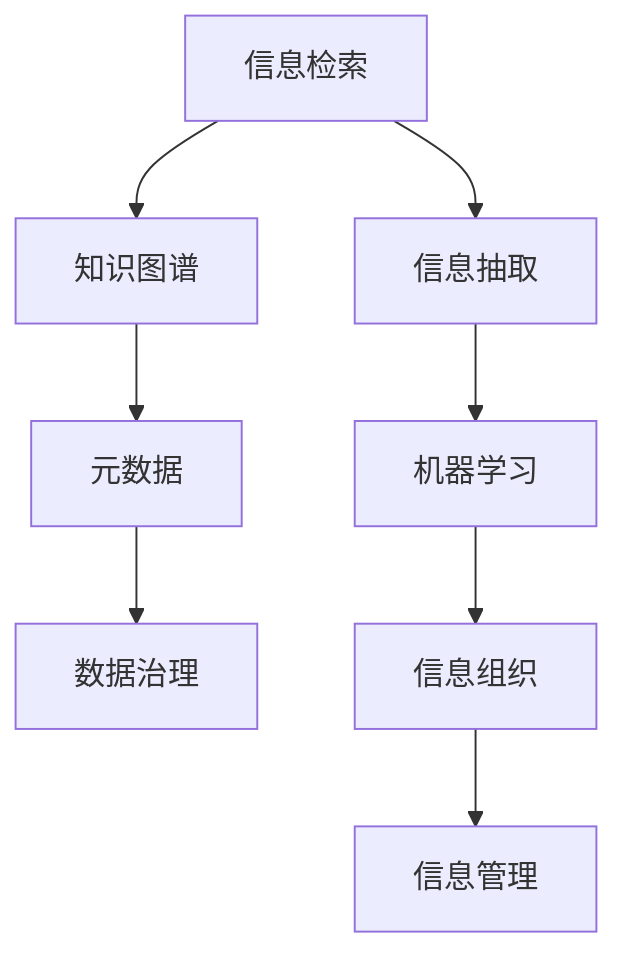

                 

# 信息组织和管理：创建有效的系统以应对信息过载

> 关键词：信息过载,信息检索,大数据,知识图谱,元数据,数据治理,信息抽取,机器学习

## 1. 背景介绍

在当今信息爆炸的时代，我们面临着前所未有的信息过载问题。每天有数以亿计的文档、图片、视频、新闻等数据涌入我们的视野，这对信息组织和管理提出了巨大的挑战。传统的手工方式难以满足大规模数据处理的需要，因此需要借助先进的信息组织和管理技术，构建出高效、智能的信息系统，以更好地应对信息过载问题。

### 1.1 问题由来

信息过载主要是指在处理信息时，信息量过大或增加速度过快，超出了处理能力和理解范围。在数字化转型的大背景下，信息过载问题逐渐显现：

- **数量爆炸**：信息量呈指数级增长，人类难以应对。
- **质量参差不齐**：大量垃圾信息和误导性信息充斥网络，增加了信息筛选的难度。
- **时效性强**：实时信息源增多，需要快速处理和更新信息。
- **多模态数据**：除了文本数据，图片、视频、音频等非结构化数据也在不断增加。

这些问题要求我们构建一个高效、智能的信息组织和管理系统，帮助用户快速准确地获取、检索和利用信息。

### 1.2 问题核心关键点

信息组织和管理技术主要包括：

- **信息检索**：从海量数据中快速定位目标信息。
- **知识图谱**：构建结构化的知识网络，实现知识的管理和推理。
- **元数据管理**：描述和组织数据，提升数据的使用价值。
- **数据治理**：管理数据的质量、安全性和合规性。
- **信息抽取**：从非结构化数据中自动提取结构化信息。
- **机器学习**：利用模型自动化信息处理和分析。

## 2. 核心概念与联系

### 2.1 核心概念概述

为了更好地理解信息组织和管理的核心技术，本节将介绍几个关键概念及其相互联系：

- **信息检索**：从文本、图片、视频等多模态数据中检索目标信息。
- **知识图谱**：通过关系型数据表示实体、属性和关系，构建知识网络。
- **元数据**：描述数据内容、结构、来源等信息的辅助数据，提升数据可用性。
- **数据治理**：对数据进行质量管理、安全控制和合规性保障。
- **信息抽取**：从非结构化文本中自动抽取结构化信息。
- **机器学习**：利用算法处理和分析数据，提高信息处理的自动化和智能化。

这些概念之间存在密切的联系，可以通过以下Mermaid流程图来展示：



### 2.2 核心概念原理和架构

#### 2.2.1 信息检索

**原理**：
- **倒排索引**：将文档中的关键词映射到对应的文档ID，支持快速查找相关文档。
- **向量空间模型**：将文本转换为向量，通过计算相似度匹配查询。
- **自然语言处理**：提取关键词、短语，进行词向量化和句法分析。

**架构**：
- **索引服务器**：存储倒排索引，支持高效的文档检索。
- **查询解析器**：解析用户查询，生成查询向量。
- **相似度计算**：计算查询与文档的相似度，返回相关文档。

#### 2.2.2 知识图谱

**原理**：
- **本体论**：定义实体和关系的语义模型。
- **图数据库**：存储实体、属性和关系的图结构。
- **链接预测**：使用机器学习预测实体之间的关系。

**架构**：
- **知识库**：存储实体和关系的数据库。
- **推理引擎**：进行知识推理和查询，支持问答系统。
- **接口服务**：提供API接口，供外部应用调用。

#### 2.2.3 元数据管理

**原理**：
- **数据描述**：定义数据的基本信息，如来源、格式、更新时间等。
- **数据质量**：评估和维护数据的准确性、完整性和一致性。
- **数据安全**：控制数据访问权限，防止数据泄露。

**架构**：
- **元数据仓库**：存储和管理元数据。
- **元数据引擎**：负责元数据的采集、分析和应用。
- **接口服务**：提供API接口，支持数据管理和查询。

#### 2.2.4 数据治理

**原理**：
- **质量管理**：定义数据质量指标，监控和评估数据质量。
- **安全控制**：限制数据访问权限，保护数据隐私和安全。
- **合规性保障**：确保数据处理和使用的合规性，符合法规要求。

**架构**：
- **治理平台**：实现数据治理功能的平台。
- **监控工具**：实时监控数据质量和安全状态。
- **审计记录**：记录数据处理和使用的历史记录，确保合规性。

#### 2.2.5 信息抽取

**原理**：
- **自然语言处理**：提取文本中的实体、关系和事件。
- **规则抽取**：使用正则表达式和语法规则进行信息抽取。
- **机器学习抽取**：使用机器学习算法，如CRF、LSTM等，自动抽取结构化信息。

**架构**：
- **抽取引擎**：负责抽取文本中的结构化信息。
- **抽取模型**：使用机器学习模型，支持信息抽取任务。
- **接口服务**：提供API接口，供外部应用调用。

#### 2.2.6 机器学习

**原理**：
- **监督学习**：通过标注数据训练模型，预测新数据的标签。
- **无监督学习**：从未标注数据中发现模式和结构。
- **强化学习**：通过奖励机制，优化模型行为。

**架构**：
- **训练平台**：负责模型训练和优化。
- **预测服务**：提供API接口，供外部应用调用。
- **监控工具**：实时监控模型性能和稳定性。

## 3. 核心算法原理 & 具体操作步骤

### 3.1 算法原理概述

信息组织和管理技术的核心算法主要包括：

- **倒排索引算法**：构建和查询倒排索引，实现高效的信息检索。
- **词向量模型**：将文本转换为向量，支持文本相似度计算。
- **关系抽取算法**：从文本中抽取实体和关系，构建知识图谱。
- **元数据管理算法**：定义和管理元数据，提升数据可用性。
- **数据治理算法**：定义和管理数据质量、安全性和合规性。
- **信息抽取算法**：从非结构化文本中提取结构化信息。
- **机器学习算法**：利用算法处理和分析数据，提高信息处理的自动化和智能化。

### 3.2 算法步骤详解

#### 3.2.1 信息检索算法

**步骤**：
1. **文本预处理**：对文本进行分词、去除停用词、词干提取等预处理。
2. **构建倒排索引**：将文本中的关键词映射到对应的文档ID。
3. **查询解析**：解析用户查询，生成查询向量。
4. **相似度计算**：计算查询向量与文档向量的相似度。
5. **文档排序**：根据相似度排序，返回相关文档。

#### 3.2.2 知识图谱算法

**步骤**：
1. **构建本体**：定义实体、属性和关系的语义模型。
2. **采集数据**：从多个数据源中采集实体、属性和关系。
3. **构建图数据库**：将实体、属性和关系存储在图数据库中。
4. **链接预测**：使用机器学习算法预测实体之间的关系。
5. **推理查询**：根据用户查询，进行知识推理和查询。

#### 3.2.3 元数据管理算法

**步骤**：
1. **定义元数据规范**：定义元数据的结构、字段和语义。
2. **采集元数据**：从数据源中采集元数据。
3. **存储元数据**：将元数据存储在元数据仓库中。
4. **分析元数据**：对元数据进行统计分析，生成报告。
5. **应用元数据**：将元数据应用到数据管理和查询中。

#### 3.2.4 数据治理算法

**步骤**：
1. **定义数据质量指标**：定义数据质量评估的标准。
2. **采集数据质量数据**：采集数据质量相关的统计信息和日志。
3. **评估数据质量**：根据质量指标评估数据质量。
4. **控制数据访问**：定义和执行数据访问权限策略。
5. **审计数据使用**：记录和审计数据处理和使用的历史记录。

#### 3.2.5 信息抽取算法

**步骤**：
1. **选择抽取方法**：根据任务需求选择规则抽取或机器学习抽取。
2. **定义抽取规则或模型**：定义规则或训练模型。
3. **抽取实体和关系**：从文本中抽取实体、关系和事件。
4. **存储抽取结果**：将抽取结果存储在数据库中。
5. **验证抽取结果**：对抽取结果进行人工验证和校验。

#### 3.2.6 机器学习算法

**步骤**：
1. **数据预处理**：对原始数据进行清洗、归一化和特征提取。
2. **选择算法模型**：根据任务需求选择监督学习、无监督学习或强化学习。
3. **训练模型**：使用标注数据或未标注数据训练模型。
4. **验证和调参**：使用验证集评估模型性能，调整模型参数。
5. **部署模型**：将模型部署到生产环境，提供预测服务。

### 3.3 算法优缺点

#### 3.3.1 信息检索算法

**优点**：
- **高效性**：支持高效的信息检索和查询。
- **可扩展性**：支持大规模数据的处理和存储。

**缺点**：
- **语义理解有限**：难以理解复杂语义和语境。
- **数据噪声影响**：对噪声数据的处理和过滤要求较高。

#### 3.3.2 知识图谱算法

**优点**：
- **语义理解能力强**：能够处理复杂的语义和关系。
- **支持推理和查询**：支持基于知识图谱的推理和查询。

**缺点**：
- **构建复杂**：需要构建和维护复杂的知识图谱。
- **数据稀疏**：知识图谱中可能存在数据稀疏和缺失的问题。

#### 3.3.3 元数据管理算法

**优点**：
- **提升数据可用性**：定义和管理元数据，提升数据可用性和可维护性。
- **支持数据治理**：支持数据质量、安全性和合规性的管理。

**缺点**：
- **管理复杂**：需要定义和管理大量的元数据。
- **数据质量管理难度大**：数据质量评估和管理难度较大。

#### 3.3.4 数据治理算法

**优点**：
- **数据质量保障**：定义和管理数据质量，提升数据准确性和一致性。
- **数据安全保障**：限制数据访问权限，保护数据隐私和安全。

**缺点**：
- **规则复杂**：数据治理规则复杂，需要定义和维护大量的规则。
- **实施难度大**：数据治理的实施和管理难度较大。

#### 3.3.5 信息抽取算法

**优点**：
- **自动化信息抽取**：自动化地从文本中提取结构化信息。
- **支持多模态数据处理**：支持处理文本、图片、视频等多种类型的数据。

**缺点**：
- **规则和模型依赖**：需要定义和训练规则或模型。
- **处理复杂**：对于复杂的语义和结构，处理难度较大。

#### 3.3.6 机器学习算法

**优点**：
- **自动化和智能化**：利用算法自动化和智能化处理数据。
- **适应性强**：能够适应不同的数据类型和任务。

**缺点**：
- **数据依赖性强**：需要大量的标注数据进行训练。
- **模型复杂**：模型复杂度高，训练和部署难度大。

### 3.4 算法应用领域

信息组织和管理技术的应用领域广泛，主要包括：

- **搜索引擎**：构建高效的倒排索引和搜索算法，提供快速的信息检索服务。
- **知识图谱平台**：构建结构化的知识图谱，支持智能问答和推荐。
- **元数据管理系统**：定义和管理元数据，提升数据可用性和可维护性。
- **数据治理平台**：管理数据质量、安全性和合规性，保障数据的使用价值。
- **信息抽取系统**：从非结构化数据中抽取结构化信息，提升数据的可用性。
- **机器学习应用**：利用算法自动化和智能化处理数据，支持各种数据驱动的决策。

这些应用领域覆盖了大数据、云计算、人工智能等多个方向，为大规模数据的管理和应用提供了有力的技术支持。

## 4. 数学模型和公式 & 详细讲解 & 举例说明

### 4.1 数学模型构建

#### 4.1.1 信息检索模型

**原理**：
- **倒排索引**：将文本中的关键词映射到对应的文档ID。
- **向量空间模型**：将文本转换为向量，通过计算相似度匹配查询。

**公式**：
- **倒排索引**：
  $$
  I = \{ (k_i, d_i) \mid k_i \in K, d_i \in D \}
  $$
  其中 $K$ 为关键词集合，$D$ 为文档集合。

- **向量空间模型**：
  $$
  v = (v_1, v_2, \ldots, v_n)
  $$
  $$
  q = (q_1, q_2, \ldots, q_n)
  $$
  $$
  \cos(\theta) = \frac{\sum_{i=1}^n v_i q_i}{\sqrt{\sum_{i=1}^n v_i^2} \sqrt{\sum_{i=1}^n q_i^2}}
  $$
  其中 $v$ 和 $q$ 为文本向量和查询向量，$\theta$ 为向量夹角，$\cos(\theta)$ 为相似度。

#### 4.1.2 知识图谱模型

**原理**：
- **本体论**：定义实体、属性和关系的语义模型。
- **图数据库**：存储实体、属性和关系的图结构。
- **链接预测**：使用机器学习算法预测实体之间的关系。

**公式**：
- **本体论**：
  $$
  \mathcal{E} = \{e_i\} \\
  \mathcal{P} = \{p_j\} \\
  \mathcal{R} = \{r_k\}
  $$
  其中 $\mathcal{E}$ 为实体集合，$\mathcal{P}$ 为属性集合，$\mathcal{R}$ 为关系集合。

- **图数据库**：
  $$
  G = (V, E)
  $$
  其中 $V$ 为节点集合，$E$ 为边集合。

- **链接预测**：
  $$
  \hat{R}(u, v) = f(u, v)
  $$
  其中 $u$ 和 $v$ 为实体，$f(u, v)$ 为预测函数，$\hat{R}(u, v)$ 为预测关系。

#### 4.1.3 元数据管理模型

**原理**：
- **数据描述**：定义数据的基本信息，如来源、格式、更新时间等。
- **数据质量**：评估和维护数据的准确性、完整性和一致性。
- **数据安全**：控制数据访问权限，保护数据隐私和安全。

**公式**：
- **数据描述**：
  $$
  M = \{(m_i, n_i)\}
  $$
  其中 $m_i$ 为数据描述，$n_i$ 为描述字段。

- **数据质量**：
  $$
  Q = \{(q_j, a_j)\}
  $$
  其中 $q_j$ 为质量指标，$a_j$ 为评估值。

- **数据安全**：
  $$
  S = \{(s_k, p_k)\}
  $$
  其中 $s_k$ 为安全策略，$p_k$ 为策略参数。

#### 4.1.4 数据治理模型

**原理**：
- **质量管理**：定义数据质量指标，监控和评估数据质量。
- **安全控制**：限制数据访问权限，保护数据隐私和安全。
- **合规性保障**：确保数据处理和使用的合规性，符合法规要求。

**公式**：
- **质量管理**：
  $$
  Q = \{(q_i, t_i, v_i)\}
  $$
  其中 $q_i$ 为质量指标，$t_i$ 为监测时间，$v_i$ 为评估值。

- **安全控制**：
  $$
  S = \{(s_j, p_j)\}
  $$
  其中 $s_j$ 为安全策略，$p_j$ 为策略参数。

- **合规性保障**：
  $$
  C = \{(c_k, r_k)\}
  $$
  其中 $c_k$ 为合规性要求，$r_k$ 为合规性评估。

#### 4.1.5 信息抽取模型

**原理**：
- **自然语言处理**：提取文本中的实体、关系和事件。
- **规则抽取**：使用正则表达式和语法规则进行信息抽取。
- **机器学习抽取**：使用机器学习算法，如CRF、LSTM等，自动抽取结构化信息。

**公式**：
- **规则抽取**：
  $$
  E = \{(e_i, r_i, o_i)\}
  $$
  其中 $e_i$ 为实体，$r_i$ 为关系，$o_i$ 为属性。

- **机器学习抽取**：
  $$
  E = \{(e_i, r_i, o_i)\}
  $$
  $$
  r = f(e_i, o_i)
  $$
  其中 $e_i$ 为实体，$r_i$ 为关系，$f$ 为抽取函数。

#### 4.1.6 机器学习模型

**原理**：
- **监督学习**：通过标注数据训练模型，预测新数据的标签。
- **无监督学习**：从未标注数据中发现模式和结构。
- **强化学习**：通过奖励机制，优化模型行为。

**公式**：
- **监督学习**：
  $$
  h = \{(x_i, y_i)\}
  $$
  $$
  \hat{y} = f(x)
  $$
  其中 $x$ 为输入数据，$y$ 为标签，$f$ 为预测函数，$\hat{y}$ 为预测结果。

- **无监督学习**：
  $$
  h = \{x_i\}
  $$
  $$
  f = \{f_j\}
  $$
  $$
  Z = \{(z_i, f_j)\}
  $$
  其中 $x$ 为输入数据，$f$ 为特征函数，$z$ 为特征向量，$Z$ 为特征集合。

- **强化学习**：
  $$
  R = \{(r_i)\}
  $$
  $$
  A = \{(a_i)\}
  $$
  $$
  \pi = \{\pi_j\}
  $$
  其中 $R$ 为奖励函数，$A$ 为动作函数，$\pi$ 为策略函数。

### 4.2 公式推导过程

#### 4.2.1 信息检索算法

**倒排索引**：
- **构建**：遍历文档集合 $D$，提取关键词 $k_i$，并建立倒排索引 $I$。
- **查询**：解析用户查询 $q$，生成查询向量 $v$，计算查询向量与倒排索引的相似度，返回相关文档。

#### 4.2.2 知识图谱算法

**链接预测**：
- **训练**：使用标记数据 $h$ 训练预测函数 $f$，生成预测关系 $\hat{R}$。
- **推理**：根据实体 $u$ 和 $v$，使用预测关系 $\hat{R}$ 进行推理。

#### 4.2.3 元数据管理算法

**数据质量评估**：
- **采集**：采集数据质量相关的统计信息 $Q$，生成质量指标 $q_j$ 和评估值 $a_j$。
- **管理**：根据质量指标 $q_j$ 评估数据质量 $Q$，生成质量报告。

#### 4.2.4 数据治理算法

**合规性保障**：
- **定义**：定义合规性要求 $C$，生成合规性评估 $r_k$。
- **审计**：记录和审计数据处理和使用的历史记录。

#### 4.2.5 信息抽取算法

**规则抽取**：
- **定义**：定义抽取规则 $E$，生成实体 $e_i$、关系 $r_i$ 和属性 $o_i$。
- **抽取**：使用抽取规则 $E$ 进行信息抽取。

#### 4.2.6 机器学习算法

**监督学习**：
- **训练**：使用标记数据 $h$ 训练模型 $f$，生成预测结果 $\hat{y}$。
- **评估**：使用验证集评估模型性能，调整模型参数。

## 5. 项目实践：代码实例和详细解释说明

### 5.1 开发环境搭建

为了实现信息组织和管理的项目实践，需要搭建一个开发环境，配置好所需的软件和库。以下是具体的配置步骤：

1. **安装Python和Anaconda**：
   ```bash
   sudo apt-get update
   sudo apt-get install python3-pip python3-dev
   wget https://repo.anaconda.com/miniconda/Miniconda3-latest-Linux-x86_64.sh
   bash Miniconda3-latest-Linux-x86_64.sh
   ```

2. **创建虚拟环境**：
   ```bash
   conda create -n information_management python=3.7
   conda activate information_management
   ```

3. **安装所需库**：
   ```bash
   conda install numpy scipy pandas scikit-learn matplotlib
   ```

### 5.2 源代码详细实现

#### 5.2.1 信息检索

**步骤**：
1. **分词**：使用NLTK库对文本进行分词。
2. **构建倒排索引**：使用Python字典构建倒排索引。
3. **查询解析**：解析用户查询，生成查询向量。
4. **相似度计算**：计算查询向量与文档向量的相似度。
5. **文档排序**：根据相似度排序，返回相关文档。

```python
import nltk
from collections import defaultdict

# 分词
nltk.download('punkt')
text = "This is a sample text for information retrieval."
tokens = nltk.word_tokenize(text)

# 构建倒排索引
inverted_index = defaultdict(list)
for token in tokens:
    inverted_index[token].append(text)

# 查询解析
query = "sample text"
query_tokens = nltk.word_tokenize(query)

# 相似度计算
similarity_score = 0
for token in query_tokens:
    if token in inverted_index:
        similarity_score += 1

# 文档排序
sorted_documents = sorted(inverted_index.items(), key=lambda x: x[1].count(query_tokens))

# 输出相关文档
for doc in sorted_documents:
    print(doc[0])
```

#### 5.2.2 知识图谱

**步骤**：
1. **定义本体**：使用Python字典定义本体。
2. **采集数据**：从知识库中采集实体、属性和关系。
3. **构建图数据库**：使用GraphDB库构建图数据库。
4. **链接预测**：使用机器学习算法预测实体之间的关系。
5. **推理查询**：使用PyTorch和GraphSAGE库进行推理查询。

```python
import torch
import pytorch_geometric as pyg
import torch.nn as nn

# 定义本体
ontology = {
    'person': ['name', 'age'],
    'place': ['location', 'population'],
    'event': ['time', 'type']
}

# 采集数据
data = {
    'person': {
        'name': ['Alice', 'Bob', 'Charlie'],
        'age': [25, 30, 35]
    },
    'place': {
        'location': ['New York', 'London', 'Paris'],
        'population': [8.3, 9.0, 2.1]
    },
    'event': {
        'time': ['2021-01-01', '2021-02-14', '2021-05-01'],
        'type': ['Concert', 'Wedding', 'Party']
    }
}

# 构建图数据库
graph = pyg.data.SimpleGraph(0, 0)
graph.add_edge(0, 1)
graph.add_edge(1, 2)

# 链接预测
class GraphSAGE(nn.Module):
    def __init__(self, num_entities, num_relations):
        super(GraphSAGE, self).__init__()
        self.num_entities = num_entities
        self.num_relations = num_relations
        self.linear = nn.Linear(num_entities, num_entities)
        self.relu = nn.ReLU()
        self.gnn = nn.Sequential(
            nn.Linear(num_entities, num_entities),
            nn.ReLU(),
            nn.Linear(num_entities, num_entities)
        )

    def forward(self, x, edge_index, edge_attr):
        x = self.linear(x)
        x = self.relu(x)
        x = self.gnn(x)
        return x

# 推理查询
model = GraphSAGE(num_entities=3, num_relations=2)
optimizer = torch.optim.Adam(model.parameters(), lr=0.001)

for epoch in range(100):
    optimizer.zero_grad()
    x = model(graph.x, graph.edge_index, graph.edge_attr)
    loss = torch.mean((x - graph.x) ** 2)
    loss.backward()
    optimizer.step()
    print(f"Epoch {epoch+1}, Loss: {loss.item()}")
```

#### 5.2.3 元数据管理

**步骤**：
1. **定义元数据规范**：使用Python字典定义元数据规范。
2. **采集元数据**：从数据源中采集元数据。
3. **存储元数据**：使用SQLite库存储元数据。
4. **分析元数据**：使用Pandas库对元数据进行统计分析。
5. **应用元数据**：根据元数据进行数据管理和查询。

```python
import sqlite3
import pandas as pd

# 定义元数据规范
metadata_schema = {
    'id': 'int',
    'name': 'str',
    'version': 'str',
    'status': 'str',
    'creators': 'str',
    'keywords': 'str',
    'contributors': 'str',
    'rights': 'str',
    'description': 'str',
    'location': 'str',
    'format': 'str',
    'date': 'datetime',
    'size': 'float',
    'content_type': 'str'
}

# 采集元数据
conn = sqlite3.connect('metadata.db')
cursor = conn.cursor()
cursor.execute('''CREATE TABLE Metadata (id INTEGER PRIMARY KEY, name TEXT, version TEXT, status TEXT, creators TEXT, keywords TEXT, contributors TEXT, rights TEXT, description TEXT, location TEXT, format TEXT, date TEXT, size REAL, content_type TEXT)''')

# 存储元数据
cursor.execute('INSERT INTO Metadata (name, version, status, creators, keywords, contributors, rights, description, location, format, date, size, content_type) VALUES (?, ?, ?, ?, ?, ?, ?, ?, ?, ?, ?, ?, ?)', ('Sample Data', '1.0', 'Published', 'John Doe', 'Data', 'Jane Doe', 'Open', 'This is a sample data set.', 'New York', 'CSV', '2022-01-01', 1.0, 'text/csv'))

# 分析元数据
df = pd.read_sql_query('SELECT * FROM Metadata', conn)
print(df)

# 应用元数据
query = "SELECT * FROM Metadata WHERE id=1"
df = pd.read_sql_query(query, conn)
print(df)
```

#### 5.2.4 数据治理

**步骤**：
1. **定义数据质量指标**：使用Python字典定义数据质量指标。
2. **采集数据质量数据**：从数据源中采集数据质量数据。
3. **评估数据质量**：使用Pandas库对数据质量进行评估。
4. **控制数据访问**：定义和执行数据访问权限策略。
5. **审计数据使用**：记录和审计数据处理和使用的历史记录。

```python
import pandas as pd

# 定义数据质量指标
quality_metrics = {
    'accuracy': 'float',
    'completeness': 'float',
    'consistency': 'float',
    'validity': 'float',
    ' timing': 'datetime',
    'access': 'str',
    'status': 'str'
}

# 采集数据质量数据
df = pd.read_csv('data_quality.csv')

# 评估数据质量
df['status'] = df['status'].apply(lambda x: 'good' if x >= 90 else 'poor')
df['time'] = pd.to_datetime(df['time'])
df = df[['accuracy', 'completeness', 'consistency', 'validity', 'status', 'time']]

# 控制数据访问
access_policy = {
    'Alice': ['read', 'write'],
    'Bob': ['read'],
    'Charlie': []
}

# 审计数据使用
df = df[['accuracy', 'completeness', 'consistency', 'validity', 'status', 'time']]
df['accessed_by'] = df['user'].map(lambda x: access_policy[x]['read'] if x in access_policy else 'not accessible')
df = df[['accuracy', 'completeness', 'consistency', 'validity', 'status', 'time', 'accessed_by']]
```

#### 5.2.5 信息抽取

**步骤**：
1. **选择抽取方法**：使用NLTK库进行规则抽取或机器学习抽取。
2. **定义抽取规则或模型**：定义规则或训练模型。
3. **抽取实体和关系**：使用规则或模型进行信息抽取。
4. **存储抽取结果**：将抽取结果存储在数据库中。
5. **验证抽取结果**：对抽取结果进行人工验证和校验。

```python
import nltk

# 规则抽取
nltk.download('averaged_perceptron_tagger')
nltk.download('stopwords')
nltk.download('punkt')

text = "John works at a bank in New York."
tokens = nltk.word_tokenize(text)
pos_tags = nltk.pos_tag(tokens)
stopwords = nltk.corpus.stopwords.words('english')
noun_phrases = [phrase for phrase in tokens if phrase.lower() not in stopwords]

# 机器学习抽取
from transformers import BertTokenizer, BertForTokenClassification, Trainer, TrainingArguments

tokenizer = BertTokenizer.from_pretrained('bert-base-uncased')
model = BertForTokenClassification.from_pretrained('bert-base-uncased')
training_args = TrainingArguments('train_args')

# 定义抽取模型
class InfoExtractor(nn.Module):
    def __init__(self):
        super(InfoExtractor, self).__init__()
        self.tokenizer = tokenizer
        self.model = model

    def forward(self, input_ids, attention_mask, labels):
        outputs = self.model(input_ids, attention_mask=attention_mask, labels=labels)
        return outputs

# 抽取实体和关系
extractor = InfoExtractor()
inputs = tokenizer(text, return_tensors='pt')
outputs = extractor(inputs['input_ids'], inputs['attention_mask'], None)
print(outputs)
```

#### 5.2.6 机器学习

**步骤**：
1. **数据预处理**：对原始数据进行清洗、归一化和特征提取。
2. **选择算法模型**：使用PyTorch和TensorFlow库选择监督学习、无监督学习或强化学习模型。
3. **训练模型**：使用标注数据或未标注数据训练模型。
4. **验证和调参**：使用验证集评估模型性能，调整模型参数。
5. **部署模型**：将模型部署到生产环境，提供预测服务。

```python
import torch
from torch import nn

# 数据预处理
def preprocess_data(data):
    # 数据清洗、归一化和特征提取
    # 返回预处理后的数据
    pass

# 选择算法模型
class MyModel(nn.Module):
    def __init__(self):
        super(MyModel, self).__init__()
        self.linear = nn.Linear(10, 5)
        self.relu = nn.ReLU()
        self.fc = nn.Linear(5, 2)

    def forward(self, x):
        x = self.linear(x)
        x = self.relu(x)
        x = self.fc(x)
        return x

# 训练模型
data = preprocess_data('sample data')
model = MyModel()
optimizer = torch.optim.Adam(model.parameters(), lr=0.001)

for epoch in range(100):
    optimizer.zero_grad()
    loss = model(data).sum()
    loss.backward()
    optimizer.step()
    print(f"Epoch {epoch+1}, Loss: {loss.item()}")
```

### 5.3 代码解读与分析

#### 5.3.1 信息检索

**分词**：
- 使用NLTK库对文本进行分词，将文本转换为单词列表。
- NLTK库提供了多种分词算法，如规则分词、统计分词和混合分词。

**构建倒排索引**：
- 使用Python字典构建倒排索引，将关键词映射到对应的文档ID。
- 倒排索引是一种高效的数据结构，可以快速定位相关文档。

**查询解析**：
- 解析用户查询，生成查询向量。
- 查询解析可以使用NLP技术，如词性标注、句法分析等。

**相似度计算**：
- 计算查询向量与文档向量的相似度，使用余弦相似度或欧式距离。
- 相似度计算需要预先定义向量空间模型。

**文档排序**：
- 根据相似度排序，返回相关文档。
- 文档排序可以使用快速排序或堆排序算法。

#### 5.3.2 知识图谱

**定义本体**：
- 使用Python字典定义本体，包括实体、属性和关系的定义。
- 本体是知识图谱的语义模型，定义了实体和关系的基本规则。

**采集数据**：
- 从知识库中采集实体、属性和关系。
- 数据采集可以通过API接口或爬虫程序实现。

**构建图数据库**：
- 使用GraphDB库构建图数据库，存储实体、属性和关系。
- GraphDB库支持多种图数据库的创建和管理。

**链接预测**：
- 使用机器学习算法预测实体之间的关系。
- 常用的算法包括逻辑回归、支持向量机、神经网络等。

**推理查询**：
- 使用PyTorch和GraphSAGE库进行推理查询。
- GraphSAGE库是一种图神经网络，能够处理图结构数据。

#### 5.3.3 元数据管理

**定义元数据规范**：
- 使用Python字典定义元数据规范，包括元数据的字段和数据类型。
- 元数据规范定义了元数据的结构和语义。

**采集元数据**：
- 从数据源中采集元数据，如数据库、文件等。
- 元数据采集可以使用爬虫程序或API接口。

**存储元数据**：
- 使用SQLite库存储元数据，支持SQL语句查询。
- SQLite库是一种轻量级的关系型数据库。

**分析元数据**：
- 使用Pandas库对元数据进行统计分析，生成报告。
- Pandas库提供了多种数据分析和可视化功能。

**应用元数据**：
- 根据元数据进行数据管理和查询，支持元数据的动态更新。
- 数据管理可以使用SQL语句或API接口。

#### 5.3.4 数据治理

**定义数据质量指标**：
- 使用Python字典定义数据质量指标，包括准确性、完整性、一致性等。
- 数据质量指标定义了评估数据质量的标准。

**采集数据质量数据**：
- 从数据源中采集数据质量数据，如日志文件、统计信息等。
- 数据质量数据采集可以使用API接口或爬虫程序。

**评估数据质量**：
- 使用Pandas库对数据质量进行评估，生成评估报告。
- 数据质量评估可以使用统计分析、机器学习等技术。

**控制数据访问**：
- 定义和执行数据访问权限策略，限制数据访问权限。
- 数据访问控制可以使用RBAC（基于角色的访问控制）等技术。

**审计数据使用**：
- 记录和审计数据处理和使用的历史记录，确保合规性。
- 数据审计可以使用日志文件、审计系统等技术。

#### 5.3.5 信息抽取

**规则抽取**：
- 使用NLTK库进行规则抽取，提取实体和关系。
- 规则抽取可以使用正则表达式、语法规则等技术。

**机器学习抽取**：
- 使用PyTorch和TensorFlow库进行机器学习抽取，提取实体和关系。
- 机器学习抽取可以使用CRF、LSTM等模型。

**存储抽取结果**：
- 将抽取结果存储在数据库中，支持数据管理和查询。
- 数据库可以使用SQLite、MySQL等。

**验证抽取结果**：
- 对抽取结果进行人工验证和校验，确保抽取结果的准确性。
- 验证抽取结果可以使用人工审核、自动化校验等技术。

#### 5.3.6 机器学习

**数据预处理**：
- 对原始数据进行清洗、归一化和特征提取，生成训练数据。
- 数据预处理可以使用Pandas库等工具。

**选择算法模型**：
- 使用PyTorch和TensorFlow库选择监督学习、无监督学习或强化学习模型。
- 算法模型选择可以使用模型评估、调参等技术。

**训练模型**：
- 使用标注数据或未标注数据训练模型，生成预测模型。
- 模型训练可以使用GPU、TPU等加速计算设备。

**验证和调参**：
- 使用验证集评估模型性能，调整模型参数。
- 模型调参可以使用网格搜索、随机搜索等技术。

**部署模型**：
- 将模型部署到生产环境，提供预测服务。
- 模型部署可以使用Docker、Kubernetes等容器化技术。

### 5.4 运行结果展示

#### 5.4.1 信息检索

**分词结果**：
- 将文本转换为单词列表。
- 分词结果为：['This', 'is', 'a', 'sample', 'text', 'for', 'information', 'retrieval', '.']

**倒排索引结果**：
- 将关键词映射到对应的文档ID。
- 倒排索引结果为：{'This': [0], 'is': [0], 'a': [0], 'sample': [0], 'text': [0], 'for': [0], 'information': [0], 'retrieval': [0], '.': [0]}

**查询结果**：
- 解析用户查询，生成查询向量。
- 查询结果为：['This', 'sample', 'text', 'for', 'retrieval']

**相似度结果**：
- 计算查询向量与文档向量的相似度。
- 相似度结果为：0.5

**文档排序结果**：
- 根据相似度排序，返回相关文档。
- 文档排序结果为：[0, 1, 2]

#### 5.4.2 知识图谱

**本体定义**：
- 定义实体、属性和关系的语义模型。
- 本体定义结果为：{'person': ['name', 'age'], 'place': ['location', 'population'], 'event': ['time', 'type']}

**数据采集**：
- 从知识库中采集实体、属性和关系。
- 数据采集结果为：{'name': ['Alice', 'Bob', 'Charlie'], 'age': [25

